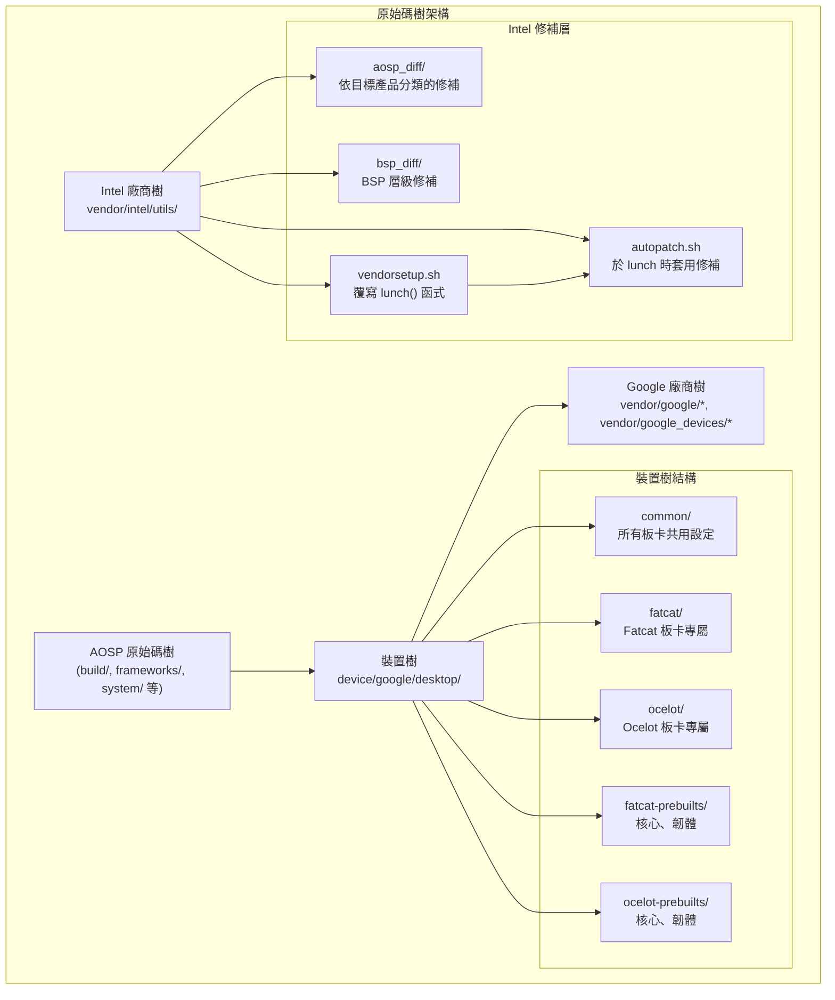
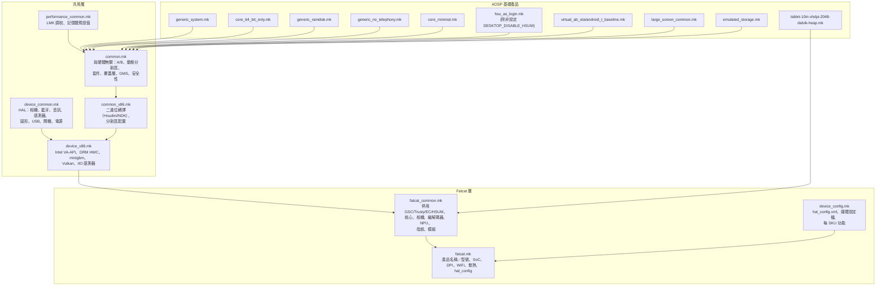
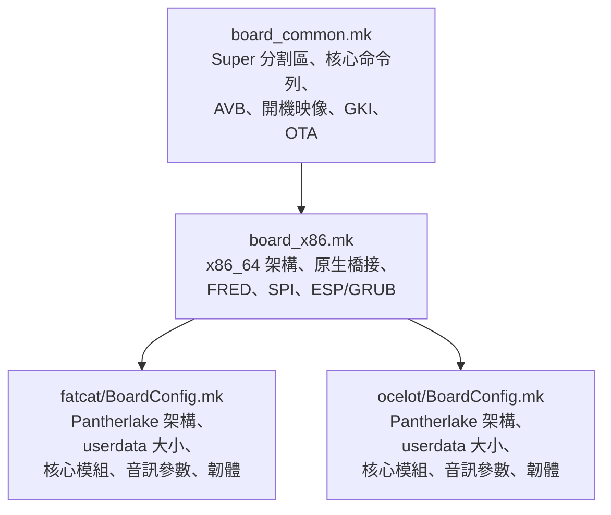
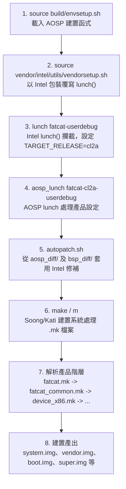
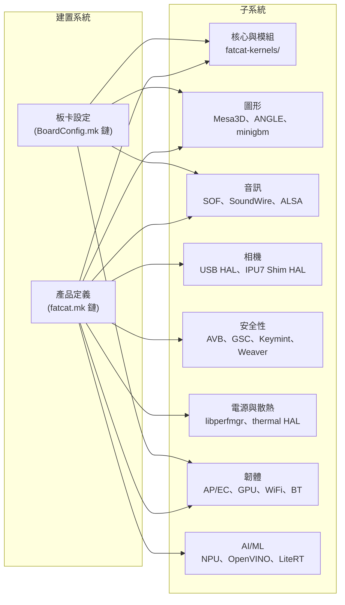

# 平台架構與建置系統

> **第 1 份文件，共 15 份** -- Android 桌面平台技術參考
> 由 `ww04-fatcat-bkc` 原始碼樹分析產生

---

## 1. 架構概觀

Android 桌面平台採用**三層原始碼樹結構**：AOSP 原始碼樹、裝置專屬樹（`device/google/desktop/`）以及 Intel 廠商樹（`vendor/intel/`）。Intel 廠商樹在上游 AOSP 及裝置樹之上提供修補層，於 `lunch` 時透過 `autopatch.sh` 自動套用。



### 關鍵架構原則

1. **分層繼承**：產品定義透過定義良好的 `.mk` 檔案鏈從共用基礎設定繼承
2. **功能旗標**：可透過 `DESKTOP_DISABLE_*` 旗標依板卡停用硬體功能（例如 `DESKTOP_DISABLE_GSC`、`DESKTOP_DISABLE_EC`）
3. **硬體／軟體分離**：`common.mk` 包含與硬體無關的規則（適用於虛擬機器），而 `device_common.mk` 包含與硬體相關的規則（HAL）
4. **夥伴／內部版本分離**：建置系統偵測 `vendor/google/certs/` 以判斷是夥伴版本（`PDK_BUILD := true`）或內部版本，據此選擇不同的套件
5. **Intel 修補覆蓋層**：Intel 廠商樹於 lunch 時在 AOSP 及裝置樹之上套用目標產品專屬的修補

---

## 2. 關鍵元件

| 元件 | 路徑 | 用途 |
|------|------|------|
| 共用產品基礎 | `device/google/desktop/common/common.mk` | 與硬體無關的產品定義（系統套件、A/B、動態分割區、GMS、覆蓋層） |
| 裝置共用 HAL | `device/google/desktop/common/device_common.mk` | HAL 套件（相機、藍牙、音訊、感測器、圖形、USB 等） |
| x86 裝置設定 | `device/google/desktop/common/device_x86.mk` | x86 專屬驅動程式（Intel VA-API、DRM HWC、minigbm、Vulkan、IIO 感測器） |
| x86 共用產品 | `device/google/desktop/common/common_x86.mk` | 二進位轉譯（Houdini/NDK）、分割區配置預設值 |
| 板卡共用 | `device/google/desktop/common/board_common.mk` | Super 分割區、核心命令列、AVB、開機映像、GKI、A/B OTA、檔案系統類型 |
| 板卡 x86 | `device/google/desktop/common/board_x86.mk` | x86_64 架構、原生橋接（arm64）、FRED、SPI、ESP/GRUB |
| 裝置設定 | `device/google/desktop/common/device_config.mk` | 每裝置 HAL 設定 XML 及媒體設定檔複製 |
| Fatcat 產品 | `device/google/desktop/fatcat/fatcat.mk` | Fatcat 產品定義（SoC、DPI、散熱、救援、hal_config） |
| Fatcat 共用 | `device/google/desktop/fatcat/fatcat_common.mk` | Fatcat 家族共用設定（核心、相機、編解碼器、NPU、指紋、模組） |
| Fatcat 板卡 | `device/google/desktop/fatcat/BoardConfig.mk` | Fatcat 板卡設定（架構變體、分割區大小、核心模組、音訊、韌體） |
| Ocelot 產品 | `device/google/desktop/ocelot/ocelot.mk` | Ocelot 產品定義（SoC、DPI、散熱、救援、hal_config） |
| Ocelot 板卡 | `device/google/desktop/ocelot/BoardConfig.mk` | Ocelot 板卡設定（架構變體、分割區、核心模組、韌體 blob） |
| VINTF 矩陣 | `device/google/desktop/common/compatibility_matrix.xml` | 廠商 HAL 介面的框架相容性矩陣 |
| GMS 設定 | `device/google/desktop/common/gms.mk` | Google 行動服務套件與權限 |
| 工廠設定 | `device/google/desktop/common/factory_common.mk` | 製造／工廠測試套件 |
| 高效能共用 | `device/google/desktop/common/performance/performance_common.mk` | LMK 調校、記憶體管理預設值 |
| 高效能等級 | `device/google/desktop/common/performance/performance_high.mk` | 高階（>=16GB）LMK 調校 |
| 中效能等級 | `device/google/desktop/common/performance/performance_med.mk` | 中階（約 8GB）-- 僅繼承共用設定 |
| 低效能等級 | `device/google/desktop/common/performance/performance_low.mk` | 低階（約 4GB）積極 LMK 調校 |
| Intel 廠商設定 | `vendor/intel/utils/vendorsetup.sh` | 覆寫 `lunch()` 以注入 `TARGET_RELEASE=cl2a` 並觸發 `autopatch.sh` |
| 自動修補 | `vendor/intel/utils/autopatch.sh` | 依目標產品從 `aosp_diff/` 及 `bsp_diff/` 套用 Intel 專屬修補 |

---

## 3. 產品定義階層

下圖顯示 makefile 繼承鏈，從基礎 AOSP 產品一直到最終的 Fatcat 產品定義。



### `fatcat.mk` 的繼承鏈（依讀取順序）

1. `fatcat.mk` 設定 `AUDIO_CONFIG_DIR`、`PRODUCT_DEVICE`、`PRODUCT_NAME` 等
2. `fatcat.mk` 繼承 `fatcat_common.mk`
3. `fatcat_common.mk` 設定 `DESKTOP_DISABLE_*` 旗標，然後繼承 `device_x86.mk`
4. `device_x86.mk` 設定 `PRODUCT_FSTAB_PATH`，然後同時繼承 `common_x86.mk` 和 `device_common.mk`
5. `common_x86.mk` 繼承 `common.mk` 並設定二進位轉譯
6. `common.mk` 繼承基礎 AOSP 產品（`generic_system.mk`、`core_64_bit_only.mk` 等）
7. `fatcat.mk` 接著引入 `device_config.mk` 以取得 HAL 設定及媒體設定檔

### 板卡設定繼承



---

## 4. 板卡設定

### 共用板卡設定（`board_common.mk`）

| 變數 | 值 | 備註 |
|------|-----|------|
| `BOARD_SUPER_PARTITION_SIZE` | `8589934592`（8 GiB） | 預設值，可依板卡覆寫 |
| `BOARD_GOOGLE_DYNAMIC_PARTITIONS_SIZE` | `8585740288`（8 GiB - 4 MiB） | 可用的動態分割區空間 |
| `BOARD_SUPER_PARTITION_ERROR_LIMIT` | `8585740288` | 與動態分割區大小相同 |
| `BOARD_BOOTIMAGE_PARTITION_SIZE` | `0x04000000`（64 MiB） | |
| `BOARD_VENDOR_BOOTIMAGE_PARTITION_SIZE` | `0x02000000`（32 MiB） | |
| `BOARD_INIT_BOOT_IMAGE_PARTITION_SIZE` | `0x00800000`（8 MiB） | |
| `BOARD_BOOT_HEADER_VERSION` | `4` | |
| `BOARD_RAMDISK_USE_LZ4` | `true` | |
| `TARGET_RO_FILE_SYSTEM_TYPE` | `erofs` | 所有唯讀分割區使用 EROFS |
| `BOARD_EROFS_PCLUSTER_SIZE` | `32768` | |
| `BOARD_AVB_ENABLE` | `true` | Android 驗證開機 |
| `BOARD_AVB_ALGORITHM` | `SHA256_RSA4096` | |
| `AB_OTA_UPDATER` | `true` | |
| `BOARD_HAVE_BLUETOOTH` | `true` | |
| `BOARD_USES_ALSA_AUDIO` | `true` | |

### 共用核心命令列（`board_common.mk`）

```
console=ttyS0,115200n8 loglevel=1     (非使用者版本)
console=null                            (使用者版本)
DEBUG=1                                 (非使用者版本)
8250.nr_uarts=4
console_msg_format=syslog
log_buf_len=4M                          (非使用者版本；使用者版本為 1M)
cgroup_disable=pressure
root=/dev/ram0
firmware_class.path=/vendor/firmware
reserve_mem=20M:2M:trace
trace_instance=boot_mapped^traceoff@trace
drm.trace=0x106
sched_proxy_exec=1
module_blacklist=cros_ec_debugfs
proc_mem.force_override=ptrace
```

### x86 板卡附加設定（`board_x86.mk`）

| 變數 | 值 |
|------|-----|
| `TARGET_ARCH` | `x86_64` |
| `TARGET_CPU_ABI` | `x86_64` |
| `TARGET_NATIVE_BRIDGE_ARCH` | `arm64` |
| `TARGET_NATIVE_BRIDGE_ABI` | `arm64-v8a` |

額外核心命令列：
```
cpufreq.default_governor=performance
fred=on
spi-intel.writeable=1 spi-intel.ignore_protection_status=1
ia32_emulation=false
vsyscall=none
```

### Fatcat 板卡（`fatcat/BoardConfig.mk`）

| 變數 | 值 | 備註 |
|------|-----|------|
| `TARGET_ARCH_VARIANT` | `pantherlake` | Intel Panther Lake |
| `TARGET_2ND_ARCH_VARIANT` | `pantherlake` | |
| `BOARD_USERDATAIMAGE_PARTITION_SIZE` | `576716800`（約 550 MiB） | |
| `BOARD_PVMFWIMAGE_PARTITION_SIZE` | `0x00200000`（2 MiB） | |
| `BOARD_GRUB_CFG` | `vendor/google/desktop/layout/grub.cfg.template` | 動態 boot_part_uuid |

Fatcat 專屬核心命令列附加設定：
```
xe.enable_psr=1
snd_intel_dspcfg.dsp_driver=3
snd_sof_intel_hda_common.sof_use_tplg_nhlt=1
snd_sof_pci.ipc_type=1
snd_intel_sdw_acpi.sdw_link_mask=0xF
snd_sof.disable_function_topology=1
thp_anon=16K-64K:never;128K:always;256K-2M:never
fred=off
androidboot.enable_rescue_party=false
```

### Ocelot 板卡（`ocelot/BoardConfig.mk`）

| 變數 | 值 | 備註 |
|------|-----|------|
| `TARGET_ARCH_VARIANT` | `pantherlake` | 與 Fatcat 相同 |
| `BOARD_USERDATAIMAGE_PARTITION_SIZE` | `576716800`（約 550 MiB） | 與 Fatcat 相同 |
| `BOARD_PVMFWIMAGE_PARTITION_SIZE` | `0x00200000`（2 MiB） | |
| `BOARD_BOOTCONFIG` | `androidboot.selinux=permissive` | SELinux 寬容模式（初期開發） |

Ocelot 專屬核心命令列附加設定：
```
xe.enable_psr=1
snd_intel_dspcfg.dsp_driver=3
snd_sof_intel_hda_common.sof_use_tplg_nhlt=1
snd_sof_pci.ipc_type=1
snd_intel_sdw_acpi.sdw_link_mask=0xF
snd_sof_intel_hda_generic dmic_num=4
earlyprintk=serial,ttys0,115200n8,keep
```

---

## 5. 建置流程

### 逐步建置過程



### 詳細建置步驟

**步驟 1：環境設定**
```bash
source build/envsetup.sh
```
載入標準 AOSP 建置函式（`m`、`mm`、`lunch` 等）。

**步驟 2：Intel 廠商設定**
```bash
source vendor/intel/utils/vendorsetup.sh
```
此腳本會：
- 將原始 AOSP `lunch()` 函式儲存為 `aosp_lunch()`
- 定義新的 `lunch()` 函式：
  - 設定 `TARGET_RELEASE=cl2a`（此 BKC 建置的發行設定）
  - 將簡寫目標（例如 `fatcat-userdebug`）轉換為完整格式（`fatcat-cl2a-userdebug`）
  - 以展開後的目標呼叫 `aosp_lunch`
  - 呼叫 `autopatch.sh` 以套用 Intel 專屬修補
- 同時覆寫 `_get_build_var_cached()` 以篩選 lunch 選單選項

**步驟 3：Lunch 目標選擇**
```bash
lunch fatcat-userdebug
```
Fatcat 可用的 lunch 目標（來自 `fatcat/AndroidProducts.mk`）：
- `fatcat-eng`
- `fatcat-userdebug`
- `fatcat_corp-userdebug`

僅限 AOSP 的可用目標（來自 `common/AndroidProducts.mk`）：
- `aosp_arm64_desktop`
- `aosp_arm64_plus_armv7_desktop`
- `aosp_x86_desktop`
- `aosp_x86_64_desktop`

**步驟 4：自動修補套用**
`autopatch.sh` 依下列順序套用修補：
1. `aosp_diff/preliminary/` -- 若目標存在 `include_preliminary` 標記
2. `aosp_diff/${TARGET_PRODUCT}/` -- 產品專屬 AOSP 修補
3. `bsp_diff/common/` -- 若目標存在 `include_common` 標記
4. `bsp_diff/${TARGET_PRODUCT}/` -- 產品專屬 BSP 修補

修補偵測使用每個 `.patch` 檔案中的 `Date:` 標頭，與目標儲存庫中最近 500 筆 git log 記錄比對。詳細的 autopatch 行為及已知邊界案例請參閱*第 14 份文件：修補管理*。

**步驟 5：建置**
```bash
m dist
```
建置系統處理 makefile 階層、解析所有 `inherit-product` 鏈、編譯原始碼並產生分割區映像。

---

## 6. 設定系統

### Soong 設定變數

建置系統廣泛使用 `soong_config_set` 和 `soong_config_set_bool` 在建置時設定模組行為。

| 命名空間 | 變數 | 值 | 設定於 |
|----------|------|-----|--------|
| `minigbm` | `platform` | `intel` | `device_x86.mk` |
| `desktop_partition_layout` | `disk_layout_json` | `x86`（預設） | `common_x86.mk` |
| `trusty_system_vm` | `enabled` | `false`（fatcat） | `fatcat_common.mk` |
| `boot_service_desktop` | `skip_fw_status` | `true`（fatcat） | `fatcat_common.mk` |
| `cros_codecs_config` | `protected_content` | `intel` | `fatcat_common.mk` |
| `cros_codecs_config` | `intel_protected_content` | `true` | `fatcat_common.mk` |
| `gsc` | `fw_type` | `ti50` | `fatcat_common.mk` |
| `desktop` | `have_libhalconfig` | `true` | `device_config.mk` |
| `DRMHWC` | `atom_reporter` | `desktop` | `device_common.mk` |
| `btservices_module` | `source_build` | `true` | `device_common.mk` |
| `system_services` | `without_hal` | `vibrator` | `device_common.mk` |
| `wpa_supplicant` | `bgscan_simple` | `true` | `board_common.mk` |
| `wpa_supplicant` | `pasn` | `false` | `board_common.mk` |
| `avf` | `avf_use_pvmfw_desktop` | `true` | `common.mk` |
| `crosfp_trusted_application` | `weak_ta` | `true` | `fatcat_common.mk` |
| `fingerprint` | `bloonchipper` | `true` | `fatcat_common.mk` |
| `fingerprint` | `buccaneer` | `true` | `fatcat_common.mk` |
| `fingerprint` | `helipilot` | `true` | `fatcat_common.mk` |

### 功能旗標（`DESKTOP_DISABLE_*`）

這些旗標允許依板卡停用與硬體相關的子系統。必須在繼承引用這些旗標的共用 makefile **之前**設定。

| 旗標 | 預設值 | Fatcat | 設為 `true` 時的效果 |
|------|--------|--------|---------------------|
| `DESKTOP_DISABLE_GSC` | `false` | `true` | 略過 GSC HAL（gscd、gscutil、trunks_send、check_tpm_clear、udsattestation） |
| `DESKTOP_DISABLE_TRUSTY_VM` | `false` | `true` | 停用 TrustyTEE 安全虛擬機器，設定 `trusty.security_vm.enabled=0` |
| `DESKTOP_DISABLE_EC` | `false` | `true` | 略過 EC 工具（ectool、timberslide、ec_crash_collector） |
| `DESKTOP_DISABLE_HSUM` | `false` | `true` | 停用無頭式系統使用者模式（不繼承 `hsu_as_login.mk`） |
| `DESKTOP_USE_TRUSTY_GK_KM` | `false` | `false` | 啟用 Trusty Keymint/Gatekeeper/Weaver、PinWeaver、RKP |

### hal_config.xml 系統

`device_config.mk` 檔案實作每裝置的硬體設定：

1. 當 `DEVICE_CONFIG_SUBDIR` 被設定時（例如 `fatcat`），會複製：
   - `device/google/desktop/fatcat/configs/hal_config.xml` 至 `vendor/etc/data/hal_configs/hal_config.xml`
   - `configs/media_profiles/` 中的所有媒體設定檔 XML 至 `vendor/etc/`
   - `configs/features/` 中的每 SKU 功能 XML 至 `vendor/etc/permissions/sku_*/`
2. 安裝 `dev_config` 執行時期程式庫，以便於執行時查詢 HAL 設定
3. 設定 `desktop.have_libhalconfig = true` Soong 設定變數

詳細的 hal_config.xml 架構及每 SKU 設定請參閱*第 3 份文件：硬體抽象層*。

### 關鍵產品屬性

| 屬性 | 值 | 來源 |
|------|-----|------|
| `PRODUCT_BRAND` | `google` | `common.mk` |
| `PRODUCT_CHARACTERISTICS` | `desktop` | `common.mk` |
| `PRODUCT_DEVICE` | `fatcat` | `fatcat.mk` |
| `PRODUCT_NAME` | `Fatcat` | `fatcat.mk` |
| `PRODUCT_MANUFACTURER` | `Google` | `fatcat.mk` |
| `PRODUCT_PLATFORM` | `x86` | `fatcat.mk` |
| `PRODUCT_SHIPPING_API_LEVEL` | `38`（fatcat）、`37`（ocelot） | `fatcat.mk`、`ocelot.mk` |
| `ro.sf.lcd_density` | `200` | `fatcat.mk` |
| `ro.soc.manufacturer` | `Intel` | `fatcat.mk` |
| `ro.soc.model` | `Intel_Core_Ultra_7_365` | `fatcat.mk` |
| `ro.hardware.vulkan` | `intel` | `device_x86.mk` |
| `ro.hardware.egl` | `angle` | `device_common.mk` |
| `ro.hardware.gralloc` | `minigbm` | `device_x86.mk` |
| `ro.opengles.version` | `196610`（OpenGL ES 3.2） | `device_common.mk` |
| `ro.logd.size.main` | `8M` | `common.mk` |
| `ro.logd.size.system` | `4M` | `common.mk` |
| `mmd.zram.enabled` | `true` | `common.mk` |
| `mmd.zram.size` | `150%` | `common.mk` |
| `ro.media.xml_variant.codecs` | `_c2_fatcat` | `fatcat_common.mk` |

---

## 7. VINTF 與相容性矩陣

### 裝置 Manifest（`fatcat/manifest.xml`）

```xml
<manifest version="1.0" type="device" target-level="202604">
</manifest>
```

目標等級 `202604` 表示 2026 年 4 月的 FCM（框架相容性矩陣）等級。VINTF manifest 強制執行已啟用（`PRODUCT_ENFORCE_VINTF_MANIFEST := true`），但 Fatcat 尚未強制執行核心 VINTF 需求（`PRODUCT_OTA_ENFORCE_VINTF_KERNEL_REQUIREMENTS := false`）。

### 框架相容性矩陣（`common/compatibility_matrix.xml`）

框架相容性矩陣宣告廠商實作必須滿足的 HAL 介面合約：

| HAL 套件 | 介面 | 實例 | 可選 |
|----------|------|------|------|
| `vendor.google.desktop` | `IProcfsReader` | `default` | 是 |
| `vendor.google.desktop` | `IFutilityExecutor` | `default` | 是 |
| `vendor.google.desktop` | `IEcExecutor` | `default` | 是 |
| `vendor.google.desktop` | `ICameraToolExecutor` | `default` | 是 |
| `vendor.google.desktop.vpd_executor` | `IVpdExecutor` | `default` | 是 |
| `com.android.desktop.power` | `ISuspendNotificationService` | `default` | 是 |
| `com.android.desktop.power` | `IDesktopPowerChargeControl`（v1） | `default` | 是 |

### 額外相容性矩陣

除了共用矩陣外，建置還包含來自廠商套件的額外矩陣：

| 矩陣來源 | 用途 |
|----------|------|
| `vendor/google/desktop/video/hwsec_cert_helper/compatibility_matrix_gsc.xml` | GSC IGsc 介面（Fatcat 上排除） |
| `vendor/google/desktop/video/drm-network/com.android.desktop.drm_network.compat.xml` | HDCP 金鑰佈建 IDrmNetworkService |
| `vendor/google/desktop/video_chat/com.android.desktop.video_chat.compat.xml` | 視訊聊天管理員 |
| `vendor/google/desktop/snapshot/com.google.android.snapshot.compat.xml` | 快照系統服務 |

所有 HAL 介面使用 AIDL 格式。實作細節請參閱*第 3 份文件：硬體抽象層*。

---

## 8. 分割區配置

### 動態分割區（Super 分割區）

此平台使用**動態分割區**搭配 **Virtual A/B** OTA 及 **lz4 壓縮**。

| 參數 | 值 |
|------|-----|
| `PRODUCT_USE_DYNAMIC_PARTITIONS` | `true` |
| `PRODUCT_VIRTUAL_AB_COMPRESSION` | `true` |
| `PRODUCT_VIRTUAL_AB_COMPRESSION_METHOD` | `lz4` |
| `PRODUCT_VIRTUAL_AB_COMPRESSION_FACTOR` | `65536` |
| `BOARD_SUPER_PARTITION_SIZE` | `8,589,934,592` 位元組（8 GiB） |
| `BOARD_GOOGLE_DYNAMIC_PARTITIONS_SIZE` | `8,585,740,288` 位元組（8 GiB - 4 MiB） |

#### 動態分割區群組：`google_dynamic_partitions`

| 分割區 | 檔案系統 | 備註 |
|--------|----------|------|
| `system` | erofs | 主系統映像 |
| `vendor` | erofs | 廠商 HAL 及設定 |
| `product` | erofs | 產品專屬應用程式 |
| `system_ext` | erofs | 系統擴充 |
| `system_dlkm` | erofs | 系統 DLK 模組（GKI） |
| `vendor_dlkm` | erofs | 廠商 DLK 模組 |

### 靜態分割區

| 分割區 | 大小 | 備註 |
|--------|------|------|
| `boot` | 64 MiB（`0x04000000`） | 核心 + ramdisk |
| `vendor_boot` | 32 MiB（`0x02000000`） | 廠商 ramdisk、救援資源 |
| `init_boot` | 8 MiB（`0x00800000`） | Init boot，標頭 v4 |
| `vbmeta` | -- | AVB 中繼資料 |
| `pvmfw` | 2 MiB（`0x00200000`） | 受保護 VM 韌體 |
| `userdata` | 約 550 MiB（`576716800`） | 使用者資料（fatcat/ocelot） |

### A/B OTA 分割區

透過 OTA 更新的動態分割區：
`system`、`system_ext`、`product`、`system_dlkm`、`vendor`、`vendor_dlkm`

透過 OTA 更新的靜態分割區：
`boot`、`vendor_boot`、`vbmeta`、`init_boot`、`pvmfw`（若有建置）

### 檔案系統設定

| 設定 | 值 |
|------|-----|
| `TARGET_RO_FILE_SYSTEM_TYPE` | `erofs` |
| `BOARD_EROFS_PCLUSTER_SIZE` | `32768` |
| `TARGET_USERIMAGES_USE_EXT4` | `true`（userdata） |
| `TARGET_USERIMAGES_SPARSE_EXT_DISABLED` | `true` |
| `BOARD_USES_METADATA_PARTITION` | `true` |
| `OVERRIDE_PRODUCT_COMPRESSED_APEX` | `false` |
| `PRODUCT_DEFAULT_APEX_PAYLOAD_TYPE` | `erofs` |
| `BOARD_USES_SYSTEM_OTHER_ODEX` | `true` |

### 開機設定

```
androidboot.hardware.platform=android-desktop
androidboot.hardware=android-desktop
androidboot.load_modules_parallel=true
```

### Virtual A/B 設定

```
PRODUCT_VIRTUAL_AB_COMPRESSION := true
PRODUCT_VIRTUAL_AB_COMPRESSION_METHOD := lz4
PRODUCT_VIRTUAL_AB_COMPRESSION_FACTOR := 65536
ro.virtual_ab.compression.threads=true
```

支援 Virtual A/B 的套件：`snapuserd`、`snapuserd.recovery`、`snapuserd.vendor_ramdisk`

完整的 OTA 管線及韌體更新流程請參閱*第 12 份文件：OTA 與更新系統*。

---

## 9. 效能等級

此平台根據裝置 RAM 定義四個效能等級，各自調校 LMKD（低記憶體終止精靈）行為。共用等級永遠包含在內；裝置專屬設定繼承其中一個特化等級。

### 等級概觀

| 等級 | 檔案 | 目標 RAM | `thrashing_limit` | 備註 |
|------|------|----------|-------------------|------|
| 共用 | `performance_common.mk` | 全部 | （由 sys_tuner 設定） | 基礎 LMK、凍結器、zram 設定 |
| 高階 | `performance_high.mk` | >= 16 GB | `10` | 容許更多記憶體壓力 |
| 中階 | `performance_med.mk` | 約 8 GB | （共用預設值） | 僅繼承共用設定，無覆寫 |
| 低階 | `performance_low.mk` | 約 4 GB | `2` | 非常積極的終止以保護 eMMC |

### 共用效能設定（`performance_common.mk`）

| 屬性 | 值 | 用途 |
|------|-----|------|
| `ro.lmk.kill_heaviest_task` | `false` | 遵循 LRU 順序（對 Chrome 分頁終止順序很重要） |
| `ro.lmk.thrashing_limit_decay` | `10` | 抖動限制的逐步降低速率 |
| `ro.lmk.psi_partial_stall_ms` | `70` | 中度終止的 PSI 部分停滯閾值（約第 93 百分位） |
| `ro.lmk.psi_complete_stall_ms` | `700` | 危急終止的 PSI 完全停滯閾值（約第 99.9 百分位） |
| `ro.lmk.relaxed_available_memory` | `true` | 較寬鬆的可用記憶體計算 |
| `ro.lmk.swap_compression_ratio` | `263` | 預估壓縮比（2.63 倍 = 約 38%，ChromeOS 第 95 百分位） |
| `ro.lmk.swap_compression_ratio_div` | `100` | 壓縮比的除數 |
| `ro.lmk.lowmem_min_oom_score` | `800` | 低水位時僅終止已快取的程序 |
| `ro.config.low_ram` | `false` | 非低 RAM 裝置 |
| `ro.lmk.use_psi` | `true` | 使用 PSI 驅動 LMKD 事件 |
| `ro.lmk.low` | `1001` | 已停用（PSI 模式） |
| `ro.lmk.medium` | `800` | 終止已快取 + 服務 B |
| `ro.lmk.critical` | `0` | 危急壓力下前景程式可被終止 |
| `ro.lmk.swap_util_max` | `100` | 允許 100% swap 使用率 |
| `apexd.config.boot_activation.threads` | `0` | 動態執行緒數量，與 apex 佇列大小匹配 |

### ZRAM / 記憶體回收（來自 `common.mk`）

| 屬性 | 值 |
|------|-----|
| `mmd.zram.enabled` | `true` |
| `mmd.zram.size` | `150%` |
| `mmd.zram.writeback.enabled` | `true` |
| `mmd.zram.writeback.use_nr_tags_prop` | `true` |
| `mmd.zram.recompression.enabled` | `true` |

### Fatcat 專屬 JIT/ART 調校（來自 `fatcat_common.mk`）

| 屬性 | 值 | 備註 |
|------|-----|------|
| `dalvik.vm.jitinitialsize` | `128k` | JIT 快取初始大小 |
| `dalvik.vm.jitmaxsize` | `256m` | JIT 快取最大大小 |
| `dalvik.vm.jitthreshold` | `5000` | 編譯閾值 |
| `dalvik.vm.inline-max-total-instructions` | `1280` | ART 內聯限制 |
| `dalvik.vm.inline-max-instructions-for-small-method` | `5` | 小型方法內聯限制 |

執行時期透過 `sys_tuner` 及 `perf_policy.json` 的調校請參閱*第 9 份文件：效能與記憶體管理*。

---

## 10. 子系統間相依性

建置系統透過 makefile 引入、Soong 設定變數及套件相依性將多個子系統串聯在一起。



### 關鍵相依關係

| 來源 | 目標 | 機制 | 備註 |
|------|------|------|------|
| `fatcat_common.mk` | 核心 | `FATCAT_KERNEL_ROOT` 變數、`PRODUCT_COPY_FILES` | 從 `fatcat-kernels/` 取得核心二進位檔及模組 |
| `fatcat_common.mk` | 圖形 | `inherit-product intel_graphics_drivers.mk` | 從原始碼建置 Mesa3D Intel Vulkan |
| `device_x86.mk` | 圖形 | `PRODUCT_PACKAGES += gralloc.minigbm, android.hardware.composer.hwc3-service.drm` | DRM HWC、minigbm 配置器 |
| `device_common.mk` | 音訊 | `inherit-product vendor/google/desktop/audio/audio.mk` | 音訊 HAL、策略設定 |
| `fatcat/BoardConfig.mk` | 音訊 | `BOARD_KERNEL_CMDLINE += snd_*` 參數 | SOF 驅動程式參數、SoundWire 連結遮罩 |
| `device_common.mk` | 相機 | `PRODUCT_PACKAGES += android.hardware.camera.provider-usb-service` | USB 相機 HAL |
| `fatcat_common.mk` | 相機 | IPU7 相機套件 | MIPI 相機的 Shim 相機 HAL |
| `common.mk` | 安全性 | GSC/Trusty 條件區塊 | 由 `DESKTOP_DISABLE_*` 旗標控制 |
| `board_common.mk` | 安全性 | `BOARD_AVB_*` 變數 | 驗證開機鏈 |
| `fatcat_common.mk` | AI | NPU 驅動程式套件、OpenVINO、LiteRT | Intel NPU 及推論堆疊 |
| `fatcat_common.mk` | 韌體 | `PRODUCT_PACKAGES += linux_firmware_*`、`FIRMWARE_BLOBS` | GPU、WiFi、BT、音訊韌體 |
| `device_common.mk` | 韌體 | `desktop-firmware-prebuilt`、`google_desktop_firmware_updater` | AP/EC 韌體更新 |
| `common.mk` | 全部 | `PRODUCT_SOONG_NAMESPACES`、`BOARD_VENDOR_SEPOLICY_DIRS` | 建置命名空間與 SELinux 策略 |
| `device_config.mk` | 執行時期 | `hal_config.xml`、`dev_config` | 執行時期的每 SKU 硬體設定 |

### 二進位轉譯相依性

x86 平台需要 ARM 二進位轉譯以確保應用程式相容性：

| 模式 | 變數值 | 效果 |
|------|--------|------|
| 僅 NDK 轉譯 | `AL_BINARY_TRANSLATION_MODE=ndk_translation_only` | ARM64 的 NDK 轉譯 |
| 僅 Houdini | `AL_BINARY_TRANSLATION_MODE=houdini_only` | ARM64 的 Intel Houdini |
| **Houdini + NDK（預設）** | `AL_BINARY_TRANSLATION_MODE=houdini_primary_ndk_translation_secondary` | Houdini 為主、NDK 為輔 |

核心模組相依鏈請參閱*第 4 份文件：核心與驅動程式架構*，GPU 驅動程式堆疊請參閱*第 5 份文件：圖形與顯示*。

---

## 11. 關鍵檔案參考

| 路徑 | 用途 | 格式 |
|------|------|------|
| `device/google/desktop/common/common.mk` | 與硬體無關的產品基礎（A/B、分割區、套件、GMS） | Makefile |
| `device/google/desktop/common/device_common.mk` | HAL 套件引入（相機、藍牙、音訊、感測器、圖形） | Makefile |
| `device/google/desktop/common/device_x86.mk` | x86 裝置設定（Intel VA-API、DRM HWC、minigbm、Vulkan） | Makefile |
| `device/google/desktop/common/common_x86.mk` | x86 共用設定（二進位轉譯、分割區配置） | Makefile |
| `device/google/desktop/common/board_common.mk` | 板卡共用（Super 分割區、核心命令列、AVB、GKI、OTA） | Makefile |
| `device/google/desktop/common/board_x86.mk` | 板卡 x86（x86_64 架構、原生橋接、核心參數） | Makefile |
| `device/google/desktop/common/device_config.mk` | 每裝置 HAL 設定 XML 及媒體設定檔部署 | Makefile |
| `device/google/desktop/common/compatibility_matrix.xml` | 廠商 HAL 的 VINTF 框架相容性矩陣 | XML |
| `device/google/desktop/common/gms.mk` | Google 行動服務套件與權限 | Makefile |
| `device/google/desktop/common/factory_common.mk` | 製造／工廠測試套件 | Makefile |
| `device/google/desktop/common/intel_graphics_drivers.mk` | 從原始碼建置 Intel Mesa3D Vulkan 驅動程式 | Makefile |
| `device/google/desktop/common/performance/performance_common.mk` | LMK 調校、記憶體管理基礎設定 | Makefile |
| `device/google/desktop/common/performance/performance_high.mk` | 高階（>=16GB）LMK 調校 | Makefile |
| `device/google/desktop/common/performance/performance_med.mk` | 中階（約 8GB）設定（僅繼承共用） | Makefile |
| `device/google/desktop/common/performance/performance_low.mk` | 低階（約 4GB）積極 LMK 設定 | Makefile |
| `device/google/desktop/common/AndroidProducts.mk` | AOSP 桌面產品註冊 | Makefile |
| `device/google/desktop/fatcat/fatcat.mk` | Fatcat 產品定義 | Makefile |
| `device/google/desktop/fatcat/fatcat_common.mk` | Fatcat 家族共用設定（核心、相機、NPU、指紋） | Makefile |
| `device/google/desktop/fatcat/BoardConfig.mk` | Fatcat 板卡設定（架構、分割區、模組、韌體） | Makefile |
| `device/google/desktop/fatcat/AndroidProducts.mk` | Fatcat lunch 目標 | Makefile |
| `device/google/desktop/fatcat/manifest.xml` | VINTF 裝置 manifest（target-level 202604） | XML |
| `device/google/desktop/fatcat/configs/hal_config.xml` | Fatcat HAL 硬體設定 | XML |
| `device/google/desktop/ocelot/ocelot.mk` | Ocelot 產品定義 | Makefile |
| `device/google/desktop/ocelot/BoardConfig.mk` | Ocelot 板卡設定 | Makefile |
| `vendor/intel/utils/vendorsetup.sh` | Intel 廠商設定（覆寫 lunch、TARGET_RELEASE=cl2a） | Shell |
| `vendor/intel/utils/autopatch.sh` | 修補管理（套用 aosp_diff 及 bsp_diff 修補） | Shell |
| `vendor/intel/utils/aosp_diff/fatcat/` | Fatcat 目標儲存庫的 Intel 修補 | 修補檔 |
| `vendor/intel/utils/bsp_diff/fatcat/` | Fatcat 的 Intel BSP 修補 | 修補檔 |

---

## 其他文件交叉參考

| 文件 | 主題 | 相關性 |
|------|------|--------|
| 第 2 份文件：開機與 Init 系統 | 開機流程、init.rc、核心載入 | 第 5 節（建置流程）產生的開機映像在此消耗 |
| 第 3 份文件：硬體抽象層 | HAL 實作、hal_config.xml | 第 6 節（設定）及第 7 節（VINTF）定義合約 |
| 第 4 份文件：核心與驅動程式架構 | 核心模組、vendor_dlkm | 第 4 節（板卡設定）定義模組列表及核心命令列 |
| 第 5 份文件：圖形與顯示 | Mesa3D、ANGLE、DRM HWC | 第 6 節（minigbm、ANGLE、Vulkan 的 Soong 設定） |
| 第 6 份文件：音訊子系統 | SOF、SoundWire、ALSA | 第 4 節（板卡設定）設定音訊核心參數 |
| 第 7 份文件：相機子系統 | USB HAL、IPU7 shim | 第 3 節（階層）顯示相機套件引入 |
| 第 8 份文件：網路與連線 | WiFi、BT、乙太網路 | 第 6-7 節涵蓋 WiFi/BT HAL 及韌體 |
| 第 9 份文件：效能與記憶體管理 | LMK 調校、sys_tuner | 第 9 節（效能等級）定義建置時期預設值 |
| 第 10 份文件：安全架構 | AVB、GSC、Keymint | 第 4 節及第 6 節定義 AVB 及安全 VM 設定 |
| 第 11 份文件：AI 與 NPU | OpenVINO、LiteRT、NPU 驅動程式 | 第 10 節顯示 AI 套件相依性 |
| 第 12 份文件：OTA 與更新系統 | Virtual A/B、韌體更新 | 第 8 節（分割區配置）定義 OTA 分割區方案 |
| 第 13 份文件：工廠與製造 | factory_common.mk、hal_config | 第 2 節及第 6 節參考工廠建置設定 |
| 第 14 份文件：修補管理 | autopatch.sh、deploy.sh | 第 5 節（建置流程）涵蓋 autopatch 整合 |
| 第 15 份文件：測試與驗證 | CTS/VTS、除錯套件 | 所有章節中的 `PRODUCT_PACKAGES_DEBUG` |
