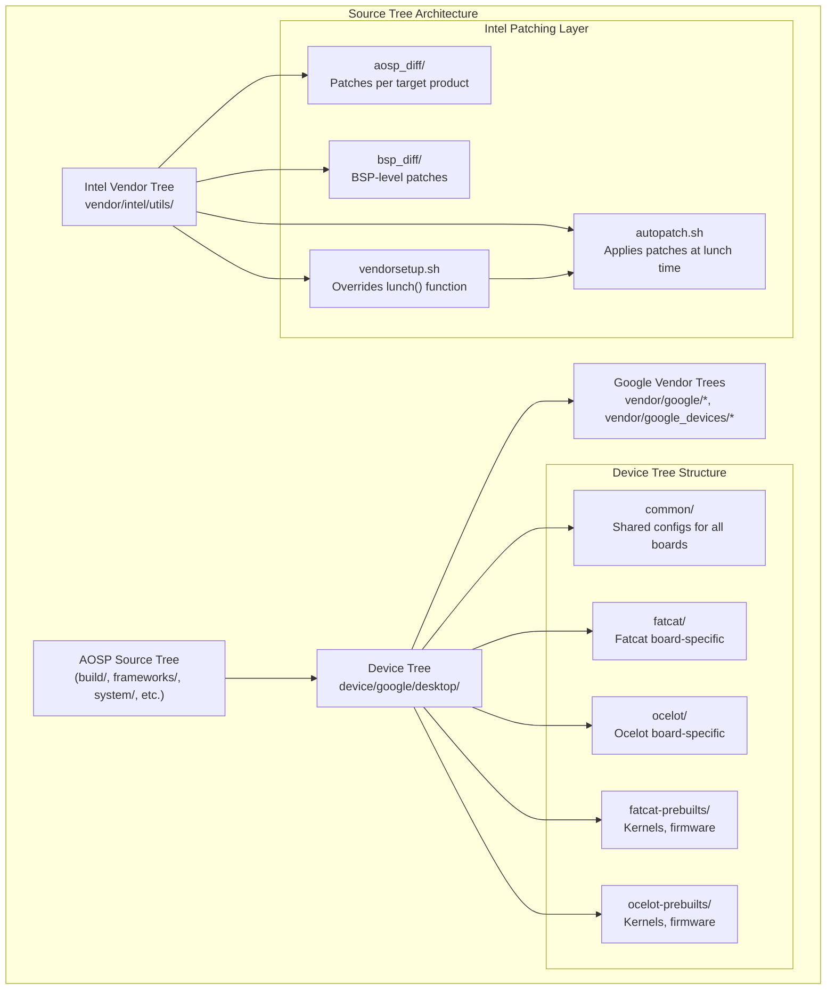
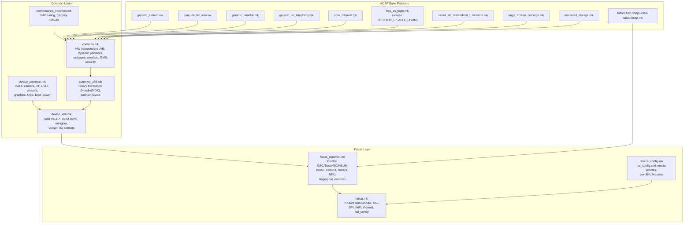
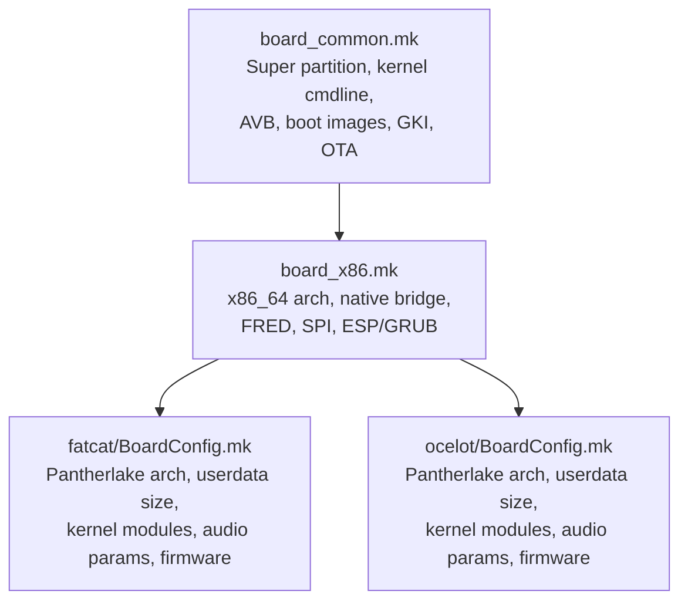
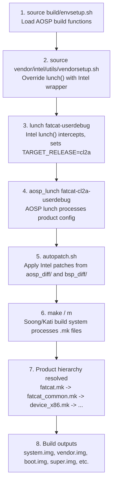
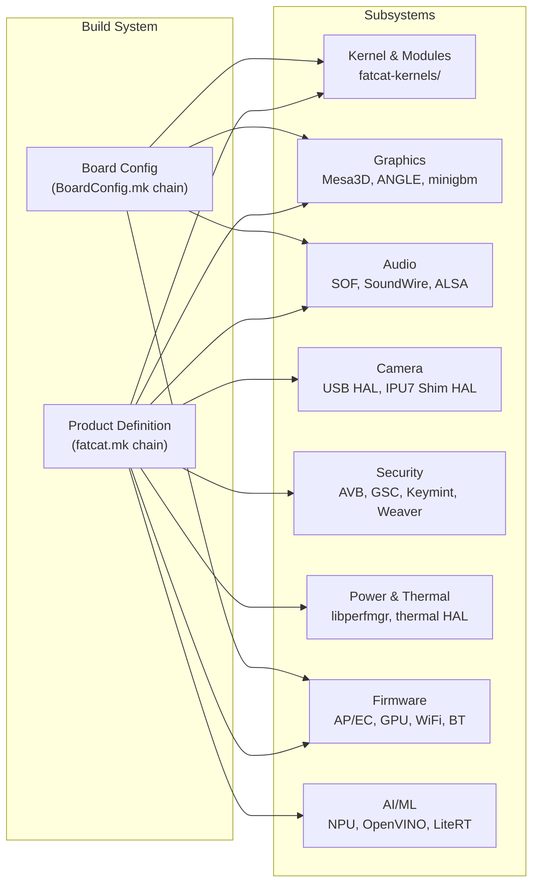

# Platform Architecture and Build System

> **Document 1 of 15** -- Android Desktop Platform Technical Reference
> Generated from source tree analysis of `ww04-fatcat-bkc`

---

## 1. Architecture Overview

The Android Desktop platform uses a **three-tree structure**: the AOSP source tree, the device-specific tree (`device/google/desktop/`), and the Intel vendor tree (`vendor/intel/`). The Intel vendor tree provides a patching layer on top of the upstream AOSP and device trees, applied automatically at `lunch` time via `autopatch.sh`.



### Key Architectural Principles

1. **Layered Inheritance**: Product definitions inherit from common base configs through a well-defined chain of `.mk` files
2. **Feature Flags**: Hardware features can be disabled per-board using `DESKTOP_DISABLE_*` flags (e.g., `DESKTOP_DISABLE_GSC`, `DESKTOP_DISABLE_EC`)
3. **HW/SW Separation**: `common.mk` contains HW-independent rules (applicable to VMs), while `device_common.mk` contains HW-dependent rules (HALs)
4. **Partner/Internal Split**: The build detects `vendor/google/certs/` to determine if this is a partner (`PDK_BUILD := true`) or internal build, selecting different packages accordingly
5. **Intel Patch Overlay**: The Intel vendor tree applies target-product-specific patches on top of the AOSP and device trees at lunch time

---

## 2. Key Components

| Component | Path | Purpose |
|-----------|------|---------|
| Common product base | `device/google/desktop/common/common.mk` | HW-independent product definition (system packages, A/B, dynamic partitions, GMS, overlays) |
| Device common HALs | `device/google/desktop/common/device_common.mk` | HAL packages (camera, bluetooth, audio, sensors, graphics, USB, etc.) |
| x86 device config | `device/google/desktop/common/device_x86.mk` | x86-specific drivers (Intel VA-API, DRM HWC, minigbm, Vulkan, IIO sensors) |
| x86 common product | `device/google/desktop/common/common_x86.mk` | Binary translation (Houdini/NDK), partition layout default |
| Board common | `device/google/desktop/common/board_common.mk` | Super partition, kernel cmdline, AVB, boot images, GKI, A/B OTA, filesystem types |
| Board x86 | `device/google/desktop/common/board_x86.mk` | x86_64 arch, native bridge (arm64), FRED, SPI, ESP/GRUB |
| Device config | `device/google/desktop/common/device_config.mk` | Per-device HAL config XML and media profile copying |
| Fatcat product | `device/google/desktop/fatcat/fatcat.mk` | Fatcat product definition (SoC, DPI, thermal, recovery, hal_config) |
| Fatcat common | `device/google/desktop/fatcat/fatcat_common.mk` | Fatcat family shared config (kernel, camera, codecs, NPU, fingerprint, modules) |
| Fatcat board | `device/google/desktop/fatcat/BoardConfig.mk` | Fatcat board config (arch variant, partition size, kernel modules, audio, firmware) |
| Ocelot product | `device/google/desktop/ocelot/ocelot.mk` | Ocelot product definition (SoC, DPI, thermal, recovery, hal_config) |
| Ocelot board | `device/google/desktop/ocelot/BoardConfig.mk` | Ocelot board config (arch variant, partition, kernel modules, firmware blobs) |
| VINTF matrix | `device/google/desktop/common/compatibility_matrix.xml` | Framework compatibility matrix for vendor HAL interfaces |
| GMS config | `device/google/desktop/common/gms.mk` | Google Mobile Services packages and permissions |
| Factory config | `device/google/desktop/common/factory_common.mk` | Manufacturing/factory test packages |
| Performance common | `device/google/desktop/common/performance/performance_common.mk` | LMK tuning, memory management defaults |
| Performance high | `device/google/desktop/common/performance/performance_high.mk` | High-end (>=16GB) LMK tuning |
| Performance medium | `device/google/desktop/common/performance/performance_med.mk` | Medium (~8GB) -- inherits common only |
| Performance low | `device/google/desktop/common/performance/performance_low.mk` | Low-end (~4GB) aggressive LMK tuning |
| Intel vendor setup | `vendor/intel/utils/vendorsetup.sh` | Overrides `lunch()` to inject `TARGET_RELEASE=cl2a` and trigger `autopatch.sh` |
| Autopatch | `vendor/intel/utils/autopatch.sh` | Applies Intel-specific patches from `aosp_diff/` and `bsp_diff/` per target product |

---

## 3. Product Definition Hierarchy

The following diagram shows the makefile inheritance chain, from base AOSP products up to the final Fatcat product definition.



### Inheritance Chain for `fatcat.mk` (reading order)

1. `fatcat.mk` sets `AUDIO_CONFIG_DIR`, `PRODUCT_DEVICE`, `PRODUCT_NAME`, etc.
2. `fatcat.mk` inherits `fatcat_common.mk`
3. `fatcat_common.mk` sets `DESKTOP_DISABLE_*` flags, then inherits `device_x86.mk`
4. `device_x86.mk` sets `PRODUCT_FSTAB_PATH`, then inherits both `common_x86.mk` and `device_common.mk`
5. `common_x86.mk` inherits `common.mk` and configures binary translation
6. `common.mk` inherits the base AOSP products (`generic_system.mk`, `core_64_bit_only.mk`, etc.)
7. `fatcat.mk` then includes `device_config.mk` for HAL config and media profiles

### Board Configuration Inheritance



---

## 4. Board Configuration

### Common Board Settings (`board_common.mk`)

| Variable | Value | Notes |
|----------|-------|-------|
| `BOARD_SUPER_PARTITION_SIZE` | `8589934592` (8 GiB) | Default, can be overridden per-board |
| `BOARD_GOOGLE_DYNAMIC_PARTITIONS_SIZE` | `8585740288` (8 GiB - 4 MiB) | Usable dynamic partition space |
| `BOARD_SUPER_PARTITION_ERROR_LIMIT` | `8585740288` | Same as dynamic partitions size |
| `BOARD_BOOTIMAGE_PARTITION_SIZE` | `0x04000000` (64 MiB) | |
| `BOARD_VENDOR_BOOTIMAGE_PARTITION_SIZE` | `0x02000000` (32 MiB) | |
| `BOARD_INIT_BOOT_IMAGE_PARTITION_SIZE` | `0x00800000` (8 MiB) | |
| `BOARD_BOOT_HEADER_VERSION` | `4` | |
| `BOARD_RAMDISK_USE_LZ4` | `true` | |
| `TARGET_RO_FILE_SYSTEM_TYPE` | `erofs` | All read-only partitions use EROFS |
| `BOARD_EROFS_PCLUSTER_SIZE` | `32768` | |
| `BOARD_AVB_ENABLE` | `true` | Android Verified Boot |
| `BOARD_AVB_ALGORITHM` | `SHA256_RSA4096` | |
| `AB_OTA_UPDATER` | `true` | |
| `BOARD_HAVE_BLUETOOTH` | `true` | |
| `BOARD_USES_ALSA_AUDIO` | `true` | |

### Common Kernel Command Line (`board_common.mk`)

```
console=ttyS0,115200n8 loglevel=1     (non-user builds)
console=null                            (user builds)
DEBUG=1                                 (non-user builds)
8250.nr_uarts=4
console_msg_format=syslog
log_buf_len=4M                          (non-user; 1M for user)
cgroup_disable=pressure
root=/dev/ram0
firmware_class.path=/vendor/firmware
reserve_mem=20M:2M:trace
trace_instance=boot_mapped^traceoff@trace
drm.trace=0x106
sched_proxy_exec=1
module_blacklist=cros_ec_debugfs
proc_mem.force_override=ptrace
```

### x86 Board Additions (`board_x86.mk`)

| Variable | Value |
|----------|-------|
| `TARGET_ARCH` | `x86_64` |
| `TARGET_CPU_ABI` | `x86_64` |
| `TARGET_NATIVE_BRIDGE_ARCH` | `arm64` |
| `TARGET_NATIVE_BRIDGE_ABI` | `arm64-v8a` |

Additional kernel cmdline:
```
cpufreq.default_governor=performance
fred=on
spi-intel.writeable=1 spi-intel.ignore_protection_status=1
ia32_emulation=false
vsyscall=none
```

### Fatcat Board (`fatcat/BoardConfig.mk`)

| Variable | Value | Notes |
|----------|-------|-------|
| `TARGET_ARCH_VARIANT` | `pantherlake` | Intel Panther Lake |
| `TARGET_2ND_ARCH_VARIANT` | `pantherlake` | |
| `BOARD_USERDATAIMAGE_PARTITION_SIZE` | `576716800` (~550 MiB) | |
| `BOARD_PVMFWIMAGE_PARTITION_SIZE` | `0x00200000` (2 MiB) | |
| `BOARD_GRUB_CFG` | `vendor/google/desktop/layout/grub.cfg.template` | Dynamic boot_part_uuid |

Fatcat-specific kernel cmdline additions:
```
xe.enable_psr=1
snd_intel_dspcfg.dsp_driver=3
snd_sof_intel_hda_common.sof_use_tplg_nhlt=1
snd_sof_pci.ipc_type=1
snd_intel_sdw_acpi.sdw_link_mask=0xF
snd_sof.disable_function_topology=1
thp_anon=16K-64K:never;128K:always;256K-2M:never
fred=off
androidboot.enable_rescue_party=false
```

### Ocelot Board (`ocelot/BoardConfig.mk`)

| Variable | Value | Notes |
|----------|-------|-------|
| `TARGET_ARCH_VARIANT` | `pantherlake` | Same as Fatcat |
| `BOARD_USERDATAIMAGE_PARTITION_SIZE` | `576716800` (~550 MiB) | Same as Fatcat |
| `BOARD_PVMFWIMAGE_PARTITION_SIZE` | `0x00200000` (2 MiB) | |
| `BOARD_BOOTCONFIG` | `androidboot.selinux=permissive` | SELinux permissive (bringup) |

Ocelot-specific kernel cmdline additions:
```
xe.enable_psr=1
snd_intel_dspcfg.dsp_driver=3
snd_sof_intel_hda_common.sof_use_tplg_nhlt=1
snd_sof_pci.ipc_type=1
snd_intel_sdw_acpi.sdw_link_mask=0xF
snd_sof_intel_hda_generic dmic_num=4
earlyprintk=serial,ttys0,115200n8,keep
```

---

## 5. Build Flow

### Step-by-Step Build Process



### Detailed Build Steps

**Step 1: Environment Setup**
```bash
source build/envsetup.sh
```
Loads standard AOSP build functions (`m`, `mm`, `lunch`, etc.).

**Step 2: Intel Vendor Setup**
```bash
source vendor/intel/utils/vendorsetup.sh
```
This script:
- Saves the original AOSP `lunch()` function as `aosp_lunch()`
- Defines a new `lunch()` that:
  - Sets `TARGET_RELEASE=cl2a` (the release configuration for this BKC build)
  - Converts shorthand targets (e.g., `fatcat-userdebug`) to full form (`fatcat-cl2a-userdebug`)
  - Calls `aosp_lunch` with the expanded target
  - Invokes `autopatch.sh` to apply Intel-specific patches
- Also overrides `_get_build_var_cached()` to filter lunch menu choices

**Step 3: Lunch Target Selection**
```bash
lunch fatcat-userdebug
```
Available lunch targets for Fatcat (from `fatcat/AndroidProducts.mk`):
- `fatcat-eng`
- `fatcat-userdebug`
- `fatcat_corp-userdebug`

Available AOSP-only targets (from `common/AndroidProducts.mk`):
- `aosp_arm64_desktop`
- `aosp_arm64_plus_armv7_desktop`
- `aosp_x86_desktop`
- `aosp_x86_64_desktop`

**Step 4: Autopatch Application**
`autopatch.sh` applies patches in this order:
1. `aosp_diff/preliminary/` -- if `include_preliminary` marker exists for the target
2. `aosp_diff/${TARGET_PRODUCT}/` -- product-specific AOSP patches
3. `bsp_diff/common/` -- if `include_common` marker exists for the target
4. `bsp_diff/${TARGET_PRODUCT}/` -- product-specific BSP patches

Patch detection uses the `Date:` header in each `.patch` file, comparing against the last 500 git log entries in the target repo. See *Doc 14: Patch Management* for detailed autopatch behavior and known edge cases.

**Step 5: Build**
```bash
m dist
```
The build system processes the makefile hierarchy, resolves all `inherit-product` chains, compiles source, and generates partition images.

---

## 6. Configuration System

### Soong Config Variables

The build system uses `soong_config_set` and `soong_config_set_bool` extensively to configure module behavior at build time.

| Namespace | Variable | Value | Set In |
|-----------|----------|-------|--------|
| `minigbm` | `platform` | `intel` | `device_x86.mk` |
| `desktop_partition_layout` | `disk_layout_json` | `x86` (default) | `common_x86.mk` |
| `trusty_system_vm` | `enabled` | `false` (fatcat) | `fatcat_common.mk` |
| `boot_service_desktop` | `skip_fw_status` | `true` (fatcat) | `fatcat_common.mk` |
| `cros_codecs_config` | `protected_content` | `intel` | `fatcat_common.mk` |
| `cros_codecs_config` | `intel_protected_content` | `true` | `fatcat_common.mk` |
| `gsc` | `fw_type` | `ti50` | `fatcat_common.mk` |
| `desktop` | `have_libhalconfig` | `true` | `device_config.mk` |
| `DRMHWC` | `atom_reporter` | `desktop` | `device_common.mk` |
| `btservices_module` | `source_build` | `true` | `device_common.mk` |
| `system_services` | `without_hal` | `vibrator` | `device_common.mk` |
| `wpa_supplicant` | `bgscan_simple` | `true` | `board_common.mk` |
| `wpa_supplicant` | `pasn` | `false` | `board_common.mk` |
| `avf` | `avf_use_pvmfw_desktop` | `true` | `common.mk` |
| `crosfp_trusted_application` | `weak_ta` | `true` | `fatcat_common.mk` |
| `fingerprint` | `bloonchipper` | `true` | `fatcat_common.mk` |
| `fingerprint` | `buccaneer` | `true` | `fatcat_common.mk` |
| `fingerprint` | `helipilot` | `true` | `fatcat_common.mk` |

### Feature Flags (`DESKTOP_DISABLE_*`)

These flags allow per-board disabling of hardware-dependent subsystems. They must be set **before** inheriting the common makefiles that reference them.

| Flag | Default | Fatcat | Effect When `true` |
|------|---------|--------|--------------------|
| `DESKTOP_DISABLE_GSC` | `false` | `true` | Skips GSC HAL (gscd, gscutil, trunks_send, check_tpm_clear, udsattestation) |
| `DESKTOP_DISABLE_TRUSTY_VM` | `false` | `true` | Disables TrustyTEE security VM, sets `trusty.security_vm.enabled=0` |
| `DESKTOP_DISABLE_EC` | `false` | `true` | Skips EC tools (ectool, timberslide, ec_crash_collector) |
| `DESKTOP_DISABLE_HSUM` | `false` | `true` | Disables Headless System User Mode (does not inherit `hsu_as_login.mk`) |
| `DESKTOP_USE_TRUSTY_GK_KM` | `false` | `false` | Enables Trusty Keymint/Gatekeeper/Weaver, PinWeaver, RKP |

### hal_config.xml System

The `device_config.mk` file implements per-device hardware configuration:

1. When `DEVICE_CONFIG_SUBDIR` is set (e.g., `fatcat`), it copies:
   - `device/google/desktop/fatcat/configs/hal_config.xml` to `vendor/etc/data/hal_configs/hal_config.xml`
   - All media profile XMLs from `configs/media_profiles/` to `vendor/etc/`
   - Per-SKU feature XMLs from `configs/features/` to `vendor/etc/permissions/sku_*/`
2. Installs the `dev_config` runtime library for querying HAL config at runtime
3. Sets `desktop.have_libhalconfig = true` Soong config variable

See *Doc 3: Hardware Abstraction Layer* for detailed hal_config.xml schema and per-SKU configuration.

### Key Product Properties

| Property | Value | Source |
|----------|-------|--------|
| `PRODUCT_BRAND` | `google` | `common.mk` |
| `PRODUCT_CHARACTERISTICS` | `desktop` | `common.mk` |
| `PRODUCT_DEVICE` | `fatcat` | `fatcat.mk` |
| `PRODUCT_NAME` | `Fatcat` | `fatcat.mk` |
| `PRODUCT_MANUFACTURER` | `Google` | `fatcat.mk` |
| `PRODUCT_PLATFORM` | `x86` | `fatcat.mk` |
| `PRODUCT_SHIPPING_API_LEVEL` | `38` (fatcat), `37` (ocelot) | `fatcat.mk`, `ocelot.mk` |
| `ro.sf.lcd_density` | `200` | `fatcat.mk` |
| `ro.soc.manufacturer` | `Intel` | `fatcat.mk` |
| `ro.soc.model` | `Intel_Core_Ultra_7_365` | `fatcat.mk` |
| `ro.hardware.vulkan` | `intel` | `device_x86.mk` |
| `ro.hardware.egl` | `angle` | `device_common.mk` |
| `ro.hardware.gralloc` | `minigbm` | `device_x86.mk` |
| `ro.opengles.version` | `196610` (OpenGL ES 3.2) | `device_common.mk` |
| `ro.logd.size.main` | `8M` | `common.mk` |
| `ro.logd.size.system` | `4M` | `common.mk` |
| `mmd.zram.enabled` | `true` | `common.mk` |
| `mmd.zram.size` | `150%` | `common.mk` |
| `ro.media.xml_variant.codecs` | `_c2_fatcat` | `fatcat_common.mk` |

---

## 7. VINTF and Compatibility Matrix

### Device Manifest (`fatcat/manifest.xml`)

```xml
<manifest version="1.0" type="device" target-level="202604">
</manifest>
```

The target level `202604` indicates the April 2026 FCM (Framework Compatibility Matrix) level. VINTF manifest enforcement is enabled (`PRODUCT_ENFORCE_VINTF_MANIFEST := true`), but kernel VINTF requirements are not yet enforced for Fatcat (`PRODUCT_OTA_ENFORCE_VINTF_KERNEL_REQUIREMENTS := false`).

### Framework Compatibility Matrix (`common/compatibility_matrix.xml`)

The framework compatibility matrix declares HAL interface contracts that vendor implementations must satisfy:

| HAL Package | Interface | Instance | Optional |
|-------------|-----------|----------|----------|
| `vendor.google.desktop` | `IProcfsReader` | `default` | Yes |
| `vendor.google.desktop` | `IFutilityExecutor` | `default` | Yes |
| `vendor.google.desktop` | `IEcExecutor` | `default` | Yes |
| `vendor.google.desktop` | `ICameraToolExecutor` | `default` | Yes |
| `vendor.google.desktop.vpd_executor` | `IVpdExecutor` | `default` | Yes |
| `com.android.desktop.power` | `ISuspendNotificationService` | `default` | Yes |
| `com.android.desktop.power` | `IDesktopPowerChargeControl` (v1) | `default` | Yes |

### Additional Compatibility Matrices

Beyond the common matrix, the build includes additional matrices from vendor packages:

| Matrix Source | Purpose |
|---------------|---------|
| `vendor/google/desktop/video/hwsec_cert_helper/compatibility_matrix_gsc.xml` | GSC IGsc interface (excluded on Fatcat) |
| `vendor/google/desktop/video/drm-network/com.android.desktop.drm_network.compat.xml` | HDCP key provisioning IDrmNetworkService |
| `vendor/google/desktop/video_chat/com.android.desktop.video_chat.compat.xml` | Video Chat Manager |
| `vendor/google/desktop/snapshot/com.google.android.snapshot.compat.xml` | Snapshot System Service |

All HAL interfaces use the AIDL format. See *Doc 3: Hardware Abstraction Layer* for implementation details.

---

## 8. Partition Layout

### Dynamic Partitions (Super Partition)

The platform uses **Dynamic Partitions** with **Virtual A/B** OTA and **lz4 compression**.

| Parameter | Value |
|-----------|-------|
| `PRODUCT_USE_DYNAMIC_PARTITIONS` | `true` |
| `PRODUCT_VIRTUAL_AB_COMPRESSION` | `true` |
| `PRODUCT_VIRTUAL_AB_COMPRESSION_METHOD` | `lz4` |
| `PRODUCT_VIRTUAL_AB_COMPRESSION_FACTOR` | `65536` |
| `BOARD_SUPER_PARTITION_SIZE` | `8,589,934,592` bytes (8 GiB) |
| `BOARD_GOOGLE_DYNAMIC_PARTITIONS_SIZE` | `8,585,740,288` bytes (8 GiB - 4 MiB) |

#### Dynamic Partition Group: `google_dynamic_partitions`

| Partition | Filesystem | Notes |
|-----------|-----------|-------|
| `system` | erofs | Main system image |
| `vendor` | erofs | Vendor HALs and configs |
| `product` | erofs | Product-specific apps |
| `system_ext` | erofs | System extensions |
| `system_dlkm` | erofs | System DLK modules (GKI) |
| `vendor_dlkm` | erofs | Vendor DLK modules |

### Static Partitions

| Partition | Size | Notes |
|-----------|------|-------|
| `boot` | 64 MiB (`0x04000000`) | Kernel + ramdisk |
| `vendor_boot` | 32 MiB (`0x02000000`) | Vendor ramdisk, recovery resources |
| `init_boot` | 8 MiB (`0x00800000`) | Init boot, header v4 |
| `vbmeta` | -- | AVB metadata |
| `pvmfw` | 2 MiB (`0x00200000`) | Protected VM firmware |
| `userdata` | ~550 MiB (`576716800`) | User data (fatcat/ocelot) |

### A/B OTA Partitions

Dynamic partitions updated via OTA:
`system`, `system_ext`, `product`, `system_dlkm`, `vendor`, `vendor_dlkm`

Static partitions updated via OTA:
`boot`, `vendor_boot`, `vbmeta`, `init_boot`, `pvmfw` (if built)

### Filesystem Configuration

| Setting | Value |
|---------|-------|
| `TARGET_RO_FILE_SYSTEM_TYPE` | `erofs` |
| `BOARD_EROFS_PCLUSTER_SIZE` | `32768` |
| `TARGET_USERIMAGES_USE_EXT4` | `true` (userdata) |
| `TARGET_USERIMAGES_SPARSE_EXT_DISABLED` | `true` |
| `BOARD_USES_METADATA_PARTITION` | `true` |
| `OVERRIDE_PRODUCT_COMPRESSED_APEX` | `false` |
| `PRODUCT_DEFAULT_APEX_PAYLOAD_TYPE` | `erofs` |
| `BOARD_USES_SYSTEM_OTHER_ODEX` | `true` |

### Boot Configuration

```
androidboot.hardware.platform=android-desktop
androidboot.hardware=android-desktop
androidboot.load_modules_parallel=true
```

### Virtual A/B Configuration

```
PRODUCT_VIRTUAL_AB_COMPRESSION := true
PRODUCT_VIRTUAL_AB_COMPRESSION_METHOD := lz4
PRODUCT_VIRTUAL_AB_COMPRESSION_FACTOR := 65536
ro.virtual_ab.compression.threads=true
```

Packages supporting Virtual A/B: `snapuserd`, `snapuserd.recovery`, `snapuserd.vendor_ramdisk`

See *Doc 12: OTA and Update System* for the full OTA pipeline and firmware update flow.

---

## 9. Performance Tiers

The platform defines four performance tiers based on device RAM, each tuning LMKD (Low Memory Killer Daemon) behavior. The common tier is always included; device-specific configs inherit one of the specialized tiers.

### Tier Overview

| Tier | File | RAM Target | `thrashing_limit` | Notes |
|------|------|-----------|-------------------|-------|
| Common | `performance_common.mk` | All | (set by sys_tuner) | Base LMK, freezer, zram config |
| High | `performance_high.mk` | >= 16 GB | `10` | Tolerates more memory pressure |
| Medium | `performance_med.mk` | ~ 8 GB | (common default) | Inherits common only, no overrides |
| Low | `performance_low.mk` | ~ 4 GB | `2` | Very aggressive kill to preserve eMMC |

### Common Performance Settings (`performance_common.mk`)

| Property | Value | Purpose |
|----------|-------|---------|
| `ro.lmk.kill_heaviest_task` | `false` | Respect LRU order (important for Chrome tab kill order) |
| `ro.lmk.thrashing_limit_decay` | `10` | Step-wise lowering rate of thrashing limit |
| `ro.lmk.psi_partial_stall_ms` | `70` | PSI partial stall threshold for medium kills (~93rd percentile) |
| `ro.lmk.psi_complete_stall_ms` | `700` | PSI complete stall threshold for critical kills (~99.9th percentile) |
| `ro.lmk.relaxed_available_memory` | `true` | Looser available memory calculation |
| `ro.lmk.swap_compression_ratio` | `263` | Estimated compression ratio (2.63x = ~38%, 95th percentile on ChromeOS) |
| `ro.lmk.swap_compression_ratio_div` | `100` | Divisor for compression ratio |
| `ro.lmk.lowmem_min_oom_score` | `800` | Only kill cached processes at low watermark |
| `ro.config.low_ram` | `false` | Not a low-RAM device |
| `ro.lmk.use_psi` | `true` | Use PSI to drive LMKD events |
| `ro.lmk.low` | `1001` | Disabled (PSI mode) |
| `ro.lmk.medium` | `800` | Kills cached + service B |
| `ro.lmk.critical` | `0` | Foreground eligible at critical pressure |
| `ro.lmk.swap_util_max` | `100` | 100% swap utilization allowed |
| `apexd.config.boot_activation.threads` | `0` | Dynamic thread count matching apex queue size |

### ZRAM / Memory Reclaim (from `common.mk`)

| Property | Value |
|----------|-------|
| `mmd.zram.enabled` | `true` |
| `mmd.zram.size` | `150%` |
| `mmd.zram.writeback.enabled` | `true` |
| `mmd.zram.writeback.use_nr_tags_prop` | `true` |
| `mmd.zram.recompression.enabled` | `true` |

### Fatcat-Specific JIT/ART Tuning (from `fatcat_common.mk`)

| Property | Value | Notes |
|----------|-------|-------|
| `dalvik.vm.jitinitialsize` | `128k` | JIT cache initial size |
| `dalvik.vm.jitmaxsize` | `256m` | JIT cache max size |
| `dalvik.vm.jitthreshold` | `5000` | Compilation threshold |
| `dalvik.vm.inline-max-total-instructions` | `1280` | ART inlining limit |
| `dalvik.vm.inline-max-instructions-for-small-method` | `5` | Small method inlining limit |

See *Doc 9: Performance and Memory Management* for runtime tuning via `sys_tuner` and `perf_policy.json`.

---

## 10. Inter-Subsystem Dependencies

The build system ties together multiple subsystems through makefile includes, Soong config variables, and package dependencies.



### Key Dependency Relationships

| From | To | Mechanism | Notes |
|------|----|-----------|-------|
| `fatcat_common.mk` | Kernel | `FATCAT_KERNEL_ROOT` variable, `PRODUCT_COPY_FILES` | Kernel binary + modules from `fatcat-kernels/` |
| `fatcat_common.mk` | Graphics | `inherit-product intel_graphics_drivers.mk` | Mesa3D Intel Vulkan built from source |
| `device_x86.mk` | Graphics | `PRODUCT_PACKAGES += gralloc.minigbm, android.hardware.composer.hwc3-service.drm` | DRM HWC, minigbm allocator |
| `device_common.mk` | Audio | `inherit-product vendor/google/desktop/audio/audio.mk` | Audio HAL, policy configs |
| `fatcat/BoardConfig.mk` | Audio | `BOARD_KERNEL_CMDLINE += snd_*` params | SOF driver parameters, SoundWire link mask |
| `device_common.mk` | Camera | `PRODUCT_PACKAGES += android.hardware.camera.provider-usb-service` | USB camera HAL |
| `fatcat_common.mk` | Camera | IPU7 camera packages | Shim camera HAL for MIPI cameras |
| `common.mk` | Security | GSC/Trusty conditional blocks | Controlled by `DESKTOP_DISABLE_*` flags |
| `board_common.mk` | Security | `BOARD_AVB_*` variables | Verified boot chain |
| `fatcat_common.mk` | AI | NPU driver packages, OpenVINO, LiteRT | Intel NPU and inference stack |
| `fatcat_common.mk` | Firmware | `PRODUCT_PACKAGES += linux_firmware_*`, `FIRMWARE_BLOBS` | GPU, WiFi, BT, audio firmware |
| `device_common.mk` | Firmware | `desktop-firmware-prebuilt`, `google_desktop_firmware_updater` | AP/EC firmware update |
| `common.mk` | All | `PRODUCT_SOONG_NAMESPACES`, `BOARD_VENDOR_SEPOLICY_DIRS` | Build namespace and SELinux policy |
| `device_config.mk` | Runtime | `hal_config.xml`, `dev_config` | Per-SKU hardware configuration at runtime |

### Binary Translation Dependencies

The x86 platform requires ARM binary translation for app compatibility:

| Mode | Variable Value | Effect |
|------|---------------|--------|
| NDK Translation only | `AL_BINARY_TRANSLATION_MODE=ndk_translation_only` | NDK translation for ARM64 |
| Houdini only | `AL_BINARY_TRANSLATION_MODE=houdini_only` | Intel Houdini for ARM64 |
| **Houdini + NDK (default)** | `AL_BINARY_TRANSLATION_MODE=houdini_primary_ndk_translation_secondary` | Houdini primary, NDK secondary |

See *Doc 4: Kernel and Driver Architecture* for kernel module dependency chains and *Doc 5: Graphics and Display* for the GPU driver stack.

---

## 11. Key Files Reference

| Path | Purpose | Format |
|------|---------|--------|
| `device/google/desktop/common/common.mk` | HW-independent product base (A/B, partitions, packages, GMS) | Makefile |
| `device/google/desktop/common/device_common.mk` | HAL package inclusion (camera, BT, audio, sensors, graphics) | Makefile |
| `device/google/desktop/common/device_x86.mk` | x86 device config (Intel VA-API, DRM HWC, minigbm, Vulkan) | Makefile |
| `device/google/desktop/common/common_x86.mk` | x86 common config (binary translation, partition layout) | Makefile |
| `device/google/desktop/common/board_common.mk` | Board common (super partition, kernel cmdline, AVB, GKI, OTA) | Makefile |
| `device/google/desktop/common/board_x86.mk` | Board x86 (x86_64 arch, native bridge, kernel params) | Makefile |
| `device/google/desktop/common/device_config.mk` | Per-device HAL config XML and media profile deployment | Makefile |
| `device/google/desktop/common/compatibility_matrix.xml` | VINTF framework compatibility matrix for vendor HALs | XML |
| `device/google/desktop/common/gms.mk` | Google Mobile Services packages and permissions | Makefile |
| `device/google/desktop/common/factory_common.mk` | Manufacturing/factory test packages | Makefile |
| `device/google/desktop/common/intel_graphics_drivers.mk` | Intel Mesa3D Vulkan driver build from source | Makefile |
| `device/google/desktop/common/performance/performance_common.mk` | LMK tuning, memory management base config | Makefile |
| `device/google/desktop/common/performance/performance_high.mk` | High-end (>=16GB) LMK tuning | Makefile |
| `device/google/desktop/common/performance/performance_med.mk` | Medium (~8GB) config (inherits common only) | Makefile |
| `device/google/desktop/common/performance/performance_low.mk` | Low-end (~4GB) aggressive LMK config | Makefile |
| `device/google/desktop/common/AndroidProducts.mk` | AOSP desktop product registration | Makefile |
| `device/google/desktop/fatcat/fatcat.mk` | Fatcat product definition | Makefile |
| `device/google/desktop/fatcat/fatcat_common.mk` | Fatcat family shared config (kernel, camera, NPU, fingerprint) | Makefile |
| `device/google/desktop/fatcat/BoardConfig.mk` | Fatcat board config (arch, partition, modules, firmware) | Makefile |
| `device/google/desktop/fatcat/AndroidProducts.mk` | Fatcat lunch targets | Makefile |
| `device/google/desktop/fatcat/manifest.xml` | VINTF device manifest (target-level 202604) | XML |
| `device/google/desktop/fatcat/configs/hal_config.xml` | Fatcat HAL hardware configuration | XML |
| `device/google/desktop/ocelot/ocelot.mk` | Ocelot product definition | Makefile |
| `device/google/desktop/ocelot/BoardConfig.mk` | Ocelot board config | Makefile |
| `vendor/intel/utils/vendorsetup.sh` | Intel vendor setup (overrides lunch, TARGET_RELEASE=cl2a) | Shell |
| `vendor/intel/utils/autopatch.sh` | Patch management (applies aosp_diff and bsp_diff patches) | Shell |
| `vendor/intel/utils/aosp_diff/fatcat/` | Intel patches for Fatcat target repos | Patch files |
| `vendor/intel/utils/bsp_diff/fatcat/` | Intel BSP patches for Fatcat | Patch files |

---

## Cross-References to Other Documents

| Document | Topic | Relevance |
|----------|-------|-----------|
| Doc 2: Boot and Init System | Boot flow, init.rc, kernel loading | Section 5 (Build Flow) produces boot images consumed here |
| Doc 3: Hardware Abstraction Layer | HAL implementations, hal_config.xml | Section 6 (Configuration) and Section 7 (VINTF) define the contracts |
| Doc 4: Kernel and Driver Architecture | Kernel modules, vendor_dlkm | Section 4 (Board Config) defines module lists and kernel cmdline |
| Doc 5: Graphics and Display | Mesa3D, ANGLE, DRM HWC | Section 6 (Soong config for minigbm, ANGLE, Vulkan) |
| Doc 6: Audio Subsystem | SOF, SoundWire, ALSA | Section 4 (Board Config) sets audio kernel params |
| Doc 7: Camera Subsystem | USB HAL, IPU7 shim | Section 3 (Hierarchy) shows camera package inclusion |
| Doc 8: Networking and Connectivity | WiFi, BT, Ethernet | Sections 6-7 cover WiFi/BT HAL and firmware |
| Doc 9: Performance and Memory Management | LMK tuning, sys_tuner | Section 9 (Performance Tiers) defines build-time defaults |
| Doc 10: Security Architecture | AVB, GSC, Keymint | Sections 4 and 6 define AVB and security VM config |
| Doc 11: AI and NPU | OpenVINO, LiteRT, NPU driver | Section 10 shows AI package dependencies |
| Doc 12: OTA and Update System | Virtual A/B, firmware updates | Section 8 (Partition Layout) defines OTA partition scheme |
| Doc 13: Factory and Manufacturing | factory_common.mk, hal_config | Section 2 and 6 reference factory build config |
| Doc 14: Patch Management | autopatch.sh, deploy.sh | Section 5 (Build Flow) covers autopatch integration |
| Doc 15: Testing and Validation | CTS/VTS, debug packages | `PRODUCT_PACKAGES_DEBUG` throughout all sections |
