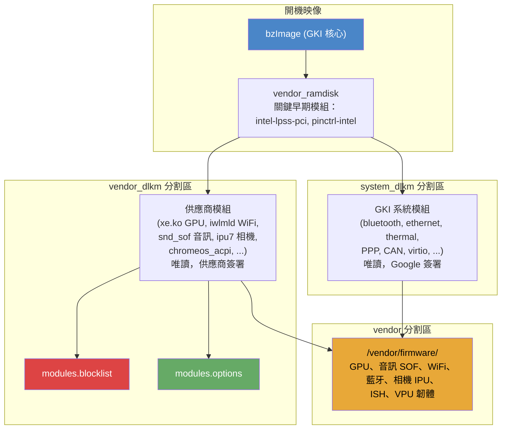
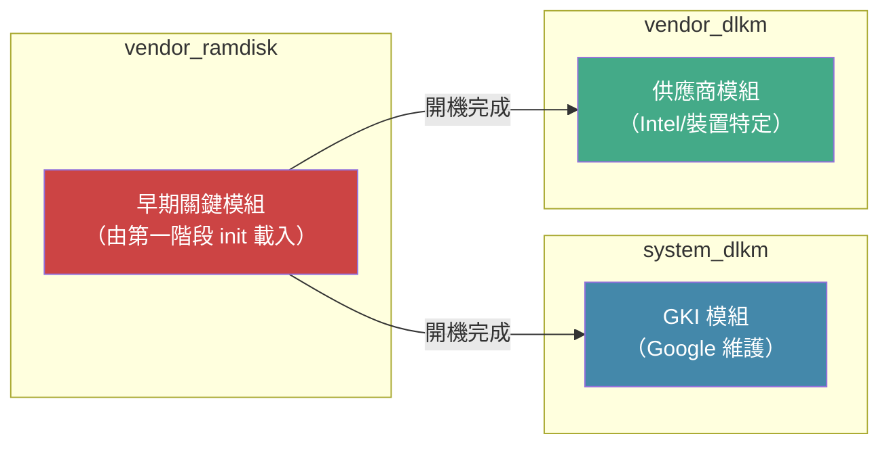
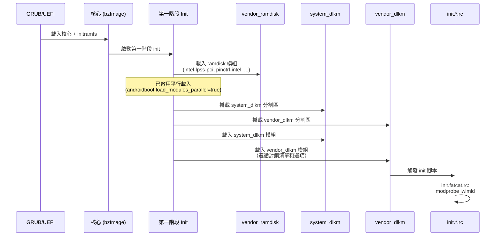
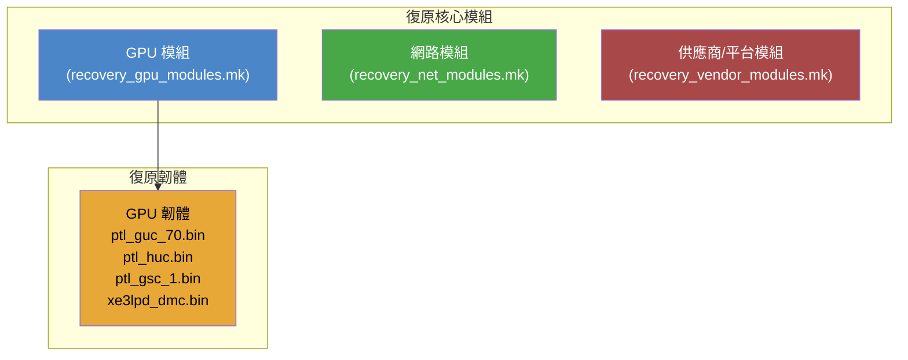
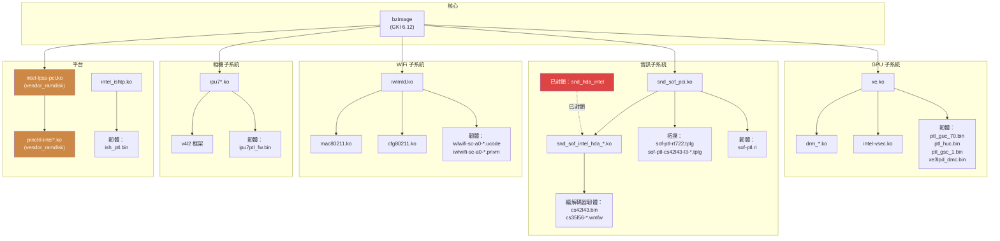

# 核心、模組與韌體

本文件說明 Android 桌面平台 (ADP) 的核心、可載入核心模組及韌體 blob 子系統，
重點介紹 **Fatcat**（Intel Panther Lake）裝置系列，並在相關之處與 **Ocelot** 進行比較。

> **交叉參考：**
> 請參閱 `01-build-system.md` 了解整體建置結構，以及 `03-audio.md`
> 了解 SOF 音訊管線的詳細資訊。

---

## 1. 架構概觀

本平台使用通用核心映像 (GKI) 架構，其中核心二進位檔 (`bzImage`) 在不同建置間共用，
裝置特定的功能完全透過可載入核心模組和韌體 blob 提供。



### 關鍵設計原則

1. **GKI 合規性** -- 核心二進位檔為預建的通用核心映像；所有裝置特定的程式碼都位於供應商模組中。
2. **分割區隔離** -- 模組分散在 `system_dlkm`（GKI 模組）、`vendor_dlkm`（供應商模組）和 `vendor_ramdisk`（關鍵早期開機模組）之間。
3. **韌體類別路徑** -- 所有韌體皆由 `/vendor/firmware/` 提供（透過核心命令列 `firmware_class.path=/vendor/firmware` 設定）。
4. **模組封鎖清單** -- 衝突的驅動程式（例如 `snd_hda_intel`）會被封鎖，以優先使用 SOF 音訊堆疊。

---

## 2. 核心版本管理

### 2.1 可用的核心版本

核心預建檔案儲存於 `device/google/desktop/fatcat-kernels/`，包含以下版本目錄：

| 目錄 | 核心版本 | 建置變體 | 備註 |
|------|---------|---------|------|
| `6.6/` | 6.6.x | 單一建置 + recovery + update 映像 | 舊版核心；所有模組僅在 `vendor_dlkm` 中 |
| `6.12/` | 6.12.x | 多個 CI 建置（`ab-12971408` 至 `ab-13422743`）、`legacy_kernel`、`legacy_kernel_internal` | 主要生產核心；模組分散在 `system_dlkm` 和 `vendor_dlkm` 中 |
| `6.15/` | 6.15.x | 僅有 OWNERS 檔案 | 未來核心的預留位置 |
| `6.18/` | 6.18.x | `ab-14576422`、`legacy_kernel_internal` | 下一代核心 |
| `mainline/` | android-mainline | `legacy_kernel_internal` | 追蹤上游 android-mainline |

### 2.2 核心選擇機制

在建置時透過發行版設定旗標選擇啟用的核心：

```makefile
# In fatcat_common.mk:
FATCAT_KERNEL_ROOT := device/google/desktop/fatcat-kernels/$(RELEASE_KERNEL_FATCAT_VERSION)/$(RELEASE_KERNEL_FATCAT_DIR)
```

兩個旗標控制選擇：

| 旗標 | 用途 | 範例值 |
|------|------|--------|
| `RELEASE_KERNEL_FATCAT_VERSION` | 選擇核心主要版本目錄 | `6.12`、`6.18`、`mainline` |
| `RELEASE_KERNEL_FATCAT_DIR` | 選擇該版本中的特定建置 | `ab-13422743`、`legacy_kernel`、`legacy_kernel_internal` |

`RELEASE_KERNEL_FATCAT_DIR` 的 `legacy_kernel` 值會在 `recovery_net_modules.mk` 中觸發特殊行為 -- 6.6 舊版核心會將所有乙太網路模組放在 `vendor_dlkm` 中，而非將它們分散在 `system_dlkm` 和 `vendor_dlkm` 之間。

### 2.3 核心建置輸出

每個核心建置目錄包含：

```
<version>/<build_id>/
    bzImage              # 壓縮核心映像 (x86_64)
    System.map           # 核心符號對應表
    system_dlkm/         # GKI 系統模組 (.ko 檔案)
    vendor_dlkm/         # 供應商特定模組 (.ko 檔案)
```

6.6 舊版核心另外提供：
```
6.6/
    recovery/vmlinuz.image   # 復原模式核心
    update/vmlinuz.image     # USB 更新核心
```

### 2.4 架構設定

Fatcat 和 Ocelot 皆以 **Panther Lake** 微架構為目標：

```makefile
# fatcat/BoardConfig.mk and ocelot/BoardConfig.mk:
TARGET_ARCH_VARIANT := pantherlake
TARGET_2ND_ARCH_VARIANT := pantherlake
```

基礎架構為 x86_64，搭配 ARM64 原生橋接（在 `board_x86.mk` 中設定）：

```makefile
TARGET_ARCH := x86_64
TARGET_CPU_ABI := x86_64
TARGET_NATIVE_BRIDGE_ARCH := arm64
TARGET_NATIVE_BRIDGE_ARCH_VARIANT := armv8-a
```

---

## 3. 模組分割

### 3.1 分割區概觀



### 3.2 vendor_ramdisk -- 關鍵早期開機模組

這些模組必須在第一階段 init 期間可用，即在 `system_dlkm` 和 `vendor_dlkm` 分割區掛載之前。它們嵌入在供應商 ramdisk 中。

| 模組 | 用途 |
|------|------|
| `mfd-core.ko` | 多功能裝置核心框架 |
| `intel-lpss.ko` | Intel 低功耗子系統基礎驅動程式 |
| `intel-lpss-pci.ko` | Intel LPSS PCI 列舉（序列主控台所需） |
| `pinctrl-intel.ko` | Intel 腳位控制基礎驅動程式 |
| `pinctrl-intel-platform.ko` | Intel 平台腳位控制（intel-thc、intel-quicki2c、intel-quickspi 所需） |

> **為何使用 vendor_ramdisk？** Intel LPSS PCI 驅動程式必須在 `vendor_dlkm` 掛載之前初始化，
> 以確保序列主控台（8250_dw UART）正常運作。從 `vendor_dlkm` 載入會造成初始化競爭條件，
> 導致早期序列輸出被截斷且輸入停止運作（b/425909420）。
> 同樣地，`pinctrl-intel` 和 `pinctrl-intel-platform` 必須提前載入，
> 以供相依的觸控/HID 驅動程式使用（b/461928138）。

### 3.3 system_dlkm -- GKI 系統模組

來自 `$(FATCAT_KERNEL_ROOT)/system_dlkm/` 的所有 `.ko` 檔案會透過萬用字元自動包含：

```makefile
BOARD_SYSTEM_KERNEL_MODULES := \
     $(sort $(wildcard $(FATCAT_KERNEL_ROOT)/system_dlkm/*.ko))
```

這些是 Google 維護的 GKI 模組，包括：
- **藍牙**：`bluetooth.ko`、`btbcm.ko`、`btqca.ko`、`btsdio.ko`、`hci_uart.ko`、`hidp.ko`、`rfcomm.ko`、`rfkill.ko`
- **網路**：`mii.ko`、`pps_core.ko`、`ptp.ko`、`usbnet.ko`、`cdc_ether.ko`、`aqc111.ko`、`asix.ko`、`ax88179_178a.ko`、`r8152.ko`、`r8153_ecm.ko`、`rtl8150.ko`
- **散熱**：`acpi_thermal_rel.ko`、`int3400_thermal.ko`、`int3401_thermal.ko`、`int3402_thermal.ko`、`int3403_thermal.ko`、`int340x_thermal_zone.ko`、`processor_thermal_*.ko`
- **PPP/VPN**：`ppp_generic.ko`、`ppp_deflate.ko`、`ppp_mppe.ko`、`pppox.ko`、`pptp.ko`、`l2tp_core.ko`、`l2tp_ppp.ko`
- **測試/KUnit**：`kunit.ko`、`kunit-test.ko`、各種 `*_test.ko` 模組

### 3.4 vendor_dlkm -- 供應商模組

來自 `$(FATCAT_KERNEL_ROOT)/vendor_dlkm/` 的所有 `.ko` 檔案會自動包含：

```makefile
BOARD_VENDOR_KERNEL_MODULES := \
     $(sort $(wildcard $(FATCAT_KERNEL_ROOT)/vendor_dlkm/*.ko))
```

主要供應商模組類別包括：
- **GPU**：`xe.ko`、`drm_buddy.ko`、`drm_display_helper.ko`、`drm_exec.ko`、`drm_gpuvm.ko`、`drm_suballoc_helper.ko`、`drm_ttm_helper.ko`、`gpu-sched.ko`、`intel-vsec.ko`、`video.ko`、`wmi.ko`
- **音訊 SOF**：`snd_sof*.ko`、`snd_intel_dspcfg.ko`、`snd_intel_sdw_acpi.ko`
- **WiFi**：`iwlmld.ko`、`iwlwifi.ko`、`mac80211.ko`、`cfg80211.ko`
- **相機 IPU**：`ipu7*.ko`、`intel-ipu*.ko`
- **乙太網路（供應商）**：`alx.ko`、`igc.ko`、`r8169.ko`、`ipheth.ko`，以及各種 USB 乙太網路驅動程式
- **平台**：`chromeos_acpi.ko`、`intel-lpss*.ko`、`pinctrl-*.ko`、`spi-intel*.ko`、`spi-nor.ko`、`mtd.ko`
- **感測器集線器**：`intel_ish_ipc.ko`、`intel_ishtp.ko`

### 3.5 舊版核心差異

使用舊版核心（`RELEASE_KERNEL_FATCAT_DIR=legacy_kernel`）時，模組分割方式會改變：
- **所有乙太網路模組**移至 `vendor_dlkm`（不進行 `system_dlkm` 分割）
- 需要額外的 MDIO/PHY 相依模組：`fixed_phy.ko`、`fwnode_mdio.ko`、`libphy.ko`、`mdio_devres.ko`、`of_mdio.ko`、`phylink.ko`、`selftests.ko`

---

## 4. 核心命令列

完整的 `BOARD_KERNEL_CMDLINE` 在多個 makefile 中組裝。以下是依子系統整理的完整分解：

### 4.1 主控台與除錯 (board_common.mk)

| 參數 | 值 | 說明 |
|------|---|------|
| `console=ttyS0,115200n8` | 非使用者建置 | 序列主控台，115200 鮑率，8N1（使用者建置：`console=null`） |
| `loglevel=1` | 非使用者建置 | 核心日誌等級（1 = KERN_ALERT 及以上輸出至主控台） |
| `DEBUG=1` | 非使用者建置 | 啟用除錯模式 |
| `console_msg_format=syslog` | 全部 | 使用 syslog 格式進行日誌等級/設施前綴 |
| `log_buf_len=4M` | 非使用者 / 使用者 `1M` | 核心環形緩衝區大小 |
| `8250.nr_uarts=4` | 全部 | 覆寫 GKI 的 `SERIAL_8250_RUNTIME_UARTS=0`，以在執行時啟用序列埠（b/355265752） |
| `earlyprintk=serial,ttys0,115200n8,keep` | 僅 Ocelot | 用於主機板啟動的早期序列輸出（b/398036586） |

### 4.2 開機與初始化 (board_common.mk)

| 參數 | 值 | 說明 |
|------|---|------|
| `root=/dev/ram0` | 全部 | 初始根檔案系統為 ramdisk |
| `firmware_class.path=/vendor/firmware` | 全部 | 核心 firmware_class 子系統的韌體載入路徑 |
| `reserve_mem=20M:2M:trace` | 全部 | 為持久性 ftrace 環形緩衝區保留 20 MiB（2 MiB 對齊） |
| `trace_instance=boot_mapped^traceoff@trace` | 全部 | 設定開機映射追蹤實例 |

### 4.3 CPU 與排程 (board_x86.mk, board_common.mk)

| 參數 | 值 | 說明 |
|------|---|------|
| `cpufreq.default_governor=performance` | 全部 | 使用效能調控器開機以加快開機速度；使用者空間在開機後切換至省電模式 |
| `fred=on` | board_x86.mk | 啟用 FRED（彈性返回與事件傳遞）x86 中斷架構 |
| `fred=off` | fatcat/BoardConfig.mk | **覆寫**上述設定；在 Fatcat 上停用，等待微碼修復（b/465407963） |
| `ia32_emulation=false` | 全部 x86 | 停用 32 位元應用程式支援（b/407572113） |
| `vsyscall=none` | 全部 x86 | 基於安全性考量停用 vsyscall 模擬（b/384758871） |
| `sched_proxy_exec=1` | 全部 | 啟用代理執行排程器最佳化 |
| `proc_mem.force_override=ptrace` | 全部 | 僅允許活躍 ptrace 追蹤器的記憶體覆寫（6.12 核心暫行解法） |
| `cgroup_disable=pressure` | 全部 | 不在 cgroup 階層中暴露 PSI（壓力停滯資訊）節點 |

### 4.4 記憶體 (fatcat/BoardConfig.mk)

| 參數 | 值 | 說明 |
|------|---|------|
| `thp_anon=16K-64K:never;128K:always;256K-2M:never` | Fatcat | 透明大型頁面策略：僅啟用 128K 頁面，停用所有其他大小 |

### 4.5 GPU (fatcat/BoardConfig.mk, board_common.mk)

| 參數 | 值 | 說明 |
|------|---|------|
| `xe.enable_psr=1` | Fatcat、Ocelot | 面板自我更新 -- 值 `1` 實際上停用 PSR2（僅保留 PSR1）以避免顯示瑕疵 |
| `drm.trace=0x106` | 全部 | 啟用 DRM 追蹤：位元 1（DRIVER 訊息）+ 位元 2（KMS 訊息）+ 位元 8（DP 訊息） |

### 4.6 音訊 SOF (fatcat/BoardConfig.mk)

| 參數 | 值 | 說明 |
|------|---|------|
| `snd_intel_dspcfg.dsp_driver=3` | Fatcat、Ocelot | 強制 DSP 驅動程式類型 3（SOF - Sound Open Firmware） |
| `snd_sof_intel_hda_common.sof_use_tplg_nhlt=1` | Fatcat、Ocelot | 使用來自 ACPI 的 NHLT（Non-HDA Link Table）進行拓撲設定 |
| `snd_sof_pci.ipc_type=1` | Fatcat、Ocelot | SOF PCI 介面的 IPC 類型 1（IPC4 協定） |
| `snd_intel_sdw_acpi.sdw_link_mask=0xF` | Fatcat、Ocelot | 啟用 SoundWire 連結 0-3（位元遮罩 0xF = 全部四個連結） |
| `snd_sof.disable_function_topology=1` | 僅 Fatcat | 強制使用單體拓撲（`sof-ptl-rt722.tplg`），而非具有不匹配 SDCA 功能 ID 的函式拓撲（用於 RT722） |

### 4.7 SPI NOR 快閃記憶體 (board_x86.mk)

| 參數 | 值 | 說明 |
|------|---|------|
| `spi-intel.writeable=1` | 全部 x86 | 啟用對包含 BIOS 的 SPI NOR FLASH 的寫入存取 |
| `spi-intel.ignore_protection_status=1` | 全部 x86 | 繞過 SPI 快閃記憶體寫入保護狀態以進行 BIOS 更新 |

### 4.8 其他 (fatcat/BoardConfig.mk, board_common.mk)

| 參數 | 值 | 說明 |
|------|---|------|
| `androidboot.enable_rescue_party=false` | Fatcat | 在開發期間停用 Android Rescue Party（即使 APEX 服務崩潰也允許開機） |
| `module_blacklist=cros_ec_debugfs` | 全部 | 將 cros_ec_debugfs 核心模組列入黑名單（b/448429895） |

### 4.9 Bootconfig 參數

透過 `BOARD_BOOTCONFIG` 設定（與核心命令列分開）：

| 參數 | 值 | 說明 |
|------|---|------|
| `androidboot.hardware.platform=android-desktop` | 全部 | 平台識別碼 |
| `androidboot.hardware=android-desktop` | 全部 | 硬體識別碼 |
| `androidboot.load_modules_parallel=true` | 全部 | 在第一階段 init 中啟用平行模組載入 |
| `androidboot.selinux=permissive` | 僅 Ocelot | 用於早期啟動的 SELinux 寬鬆模式（b/358675671） |

---

## 5. 模組載入

### 5.1 開機時模組載入流程



### 5.2 模組封鎖清單

檔案：`device/google/desktop/fatcat/modules.blocklist`
（亦見 `device/google/desktop/ocelot/modules.blocklist`）

```
blocklist snd_hda_intel
```

**原因：** `snd_hda_intel` 驅動程式是舊版 Intel HDA 音訊驅動程式。
它與 Panther Lake 平台上使用的 Sound Open Firmware (SOF) 堆疊相衝突。
如果 `snd_hda_intel` 載入，它會在 `snd_sof_pci` 之前佔用 HDA 控制器，
導致 SOF 音訊管線無法初始化。封鎖清單確保只有 SOF 驅動程式
（`snd_intel_dspcfg.dsp_driver=3`）處理音訊。

此外，`cros_ec_debugfs` 透過核心命令列參數 `module_blacklist=cros_ec_debugfs`
列入黑名單（b/448429895）。

### 5.3 模組選項

檔案：`device/google/desktop/fatcat/modules.options`

```
dyn_options snd_sof_pci system "/vendor/bin/mod_options --sof-fw"
options snd_sof_intel_hda_generic hda_model=alc-2024y-chromebook
```

| 指令 | 模組 | 參數 | 說明 |
|------|------|------|------|
| `dyn_options` | `snd_sof_pci` | 由 `/vendor/bin/mod_options --sof-fw` 動態產生 | 在模組載入時，呼叫 `mod_options` 根據硬體設定決定正確的 SOF 韌體路徑。這實現了每個 SKU 的韌體選擇。 |
| `options` | `snd_sof_intel_hda_generic` | `hda_model=alc-2024y-chromebook` | 強制 HDA 編解碼器型號為 `alc-2024y-chromebook`，套用 Fatcat 平台音訊硬體（Realtek ALC 編解碼器變體）的正確腳位設定和混音器設定。 |

### 5.4 在 init.fatcat.rc 中明確載入模組

WiFi 模組 `iwlmld.ko` 在 `on init` 階段被明確載入，因為基於 modalias 的自動載入
不會觸發：

```rc
exec u:r:vendor_modprobe:s0 -- /vendor/bin/modprobe \
    --dirname=/vendor/lib/modules iwlmld
```

這是在 b/403581270 中追蹤的暫行解法。

---

## 6. 韌體 Blob 管理

### 6.1 韌體來源

韌體 blob 來自兩個位置：

1. **裝置預建檔案**（`device/google/desktop/fatcat-prebuilts/linux-firmware/`）--
   通用 `external/linux-firmware` 儲存庫中不可用的裝置特定韌體。
2. **外部 linux-firmware**（`external/linux-firmware/`）-- 上游
   linux-firmware 儲存庫，透過 Soong 套件提供 GPU GuC/HuC/DMC 和 rtw88 WiFi 韌體。

### 6.2 韌體複製機制

來自 `fatcat/BoardConfig.mk`：

```makefile
FATCAT_FW_PREBUILTS := device/google/desktop/fatcat-prebuilts/linux-firmware

# Recursively find all firmware files, excluding rtw88 and iwlwifi-so
# (those come from external/linux-firmware via Soong)
FIRMWARE_BLOBS := $(shell cd $(FATCAT_FW_PREBUILTS) && \
    find . -type f ! -path './rtw88/*' ! -name 'iwlwifi-so*' | sed 's|^\./||')

PRODUCT_COPY_FILES += $(foreach blob, $(FIRMWARE_BLOBS), \
    $(FATCAT_FW_PREBUILTS)/$(blob):$(TARGET_COPY_OUT_VENDOR)/firmware/$(blob))
```

此外，GPU 韌體和 rtw88 WiFi 韌體透過 Soong 套件安裝：

```makefile
PRODUCT_PACKAGES += \
    linux_firmware_i915_xe \
    linux_firmware_xe_ptl \
    linux_firmware_rtw88-rtw8821a
```

### 6.3 韌體目錄結構

```
fatcat-prebuilts/linux-firmware/
    cirrus/                          # Cirrus Logic 擴大器韌體
        cs35l56-b0-dsp1-misc-104315e4.wmfw
        cs35l56-b0-dsp1-misc-104315e4-l2u0.bin
        cs35l56-b0-dsp1-misc-104315e4-l2u1.bin
    cs42l43.bin                      # Cirrus Logic CS42L43 音訊編解碼器
    intel/
        ibt-00a0-00a1-*.{sfi,ddc}    # Intel 藍牙 (BE200/較舊)
        ibt-00a0-0fa1-*.{sfi,ddc}    # Intel 藍牙 (變體)
        ibt-1190-00a1-*.{sfi,ddc}    # Intel 藍牙 (BE211/較新)
        ibt-1190-01a1-*.{sfi,ddc}    # Intel 藍牙 (BE211 變體)
        ipu/
            ipu6ep_fw.bin            # Intel IPU6 相機韌體 (EP)
            ipu6epes_fw.bin          # Intel IPU6 相機韌體 (EP-ES)
            ipu7ptl_fw.bin           # Intel IPU7 相機韌體 (Panther Lake)
            ipu7ptles_fw.bin         # Intel IPU7 相機韌體 (PTL-ES)
        ish/
            ish_ptl.bin              # Intel 感測器集線器韌體 (Panther Lake)
            ish_ptl_62b0f067_f59bf590.bin  # ISH 韌體（特定建置）
            ish_wcl.bin              # Intel 感測器集線器韌體 (Wildcat Lake)
        sof-ipc4/
            ptl/
                community/
                    sof-ptl.ri                # SOF 音訊韌體（PTL 社群版）
                    sof-ptl-openmodules.ri    # SOF 開放模組版
                sof-ptl.ri                    # SOF 音訊韌體（PTL 發行版）
                sof-ptl-openmodules.ri
            wcl/
                community/
                    sof-wcl.ri                # SOF 音訊韌體（WCL 社群版）
                    sof-wcl-openmodules.ri
                sof-wcl.ri
                sof-wcl-openmodules.ri
        sof-ipc4-tplg/
            sof-hda-generic.tplg              # 通用 HDA 拓撲
            sof-ptl-cs42l43-l3-cs35l56-l2.tplg  # CS42L43 + CS35L56 拓撲
            sof-ptl-es9356.tplg               # ESS ES9356 DAC 拓撲
            sof-ptl-es9356-2ch.tplg           # ESS ES9356 雙聲道
            sof-ptl-max98360a-rt5682.tplg     # MAX98360A + RT5682 拓撲
            sof-ptl-rt712-l3-rt1320-l2.tplg   # RT712 + RT1320 拓撲
            sof-ptl-rt712-l3-rt1320-l3.tplg   # RT712 + RT1320（連結 3）
            sof-ptl-rt721.tplg                # Realtek RT721 拓撲
            sof-ptl-rt721-l3-rt1320-l3.tplg   # RT721 + RT1320 拓撲
            sof-ptl-rt722.tplg                # Realtek RT722 拓撲
            sof-ptl-tas2563-rt5682.tplg       # TAS2563 + RT5682 拓撲
            sof-wcl-es9356.tplg               # WCL ESS 拓撲
        vpu/
            vpu_50xx_v1.bin          # Intel VPU (NPU) 韌體 v1
    iwlwifi-bz-b0-wh-*.{ucode,pnvm}   # Intel WiFi BZ（藍牙 + WiFi）韌體
    iwlwifi-sc-a0-wh-*.{ucode,pnvm}   # Intel WiFi SC (Solar City) 韌體
    iwlwifi-sc-a0-whtc-*.{ucode,pnvm} # Intel WiFi SC TC 變體
    iwlwifi-so-a0-gf-*.{ucode,pnvm}   # Intel WiFi SO (Solar) 韌體
    rtl_bt/
        rtl8851bu_fw.bin             # Realtek 藍牙韌體
    rtw89/
        rtw8851b_fw.bin              # Realtek WiFi 韌體
    tas2563*.{bin,ftcfg}             # TI TAS2563 擴大器韌體/設定
    xe/
        ptl_gsc_1.bin                # Intel Xe GPU GSC（圖形安全控制器）韌體
```

### 6.4 韌體對硬體對應

| 硬體 | 模組 | 韌體檔案 | 來源 |
|------|------|---------|------|
| **Intel Xe GPU (PTL)** | `xe.ko` | `xe/ptl_guc_70.bin` (GuC)、`xe/ptl_huc.bin` (HuC)、`xe/ptl_gsc_1.bin` (GSC)、`i915/xe3lpd_dmc.bin` (DMC) | `external/linux-firmware`（GuC/HuC/DMC）+ 預建檔案（GSC） |
| **Intel SOF 音訊** | `snd_sof_pci.ko` | `intel/sof-ipc4/ptl/*/sof-ptl.ri` + 拓撲 `.tplg` 檔案 | 預建檔案 |
| **Cirrus CS42L43 編解碼器** | `snd_soc_cs42l43.ko` | `cs42l43.bin` | 預建檔案 |
| **Cirrus CS35L56 擴大器** | `snd_soc_cs35l56.ko` | `cirrus/cs35l56-b0-dsp1-misc-*.{wmfw,bin}` | 預建檔案 |
| **TI TAS2563 擴大器** | `snd_soc_tas2563.ko` | `tas2563*.bin`、`tas2563-*.ftcfg` | 預建檔案 |
| **Intel WiFi (SC/BE211)** | `iwlmld.ko` | `iwlwifi-sc-a0-*.ucode`、`.pnvm` | 預建檔案 |
| **Intel WiFi (BZ)** | `iwlmld.ko` | `iwlwifi-bz-b0-*.ucode`、`.pnvm` | 預建檔案 |
| **Intel 藍牙** | `btintel.ko` | `intel/ibt-*-*.{sfi,ddc}` | 預建檔案 |
| **Intel IPU7 相機** | `ipu7*.ko` | `intel/ipu/ipu7ptl_fw.bin` | 預建檔案 |
| **Intel ISH 感測器** | `intel_ishtp.ko` | `intel/ish/ish_ptl.bin` | 預建檔案 |
| **Intel VPU/NPU** | `intel_vpu.ko` | `intel/vpu/vpu_50xx_v1.bin` | 預建檔案 |
| **Realtek WiFi** | `rtw89*.ko` | `rtw89/rtw8851b_fw.bin` | 預建檔案 |
| **Realtek 藍牙** | `btrtl.ko` | `rtl_bt/rtl8851bu_fw.bin` | 預建檔案 |
| **Rtw88 WiFi** | `rtw88*.ko` | 透過 `external/linux-firmware` Soong 套件提供 | `external/linux-firmware` |

### 6.5 復原映像韌體

GPU 韌體會明確包含在復原映像中，以支援復原模式期間的顯示輸出：

```makefile
PRODUCT_COPY_FILES += \
    external/linux-firmware/xe_ptl/xe/ptl_guc_70.bin:$(TARGET_COPY_OUT_RECOVERY)/root/vendor/firmware/xe/ptl_guc_70.bin \
    external/linux-firmware/xe_ptl/xe/ptl_huc.bin:$(TARGET_COPY_OUT_RECOVERY)/root/vendor/firmware/xe/ptl_huc.bin \
    $(FATCAT_FW_PREBUILTS)/xe/ptl_gsc_1.bin:$(TARGET_COPY_OUT_RECOVERY)/root/vendor/firmware/xe/ptl_gsc_1.bin \
    external/linux-firmware/i915_xe/i915/xe3lpd_dmc.bin:$(TARGET_COPY_OUT_RECOVERY)/root/vendor/firmware/i915/xe3lpd_dmc.bin
```

---

## 7. 裝置事件處理 (ueventd)

### 7.1 ueventd 設定階層

ueventd 設定分層於多個檔案中：

```
ueventd.rc（通用）              -- 所有桌面裝置的基礎規則
    ueventd.x86.rc（通用）      -- x86 特定規則（CrOS EC、DBC、SPI NOR）
    ueventd.fatcat.rc（裝置）   -- Fatcat 特定規則（相機、鍵盤背光）
```

這些安裝至：
- `/vendor/etc/ueventd.rc`（通用基礎）
- `/vendor/etc/ueventd/ueventd.x86.rc`（x86 特定）
- `/vendor/etc/ueventd/ueventd.fatcat.rc`（裝置特定）

### 7.2 通用 ueventd 規則 (ueventd.rc)

**驅動程式對目錄對應：**

| 驅動程式/子系統 | 裝置路徑 | 用途 |
|----------------|---------|------|
| `cdc_mbim` | `/dev/radio/` | 行動寬頻數據機 (MBIM) |
| `cdc_acm` | `/dev/radio/` | ACM 序列數據機介面 |
| `wwan` 子系統 | `/dev/radio/` | WWAN 裝置 |
| `usbmon` 子系統 | `/dev/` | USB 監控 |

**主要裝置節點權限：**

| 裝置 | 權限 | 擁有者：群組 | 用途 |
|------|------|-------------|------|
| `/dev/ttyS*` | 0660 | root:system | 序列埠 |
| `/dev/ttyUSB*` | 0660 | root:system | USB 序列轉接器 |
| `/dev/ttyACM*` | 0660 | root:system | USB ACM 序列 |
| `/dev/tpm*` | 0660 | hsm:hsm | TPM 安全晶片 |
| `/dev/media*` | 0660 | system:system | 媒體控制器裝置 |
| `/dev/v4l-subdev*` | 0660 | system:system | V4L2 子裝置介面 |
| `/dev/ipu-psys0` | 0660 | system:system | IPU 處理系統 |
| `/dev/radio/*` | 0660 | system:radio | 無線電/數據機裝置 |
| `/dev/gpiochip*` | 0660 | system:system | GPIO 晶片介面 |
| `/dev/iio:device*` | 0660 | system:system | IIO 感測器裝置 |
| `/dev/suspend_notifier` | 0660 | system:system | 暫停事件通知 |
| `/dev/mtd*` | 0664 | system:system | MTD（NOR 快閃記憶體）原始存取 |

**儲存分割區權限（安全儲存/persist）：**

| 裝置 | 用途 |
|------|------|
| `/dev/block/sda29`、`/dev/block/sdb29`、`/dev/block/nvme0n1p29` | 安全儲存分割區 |
| `/dev/block/sda30`、`/dev/block/sdb30`、`/dev/block/nvme0n1p30` | Persist 分割區 |

**SELinux 平行 restorecon 最佳化：**

ueventd 設定為包含大量檔案的目錄啟用平行 `restorecon`
（`/sys/devices/pci0000:00`、`/sys/devices/system/cpu`、
`/sys/devices/system/memory` 等），並啟用 `parallel_restorecon`
和 `parallel_ueventd_main_loop`。

**子系統的 Sysfs 屬性權限：**

| Sysfs 路徑模式 | 屬性 | 用途 |
|----------------|------|------|
| `/sys/bus/usb/devices/*` | `power/wakeup`、`authorized` | USB 裝置喚醒/授權控制 |
| `/sys/bus/i2c/devices/*` | `power/wakeup` | I2C 裝置喚醒控制 |
| `/sys/bus/thunderbolt/devices*` | `authorized` | Thunderbolt 裝置授權 |
| `/sys/class/typec/port*` | `data_role`、`power_role`、`priority`、`mode_selection` | USB Type-C 角色切換 |
| `/sys/bus/iio/devices/iio:device*` | `buffer/*`、`sampling_frequency`、`events/*`、`scan_elements/*`、`trigger/*`、校準屬性 | IIO 感測器操作與校準 |
| `/sys/class/bluetooth/hci*` | `reset` | 藍牙控制器重設 |

### 7.3 x86 特定 ueventd 規則 (ueventd.x86.rc)

| 裝置/路徑 | 權限 | 用途 |
|-----------|------|------|
| `/dev/cros_ec` | 0660, system:cros_ec | Chrome OS 嵌入式控制器 |
| `/dev/cros_fp` | 0600, system:system | Chrome OS 指紋感測器 |
| `/dev/ttyDBC0` | 0660, system:usb | USB 除錯能力裝置 |
| `/sys/devices/pci0000:00/*` dbc 屬性 | 0660, system:usb | DBC 設定 |
| `/sys/class/usb_role/*` role | 0660, system:usb | USB 角色切換 |
| `/sys/devices/*/*/spi_master/spi*/spi*` spi-nor/* | 0444, system:ap_firmware | SPI NOR 快閃記憶體診斷（JEDEC ID、製造商、零件名稱、SFDP） |

### 7.4 Fatcat 特定 ueventd 規則 (ueventd.fatcat.rc)

```
modalias_handling enabled
```

這啟用基於裝置 modalias 字串的自動模組載入（核心為每個裝置報告一個 modalias，
ueventd 呼叫 `modprobe` 來載入匹配的驅動程式）。

| 裝置/路徑 | 權限 | 用途 |
|-----------|------|------|
| `/dev/ion` | 0666, system:system | ION 記憶體分配器（舊版） |
| `/dev/video*` | 0666, system:system | V4L2 視訊擷取裝置（相機） |
| `/dev/accel0` | 0666, system:system | 加速器裝置 (NPU/VPU) |
| `/dev/media*` | 0666, system:system | 媒體控制器（相機管線） |
| `/dev/ipu*` | 0666, system:system | Intel IPU 相機子系統 |
| `/dev/v4l-subdev*` | 0666, system:system | V4L2 子裝置（相機感測器） |
| `/sys/bus/i2c/devices/i2c-PRP0001*` eeprom | 0644, system:system | 相機模組 EEPROM 資料 |
| `/sys/devices/platform/GOOG0002:00/leds/*` brightness | 0660, system:system | 鍵盤背光控制 |
| `/sys/class/input/input*` inhibited | 0664, system:input | 輸入裝置抑制控制 |

> **注意：** Fatcat ueventd 對相機和視訊裝置授予 `0666` 權限，
> 比通用 ueventd 的 `0660` 更寬鬆。這是為了讓相機 HAL 能夠存取
> IPU/V4L2 裝置，而無需額外的 SELinux 網域轉換。

---

## 8. 復原模式

### 8.1 復原模組架構

復原模式需要一組最小的核心模組用於 GPU 顯示、網路連線和平台初始化。
這些定義在三個獨立的 makefile 中，並在 `BoardConfig.mk` 中組裝。



### 8.2 復原 GPU 模組

檔案：`device/google/desktop/fatcat/recovery_gpu_modules.mk`

這些模組在復原期間啟用 Intel Xe GPU 以進行顯示輸出：

| 模組 | 用途 |
|------|------|
| `drm_buddy.ko` | DRM 記憶體夥伴分配器 |
| `drm_display_helper.ko` | DRM 顯示輔助函式 |
| `drm_exec.ko` | DRM 執行上下文 |
| `drm_gpuvm.ko` | DRM GPU 虛擬記憶體管理 |
| `drm_suballoc_helper.ko` | DRM 子分配輔助 |
| `drm_ttm_helper.ko` | DRM TTM（轉換表映射）輔助 |
| `gpu-sched.ko` | GPU 排程框架 |
| `i2c-algo-bit.ko` | I2C 位元觸發演算法（用於 DDC/EDID） |
| `intel-vsec.ko` | Intel 供應商特定延伸能力 |
| `video.ko` | ACPI 視訊驅動程式 |
| `wmi.ko` | Windows Management Instrumentation 介面 |
| `xe.ko` | **Intel Xe GPU 驅動程式** |

### 8.3 復原網路模組

檔案：`device/google/desktop/fatcat/recovery_net_modules.mk`

用於網路復原（側載、透過乙太網路的 ADB）的乙太網路模組：

**System DLKM 模組**（非舊版核心）：

| 模組 | 硬體 |
|------|------|
| `aqc111.ko` | Aquantia/Marvell AQC111 USB 5GbE |
| `asix.ko` | ASIX USB 乙太網路 |
| `ax88179_178a.ko` | ASIX AX88179/AX88178A USB 3.0 乙太網路 |
| `cdc_ether.ko` | USB CDC 乙太網路 |
| `r8152.ko` | Realtek RTL8152/RTL8153 USB 乙太網路 |
| `r8153_ecm.ko` | Realtek RTL8153 ECM 模式 |
| `rtl8150.ko` | Realtek RTL8150 USB 乙太網路 |
| `mii.ko` | MII 介面程式庫 |
| `pps_core.ko` | PPS（每秒脈衝）核心 |
| `ptp.ko` | PTP（精準時間協定） |
| `usbnet.ko` | USB 網路框架 |

**Vendor DLKM 模組：**

| 模組 | 硬體 |
|------|------|
| `alx.ko` | Qualcomm Atheros AR8161/AR8162 PCIe 乙太網路 |
| `dm9601.ko` | Davicom DM9601 USB 乙太網路 |
| `igc.ko` | Intel I225/I226 2.5GbE（僅非舊版） |
| `ipheth.ko` | Apple iPhone USB 網路共用（僅非舊版） |
| `jme.ko` | JMicron JMC250/JMC260 PCIe 乙太網路 |
| `mcs7830.ko` | MosChip MCS7830 USB 乙太網路 |
| `mdio.ko` | MDIO 匯流排框架 |
| `pegasus.ko` | ADMtek Pegasus USB 乙太網路 |
| `r8169.ko` | Realtek RTL8169 PCIe Gigabit 乙太網路 |
| `realtek.ko` | Realtek PHY 驅動程式 |
| `smsc75xx.ko` | SMSC LAN75xx USB 乙太網路 |
| `smsc95xx.ko` | SMSC LAN95xx USB 乙太網路 |

### 8.4 復原供應商/平台模組

檔案：`device/google/desktop/fatcat/recovery_vendor_modules.mk`

這些模組在復原中提供必要的平台支援：

| 模組 | 用途 |
|------|------|
| `mfd-core.ko` | 多功能裝置核心 |
| `intel-lpss.ko` | Intel 低功耗子系統基礎 |
| `intel-lpss-pci.ko` | Intel LPSS PCI 介面（序列主控台） |
| `8250_dw.ko` | Synopsys DesignWare 8250 UART |
| `spi-intel-pci.ko` | Intel SPI PCI 介面 |
| `spi-intel.ko` | Intel SPI 快閃記憶體控制器 |
| `spi-nor.ko` | SPI NOR 快閃記憶體框架 |
| `mtd.ko` | 記憶體技術裝置子系統 |
| `chromeos_acpi.ko` | Chrome OS ACPI 介面 |
| `pinctrl-intel.ko` | Intel 腳位控制驅動程式 |
| `pinctrl-tigerlake.ko` | Tiger Lake 腳位控制表 |

### 8.5 復原模組組裝

在 `fatcat/BoardConfig.mk` 中，所有復原模組被組裝：

```makefile
BOARD_RECOVERY_KERNEL_MODULES += $(foreach mod, $(FATCAT_VENDOR_GPU_MODULES), \
    $(FATCAT_KERNEL_ROOT)/vendor_dlkm/$(mod))
BOARD_RECOVERY_KERNEL_MODULES += $(foreach mod, $(FATCAT_SYSTEM_ETH_NET_MODULES), \
    $(FATCAT_KERNEL_ROOT)/system_dlkm/$(mod))
BOARD_RECOVERY_KERNEL_MODULES += $(foreach mod, $(FATCAT_VENDOR_ETH_NET_MODULES), \
    $(FATCAT_KERNEL_ROOT)/vendor_dlkm/$(mod))
BOARD_RECOVERY_KERNEL_MODULES += $(foreach mod, $(FATCAT_VENDOR_KERNEL_MODULES), \
    $(FATCAT_KERNEL_ROOT)/vendor_dlkm/$(mod))
```

---

## 9. Init 腳本

### 9.1 Init 腳本階層

```
init.common.rc                    # 所有桌面裝置（包含 Ika）
    init.device-x86.rc            # x86 特定 init（背光、功率上限）
        init.fatcat.rc            # Fatcat 裝置系列
```

### 9.2 通用 Init (init.common.rc)

**階段：on init**

| 動作 | 用途 |
|------|------|
| 建立 `/dev/socket/pdx/` 樹狀結構 | 用於 VR/緩衝區子系統的效能資料交換 socket |
| 設定 `ro.surface_flinger.primary_display_orientation` | 從 bootloader 屬性設定顯示方向 |
| 寫入 `/proc/sys/vm/swappiness` 為 150 | 偏好 zram 而非頁面快取驅逐（3 倍成本比率） |
| `chown/chmod` usbcore `authorized_default` | 允許 USB 授權服務預設停用 USB 裝置 |

**階段：on late-fs**

| 動作 | 用途 |
|------|------|
| `mount_all --late` | 掛載剩餘的檔案系統 |

**階段：on post-fs-data**

| 動作 | 用途 |
|------|------|
| 建立 `/data/vendor/wifi/` 樹狀結構 | WiFi HAL 資料目錄 (0771 wifi:wifi) |
| 建立 `/data/vendor/camera/` | 相機服務資料目錄 (0775 system:camera) |
| 建立 `/data/vendor/snapshot/` | 快照目錄 |

**階段：on boot（可除錯）**

| 動作 | 用途 |
|------|------|
| `setprop service.adb.tcp.port 5555` | 在除錯建置中強制 ADB TCP 監聽 |

**階段：on property:sys.boot_completed=1**

| 動作 | 用途 |
|------|------|
| 設定 JIT 快取屬性 | `dalvik.vm.jitinitialsize=128k`、`jitmaxsize=256m`、`jitthreshold=5000` |
| 設定 dalvik 堆積屬性 | `heapstartsize=16m`、`heapgrowthlimit=192m`、`heapsize=512m`、`heaptargetutilization=0.8` |
| 變更 WiFi 核心傾印權限 | 對 wlan0 coredump sysfs 執行 `chown system wifi` |
| 啟用區塊裝置輪詢 | 寫入 2000ms 至 `events_dfl_poll_msecs` |

**預取開機最佳化**（當 `ro.prefetch_boot.enabled=true` 時）：
- `prefetch_replay` 在 early-init 時啟動
- `prefetch_record` 在 init 時啟動
- `prefetch_apex_replay` / `prefetch_apex_record` 在 post-fs-data 時啟動
- `prefetch_boot.record_stop` 在 boot_completed 時觸發

### 9.3 x86 裝置 Init (init.device-x86.rc)

**階段：on init**

| 動作 | 用途 |
|------|------|
| 寫入 "CREC" 至 `/proc/acpi/wakeup` | 啟用從 Chrome OS 嵌入式控制器喚醒（開蓋） |
| `chown/chmod` intel_backlight brightness | 允許系統控制顯示亮度 |
| 設定 powercap energy_uj 權限 | 啟用 Power Stats HAL 讀取 RAPL 能量計數器（package-0、core、uncore、psys） |

### 9.4 Fatcat Init (init.fatcat.rc)

**階段：on init**

| 動作 | 用途 |
|------|------|
| 寫入 "H015" 至 `/proc/acpi/wakeup` | 防止觸控螢幕導致虛假喚醒 |
| `setprop ro.hardware.camera libcamera_hal_base` | 使用 libcamera base 啟用相機 HAL v3 |
| 寫入 "CNVB" 至 `/proc/acpi/wakeup` | 啟用 CNVi 藍牙控制器的遠端喚醒（b/361196873） |
| `modprobe iwlmld` | 載入 Intel WiFi 模組（b/403581270 暫行解法） |
| 寫入 0 至 `xe/observation_paranoid` | 允許 Mesa pps-producer 在無 root 權限下取樣 GPU 計數器 |

**階段：on property:vendor.thermal.link_ready=1**

| 動作 | 用途 |
|------|------|
| `chown/chmod` TFN1、TCHG 散熱裝置 | 啟用散熱 HAL 控制風扇 (TFN1) 和充電限制器 (TCHG) |
| `chown/chmod` intel-rapl:0 PL1/PL2/PL4 約束 | 啟用寫入 package-0 功率限制（MSR 和 MMIO 路徑） |

**階段：on property:sys.boot_completed=1**

| 動作 | 用途 |
|------|------|
| `setprop vendor.powerhal.init 1` | 通知 Power HAL 開機已完成 |

**階段：on property:vendor.device.product.name=fatcat**

| 動作 | 用途 |
|------|------|
| `setprop vendor.desktop.profile_detection.enabled 1` | 為 Fatcat 啟用設定檔偵測服務 |

---

## 10. 跨子系統相依性

### 10.1 相依性圖表



### 10.2 音訊 SOF 相依性

SOF 音訊堆疊需要核心命令列、模組選項、韌體和拓撲檔案之間的協調：

1. **核心命令列**強制 SOF 驅動程式選擇：`snd_intel_dspcfg.dsp_driver=3`
2. **模組封鎖清單**防止 `snd_hda_intel` 佔用 HDA 控制器
3. **模組選項**設定動態韌體路徑（`dyn_options snd_sof_pci`）和編解碼器型號（`hda_model=alc-2024y-chromebook`）
4. **核心命令列**設定 IPC4 協定：`snd_sof_pci.ipc_type=1`
5. **核心命令列**啟用所有 SoundWire 連結：`snd_intel_sdw_acpi.sdw_link_mask=0xF`
6. **核心命令列**強制 RT722 使用單體拓撲：`snd_sof.disable_function_topology=1`
7. **韌體**提供執行時 DSP 程式碼（`sof-ptl.ri`）和拓撲（`.tplg`）檔案

### 10.3 GPU Xe 相依性

Intel Xe GPU 驅動程式相依於：

1. **核心模組**：`drm_buddy.ko`、`drm_display_helper.ko`、`drm_exec.ko`、`drm_gpuvm.ko`、`drm_suballoc_helper.ko`、`drm_ttm_helper.ko`、`gpu-sched.ko`、`i2c-algo-bit.ko`（DDC）、`intel-vsec.ko`、`video.ko`、`wmi.ko`
2. **韌體**：GuC（命令提交）、HuC（媒體）、GSC（安全性）、DMC（顯示電源）
3. **核心命令列**：`xe.enable_psr=1`（停用 PSR2）、`drm.trace=0x106`（追蹤）
4. **Init 腳本**：`write /proc/sys/dev/xe/observation_paranoid 0`（GPU 效能計數器）

### 10.4 WiFi iwlmld 相依性

1. **核心模組**：`mac80211.ko`、`cfg80211.ko`、`rfkill.ko`
2. **韌體**：`iwlwifi-sc-a0-wh-*.ucode`（微碼）、`.pnvm`（法規）
3. **Init 腳本**：在 `init.fatcat.rc` 中明確 `modprobe iwlmld`（b/403581270）
4. **ACPI 喚醒**：透過 `write /proc/acpi/wakeup "CNVB"` 啟用藍牙 CNVi 喚醒

### 10.5 相機 IPU7 相依性

1. **核心模組**：`ipu7*.ko`、V4L2 框架模組
2. **韌體**：`intel/ipu/ipu7ptl_fw.bin`
3. **Init 腳本**：`setprop ro.hardware.camera libcamera_hal_base`
4. **ueventd**：相機裝置節點（`/dev/video*`、`/dev/media*`、`/dev/ipu*`、`/dev/v4l-subdev*`）設定 0666 權限；EEPROM 存取用於相機模組資料

---

## 11. 關鍵檔案參考

| 檔案路徑 | 用途 | 格式 |
|---------|------|------|
| `device/google/desktop/fatcat/BoardConfig.mk` | Fatcat 主機板設定：核心命令列、模組清單、韌體 blob、復原模組、分割區大小 | Android Makefile |
| `device/google/desktop/fatcat/fatcat_common.mk` | Fatcat 產品設定：核心根路徑、ramdisk 模組、產品套件、相機、散熱/電源 HAL | Android Makefile |
| `device/google/desktop/fatcat/modules.blocklist` | 防止載入的核心模組（snd_hda_intel） | `blocklist <module>` 格式 |
| `device/google/desktop/fatcat/modules.options` | 模組載入時參數和動態選項腳本 | `options`/`dyn_options` 格式 |
| `device/google/desktop/fatcat/init.fatcat.rc` | Fatcat 裝置 init：ACPI 喚醒、相機 HAL、WiFi modprobe、散熱/電源 HAL 設定 | Android init 語言 |
| `device/google/desktop/fatcat/ueventd.fatcat.rc` | Fatcat 裝置節點權限：相機、視訊、鍵盤背光 | ueventd 設定格式 |
| `device/google/desktop/fatcat/recovery_gpu_modules.mk` | 復原模式 GPU 模組清單（xe.ko 及相依項） | Android Makefile（變數定義） |
| `device/google/desktop/fatcat/recovery_net_modules.mk` | 復原用乙太網路模組清單（USB 及 PCIe 乙太網路驅動程式） | Android Makefile（變數定義） |
| `device/google/desktop/fatcat/recovery_vendor_modules.mk` | 復原用平台模組清單（LPSS、SPI、pinctrl、ChromeOS ACPI） | Android Makefile（變數定義） |
| `device/google/desktop/common/init.common.rc` | 通用 init：PDX socket、swappiness、WiFi 目錄、JIT/堆積調校、預取 | Android init 語言 |
| `device/google/desktop/common/init.device-x86.rc` | x86 init：CrOS EC 喚醒、背光、RAPL 能量計數器 | Android init 語言 |
| `device/google/desktop/common/ueventd.rc` | 通用 ueventd：序列、TPM、媒體、無線電、感測器、USB/Thunderbolt 授權、儲存分割區、平行 restorecon | ueventd 設定格式 |
| `device/google/desktop/common/ueventd.x86.rc` | x86 ueventd：CrOS EC/FP 裝置、USB DBC、USB 角色、SPI NOR 診斷 | ueventd 設定格式 |
| `device/google/desktop/common/board_common.mk` | 通用主機板設定：分割區、AVB、核心命令列（主控台、除錯、cgroup、firmware_class、ftrace、drm trace、proxy exec） | Android Makefile |
| `device/google/desktop/common/board_x86.mk` | x86 主機板設定：架構、原生橋接、cpufreq 調控器、FRED、SPI 寫入啟用、ia32/vsyscall 停用、ESP/GRUB | Android Makefile |
| `device/google/desktop/common/device_x86.mk` | x86 裝置設定：iHD 驅動程式、HWC3、Vulkan、gralloc、感測器 HAL、BERT 收集器 | Android Makefile |
| `device/google/desktop/ocelot/BoardConfig.mk` | Ocelot 主機板設定：與 Fatcat 類似但有不同韌體清單、寬鬆 SELinux、earlyprintk | Android Makefile |
| `device/google/desktop/ocelot/modules.blocklist` | Ocelot 模組封鎖清單（與 Fatcat 相同：snd_hda_intel） | `blocklist <module>` 格式 |
| `device/google/desktop/fatcat-kernels/` | 預建核心二進位檔和模組（6.6、6.12、6.15、6.18、mainline） | 二進位檔案（.ko、bzImage） |
| `device/google/desktop/fatcat-prebuilts/linux-firmware/` | 裝置特定韌體 blob（音訊、WiFi、藍牙、相機、GPU GSC、VPU、ISH） | 二進位韌體檔案 |
| `external/linux-firmware/` | 上游 linux-firmware（GPU GuC/HuC/DMC、rtw88 WiFi） | 二進位韌體檔案 + Soong 建置 |

---

> **文件版本：** 基於 2026-02-12 的 ww04-fatcat-bkc 原始碼樹狀態。
> 核心預建檔案參考 6.12 建置至 ab-13422743 和 6.18 建置 ab-14576422。
