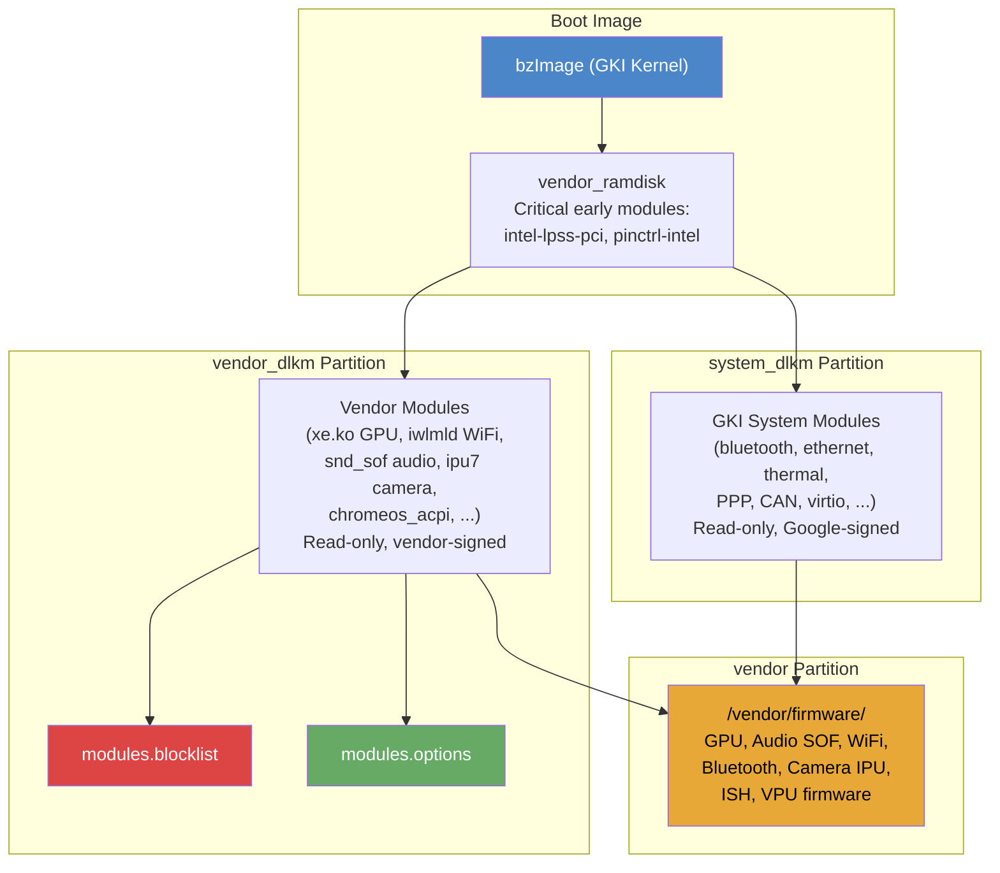
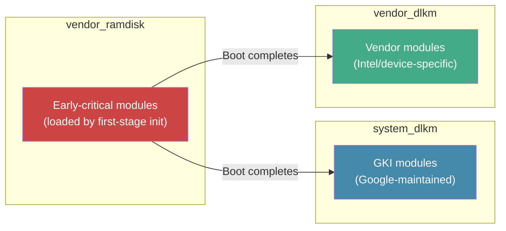
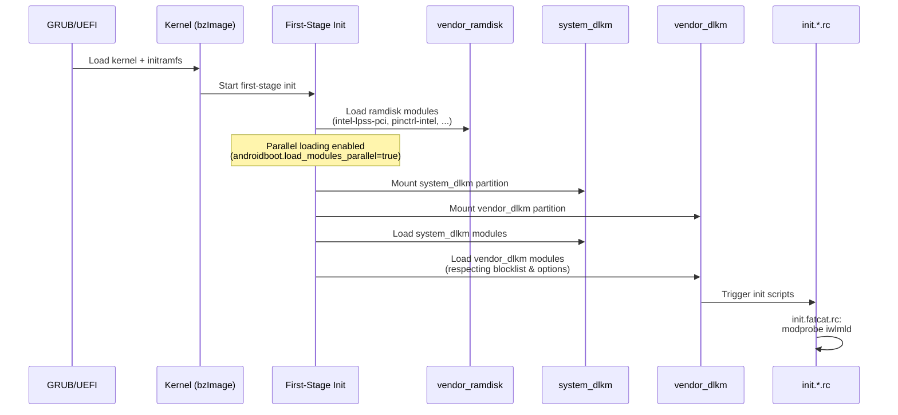
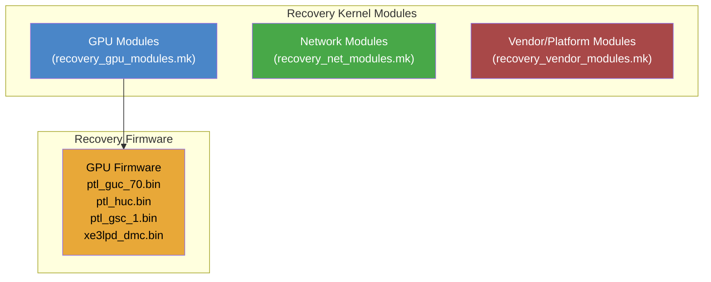
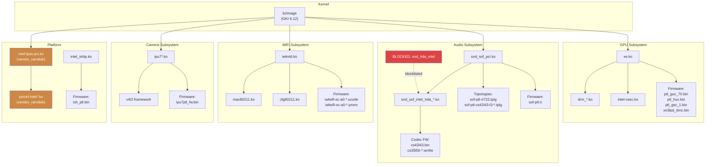

# Kernel, Modules, and Firmware

This document describes the kernel, loadable kernel module, and firmware blob
subsystems for the Android Desktop Platform (ADP), focusing on the **Fatcat**
(Intel Panther Lake) device family with comparisons to **Ocelot** where
relevant.

> **Cross-references:**
> See `01-build-system.md` for the overall build structure and `03-audio.md`
> for the SOF audio pipeline details.

---

## 1. Architecture Overview

The platform uses a Generic Kernel Image (GKI) architecture where the kernel
binary (`bzImage`) is shared across builds and device-specific functionality is
provided entirely through loadable kernel modules and firmware blobs.



### Key Design Principles

1. **GKI compliance** -- The kernel binary is a prebuilt Generic Kernel Image;
   all device-specific code lives in vendor modules.
2. **Partition separation** -- Modules are split across `system_dlkm` (GKI
   modules), `vendor_dlkm` (vendor modules), and `vendor_ramdisk` (critical
   early-boot modules).
3. **Firmware-class path** -- All firmware is served from `/vendor/firmware/`
   (set via kernel command line `firmware_class.path=/vendor/firmware`).
4. **Module blocklisting** -- Conflicting drivers (e.g., `snd_hda_intel`) are
   blocked in favor of the SOF audio stack.

---

## 2. Kernel Versioning

### 2.1 Available Kernel Versions

The kernel prebuilts are stored in `device/google/desktop/fatcat-kernels/` with
the following version directories:

| Directory | Kernel Version | Build Variants | Notes |
|-----------|---------------|----------------|-------|
| `6.6/` | 6.6.x | Single build + recovery + update images | Legacy kernel; all modules in `vendor_dlkm` only |
| `6.12/` | 6.12.x | Multiple CI builds (`ab-12971408` through `ab-13422743`), `legacy_kernel`, `legacy_kernel_internal` | Primary production kernel; modules split across `system_dlkm` and `vendor_dlkm` |
| `6.15/` | 6.15.x | OWNERS file only | Placeholder for future kernel |
| `6.18/` | 6.18.x | `ab-14576422`, `legacy_kernel_internal` | Next-generation kernel |
| `mainline/` | android-mainline | `legacy_kernel_internal` | Tracks upstream android-mainline |

### 2.2 Kernel Selection Mechanism

The active kernel is selected at build time via release configuration flags:

```makefile
# In fatcat_common.mk:
FATCAT_KERNEL_ROOT := device/google/desktop/fatcat-kernels/$(RELEASE_KERNEL_FATCAT_VERSION)/$(RELEASE_KERNEL_FATCAT_DIR)
```

Two flags control selection:

| Flag | Purpose | Example Values |
|------|---------|----------------|
| `RELEASE_KERNEL_FATCAT_VERSION` | Selects the kernel major version directory | `6.12`, `6.18`, `mainline` |
| `RELEASE_KERNEL_FATCAT_DIR` | Selects the specific build within that version | `ab-13422743`, `legacy_kernel`, `legacy_kernel_internal` |

The `legacy_kernel` value for `RELEASE_KERNEL_FATCAT_DIR` triggers special
behavior in `recovery_net_modules.mk` -- the 6.6 legacy kernel places all
ethernet modules in `vendor_dlkm` rather than splitting them across
`system_dlkm` and `vendor_dlkm`.

### 2.3 Kernel Build Outputs

Each kernel build directory contains:

```
<version>/<build_id>/
    bzImage              # Compressed kernel image (x86_64)
    System.map           # Kernel symbol map
    system_dlkm/         # GKI system modules (.ko files)
    vendor_dlkm/         # Vendor-specific modules (.ko files)
```

The 6.6 legacy kernel additionally provides:
```
6.6/
    recovery/vmlinuz.image   # Recovery-mode kernel
    update/vmlinuz.image     # USB update kernel
```

### 2.4 Architecture Configuration

Both Fatcat and Ocelot target the **Panther Lake** microarchitecture:

```makefile
# fatcat/BoardConfig.mk and ocelot/BoardConfig.mk:
TARGET_ARCH_VARIANT := pantherlake
TARGET_2ND_ARCH_VARIANT := pantherlake
```

The base architecture is x86_64 with ARM64 native bridge (set in `board_x86.mk`):

```makefile
TARGET_ARCH := x86_64
TARGET_CPU_ABI := x86_64
TARGET_NATIVE_BRIDGE_ARCH := arm64
TARGET_NATIVE_BRIDGE_ARCH_VARIANT := armv8-a
```

---

## 3. Module Partitioning

### 3.1 Partition Overview



### 3.2 vendor_ramdisk -- Critical Early-Boot Modules

These modules must be available during first-stage init before `system_dlkm` and
`vendor_dlkm` partitions are mounted. They are embedded in the vendor ramdisk.

| Module | Purpose |
|--------|---------|
| `mfd-core.ko` | Multi-function device core framework |
| `intel-lpss.ko` | Intel Low Power Subsystem base driver |
| `intel-lpss-pci.ko` | Intel LPSS PCI enumeration (required for serial console) |
| `pinctrl-intel.ko` | Intel pin control base driver |
| `pinctrl-intel-platform.ko` | Intel platform pin control (required by intel-thc, intel-quicki2c, intel-quickspi) |

> **Why vendor_ramdisk?** The Intel LPSS PCI driver must initialize before
> `vendor_dlkm` is mounted to ensure the serial console (8250_dw UART) works
> properly. Loading from `vendor_dlkm` causes an initialization race condition
> where early serial output is cut off and input stops working (b/425909420).
> Similarly, `pinctrl-intel` and `pinctrl-intel-platform` must load early for
> dependent touch/HID drivers (b/461928138).

### 3.3 system_dlkm -- GKI System Modules

All `.ko` files from `$(FATCAT_KERNEL_ROOT)/system_dlkm/` are automatically
included via wildcard:

```makefile
BOARD_SYSTEM_KERNEL_MODULES := \
     $(sort $(wildcard $(FATCAT_KERNEL_ROOT)/system_dlkm/*.ko))
```

These are Google-maintained GKI modules including:
- **Bluetooth**: `bluetooth.ko`, `btbcm.ko`, `btqca.ko`, `btsdio.ko`, `hci_uart.ko`, `hidp.ko`, `rfcomm.ko`, `rfkill.ko`
- **Networking**: `mii.ko`, `pps_core.ko`, `ptp.ko`, `usbnet.ko`, `cdc_ether.ko`, `aqc111.ko`, `asix.ko`, `ax88179_178a.ko`, `r8152.ko`, `r8153_ecm.ko`, `rtl8150.ko`
- **Thermal**: `acpi_thermal_rel.ko`, `int3400_thermal.ko`, `int3401_thermal.ko`, `int3402_thermal.ko`, `int3403_thermal.ko`, `int340x_thermal_zone.ko`, `processor_thermal_*.ko`
- **PPP/VPN**: `ppp_generic.ko`, `ppp_deflate.ko`, `ppp_mppe.ko`, `pppox.ko`, `pptp.ko`, `l2tp_core.ko`, `l2tp_ppp.ko`
- **Test/KUnit**: `kunit.ko`, `kunit-test.ko`, various `*_test.ko` modules

### 3.4 vendor_dlkm -- Vendor Modules

All `.ko` files from `$(FATCAT_KERNEL_ROOT)/vendor_dlkm/` are automatically
included:

```makefile
BOARD_VENDOR_KERNEL_MODULES := \
     $(sort $(wildcard $(FATCAT_KERNEL_ROOT)/vendor_dlkm/*.ko))
```

Key vendor module categories include:
- **GPU**: `xe.ko`, `drm_buddy.ko`, `drm_display_helper.ko`, `drm_exec.ko`, `drm_gpuvm.ko`, `drm_suballoc_helper.ko`, `drm_ttm_helper.ko`, `gpu-sched.ko`, `intel-vsec.ko`, `video.ko`, `wmi.ko`
- **Audio SOF**: `snd_sof*.ko`, `snd_intel_dspcfg.ko`, `snd_intel_sdw_acpi.ko`
- **WiFi**: `iwlmld.ko`, `iwlwifi.ko`, `mac80211.ko`, `cfg80211.ko`
- **Camera IPU**: `ipu7*.ko`, `intel-ipu*.ko`
- **Ethernet (vendor)**: `alx.ko`, `igc.ko`, `r8169.ko`, `ipheth.ko`, and various USB-ethernet drivers
- **Platform**: `chromeos_acpi.ko`, `intel-lpss*.ko`, `pinctrl-*.ko`, `spi-intel*.ko`, `spi-nor.ko`, `mtd.ko`
- **Sensor hub**: `intel_ish_ipc.ko`, `intel_ishtp.ko`

### 3.5 Legacy Kernel Differences

With the legacy kernel (`RELEASE_KERNEL_FATCAT_DIR=legacy_kernel`), module
partitioning changes:
- **All ethernet modules** move to `vendor_dlkm` (no `system_dlkm` split)
- Additional MDIO/PHY dependency modules are required: `fixed_phy.ko`,
  `fwnode_mdio.ko`, `libphy.ko`, `mdio_devres.ko`, `of_mdio.ko`,
  `phylink.ko`, `selftests.ko`

---

## 4. Kernel Command Line

The full `BOARD_KERNEL_CMDLINE` is assembled across multiple makefiles. Here is
the complete breakdown, organized by subsystem:

### 4.1 Console and Debug (board_common.mk)

| Parameter | Value | Explanation |
|-----------|-------|-------------|
| `console=ttyS0,115200n8` | non-user builds | Serial console at 115200 baud, 8N1 (user builds: `console=null`) |
| `loglevel=1` | non-user builds | Kernel log level (1 = KERN_ALERT and above to console) |
| `DEBUG=1` | non-user builds | Enable debug mode |
| `console_msg_format=syslog` | all | Use syslog format for log-level/facility prefix |
| `log_buf_len=4M` | non-user / `1M` user | Kernel ring buffer size |
| `8250.nr_uarts=4` | all | Override GKI's `SERIAL_8250_RUNTIME_UARTS=0` to enable serial ports at runtime (b/355265752) |
| `earlyprintk=serial,ttys0,115200n8,keep` | Ocelot only | Early serial output for board bringup (b/398036586) |

### 4.2 Boot and Init (board_common.mk)

| Parameter | Value | Explanation |
|-----------|-------|-------------|
| `root=/dev/ram0` | all | Initial root filesystem is the ramdisk |
| `firmware_class.path=/vendor/firmware` | all | Firmware loading path for kernel's firmware_class subsystem |
| `reserve_mem=20M:2M:trace` | all | Reserve 20 MiB (2 MiB aligned) for persistent ftrace ring buffer |
| `trace_instance=boot_mapped^traceoff@trace` | all | Set up boot-mapped trace instance |

### 4.3 CPU and Scheduling (board_x86.mk, board_common.mk)

| Parameter | Value | Explanation |
|-----------|-------|-------------|
| `cpufreq.default_governor=performance` | all | Boot with performance governor for faster boot; userspace switches to powersave post-boot |
| `fred=on` | board_x86.mk | Enable FRED (Flexible Return and Event Delivery) x86 interrupt architecture |
| `fred=off` | fatcat/BoardConfig.mk | **Overrides** the above; disabled on Fatcat pending microcode fix (b/465407963) |
| `ia32_emulation=false` | all x86 | Disable 32-bit application support (b/407572113) |
| `vsyscall=none` | all x86 | Disable vsyscall emulation for security (b/384758871) |
| `sched_proxy_exec=1` | all | Enable Proxy Execution scheduler optimization |
| `proc_mem.force_override=ptrace` | all | Only allow memory overrides for active ptracers (6.12 kernel workaround) |
| `cgroup_disable=pressure` | all | Do not expose PSI (Pressure Stall Information) nodes in cgroup hierarchy |

### 4.4 Memory (fatcat/BoardConfig.mk)

| Parameter | Value | Explanation |
|-----------|-------|-------------|
| `thp_anon=16K-64K:never;128K:always;256K-2M:never` | Fatcat | Transparent Huge Pages policy: enable only 128K pages, disable all other sizes |

### 4.5 GPU (fatcat/BoardConfig.mk, board_common.mk)

| Parameter | Value | Explanation |
|-----------|-------|-------------|
| `xe.enable_psr=1` | Fatcat, Ocelot | Panel Self Refresh -- value `1` actually disables PSR2 (keeps PSR1 only) to avoid display artifacts |
| `drm.trace=0x106` | all | Enable DRM tracing: bit 1 (DRIVER messages) + bit 2 (KMS messages) + bit 8 (DP messages) |

### 4.6 Audio SOF (fatcat/BoardConfig.mk)

| Parameter | Value | Explanation |
|-----------|-------|-------------|
| `snd_intel_dspcfg.dsp_driver=3` | Fatcat, Ocelot | Force DSP driver type 3 (SOF - Sound Open Firmware) |
| `snd_sof_intel_hda_common.sof_use_tplg_nhlt=1` | Fatcat, Ocelot | Use NHLT (Non-HDA Link Table) from ACPI for topology configuration |
| `snd_sof_pci.ipc_type=1` | Fatcat, Ocelot | IPC type 1 (IPC4 protocol) for SOF PCI interface |
| `snd_intel_sdw_acpi.sdw_link_mask=0xF` | Fatcat, Ocelot | Enable SoundWire links 0-3 (bitmask 0xF = all four links) |
| `snd_sof.disable_function_topology=1` | Fatcat only | Force monolithic topology (`sof-ptl-rt722.tplg`) instead of function topologies that have mismatched SDCA function IDs for RT722 |

### 4.7 SPI NOR Flash (board_x86.mk)

| Parameter | Value | Explanation |
|-----------|-------|-------------|
| `spi-intel.writeable=1` | all x86 | Enable write access to SPI NOR FLASH containing BIOS |
| `spi-intel.ignore_protection_status=1` | all x86 | Bypass SPI flash write-protection status for BIOS updates |

### 4.8 Misc (fatcat/BoardConfig.mk, board_common.mk)

| Parameter | Value | Explanation |
|-----------|-------|-------------|
| `androidboot.enable_rescue_party=false` | Fatcat | Disable Android Rescue Party during development (allows boot even if APEX services crash) |
| `module_blacklist=cros_ec_debugfs` | all | Blacklist cros_ec_debugfs kernel module (b/448429895) |

### 4.9 Bootconfig Parameters

Set via `BOARD_BOOTCONFIG` (separate from kernel command line):

| Parameter | Value | Explanation |
|-----------|-------|-------------|
| `androidboot.hardware.platform=android-desktop` | all | Platform identifier |
| `androidboot.hardware=android-desktop` | all | Hardware identifier |
| `androidboot.load_modules_parallel=true` | all | Enable parallel module loading in first-stage init |
| `androidboot.selinux=permissive` | Ocelot only | SELinux permissive mode for early bringup (b/358675671) |

---

## 5. Module Loading

### 5.1 Boot-Time Module Loading Flow



### 5.2 Module Blocklist

File: `device/google/desktop/fatcat/modules.blocklist`
(also `device/google/desktop/ocelot/modules.blocklist`)

```
blocklist snd_hda_intel
```

**Reason:** The `snd_hda_intel` driver is the legacy Intel HDA audio driver.
It conflicts with the Sound Open Firmware (SOF) stack used on Panther Lake
platforms. If `snd_hda_intel` loads, it claims the HDA controller before
`snd_sof_pci` can, preventing the SOF audio pipeline from initializing. The
blocklist ensures that only the SOF driver (`snd_intel_dspcfg.dsp_driver=3`)
handles audio.

Additionally, `cros_ec_debugfs` is blacklisted via the kernel command line
parameter `module_blacklist=cros_ec_debugfs` (b/448429895).

### 5.3 Module Options

File: `device/google/desktop/fatcat/modules.options`

```
dyn_options snd_sof_pci system "/vendor/bin/mod_options --sof-fw"
options snd_sof_intel_hda_generic hda_model=alc-2024y-chromebook
```

| Directive | Module | Parameter | Explanation |
|-----------|--------|-----------|-------------|
| `dyn_options` | `snd_sof_pci` | Dynamically generated by `/vendor/bin/mod_options --sof-fw` | At module load time, `mod_options` is invoked to determine the correct SOF firmware path based on the hardware configuration. This enables per-SKU firmware selection. |
| `options` | `snd_sof_intel_hda_generic` | `hda_model=alc-2024y-chromebook` | Forces the HDA codec model to `alc-2024y-chromebook`, which applies the correct pin configurations and mixer settings for the Fatcat platform's audio hardware (Realtek ALC codec variant). |

### 5.4 Explicit Module Loading in init.fatcat.rc

The WiFi module `iwlmld.ko` is explicitly loaded during the `on init` phase
because automatic modalias-based loading does not trigger for it:

```rc
exec u:r:vendor_modprobe:s0 -- /vendor/bin/modprobe \
    --dirname=/vendor/lib/modules iwlmld
```

This is a workaround tracked in b/403581270.

---

## 6. Firmware Blob Management

### 6.1 Firmware Sources

Firmware blobs come from two locations:

1. **Device prebuilts** (`device/google/desktop/fatcat-prebuilts/linux-firmware/`) --
   Device-specific firmware not available in the generic `external/linux-firmware`
   repository.
2. **External linux-firmware** (`external/linux-firmware/`) -- Upstream
   linux-firmware repository, used for GPU GuC/HuC/DMC and rtw88 WiFi firmware
   via Soong packages.

### 6.2 Firmware Copy Mechanism

From `fatcat/BoardConfig.mk`:

```makefile
FATCAT_FW_PREBUILTS := device/google/desktop/fatcat-prebuilts/linux-firmware

# Recursively find all firmware files, excluding rtw88 and iwlwifi-so
# (those come from external/linux-firmware via Soong)
FIRMWARE_BLOBS := $(shell cd $(FATCAT_FW_PREBUILTS) && \
    find . -type f ! -path './rtw88/*' ! -name 'iwlwifi-so*' | sed 's|^\./||')

PRODUCT_COPY_FILES += $(foreach blob, $(FIRMWARE_BLOBS), \
    $(FATCAT_FW_PREBUILTS)/$(blob):$(TARGET_COPY_OUT_VENDOR)/firmware/$(blob))
```

Additionally, GPU firmware and rtw88 WiFi firmware are installed via Soong
packages:

```makefile
PRODUCT_PACKAGES += \
    linux_firmware_i915_xe \
    linux_firmware_xe_ptl \
    linux_firmware_rtw88-rtw8821a
```

### 6.3 Firmware Directory Structure

```
fatcat-prebuilts/linux-firmware/
    cirrus/                          # Cirrus Logic amplifier firmware
        cs35l56-b0-dsp1-misc-104315e4.wmfw
        cs35l56-b0-dsp1-misc-104315e4-l2u0.bin
        cs35l56-b0-dsp1-misc-104315e4-l2u1.bin
    cs42l43.bin                      # Cirrus Logic CS42L43 audio codec
    intel/
        ibt-00a0-00a1-*.{sfi,ddc}    # Intel Bluetooth (BE200/older)
        ibt-00a0-0fa1-*.{sfi,ddc}    # Intel Bluetooth (variant)
        ibt-1190-00a1-*.{sfi,ddc}    # Intel Bluetooth (BE211/newer)
        ibt-1190-01a1-*.{sfi,ddc}    # Intel Bluetooth (BE211 variant)
        ipu/
            ipu6ep_fw.bin            # Intel IPU6 camera firmware (EP)
            ipu6epes_fw.bin          # Intel IPU6 camera firmware (EP-ES)
            ipu7ptl_fw.bin           # Intel IPU7 camera firmware (Panther Lake)
            ipu7ptles_fw.bin         # Intel IPU7 camera firmware (PTL-ES)
        ish/
            ish_ptl.bin              # Intel Sensor Hub firmware (Panther Lake)
            ish_ptl_62b0f067_f59bf590.bin  # ISH firmware (specific build)
            ish_wcl.bin              # Intel Sensor Hub firmware (Wildcat Lake)
        sof-ipc4/
            ptl/
                community/
                    sof-ptl.ri                # SOF audio firmware (PTL community)
                    sof-ptl-openmodules.ri    # SOF with open modules
                sof-ptl.ri                    # SOF audio firmware (PTL release)
                sof-ptl-openmodules.ri
            wcl/
                community/
                    sof-wcl.ri                # SOF audio firmware (WCL community)
                    sof-wcl-openmodules.ri
                sof-wcl.ri
                sof-wcl-openmodules.ri
        sof-ipc4-tplg/
            sof-hda-generic.tplg              # Generic HDA topology
            sof-ptl-cs42l43-l3-cs35l56-l2.tplg  # CS42L43 + CS35L56 topology
            sof-ptl-es9356.tplg               # ESS ES9356 DAC topology
            sof-ptl-es9356-2ch.tplg           # ESS ES9356 2-channel
            sof-ptl-max98360a-rt5682.tplg     # MAX98360A + RT5682 topology
            sof-ptl-rt712-l3-rt1320-l2.tplg   # RT712 + RT1320 topology
            sof-ptl-rt712-l3-rt1320-l3.tplg   # RT712 + RT1320 (link 3)
            sof-ptl-rt721.tplg                # Realtek RT721 topology
            sof-ptl-rt721-l3-rt1320-l3.tplg   # RT721 + RT1320 topology
            sof-ptl-rt722.tplg                # Realtek RT722 topology
            sof-ptl-tas2563-rt5682.tplg       # TAS2563 + RT5682 topology
            sof-wcl-es9356.tplg               # WCL ESS topology
        vpu/
            vpu_50xx_v1.bin          # Intel VPU (NPU) firmware v1
    iwlwifi-bz-b0-wh-*.{ucode,pnvm}   # Intel WiFi BZ (Bluetooth + WiFi) firmware
    iwlwifi-sc-a0-wh-*.{ucode,pnvm}   # Intel WiFi SC (Solar City) firmware
    iwlwifi-sc-a0-whtc-*.{ucode,pnvm} # Intel WiFi SC TC variant
    iwlwifi-so-a0-gf-*.{ucode,pnvm}   # Intel WiFi SO (Solar) firmware
    rtl_bt/
        rtl8851bu_fw.bin             # Realtek Bluetooth firmware
    rtw89/
        rtw8851b_fw.bin              # Realtek WiFi firmware
    tas2563*.{bin,ftcfg}             # TI TAS2563 amplifier firmware/config
    xe/
        ptl_gsc_1.bin                # Intel Xe GPU GSC (Graphics Security Controller) firmware
```

### 6.4 Firmware-to-Hardware Mapping

| Hardware | Module(s) | Firmware Files | Source |
|----------|-----------|----------------|--------|
| **Intel Xe GPU (PTL)** | `xe.ko` | `xe/ptl_guc_70.bin` (GuC), `xe/ptl_huc.bin` (HuC), `xe/ptl_gsc_1.bin` (GSC), `i915/xe3lpd_dmc.bin` (DMC) | `external/linux-firmware` (GuC/HuC/DMC) + prebuilts (GSC) |
| **Intel SOF Audio** | `snd_sof_pci.ko` | `intel/sof-ipc4/ptl/*/sof-ptl.ri` + topology `.tplg` files | Prebuilts |
| **Cirrus CS42L43 Codec** | `snd_soc_cs42l43.ko` | `cs42l43.bin` | Prebuilts |
| **Cirrus CS35L56 Amp** | `snd_soc_cs35l56.ko` | `cirrus/cs35l56-b0-dsp1-misc-*.{wmfw,bin}` | Prebuilts |
| **TI TAS2563 Amp** | `snd_soc_tas2563.ko` | `tas2563*.bin`, `tas2563-*.ftcfg` | Prebuilts |
| **Intel WiFi (SC/BE211)** | `iwlmld.ko` | `iwlwifi-sc-a0-*.ucode`, `.pnvm` | Prebuilts |
| **Intel WiFi (BZ)** | `iwlmld.ko` | `iwlwifi-bz-b0-*.ucode`, `.pnvm` | Prebuilts |
| **Intel Bluetooth** | `btintel.ko` | `intel/ibt-*-*.{sfi,ddc}` | Prebuilts |
| **Intel IPU7 Camera** | `ipu7*.ko` | `intel/ipu/ipu7ptl_fw.bin` | Prebuilts |
| **Intel ISH Sensors** | `intel_ishtp.ko` | `intel/ish/ish_ptl.bin` | Prebuilts |
| **Intel VPU/NPU** | `intel_vpu.ko` | `intel/vpu/vpu_50xx_v1.bin` | Prebuilts |
| **Realtek WiFi** | `rtw89*.ko` | `rtw89/rtw8851b_fw.bin` | Prebuilts |
| **Realtek BT** | `btrtl.ko` | `rtl_bt/rtl8851bu_fw.bin` | Prebuilts |
| **Rtw88 WiFi** | `rtw88*.ko` | Provided via `external/linux-firmware` Soong package | `external/linux-firmware` |

### 6.5 Recovery Image Firmware

GPU firmware is explicitly included in the recovery image for display support
during recovery mode:

```makefile
PRODUCT_COPY_FILES += \
    external/linux-firmware/xe_ptl/xe/ptl_guc_70.bin:$(TARGET_COPY_OUT_RECOVERY)/root/vendor/firmware/xe/ptl_guc_70.bin \
    external/linux-firmware/xe_ptl/xe/ptl_huc.bin:$(TARGET_COPY_OUT_RECOVERY)/root/vendor/firmware/xe/ptl_huc.bin \
    $(FATCAT_FW_PREBUILTS)/xe/ptl_gsc_1.bin:$(TARGET_COPY_OUT_RECOVERY)/root/vendor/firmware/xe/ptl_gsc_1.bin \
    external/linux-firmware/i915_xe/i915/xe3lpd_dmc.bin:$(TARGET_COPY_OUT_RECOVERY)/root/vendor/firmware/i915/xe3lpd_dmc.bin
```

---

## 7. Device Event Handling (ueventd)

### 7.1 ueventd Configuration Hierarchy

The ueventd configuration is layered across multiple files:

```
ueventd.rc (common)             -- Base rules for all desktop devices
    ueventd.x86.rc (common)     -- x86-specific rules (CrOS EC, DBC, SPI NOR)
    ueventd.fatcat.rc (device)  -- Fatcat-specific rules (camera, keyboard backlight)
```

These are installed to:
- `/vendor/etc/ueventd.rc` (common base)
- `/vendor/etc/ueventd/ueventd.x86.rc` (x86 specific)
- `/vendor/etc/ueventd/ueventd.fatcat.rc` (device specific)

### 7.2 Common ueventd Rules (ueventd.rc)

**Driver-to-directory mapping:**

| Driver/Subsystem | Device Path | Purpose |
|-----------------|-------------|---------|
| `cdc_mbim` | `/dev/radio/` | Mobile broadband modem (MBIM) |
| `cdc_acm` | `/dev/radio/` | ACM serial modem interface |
| `wwan` subsystem | `/dev/radio/` | WWAN devices |
| `usbmon` subsystem | `/dev/` | USB monitoring |

**Key device node permissions:**

| Device | Permissions | Owner:Group | Purpose |
|--------|------------|-------------|---------|
| `/dev/ttyS*` | 0660 | root:system | Serial ports |
| `/dev/ttyUSB*` | 0660 | root:system | USB serial adapters |
| `/dev/ttyACM*` | 0660 | root:system | USB ACM serial |
| `/dev/tpm*` | 0660 | hsm:hsm | TPM security chip |
| `/dev/media*` | 0660 | system:system | Media controller devices |
| `/dev/v4l-subdev*` | 0660 | system:system | V4L2 sub-device interface |
| `/dev/ipu-psys0` | 0660 | system:system | IPU processing system |
| `/dev/radio/*` | 0660 | system:radio | Radio/modem devices |
| `/dev/gpiochip*` | 0660 | system:system | GPIO chip interface |
| `/dev/iio:device*` | 0660 | system:system | IIO sensor devices |
| `/dev/suspend_notifier` | 0660 | system:system | Suspend event notification |
| `/dev/mtd*` | 0664 | system:system | MTD (NOR flash) raw access |

**Storage partition permissions (secure storage/persist):**

| Device | Purpose |
|--------|---------|
| `/dev/block/sda29`, `/dev/block/sdb29`, `/dev/block/nvme0n1p29` | Secure storage partition |
| `/dev/block/sda30`, `/dev/block/sdb30`, `/dev/block/nvme0n1p30` | Persist partition |

**SELinux parallel restorecon optimization:**

The ueventd configuration enables parallel `restorecon` for directories
containing many files (`/sys/devices/pci0000:00`, `/sys/devices/system/cpu`,
`/sys/devices/system/memory`, etc.) and enables both `parallel_restorecon`
and `parallel_ueventd_main_loop`.

**Sysfs attribute permissions for subsystems:**

| Sysfs Path Pattern | Attribute | Purpose |
|-------------------|-----------|---------|
| `/sys/bus/usb/devices/*` | `power/wakeup`, `authorized` | USB device wake/auth control |
| `/sys/bus/i2c/devices/*` | `power/wakeup` | I2C device wake control |
| `/sys/bus/thunderbolt/devices*` | `authorized` | Thunderbolt device authorization |
| `/sys/class/typec/port*` | `data_role`, `power_role`, `priority`, `mode_selection` | USB Type-C role switching |
| `/sys/bus/iio/devices/iio:device*` | `buffer/*`, `sampling_frequency`, `events/*`, `scan_elements/*`, `trigger/*`, calibration attrs | IIO sensor operation and calibration |
| `/sys/class/bluetooth/hci*` | `reset` | Bluetooth controller reset |

### 7.3 x86-Specific ueventd Rules (ueventd.x86.rc)

| Device/Path | Permissions | Purpose |
|-------------|------------|---------|
| `/dev/cros_ec` | 0660, system:cros_ec | Chrome OS Embedded Controller |
| `/dev/cros_fp` | 0600, system:system | Chrome OS Fingerprint sensor |
| `/dev/ttyDBC0` | 0660, system:usb | USB Debug Capability device |
| `/sys/devices/pci0000:00/*` dbc attrs | 0660, system:usb | DBC configuration |
| `/sys/class/usb_role/*` role | 0660, system:usb | USB role switching |
| `/sys/devices/*/*/spi_master/spi*/spi*` spi-nor/* | 0444, system:ap_firmware | SPI NOR flash diagnostics (JEDEC ID, manufacturer, part name, SFDP) |

### 7.4 Fatcat-Specific ueventd Rules (ueventd.fatcat.rc)

```
modalias_handling enabled
```

This enables automatic module loading based on device modalias strings (the
kernel reports a modalias for each device, and ueventd invokes `modprobe` to
load the matching driver).

| Device/Path | Permissions | Purpose |
|-------------|------------|---------|
| `/dev/ion` | 0666, system:system | ION memory allocator (legacy) |
| `/dev/video*` | 0666, system:system | V4L2 video capture devices (camera) |
| `/dev/accel0` | 0666, system:system | Accelerator device (NPU/VPU) |
| `/dev/media*` | 0666, system:system | Media controller (camera pipeline) |
| `/dev/ipu*` | 0666, system:system | Intel IPU camera subsystem |
| `/dev/v4l-subdev*` | 0666, system:system | V4L2 sub-devices (camera sensors) |
| `/sys/bus/i2c/devices/i2c-PRP0001*` eeprom | 0644, system:system | Camera on-module EEPROM data |
| `/sys/devices/platform/GOOG0002:00/leds/*` brightness | 0660, system:system | Keyboard backlight control |
| `/sys/class/input/input*` inhibited | 0664, system:input | Input device inhibit control |

> **Note:** The Fatcat ueventd grants `0666` permissions to camera and video
> devices, which is broader than the common ueventd's `0660`. This is required
> for the camera HAL to access IPU/V4L2 devices without requiring additional
> SELinux domain transitions.

---

## 8. Recovery Mode

### 8.1 Recovery Module Architecture

Recovery mode requires a minimal set of kernel modules for GPU display,
network connectivity, and platform initialization. These are defined in three
separate makefiles and assembled in `BoardConfig.mk`.



### 8.2 Recovery GPU Modules

File: `device/google/desktop/fatcat/recovery_gpu_modules.mk`

These modules enable the Intel Xe GPU for display output during recovery:

| Module | Purpose |
|--------|---------|
| `drm_buddy.ko` | DRM memory buddy allocator |
| `drm_display_helper.ko` | DRM display helper functions |
| `drm_exec.ko` | DRM execution context |
| `drm_gpuvm.ko` | DRM GPU virtual memory management |
| `drm_suballoc_helper.ko` | DRM sub-allocation helper |
| `drm_ttm_helper.ko` | DRM TTM (Translation Table Maps) helper |
| `gpu-sched.ko` | GPU scheduler framework |
| `i2c-algo-bit.ko` | I2C bit-banging algorithm (for DDC/EDID) |
| `intel-vsec.ko` | Intel Vendor Specific Extended Capabilities |
| `video.ko` | ACPI video driver |
| `wmi.ko` | Windows Management Instrumentation interface |
| `xe.ko` | **Intel Xe GPU driver** |

### 8.3 Recovery Network Modules

File: `device/google/desktop/fatcat/recovery_net_modules.mk`

Ethernet modules for network-based recovery (sideloading, ADB over ethernet):

**System DLKM modules** (non-legacy kernel):

| Module | Hardware |
|--------|----------|
| `aqc111.ko` | Aquantia/Marvell AQC111 USB 5GbE |
| `asix.ko` | ASIX USB Ethernet |
| `ax88179_178a.ko` | ASIX AX88179/AX88178A USB 3.0 Ethernet |
| `cdc_ether.ko` | USB CDC Ethernet |
| `r8152.ko` | Realtek RTL8152/RTL8153 USB Ethernet |
| `r8153_ecm.ko` | Realtek RTL8153 ECM mode |
| `rtl8150.ko` | Realtek RTL8150 USB Ethernet |
| `mii.ko` | MII interface library |
| `pps_core.ko` | PPS (Pulse Per Second) core |
| `ptp.ko` | PTP (Precision Time Protocol) |
| `usbnet.ko` | USB networking framework |

**Vendor DLKM modules:**

| Module | Hardware |
|--------|----------|
| `alx.ko` | Qualcomm Atheros AR8161/AR8162 PCIe Ethernet |
| `dm9601.ko` | Davicom DM9601 USB Ethernet |
| `igc.ko` | Intel I225/I226 2.5GbE (non-legacy only) |
| `ipheth.ko` | Apple iPhone USB tethering (non-legacy only) |
| `jme.ko` | JMicron JMC250/JMC260 PCIe Ethernet |
| `mcs7830.ko` | MosChip MCS7830 USB Ethernet |
| `mdio.ko` | MDIO bus framework |
| `pegasus.ko` | ADMtek Pegasus USB Ethernet |
| `r8169.ko` | Realtek RTL8169 PCIe Gigabit Ethernet |
| `realtek.ko` | Realtek PHY driver |
| `smsc75xx.ko` | SMSC LAN75xx USB Ethernet |
| `smsc95xx.ko` | SMSC LAN95xx USB Ethernet |

### 8.4 Recovery Vendor/Platform Modules

File: `device/google/desktop/fatcat/recovery_vendor_modules.mk`

These modules provide essential platform support in recovery:

| Module | Purpose |
|--------|---------|
| `mfd-core.ko` | Multi-function device core |
| `intel-lpss.ko` | Intel Low Power Subsystem base |
| `intel-lpss-pci.ko` | Intel LPSS PCI interface (serial console) |
| `8250_dw.ko` | Synopsys DesignWare 8250 UART |
| `spi-intel-pci.ko` | Intel SPI PCI interface |
| `spi-intel.ko` | Intel SPI flash controller |
| `spi-nor.ko` | SPI NOR flash framework |
| `mtd.ko` | Memory Technology Devices subsystem |
| `chromeos_acpi.ko` | Chrome OS ACPI interface |
| `pinctrl-intel.ko` | Intel pin control driver |
| `pinctrl-tigerlake.ko` | Tiger Lake pin control tables |

### 8.5 Recovery Module Assembly

In `fatcat/BoardConfig.mk`, all recovery modules are assembled:

```makefile
BOARD_RECOVERY_KERNEL_MODULES += $(foreach mod, $(FATCAT_VENDOR_GPU_MODULES), \
    $(FATCAT_KERNEL_ROOT)/vendor_dlkm/$(mod))
BOARD_RECOVERY_KERNEL_MODULES += $(foreach mod, $(FATCAT_SYSTEM_ETH_NET_MODULES), \
    $(FATCAT_KERNEL_ROOT)/system_dlkm/$(mod))
BOARD_RECOVERY_KERNEL_MODULES += $(foreach mod, $(FATCAT_VENDOR_ETH_NET_MODULES), \
    $(FATCAT_KERNEL_ROOT)/vendor_dlkm/$(mod))
BOARD_RECOVERY_KERNEL_MODULES += $(foreach mod, $(FATCAT_VENDOR_KERNEL_MODULES), \
    $(FATCAT_KERNEL_ROOT)/vendor_dlkm/$(mod))
```

---

## 9. Init Scripts

### 9.1 Init Script Hierarchy

```
init.common.rc                    # All desktop devices (including Ika)
    init.device-x86.rc            # x86-specific init (backlight, powercap)
        init.fatcat.rc            # Fatcat device family
```

### 9.2 Common Init (init.common.rc)

**Phase: on init**

| Action | Purpose |
|--------|---------|
| Create `/dev/socket/pdx/` tree | Performance Data Exchange sockets for VR/buffer subsystems |
| Set `ro.surface_flinger.primary_display_orientation` | Configure display orientation from bootloader property |
| Write `/proc/sys/vm/swappiness` to 150 | Prefer zram over page cache eviction (3x cost ratio) |
| `chown/chmod` usbcore `authorized_default` | Allow USB authorization service to disable USB devices by default |

**Phase: on late-fs**

| Action | Purpose |
|--------|---------|
| `mount_all --late` | Mount remaining filesystems |

**Phase: on post-fs-data**

| Action | Purpose |
|--------|---------|
| Create `/data/vendor/wifi/` tree | WiFi HAL data directories (0771 wifi:wifi) |
| Create `/data/vendor/camera/` | Camera service data directory (0775 system:camera) |
| Create `/data/vendor/snapshot/` | Snapshot directory |

**Phase: on boot (debuggable)**

| Action | Purpose |
|--------|---------|
| `setprop service.adb.tcp.port 5555` | Force ADB TCP listening on debug builds |

**Phase: on property:sys.boot_completed=1**

| Action | Purpose |
|--------|---------|
| Set JIT cache properties | `dalvik.vm.jitinitialsize=128k`, `jitmaxsize=256m`, `jitthreshold=5000` |
| Set dalvik heap properties | `heapstartsize=16m`, `heapgrowthlimit=192m`, `heapsize=512m`, `heaptargetutilization=0.8` |
| Change WiFi coredump permissions | `chown system wifi` on wlan0 coredump sysfs |
| Enable block device polling | Write 2000ms to `events_dfl_poll_msecs` |

**Prefetch boot optimization** (when `ro.prefetch_boot.enabled=true`):
- `prefetch_replay` starts on early-init
- `prefetch_record` starts on init
- `prefetch_apex_replay` / `prefetch_apex_record` start on post-fs-data
- `prefetch_boot.record_stop` triggered on boot_completed

### 9.3 x86 Device Init (init.device-x86.rc)

**Phase: on init**

| Action | Purpose |
|--------|---------|
| Write "CREC" to `/proc/acpi/wakeup` | Enable wake from Chrome OS Embedded Controller (LID open) |
| `chown/chmod` intel_backlight brightness | Allow system to control display brightness |
| Set powercap energy_uj permissions | Enable Power Stats HAL to read RAPL energy counters (package-0, core, uncore, psys) |

### 9.4 Fatcat Init (init.fatcat.rc)

**Phase: on init**

| Action | Purpose |
|--------|---------|
| Write "H015" to `/proc/acpi/wakeup` | Prevent touchscreen from causing spurious wake-ups |
| `setprop ro.hardware.camera libcamera_hal_base` | Enable camera HAL v3 with libcamera base |
| Write "CNVB" to `/proc/acpi/wakeup` | Enable remote wakeup for Bluetooth controller with CNVi (b/361196873) |
| `modprobe iwlmld` | Load Intel WiFi module (workaround for b/403581270) |
| Write 0 to `xe/observation_paranoid` | Allow Mesa pps-producer to sample GPU counters without root |

**Phase: on property:vendor.thermal.link_ready=1**

| Action | Purpose |
|--------|---------|
| `chown/chmod` TFN1, TCHG cooling devices | Enable Thermal HAL to control fan (TFN1) and charge limiter (TCHG) |
| `chown/chmod` intel-rapl:0 PL1/PL2/PL4 constraints | Enable writing to package-0 power limits (both MSR and MMIO paths) |

**Phase: on property:sys.boot_completed=1**

| Action | Purpose |
|--------|---------|
| `setprop vendor.powerhal.init 1` | Signal Power HAL that boot is complete |

**Phase: on property:vendor.device.product.name=fatcat**

| Action | Purpose |
|--------|---------|
| `setprop vendor.desktop.profile_detection.enabled 1` | Enable Profile Detection Service for Fatcat |

---

## 10. Inter-Subsystem Dependencies

### 10.1 Dependency Graph



### 10.2 Audio SOF Dependencies

The SOF audio stack requires coordination across kernel command line, module
options, firmware, and topology files:

1. **Kernel cmdline** forces SOF driver selection: `snd_intel_dspcfg.dsp_driver=3`
2. **Module blocklist** prevents `snd_hda_intel` from claiming the HDA controller
3. **Module options** set dynamic firmware path (`dyn_options snd_sof_pci`) and
   codec model (`hda_model=alc-2024y-chromebook`)
4. **Kernel cmdline** configures IPC4 protocol: `snd_sof_pci.ipc_type=1`
5. **Kernel cmdline** enables all SoundWire links: `snd_intel_sdw_acpi.sdw_link_mask=0xF`
6. **Kernel cmdline** forces monolithic topology for RT722: `snd_sof.disable_function_topology=1`
7. **Firmware** provides runtime DSP code (`sof-ptl.ri`) and topology (`.tplg`) files

### 10.3 GPU Xe Dependencies

The Intel Xe GPU driver depends on:

1. **Kernel modules**: `drm_buddy.ko`, `drm_display_helper.ko`, `drm_exec.ko`,
   `drm_gpuvm.ko`, `drm_suballoc_helper.ko`, `drm_ttm_helper.ko`,
   `gpu-sched.ko`, `i2c-algo-bit.ko` (DDC), `intel-vsec.ko`, `video.ko`, `wmi.ko`
2. **Firmware**: GuC (command submission), HuC (media), GSC (security), DMC (display power)
3. **Kernel cmdline**: `xe.enable_psr=1` (disable PSR2), `drm.trace=0x106` (tracing)
4. **Init script**: `write /proc/sys/dev/xe/observation_paranoid 0` (GPU performance counters)

### 10.4 WiFi iwlmld Dependencies

1. **Kernel modules**: `mac80211.ko`, `cfg80211.ko`, `rfkill.ko`
2. **Firmware**: `iwlwifi-sc-a0-wh-*.ucode` (microcode), `.pnvm` (regulatory)
3. **Init script**: Explicit `modprobe iwlmld` in `init.fatcat.rc` (b/403581270)
4. **ACPI wakeup**: Bluetooth CNVi wakeup enabled via `write /proc/acpi/wakeup "CNVB"`

### 10.5 Camera IPU7 Dependencies

1. **Kernel modules**: `ipu7*.ko`, V4L2 framework modules
2. **Firmware**: `intel/ipu/ipu7ptl_fw.bin`
3. **Init script**: `setprop ro.hardware.camera libcamera_hal_base`
4. **ueventd**: Camera device nodes (`/dev/video*`, `/dev/media*`, `/dev/ipu*`,
   `/dev/v4l-subdev*`) with 0666 permissions; EEPROM access for camera module data

---

## 11. Key Files Reference

| File Path | Purpose | Format |
|-----------|---------|--------|
| `device/google/desktop/fatcat/BoardConfig.mk` | Fatcat board configuration: kernel cmdline, module lists, firmware blobs, recovery modules, partition sizes | Android Makefile |
| `device/google/desktop/fatcat/fatcat_common.mk` | Fatcat product configuration: kernel root path, ramdisk modules, product packages, camera, thermal/power HAL | Android Makefile |
| `device/google/desktop/fatcat/modules.blocklist` | Kernel modules to prevent from loading (snd_hda_intel) | `blocklist <module>` format |
| `device/google/desktop/fatcat/modules.options` | Module load-time parameters and dynamic option scripts | `options`/`dyn_options` format |
| `device/google/desktop/fatcat/init.fatcat.rc` | Fatcat device init: ACPI wakeup, camera HAL, WiFi modprobe, thermal/power HAL setup | Android init language |
| `device/google/desktop/fatcat/ueventd.fatcat.rc` | Fatcat device node permissions for camera, video, keyboard backlight | ueventd config format |
| `device/google/desktop/fatcat/recovery_gpu_modules.mk` | GPU module list for recovery mode (xe.ko and dependencies) | Android Makefile (variable definition) |
| `device/google/desktop/fatcat/recovery_net_modules.mk` | Ethernet module list for recovery (USB and PCIe ethernet drivers) | Android Makefile (variable definition) |
| `device/google/desktop/fatcat/recovery_vendor_modules.mk` | Platform module list for recovery (LPSS, SPI, pinctrl, ChromeOS ACPI) | Android Makefile (variable definition) |
| `device/google/desktop/common/init.common.rc` | Common init: PDX sockets, swappiness, WiFi dirs, JIT/heap tuning, prefetch | Android init language |
| `device/google/desktop/common/init.device-x86.rc` | x86 init: CrOS EC wakeup, backlight, RAPL energy counters | Android init language |
| `device/google/desktop/common/ueventd.rc` | Common ueventd: serial, TPM, media, radio, sensors, USB/Thunderbolt auth, storage partitions, parallel restorecon | ueventd config format |
| `device/google/desktop/common/ueventd.x86.rc` | x86 ueventd: CrOS EC/FP devices, USB DBC, USB role, SPI NOR diagnostics | ueventd config format |
| `device/google/desktop/common/board_common.mk` | Common board config: partitions, AVB, kernel cmdline (console, debug, cgroup, firmware_class, ftrace, drm trace, proxy exec) | Android Makefile |
| `device/google/desktop/common/board_x86.mk` | x86 board config: architecture, native bridge, cpufreq governor, FRED, SPI write enable, ia32/vsyscall disable, ESP/GRUB | Android Makefile |
| `device/google/desktop/common/device_x86.mk` | x86 device config: iHD driver, HWC3, Vulkan, gralloc, sensors HAL, BERT collector | Android Makefile |
| `device/google/desktop/ocelot/BoardConfig.mk` | Ocelot board config: similar to Fatcat with different firmware list, permissive SELinux, earlyprintk | Android Makefile |
| `device/google/desktop/ocelot/modules.blocklist` | Ocelot module blocklist (same as Fatcat: snd_hda_intel) | `blocklist <module>` format |
| `device/google/desktop/fatcat-kernels/` | Prebuilt kernel binaries and modules (6.6, 6.12, 6.15, 6.18, mainline) | Binary files (.ko, bzImage) |
| `device/google/desktop/fatcat-prebuilts/linux-firmware/` | Device-specific firmware blobs (audio, WiFi, Bluetooth, camera, GPU GSC, VPU, ISH) | Binary firmware files |
| `external/linux-firmware/` | Upstream linux-firmware (GPU GuC/HuC/DMC, rtw88 WiFi) | Binary firmware files + Soong build |

---

> **Document version:** Based on ww04-fatcat-bkc tree state as of 2026-02-12.
> Kernel prebuilts reference 6.12 builds up to ab-13422743 and 6.18 build ab-14576422.
