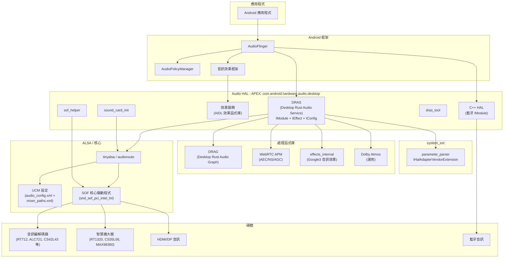
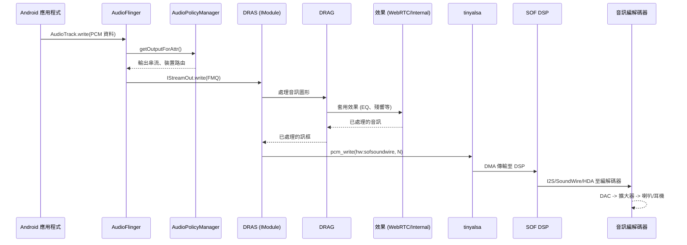
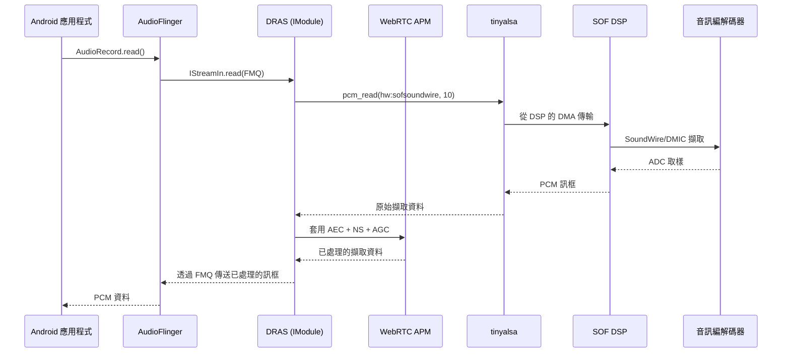
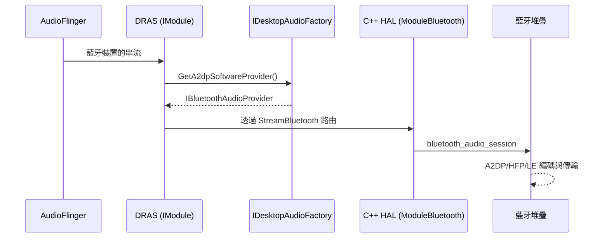

# 音訊子系統實作

本文件提供 Android 桌面平台音訊子系統的完整說明，涵蓋從韌體、核心驅動程式、HAL 到 Android 音訊框架的整體架構。

---

## 1. 架構概觀

音訊子系統採用分層架構，從硬體韌體向上延伸至 Android 應用程式層。主要的 HAL 實作 (DRAS) 以 Rust 撰寫，另有一個次要的 C++ HAL 負責藍牙音訊。



---

## 2. 主要元件

| 元件 | 路徑 | 語言 | 用途 |
|-----------|------|----------|---------|
| DRAS | `vendor/google/desktop/audio/dras/` | Rust | 主要音訊 HAL：實作 `IModule`、`IEffect`、`IConfig` |
| DRAG | `vendor/google/desktop/audio/drag/` | Rust | 音訊處理圖形函式庫，提供重新取樣與路由功能 |
| C++ HAL | `vendor/google/desktop/audio/cpp_hal/` | C++ | 次要 `IModule`，用於藍牙音訊 (移植自 Cuttlefish) |
| parameter_parser | `vendor/google/desktop/audio/parameter_parser/` | Rust | `system_ext` 服務，實作 `IHalAdapterVendorExtension` |
| sound_card_init | `vendor/google/desktop/audio/sound_card_init/` | Rust | 開機時音效卡初始化與擴大器校準 |
| sof_helper | `vendor/google/desktop/audio/sof_helper/` | Rust | SOF (Sound Open Firmware) 命令列工具，用於韌體互動 |
| sof_sys | `vendor/google/desktop/audio/sof_sys/` | Rust (bindgen) | SOF 核心標頭檔的 Rust 繫結 (`sof_abi_hdr`、`sof_ipc_ctrl_cmd`) |
| sof_control | `vendor/google/desktop/audio/sof_control/` | Rust | 透過 tinyalsa 與 SOF 韌體的控制介面 |
| effects_internal | `vendor/google/desktop/audio/effects_internal/` | C++ (預建置) | Google3 專有音訊效果預建置函式庫 |
| webrtc_apm | `vendor/google/desktop/audio/webrtc_apm/` | C++/Rust | WebRTC 音訊處理模組 (AEC、NS、AGC) |
| amp_calib | `vendor/google/desktop/audio/amp_calib/` | Rust | 擴大器校準 AIDL 服務 (範例實作) |
| common | `vendor/google/desktop/audio/common/` | Rust | DRAS 與 parameter_parser 使用的共用函式庫 |
| aidl | `vendor/google/desktop/audio/aidl/` | AIDL | 介面定義 (`IDesktopAudioFactory`、`IAecDump`) |
| aidl_prelude | `vendor/google/desktop/audio/aidl_prelude/` | Rust | 重新匯出所有常見音訊 AIDL Rust 符號的前導套件 |
| dras_tool | `vendor/google/desktop/audio/dras_tool/` | Rust | 裝置端命令列工具，用於偵錯及與 DRAS 互動 |
| drag_tool | `vendor/google/desktop/audio/drag_tool/` | Rust | DRAG 音訊圖形操作的命令列工具 |
| alsa_conformance_test | `vendor/google/desktop/audio/alsa_conformance_test/` | Rust | ALSA 一致性測試函式庫 |
| policy | `vendor/google/desktop/audio/policy/` | XML | 音訊策略設定檔 |
| dolby | `vendor/google/desktop/audio/dolby/` | Makefile | Dolby Atmos 整合與建置設定 |
| tests | `vendor/google/desktop/audio/tests/` | Rust | 裝置整合測試 |

---

## 3. DRAS - Desktop Rust Audio Service

DRAS 是主要的音訊 HAL 實作，以 Rust (edition 2021) 撰寫。它實作了 Android AIDL 音訊 HAL 介面。

### 3.1 實作的 HAL 介面

- **`IModule`** -- 核心音訊模組：串流管理、路由、裝置連接
- **`IEffect`** -- 音訊效果處理
- **`IConfig`** -- 音訊設定管理

### 3.2 服務執行檔

DRAS 產生兩個獨立的服務執行檔：

| 執行檔 | Crate 根目錄 | 說明 |
|--------|-----------|-------------|
| `android.hardware.audio.core-service.android-desktop` | `src/bin/core_hal_service.rs` | 核心音訊 HAL 服務 |
| `android.hardware.audio.effect-service.android-desktop` | `src/bin/effect_hal_service.rs` | 效果 HAL 服務 |

### 3.3 主要相依性

DRAS 連結大量的 Rust 相依性圖譜：

- **音訊框架**: `libaidl_prelude`、`android.hardware.common.fmq`、`libbinder_rs`、`libbinder_tokio_rs`
- **音訊處理**: `libdrag`、`libwebrtc_apm_rust`、`libdesktop_audio_effects_internal_rust`
- **硬體存取**: `libtinyalsa_rust_desktop`、`libaudioroute_rust_desktop`、`libsof_control`
- **藍牙**: `libbluetooth_audio_session_rust_desktop`
- **非同步執行環境**: `libtokio`
- **音訊圖形**: `libpetgraph` (用於音訊路由的圖形資料結構)
- **序列化**: `libserde`、`libserde_json`、`libserde_xml_rs`
- **工具**: `libanyhow`、`libthiserror`、`libchrono`、`libclap`、`libitertools`、`libnix`

### 3.4 功能旗標

| 功能 | 控制方式 | 說明 |
|---------|--------------|-------------|
| `ifactory_in_dras` | `RELEASE_DESKTOP_AUDIO_IFACTORY_IN_DRAS` | 在 DRAS 中啟用 `IDesktopAudioFactory` |
| `dolby` | `soong_config: desktop_audio.enable_dolby_service` | 透過 `vendor.dolby.dms-V1-rust` 啟用 Dolby Atmos 整合 |

### 3.5 AIDL 介面

在 `vendor/google/desktop/audio/aidl/` 中定義的自訂 AIDL 介面：

```java
// IDesktopAudioFactory - 公開藍牙音訊提供者
interface IDesktopAudioFactory {
    IBluetoothAudioProvider GetA2dpSoftwareProvider();
    IBluetoothAudioProvider GetHfpOutputSoftwareProvider();
    IBluetoothAudioProvider GetHfpInputSoftwareProvider();
    IBluetoothAudioProvider GetLeOutputSoftwareProvider();
    IBluetoothAudioProvider GetLeInputSoftwareProvider();
}

// IAecDump - 用於偵錯的 AEC 傾印錄製
interface IAecDump {
    void attachSession(IAecDumpSession session);
    void detachSession(IAecDumpSession session);
}
```

### 3.6 音訊效果設定

DRAS 附帶 `audio_effects_config.xml`，宣告效果函式庫及其路由：

**載入的函式庫：**

| 函式庫名稱 | 共用函式庫 | 說明 |
|-------------|---------------|-------------|
| aecsw | libaecsw.so | 聲學回音消除 |
| agc1sw | libagc1sw.so | 自動增益控制 v1 |
| agc2sw | libagc2sw.so | 自動增益控制 v2 |
| bassboostsw | libbassboostsw.so | 低音增強 |
| bundle | libbundleaidl.so | 套裝效果 (等化器、虛擬環繞、音量、低音增強) |
| downmix | libdownmixaidl.so | 降混 |
| dynamics_processing | libdynamicsprocessingaidl.so | 動態處理 |
| equalizersw | libequalizersw.so | 等化器 |
| eraser | liberaser.so | 背景音訊消除器 |
| haptic_generator | libhapticgeneratoraidl.so | 觸覺產生器 |
| loudness_enhancer | libloudnessenhanceraidl.so | 響度增強器 |
| nssw | libnssw.so | 噪音抑制 |
| env_reverbsw | libenvreverbsw.so | 環境殘響 |
| pre_processing | libpreprocessingaidl.so | 前處理 (AGCv2、NS) |
| preset_reverbsw | libpresetreverbsw.so | 預設殘響 |
| reverb | libreverbaidl.so | 殘響 (環境輔助/插入、預設輔助/插入) |
| virtualizersw | libvirtualizersw.so | 虛擬環繞 |
| visualizer | libvisualizeraidl.so | 視覺化器 |
| volumesw | libvolumesw.so | 音量 |
| extensioneffect | libextensioneffect.so | 擴充效果 (自訂) |
| spatializersw | libspatializersw.so | 空間化器 |

**套用至 `voice_communication` 串流的預設前處理：**
- `noise_suppression` (來自 `pre_processing` 函式庫)

---

## 4. DRAG - Desktop Rust Audio Graph

DRAG (`libdrag`) 是音訊處理圖形函式庫，提供桌面音訊堆疊中通用的音訊工具函式。

### 4.1 建置設定

- **Crate 名稱**: `drag`
- **語言**: Rust (edition 2021)
- **類型**: `rust_library`

### 4.2 相依性

| 相依性 | 用途 |
|-----------|---------|
| `libdasp_sample` | 數位音訊訊號處理取樣類型 |
| `libhound` | WAV 檔案讀寫 |
| `libpetgraph` | 用於音訊路由拓撲的有向圖 |
| `libsmallvec` | 堆疊配置的小型向量，提升效能 |
| `libzerocopy` | 零拷貝緩衝區管理 |
| `libserde` | 圖形設定的序列化 |
| `libitertools` | 迭代器工具 |

### 4.3 測試

- `libdrag_test` -- 主機端單元測試
- `libdrag_test_cov` -- 主機端單元測試，含覆蓋率檢測 (`-C instrument-coverage`)

---

## 5. 參數解析器

參數解析器是一個 `system_ext` 服務，實作 `IHalAdapterVendorExtension`，作為系統音訊框架與廠商 HAL 擴充之間的橋樑。

### 5.1 建置設定

- **執行檔**: `android.hardware.audio.parameter_parser.android-desktop`
- **分割區**: `system_ext`
- **安裝路徑**: `hw/` (相對路徑)
- **Init RC**: `android.hardware.audio.parameter_parser.android-desktop.rc`

### 5.2 相依性

| 相依性 | 用途 |
|-----------|---------|
| `libdesktop_audio_common_system` | 共用桌面音訊通用函式庫 (系統變體) |
| `libbinder_rs` | Binder IPC |
| `av-audio-types-aidl-rust` | 音訊類型 AIDL 定義 |
| `latest_android_hardware_audio_core_rust` | 音訊核心 HAL 介面 |

---

## 6. 音效卡初始化

`sound_card_init` 在開機時執行，用於偵測、設定及校準音訊硬體。

### 6.1 建置設定

- **執行檔**: `android.hardware.audio.sound-card-init.android-desktop`
- **Crate 名稱**: `sound_card_init`
- **版本**: `0.1.0`
- **安裝於**: APEX (`com.android.hardware.audio.desktop`)
- **Init RC**: `android.hardware.audio.sound-card-init.android-desktop.rc`

### 6.2 子函式庫

#### amp (擴大器函式庫)
- **路徑**: `vendor/google/desktop/audio/sound_card_init/amp/`
- **相依性**: `libdsm`、`libtinyalsa_rust_desktop`、`libsof_sys_bindgen` (僅限 Android)
- **用途**: 擴大器偵測、設定與校準

#### dsm (動態喇叭管理)
- **路徑**: `vendor/google/desktop/audio/sound_card_init/dsm/`
- **相依性**: `libdras`、`libdrag`、`libtinyalsa_rust_desktop`、`libaidl_prelude`
- **用途**: 透過 DSM 演算法提供喇叭保護與散熱管理

### 6.3 初始化流程

```
1. 開機觸發 -> sound_card_init 透過 init.rc 啟動
2. 透過 ALSA /sys/class/sound/ 偵測音效卡
3. 為偵測到的音效卡讀取 audio_config.xml
4. 初始化擴大器 (amp 函式庫)
5. 如適用則套用 DSM 校準
6. 透過 tinyalsa 設定初始混音器路徑
7. 向 DRAS 回報狀態
```

---

## 7. 音訊效果

### 7.1 effects_internal (Google3 效果)

來自 Google3 的專有音訊處理效果，以預建置共用函式庫形式提供。

- **路徑**: `vendor/google/desktop/audio/effects_internal/`
- **類型**: `cc_prebuilt_library_shared` (多架構)
- **支援架構**:
  - `android_arm` / `android_arm64`
  - `android_x86` / `android_x86_64`
  - `linux_glibc_x86_64` (主機)

Rust 繫結透過 `rust_bindgen` 由 `libdesktop_audio_effects_internal_bindgen` 提供，並有 Rust 包裝函式庫 `libdesktop_audio_effects_internal_rust`。

### 7.2 WebRTC APM (音訊處理模組)

移植自 WebRTC 的音訊處理模組，提供 AEC、NS、AGC 及 VAD 功能。

- **路徑**: `vendor/google/desktop/audio/webrtc_apm/`
- **C++ 函式庫**: `libwebrtc_apm` (靜態)
- **Rust 繫結**: `libwebrtc_apm_bindgen`
- **Rust 包裝**: `libwebrtc_apm_rust`

**建置旗標：**
```
-DWEBRTC_APM_DEBUG_DUMP=0
-DWEBRTC_ENABLE_PROTOBUF=1
-DWEBRTC_INTELLIGIBILITY_ENHANCER=0
-DWEBRTC_LINUX=1
-DWEBRTC_NS_FLOAT=1
-DWEBRTC_POSIX=1
```

**架構特定最佳化：**
- `x86` / `x86_64`: `-mavx2 -mfma` (AVX2 + FMA SIMD)
- `arm64`: `-DWEBRTC_HAS_NEON` (NEON SIMD)
- `riscv64`: 已停用

**原始檔：**
- `cras_config/aec_config.cc` -- AEC 設定 (來自 ChromeOS CRAS)
- `cras_config/apm_config.cc` -- APM 設定
- `voice_activity_detector.cc` -- VAD
- `webrtc_apm.cc` -- 主要 APM 介面

---

## 8. SOF 整合 (Sound Open Firmware)

SOF (Sound Open Firmware) 提供在 Intel 音訊 DSP 上運行的 DSP 韌體。桌面音訊堆疊透過多個元件與 SOF 互動。

### 8.1 sof_helper

- **路徑**: `vendor/google/desktop/audio/sof_helper/`
- **類型**: `rust_binary` (安裝於 APEX)
- **用途**: 用於 SOF 韌體操作的命令列工具
- **相依性**: `libsof_control`、`libtinyalsa_rust_desktop`、`libclap`、`libserde_json`
- **符號連結**: `/vendor/bin/sof_helper` -> `/apex/com.android.hardware.audio.desktop/bin/sof_helper`

### 8.2 sof_sys

- **路徑**: `vendor/google/desktop/audio/sof_sys/`
- **類型**: `rust_bindgen` (產生的 Rust FFI 繫結)
- **用途**: SOF 核心標頭檔的 Rust 繫結
- **允許清單類型**: `sof_abi_hdr`、`sof_ipc_ctrl_cmd`
- **標頭來源**: `device_kernel_headers`
- **可見性**: 僅限 `sound_card_init/amp`

### 8.3 sof_control

- **路徑**: `vendor/google/desktop/audio/sof_control/`
- **類型**: `rust_library`
- **用途**: 透過 tinyalsa 讀寫 SOF kcontrol 參數的 SOF 韌體控制介面
- **相依性**: `libtinyalsa_rust_desktop`、`libzerocopy`、`libclap`

### 8.4 SOF 音效卡名稱

每個編解碼器變體註冊為特定的 SOF 音效卡：

| 音效卡名稱 | 編解碼器設定 |
|----------------|-------------------|
| `hw:sofsoundwire` | SoundWire 編解碼器 (RT712、ALC721、ALC722、CS42L43) |
| `hw:sofhdadsp` | HDA DSP 編解碼器 (ALC256) |
| `hw:sofrt5682` | I2S 編解碼器 (RT5682/ALC5682i) |

---

## 9. ALSA/UCM 設定

### 9.1 設定階層

音訊設定遵循階層式結構：

```
device/google/desktop/
  common/alsa/
    for_all_boards/          # USB 及通用裝置設定
      <DeviceName>/
        audio_config.xml     # PCM 裝置與插孔對應
        mixer_paths.xml      # ALSA 混音器控制設定
  fatcat/alsa/
    for_all_boards/          # fatcat 的備援設定
      audio_config.xml       # 空白備援 (無裝置)
      mixer_paths.xml        # 空白備援 (無控制)
      volume_curves.xml      # 耳機與喇叭的音量曲線
    sof-soundwire_rt712_rt1320/
    sof-soundwire_alc721_alc721/
    sof-soundwire_alc722_alc722/
    sof-soundwire_cs42l43/
    sof-hda-dsp_alc256_alc256/
    sof-rt5682_alc5682i/
    sof-rt5682_alc5682i_max98360/
```

### 9.2 audio_config.xml 結構

每個編解碼器目錄包含一個 `audio_config.xml`，定義：

- **SoundCardName**: ALSA 音效卡識別碼 (例如 `hw:sofsoundwire`)
- **HiFi 設定檔**: 包含裝置區塊：
  - **Speaker**: PlaybackPCM 裝置
  - **Headphone**: PlaybackPCM、JackDev、JackSwitch
  - **InternalMic**: CapturePCM、CaptureChannelMap、IntrinsicSensitivity
  - **Mic**: CapturePCM、CaptureMixerElem、JackDev
  - **HDMI1-4**: PlaybackPCM、JackDev、PlaybackChannels
  - **SCOLineOut/SCOLineIn**: 藍牙 SCO PCM

**範例 (RT712 + RT1320)：**

```xml
<audio_config>
    <SoundCardName>hw:sofsoundwire</SoundCardName>
    <HiFi>
        <Speaker>
            <PlaybackPCM>hw:sofsoundwire,2</PlaybackPCM>
        </Speaker>
        <Headphone>
            <PlaybackPCM>hw:sofsoundwire,0</PlaybackPCM>
            <JackDev>sof-soundwire Headset Jack</JackDev>
            <JackSwitch>2</JackSwitch>
        </Headphone>
        <InternalMic>
            <CapturePCM>hw:sofsoundwire,10</CapturePCM>
            <CaptureChannelMap>
                <FL>0</FL><FR>1</FR><RL>2</RL><RR>3</RR>
            </CaptureChannelMap>
            <IntrinsicSensitivity>-2600</IntrinsicSensitivity>
        </InternalMic>
        <HDMI1><PlaybackPCM>hw:sofsoundwire,5</PlaybackPCM>...</HDMI1>
        ...
    </HiFi>
</audio_config>
```

### 9.3 mixer_paths.xml 結構

定義 ALSA 混音器控制的初始值及各路徑的覆寫設定：

**範例 (RT712 + RT1320)：**

```xml
<mixer enum_mixer_numeric_fallback="true">
    <!-- Default state: all outputs disabled -->
    <ctl name="Headphone Switch" value="0" />
    <ctl name="Headset Mic Switch" value="0" />
    <ctl name="rt712 FU05 Playback Volume" value="87" />
    <ctl name="rt712 FU06 Playback Volume" value="87" />
    <ctl name="Speaker Switch" value="0" />
    <ctl name="Dmic0 Capture Switch" value="0" />

    <path name="Speaker">
        <ctl name="Speaker Switch" value="1" />
    </path>
    <path name="Headphone">
        <ctl name="Headphone Switch" value="1" />
    </path>
    <path name="InternalMic">
        <ctl name="Dmic0 Capture Switch" value="1" />
    </path>
    <path name="Mic">
        <ctl name="Headset Mic Switch" value="1" />
        <ctl name="rt712 FU0F Capture Switch" value="1" />
    </path>
</mixer>
```

### 9.4 音量曲線

備援音量曲線 (`volume_curves.xml`) 為耳機與喇叭定義 101 點線性曲線：

- **範圍**: 0 至 100 階
- **dB 範圍**: -7000 至 0 (以 0.01 dB 為單位，即 -70.00 dB 至 0.00 dB)
- **每階大小**: 70 個單位 (每階 0.70 dB)
- **曲線類型**: 線性

### 9.5 備援設定

`fatcat/alsa/` 下的 `for_all_boards/` 目錄提供最小備援設定：
- 空白 `SoundCardName` (DRAS 自動偵測)
- 無裝置定義
- 空白混音器路徑
- 用途：防止音訊服務在不支援的硬體上當掉

### 9.6 通用 USB 裝置設定

`device/google/desktop/common/alsa/for_all_boards/` 目錄包含各 USB 音訊裝置的個別設定。支援的 USB 裝置包括 (部分列表)：
- Anker PowerConf
- Logitech BRIO、Logi Dock、Logi MeetUp
- EPOS ADAPT/IMPACT 耳機系列
- Jabra SPEAK 810
- Pixel USB-C Earbuds
- Plantronics/Poly 耳機
- HyperX 耳機
- 及更多

每個 USB 裝置都有自己的 `audio_config.xml` 和 `mixer_paths.xml`。

---

## 10. 音訊策略設定

音訊策略透過 `vendor/google/desktop/audio/policy/` 中的 XML 檔案設定。

### 10.1 主要設定 (`audio_policy_configuration.xml`)

```xml
<audioPolicyConfiguration version="7.0">
    <globalConfiguration speaker_drc_enabled="false"/>
    <modules>
        <!-- Primary Audio HAL -->
        <xi:include href="primary_audio_policy_configuration.xml"/>
        <!-- Remote Submix Audio HAL -->
        <xi:include href="r_submix_audio_policy_configuration.xml"/>
        <!-- Bluetooth Audio HAL -->
        <xi:include href="bluetooth_audio_policy_configuration_7_0.xml"/>
        <!-- USB Audio HAL -->
        <xi:include href="usb_audio_policy_configuration.xml"/>
    </modules>
    <xi:include href="audio_policy_volumes.xml"/>
    <xi:include href="default_volume_tables.xml"/>
</audioPolicyConfiguration>
```

主要設定：
- **版本**: 7.0
- **喇叭 DRC**: 已停用
- **4 個 HAL 模組**: primary、r_submix、bluetooth、usb

### 10.2 主要音訊策略

主要模組 (`halVersion="3.0"`) 定義：

**已附加裝置：**
- 喇叭 (預設輸出)
- 內建麥克風
- Telephony Tx / Telephony Rx
- FM Tuner

**混音埠：**

| 埠 | 角色 | 格式 | 取樣率 | 聲道遮罩 |
|------|------|---------|-------------|---------------|
| primary output | source | PCM_16_BIT | 8000, 11025, 16000, 32000, 44100, 48000 | MONO, STEREO |
| primary input | sink | PCM_16_BIT | 8000, 11025, 16000, 32000, 44100, 48000 | IN_MONO, IN_STEREO |
| telephony_tx | source | PCM_16_BIT | 8000-48000 | MONO, STEREO |
| telephony_rx | sink | PCM_16_BIT | 8000-48000 | IN_MONO, IN_STEREO |
| fm_tuner | sink | PCM_16_BIT | 8000-48000 | IN_MONO, IN_STEREO |

**路由：**
- `primary output` -> `Speaker`
- `Built-In Mic` -> `primary input`
- `Telephony Rx` -> `telephony_rx`
- `telephony_tx` -> `Telephony Tx`
- `FM Tuner` -> `fm_tuner`

### 10.3 藍牙音訊策略

藍牙模組 (`halVersion="2.0"`) 提供：
- **助聽器輸出**: PCM 16-bit, 16000/24000 Hz, 立體聲
- **裝置埠**: `BT Hearing Aid Out` (`AUDIO_DEVICE_OUT_HEARING_AID`)

---

## 11. Dolby 支援

### 11.1 Dolby Atmos 整合 (`dolby.mk`)

Dolby Atmos 根據裝置和建置旗標有條件地啟用：

**啟用的裝置**: `lapis`、`navi`、`ruby`、`sapphire`

**建置旗標閘控**: `RELEASE_DESKTOP_AUDIO_DOLBY_ATMOS=true`

**函式庫檢查**: `vendor/dolby/ds-desktop/` 必須存在。

**啟用時：**
- 複製 `dax3-default-stereo-speaker.xml` 至 `/vendor/etc/dolby/dax-default.xml`
- 複製 `media_codecs_dax3.xml` 至 `/vendor/etc/media_codecs_dax3.xml`
- 包含 Dolby makefile：`google-desktop-dolby-config.mk`、`dolby-buildspec.mk`、`dolby-product.mk`
- 安裝 `libdesktopaudiodata` (AC4 金鑰)
- 設定 `soong_config: desktop_audio.enable_dolby_service=true`

**停用時：**
- 安裝空白的 `media_codecs_dax3_empty.xml`

### 11.2 DRAS Dolby 整合

DRAS 有條件地編譯 Dolby 支援：
- 功能旗標：`dolby`
- Rust 函式庫：`vendor.dolby.dms-V1-rust` (Dolby Media Service AIDL)
- 控制方式：`soong_config_variable("desktop_audio", "enable_dolby_service")`

---

## 12. 擴大器校準

### 12.1 amp_calib 服務

- **路徑**: `vendor/google/desktop/audio/amp_calib/`
- **執行檔**: `vendor.amp.calib.example`
- **類型**: 廠商 AIDL 服務
- **介面**: `com.android.desktop.audio.amp-calib-aidl-V1`
- **Init RC**: `vendor.amp.calib.example.rc`
- **VINTF 片段**: `vendor.amp.calib.example.xml`

### 12.2 測試用戶端

- **執行檔**: `amp_calib_test_client`
- **用途**: 擴大器校準服務的命令列測試用戶端
- **相依性**: `libargh` (參數解析)、`libbinder_rs`、`libtokio`

### 12.3 Sound Card Init 擴大器函式庫

`sound_card_init` 子函式庫負責擴大器初始化：

- **libamp**: 讀取擴大器設定，在 Android 目標上套用 SOF sys 繫結
- **libdsm**: 動態喇叭管理 -- 使用 DRAS 和 DRAG 進行音訊處理以提供喇叭保護

---

## 13. APEX 封裝

### 13.1 APEX 定義

音訊子系統封裝為廠商 APEX：

```
Name:    com.android.hardware.audio.desktop
Version: 1
Vendor:  true
Updatable: false
```

### 13.2 APEX 內容

**執行檔：**

| 執行檔 | 說明 |
|--------|-------------|
| `android.hardware.audio.core-service.android-desktop` | DRAS 核心 HAL 服務 (Rust) |
| `android.hardware.audio.core-cpp-service.android-desktop` | C++ 藍牙 HAL 服務 |
| `android.hardware.audio.effect-service.android-desktop` | DRAS 效果 HAL 服務 (Rust) |
| `android.hardware.audio.effect.service-aidl.example` | 預設 C++ AIDL 效果 HAL |
| `android.hardware.audio.extension-effect-service.android-desktop` | 擴充效果服務 |
| `android.hardware.audio.sound-card-init.android-desktop` | 音效卡初始化器 |
| `dras_tool` | 命令列偵錯工具 |
| `sof_helper` | SOF 韌體輔助工具 |

**預建置檔案 (設定檔)：**

| 預建置檔案 | 說明 |
|----------|-------------|
| `android.hardware.audio.core-service.android-desktop.rc` | 核心服務的 Init RC |
| `android.hardware.audio.core-service.android-desktop.xml` | 核心服務的 VINTF 清單 |
| `android.hardware.audio.core-cpp-service.android-desktop.rc` | C++ 藍牙服務的 Init RC |
| `android.hardware.audio.core-cpp-service.android-desktop.xml` | C++ 藍牙服務的 VINTF 清單 |
| `android.hardware.audio.effect-service.android-desktop.xml` | 效果服務的 VINTF 清單 |
| `android.hardware.audio.extension-effect-service.android-desktop.rc` | 擴充效果的 Init RC |
| `android.hardware.audio.sound-card-init.android-desktop.rc` | 音效卡初始化的 Init RC |
| `com.android.hardware.audio.desktop.linker-config` | 連結器命名空間設定 |
| `vendor_google_desktop_audio_dras_audio_effects_config.xml` | 音訊效果設定 |

**有條件的預建置檔案：**
- `android.hardware.audio.effect-service.android-desktop.rc` -- 僅在 `RELEASE_DESKTOP_AUDIO_IFACTORY_IN_DRAS` 不為 `true` 時包含

### 13.3 連結器設定

APEX 連結器設定 (`linker.config.json`) 允許從以下路徑載入共用函式庫：
```json
{ "permittedPaths": ["/vendor/${LIB}/soundfx"] }
```

### 13.4 符號連結

為方便使用，工具透過符號連結加入 `$PATH`：
- `/vendor/bin/dras_tool` -> `/apex/com.android.hardware.audio.desktop/bin/dras_tool`
- `/vendor/bin/sof_helper` -> `/apex/com.android.hardware.audio.desktop/bin/sof_helper`

### 13.5 架構支援

- 支援所有架構，**除了** `riscv64` (執行檔透過 `exclude_binaries` 排除)

---

## 14. 資料流程

### 14.1 音訊播放流程



### 14.2 音訊擷取流程



### 14.3 藍牙音訊流程



---

## 15. 設定

### 15.1 建置時設定

**Soong 設定命名空間**: `desktop_audio`

| 變數 | 類型 | 說明 |
|----------|------|-------------|
| `arpal` | bool | 啟用 Qualcomm PAL (arpal) 支援 |
| `has_arpal_library` | bool | PAL 函式庫存在檢查 |
| `enable_arpal_unittest` | bool | PAL 單元測試啟用 |
| `enable_dolby_service` | bool | Dolby Atmos 服務啟用 |
| `has_dolby_library` | bool | Dolby 函式庫存在檢查 |

**發行旗標：**

| 旗標 | 說明 |
|------|-------------|
| `RELEASE_DESKTOP_AUDIO_IFACTORY_IN_DRAS` | 在 DRAS 中啟用 IDesktopAudioFactory |
| `RELEASE_DESKTOP_AUDIO_DOLBY_ATMOS` | 啟用 Dolby Atmos 解碼器 |

**Qualcomm PAL 支援 (目前已停用)：**
- 裝置: `bluey`、`quartz`、`quenbi`
- PAL 標頭路徑: `vendor/qcom/desktop/opensource/pal/inc/`
- 備註: 目前在 `audio.mk` 中以 `QC_DEVICES :=` 強制停用

### 15.2 執行時設定

音訊硬體變體偵測在開機時透過 `get_variant_audio` 進行：
- 讀取 `/sys/class/sound/*` 以識別音效卡
- 設定 `vendor_audio_prop` 系統屬性
- DRAS 讀取該屬性以載入正確的 `audio_config.xml` 和 `mixer_paths.xml`

### 15.3 產品套件

`audio.mk` makefile 將所有 AIDL 音訊效果函式庫加入 `PRODUCT_PACKAGES`：

```makefile
PRODUCT_PACKAGES += \
    libaecsw libagc1sw libagc2sw libbassboostsw libbundleaidl \
    libdownmixaidl libdynamicsprocessingaidl libenvreverbsw \
    libequalizersw liberaser libextensioneffect libhapticgeneratoraidl \
    libloudnessenhanceraidl libnssw libpreprocessingaidl \
    libpresetreverbsw libreverbaidl libspatializersw \
    libvirtualizersw libvisualizeraidl libvolumesw
```

---

## 16. 各裝置音訊編解碼器變體

### 16.1 Fatcat 主板編解碼器設定

| 目錄名稱 | 編解碼器 | 擴大器 | 匯流排類型 | 音效卡 | Deep Buffer |
|---------------|-------|-----------|----------|------------|-------------|
| `sof-soundwire_rt712_rt1320` | RT712 SDCA | RT1320 智慧擴大器 | SoundWire | `hw:sofsoundwire` | 否 |
| `sof-soundwire_alc721_alc721` | ALC721 (RT721) | ALC721 (內建) | SoundWire | `hw:sofsoundwire` | 是 |
| `sof-soundwire_alc722_alc722` | ALC722 (RT722) | ALC722 (內建) | SoundWire | `hw:sofsoundwire` | 否 |
| `sof-soundwire_cs42l43` | CS42L43 | CS35L56 (透過 ASP 橋接) | SoundWire | `hw:sofsoundwire` | 否 |
| `sof-hda-dsp_alc256_alc256` | ALC256 | ALC256 (內建) | HDA | `hw:sofhdadsp` | 否 |
| `sof-rt5682_alc5682i` | ALC5682i (RT5682) | 無 | I2S | `hw:sofrt5682` | 否 |
| `sof-rt5682_alc5682i_max98360` | ALC5682i (RT5682) | MAX98360 | I2S | `hw:sofrt5682` | 否 |

### 16.2 PCM 裝置對應 (SoundWire 編解碼器)

| 音訊端點 | RT712+RT1320 | ALC721 | ALC722 | CS42L43 |
|---------------|-------------|--------|--------|---------|
| 喇叭播放 | PCM 2 | PCM 2 | PCM 2 | PCM 0 (SimpleJack) |
| 耳機播放 | PCM 0 | PCM 0 | PCM 0 | PCM 0 |
| 內建麥克風擷取 | PCM 10 | PCM 10 | PCM 10 | PCM 4 |
| 耳機麥克風擷取 | PCM 1 | PCM 1 | PCM 1 | PCM 1 |
| HDMI 1-4 | PCM 5-8 | PCM 5-8 | PCM 5-8 | PCM 5-8 |
| SCO | PCM 20 | PCM 20 | PCM 20 | PCM 20 |
| 喇叭 deep buffer | 不適用 | PCM 35 | 不適用 | 不適用 |
| 耳機 deep buffer | 不適用 | PCM 31 | 不適用 | 不適用 |

### 16.3 PCM 裝置對應 (HDA / I2S 編解碼器)

| 音訊端點 | ALC256 (HDA) | RT5682 (I2S) | RT5682+MAX98360 (I2S) |
|---------------|-------------|-------------|---------------------|
| 喇叭播放 | PCM 0 | 不適用 | PCM 1 |
| 耳機播放 | PCM 0 | PCM 0 | PCM 0 |
| 內建麥克風擷取 | PCM 6 | PCM 99 | PCM 99 |
| 耳機麥克風擷取 | PCM 0 | PCM 0 | PCM 0 |
| HDMI 1-3/4 | PCM 3-5 | PCM 5-8 | PCM 5-8 |
| SCO | 不適用 | PCM 2 | PCM 2 |

### 16.4 CS42L43 喇叭路由細節

CS42L43 編解碼器具有獨特的喇叭路由方式，透過 ASP 橋接連接至外部 CS35L56 擴大器：

```
PCM0 (SimpleJack) -> SoundWire DP5 -> cs42l43 DP5RX
  -> cs42l43 ASPTX -> ASP bridge -> CS35L56 amplifiers -> Speakers
CS35L56 feedback -> cs42l43 ASPRX -> cs42l43 Speaker L/R Input -> Internal amp
```

CS42L43 喇叭路徑的關鍵混音器控制：
```xml
<ctl name="cs42l43 ASPTX1 Input" value="DP5RX1" />
<ctl name="cs42l43 ASPTX2 Input" value="DP5RX2" />
<ctl name="AMPL ASP1 TX1 Source" value="DSP1TX1" />
<ctl name="AMPR ASP1 TX2 Source" value="DSP1TX1" />
<ctl name="cs42l43 Speaker L Input 1" value="ASPRX1" />
<ctl name="cs42l43 Speaker R Input 1" value="ASPRX2" />
```

### 16.5 編解碼器特定的混音器控制

**RT712 SDCA 控制：**
- `rt712 ADC 23 Mux`: MIC2
- `rt712 FU44 Boost Volume`: 3
- `rt712 FU1E Capture Volume`: 63
- `rt712 FU0F Capture Volume`: 63
- `rt712 FU05 Playback Volume`: 87
- `rt712 FU06 Playback Volume`: 87

**ALC721 (RT721) 控制：**
- `rt721 ADC 07/08/09/10 Mux`: DMIC1 FE/RE, MIC2
- `rt721 FU33 Boost Volume`: 3
- `rt721 FU15 Boost Volume`: 3
- `rt721 FU1E Capture Volume`: 63
- `rt721 FU0F Capture Volume`: 63
- `rt721 FU05/FU06 Playback Volume`: 87

**ALC722 (RT722) 控制：**
- `rt722 ADC 22 Mux`: MIC2
- `rt722 FU33 Boost Volume`: 3
- `rt722 FU15 Boost Volume`: 3
- `rt722 FU1E Capture Volume`: 63
- `rt722 FU0F Capture Volume`: 63
- `rt722 FU05/FU06 Playback Volume`: 87

**ALC256 (HDA) 控制：**
- `Master Playback Volume`: 75
- `Master Playback Switch`: 1
- `Auto-Mute Mode`: 1 (喇叭路徑時停用)

---

## 17. 子系統間相依性

### 17.1 核心 SOF 模組

音訊子系統依賴核心 SOF (Sound Open Firmware) 模組：
- `snd_sof` -- 核心 SOF 框架
- `snd_sof_pci_intel_lnl` -- Intel Lunar Lake SOF PCI 驅動程式
- `snd_sof_intel_hda_common` -- Intel HDA 通用支援
- 用於 SDW 連接編解碼器的 SoundWire 匯流排驅動程式

### 17.2 hal_config.xml 相依性

DRAS 讀取 `hal_config.xml` (來自 `device/google/desktop/fatcat/`) 以取得主板層級設定，包括：
- 音訊編解碼器變體選擇
- 功能啟用旗標
- 裝置特定的調校參數

### 17.3 藍牙音訊

C++ HAL (`cpp_hal`) 將 DRAS 橋接至藍牙音訊堆疊：

**原始檔：**
- `service.cpp` -- 主要服務進入點
- `ModuleBluetooth.cpp` -- 藍牙 IModule 實作
- `StreamBluetooth.cpp` -- 藍牙串流處理
- `Bluetooth.cpp` -- 藍牙音訊工作階段管理
- `BluetoothAudioProviderFactory.cpp` -- 提供者工廠
- `DevicePortProxy.cpp` -- 裝置埠抽象層

**相依性：**
- `android.hardware.bluetooth.audio-impl`
- `libbluetooth_audio_session_aidl`
- `com.android.desktop.audio-ndk` (自訂 AIDL)

### 17.4 Qualcomm PAL (未來)

PAL (arpal) 整合計畫用於 Qualcomm 裝置 (`bluey`、`quartz`、`quenbi`)：
- 標頭路徑: `vendor/qcom/desktop/opensource/pal/inc/`
- 廠商連結器設定片段: `vendor_linker_arpal.config.json`
- 目前在 `audio.mk` 中強制停用

---

## 18. SEPolicy

在 `device/google/desktop/common/sepolicy/` 中定義了三個音訊相關的 SEPolicy 檔案：

### 18.1 hal_audio_default.te

```te
tmpfs_domain(hal_audio_default)

get_prop(hal_audio_default, vendor_audio_prop)
get_prop(hal_audio_default, vendor_device_info_prop)
r_dir_file(hal_audio_default, sysfs)

add_service(hal_audio_default, hal_audio_default_service)
binder_call(hal_audio_default, hal_audio_default)

allow hal_audio_default fwk_stats_service:service_manager find;
allow hal_audio_default cgroup:file { getattr read };  # tokio needs cpu.cfs_quota_us

# DRAS exposes IAecDump/default
add_service(hal_audio_default, aec_dump_service)

# DRAS writes aec dumps created by dras_tool
type dras_tool_aec_dump_file, file_type, data_file_type;
allow hal_audio_default dras_tool_aec_dump_file:file w_file_perms;
```

### 18.2 audioserver.te

```te
type hal_audio_default_tmpfs;
allow audioserver hal_audio_default_tmpfs:file { open read write map };
```

此規則授予 `audioserver` 存取 DRAS tmpfs 檔案 (用於 FMQ 的共用記憶體) 的權限。

### 18.3 get_variant_audio.te

```te
type get_variant_audio, domain;
type get_variant_audio_exec, exec_type, vendor_file_type, file_type;
init_daemon_domain(get_variant_audio)

r_dir_file(get_variant_audio, sysfs)          # 讀取 /sys/class/sound/*
allow get_variant_audio vendor_shell_exec:file rx_file_perms;
allow get_variant_audio vendor_toolbox_exec:file rx_file_perms;
set_prop(get_variant_audio, vendor_audio_prop)  # 設定音訊變體屬性
```

---

## 19. 測試

### 19.1 測試執行檔與測試套件

| 測試 | 類型 | 說明 |
|------|------|-------------|
| `libdras_test` | `rust_test_host` | DRAS 單元測試 (主機) |
| `libdras_test_cov` | `rust_test_host` | DRAS 單元測試，含覆蓋率 |
| `libdrag_test` | `rust_test_host` | DRAG 音訊圖形單元測試 (主機) |
| `libdrag_test_cov` | `rust_test_host` | DRAG 單元測試，含覆蓋率 |
| `libwebrtc_apm_test` | `cc_test` | WebRTC APM C++ 測試 |
| `libwebrtc_apm_rust_test` | `rust_test` | WebRTC APM Rust 測試 (裝置) |
| `libwebrtc_apm_rust_test_cov` | `rust_test_host` | WebRTC APM Rust 測試，含覆蓋率 |
| `libdesktop_audio_effects_internal_rust_test` | `rust_test` | 內部效果測試 |
| `libsof_control_test` | `rust_test_host` | SOF 控制單元測試 |
| `libamp_test` | `rust_test_host` | 擴大器函式庫測試 |
| `libdsm_test` | `rust_test_host` | DSM 函式庫測試 |
| `libdesktop_audio_common_test` | `rust_test_host` | 通用函式庫測試 |
| `libaidl_prelude_test` | `rust_test_host` | AIDL 前導套件測試 |
| `android.hardware.audio.sound-card-init.android-desktop_test` | `rust_test_host` | 音效卡初始化測試 |
| `android.hardware.audio.parameter_parser.android-desktop_test` | `rust_test_host` | 參數解析器測試 |
| `vendor_google_desktop_audio_tests` | `rust_test` | 裝置整合測試 (需要 root) |
| `android.hardware.audio.alsa-conformance-test.android-desktop_test` | `rust_test_host` | ALSA 一致性測試 |

### 19.2 測試用命令列工具

| 工具 | 說明 |
|------|-------------|
| `dras_tool` | 裝置端命令列工具：與 DRAS 互動、錄製 AEC 傾印、ALSA 一致性測試 |
| `drag_tool` | 音訊圖形命令列工具：執行 DRAG 處理管線、序列化/反序列化圖形 |
| `sof_helper` | SOF 命令列工具：讀寫 SOF 韌體參數、查詢 DSP 狀態 |
| `amp_calib_test_client` | 擴大器校準測試用戶端 |

### 19.3 測試資料

- `webrtc_apm/testdata/the-quick-brown-fox_20230131.wav` -- C++ 測試音訊
- `webrtc_apm/testdata/the-quick-brown-fox_f32_20230131.wav` -- Rust 測試音訊 (f32 格式)

---

## 20. 主要檔案參考

| 檔案 | 路徑 (相對於原始碼根目錄) | 說明 |
|------|------|-------------|
| audio.mk | `vendor/google/desktop/audio/audio.mk` | 頂層音訊 makefile、效果套件、PAL 設定 |
| APEX Android.bp | `vendor/google/desktop/audio/Android.bp` | APEX 定義、預設值、符號連結 |
| APEX manifest | `vendor/google/desktop/audio/apex/manifest.json` | APEX 名稱與版本 |
| Linker config | `vendor/google/desktop/audio/apex/linker.config.json` | APEX 連結器命名空間 |
| DRAS Android.bp | `vendor/google/desktop/audio/dras/Android.bp` | DRAS 函式庫與服務執行檔 |
| DRAS core service | `vendor/google/desktop/audio/dras/src/bin/core_hal_service.rs` | 核心 HAL 服務進入點 |
| DRAS effect service | `vendor/google/desktop/audio/dras/src/bin/effect_hal_service.rs` | 效果 HAL 服務進入點 |
| Effects config | `vendor/google/desktop/audio/dras/audio_effects_config.xml` | 音訊效果函式庫宣告 |
| DRAG Android.bp | `vendor/google/desktop/audio/drag/Android.bp` | DRAG 函式庫 |
| C++ HAL Android.bp | `vendor/google/desktop/audio/cpp_hal/Android.bp` | C++ 藍牙 HAL |
| parameter_parser | `vendor/google/desktop/audio/parameter_parser/Android.bp` | 參數解析器服務 |
| sound_card_init | `vendor/google/desktop/audio/sound_card_init/Android.bp` | 音效卡初始化服務 |
| amp library | `vendor/google/desktop/audio/sound_card_init/amp/Android.bp` | 擴大器函式庫 |
| dsm library | `vendor/google/desktop/audio/sound_card_init/dsm/Android.bp` | 動態喇叭管理 |
| sof_helper | `vendor/google/desktop/audio/sof_helper/Android.bp` | SOF 輔助工具 |
| sof_sys | `vendor/google/desktop/audio/sof_sys/Android.bp` | SOF 核心標頭繫結 |
| sof_control | `vendor/google/desktop/audio/sof_control/Android.bp` | SOF 控制函式庫 |
| effects_internal | `vendor/google/desktop/audio/effects_internal/Android.bp` | Google3 效果預建置檔案 |
| webrtc_apm | `vendor/google/desktop/audio/webrtc_apm/Android.bp` | WebRTC APM |
| amp_calib | `vendor/google/desktop/audio/amp_calib/Android.bp` | 擴大器校準服務 |
| common | `vendor/google/desktop/audio/common/Android.bp` | 通用 Rust 函式庫 |
| aidl_prelude | `vendor/google/desktop/audio/aidl_prelude/Android.bp` | AIDL Rust 前導套件 |
| dras_tool | `vendor/google/desktop/audio/dras_tool/Android.bp` | DRAS 命令列工具 |
| drag_tool | `vendor/google/desktop/audio/drag_tool/Android.bp` | DRAG 命令列工具 |
| alsa_conformance | `vendor/google/desktop/audio/alsa_conformance_test/Android.bp` | ALSA 一致性測試 |
| dolby.mk | `vendor/google/desktop/audio/dolby/dolby.mk` | Dolby Atmos 設定 |
| Audio policy | `vendor/google/desktop/audio/policy/audio_policy_configuration.xml` | 主要音訊策略 |
| Primary policy | `vendor/google/desktop/audio/policy/primary_audio_policy_configuration.xml` | 主要 HAL 策略 |
| BT policy | `vendor/google/desktop/audio/policy/bluetooth_audio_policy_configuration_7_0.xml` | 藍牙音訊策略 |
| IDesktopAudioFactory | `vendor/google/desktop/audio/aidl/.../IDesktopAudioFactory.aidl` | 藍牙音訊工廠介面 |
| IAecDump | `vendor/google/desktop/audio/aidl/.../IAecDump.aidl` | AEC 傾印介面 |
| SEPolicy hal_audio | `device/google/desktop/common/sepolicy/hal_audio_default.te` | DRAS SELinux 策略 |
| SEPolicy audioserver | `device/google/desktop/common/sepolicy/audioserver.te` | Audioserver SELinux 策略 |
| SEPolicy variant | `device/google/desktop/common/sepolicy/get_variant_audio.te` | 變體偵測策略 |
| RT712 audio config | `device/google/desktop/fatcat/alsa/sof-soundwire_rt712_rt1320/audio_config.xml` | RT712 編解碼器設定 |
| RT712 mixer paths | `device/google/desktop/fatcat/alsa/sof-soundwire_rt712_rt1320/mixer_paths.xml` | RT712 混音器路徑 |
| ALC721 audio config | `device/google/desktop/fatcat/alsa/sof-soundwire_alc721_alc721/audio_config.xml` | ALC721 編解碼器設定 |
| ALC722 audio config | `device/google/desktop/fatcat/alsa/sof-soundwire_alc722_alc722/audio_config.xml` | ALC722 編解碼器設定 |
| CS42L43 audio config | `device/google/desktop/fatcat/alsa/sof-soundwire_cs42l43/audio_config.xml` | CS42L43 編解碼器設定 |
| ALC256 audio config | `device/google/desktop/fatcat/alsa/sof-hda-dsp_alc256_alc256/audio_config.xml` | ALC256 HDA 編解碼器設定 |
| RT5682 audio config | `device/google/desktop/fatcat/alsa/sof-rt5682_alc5682i/audio_config.xml` | RT5682 I2S 編解碼器設定 |
| Fallback audio config | `device/google/desktop/fatcat/alsa/for_all_boards/audio_config.xml` | 備援 (空白) 設定 |
| Volume curves | `device/google/desktop/fatcat/alsa/for_all_boards/volume_curves.xml` | 耳機/喇叭音量曲線 |
| Common USB configs | `device/google/desktop/common/alsa/for_all_boards/` | 各 USB 裝置的音訊設定 |
| Integration tests | `vendor/google/desktop/audio/tests/Android.bp` | 裝置整合測試 |
