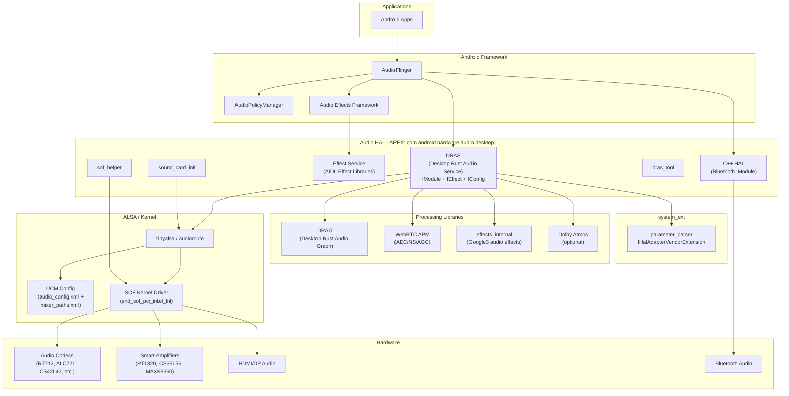
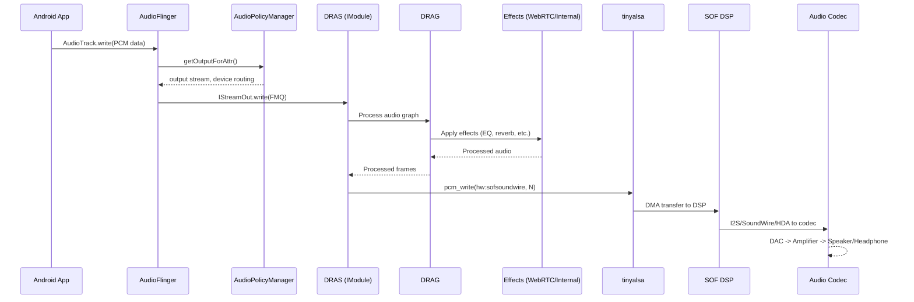
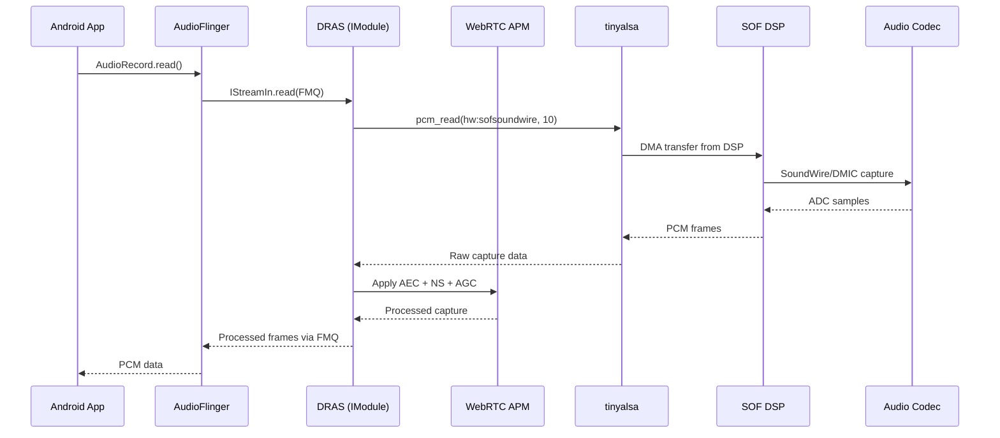
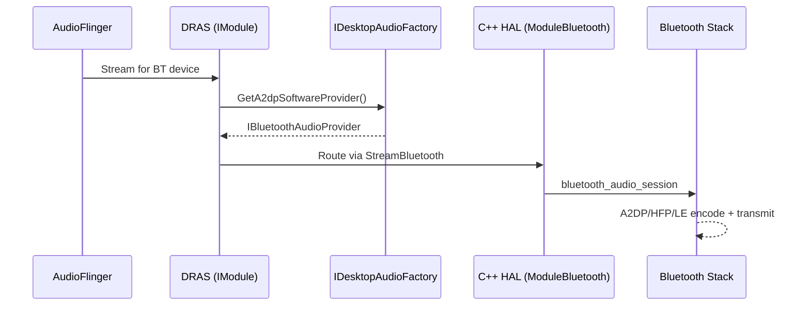

# Audio Subsystem Implementation

This document provides a comprehensive description of the Android Desktop Platform's audio subsystem, covering the architecture from firmware through kernel, HAL, and into the Android audio framework.

---

## 1. Architecture Overview

The audio subsystem follows a layered architecture from hardware firmware up to Android applications. The primary HAL implementation (DRAS) is written in Rust, with a secondary C++ HAL for Bluetooth audio.



---

## 2. Key Components

| Component | Path | Language | Purpose |
|-----------|------|----------|---------|
| DRAS | `vendor/google/desktop/audio/dras/` | Rust | Primary audio HAL: implements `IModule`, `IEffect`, `IConfig` |
| DRAG | `vendor/google/desktop/audio/drag/` | Rust | Audio processing graph library with resampling and routing |
| C++ HAL | `vendor/google/desktop/audio/cpp_hal/` | C++ | Secondary `IModule` for Bluetooth audio (ported from Cuttlefish) |
| parameter_parser | `vendor/google/desktop/audio/parameter_parser/` | Rust | `system_ext` service implementing `IHalAdapterVendorExtension` |
| sound_card_init | `vendor/google/desktop/audio/sound_card_init/` | Rust | Sound card initialization and amplifier calibration at boot |
| sof_helper | `vendor/google/desktop/audio/sof_helper/` | Rust | SOF (Sound Open Firmware) CLI tool for firmware interaction |
| sof_sys | `vendor/google/desktop/audio/sof_sys/` | Rust (bindgen) | Rust bindings to SOF kernel headers (`sof_abi_hdr`, `sof_ipc_ctrl_cmd`) |
| sof_control | `vendor/google/desktop/audio/sof_control/` | Rust | SOF firmware control interface via tinyalsa |
| effects_internal | `vendor/google/desktop/audio/effects_internal/` | C++ (prebuilt) | Google3 proprietary audio effect prebuilt libraries |
| webrtc_apm | `vendor/google/desktop/audio/webrtc_apm/` | C++/Rust | WebRTC Audio Processing Module (AEC, NS, AGC) |
| amp_calib | `vendor/google/desktop/audio/amp_calib/` | Rust | Amplifier calibration AIDL service (example implementation) |
| common | `vendor/google/desktop/audio/common/` | Rust | Shared library used by DRAS and parameter_parser |
| aidl | `vendor/google/desktop/audio/aidl/` | AIDL | Interface definitions (`IDesktopAudioFactory`, `IAecDump`) |
| aidl_prelude | `vendor/google/desktop/audio/aidl_prelude/` | Rust | Prelude crate re-exporting all common audio AIDL Rust symbols |
| dras_tool | `vendor/google/desktop/audio/dras_tool/` | Rust | On-device CLI tool for debugging and interacting with DRAS |
| drag_tool | `vendor/google/desktop/audio/drag_tool/` | Rust | CLI tool for DRAG audio graph operations |
| alsa_conformance_test | `vendor/google/desktop/audio/alsa_conformance_test/` | Rust | ALSA conformance testing library |
| policy | `vendor/google/desktop/audio/policy/` | XML | Audio policy configuration files |
| dolby | `vendor/google/desktop/audio/dolby/` | Makefile | Dolby Atmos integration and build configuration |
| tests | `vendor/google/desktop/audio/tests/` | Rust | Device integration tests |

---

## 3. DRAS - Desktop Rust Audio Service

DRAS is the primary audio HAL implementation, written in Rust (edition 2021). It implements the Android AIDL audio HAL interfaces.

### 3.1 HAL Interfaces Implemented

- **`IModule`** -- Core audio module: stream management, routing, device connection
- **`IEffect`** -- Audio effects processing
- **`IConfig`** -- Audio configuration management

### 3.2 Service Binaries

DRAS produces two separate service binaries:

| Binary | Crate Root | Description |
|--------|-----------|-------------|
| `android.hardware.audio.core-service.android-desktop` | `src/bin/core_hal_service.rs` | Core audio HAL service |
| `android.hardware.audio.effect-service.android-desktop` | `src/bin/effect_hal_service.rs` | Effect HAL service |

### 3.3 Key Dependencies

DRAS links against a substantial Rust dependency graph:

- **Audio framework**: `libaidl_prelude`, `android.hardware.common.fmq`, `libbinder_rs`, `libbinder_tokio_rs`
- **Audio processing**: `libdrag`, `libwebrtc_apm_rust`, `libdesktop_audio_effects_internal_rust`
- **Hardware access**: `libtinyalsa_rust_desktop`, `libaudioroute_rust_desktop`, `libsof_control`
- **Bluetooth**: `libbluetooth_audio_session_rust_desktop`
- **Async runtime**: `libtokio`
- **Audio graph**: `libpetgraph` (graph data structure for audio routing)
- **Serialization**: `libserde`, `libserde_json`, `libserde_xml_rs`
- **Utilities**: `libanyhow`, `libthiserror`, `libchrono`, `libclap`, `libitertools`, `libnix`

### 3.4 Feature Flags

| Feature | Controlled By | Description |
|---------|--------------|-------------|
| `ifactory_in_dras` | `RELEASE_DESKTOP_AUDIO_IFACTORY_IN_DRAS` | Enables `IDesktopAudioFactory` within DRAS |
| `dolby` | `soong_config: desktop_audio.enable_dolby_service` | Enables Dolby Atmos integration via `vendor.dolby.dms-V1-rust` |

### 3.5 AIDL Interfaces

Custom AIDL interfaces defined in `vendor/google/desktop/audio/aidl/`:

```java
// IDesktopAudioFactory - Exposes Bluetooth audio providers
interface IDesktopAudioFactory {
    IBluetoothAudioProvider GetA2dpSoftwareProvider();
    IBluetoothAudioProvider GetHfpOutputSoftwareProvider();
    IBluetoothAudioProvider GetHfpInputSoftwareProvider();
    IBluetoothAudioProvider GetLeOutputSoftwareProvider();
    IBluetoothAudioProvider GetLeInputSoftwareProvider();
}

// IAecDump - AEC dump recording for debugging
interface IAecDump {
    void attachSession(IAecDumpSession session);
    void detachSession(IAecDumpSession session);
}
```

### 3.6 Audio Effects Configuration

DRAS ships `audio_effects_config.xml` which declares effect libraries and their routing:

**Libraries loaded:**

| Library Name | Shared Library | Description |
|-------------|---------------|-------------|
| aecsw | libaecsw.so | Acoustic Echo Cancellation |
| agc1sw | libagc1sw.so | Automatic Gain Control v1 |
| agc2sw | libagc2sw.so | Automatic Gain Control v2 |
| bassboostsw | libbassboostsw.so | Bass Boost |
| bundle | libbundleaidl.so | Bundle effects (EQ, Virtualizer, Volume, Bass Boost) |
| downmix | libdownmixaidl.so | Downmix |
| dynamics_processing | libdynamicsprocessingaidl.so | Dynamics Processing |
| equalizersw | libequalizersw.so | Equalizer |
| eraser | liberaser.so | Background audio eraser |
| haptic_generator | libhapticgeneratoraidl.so | Haptic Generator |
| loudness_enhancer | libloudnessenhanceraidl.so | Loudness Enhancer |
| nssw | libnssw.so | Noise Suppression |
| env_reverbsw | libenvreverbsw.so | Environmental Reverb |
| pre_processing | libpreprocessingaidl.so | Pre-processing (AGCv2, NS) |
| preset_reverbsw | libpresetreverbsw.so | Preset Reverb |
| reverb | libreverbaidl.so | Reverb (env aux/ins, pre aux/ins) |
| virtualizersw | libvirtualizersw.so | Virtualizer |
| visualizer | libvisualizeraidl.so | Visualizer |
| volumesw | libvolumesw.so | Volume |
| extensioneffect | libextensioneffect.so | Extension Effect (custom) |
| spatializersw | libspatializersw.so | Spatializer |

**Default preprocessing** applied to `voice_communication` stream:
- `noise_suppression` (from `pre_processing` library)

---

## 4. DRAG - Desktop Rust Audio Graph

DRAG (`libdrag`) is the audio processing graph library providing common audio utilities used throughout the desktop audio stack.

### 4.1 Build Configuration

- **Crate name**: `drag`
- **Language**: Rust (edition 2021)
- **Type**: `rust_library`

### 4.2 Dependencies

| Dependency | Purpose |
|-----------|---------|
| `libdasp_sample` | Digital audio signal processing sample types |
| `libhound` | WAV file I/O |
| `libpetgraph` | Directed graph for audio routing topology |
| `libsmallvec` | Stack-allocated small vectors for performance |
| `libzerocopy` | Zero-copy buffer management |
| `libserde` | Serialization for graph configurations |
| `libitertools` | Iterator utilities |

### 4.3 Testing

- `libdrag_test` -- Host unit tests
- `libdrag_test_cov` -- Host unit tests with coverage instrumentation (`-C instrument-coverage`)

---

## 5. Parameter Parser

The parameter parser is a `system_ext` service implementing `IHalAdapterVendorExtension`, acting as a bridge between the system audio framework and vendor HAL extensions.

### 5.1 Build Configuration

- **Binary**: `android.hardware.audio.parameter_parser.android-desktop`
- **Partition**: `system_ext`
- **Install path**: `hw/` (relative)
- **Init RC**: `android.hardware.audio.parameter_parser.android-desktop.rc`

### 5.2 Dependencies

| Dependency | Purpose |
|-----------|---------|
| `libdesktop_audio_common_system` | Shared desktop audio common library (system variant) |
| `libbinder_rs` | Binder IPC |
| `av-audio-types-aidl-rust` | Audio types AIDL definitions |
| `latest_android_hardware_audio_core_rust` | Audio core HAL interface |

---

## 6. Sound Card Initialization

`sound_card_init` runs at boot to detect, configure, and calibrate audio hardware.

### 6.1 Build Configuration

- **Binary**: `android.hardware.audio.sound-card-init.android-desktop`
- **Crate name**: `sound_card_init`
- **Version**: `0.1.0`
- **Installed in**: APEX (`com.android.hardware.audio.desktop`)
- **Init RC**: `android.hardware.audio.sound-card-init.android-desktop.rc`

### 6.2 Sub-libraries

#### amp (Amplifier library)
- **Path**: `vendor/google/desktop/audio/sound_card_init/amp/`
- **Dependencies**: `libdsm`, `libtinyalsa_rust_desktop`, `libsof_sys_bindgen` (Android only)
- **Purpose**: Amplifier detection, configuration, and calibration

#### dsm (Dynamic Speaker Management)
- **Path**: `vendor/google/desktop/audio/sound_card_init/dsm/`
- **Dependencies**: `libdras`, `libdrag`, `libtinyalsa_rust_desktop`, `libaidl_prelude`
- **Purpose**: Speaker protection and thermal management via DSM algorithms

### 6.3 Initialization Flow

```
1. Boot trigger -> sound_card_init starts via init.rc
2. Detect sound card via ALSA /sys/class/sound/
3. Read audio_config.xml for the detected card
4. Initialize amplifiers (amp library)
5. Apply DSM calibration if applicable
6. Set initial mixer paths via tinyalsa
7. Report status to DRAS
```

---

## 7. Audio Effects

### 7.1 effects_internal (Google3 Effects)

Proprietary audio processing effects shipped as prebuilt shared libraries from Google3.

- **Path**: `vendor/google/desktop/audio/effects_internal/`
- **Type**: `cc_prebuilt_library_shared` (multi-arch)
- **Available architectures**:
  - `android_arm` / `android_arm64`
  - `android_x86` / `android_x86_64`
  - `linux_glibc_x86_64` (host)

Rust bindings are provided via `libdesktop_audio_effects_internal_bindgen` using `rust_bindgen`, with a Rust wrapper library `libdesktop_audio_effects_internal_rust`.

### 7.2 WebRTC APM (Audio Processing Module)

A port of WebRTC's audio processing module providing AEC, NS, AGC, and VAD.

- **Path**: `vendor/google/desktop/audio/webrtc_apm/`
- **C++ library**: `libwebrtc_apm` (static)
- **Rust bindings**: `libwebrtc_apm_bindgen`
- **Rust wrapper**: `libwebrtc_apm_rust`

**Build flags:**
```
-DWEBRTC_APM_DEBUG_DUMP=0
-DWEBRTC_ENABLE_PROTOBUF=1
-DWEBRTC_INTELLIGIBILITY_ENHANCER=0
-DWEBRTC_LINUX=1
-DWEBRTC_NS_FLOAT=1
-DWEBRTC_POSIX=1
```

**Architecture-specific optimizations:**
- `x86` / `x86_64`: `-mavx2 -mfma` (AVX2 + FMA SIMD)
- `arm64`: `-DWEBRTC_HAS_NEON` (NEON SIMD)
- `riscv64`: disabled

**Source files:**
- `cras_config/aec_config.cc` -- AEC configuration (from ChromeOS CRAS)
- `cras_config/apm_config.cc` -- APM configuration
- `voice_activity_detector.cc` -- VAD
- `webrtc_apm.cc` -- Main APM interface

---

## 8. SOF Integration (Sound Open Firmware)

SOF (Sound Open Firmware) provides the DSP firmware running on Intel audio DSPs. The desktop audio stack interfaces with SOF through multiple components.

### 8.1 sof_helper

- **Path**: `vendor/google/desktop/audio/sof_helper/`
- **Type**: `rust_binary` (installed in APEX)
- **Purpose**: CLI tool for SOF firmware operations
- **Dependencies**: `libsof_control`, `libtinyalsa_rust_desktop`, `libclap`, `libserde_json`
- **Symlink**: `/vendor/bin/sof_helper` -> `/apex/com.android.hardware.audio.desktop/bin/sof_helper`

### 8.2 sof_sys

- **Path**: `vendor/google/desktop/audio/sof_sys/`
- **Type**: `rust_bindgen` (generated Rust FFI bindings)
- **Purpose**: Rust bindings for SOF kernel headers
- **Allowlisted types**: `sof_abi_hdr`, `sof_ipc_ctrl_cmd`
- **Header source**: `device_kernel_headers`
- **Visibility**: restricted to `sound_card_init/amp`

### 8.3 sof_control

- **Path**: `vendor/google/desktop/audio/sof_control/`
- **Type**: `rust_library`
- **Purpose**: SOF firmware control interface for reading/writing SOF kcontrol parameters via tinyalsa
- **Dependencies**: `libtinyalsa_rust_desktop`, `libzerocopy`, `libclap`

### 8.4 SOF Sound Card Names

Each codec variant registers as a specific SOF sound card:

| Sound Card Name | Codec Configuration |
|----------------|-------------------|
| `hw:sofsoundwire` | SoundWire codecs (RT712, ALC721, ALC722, CS42L43) |
| `hw:sofhdadsp` | HDA DSP codecs (ALC256) |
| `hw:sofrt5682` | I2S codecs (RT5682/ALC5682i) |

---

## 9. ALSA/UCM Configuration

### 9.1 Configuration Hierarchy

Audio configuration follows a hierarchical structure:

```
device/google/desktop/
  common/alsa/
    for_all_boards/          # USB and common device configs
      <DeviceName>/
        audio_config.xml     # PCM device and jack mappings
        mixer_paths.xml      # ALSA mixer control settings
  fatcat/alsa/
    for_all_boards/          # Fallback config for fatcat
      audio_config.xml       # Empty fallback (no devices)
      mixer_paths.xml        # Empty fallback (no controls)
      volume_curves.xml      # Volume curves for Headphone + Speaker
    sof-soundwire_rt712_rt1320/
    sof-soundwire_alc721_alc721/
    sof-soundwire_alc722_alc722/
    sof-soundwire_cs42l43/
    sof-hda-dsp_alc256_alc256/
    sof-rt5682_alc5682i/
    sof-rt5682_alc5682i_max98360/
```

### 9.2 audio_config.xml Structure

Each codec directory contains an `audio_config.xml` defining:

- **SoundCardName**: ALSA card identifier (e.g., `hw:sofsoundwire`)
- **HiFi profile**: Contains device blocks:
  - **Speaker**: PlaybackPCM device
  - **Headphone**: PlaybackPCM, JackDev, JackSwitch
  - **InternalMic**: CapturePCM, CaptureChannelMap, IntrinsicSensitivity
  - **Mic**: CapturePCM, CaptureMixerElem, JackDev
  - **HDMI1-4**: PlaybackPCM, JackDev, PlaybackChannels
  - **SCOLineOut/SCOLineIn**: Bluetooth SCO PCM

**Example (RT712 + RT1320):**

```xml
<audio_config>
    <SoundCardName>hw:sofsoundwire</SoundCardName>
    <HiFi>
        <Speaker>
            <PlaybackPCM>hw:sofsoundwire,2</PlaybackPCM>
        </Speaker>
        <Headphone>
            <PlaybackPCM>hw:sofsoundwire,0</PlaybackPCM>
            <JackDev>sof-soundwire Headset Jack</JackDev>
            <JackSwitch>2</JackSwitch>
        </Headphone>
        <InternalMic>
            <CapturePCM>hw:sofsoundwire,10</CapturePCM>
            <CaptureChannelMap>
                <FL>0</FL><FR>1</FR><RL>2</RL><RR>3</RR>
            </CaptureChannelMap>
            <IntrinsicSensitivity>-2600</IntrinsicSensitivity>
        </InternalMic>
        <HDMI1><PlaybackPCM>hw:sofsoundwire,5</PlaybackPCM>...</HDMI1>
        ...
    </HiFi>
</audio_config>
```

### 9.3 mixer_paths.xml Structure

Defines ALSA mixer control initial values and per-path overrides:

**Example (RT712 + RT1320):**

```xml
<mixer enum_mixer_numeric_fallback="true">
    <!-- Default state: all outputs disabled -->
    <ctl name="Headphone Switch" value="0" />
    <ctl name="Headset Mic Switch" value="0" />
    <ctl name="rt712 FU05 Playback Volume" value="87" />
    <ctl name="rt712 FU06 Playback Volume" value="87" />
    <ctl name="Speaker Switch" value="0" />
    <ctl name="Dmic0 Capture Switch" value="0" />

    <path name="Speaker">
        <ctl name="Speaker Switch" value="1" />
    </path>
    <path name="Headphone">
        <ctl name="Headphone Switch" value="1" />
    </path>
    <path name="InternalMic">
        <ctl name="Dmic0 Capture Switch" value="1" />
    </path>
    <path name="Mic">
        <ctl name="Headset Mic Switch" value="1" />
        <ctl name="rt712 FU0F Capture Switch" value="1" />
    </path>
</mixer>
```

### 9.4 Volume Curves

The fallback volume curves (`volume_curves.xml`) define 101-point linear curves for both Headphone and Speaker:

- **Range**: 0 to 100 steps
- **dB range**: -7000 to 0 (in units of 0.01 dB, so -70.00 dB to 0.00 dB)
- **Step size**: 70 units (0.70 dB per step)
- **Curve type**: Linear

### 9.5 Fallback Configuration

The `for_all_boards/` directory under `fatcat/alsa/` provides a minimal fallback configuration:
- Empty `SoundCardName` (DRAS auto-detects)
- No device definitions
- Empty mixer paths
- Purpose: Prevent audio service crashes on unsupported hardware

### 9.6 Common USB Device Configurations

The `device/google/desktop/common/alsa/for_all_boards/` directory contains per-device configurations for USB audio devices. Supported USB devices include (partial list):
- Anker PowerConf
- Logitech BRIO, Logi Dock, Logi MeetUp
- EPOS ADAPT/IMPACT headset series
- Jabra SPEAK 810
- Pixel USB-C Earbuds
- Plantronics/Poly headsets
- HyperX headsets
- And many more

Each USB device has its own `audio_config.xml` and `mixer_paths.xml`.

---

## 10. Audio Policy Configuration

Audio policy is configured through XML files in `vendor/google/desktop/audio/policy/`.

### 10.1 Main Configuration (`audio_policy_configuration.xml`)

```xml
<audioPolicyConfiguration version="7.0">
    <globalConfiguration speaker_drc_enabled="false"/>
    <modules>
        <!-- Primary Audio HAL -->
        <xi:include href="primary_audio_policy_configuration.xml"/>
        <!-- Remote Submix Audio HAL -->
        <xi:include href="r_submix_audio_policy_configuration.xml"/>
        <!-- Bluetooth Audio HAL -->
        <xi:include href="bluetooth_audio_policy_configuration_7_0.xml"/>
        <!-- USB Audio HAL -->
        <xi:include href="usb_audio_policy_configuration.xml"/>
    </modules>
    <xi:include href="audio_policy_volumes.xml"/>
    <xi:include href="default_volume_tables.xml"/>
</audioPolicyConfiguration>
```

Key settings:
- **Version**: 7.0
- **Speaker DRC**: disabled
- **4 HAL modules**: primary, r_submix, bluetooth, usb

### 10.2 Primary Audio Policy

The primary module (`halVersion="3.0"`) defines:

**Attached devices:**
- Speaker (default output)
- Built-In Mic
- Telephony Tx / Telephony Rx
- FM Tuner

**Mix ports:**

| Port | Role | Formats | Sample Rates | Channel Masks |
|------|------|---------|-------------|---------------|
| primary output | source | PCM_16_BIT | 8000, 11025, 16000, 32000, 44100, 48000 | MONO, STEREO |
| primary input | sink | PCM_16_BIT | 8000, 11025, 16000, 32000, 44100, 48000 | IN_MONO, IN_STEREO |
| telephony_tx | source | PCM_16_BIT | 8000-48000 | MONO, STEREO |
| telephony_rx | sink | PCM_16_BIT | 8000-48000 | IN_MONO, IN_STEREO |
| fm_tuner | sink | PCM_16_BIT | 8000-48000 | IN_MONO, IN_STEREO |

**Routes:**
- `primary output` -> `Speaker`
- `Built-In Mic` -> `primary input`
- `Telephony Rx` -> `telephony_rx`
- `telephony_tx` -> `Telephony Tx`
- `FM Tuner` -> `fm_tuner`

### 10.3 Bluetooth Audio Policy

The Bluetooth module (`halVersion="2.0"`) provides:
- **Hearing Aid Output**: PCM 16-bit, 16000/24000 Hz, stereo
- **Device port**: `BT Hearing Aid Out` (`AUDIO_DEVICE_OUT_HEARING_AID`)

---

## 11. Dolby Support

### 11.1 Dolby Atmos Integration (`dolby.mk`)

Dolby Atmos is conditionally enabled per device and build flag:

**Enabled devices**: `lapis`, `navi`, `ruby`, `sapphire`

**Build flag gate**: `RELEASE_DESKTOP_AUDIO_DOLBY_ATMOS=true`

**Library check**: `vendor/dolby/ds-desktop/` must exist.

**When enabled:**
- Copies `dax3-default-stereo-speaker.xml` to `/vendor/etc/dolby/dax-default.xml`
- Copies `media_codecs_dax3.xml` to `/vendor/etc/media_codecs_dax3.xml`
- Includes Dolby makefiles: `google-desktop-dolby-config.mk`, `dolby-buildspec.mk`, `dolby-product.mk`
- Installs `libdesktopaudiodata` (AC4 key)
- Sets `soong_config: desktop_audio.enable_dolby_service=true`

**When disabled:**
- Installs empty `media_codecs_dax3_empty.xml`

### 11.2 DRAS Dolby Integration

DRAS conditionally compiles Dolby support:
- Feature flag: `dolby`
- Rust library: `vendor.dolby.dms-V1-rust` (Dolby Media Service AIDL)
- Controlled by: `soong_config_variable("desktop_audio", "enable_dolby_service")`

---

## 12. Amplifier Calibration

### 12.1 amp_calib Service

- **Path**: `vendor/google/desktop/audio/amp_calib/`
- **Binary**: `vendor.amp.calib.example`
- **Type**: Vendor AIDL service
- **Interface**: `com.android.desktop.audio.amp-calib-aidl-V1`
- **Init RC**: `vendor.amp.calib.example.rc`
- **VINTF fragment**: `vendor.amp.calib.example.xml`

### 12.2 Test Client

- **Binary**: `amp_calib_test_client`
- **Purpose**: CLI test client for the amp calibration service
- **Dependencies**: `libargh` (argument parsing), `libbinder_rs`, `libtokio`

### 12.3 Sound Card Init Amplifier Libraries

The `sound_card_init` sub-libraries handle amplifier initialization:

- **libamp**: Reads amplifier configuration, applies SOF sys bindings on Android targets
- **libdsm**: Dynamic Speaker Management -- speaker protection using DRAS and DRAG for audio processing

---

## 13. APEX Packaging

### 13.1 APEX Definition

The audio subsystem is packaged as a vendor APEX:

```
Name:    com.android.hardware.audio.desktop
Version: 1
Vendor:  true
Updatable: false
```

### 13.2 APEX Contents

**Binaries:**

| Binary | Description |
|--------|-------------|
| `android.hardware.audio.core-service.android-desktop` | DRAS core HAL service (Rust) |
| `android.hardware.audio.core-cpp-service.android-desktop` | C++ Bluetooth HAL service |
| `android.hardware.audio.effect-service.android-desktop` | DRAS effect HAL service (Rust) |
| `android.hardware.audio.effect.service-aidl.example` | Default C++ AIDL effect HAL |
| `android.hardware.audio.extension-effect-service.android-desktop` | Extension effect service |
| `android.hardware.audio.sound-card-init.android-desktop` | Sound card initializer |
| `dras_tool` | CLI debugging tool |
| `sof_helper` | SOF firmware helper |

**Prebuilts (configuration files):**

| Prebuilt | Description |
|----------|-------------|
| `android.hardware.audio.core-service.android-desktop.rc` | Init RC for core service |
| `android.hardware.audio.core-service.android-desktop.xml` | VINTF manifest for core service |
| `android.hardware.audio.core-cpp-service.android-desktop.rc` | Init RC for C++ BT service |
| `android.hardware.audio.core-cpp-service.android-desktop.xml` | VINTF manifest for C++ BT service |
| `android.hardware.audio.effect-service.android-desktop.xml` | VINTF manifest for effect service |
| `android.hardware.audio.extension-effect-service.android-desktop.rc` | Init RC for extension effects |
| `android.hardware.audio.sound-card-init.android-desktop.rc` | Init RC for sound card init |
| `com.android.hardware.audio.desktop.linker-config` | Linker namespace config |
| `vendor_google_desktop_audio_dras_audio_effects_config.xml` | Audio effects configuration |

**Conditional prebuilt:**
- `android.hardware.audio.effect-service.android-desktop.rc` -- included only when `RELEASE_DESKTOP_AUDIO_IFACTORY_IN_DRAS` is NOT `true`

### 13.3 Linker Configuration

The APEX linker config (`linker.config.json`) permits loading shared libraries from:
```json
{ "permittedPaths": ["/vendor/${LIB}/soundfx"] }
```

### 13.4 Symlinks

For convenience, tools are symlinked into `$PATH`:
- `/vendor/bin/dras_tool` -> `/apex/com.android.hardware.audio.desktop/bin/dras_tool`
- `/vendor/bin/sof_helper` -> `/apex/com.android.hardware.audio.desktop/bin/sof_helper`

### 13.5 Architecture Support

- All architectures supported **except** `riscv64` (binaries excluded via `exclude_binaries`)

---

## 14. Data Flow

### 14.1 Audio Playback Flow



### 14.2 Audio Capture Flow



### 14.3 Bluetooth Audio Flow



---

## 15. Configuration

### 15.1 Build-Time Configuration

**Soong config namespace**: `desktop_audio`

| Variable | Type | Description |
|----------|------|-------------|
| `arpal` | bool | Enable Qualcomm PAL (arpal) support |
| `has_arpal_library` | bool | PAL library existence check |
| `enable_arpal_unittest` | bool | PAL unit test enablement |
| `enable_dolby_service` | bool | Dolby Atmos service enablement |
| `has_dolby_library` | bool | Dolby library existence check |

**Release flags:**

| Flag | Description |
|------|-------------|
| `RELEASE_DESKTOP_AUDIO_IFACTORY_IN_DRAS` | Enable IDesktopAudioFactory in DRAS |
| `RELEASE_DESKTOP_AUDIO_DOLBY_ATMOS` | Enable Dolby Atmos decoder |

**Qualcomm PAL support (currently disabled):**
- Devices: `bluey`, `quartz`, `quenbi`
- PAL header path: `vendor/qcom/desktop/opensource/pal/inc/`
- Note: Currently force-disabled with `QC_DEVICES :=` in `audio.mk`

### 15.2 Runtime Configuration

Audio hardware variant detection happens at boot via `get_variant_audio`:
- Reads `/sys/class/sound/*` to identify the sound card
- Sets `vendor_audio_prop` system property
- DRAS reads the property to load the correct `audio_config.xml` and `mixer_paths.xml`

### 15.3 Product Packages

The `audio.mk` makefile adds all AIDL audio effect libraries to `PRODUCT_PACKAGES`:

```makefile
PRODUCT_PACKAGES += \
    libaecsw libagc1sw libagc2sw libbassboostsw libbundleaidl \
    libdownmixaidl libdynamicsprocessingaidl libenvreverbsw \
    libequalizersw liberaser libextensioneffect libhapticgeneratoraidl \
    libloudnessenhanceraidl libnssw libpreprocessingaidl \
    libpresetreverbsw libreverbaidl libspatializersw \
    libvirtualizersw libvisualizeraidl libvolumesw
```

---

## 16. Per-Device Audio Codec Variants

### 16.1 Fatcat Board Codec Configurations

| Directory Name | Codec | Amplifier | Bus Type | Sound Card | Deep Buffer |
|---------------|-------|-----------|----------|------------|-------------|
| `sof-soundwire_rt712_rt1320` | RT712 SDCA | RT1320 smart amp | SoundWire | `hw:sofsoundwire` | No |
| `sof-soundwire_alc721_alc721` | ALC721 (RT721) | ALC721 (integrated) | SoundWire | `hw:sofsoundwire` | Yes |
| `sof-soundwire_alc722_alc722` | ALC722 (RT722) | ALC722 (integrated) | SoundWire | `hw:sofsoundwire` | No |
| `sof-soundwire_cs42l43` | CS42L43 | CS35L56 (via ASP bridge) | SoundWire | `hw:sofsoundwire` | No |
| `sof-hda-dsp_alc256_alc256` | ALC256 | ALC256 (integrated) | HDA | `hw:sofhdadsp` | No |
| `sof-rt5682_alc5682i` | ALC5682i (RT5682) | None | I2S | `hw:sofrt5682` | No |
| `sof-rt5682_alc5682i_max98360` | ALC5682i (RT5682) | MAX98360 | I2S | `hw:sofrt5682` | No |

### 16.2 PCM Device Mapping (SoundWire Codecs)

| Audio Endpoint | RT712+RT1320 | ALC721 | ALC722 | CS42L43 |
|---------------|-------------|--------|--------|---------|
| Speaker playback | PCM 2 | PCM 2 | PCM 2 | PCM 0 (SimpleJack) |
| Headphone playback | PCM 0 | PCM 0 | PCM 0 | PCM 0 |
| Internal mic capture | PCM 10 | PCM 10 | PCM 10 | PCM 4 |
| Headset mic capture | PCM 1 | PCM 1 | PCM 1 | PCM 1 |
| HDMI 1-4 | PCM 5-8 | PCM 5-8 | PCM 5-8 | PCM 5-8 |
| SCO | PCM 20 | PCM 20 | PCM 20 | PCM 20 |
| Speaker deep buffer | N/A | PCM 35 | N/A | N/A |
| Headphone deep buffer | N/A | PCM 31 | N/A | N/A |

### 16.3 PCM Device Mapping (HDA / I2S Codecs)

| Audio Endpoint | ALC256 (HDA) | RT5682 (I2S) | RT5682+MAX98360 (I2S) |
|---------------|-------------|-------------|---------------------|
| Speaker playback | PCM 0 | N/A | PCM 1 |
| Headphone playback | PCM 0 | PCM 0 | PCM 0 |
| Internal mic capture | PCM 6 | PCM 99 | PCM 99 |
| Headset mic capture | PCM 0 | PCM 0 | PCM 0 |
| HDMI 1-3/4 | PCM 3-5 | PCM 5-8 | PCM 5-8 |
| SCO | N/A | PCM 2 | PCM 2 |

### 16.4 CS42L43 Speaker Routing Detail

The CS42L43 codec has a unique speaker routing through an ASP bridge to external CS35L56 amplifiers:

```
PCM0 (SimpleJack) -> SoundWire DP5 -> cs42l43 DP5RX
  -> cs42l43 ASPTX -> ASP bridge -> CS35L56 amplifiers -> Speakers
CS35L56 feedback -> cs42l43 ASPRX -> cs42l43 Speaker L/R Input -> Internal amp
```

Key mixer controls for CS42L43 speaker path:
```xml
<ctl name="cs42l43 ASPTX1 Input" value="DP5RX1" />
<ctl name="cs42l43 ASPTX2 Input" value="DP5RX2" />
<ctl name="AMPL ASP1 TX1 Source" value="DSP1TX1" />
<ctl name="AMPR ASP1 TX2 Source" value="DSP1TX1" />
<ctl name="cs42l43 Speaker L Input 1" value="ASPRX1" />
<ctl name="cs42l43 Speaker R Input 1" value="ASPRX2" />
```

### 16.5 Codec-Specific Mixer Controls

**RT712 SDCA controls:**
- `rt712 ADC 23 Mux`: MIC2
- `rt712 FU44 Boost Volume`: 3
- `rt712 FU1E Capture Volume`: 63
- `rt712 FU0F Capture Volume`: 63
- `rt712 FU05 Playback Volume`: 87
- `rt712 FU06 Playback Volume`: 87

**ALC721 (RT721) controls:**
- `rt721 ADC 07/08/09/10 Mux`: DMIC1 FE/RE, MIC2
- `rt721 FU33 Boost Volume`: 3
- `rt721 FU15 Boost Volume`: 3
- `rt721 FU1E Capture Volume`: 63
- `rt721 FU0F Capture Volume`: 63
- `rt721 FU05/FU06 Playback Volume`: 87

**ALC722 (RT722) controls:**
- `rt722 ADC 22 Mux`: MIC2
- `rt722 FU33 Boost Volume`: 3
- `rt722 FU15 Boost Volume`: 3
- `rt722 FU1E Capture Volume`: 63
- `rt722 FU0F Capture Volume`: 63
- `rt722 FU05/FU06 Playback Volume`: 87

**ALC256 (HDA) controls:**
- `Master Playback Volume`: 75
- `Master Playback Switch`: 1
- `Auto-Mute Mode`: 1 (disabled for speaker path)

---

## 17. Inter-Subsystem Dependencies

### 17.1 Kernel SOF Modules

The audio subsystem depends on kernel SOF (Sound Open Firmware) modules:
- `snd_sof` -- Core SOF framework
- `snd_sof_pci_intel_lnl` -- Intel Lunar Lake SOF PCI driver
- `snd_sof_intel_hda_common` -- Intel HDA common support
- SoundWire bus drivers for SDW-connected codecs

### 17.2 hal_config.xml Dependencies

DRAS reads `hal_config.xml` (from `device/google/desktop/fatcat/`) for board-level configuration including:
- Audio codec variant selection
- Feature enablement flags
- Device-specific tuning parameters

### 17.3 Bluetooth Audio

The C++ HAL (`cpp_hal`) bridges DRAS to the Bluetooth audio stack:

**Source files:**
- `service.cpp` -- Main service entry
- `ModuleBluetooth.cpp` -- Bluetooth IModule implementation
- `StreamBluetooth.cpp` -- Bluetooth stream handling
- `Bluetooth.cpp` -- BT audio session management
- `BluetoothAudioProviderFactory.cpp` -- Provider factory
- `DevicePortProxy.cpp` -- Device port abstraction

**Dependencies:**
- `android.hardware.bluetooth.audio-impl`
- `libbluetooth_audio_session_aidl`
- `com.android.desktop.audio-ndk` (custom AIDL)

### 17.4 Qualcomm PAL (Future)

PAL (arpal) integration is planned for Qualcomm devices (`bluey`, `quartz`, `quenbi`):
- Header path: `vendor/qcom/desktop/opensource/pal/inc/`
- Vendor linker config fragment: `vendor_linker_arpal.config.json`
- Currently force-disabled in `audio.mk`

---

## 18. SEPolicy

Three audio-related SEPolicy files are defined in `device/google/desktop/common/sepolicy/`:

### 18.1 hal_audio_default.te

```te
tmpfs_domain(hal_audio_default)

get_prop(hal_audio_default, vendor_audio_prop)
get_prop(hal_audio_default, vendor_device_info_prop)
r_dir_file(hal_audio_default, sysfs)

add_service(hal_audio_default, hal_audio_default_service)
binder_call(hal_audio_default, hal_audio_default)

allow hal_audio_default fwk_stats_service:service_manager find;
allow hal_audio_default cgroup:file { getattr read };  # tokio needs cpu.cfs_quota_us

# DRAS exposes IAecDump/default
add_service(hal_audio_default, aec_dump_service)

# DRAS writes aec dumps created by dras_tool
type dras_tool_aec_dump_file, file_type, data_file_type;
allow hal_audio_default dras_tool_aec_dump_file:file w_file_perms;
```

### 18.2 audioserver.te

```te
type hal_audio_default_tmpfs;
allow audioserver hal_audio_default_tmpfs:file { open read write map };
```

This grants `audioserver` access to DRAS tmpfs files (shared memory for FMQ).

### 18.3 get_variant_audio.te

```te
type get_variant_audio, domain;
type get_variant_audio_exec, exec_type, vendor_file_type, file_type;
init_daemon_domain(get_variant_audio)

r_dir_file(get_variant_audio, sysfs)          # Read /sys/class/sound/*
allow get_variant_audio vendor_shell_exec:file rx_file_perms;
allow get_variant_audio vendor_toolbox_exec:file rx_file_perms;
set_prop(get_variant_audio, vendor_audio_prop)  # Set audio variant property
```

---

## 19. Testing

### 19.1 Test Binaries and Suites

| Test | Type | Description |
|------|------|-------------|
| `libdras_test` | `rust_test_host` | DRAS unit tests (host) |
| `libdras_test_cov` | `rust_test_host` | DRAS unit tests with coverage |
| `libdrag_test` | `rust_test_host` | DRAG audio graph unit tests (host) |
| `libdrag_test_cov` | `rust_test_host` | DRAG unit tests with coverage |
| `libwebrtc_apm_test` | `cc_test` | WebRTC APM C++ tests |
| `libwebrtc_apm_rust_test` | `rust_test` | WebRTC APM Rust tests (device) |
| `libwebrtc_apm_rust_test_cov` | `rust_test_host` | WebRTC APM Rust tests with coverage |
| `libdesktop_audio_effects_internal_rust_test` | `rust_test` | Effects internal tests |
| `libsof_control_test` | `rust_test_host` | SOF control unit tests |
| `libamp_test` | `rust_test_host` | Amplifier library tests |
| `libdsm_test` | `rust_test_host` | DSM library tests |
| `libdesktop_audio_common_test` | `rust_test_host` | Common library tests |
| `libaidl_prelude_test` | `rust_test_host` | AIDL prelude tests |
| `android.hardware.audio.sound-card-init.android-desktop_test` | `rust_test_host` | Sound card init tests |
| `android.hardware.audio.parameter_parser.android-desktop_test` | `rust_test_host` | Parameter parser tests |
| `vendor_google_desktop_audio_tests` | `rust_test` | Device integration tests (requires root) |
| `android.hardware.audio.alsa-conformance-test.android-desktop_test` | `rust_test_host` | ALSA conformance tests |

### 19.2 CLI Tools for Testing

| Tool | Description |
|------|-------------|
| `dras_tool` | On-device CLI: interact with DRAS, record AEC dumps, ALSA conformance testing |
| `drag_tool` | Audio graph CLI: run drag processing pipelines, serialize/deserialize graphs |
| `sof_helper` | SOF CLI: read/write SOF firmware parameters, query DSP state |
| `amp_calib_test_client` | Amplifier calibration test client |

### 19.3 Test Data

- `webrtc_apm/testdata/the-quick-brown-fox_20230131.wav` -- C++ test audio
- `webrtc_apm/testdata/the-quick-brown-fox_f32_20230131.wav` -- Rust test audio (f32 format)

---

## 20. Key Files Reference

| File | Path (relative to source root) | Description |
|------|------|-------------|
| audio.mk | `vendor/google/desktop/audio/audio.mk` | Top-level audio makefile, effect packages, PAL config |
| APEX Android.bp | `vendor/google/desktop/audio/Android.bp` | APEX definition, defaults, symlinks |
| APEX manifest | `vendor/google/desktop/audio/apex/manifest.json` | APEX name and version |
| Linker config | `vendor/google/desktop/audio/apex/linker.config.json` | APEX linker namespace |
| DRAS Android.bp | `vendor/google/desktop/audio/dras/Android.bp` | DRAS library and service binaries |
| DRAS core service | `vendor/google/desktop/audio/dras/src/bin/core_hal_service.rs` | Core HAL service entry point |
| DRAS effect service | `vendor/google/desktop/audio/dras/src/bin/effect_hal_service.rs` | Effect HAL service entry point |
| Effects config | `vendor/google/desktop/audio/dras/audio_effects_config.xml` | Audio effects library declarations |
| DRAG Android.bp | `vendor/google/desktop/audio/drag/Android.bp` | DRAG library |
| C++ HAL Android.bp | `vendor/google/desktop/audio/cpp_hal/Android.bp` | C++ Bluetooth HAL |
| parameter_parser | `vendor/google/desktop/audio/parameter_parser/Android.bp` | Parameter parser service |
| sound_card_init | `vendor/google/desktop/audio/sound_card_init/Android.bp` | Sound card init service |
| amp library | `vendor/google/desktop/audio/sound_card_init/amp/Android.bp` | Amplifier library |
| dsm library | `vendor/google/desktop/audio/sound_card_init/dsm/Android.bp` | Dynamic Speaker Management |
| sof_helper | `vendor/google/desktop/audio/sof_helper/Android.bp` | SOF helper tool |
| sof_sys | `vendor/google/desktop/audio/sof_sys/Android.bp` | SOF kernel header bindings |
| sof_control | `vendor/google/desktop/audio/sof_control/Android.bp` | SOF control library |
| effects_internal | `vendor/google/desktop/audio/effects_internal/Android.bp` | Google3 effect prebuilts |
| webrtc_apm | `vendor/google/desktop/audio/webrtc_apm/Android.bp` | WebRTC APM |
| amp_calib | `vendor/google/desktop/audio/amp_calib/Android.bp` | Amplifier calibration service |
| common | `vendor/google/desktop/audio/common/Android.bp` | Common Rust library |
| aidl_prelude | `vendor/google/desktop/audio/aidl_prelude/Android.bp` | AIDL Rust prelude |
| dras_tool | `vendor/google/desktop/audio/dras_tool/Android.bp` | DRAS CLI tool |
| drag_tool | `vendor/google/desktop/audio/drag_tool/Android.bp` | DRAG CLI tool |
| alsa_conformance | `vendor/google/desktop/audio/alsa_conformance_test/Android.bp` | ALSA conformance test |
| dolby.mk | `vendor/google/desktop/audio/dolby/dolby.mk` | Dolby Atmos configuration |
| Audio policy | `vendor/google/desktop/audio/policy/audio_policy_configuration.xml` | Main audio policy |
| Primary policy | `vendor/google/desktop/audio/policy/primary_audio_policy_configuration.xml` | Primary HAL policy |
| BT policy | `vendor/google/desktop/audio/policy/bluetooth_audio_policy_configuration_7_0.xml` | Bluetooth audio policy |
| IDesktopAudioFactory | `vendor/google/desktop/audio/aidl/.../IDesktopAudioFactory.aidl` | BT audio factory interface |
| IAecDump | `vendor/google/desktop/audio/aidl/.../IAecDump.aidl` | AEC dump interface |
| SEPolicy hal_audio | `device/google/desktop/common/sepolicy/hal_audio_default.te` | DRAS SELinux policy |
| SEPolicy audioserver | `device/google/desktop/common/sepolicy/audioserver.te` | Audioserver SELinux policy |
| SEPolicy variant | `device/google/desktop/common/sepolicy/get_variant_audio.te` | Variant detection policy |
| RT712 audio config | `device/google/desktop/fatcat/alsa/sof-soundwire_rt712_rt1320/audio_config.xml` | RT712 codec config |
| RT712 mixer paths | `device/google/desktop/fatcat/alsa/sof-soundwire_rt712_rt1320/mixer_paths.xml` | RT712 mixer paths |
| ALC721 audio config | `device/google/desktop/fatcat/alsa/sof-soundwire_alc721_alc721/audio_config.xml` | ALC721 codec config |
| ALC722 audio config | `device/google/desktop/fatcat/alsa/sof-soundwire_alc722_alc722/audio_config.xml` | ALC722 codec config |
| CS42L43 audio config | `device/google/desktop/fatcat/alsa/sof-soundwire_cs42l43/audio_config.xml` | CS42L43 codec config |
| ALC256 audio config | `device/google/desktop/fatcat/alsa/sof-hda-dsp_alc256_alc256/audio_config.xml` | ALC256 HDA codec config |
| RT5682 audio config | `device/google/desktop/fatcat/alsa/sof-rt5682_alc5682i/audio_config.xml` | RT5682 I2S codec config |
| Fallback audio config | `device/google/desktop/fatcat/alsa/for_all_boards/audio_config.xml` | Fallback (empty) config |
| Volume curves | `device/google/desktop/fatcat/alsa/for_all_boards/volume_curves.xml` | Headphone/Speaker volume curves |
| Common USB configs | `device/google/desktop/common/alsa/for_all_boards/` | Per-USB-device audio configs |
| Integration tests | `vendor/google/desktop/audio/tests/Android.bp` | Device integration tests |
