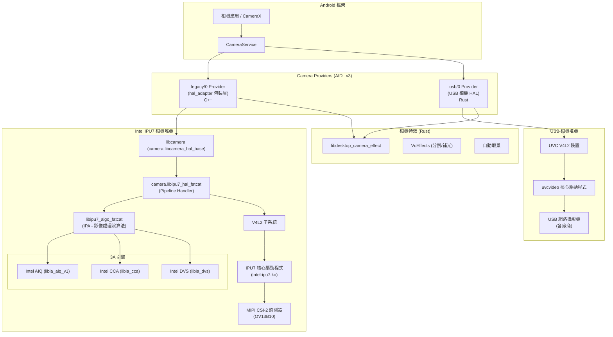
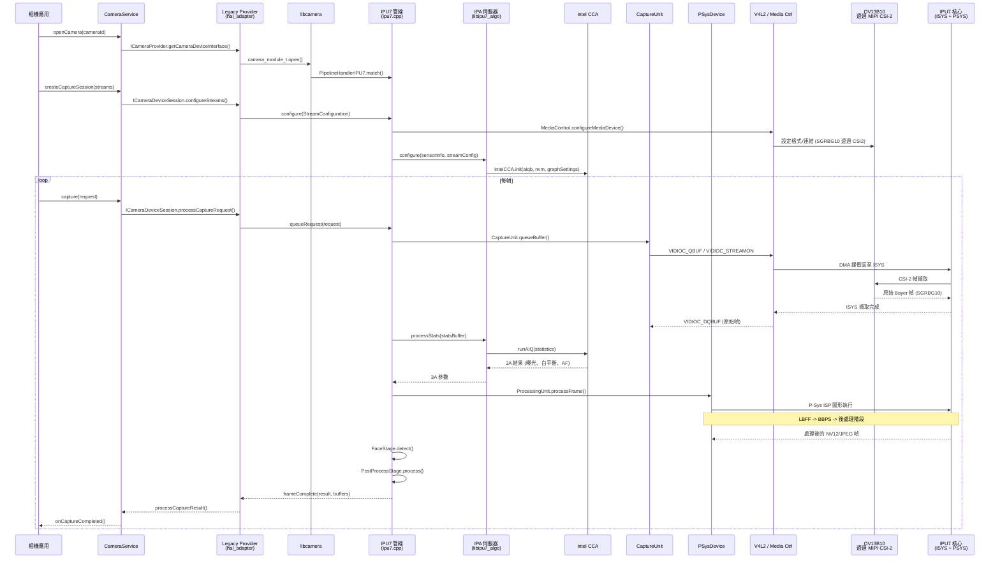
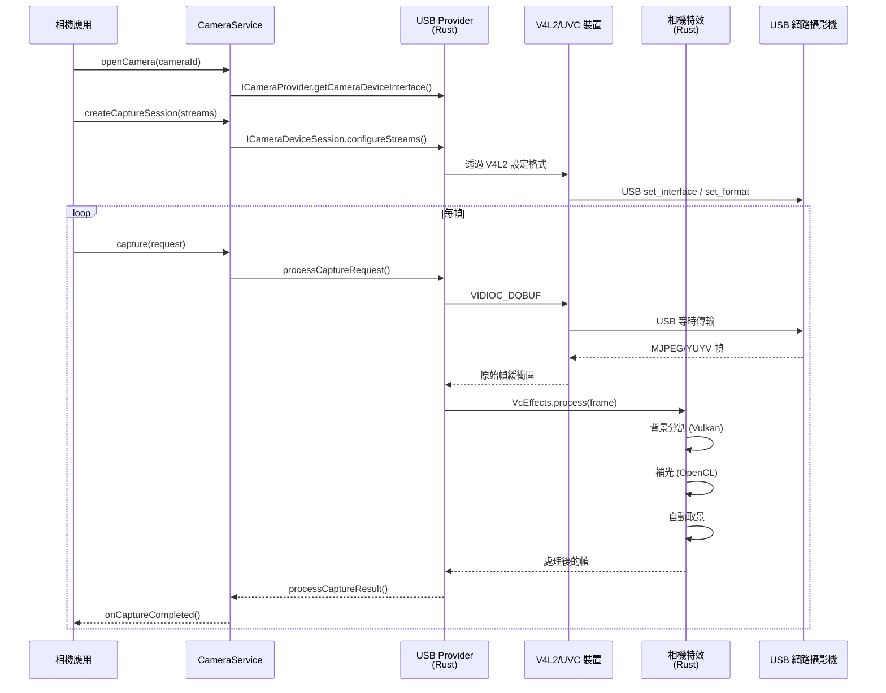

# 相機子系統實作

## 1. 架構概述

Android 桌面平台實作了**雙路徑相機架構**，透過 Intel IPU7 影像處理單元支援 MIPI CSI-2 感測器，並透過自訂的 Rust USB 相機 HAL 支援 USB 網路攝影機。兩條路徑皆透過 AIDL Camera Provider 介面，經由 Android Camera2/CameraX API 對外公開相機。



此架構將關注點分離為：
- **AIDL Camera Providers**：兩個 provider 實例——`legacy/0` 用於透過 Intel IPU7 管線的 MIPI 相機，`usb/0` 用於 USB 網路攝影機。
- **Intel IPU7 堆疊**：基於 libcamera 的完整管線處理器，具備硬體加速的 3A 處理、人臉偵測及 IPU7 矽晶片上的 ISP 圖形執行（fatcat 使用 IPU7.5 變體）。
- **USB 相機堆疊**：純 Rust 實作，使用 V4L2/UVC 進行 USB 網路攝影機擷取及軟體影像處理。
- **相機特效**：共用的 Rust 函式庫，提供視訊會議特效（背景分割、補光、自動取景），兩條相機路徑皆可使用。

---

## 2. 主要元件

| 元件 | 路徑 | 語言 | 用途 |
|---|---|---|---|
| 相機套件根目錄 | `vendor/google/desktop/camera/` | -- | 頂層相機套件（團隊：`trendy_team_desktop_camera`） |
| Intel 相機根目錄 | `vendor/intel/camera/` | -- | Intel 相機函式庫根目錄，採用 Apache-2.0 授權；定義 `x86_64_platforms_only_defaults` |
| IPU7 管線處理器 | `vendor/intel/camera/hal/ipu7/` | C++ | IPU7 的 libcamera 管線處理器（IPU7.5/fatcat 變體） |
| IPU7 IPA（演算法伺服器） | `vendor/intel/camera/hal/ipu7/ipa/` | C++ | 透過 IPA 框架沙箱化的影像處理演算法模組 |
| IPU6 HAL（舊版） | `vendor/intel/camera/hal/ipu6/` | C++ | 用於 brya/dedede/nissa 平台的舊版 IPU6 HAL |
| Fatcat 設定檔 | `vendor/intel/camera/configs/fatcat/` | JSON/YAML/Binary | 相機 HAL 設定、管線排程器、感測器設定、GCSS 二進位檔、調校檔案 |
| 預建 IA 函式庫 | `vendor/intel/camera/prebuilts/fatcat/` | Binary (.so) | 16 個 Intel 專有影像演算法函式庫 |
| HAL 轉接器（舊版包裝層） | `vendor/google/desktop/camera/hal_adapter/` | C++ | 包裝舊版相機 HAL 模組的 AIDL Camera Provider；橋接 libcamera 至 AIDL v3 |
| USB 相機 HAL | `vendor/google/desktop/camera/hal_usb/` | Rust | USB/UVC 網路攝影機的原生 AIDL Camera Provider |
| 相機特效 | `vendor/google/desktop/camera/effect/` | Rust | 視訊會議特效：分割、補光、自動取景 |
| 共用相機函式庫 | `vendor/google/desktop/camera/common/` | Rust | 共用相機工具：GPU 著色器、V4L2 輔助工具、中繼資料、緩衝區管理 |
| 相機工具 | `vendor/google/desktop/camera/camera_tool/` | Rust | 用於相機裝置設定和診斷的 CLI 工具及 AIDL 執行器 |
| 外部函式庫 | `vendor/google/desktop/camera/external/` | C/C++ | 收編的外部相依套件：cros_gralloc、GL、libexif、libgbm、libjpeg、libyuv、libcamera_metadata、intel_vendor_metadata |

---

## 3. Intel IPU7 相機 HAL

Intel IPU7 相機 HAL（`camera.libipu7_hal_fatcat`）是一個 libcamera 管線處理器，實作了連接至 Intel IPU7.5 影像處理單元的 MIPI CSI-2 感測器完整相機處理管線。

### 3.1 建置結構

此 HAL 建置為 `camera.libipu7_hal_fatcat`，為共用函式庫，安裝至 `vendor/lib64/hw/libcamera/pipeline/`。主要建置特性：

- **目標**：僅 64 位元（`compile_multilib: "64"`）
- **IPU 變體**：`IPU_SYSVER_ipu75`（IPU7.5 用於 fatcat/Panther Lake）
- **IPA 沙箱化**：已啟用（`-DIPA_SANDBOXING -DUSE_THREAD_IPA`）
- **PAC**：已啟用（`-DPAC_ENABLE -DMAX_PAC_BUFFERS=10`）
- **靜態圖形**：使用 IA AIC 類型（`-DSTATIC_GRAPH_USE_IA_AIC_TYPES`）

建置組合兩組預設集：
1. `camera_ipu7_src_defaults` -- 核心 HAL 原始碼
2. `ipu7_defaults_fatcat` -- fatcat 專用 IPU7.5 描述符，自動產生的原始碼來自 `modules/ipu_desc/ipu75xa/`

### 3.2 3A 處理引擎

3A（自動曝光、自動對焦、自動白平衡）子系統位於 `src/3a/`：

| 檔案 | 用途 |
|---|---|
| `AiqCore.cpp/.h` | 核心 AIQ（Algorithm IQ）介面——包裝 Intel AIQ 函式庫呼叫 |
| `AiqEngine.cpp/.h` | 協調每幀 3A 演算法執行 |
| `AiqResult.cpp/.h` | 儲存每幀 3A 結果（曝光、增益、白平衡等） |
| `AiqResultStorage.cpp/.h` | 跨管線階段的執行緒安全 3A 結果儲存 |
| `AiqSetting.cpp/.h` | 管理 3A 演算法設定/組態 |
| `AiqUnit.cpp/.h` | 頂層 3A 控制單元；生命週期管理 |
| `AiqUtils.cpp/.h` | 3A 資料轉換工具函式 |
| `I3AControlFactory.cpp/.h` | 建立 3A 控制實例的工廠 |
| `LensManager.cpp/.h` | 用於自動對焦的 VCM 鏡頭控制（DW9714 驅動程式） |
| `MakerNote.cpp/.h` | 3A 中繼資料的 EXIF maker note 處理 |
| `SensorManager.cpp/.h` | 感測器曝光/增益控制介面 |
| `intel3a/Intel3AParameter.cpp/.h` | Intel 專用 3A 參數轉換 |

### 3.3 人臉偵測

位於 `src/fd/`：

| 檔案 | 用途 |
|---|---|
| `IFaceDetection.cpp/.h` | 抽象人臉偵測介面 |
| `FaceDetection.cpp/.h` | 人臉偵測管理器；分派至廠商引擎 |
| `FaceType.h` | 人臉資料型別定義 |
| `facessd/CameraFaceDetection.cpp/.h` | 相機專用人臉偵測包裝層 |
| `facessd/FaceSSD.cpp/.h` | Google FaceSSD（Single Shot Detector）基於 ML 的人臉偵測 |
| `facessd/CommonTypes.h` | FaceSSD 共用型別定義 |

fatcat 設定使用 Google FaceSSD（`faceEngineVendor: 1`）而非 Intel PVL（`faceEngineVendor: 0`）。

### 3.4 管線與處理

管線處理器（`pipeline/ipu7.cpp`）實作 libcamera 管線模型：

| 檔案 | 用途 |
|---|---|
| `pipeline/ipu7.cpp` | 主管線處理器註冊與相機列舉 |
| `pipeline/AEStateMachine.cpp` | 依據 Android Camera2 規格的 AE 狀態機 |
| `pipeline/AFStateMachine.cpp` | 依據 Android Camera2 規格的 AF 狀態機 |
| `pipeline/AWBStateMachine.cpp` | 依據 Android Camera2 規格的 AWB 狀態機 |
| `pipeline/Camera3AMetadata.cpp` | 向 Android 框架回報 3A 中繼資料 |
| `pipeline/Frames.cpp` | 幀生命週期管理 |
| `pipeline/ParameterConverter.cpp` | Android 中繼資料至內部參數轉換 |
| `pipeline/MakerNoteBuilder.cpp` | EXIF maker note 建構 |
| `pipeline/ZslCapture.cpp` | 零快門延遲擷取支援 |

**IPA 用戶端**（`pipeline/ipaclient/`）：

| 檔案 | 用途 |
|---|---|
| `IPAMemory.cpp` | IPA 通訊共享記憶體管理 |
| `IPAClient.cpp` | 用戶端 IPA 代理 |
| `IPAClientWorker.cpp` | IPA 請求工作執行緒 |
| `IntelCcaWorker.cpp` | Intel CCA 演算法工作者 |

### 3.5 核心處理單元

位於 `src/core/`：

| 檔案 | 用途 |
|---|---|
| `CameraContext.cpp` | 每相機上下文與狀態 |
| `CaptureUnit.cpp` | V4L2 擷取緩衝區管理 |
| `DeviceBase.cpp` | 基礎裝置抽象層 |
| `ProcessingUnit.cpp` | 主處理管線協調 |
| `PSysDevice.cpp` | IPU7 P-Sys（處理系統）裝置介面 |
| `IpuPacAdaptor.cpp` | IPU PAC（參數適配編解碼器）介面 |
| `BufferQueue.cpp` | 幀資料環形緩衝佇列 |
| `CameraBuffer.cpp` | 硬體緩衝區配置/映射 |
| `CameraStream.cpp` | 串流設定與管理 |
| `SensorHwCtrl.cpp` | 透過 V4L2 subdev 的硬體感測器控制 |
| `LensHw.cpp` | 鏡頭 VCM 硬體控制 |
| `SofSource.cpp` | 幀開始事件來源 |
| `SwPostProcessUnit.cpp` | 軟體後處理備援 |
| `RequestThread.cpp` | 每相機請求處理執行緒 |

**處理單元子階段**（`src/core/processingUnit/`）：

| 檔案 | 用途 |
|---|---|
| `PipeManager.cpp` | 管理 ISP 處理管線 |
| `PipeLine.cpp` | 單一處理管線執行 |
| `CBStage.cpp` | 用於階段間資料傳遞的回呼階段 |
| `FaceStage.cpp` | 人臉偵測整合階段 |
| `PostProcessStage.cpp` | 後處理階段（縮放、格式轉換） |

### 3.6 排程器

相機排程器（`src/scheduler/`）管理管線執行順序：

| 檔案 | 用途 |
|---|---|
| `CameraScheduler.cpp/.h` | 主排程器——將工作分配至管線執行器 |
| `CameraSchedulerPolicy.cpp/.h` | 排程策略引擎——讀取 `pipe_scheduler_profiles.json` |
| `ISchedulerNode.h` | 可排程管線節點的介面 |

---

## 4. Intel IPU6 相機 HAL（舊版支援）

IPU6 HAL（`vendor/intel/camera/hal/ipu6/`）為較舊的 Intel 平台提供舊版相機支援：

| 平台 | 模組 | IPU 變體 | 備註 |
|---|---|---|---|
| Brya（第 12 代） | `camera.libipu6_hal_brya` | IPU6EP (`ipu6v5`) | Alder Lake 平台 |
| Dedede（Celeron/Pentium） | `camera.libipu6_hal_dedede` | IPU6SE (`ipu6v3`) | Jasper Lake 平台 |
| Nissa（第 13 代） | `camera.libipu6_hal_nissa` | IPU6EP (`ipu6v5`) | Raptor Lake-P，支援 TNR7 CM |

與 IPU7 的主要架構差異：
- 使用傳統的 Android Camera HAL3（`aal/` 層）而非 libcamera 管線處理器
- 包含 `src/hal/CameraHal.cpp` 和 `aal/Camera3HAL.cpp` 用於直接的 HAL3 介面
- 擁有自己的 JPEG 編碼（`src/jpeg/`）和中繼資料管理（`src/metadata/`）
- 使用 CIPR（Camera IP Resource）模組（`modules/ia_cipr/`）而非 PAC
- 包含 Intel PVL 人臉偵測及 FaceSSD（`src/fd/pvl/`）
- 使用 IA CSS（Camera Streaming Subsystem）程式群組模組
- 連結 `vendor.google.desktop.camera.effect-ndk` 以使用相機特效

IPU6 HAL **不在 fatcat 上使用**——它存在於同一原始碼樹中，是為了向後相容較舊的桌面平台。

---

## 5. USB 相機 HAL

USB 相機 HAL 是位於 `vendor/google/desktop/camera/hal_usb/` 的原生 Rust AIDL Camera Provider 服務。

### 5.1 服務設定

- **二進位檔**：`android.hardware.camera.provider-usb-service.android-desktop`
- **AIDL 介面**：`android.hardware.camera.provider.ICameraProvider/usb/0`
- **使用者/群組**：`cameraserver` / `audio camera input drmrpc usb`
- **優先順序**：`ioprio rt 4`，具備 `SYS_NICE` 能力
- **任務配置**：`CameraServiceCapacity MaxPerformance`

### 5.2 原始碼結構

| 檔案 | 用途 |
|---|---|
| `src/service.rs` | 主服務進入點；註冊 AIDL provider |
| `src/provider.rs` | ICameraProvider 實作；列舉 USB 相機 |
| `src/device.rs` | ICameraDevice 實作 |
| `src/session/` | 相機擷取會話管理 |
| `src/pipeline/` | 擷取管線（V4L2 緩衝佇列管理） |
| `src/v4l2/` | V4L2 裝置抽象層 |
| `src/v4l2.rs` | V4L2 頂層介面 |
| `src/uvc_device.rs` | UVC 專用裝置處理 |
| `src/metadata/` | Android 相機中繼資料產生 |
| `src/metadata.rs` | 中繼資料頂層介面 |
| `src/resolution.rs` | 串流解析度協商 |
| `src/buffer_container.rs` | 擷取緩衝區管理 |
| `src/face_detector.rs` | 人臉偵測整合 |
| `src/hal_info.rs` | HAL 資訊與能力 |
| `src/aidl.rs` | AIDL 型別轉換 |
| `src/test_pattern.rs` | 測試圖案產生 |

### 5.3 主要相依套件

- `libv4l2r` -- Rust V4L2 繫結
- `libuvcvideo_sys` -- UVC 視訊系統繫結
- `libdesktop_camera_common` -- 共用相機工具
- `libdesktop_camera_effect` -- 視訊會議特效
- `libusb_camera_info_proto` -- Protobuf 相機模組資訊
- `libcrossbeam_channel` -- 多生產者/多消費者通道

### 5.4 Fatcat 內建 USB 相機模組

fatcat 平台在 `vendor/google/desktop/camera/hal_usb/data/fatcat/internal_usb_camera_info.txtpb` 中宣告了 9 個支援的內建 USB 相機模組：

| USB ID | 廠商 | 型號 | 解析度 | 焦距 | 光圈 |
|---|---|---|---|---|---|
| `0408:4052` | Quanta | YHVA-5 | 1936x1096 | 1.769mm | f/2.0 |
| `30c9:00fa` | LuxVisions | BBF503N3B | 2608x1960 | 1.83mm | f/2.0 |
| `04f2:b84b` | Chicony | C7FOF10-1 | 1928x1088 | 1.462mm | f/2.0 |
| `04f2:b890` | Chicony | CKFP515 | 2888x1808 | 1.87mm | f/2.0 |
| `0408:406a` | Quanta | YHWM-2 | 2888x1808 | 1.89mm | f/2.0 |
| `3277:0099` | Shine | FL225F-0B | 1928x1096 | 1.36mm | f/2.0 |
| `5986:11ae` | BISON | BNN755UBP-21A | 2600x1952 | 1.852mm | f/2.0 |
| `174f:11b7` | AVC | HAA-N1H8D3 | 2608x1960 | 1.897mm | f/2.0 |
| `04f2:b842` | Chicony | CKFO518 | 2624x1976 | 1.828mm | f/2.0 |

所有模組皆設定為 `FACING_FRONT` 並啟用人臉偵測。全域設定：`use_hardware_jpeg_decoder: true`、`face_detection_input_width: 320`。

---

## 6. 相機 HAL 轉接器（hal_adapter 橋接層）

位於 `vendor/google/desktop/camera/hal_adapter/` 的 HAL 轉接器，將基於 libcamera 的 Intel IPU7 HAL（使用舊版相機模組介面）橋接至現代的 AIDL Camera Provider 介面。

### 6.1 AIDL 實作

| 原始碼檔案 | 用途 |
|---|---|
| `aidl_camera_provider.cpp` | `ICameraProvider` 實作——相機列舉與裝置建立 |
| `aidl_camera_device.cpp` | `ICameraDevice` 實作——能力、會話建立 |
| `aidl_camera_device_session.cpp` | `ICameraDeviceSession`——串流設定、擷取請求 |
| `aidl_camera_service.cpp` | 服務註冊與生命週期 |
| `aidl_camera_utils.cpp` | AIDL/HAL3 資料型別轉換工具 |
| `aidl_camera_trace.cpp` | 基於 Atrace 的效能追蹤 |

### 6.2 服務設定

- **二進位檔**：`android.hardware.camera.provider@2.7-service-legacy-wrapper`
- **VINTF**：`ICameraProvider/legacy/0`（AIDL v3）
- **使用者/群組**：`system` / `system`
- **能力**：`SYS_NICE`
- **任務配置**：`CameraServiceCapacity CameraServicePerformance`

### 6.3 主要共用函式庫

此轉接器連結以下函式庫：
- `android.hardware.camera.device-V3-ndk` / `provider-V3-ndk` / `common-V1-ndk`（AIDL NDK）
- `android.hardware.graphics.mapper@2.0/3.0/4.0`（緩衝區映射）
- `android.hardware.thermal@2.0`（熱節流）
- `libdesktop_camera_effect_ffi`（相機特效的 Rust FFI）
- `vendor.google.desktop.camera.effect-ndk`（特效 AIDL 介面）

亦建置了延遲變體（`-lazy`），用於隨需服務啟動。

---

## 7. 相機特效

位於 `vendor/google/desktop/camera/effect/` 的相機特效函式庫提供視訊會議增強功能。

### 7.1 函式庫結構

| 模組 | Crate | 用途 |
|---|---|---|
| `libdesktop_camera_effect` | `desktop_camera_effect` | 主特效函式庫（Rust，2021 版） |
| `libdesktop_camera_effect_ffi` | `desktop_camera_effect` | 用於 C++ HAL 轉接器整合的 C FFI 包裝層 |

### 7.2 特效處理功能

fatcat 特效設定（`effect_config_usb.json`）啟用：

```json
{
    "stream_manipulators": [
        { "name": "Include", "config": "/vendor/etc/camera/common_post_process.json" },
        {
            "name": "VcEffects",
            "config": {
                "segmentation_gpu_api": "Vulkan",
                "relighting_gpu_api": "OpenCl",
                "segmentation_delegate": "Stable",
                "relighting_delegate": "Stable",
                "retouch_delegate": "Stable"
            }
        },
        {
            "name": "AutoFraming",
            "config": { "process_frame_rate": 0, "enable_logs": true }
        }
    ]
}
```

- **VcEffects**（視訊會議特效）：
  - 透過 Vulkan GPU 進行背景分割
  - 透過 OpenCL GPU 進行補光
  - 透過 Stable 委派進行修飾處理
- **AutoFraming**：自動相機取景/裁剪以保持主體置中
- **共用後處理**：從共用設定檔引入

### 7.3 相依套件

主要 Rust 相依套件包括：
- `libvulkano` -- Vulkan GPU 運算（透過 `libdesktop_camera_common`）
- `android.hardware.camera.metadata-V3-rust` -- 相機中繼資料
- `com.android.desktop.video_chat-aidl-V1-rust` -- 視訊聊天 AIDL 介面
- `libgl_bindgen` -- OpenGL 繫結
- `libnativewindow_rs` -- ANativeWindow 介面

### 7.4 測試

| 測試 | 用途 |
|---|---|
| `desktop_camera_effect_unit_tests` | 使用 mockall 的 Rust 單元測試 |
| `desktop_camera_effect_basic_test` | 主機端整合測試 |
| `desktop_camera_effect_benchmarks` | 效能基準測試 |
| `desktop_camera_effect_cpp_client_test` | C++ 用戶端整合測試 |

---

## 8. 外接相機支援

`vendor/google/desktop/camera/external/` 目錄包含相機子系統所需的收編外部相依套件：

| 函式庫 | 路徑 | 用途 |
|---|---|---|
| `cros_gralloc` | `external/cros_gralloc/` | ChromeOS gralloc 緩衝區配置器（基於 GBM） |
| `gl` | `external/gl/` | 用於 GPU 加速處理的 OpenGL/EGL 繫結 |
| `intel_vendor_metadata` | `external/intel_vendor_metadata/` | Intel 廠商專用相機中繼資料擴充 |
| `libcamera_metadata` | `external/libcamera_metadata/` | Android 相機中繼資料函式庫（為 Rust 繫結收編） |
| `libexif` | `external/libexif/` | JPEG 的 EXIF 中繼資料讀寫 |
| `libgbm` | `external/libgbm/` | 用於 GPU 緩衝區配置的通用緩衝管理 |
| `libjpeg` | `external/libjpeg/` | JPEG 編碼/解碼 |
| `libyuv` | `external/libyuv/` | YUV 色彩空間轉換與縮放 |

這些函式庫被收編（未使用 AOSP 系統副本），以提供 USB 相機 HAL 和相機特效所使用的 Rust FFI 繫結（`*_bindgen` crate）。

---

## 9. 感測器設定

### 9.1 OV13B10 感測器概述

fatcat 平台使用 **OmniVision OV13B10** 1300 萬畫素 CMOS 影像感測器，有兩種設定：

| 屬性 | UF（使用者面向/前鏡頭） | WF（世界面向/後鏡頭） |
|---|---|---|
| 感測器名稱 | `ov13b10-uf` | `ov13b10-wf` |
| CSI 連接埠 | Port 2 | Port 0 |
| 原始輸出解析度 | 2104 x 1560 | 4208 x 3120 |
| 原始格式 | `V4L2_PIX_FMT_SGRBG10` | `V4L2_PIX_FMT_SGRBG10` |
| MIPI 匯流排格式 | `V4L2_MBUS_FMT_SGRBG10_1X10` | `V4L2_MBUS_FMT_SGRBG10_1X10` |
| ISYS 擷取節點 | `Intel IPU7 ISYS Capture 16` | `Intel IPU7 ISYS Capture 0` |
| 像素陣列大小 | 2104 x 1560 | 4208 x 3120 |
| 有效陣列大小 | 0,0 - 1920x1080 | 0,0 - 4208x3120 |
| 物理尺寸 | 4.71mm x 3.49mm | 4.71mm x 3.49mm |
| 像素尺寸 | 1.12um | 1.12um |
| 鏡頭名稱 | `dw9714`（VCM） | `dw9714`（VCM） |
| 鏡頭類型 | `LENS_VCM_HW` | `LENS_VCM_HW` |
| 鏡頭朝向 | 前（0） | 後（1） |
| 焦距 | 3.39mm | 3.39mm |
| 光圈 | f/2.2 | f/2.2 |
| 超焦距 | 1.37m | 1.37m |
| 最小對焦距離 | 10.0 屈光度 | 10.0 屈光度 |
| 色彩濾鏡 | GBRG (2) | GBRG (2) |
| 最大類比感光度 | 699 (43 x 15.9) | 699 (43 x 15.9) |
| 感光度範圍 | 44 - 1399 | 44 - 1399 |
| 曝光時間範圍 | 100us - 100ms | 100us - 100ms |
| 硬體等級 | FULL (1) | FULL (1) |
| 最大數位變焦 | 16.0x | 16.0x |
| NVM 裝置 | NVM，1680 位元組 | NVM，1680 位元組 |
| 圖形設定檔 | `ov13b10-uf.IPU75XA.bin` | `OV13B10_09B13.IPU7X.bin` |

### 9.2 支援的輸出串流設定

**UF（前鏡頭）**：

| 格式 | 解析度 |
|---|---|
| NV12 / IMPLEMENTATION_DEFINED / YCbCr_420_888 | 1920x1080、1280x960、1280x720、640x480、640x360、320x240 |
| JPEG / BLOB | 1920x1080、1280x960、1280x720、640x480、640x360、320x240 |
| 輸入（重新處理） | 2104x1560（IMPLEMENTATION_DEFINED） |

**WF（後鏡頭）**：

| 格式 | 解析度 |
|---|---|
| NV12 / IMPLEMENTATION_DEFINED / YCbCr_420_888 | 4096x3072、3840x2160、1920x1080、1280x960、1280x720、640x480、640x360、320x240 |
| JPEG / BLOB | 4096x3072、3840x2160、1920x1080、1280x960、1280x720、640x480、640x360、320x240 |
| 輸入（重新處理） | 4096x3072（IMPLEMENTATION_DEFINED） |

### 9.3 共用感測器功能

兩個感測器皆支援：
- **AE 模式**：AUTO、MANUAL（支援鎖定）
- **AF 模式**：AUTO、MACRO、CONTINUOUS_VIDEO、CONTINUOUS_PICTURE、OFF
- **AWB 模式**：AUTO、INCANDESCENT、FLUORESCENT、DAYLIGHT、FULL_OVERCAST、PARTLY_OVERCAST、SUNSET、VIDEO_CONFERENCE、MANUAL_CCT_RANGE、MANUAL_WHITE_POINT、MANUAL_GAIN、MANUAL_COLOR_TRANSFORM
- **功能**：MANUAL_EXPOSURE、MANUAL_WHITE_BALANCE、IMAGE_ENHANCEMENT、NOISE_REDUCTION、PER_FRAME_CONTROL、SCENE_MODE
- **FPS 範圍**：15-15、24-24、15-30、30-30
- **EV 範圍**：-6 至 +6（步進 1/3）
- **人臉偵測**：簡易模式（最多 10 張臉）
- **邊緣模式**：OFF、FAST、HIGH_QUALITY、ZERO_SHUTTER_LAG
- **降噪**：OFF、FAST、HIGH_QUALITY、ZERO_SHUTTER_LAG
- **能力**：BACKWARD_COMPATIBLE、MANUAL_SENSOR、MANUAL_POST_PROCESSING、READ_SENSOR_SETTINGS、BURST_CAPTURE
- **ZSL**：已啟用（`control.enableZsl: 1`）
- **輸出串流**：最多同時 1 個 raw + 3 個 YUV + 1 個 JPEG
- **管線深度**：7 幀

### 9.4 感測器處理設定

| 參數 | 值 |
|---|---|
| AIQ 已啟用 | true |
| AIQ 資料（aiqd） | 已啟用 |
| PSys 處理器 | 已啟用 |
| DVS 類型 | IMG_TRANS |
| 曝光延遲 | 2 幀 |
| 增益延遲 | 2 幀 |
| 數位增益延遲 | 0 幀 |
| 最大原始資料緩衝區 | 32 |
| 初始跳幀 | 0 |
| YUV 色彩範圍 | full |
| 管線切換延遲 | 60 幀 |
| 最大進行中請求 | 5 |
| 人臉引擎 | Google FaceSSD（vendor: 1） |
| 人臉引擎間隔 | 10 幀 |
| 人臉 AE | 已啟用 |
| PSys 與 AIC 綁定 | false |
| ISYS 壓縮 | 已停用 |
| PSA 壓縮 | 已停用 |
| Mock PSys | 已停用 |

### 9.5 GCSS 二進位設定

| 檔案 | 感測器 | IPU 變體 |
|---|---|---|
| `gcss/ov13b10-uf.IPU75XA.bin` | OV13B10 UF（2 通道） | IPU7.5 XA |
| `gcss/OV13B10_09B13.IPU7X.bin` | OV13B10 WF（4 通道） | IPU7 X |

### 9.6 調校檔案

| 檔案 | 用途 |
|---|---|
| `tuning_files/ov13b10.aiqb` | OV13B10 的 AIQ 二進位調校資料（UF 和 WF 共用） |

調校設定將 NORMAL 和 STILL_CAPTURE 模式皆映射至 VIDEO 調校配置，CMC、AIQ、ISP 及其他項目使用 LARD 標籤 `DFLT`。

---

## 10. IPU7 內部架構

### 10.1 原始碼目錄結構

```
vendor/intel/camera/hal/ipu7/
|-- Android.bp              # 建置定義
|-- include/
|   |-- api/                # 公開 API 標頭檔 (ParamDataType.h)
|   |-- ia_imaging/         # Intel IA 影像演算法標頭檔 (65+ 個標頭檔)
|   |-- linux/              # Linux 核心 UAPI 標頭檔
|   |-- utils/              # 工具標頭檔
|-- src/
|   |-- 3a/                 # 3A 演算法包裝層 (13 個檔案)
|   |   |-- intel3a/        # Intel 專用 3A 參數處理
|   |-- core/               # 核心相機管線處理 (20+ 個檔案)
|   |   |-- processingUnit/ # 管線階段 (6 個檔案)
|   |-- fd/                 # 人臉偵測 (6 個檔案)
|   |   |-- facessd/        # Google FaceSSD 實作 (5 個檔案)
|   |-- image_process/      # 影像後處理 (7 個檔案)
|   |   |-- chrome/         # Chrome/Android 專用處理
|   |-- iutils/             # 內部工具 (日誌、追蹤、傾印)
|   |-- platformdata/       # 平台/感測器設定解析 (14 個檔案)
|   |   |-- gc/             # 圖形設定 (3 個檔案)
|   |-- scheduler/          # 管線排程 (5 個檔案)
|   |-- v4l2/               # V4L2 裝置抽象層 (8 個檔案)
|-- pipeline/               # libcamera 管線處理器 (16 個檔案)
|   |-- ipaclient/          # IPA 用戶端通訊 (4 個檔案)
|-- ipa/                    # IPA 伺服器 (演算法執行) (9 個檔案)
|   |-- server/             # 伺服器端演算法工作者
|-- modules/
|   |-- ipu_desc/           # IPU 硬體描述符
|   |   |-- ipu75xa/        # IPU7.5 XA 自動產生的圖形描述符 (6 個檔案)
|   |-- v4l2/               # 底層 V4L2 裝置/子裝置包裝層 (3 個檔案)
```

### 10.2 V4L2 子系統

V4L2 層管理核心裝置介面：

| 元件 | 用途 |
|---|---|
| `src/v4l2/MediaControl.cpp` | 媒體控制器拓撲探索與連結設定 |
| `src/v4l2/V4l2DeviceFactory.cpp` | 建立 V4L2 裝置實例的工廠 |
| `src/v4l2/NodeInfo.cpp` | V4L2 裝置節點資訊與映射 |
| `src/v4l2/SysCall.cpp` | 系統呼叫包裝層（ioctl、mmap 等） |
| `modules/v4l2/v4l2_device.cc` | 底層 V4L2 裝置操作 |
| `modules/v4l2/v4l2_subdevice.cc` | V4L2 子裝置 pad/格式操作 |
| `modules/v4l2/v4l2_video_node.cc` | V4L2 視訊節點緩衝佇列操作 |

### 10.3 影像處理

`src/image_process/` 中的後處理管線：

| 元件 | 用途 |
|---|---|
| `PostProcessorBase.cpp` | 所有後處理器的基礎類別 |
| `PostProcessorCore.cpp` | 核心後處理協調器 |
| `chrome/ImageProcessorCore.cpp` | Chrome/Android 影像處理器（使用 cros_gralloc） |
| `IImageProcessor.h` | 影像處理器介面 |
| `ProcessType.h` | 處理類型定義（縮放、旋轉、格式轉換） |

### 10.4 平台資料與設定解析

| 元件 | 用途 |
|---|---|
| `PlatformData.cpp` | 中央平台設定單例 |
| `CameraParserInvoker.cpp` | 根據設定格式呼叫適當的解析器 |
| `CameraSensorsParser.cpp` | 解析感測器 JSON 設定檔 |
| `JsonCommonParser.cpp` | 共用 JSON 解析工具 |
| `JsonParserBase.cpp` | 基礎 JSON 解析器類別 |
| `AiqInitData.cpp` | AIQ 初始化資料載入（aiqb、NVM） |
| `gc/GraphConfig.cpp` | ISP 圖形設定 |
| `gc/GraphConfigManager.cpp` | 圖形設定生命週期管理 |
| `gc/GraphUtils.cpp` | 圖形工具函式 |

### 10.5 IPU7.5 描述符模組

`modules/ipu_desc/ipu75xa/` 目錄包含 IPU7.5 XA 硬體的自動產生程式碼：

| 檔案 | 用途 |
|---|---|
| `CBLayoutUtils.cpp` | 回呼緩衝區佈局工具 |
| `GraphResolutionConfigurator.cpp` | 執行時期圖形解析度設定 |
| `GraphResolutionConfiguratorAutogen.cpp` | 自動產生的解析度設定 |
| `StaticGraphAutogen.cpp` | 自動產生的靜態圖形定義 |
| `StaticGraphReaderAutogen.cpp` | 自動產生的圖形二進位讀取器 |
| `TerminalDescriptorAutogen.cpp` | 自動產生的 ISP 核心終端描述符 |

### 10.6 IPA 伺服器（演算法執行）

IPA（影像處理演算法）伺服器在沙箱化執行緒中運行：

| 元件 | 用途 |
|---|---|
| `ipa/ipu7.cpp` | IPA 模組註冊 |
| `ipa/IPAServer.cpp` | IPA 伺服器主類別 |
| `ipa/IPAServerThread.cpp` | 執行緒化 IPA 執行 |
| `ipa/IPCCca.cpp` | CCA（相機控制演算法）的 IPC 包裝層 |
| `ipa/server/CcaWorker.cpp` | CCA 演算法工作者 |
| `ipa/server/IPACcaLog.cpp` | CCA 日誌記錄 |

IPA 透過 `ipu7_prebuilt_libraries_defaults` 連結所有 16 個預建的 Intel IA 函式庫。

---

## 11. 預建函式庫

以下是為 fatcat 提供的 Intel 專有影像演算法預建共用物件函式庫：

| 函式庫 | 檔案 | 用途 |
|---|---|---|
| `libia_aiq_v1` | `libia_aiq_v1.so` | 自動曝光、自動白平衡、自動對焦演算法（v1 API） |
| `libia_cca` | `libia_cca.so` | 相機控制演算法——所有 3A/ISP 演算法的頂層協調器 |
| `libia_dvs` | `libia_dvs.so` | 數位影像防震 |
| `libia_view` | `libia_view.so` | 視角/透視變換 |
| `libia_aic` | `libia_aic.so` | 自動 ISP 設定——產生 ISP 核心參數 |
| `libia_aiqb_parser` | `libia_aiqb_parser.so` | AIQ 二進位調校檔案解析器 |
| `libia_bcomp` | `libia_bcomp.so` | Bayer 壓縮/解壓縮 |
| `libia_ccat` | `libia_ccat.so` | 色彩校正與適配調校 |
| `libia_cmc_parser` | `libia_cmc_parser.so` | 相機模組特性資料解析器 |
| `libia_coordinate` | `libia_coordinate.so` | 感測器/ISP/輸出空間之間的座標變換 |
| `libia_emd_decoder` | `libia_emd_decoder.so` | 嵌入式資料解碼器（感測器專用中繼資料） |
| `libia_exc` | `libia_exc.so` | 曝光控制 |
| `libia_lard` | `libia_lard.so` | LARD（可載入演算法儲存庫描述符） |
| `libia_log` | `libia_log.so` | Intel IA 日誌記錄框架 |
| `libia_mkn` | `libia_mkn.so` | Maker Note 編碼器/解碼器（EXIF） |
| `libia_nvm` | `libia_nvm.so` | 非揮發性記憶體資料讀取器（OTP 校準） |

所有函式庫皆為：
- **Vendor 分區**：安裝至 `/vendor/lib64/`
- **僅 64 位元**：`compile_multilib: "64"`
- **停用 ELF 檢查**：`check_elf_files: false`（專有二進位檔）

`ipu7_prebuilt_libraries_defaults` cc_defaults 將所有 16 個函式庫作為 shared_libs 聚合，供 IPA 模組連結。

---

## 12. 資料流程

### 12.1 MIPI 相機擷取流程



### 12.2 USB 相機擷取流程



---

## 13. 設定

### 13.1 libcamhal_configs.json

位於 `vendor/intel/camera/configs/fatcat/libcamhal_configs.json`，這是頂層相機 HAL 設定：

```json
{
    "Common": {
        "version": 1.0,
        "platform": "IPU7",
        "availableSensors": [
            "ov13b10-wf-0",
            "ov5675-uf-2",
            "ov08x40-uf-0",
            "ov13b10-uf-2"
        ],
        "videoStreamNum": 2,
        "cameraNumber": 2
    }
}
```

主要欄位：
- **platform**：`IPU7`——選擇 IPU7 管線處理器
- **availableSensors**：感測器名稱 + 朝向 + CSI 連接埠 ID。HAL 依序探測這些，使用實際存在的前兩個。命名格式為 `<sensor>-<wf|uf>-<CSI_PORT>`。
- **videoStreamNum**：最大同時視訊串流數（2）
- **cameraNumber**：預期相機數量（2）

注意：設定列出 4 個可能的感測器（ov13b10-wf、ov5675-uf、ov08x40-uf、ov13b10-uf），但僅有 2 個會啟用，取決於主機板上實際安裝的感測器模組。

### 13.2 pipe_scheduler_profiles.json

管線排程器定義跨 4 個圖形設定的 ISP 圖形節點執行分組：

| 排程器 ID | 圖形 ID | 使用場景 |
|---|---|---|
| 1 | 100000 | 預設視訊 + 靜態拍攝 |
| 2 | 100200 | 替代視訊 + 靜態拍攝 |
| 2 | 100002 | 合併的 LBFF+BBPS 視訊 |
| 2 | 100032 | 合併的 LBFF+BBPS 視訊（替代） |

每個排程器定義 4 個管線執行器：

| 執行器 | 節點 | 用途 |
|---|---|---|
| `video_lb` | `lbff`（或用於 graphs 100002/100032 的 `lbff` + `bbps`） | 低頻寬前端過濾 |
| `video_bb` | `bbps`、`post_1`、`post_2`（或僅 `post_1`、`post_2`） | 骨幹處理 + 後處理階段 |
| `still_full` | `lbff1`、`bbps1`、`post_0` | 全解析度靜態拍攝管線 |
| `face_detection` | `face` | 人臉偵測處理 |

管線節點術語：
- **LBFF**：低頻寬前端——初始 ISP 處理（解馬賽克、降噪、白平衡）
- **BBPS**：骨幹處理系統——次級 ISP 處理（色調映射、銳化）
- **post_0/1/2**：後處理階段（縮放、格式轉換、旋轉）

### 13.3 camera_hal.yaml

位於 `vendor/intel/camera/configs/fatcat/libcamera/camera_hal.yaml` 的 libcamera HAL 設定：

```yaml
cameras:
  "camera0":
    location: front
    rotation: 0
  "camera1":
    location: back
    rotation: 0
```

此設定映射：
- **camera0**：前鏡頭（UF 感測器，CSI port 2）
- **camera1**：後鏡頭（WF 感測器，CSI port 0）

兩個相機皆為 0 度旋轉（橫向原生方向，桌上型/筆記型電腦的典型設定）。

---

## 14. 建置整合

### 14.1 PRODUCT_PACKAGES（來自 fatcat_common.mk）

```makefile
# MIPI Camera Provider (IPU7)
PRODUCT_PACKAGES += \
    android.hardware.camera.provider@2.7-service-legacy-wrapper \
    camera.libcamera_hal_base \
    camera.libipu7_hal_fatcat \
    libipu7_algo_fatcat \
    ipu7_camera_profiles \
    ipu7_libcamera_hal \
    ipu7_gcss_settings \
    ipu7_sensor_settings \
    ipu7_tuning_files

# USB Camera Provider
PRODUCT_PACKAGES += android.hardware.camera.provider-usb-service.android-desktop
PRODUCT_PACKAGES += fatcat_internal_usb_camera_info

# Camera Effects
PRODUCT_PACKAGES += desktop_camera_effect_configs_fatcat
PRODUCT_PACKAGES += desktop_camera_effect_configs_common

# Camera Tool
PRODUCT_PACKAGES += camera_tool
PRODUCT_PACKAGES += vendor.google.desktop.camera-tool-executor

# Variant Detection
PRODUCT_PACKAGES += get_variant_camera
```

### 14.2 PRODUCT_COPY_FILES（相機權限）

```makefile
PRODUCT_COPY_FILES += \
    frameworks/native/data/etc/android.hardware.camera.autofocus.xml:system/etc/permissions/... \
    frameworks/native/data/etc/android.hardware.camera.full.xml:system/etc/permissions/... \
    frameworks/native/data/etc/android.hardware.camera.manual_postprocessing.xml:system/etc/permissions/... \
    frameworks/native/data/etc/android.hardware.camera.manual_sensor.xml:system/etc/permissions/... \
    frameworks/native/data/etc/android.hardware.camera.front.xml:system/etc/permissions/...
```

宣告的相機功能權限：
- `android.hardware.camera.autofocus` -- 自動對焦支援
- `android.hardware.camera.full` -- 完整硬體等級
- `android.hardware.camera.manual_postprocessing` -- 手動後處理
- `android.hardware.camera.manual_sensor` -- 手動感測器控制
- `android.hardware.camera.front` -- 前鏡頭存在

### 14.3 Soong 命名空間

```makefile
PRODUCT_SOONG_NAMESPACES += \
    vendor/intel/camera/configs/fatcat \
    vendor/intel/camera/prebuilts/fatcat \
    vendor/google/desktop/camera/hal_usb/data/fatcat \
    vendor/google/desktop/camera/effect/configs/fatcat
```

---

## 15. 每裝置相機變體（fatcat hal_config.xml）

位於 `device/google/desktop/fatcat/configs/hal_config.xml` 的 fatcat 裝置設定包含每個 SKU 的硬體設定項目。每個 SKU 變體包含一個 `CameraConfiguration` 區段：

```xml
<CameraConfiguration>
    <media-profile-suffix>_desktop_one_camera_1080p</media-profile-suffix>
</CameraConfiguration>
```

所有 fatcat SKU 變體使用相同的相機媒體配置後綴：`_desktop_one_camera_1080p`。此後綴映射至裝置上的媒體配置 XML 檔案 `media_profiles_desktop_one_camera_1080p.xml`，其中定義可用的視訊錄製配置。

`get_variant_camera.sh` 腳本在開機時：
1. 讀取裝置型號和 SKU ID
2. 在 `media_profiles_map_<board>.csv` 中查找對應項目
3. 設定 `vendor.media.xml_variant.profiles` 屬性以選擇正確的媒體配置

---

## 16. 跨子系統相依性

### 16.1 核心模組

相機子系統依賴以下核心模組：

| 模組 | 用途 |
|---|---|
| `intel-ipu7-isys.ko` | IPU7 輸入系統驅動程式（CSI-2 接收器、DMA） |
| `intel-ipu7-psys.ko` | IPU7 處理系統驅動程式（ISP 韌體執行） |
| `intel-ipu7.ko` | IPU7 平台/PCI 驅動程式 |
| `ov13b10.ko` | OV13B10 感測器 I2C 驅動程式 |
| `dw9714.ko` | DW9714 VCM 鏡頭致動器驅動程式 |
| `uvcvideo.ko` | USB 視訊類別驅動程式（用於 USB 網路攝影機） |

### 16.2 臉部解鎖整合

相機特效函式庫與 `DesktopVideoChatManager` 系統服務整合，用於視訊聊天人臉偵測與特效：
- `com.android.desktop.video_chat-aidl-V1` AIDL 介面
- `desktop_video_chat_manager` 服務（透過 `service_manager` 找到）
- SEPolicy 授予 `hal_camera_default` 權限，允許綁定至 `system_server` 並找到 `desktop_video_chat_manager` 服務

### 16.3 視訊聊天

相機特效為視訊聊天應用程式提供即時視訊處理：
- 背景分割（Vulkan GPU）
- 人像補光（OpenCL GPU）
- 自動取景（基於 ML 的主體追蹤）
- VINTF 片段：`com.android.desktop.video_chat.xml`

### 16.4 散熱管理

HAL 轉接器連結 `android.hardware.thermal@2.0` 以進行散熱節流整合，允許相機在散熱限制下降低幀率或解析度。

### 16.5 圖形/GPU

相機子系統與圖形堆疊互動：
- `hal_graphics_allocator`（gralloc）用於緩衝區配置
- `hal_graphics_composer_default` 用於顯示合成
- Vulkan 用於 GPU 運算（背景分割）
- OpenCL 用於補光特效
- OpenGL/EGL 用於基於著色器的處理

### 16.6 hal_config.xml

`device/google/desktop/fatcat/configs/hal_config.xml` 檔案定義每個 SKU 的相機設定變體。對此檔案的相機相關修補程式必須小心排序（在所有其他修改此檔案的修補程式之後），以避免修補程式套用系統中的合併衝突。

---

## 17. 相機工具

位於 `vendor/google/desktop/camera/camera_tool/` 的相機工具提供相機診斷與設定功能。

### 17.1 元件

| 模組 | 二進位檔/函式庫 | 用途 |
|---|---|---|
| `libdesktop_camera_device_config` | 函式庫 | 相機裝置設定讀取器；走訪 sysfs 以探索相機裝置 |
| `camera_tool` | CLI 二進位檔 | 命令列相機診斷與設定工具 |
| `vendor.google.desktop.camera-tool-executor` | AIDL 服務 | 用於相機工具操作的背景執行器服務 |

### 17.2 camera_tool（CLI）

- **語言**：Rust（2021 版）
- **相依套件**：`clap`（CLI 參數解析）、`serde_json`（JSON 輸出）、`libdesktop_camera_device_config`
- **分區**：Vendor
- **用途**：提供 MIPI 相機資訊探索與設定

### 17.3 camera-tool-executor（服務）

- **語言**：Rust，使用 async/Tokio 執行時期
- **AIDL 介面**：`camera-tool-executor-aidl-V1`
- **Init**：`camera-tool-executor.rc`
- **VINTF**：`vendor.google.desktop.camera-tool-executor.xml`
- **分區**：專有 vendor（擁有者：`google`）
- **用途**：執行 camera_tool CLI 請求的特權相機操作

### 17.4 裝置設定函式庫

`libdesktop_camera_device_config` 函式庫：
- 使用 `walkdir` 走訪檔案系統路徑
- 使用 `zerocopy` 和 `memoffset` 進行零複製資料結構存取
- 提供相機裝置列舉與設定讀取
- 具備主機端單元測試（`camera_device_config_test`）

---

## 18. SEPolicy（相機相關政策）

### 18.1 hal_camera_default.te

位於 `device/google/desktop/common/sepolicy/hal_camera_default.te` 的主要相機 HAL SELinux 政策：

**型別宣告**：
- `hal_camera_default_tmpfs` -- 相機 HAL 的 tmpfs 檔案型別

**裝置存取**：
- `media_device:chr_file` -- 媒體控制器（`/dev/media*`）存取
- `v4l_sub_device:chr_file` -- V4L2 子裝置（`/dev/v4l-subdev*`）存取
- `ipu_psys:chr_file` -- IPU 處理系統裝置存取
- `sysfs:dir/file` -- Sysfs 讀取存取（感測器列舉）
- `vndbinder_device:chr_file` -- Vendor binder 通訊
- `vendor_configs_file:file` -- Vendor 設定檔存取

**HAL 用戶端域**：
- `hal_configstore` -- 設定儲存存取
- `hal_graphics_allocator` -- 緩衝區配置（gralloc）
- `hal_power` -- 電源管理
- `hal_audio` -- 音訊 HAL（用於視訊聊天音訊同步）

**服務存取**：
- `system_server:binder` -- 對系統伺服器的 Binder 呼叫
- `desktop_video_chat_manager:service_manager` -- 視訊聊天管理器服務
- `fwk_stats_service:service_manager` -- 框架統計服務

**能力**：
- `sys_nice` -- 即時執行緒優先順序調整

**檔案存取**：
- `camera_vendor_data_file` -- 相機 vendor 資料目錄（建立/讀取/寫入）
- `proc_meminfo:file` -- 用於緩衝區配置決策的記憶體資訊

**屬性**：
- `vendor_camera_prop` -- 相機專用 vendor 屬性
- `vendor_device_info_prop` -- 裝置資訊屬性
- `build_prop` -- 建置屬性

**圖形合成器**：
- `hal_graphics_composer_default:fd` -- 使用來自合成器的檔案描述符

**追蹤**：
- `perfetto_producer` -- 透過 Perfetto 的效能追蹤

### 18.2 cameraserver.te

位於 `device/google/desktop/common/sepolicy/cameraserver.te` 的額外 cameraserver 政策：

```
allow cameraserver hal_graphics_allocator_default_tmpfs:file { open read write map };
get_prop(hal_camera_default, vendor_default_prop);
```

- 授予 cameraserver 存取圖形配置器 tmpfs 檔案的權限
- 允許相機 HAL 讀取 vendor 預設屬性

---

## 19. 測試

### 19.1 相機特效測試

| 測試 | 類型 | 描述 |
|---|---|---|
| `desktop_camera_effect_unit_tests` | Rust 單元測試 | 使用 mockall 模擬測試特效函式庫內部 |
| `desktop_camera_effect_basic_test` | 主機端 Rust 測試 | 在主機上執行的基本整合測試 |
| `desktop_camera_effect_benchmarks` | Rust 基準測試 | 特效處理的效能基準測試 |
| `desktop_camera_effect_cpp_client_test` | C++ 主機測試 | 使用 gmock 測試 C++ FFI 整合 |

### 19.2 共用函式庫測試

| 測試 | 類型 | 描述 |
|---|---|---|
| `desktop_camera_common_unit_tests` | Rust 單元測試 | 測試共用工具（GPU 著色器、緩衝區、中繼資料） |
| 測試資料 | 檔案 | `droid.jpg`、NV12 測試幀（各種尺寸）、`whiteboard.jpg` |

### 19.3 USB 相機 HAL 測試

| 測試 | 類型 | 描述 |
|---|---|---|
| `desktop_usb_camera_hal_test` | 主機端 Rust 測試 | USB 相機 HAL 服務單元測試 |

### 19.4 相機工具測試

| 測試 | 類型 | 描述 |
|---|---|---|
| `camera_device_config_test` | 主機端 Rust 測試 | 裝置設定函式庫測試 |
| `camera_tool_executor_test` | 主機端 Rust 測試 | 相機工具執行器服務測試 |

### 19.5 除錯工具

來自 `device_common.mk`：
```makefile
PRODUCT_PACKAGES_DEBUG += \
    camera_dfu_test \
    camera_dfu_updater \
    v4l2-compliance \
    v4l2-ctl
```

- `camera_dfu_test` -- 相機裝置韌體更新測試工具
- `camera_dfu_updater` -- 相機韌體更新工具
- `v4l2-compliance` -- V4L2 驅動程式合規性測試
- `v4l2-ctl` -- V4L2 裝置控制工具

---

## 20. 主要檔案參考

| 檔案 | 路徑（相對於原始碼根目錄） | 用途 |
|---|---|---|
| 相機套件根目錄 | `vendor/google/desktop/camera/Android.bp` | 頂層套件定義 |
| Intel 相機根目錄 | `vendor/intel/camera/Android.bp` | 授權與 x86_64 平台預設值 |
| IPU7 HAL 建置 | `vendor/intel/camera/hal/ipu7/Android.bp` | IPU7 管線處理器與 IPA 建置規則 |
| IPU6 HAL 建置 | `vendor/intel/camera/hal/ipu6/Android.bp` | 舊版 IPU6 HAL 建置規則 |
| Fatcat 設定建置 | `vendor/intel/camera/configs/fatcat/Android.bp` | 預建設定安裝規則 |
| 相機 HAL 設定 | `vendor/intel/camera/configs/fatcat/libcamhal_configs.json` | 平台/感測器列舉 |
| 管線排程器 | `vendor/intel/camera/configs/fatcat/pipe_scheduler_profiles.json` | ISP 管線執行排程 |
| libcamera HAL YAML | `vendor/intel/camera/configs/fatcat/libcamera/camera_hal.yaml` | 相機位置/旋轉映射 |
| OV13B10 UF 感測器 | `vendor/intel/camera/configs/fatcat/sensors/ov13b10-uf.json` | 前鏡頭感測器設定 |
| OV13B10 WF 感測器 | `vendor/intel/camera/configs/fatcat/sensors/ov13b10-wf.json` | 後鏡頭感測器設定 |
| GCSS UF 二進位 | `vendor/intel/camera/configs/fatcat/gcss/ov13b10-uf.IPU75XA.bin` | UF 感測器的 ISP 圖形設定 |
| GCSS WF 二進位 | `vendor/intel/camera/configs/fatcat/gcss/OV13B10_09B13.IPU7X.bin` | WF 感測器的 ISP 圖形設定 |
| AIQ 調校 | `vendor/intel/camera/configs/fatcat/tuning_files/ov13b10.aiqb` | 3A 演算法調校資料 |
| 預建 IA 函式庫 | `vendor/intel/camera/prebuilts/fatcat/Android.bp` | 16 個預建 Intel 影像函式庫 |
| HAL 轉接器 | `vendor/google/desktop/camera/hal_adapter/Android.bp` | AIDL 舊版相機 provider 包裝層 |
| HAL 轉接器服務 | `vendor/google/desktop/camera/hal_adapter/android.hardware.camera.provider@2.7-service-legacy-wrapper.rc` | MIPI 相機 provider 的 init 服務 |
| HAL 轉接器 VINTF | `vendor/google/desktop/camera/hal_adapter/android.hardware.camera.provider@2.7-service-legacy-wrapper.xml` | legacy/0 provider 的 VINTF 清單 |
| USB 相機 HAL | `vendor/google/desktop/camera/hal_usb/Android.bp` | Rust USB 相機 HAL 建置 |
| USB 相機服務 | `vendor/google/desktop/camera/hal_usb/android.hardware.camera.provider-usb-service.android-desktop.rc` | USB 相機 provider 的 init 服務 |
| Fatcat USB 相機資訊 | `vendor/google/desktop/camera/hal_usb/data/fatcat/internal_usb_camera_info.txtpb` | USB 相機模組資料庫（9 個模組） |
| 相機特效 | `vendor/google/desktop/camera/effect/Android.bp` | Rust 相機特效函式庫建置 |
| Fatcat 特效設定 | `vendor/google/desktop/camera/effect/configs/fatcat/effect_config_usb.json` | 特效串流操縱器設定 |
| 共用相機函式庫 | `vendor/google/desktop/camera/common/Android.bp` | 共用 Rust 相機工具 |
| 相機工具 | `vendor/google/desktop/camera/camera_tool/Android.bp` | 相機 CLI 工具與執行器 |
| Fatcat 裝置設定 | `device/google/desktop/fatcat/fatcat_common.mk` | 相機的 PRODUCT_PACKAGES |
| 共用裝置設定 | `device/google/desktop/common/device_common.mk` | 共用相機套件 |
| hal_config.xml | `device/google/desktop/fatcat/configs/hal_config.xml` | 每個 SKU 的硬體設定，包括相機配置 |
| HAL 相機 SEPolicy | `device/google/desktop/common/sepolicy/hal_camera_default.te` | 相機 HAL 的 SELinux 政策 |
| Cameraserver SEPolicy | `device/google/desktop/common/sepolicy/cameraserver.te` | cameraserver 的 SELinux 政策 |
| 變體腳本 | `device/google/desktop/common/shared/get_variant_camera.sh` | 開機時相機變體偵測 |
