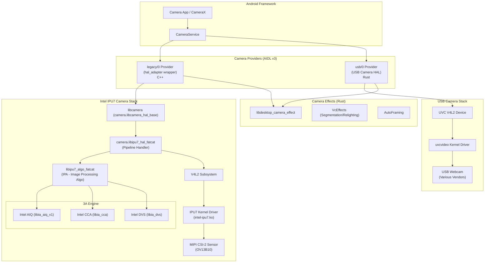
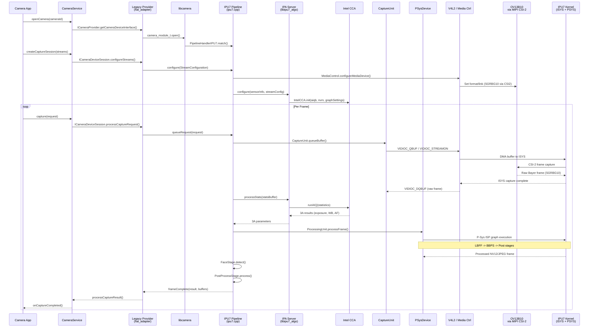
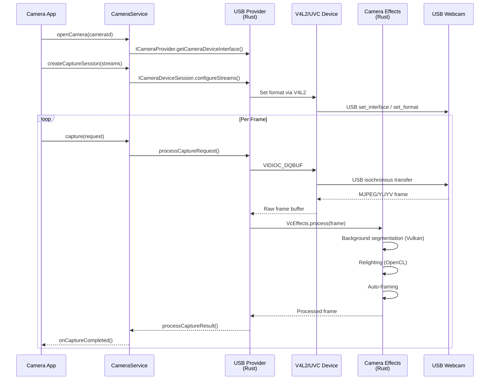

# Camera Subsystem Implementation

## 1. Architecture Overview

The Android Desktop Platform implements a **dual-path camera architecture** that supports both MIPI CSI-2 sensors via the Intel IPU7 Image Processing Unit and USB webcams via a custom Rust-based USB camera HAL. Both paths expose cameras through the Android Camera2/CameraX API via AIDL Camera Provider interfaces.



The architecture separates concerns into:
- **AIDL Camera Providers**: Two provider instances -- `legacy/0` for MIPI cameras via the Intel IPU7 pipeline, and `usb/0` for USB webcams.
- **Intel IPU7 Stack**: A full libcamera-based pipeline handler with hardware-accelerated 3A processing, face detection, and ISP graph execution on the IPU7 silicon (IPU7.5 variant for fatcat).
- **USB Camera Stack**: A pure-Rust implementation using V4L2/UVC for USB webcam capture with software image processing.
- **Camera Effects**: A shared Rust library providing video conferencing effects (background segmentation, relighting, auto-framing) used by both camera paths.

---

## 2. Key Components

| Component | Path | Language | Purpose |
|---|---|---|---|
| Camera Package Root | `vendor/google/desktop/camera/` | -- | Top-level camera package (team: `trendy_team_desktop_camera`) |
| Intel Camera Root | `vendor/intel/camera/` | -- | Intel camera library root with Apache-2.0 license; defines `x86_64_platforms_only_defaults` |
| IPU7 Pipeline Handler | `vendor/intel/camera/hal/ipu7/` | C++ | libcamera pipeline handler for IPU7 (IPU7.5/fatcat variant) |
| IPU7 IPA (Algo Server) | `vendor/intel/camera/hal/ipu7/ipa/` | C++ | Image Processing Algorithm module sandboxed via IPA framework |
| IPU6 HAL (Legacy) | `vendor/intel/camera/hal/ipu6/` | C++ | Legacy IPU6 HAL for brya/dedede/nissa platforms |
| Fatcat Configs | `vendor/intel/camera/configs/fatcat/` | JSON/YAML/Binary | Camera HAL configs, pipeline scheduler, sensor configs, GCSS binaries, tuning files |
| Prebuilt IA Libraries | `vendor/intel/camera/prebuilts/fatcat/` | Binary (.so) | 16 Intel proprietary imaging algorithm libraries |
| HAL Adapter (Legacy Wrapper) | `vendor/google/desktop/camera/hal_adapter/` | C++ | AIDL Camera Provider wrapping legacy camera HAL module; bridges libcamera to AIDL v3 |
| USB Camera HAL | `vendor/google/desktop/camera/hal_usb/` | Rust | Native AIDL Camera Provider for USB/UVC webcams |
| Camera Effects | `vendor/google/desktop/camera/effect/` | Rust | Video conferencing effects: segmentation, relighting, auto-framing |
| Common Camera Library | `vendor/google/desktop/camera/common/` | Rust | Shared camera utilities: GPU shaders, V4L2 helpers, metadata, buffer management |
| Camera Tool | `vendor/google/desktop/camera/camera_tool/` | Rust | CLI tool and AIDL executor for camera device configuration and diagnostics |
| External Libraries | `vendor/google/desktop/camera/external/` | C/C++ | Vendored external deps: cros_gralloc, GL, libexif, libgbm, libjpeg, libyuv, libcamera_metadata, intel_vendor_metadata |

---

## 3. Intel IPU7 Camera HAL

The Intel IPU7 Camera HAL (`camera.libipu7_hal_fatcat`) is a libcamera pipeline handler that implements the full camera processing pipeline for MIPI CSI-2 sensors connected to Intel's IPU7.5 Image Processing Unit.

### 3.1 Build Structure

The HAL is built as `camera.libipu7_hal_fatcat`, a shared library installed to `vendor/lib64/hw/libcamera/pipeline/`. Key build characteristics:

- **Target**: 64-bit only (`compile_multilib: "64"`)
- **IPU variant**: `IPU_SYSVER_ipu75` (IPU7.5 for fatcat/Panther Lake)
- **IPA sandboxing**: Enabled (`-DIPA_SANDBOXING -DUSE_THREAD_IPA`)
- **PAC**: Enabled (`-DPAC_ENABLE -DMAX_PAC_BUFFERS=10`)
- **Static graph**: Uses IA AIC types (`-DSTATIC_GRAPH_USE_IA_AIC_TYPES`)

The build composes two default sets:
1. `camera_ipu7_src_defaults` -- Core HAL sources
2. `ipu7_defaults_fatcat` -- fatcat-specific IPU7.5 descriptor autogenerated sources from `modules/ipu_desc/ipu75xa/`

### 3.2 3A Processing Engine

The 3A (Auto-Exposure, Auto-Focus, Auto-White-Balance) subsystem is in `src/3a/`:

| File | Purpose |
|---|---|
| `AiqCore.cpp/.h` | Core AIQ (Algorithm IQ) interface -- wraps Intel AIQ library calls |
| `AiqEngine.cpp/.h` | Orchestrates 3A algorithm execution per frame |
| `AiqResult.cpp/.h` | Stores per-frame 3A results (exposure, gain, WB, etc.) |
| `AiqResultStorage.cpp/.h` | Thread-safe storage for 3A results across pipeline stages |
| `AiqSetting.cpp/.h` | Manages 3A algorithm settings/configuration |
| `AiqUnit.cpp/.h` | Top-level 3A control unit; lifecycle management |
| `AiqUtils.cpp/.h` | Utility functions for 3A data conversion |
| `I3AControlFactory.cpp/.h` | Factory for creating 3A control instances |
| `LensManager.cpp/.h` | VCM lens control for auto-focus (DW9714 driver) |
| `MakerNote.cpp/.h` | EXIF maker note handling for 3A metadata |
| `SensorManager.cpp/.h` | Sensor exposure/gain control interface |
| `intel3a/Intel3AParameter.cpp/.h` | Intel-specific 3A parameter conversion |

### 3.3 Face Detection

Located in `src/fd/`:

| File | Purpose |
|---|---|
| `IFaceDetection.cpp/.h` | Abstract face detection interface |
| `FaceDetection.cpp/.h` | Face detection manager; dispatches to vendor engine |
| `FaceType.h` | Face data type definitions |
| `facessd/CameraFaceDetection.cpp/.h` | Camera-specific face detection wrapper |
| `facessd/FaceSSD.cpp/.h` | Google FaceSSD (Single Shot Detector) ML-based face detection |
| `facessd/CommonTypes.h` | Shared type definitions for FaceSSD |

The fatcat configuration uses Google FaceSSD (`faceEngineVendor: 1`) rather than Intel PVL (`faceEngineVendor: 0`).

### 3.4 Pipeline and Processing

The pipeline handler (`pipeline/ipu7.cpp`) implements the libcamera pipeline model:

| File | Purpose |
|---|---|
| `pipeline/ipu7.cpp` | Main pipeline handler registration and camera enumeration |
| `pipeline/AEStateMachine.cpp` | AE state machine per Android Camera2 spec |
| `pipeline/AFStateMachine.cpp` | AF state machine per Android Camera2 spec |
| `pipeline/AWBStateMachine.cpp` | AWB state machine per Android Camera2 spec |
| `pipeline/Camera3AMetadata.cpp` | 3A metadata reporting to Android framework |
| `pipeline/Frames.cpp` | Frame lifecycle management |
| `pipeline/ParameterConverter.cpp` | Android metadata to internal parameter conversion |
| `pipeline/MakerNoteBuilder.cpp` | EXIF maker note construction |
| `pipeline/ZslCapture.cpp` | Zero Shutter Lag capture support |

**IPA Client** (`pipeline/ipaclient/`):

| File | Purpose |
|---|---|
| `IPAMemory.cpp` | Shared memory management for IPA communication |
| `IPAClient.cpp` | Client-side IPA proxy |
| `IPAClientWorker.cpp` | Worker thread for IPA requests |
| `IntelCcaWorker.cpp` | Intel CCA algorithm worker |

### 3.5 Core Processing Unit

Located in `src/core/`:

| File | Purpose |
|---|---|
| `CameraContext.cpp` | Per-camera context and state |
| `CaptureUnit.cpp` | V4L2 capture buffer management |
| `DeviceBase.cpp` | Base device abstraction |
| `ProcessingUnit.cpp` | Main processing pipeline orchestration |
| `PSysDevice.cpp` | IPU7 P-Sys (Processing System) device interface |
| `IpuPacAdaptor.cpp` | IPU PAC (Parameter Adaptation Codec) interface |
| `BufferQueue.cpp` | Circular buffer queue for frame data |
| `CameraBuffer.cpp` | Hardware buffer allocation/mapping |
| `CameraStream.cpp` | Stream configuration and management |
| `SensorHwCtrl.cpp` | Hardware sensor control via V4L2 subdev |
| `LensHw.cpp` | Lens VCM hardware control |
| `SofSource.cpp` | Start-of-Frame event source |
| `SwPostProcessUnit.cpp` | Software post-processing fallback |
| `RequestThread.cpp` | Per-camera request processing thread |

**Processing Unit Sub-stages** (`src/core/processingUnit/`):

| File | Purpose |
|---|---|
| `PipeManager.cpp` | Manages ISP processing pipelines |
| `PipeLine.cpp` | Single processing pipeline execution |
| `CBStage.cpp` | Callback stage for inter-stage data passing |
| `FaceStage.cpp` | Face detection integration stage |
| `PostProcessStage.cpp` | Post-processing stage (scaling, format conversion) |

### 3.6 Scheduler

The camera scheduler (`src/scheduler/`) manages pipeline execution ordering:

| File | Purpose |
|---|---|
| `CameraScheduler.cpp/.h` | Main scheduler -- distributes work across pipe executors |
| `CameraSchedulerPolicy.cpp/.h` | Scheduling policy engine -- reads `pipe_scheduler_profiles.json` |
| `ISchedulerNode.h` | Interface for schedulable pipeline nodes |

---

## 4. Intel IPU6 Camera HAL (Legacy Support)

The IPU6 HAL (`vendor/intel/camera/hal/ipu6/`) provides legacy camera support for older Intel platforms:

| Platform | Module | IPU Variant | Notes |
|---|---|---|---|
| Brya (12th Gen) | `camera.libipu6_hal_brya` | IPU6EP (`ipu6v5`) | Alder Lake platforms |
| Dedede (Celeron/Pentium) | `camera.libipu6_hal_dedede` | IPU6SE (`ipu6v3`) | Jasper Lake platforms |
| Nissa (13th Gen) | `camera.libipu6_hal_nissa` | IPU6EP (`ipu6v5`) | Raptor Lake-P with TNR7 CM support |

Key architectural differences from IPU7:
- Uses traditional Android Camera HAL3 (`aal/` layer) rather than libcamera pipeline handler
- Includes `src/hal/CameraHal.cpp` and `aal/Camera3HAL.cpp` for direct HAL3 interface
- Has its own JPEG encoding (`src/jpeg/`) and metadata management (`src/metadata/`)
- Uses CIPR (Camera IP Resource) module (`modules/ia_cipr/`) instead of PAC
- Includes Intel PVL face detection alongside FaceSSD (`src/fd/pvl/`)
- Uses IA CSS (Camera Streaming Subsystem) program group modules
- Links against `vendor.google.desktop.camera.effect-ndk` for camera effects

The IPU6 HAL is **not used on fatcat** -- it exists for backward compatibility with older desktop platforms in the same source tree.

---

## 5. USB Camera HAL

The USB Camera HAL is a native Rust AIDL Camera Provider service at `vendor/google/desktop/camera/hal_usb/`.

### 5.1 Service Configuration

- **Binary**: `android.hardware.camera.provider-usb-service.android-desktop`
- **AIDL Interface**: `android.hardware.camera.provider.ICameraProvider/usb/0`
- **User/Group**: `cameraserver` / `audio camera input drmrpc usb`
- **Priority**: `ioprio rt 4` with `SYS_NICE` capability
- **Task Profiles**: `CameraServiceCapacity MaxPerformance`

### 5.2 Source Structure

| File | Purpose |
|---|---|
| `src/service.rs` | Main service entry point; registers AIDL provider |
| `src/provider.rs` | ICameraProvider implementation; enumerates USB cameras |
| `src/device.rs` | ICameraDevice implementation |
| `src/session/` | Camera capture session management |
| `src/pipeline/` | Capture pipeline (V4L2 buffer queue management) |
| `src/v4l2/` | V4L2 device abstraction layer |
| `src/v4l2.rs` | V4L2 top-level interface |
| `src/uvc_device.rs` | UVC-specific device handling |
| `src/metadata/` | Android camera metadata generation |
| `src/metadata.rs` | Metadata top-level interface |
| `src/resolution.rs` | Stream resolution negotiation |
| `src/buffer_container.rs` | Capture buffer management |
| `src/face_detector.rs` | Face detection integration |
| `src/hal_info.rs` | HAL information and capabilities |
| `src/aidl.rs` | AIDL type conversions |
| `src/test_pattern.rs` | Test pattern generation |

### 5.3 Key Dependencies

- `libv4l2r` -- Rust V4L2 bindings
- `libuvcvideo_sys` -- UVC video system bindings
- `libdesktop_camera_common` -- Shared camera utilities
- `libdesktop_camera_effect` -- Video conferencing effects
- `libusb_camera_info_proto` -- Protobuf camera module info
- `libcrossbeam_channel` -- Multi-producer/multi-consumer channels

### 5.4 Fatcat Internal USB Camera Modules

The fatcat platform declares 9 supported internal USB camera modules in `vendor/google/desktop/camera/hal_usb/data/fatcat/internal_usb_camera_info.txtpb`:

| USB ID | Vendor | Model | Resolution | Focal Length | Aperture |
|---|---|---|---|---|---|
| `0408:4052` | Quanta | YHVA-5 | 1936x1096 | 1.769mm | f/2.0 |
| `30c9:00fa` | LuxVisions | BBF503N3B | 2608x1960 | 1.83mm | f/2.0 |
| `04f2:b84b` | Chicony | C7FOF10-1 | 1928x1088 | 1.462mm | f/2.0 |
| `04f2:b890` | Chicony | CKFP515 | 2888x1808 | 1.87mm | f/2.0 |
| `0408:406a` | Quanta | YHWM-2 | 2888x1808 | 1.89mm | f/2.0 |
| `3277:0099` | Shine | FL225F-0B | 1928x1096 | 1.36mm | f/2.0 |
| `5986:11ae` | BISON | BNN755UBP-21A | 2600x1952 | 1.852mm | f/2.0 |
| `174f:11b7` | AVC | HAA-N1H8D3 | 2608x1960 | 1.897mm | f/2.0 |
| `04f2:b842` | Chicony | CKFO518 | 2624x1976 | 1.828mm | f/2.0 |

All modules are configured as `FACING_FRONT` with face detection enabled. Global settings: `use_hardware_jpeg_decoder: true`, `face_detection_input_width: 320`.

---

## 6. Camera HAL Adapter (hal_adapter Bridge Layer)

The HAL adapter at `vendor/google/desktop/camera/hal_adapter/` bridges the libcamera-based Intel IPU7 HAL (which uses the legacy camera module interface) to the modern AIDL Camera Provider interface.

### 6.1 AIDL Implementation

| Source File | Purpose |
|---|---|
| `aidl_camera_provider.cpp` | `ICameraProvider` implementation -- camera enumeration and device creation |
| `aidl_camera_device.cpp` | `ICameraDevice` implementation -- capabilities, session creation |
| `aidl_camera_device_session.cpp` | `ICameraDeviceSession` -- stream configuration, capture requests |
| `aidl_camera_service.cpp` | Service registration and lifecycle |
| `aidl_camera_utils.cpp` | AIDL/HAL3 data type conversion utilities |
| `aidl_camera_trace.cpp` | Atrace-based performance tracing |

### 6.2 Service Configuration

- **Binary**: `android.hardware.camera.provider@2.7-service-legacy-wrapper`
- **VINTF**: `ICameraProvider/legacy/0` (AIDL v3)
- **User/Group**: `system` / `system`
- **Capabilities**: `SYS_NICE`
- **Task Profiles**: `CameraServiceCapacity CameraServicePerformance`

### 6.3 Key Shared Libraries

The adapter links against:
- `android.hardware.camera.device-V3-ndk` / `provider-V3-ndk` / `common-V1-ndk` (AIDL NDK)
- `android.hardware.graphics.mapper@2.0/3.0/4.0` (buffer mapping)
- `android.hardware.thermal@2.0` (thermal throttling)
- `libdesktop_camera_effect_ffi` (Rust FFI for camera effects)
- `vendor.google.desktop.camera.effect-ndk` (effect AIDL interface)

A lazy variant (`-lazy`) is also built for on-demand service startup.

---

## 7. Camera Effects

The camera effects library at `vendor/google/desktop/camera/effect/` provides video conferencing enhancements.

### 7.1 Library Structure

| Module | Crate | Purpose |
|---|---|---|
| `libdesktop_camera_effect` | `desktop_camera_effect` | Main effects library (Rust, 2021 edition) |
| `libdesktop_camera_effect_ffi` | `desktop_camera_effect` | C FFI wrapper for C++ HAL adapter integration |

### 7.2 Effect Processing Features

The fatcat effect configuration (`effect_config_usb.json`) enables:

```json
{
    "stream_manipulators": [
        { "name": "Include", "config": "/vendor/etc/camera/common_post_process.json" },
        {
            "name": "VcEffects",
            "config": {
                "segmentation_gpu_api": "Vulkan",
                "relighting_gpu_api": "OpenCl",
                "segmentation_delegate": "Stable",
                "relighting_delegate": "Stable",
                "retouch_delegate": "Stable"
            }
        },
        {
            "name": "AutoFraming",
            "config": { "process_frame_rate": 0, "enable_logs": true }
        }
    ]
}
```

- **VcEffects** (Video Conferencing Effects):
  - Background segmentation via Vulkan GPU
  - Relighting via OpenCL GPU
  - Retouch processing via Stable delegate
- **AutoFraming**: Automatic camera framing/cropping to keep subjects centered
- **Common Post-Processing**: Included from a shared configuration

### 7.3 Dependencies

Key Rust dependencies include:
- `libvulkano` -- Vulkan GPU compute (via `libdesktop_camera_common`)
- `android.hardware.camera.metadata-V3-rust` -- Camera metadata
- `com.android.desktop.video_chat-aidl-V1-rust` -- Video chat AIDL interface
- `libgl_bindgen` -- OpenGL bindings
- `libnativewindow_rs` -- ANativeWindow interface

### 7.4 Testing

| Test | Purpose |
|---|---|
| `desktop_camera_effect_unit_tests` | Rust unit tests with mockall |
| `desktop_camera_effect_basic_test` | Host-side integration test |
| `desktop_camera_effect_benchmarks` | Performance benchmarks |
| `desktop_camera_effect_cpp_client_test` | C++ client integration test |

---

## 8. External Camera Support

The `vendor/google/desktop/camera/external/` directory contains vendored external dependencies required by the camera subsystem:

| Library | Path | Purpose |
|---|---|---|
| `cros_gralloc` | `external/cros_gralloc/` | ChromeOS gralloc buffer allocator (GBM-based) |
| `gl` | `external/gl/` | OpenGL/EGL bindings for GPU-accelerated processing |
| `intel_vendor_metadata` | `external/intel_vendor_metadata/` | Intel vendor-specific camera metadata extensions |
| `libcamera_metadata` | `external/libcamera_metadata/` | Android camera metadata library (vendored for Rust bindings) |
| `libexif` | `external/libexif/` | EXIF metadata reading/writing for JPEG |
| `libgbm` | `external/libgbm/` | Generic Buffer Management for GPU buffer allocation |
| `libjpeg` | `external/libjpeg/` | JPEG encoding/decoding |
| `libyuv` | `external/libyuv/` | YUV color space conversion and scaling |

These are vendored (not using AOSP system copies) to provide Rust FFI bindings (`*_bindgen` crates) used by the USB Camera HAL and Camera Effects.

---

## 9. Sensor Configuration

### 9.1 OV13B10 Sensor Overview

The fatcat platform uses the **OmniVision OV13B10** 13-megapixel CMOS image sensor in two configurations:

| Property | UF (User-Facing / Front) | WF (World-Facing / Back) |
|---|---|---|
| Sensor Name | `ov13b10-uf` | `ov13b10-wf` |
| CSI Port | Port 2 | Port 0 |
| Raw Output Resolution | 2104 x 1560 | 4208 x 3120 |
| Raw Format | `V4L2_PIX_FMT_SGRBG10` | `V4L2_PIX_FMT_SGRBG10` |
| MIPI Bus Format | `V4L2_MBUS_FMT_SGRBG10_1X10` | `V4L2_MBUS_FMT_SGRBG10_1X10` |
| ISYS Capture Node | `Intel IPU7 ISYS Capture 16` | `Intel IPU7 ISYS Capture 0` |
| Pixel Array Size | 2104 x 1560 | 4208 x 3120 |
| Active Array Size | 0,0 - 1920x1080 | 0,0 - 4208x3120 |
| Physical Size | 4.71mm x 3.49mm | 4.71mm x 3.49mm |
| Pixel Size | 1.12um | 1.12um |
| Lens Name | `dw9714` (VCM) | `dw9714` (VCM) |
| Lens Type | `LENS_VCM_HW` | `LENS_VCM_HW` |
| Lens Facing | Front (0) | Back (1) |
| Focal Length | 3.39mm | 3.39mm |
| Aperture | f/2.2 | f/2.2 |
| Hyperfocal Distance | 1.37m | 1.37m |
| Min Focus Distance | 10.0 diopters | 10.0 diopters |
| Color Filter | GBRG (2) | GBRG (2) |
| Max Analog Sensitivity | 699 (43 x 15.9) | 699 (43 x 15.9) |
| Sensitivity Range | 44 - 1399 | 44 - 1399 |
| Exposure Time Range | 100us - 100ms | 100us - 100ms |
| Hardware Level | FULL (1) | FULL (1) |
| Max Digital Zoom | 16.0x | 16.0x |
| NVM Device | NVM, 1680 bytes | NVM, 1680 bytes |
| Graph Settings File | `ov13b10-uf.IPU75XA.bin` | `OV13B10_09B13.IPU7X.bin` |

### 9.2 Supported Output Stream Configurations

**UF (Front Camera)**:

| Format | Resolutions |
|---|---|
| NV12 / IMPLEMENTATION_DEFINED / YCbCr_420_888 | 1920x1080, 1280x960, 1280x720, 640x480, 640x360, 320x240 |
| JPEG / BLOB | 1920x1080, 1280x960, 1280x720, 640x480, 640x360, 320x240 |
| Input (reprocessing) | 2104x1560 (IMPLEMENTATION_DEFINED) |

**WF (Back Camera)**:

| Format | Resolutions |
|---|---|
| NV12 / IMPLEMENTATION_DEFINED / YCbCr_420_888 | 4096x3072, 3840x2160, 1920x1080, 1280x960, 1280x720, 640x480, 640x360, 320x240 |
| JPEG / BLOB | 4096x3072, 3840x2160, 1920x1080, 1280x960, 1280x720, 640x480, 640x360, 320x240 |
| Input (reprocessing) | 4096x3072 (IMPLEMENTATION_DEFINED) |

### 9.3 Common Sensor Features

Both sensors support:
- **AE Modes**: AUTO, MANUAL (with lock support)
- **AF Modes**: AUTO, MACRO, CONTINUOUS_VIDEO, CONTINUOUS_PICTURE, OFF
- **AWB Modes**: AUTO, INCANDESCENT, FLUORESCENT, DAYLIGHT, FULL_OVERCAST, PARTLY_OVERCAST, SUNSET, VIDEO_CONFERENCE, MANUAL_CCT_RANGE, MANUAL_WHITE_POINT, MANUAL_GAIN, MANUAL_COLOR_TRANSFORM
- **Features**: MANUAL_EXPOSURE, MANUAL_WHITE_BALANCE, IMAGE_ENHANCEMENT, NOISE_REDUCTION, PER_FRAME_CONTROL, SCENE_MODE
- **FPS Ranges**: 15-15, 24-24, 15-30, 30-30
- **EV Range**: -6 to +6 (step 1/3)
- **Face Detection**: Simple mode (max 10 faces)
- **Edge Modes**: OFF, FAST, HIGH_QUALITY, ZERO_SHUTTER_LAG
- **Noise Reduction**: OFF, FAST, HIGH_QUALITY, ZERO_SHUTTER_LAG
- **Capabilities**: BACKWARD_COMPATIBLE, MANUAL_SENSOR, MANUAL_POST_PROCESSING, READ_SENSOR_SETTINGS, BURST_CAPTURE
- **ZSL**: Enabled (`control.enableZsl: 1`)
- **Output Streams**: Max 1 raw + 3 YUV + 1 JPEG simultaneously
- **Pipeline Depth**: 7 frames

### 9.4 Sensor Processing Configuration

| Parameter | Value |
|---|---|
| AIQ Enabled | true |
| AIQ Data (aiqd) | Enabled |
| PSys Processor | Enabled |
| DVS Type | IMG_TRANS |
| Exposure Lag | 2 frames |
| Gain Lag | 2 frames |
| Digital Gain Lag | 0 frames |
| Max Raw Data Buffers | 32 |
| Initial Skip Frame | 0 |
| YUV Color Range | full |
| Pipe Switch Delay | 60 frames |
| Max Inflight Requests | 5 |
| Face Engine | Google FaceSSD (vendor: 1) |
| Face Engine Interval | 10 frames |
| Face AE | Enabled |
| PSys Bundle with AIC | false |
| ISYS Compression | Disabled |
| PSA Compression | Disabled |
| Mock PSys | Disabled |

### 9.5 GCSS Binary Configs

| File | Sensor | IPU Variant |
|---|---|---|
| `gcss/ov13b10-uf.IPU75XA.bin` | OV13B10 UF (2-lane) | IPU7.5 XA |
| `gcss/OV13B10_09B13.IPU7X.bin` | OV13B10 WF (4-lane) | IPU7 X |

### 9.6 Tuning Files

| File | Purpose |
|---|---|
| `tuning_files/ov13b10.aiqb` | AIQ binary tuning data for OV13B10 (shared between UF and WF) |

The tuning configuration maps both NORMAL and STILL_CAPTURE modes to the VIDEO tuning profile with LARD tags `DFLT` for CMC, AIQ, ISP, and others.

---

## 10. IPU7 Internal Architecture

### 10.1 Source Directory Structure

```
vendor/intel/camera/hal/ipu7/
|-- Android.bp              # Build definitions
|-- include/
|   |-- api/                # Public API headers (ParamDataType.h)
|   |-- ia_imaging/         # Intel IA imaging algorithm headers (65+ headers)
|   |-- linux/              # Linux kernel UAPI headers
|   |-- utils/              # Utility headers
|-- src/
|   |-- 3a/                 # 3A algorithm wrappers (13 files)
|   |   |-- intel3a/        # Intel-specific 3A parameter handling
|   |-- core/               # Core camera pipeline processing (20+ files)
|   |   |-- processingUnit/ # Pipeline stages (6 files)
|   |-- fd/                 # Face detection (6 files)
|   |   |-- facessd/        # Google FaceSSD implementation (5 files)
|   |-- image_process/      # Image post-processing (7 files)
|   |   |-- chrome/         # Chrome/Android-specific processing
|   |-- iutils/             # Internal utilities (logging, tracing, dump)
|   |-- platformdata/       # Platform/sensor configuration parsing (14 files)
|   |   |-- gc/             # Graph configuration (3 files)
|   |-- scheduler/          # Pipeline scheduling (5 files)
|   |-- v4l2/               # V4L2 device abstraction (8 files)
|-- pipeline/               # libcamera pipeline handler (16 files)
|   |-- ipaclient/          # IPA client communication (4 files)
|-- ipa/                    # IPA server (algorithm execution) (9 files)
|   |-- server/             # Server-side algorithm workers
|-- modules/
|   |-- ipu_desc/           # IPU hardware descriptors
|   |   |-- ipu75xa/        # IPU7.5 XA autogenerated graph descriptors (6 files)
|   |-- v4l2/               # Low-level V4L2 device/subdevice wrappers (3 files)
```

### 10.2 V4L2 Subsystem

The V4L2 layer manages kernel device interfaces:

| Component | Purpose |
|---|---|
| `src/v4l2/MediaControl.cpp` | Media controller topology discovery and link setup |
| `src/v4l2/V4l2DeviceFactory.cpp` | Factory for creating V4L2 device instances |
| `src/v4l2/NodeInfo.cpp` | V4L2 device node information and mapping |
| `src/v4l2/SysCall.cpp` | System call wrappers (ioctl, mmap, etc.) |
| `modules/v4l2/v4l2_device.cc` | Low-level V4L2 device operations |
| `modules/v4l2/v4l2_subdevice.cc` | V4L2 subdevice pad/format operations |
| `modules/v4l2/v4l2_video_node.cc` | V4L2 video node buffer queue operations |

### 10.3 Image Processing

Post-processing pipeline in `src/image_process/`:

| Component | Purpose |
|---|---|
| `PostProcessorBase.cpp` | Base class for all post-processors |
| `PostProcessorCore.cpp` | Core post-processing orchestrator |
| `chrome/ImageProcessorCore.cpp` | Chrome/Android image processor (uses cros_gralloc) |
| `IImageProcessor.h` | Image processor interface |
| `ProcessType.h` | Processing type definitions (scale, rotate, format convert) |

### 10.4 Platform Data and Configuration Parsing

| Component | Purpose |
|---|---|
| `PlatformData.cpp` | Central platform configuration singleton |
| `CameraParserInvoker.cpp` | Invokes appropriate parsers based on config format |
| `CameraSensorsParser.cpp` | Parses sensor JSON configuration files |
| `JsonCommonParser.cpp` | Common JSON parsing utilities |
| `JsonParserBase.cpp` | Base JSON parser class |
| `AiqInitData.cpp` | AIQ initialization data loading (aiqb, NVM) |
| `gc/GraphConfig.cpp` | ISP graph configuration |
| `gc/GraphConfigManager.cpp` | Graph configuration lifecycle management |
| `gc/GraphUtils.cpp` | Graph utility functions |

### 10.5 IPU7.5 Descriptor Modules

The `modules/ipu_desc/ipu75xa/` directory contains autogenerated code for the IPU7.5 XA hardware:

| File | Purpose |
|---|---|
| `CBLayoutUtils.cpp` | Callback buffer layout utilities |
| `GraphResolutionConfigurator.cpp` | Runtime graph resolution configuration |
| `GraphResolutionConfiguratorAutogen.cpp` | Autogenerated resolution configurations |
| `StaticGraphAutogen.cpp` | Autogenerated static graph definitions |
| `StaticGraphReaderAutogen.cpp` | Autogenerated graph binary reader |
| `TerminalDescriptorAutogen.cpp` | Autogenerated terminal descriptors for ISP kernels |

### 10.6 IPA Server (Algorithm Execution)

The IPA (Image Processing Algorithm) server runs in a sandboxed thread:

| Component | Purpose |
|---|---|
| `ipa/ipu7.cpp` | IPA module registration |
| `ipa/IPAServer.cpp` | IPA server main class |
| `ipa/IPAServerThread.cpp` | Threaded IPA execution |
| `ipa/IPCCca.cpp` | IPC wrapper for CCA (Camera Control Algorithm) |
| `ipa/server/CcaWorker.cpp` | CCA algorithm worker |
| `ipa/server/IPACcaLog.cpp` | CCA logging |

The IPA links against all 16 prebuilt Intel IA libraries via `ipu7_prebuilt_libraries_defaults`.

---

## 11. Prebuilt Libraries

The following Intel proprietary imaging algorithm libraries are provided as prebuilt shared objects for fatcat:

| Library | File | Purpose |
|---|---|---|
| `libia_aiq_v1` | `libia_aiq_v1.so` | Auto-Exposure, Auto-White-Balance, Auto-Focus algorithms (v1 API) |
| `libia_cca` | `libia_cca.so` | Camera Control Algorithm -- top-level orchestrator for all 3A/ISP algos |
| `libia_dvs` | `libia_dvs.so` | Digital Video Stabilization |
| `libia_view` | `libia_view.so` | View/perspective transformation |
| `libia_aic` | `libia_aic.so` | Automatic ISP Configuration -- generates ISP kernel parameters |
| `libia_aiqb_parser` | `libia_aiqb_parser.so` | AIQ Binary tuning file parser |
| `libia_bcomp` | `libia_bcomp.so` | Bayer compression/decompression |
| `libia_ccat` | `libia_ccat.so` | Color Correction and Adaptation Tuning |
| `libia_cmc_parser` | `libia_cmc_parser.so` | Camera Module Characterization data parser |
| `libia_coordinate` | `libia_coordinate.so` | Coordinate transformation between sensor/ISP/output spaces |
| `libia_emd_decoder` | `libia_emd_decoder.so` | Embedded Data decoder (sensor-specific metadata) |
| `libia_exc` | `libia_exc.so` | Exposure Control |
| `libia_lard` | `libia_lard.so` | LARD (Loadable Algorithm Repository Descriptor) |
| `libia_log` | `libia_log.so` | Intel IA logging framework |
| `libia_mkn` | `libia_mkn.so` | Maker Note encoder/decoder (EXIF) |
| `libia_nvm` | `libia_nvm.so` | Non-Volatile Memory data reader (OTP calibration) |

All libraries are:
- **Vendor partition**: Installed to `/vendor/lib64/`
- **64-bit only**: `compile_multilib: "64"`
- **ELF check disabled**: `check_elf_files: false` (proprietary binaries)

The `ipu7_prebuilt_libraries_defaults` cc_defaults aggregates all 16 libraries as shared_libs for linking by the IPA module.

---

## 12. Data Flow

### 12.1 MIPI Camera Capture Flow



### 12.2 USB Camera Capture Flow



---

## 13. Configuration

### 13.1 libcamhal_configs.json

Located at `vendor/intel/camera/configs/fatcat/libcamhal_configs.json`, this is the top-level camera HAL configuration:

```json
{
    "Common": {
        "version": 1.0,
        "platform": "IPU7",
        "availableSensors": [
            "ov13b10-wf-0",
            "ov5675-uf-2",
            "ov08x40-uf-0",
            "ov13b10-uf-2"
        ],
        "videoStreamNum": 2,
        "cameraNumber": 2
    }
}
```

Key fields:
- **platform**: `IPU7` -- selects IPU7 pipeline handler
- **availableSensors**: Sensor name + facing + CSI port ID. The HAL probes these in order, using the first two that are physically present. The naming format is `<sensor>-<wf|uf>-<CSI_PORT>`.
- **videoStreamNum**: Maximum concurrent video streams (2)
- **cameraNumber**: Expected number of cameras (2)

Note: The config lists 4 possible sensors (ov13b10-wf, ov5675-uf, ov08x40-uf, ov13b10-uf), but only 2 will be active depending on which sensor modules are physically populated on the board.

### 13.2 pipe_scheduler_profiles.json

The pipeline scheduler defines execution grouping for ISP graph nodes across 4 graph configurations:

| Scheduler ID | Graph ID | Use Case |
|---|---|---|
| 1 | 100000 | Default video + still |
| 2 | 100200 | Alternate video + still |
| 2 | 100002 | Combined LBFF+BBPS video |
| 2 | 100032 | Combined LBFF+BBPS video (alternate) |

Each scheduler defines 4 pipe executors:

| Executor | Nodes | Purpose |
|---|---|---|
| `video_lb` | `lbff` (or `lbff` + `bbps` for graphs 100002/100032) | Low Bandwidth Front-End filtering |
| `video_bb` | `bbps`, `post_1`, `post_2` (or just `post_1`, `post_2`) | Back-bone processing + post stages |
| `still_full` | `lbff1`, `bbps1`, `post_0` | Full-resolution still capture pipeline |
| `face_detection` | `face` | Face detection processing |

Pipeline node terminology:
- **LBFF**: Low Bandwidth Front-End -- initial ISP processing (demosaic, denoise, WB)
- **BBPS**: Back-Bone Processing System -- secondary ISP processing (tone mapping, sharpening)
- **post_0/1/2**: Post-processing stages (scaling, format conversion, rotation)

### 13.3 camera_hal.yaml

The libcamera HAL configuration at `vendor/intel/camera/configs/fatcat/libcamera/camera_hal.yaml`:

```yaml
cameras:
  "camera0":
    location: front
    rotation: 0
  "camera1":
    location: back
    rotation: 0
```

This maps:
- **camera0**: Front-facing (UF sensor, CSI port 2)
- **camera1**: Back-facing (WF sensor, CSI port 0)

Both cameras have 0-degree rotation (landscape-native orientation, typical for desktop/laptop form factors).

---

## 14. Build Integration

### 14.1 PRODUCT_PACKAGES (from fatcat_common.mk)

```makefile
# MIPI Camera Provider (IPU7)
PRODUCT_PACKAGES += \
    android.hardware.camera.provider@2.7-service-legacy-wrapper \
    camera.libcamera_hal_base \
    camera.libipu7_hal_fatcat \
    libipu7_algo_fatcat \
    ipu7_camera_profiles \
    ipu7_libcamera_hal \
    ipu7_gcss_settings \
    ipu7_sensor_settings \
    ipu7_tuning_files

# USB Camera Provider
PRODUCT_PACKAGES += android.hardware.camera.provider-usb-service.android-desktop
PRODUCT_PACKAGES += fatcat_internal_usb_camera_info

# Camera Effects
PRODUCT_PACKAGES += desktop_camera_effect_configs_fatcat
PRODUCT_PACKAGES += desktop_camera_effect_configs_common

# Camera Tool
PRODUCT_PACKAGES += camera_tool
PRODUCT_PACKAGES += vendor.google.desktop.camera-tool-executor

# Variant Detection
PRODUCT_PACKAGES += get_variant_camera
```

### 14.2 PRODUCT_COPY_FILES (Camera Permissions)

```makefile
PRODUCT_COPY_FILES += \
    frameworks/native/data/etc/android.hardware.camera.autofocus.xml:system/etc/permissions/... \
    frameworks/native/data/etc/android.hardware.camera.full.xml:system/etc/permissions/... \
    frameworks/native/data/etc/android.hardware.camera.manual_postprocessing.xml:system/etc/permissions/... \
    frameworks/native/data/etc/android.hardware.camera.manual_sensor.xml:system/etc/permissions/... \
    frameworks/native/data/etc/android.hardware.camera.front.xml:system/etc/permissions/...
```

Declared camera feature permissions:
- `android.hardware.camera.autofocus` -- Autofocus support
- `android.hardware.camera.full` -- Full hardware level
- `android.hardware.camera.manual_postprocessing` -- Manual post-processing
- `android.hardware.camera.manual_sensor` -- Manual sensor control
- `android.hardware.camera.front` -- Front-facing camera present

### 14.3 Soong Namespaces

```makefile
PRODUCT_SOONG_NAMESPACES += \
    vendor/intel/camera/configs/fatcat \
    vendor/intel/camera/prebuilts/fatcat \
    vendor/google/desktop/camera/hal_usb/data/fatcat \
    vendor/google/desktop/camera/effect/configs/fatcat
```

---

## 15. Per-Device Camera Variants (fatcat hal_config.xml)

The fatcat device configuration at `device/google/desktop/fatcat/configs/hal_config.xml` contains per-SKU hardware configuration entries. Each SKU variant includes a `CameraConfiguration` section:

```xml
<CameraConfiguration>
    <media-profile-suffix>_desktop_one_camera_1080p</media-profile-suffix>
</CameraConfiguration>
```

All fatcat SKU variants use the same camera media profile suffix: `_desktop_one_camera_1080p`. This maps to the media profiles XML file `media_profiles_desktop_one_camera_1080p.xml` on the device, which defines available video recording profiles.

The `get_variant_camera.sh` script at boot time:
1. Reads the device model and SKU ID
2. Looks up the matching entry in `media_profiles_map_<board>.csv`
3. Sets `vendor.media.xml_variant.profiles` property to select the correct media profiles

---

## 16. Inter-Subsystem Dependencies

### 16.1 Kernel Modules

The camera subsystem depends on these kernel modules:

| Module | Purpose |
|---|---|
| `intel-ipu7-isys.ko` | IPU7 Input System driver (CSI-2 receiver, DMA) |
| `intel-ipu7-psys.ko` | IPU7 Processing System driver (ISP firmware execution) |
| `intel-ipu7.ko` | IPU7 platform/PCI driver |
| `ov13b10.ko` | OV13B10 sensor I2C driver |
| `dw9714.ko` | DW9714 VCM lens actuator driver |
| `uvcvideo.ko` | USB Video Class driver (for USB webcams) |

### 16.2 Face Unlock Integration

The camera effects library integrates with the `DesktopVideoChatManager` system service for video chat face detection and effects:
- `com.android.desktop.video_chat-aidl-V1` AIDL interface
- `desktop_video_chat_manager` service (found via `service_manager`)
- SEPolicy grants `hal_camera_default` permission to bind to `system_server` and find the `desktop_video_chat_manager` service

### 16.3 Video Chat

Camera effects provide real-time video processing for video chat applications:
- Background segmentation (Vulkan GPU)
- Portrait relighting (OpenCL GPU)
- Auto-framing (ML-based subject tracking)
- VINTF fragment: `com.android.desktop.video_chat.xml`

### 16.4 Thermal Management

The HAL adapter links against `android.hardware.thermal@2.0` for thermal throttling integration, allowing the camera to reduce frame rate or resolution under thermal constraints.

### 16.5 Graphics/GPU

The camera subsystem interacts with the graphics stack:
- `hal_graphics_allocator` (gralloc) for buffer allocation
- `hal_graphics_composer_default` for display composition
- Vulkan for GPU compute (background segmentation)
- OpenCL for relighting effects
- OpenGL/EGL for shader-based processing

### 16.6 hal_config.xml

The `device/google/desktop/fatcat/configs/hal_config.xml` file defines per-SKU camera configuration variants. Camera-related patches to this file must be carefully ordered (after all other patches that modify it) to avoid merge conflicts in the patch application system.

---

## 17. Camera Tool

The camera tool at `vendor/google/desktop/camera/camera_tool/` provides camera diagnostics and configuration capabilities.

### 17.1 Components

| Module | Binary/Library | Purpose |
|---|---|---|
| `libdesktop_camera_device_config` | Library | Camera device configuration reader; walks sysfs to discover camera devices |
| `camera_tool` | CLI binary | Command-line camera diagnostic and configuration utility |
| `vendor.google.desktop.camera-tool-executor` | AIDL service | Background executor service for camera tool operations |

### 17.2 camera_tool (CLI)

- **Language**: Rust (2021 edition)
- **Dependencies**: `clap` (CLI argument parsing), `serde_json` (JSON output), `libdesktop_camera_device_config`
- **Partition**: Vendor
- **Usage**: Provides MIPI camera information discovery and configuration

### 17.3 camera-tool-executor (Service)

- **Language**: Rust with async/Tokio runtime
- **AIDL Interface**: `camera-tool-executor-aidl-V1`
- **Init**: `camera-tool-executor.rc`
- **VINTF**: `vendor.google.desktop.camera-tool-executor.xml`
- **Partition**: Proprietary vendor (owner: `google`)
- **Purpose**: Runs privileged camera operations requested by the camera_tool CLI

### 17.4 Device Config Library

The `libdesktop_camera_device_config` library:
- Uses `walkdir` to traverse filesystem paths
- Uses `zerocopy` and `memoffset` for zero-copy data structure access
- Provides camera device enumeration and configuration reading
- Has host-side unit tests (`camera_device_config_test`)

---

## 18. SEPolicy (Camera-Related Policies)

### 18.1 hal_camera_default.te

The main camera HAL SELinux policy at `device/google/desktop/common/sepolicy/hal_camera_default.te`:

**Type Declarations**:
- `hal_camera_default_tmpfs` -- tmpfs file type for camera HAL

**Device Access**:
- `media_device:chr_file` -- Media controller (`/dev/media*`) access
- `v4l_sub_device:chr_file` -- V4L2 subdevice (`/dev/v4l-subdev*`) access
- `ipu_psys:chr_file` -- IPU Processing System device access
- `sysfs:dir/file` -- Sysfs read access (sensor enumeration)
- `vndbinder_device:chr_file` -- Vendor binder communication
- `vendor_configs_file:file` -- Vendor configuration file access

**HAL Client Domains**:
- `hal_configstore` -- Configuration store access
- `hal_graphics_allocator` -- Buffer allocation (gralloc)
- `hal_power` -- Power management
- `hal_audio` -- Audio HAL (for video chat audio sync)

**Service Access**:
- `system_server:binder` -- Binder calls to system server
- `desktop_video_chat_manager:service_manager` -- Video chat manager service
- `fwk_stats_service:service_manager` -- Framework stats service

**Capabilities**:
- `sys_nice` -- Real-time thread priority adjustment

**File Access**:
- `camera_vendor_data_file` -- Camera vendor data directory (create/read/write)
- `proc_meminfo:file` -- Memory info for buffer allocation decisions

**Properties**:
- `vendor_camera_prop` -- Camera-specific vendor properties
- `vendor_device_info_prop` -- Device information properties
- `build_prop` -- Build properties

**Graphics Composer**:
- `hal_graphics_composer_default:fd` -- Use file descriptors from composer

**Tracing**:
- `perfetto_producer` -- Performance tracing via Perfetto

### 18.2 cameraserver.te

Additional cameraserver policies at `device/google/desktop/common/sepolicy/cameraserver.te`:

```
allow cameraserver hal_graphics_allocator_default_tmpfs:file { open read write map };
get_prop(hal_camera_default, vendor_default_prop);
```

- Grants cameraserver access to graphics allocator tmpfs files
- Allows camera HAL to read vendor default properties

---

## 19. Testing

### 19.1 Camera Effect Tests

| Test | Type | Description |
|---|---|---|
| `desktop_camera_effect_unit_tests` | Rust unit test | Tests effect library internals with mockall mocking |
| `desktop_camera_effect_basic_test` | Host Rust test | Basic integration test running on host |
| `desktop_camera_effect_benchmarks` | Rust benchmark | Performance benchmarks for effect processing |
| `desktop_camera_effect_cpp_client_test` | C++ host test | Tests C++ FFI integration with gmock |

### 19.2 Common Library Tests

| Test | Type | Description |
|---|---|---|
| `desktop_camera_common_unit_tests` | Rust unit test | Tests common utilities (GPU shaders, buffers, metadata) |
| Test data | Files | `droid.jpg`, NV12 test frames (various sizes), `whiteboard.jpg` |

### 19.3 USB Camera HAL Tests

| Test | Type | Description |
|---|---|---|
| `desktop_usb_camera_hal_test` | Host Rust test | USB camera HAL service unit tests |

### 19.4 Camera Tool Tests

| Test | Type | Description |
|---|---|---|
| `camera_device_config_test` | Host Rust test | Device configuration library tests |
| `camera_tool_executor_test` | Host Rust test | Camera tool executor service tests |

### 19.5 Debug Tools

From `device_common.mk`:
```makefile
PRODUCT_PACKAGES_DEBUG += \
    camera_dfu_test \
    camera_dfu_updater \
    v4l2-compliance \
    v4l2-ctl
```

- `camera_dfu_test` -- Camera Device Firmware Update test tool
- `camera_dfu_updater` -- Camera firmware updater utility
- `v4l2-compliance` -- V4L2 driver compliance testing
- `v4l2-ctl` -- V4L2 device control utility

---

## 20. Key Files Reference

| File | Path (relative to source root) | Purpose |
|---|---|---|
| Camera package root | `vendor/google/desktop/camera/Android.bp` | Top-level package definition |
| Intel camera root | `vendor/intel/camera/Android.bp` | License and x86_64 platform defaults |
| IPU7 HAL build | `vendor/intel/camera/hal/ipu7/Android.bp` | IPU7 pipeline handler and IPA build rules |
| IPU6 HAL build | `vendor/intel/camera/hal/ipu6/Android.bp` | Legacy IPU6 HAL build rules |
| Fatcat config build | `vendor/intel/camera/configs/fatcat/Android.bp` | Prebuilt config install rules |
| Camera HAL config | `vendor/intel/camera/configs/fatcat/libcamhal_configs.json` | Platform/sensor enumeration |
| Pipeline scheduler | `vendor/intel/camera/configs/fatcat/pipe_scheduler_profiles.json` | ISP pipeline execution scheduling |
| libcamera HAL YAML | `vendor/intel/camera/configs/fatcat/libcamera/camera_hal.yaml` | Camera location/rotation mapping |
| OV13B10 UF sensor | `vendor/intel/camera/configs/fatcat/sensors/ov13b10-uf.json` | Front camera sensor configuration |
| OV13B10 WF sensor | `vendor/intel/camera/configs/fatcat/sensors/ov13b10-wf.json` | Back camera sensor configuration |
| GCSS UF binary | `vendor/intel/camera/configs/fatcat/gcss/ov13b10-uf.IPU75XA.bin` | ISP graph settings for UF sensor |
| GCSS WF binary | `vendor/intel/camera/configs/fatcat/gcss/OV13B10_09B13.IPU7X.bin` | ISP graph settings for WF sensor |
| AIQ tuning | `vendor/intel/camera/configs/fatcat/tuning_files/ov13b10.aiqb` | 3A algorithm tuning data |
| Prebuilt IA libs | `vendor/intel/camera/prebuilts/fatcat/Android.bp` | 16 prebuilt Intel imaging libraries |
| HAL adapter | `vendor/google/desktop/camera/hal_adapter/Android.bp` | AIDL legacy camera provider wrapper |
| HAL adapter service | `vendor/google/desktop/camera/hal_adapter/android.hardware.camera.provider@2.7-service-legacy-wrapper.rc` | Init service for MIPI camera provider |
| HAL adapter VINTF | `vendor/google/desktop/camera/hal_adapter/android.hardware.camera.provider@2.7-service-legacy-wrapper.xml` | VINTF manifest for legacy/0 provider |
| USB Camera HAL | `vendor/google/desktop/camera/hal_usb/Android.bp` | Rust USB camera HAL build |
| USB Camera service | `vendor/google/desktop/camera/hal_usb/android.hardware.camera.provider-usb-service.android-desktop.rc` | Init service for USB camera provider |
| Fatcat USB camera info | `vendor/google/desktop/camera/hal_usb/data/fatcat/internal_usb_camera_info.txtpb` | USB camera module database (9 modules) |
| Camera effects | `vendor/google/desktop/camera/effect/Android.bp` | Rust camera effects library build |
| Fatcat effect config | `vendor/google/desktop/camera/effect/configs/fatcat/effect_config_usb.json` | Effect stream manipulator config |
| Common camera lib | `vendor/google/desktop/camera/common/Android.bp` | Shared Rust camera utilities |
| Camera tool | `vendor/google/desktop/camera/camera_tool/Android.bp` | Camera CLI tool and executor |
| Fatcat device config | `device/google/desktop/fatcat/fatcat_common.mk` | PRODUCT_PACKAGES for camera |
| Common device config | `device/google/desktop/common/device_common.mk` | Shared camera packages |
| hal_config.xml | `device/google/desktop/fatcat/configs/hal_config.xml` | Per-SKU hardware config including camera profiles |
| HAL camera SEPolicy | `device/google/desktop/common/sepolicy/hal_camera_default.te` | SELinux policy for camera HAL |
| Cameraserver SEPolicy | `device/google/desktop/common/sepolicy/cameraserver.te` | SELinux policy for cameraserver |
| Variant script | `device/google/desktop/common/shared/get_variant_camera.sh` | Boot-time camera variant detection |
