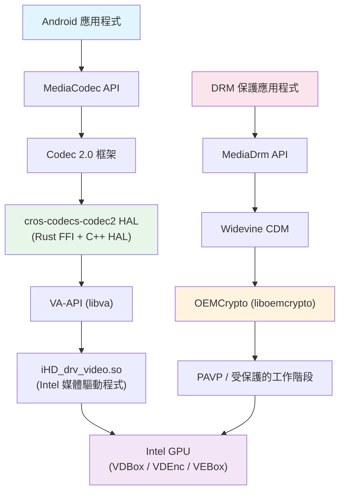
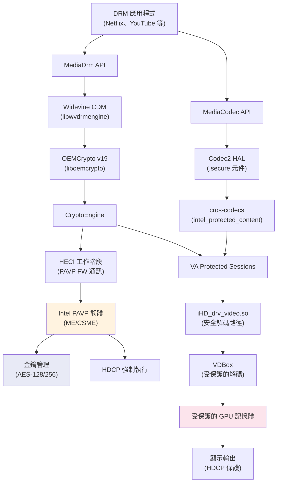
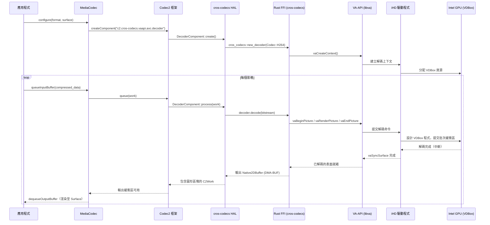
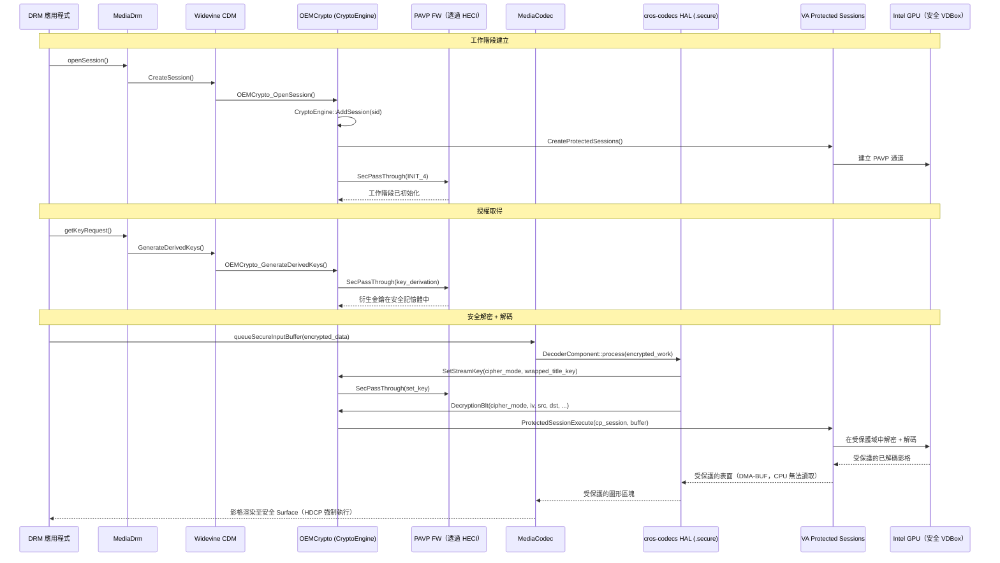

# 視訊、媒體與 DRM/Widevine 實作

## 1. 架構概覽

Android 桌面平台的視訊子系統採用分層架構，將 Android 的 MediaCodec 框架橋接至 Intel GPU 硬體，透過 VA-API 實現。對於受 DRM 保護的內容，額外的 PAVP（Protected Audio Video Path）通道負責保護解密和解碼管線。



### 一般（無加密）播放路徑

1. 應用程式透過 `MediaCodec` 傳送壓縮的視訊位元串流
2. Codec 2.0 框架將工作分派給 `cros-codecs-codec2` 供應商 HAL 服務
3. HAL 透過 CXX FFI 橋接呼叫 cros-codecs（Rust）
4. cros-codecs 呼叫 VA-API（`libva`）提交解碼/編碼工作
5. VA-API 分派至 `iHD_drv_video.so`（Intel 媒體驅動程式）
6. iHD 對 GPU 的 VDBox（解碼）或 VDEnc（編碼）固定功能單元進行程式設計
7. 解碼後的影格以 DMA-BUF 支援的圖形緩衝區形式回傳

### 安全（DRM）播放路徑

1. 應用程式透過 `MediaDrm` 協商 DRM 工作階段
2. Widevine CDM 處理授權並將加密內容傳遞給 OEMCrypto
3. OEMCrypto 使用 VA Protected Sessions 透過 HECI 與 Intel PAVP 韌體通訊
4. 加密的位元串流在 GPU 的安全域內進行解密
5. 解碼後的影格保留在受保護的記憶體中；HDCP 負責輸出保護

---

## 2. 關鍵元件

| 元件 | 路徑 | 語言 | 用途 |
|------|------|------|------|
| Video aconfig 旗標 | `vendor/google/desktop/video/flags.aconfig` | Aconfig | cros-codecs 解碼器/編碼器 HAL 的功能旗標 |
| Video aconfig 函式庫 | `vendor/google/desktop/video/Android.bp` | Soong | aconfig 宣告的建置定義 |
| cros-codecs FFI | `vendor/google/desktop/video/cros-codecs-codec2/ffi/` | Rust | cros-codecs Rust 函式庫與 C++ HAL 之間的 CXX 橋接 |
| cros-codecs HAL | `vendor/google/desktop/video/cros-codecs-codec2/hal/` | C++ | 基於 cros-codecs 的 Codec 2.0 IComponentStore 服務 |
| 視訊能力 | `vendor/google/desktop/video/capability/` | Rust | 執行時期視訊能力偵測（VA-API 或 V4L2） |
| DRM 網路服務 | `vendor/google/desktop/video/drm-network/` | AIDL XML | IDrmNetworkService 相容性矩陣 |
| 硬體安全憑證輔助程式 | `vendor/google/desktop/video/hwsec_cert_helper/` | C++ | 基於 GSC 的 Widevine RoT/CIK 憑證佈建 |
| Intel 媒體驅動程式 (iHD) | `vendor/intel/media-driver/` | C/C++ | 用於硬體視訊解碼/編碼/VPP 的 VA-API 使用者模式驅動程式 |
| OEMCrypto (Widevine) | `vendor/intel/widevine/oemcrypto/` | C++ | Intel 的 Widevine OEMCrypto CENC API 實作 |
| Codec2 XML 設定 | `device/google/desktop/fatcat/media_codecs_c2_fatcat.xml` | XML | fatcat 的頂層編解碼器設定 |
| CrOS codecs XML | `device/google/desktop/fatcat/media_codecs_cros_codecs_codec2.xml` | XML | 硬體編解碼器能力與測量幀率 |
| 安全 codecs XML | `device/google/desktop/fatcat/media_codecs_cros_codecs_codec2_with_secure_codecs.xml` | XML | 包含 `.secure` 解碼器變體的硬體編解碼器設定 |
| 軟體編解碼器覆寫 | `device/google/desktop/common/media_codecs_sw_overwrite_desktop.xml` | XML | 停用軟體 HEVC，調整軟體解碼器解析度限制 |
| 效能 XML | `device/google/desktop/fatcat/media_codecs_performance.xml` | XML | 軟體編解碼器測量幀率，用於 CTS 合規性 |
| 媒體設定檔 | `device/google/desktop/fatcat/configs/media_profiles/` | XML | 每個 SKU 的攝影機/編碼器設定檔定義 |
| 效能 XML 產生器 | `vendor/google/desktop/video/tools/performance_xml_generator/` | Python/Shell | 從 CTS 日誌產生測量幀率 XML 的工具 |

---

## 3. Codec2 HAL - cros-codecs-codec2

### 概覽

`cros-codecs-codec2` 元件是一個硬體視訊編解碼器 HAL，實作了 Android 的 `android.hardware.media.c2.IComponentStore` AIDL 介面。它建構在 `cros-codecs` Rust 函式庫之上，該函式庫最初來自 ChromeOS，已移植至 Android Desktop，同時支援 VA-API（x86_64）和 V4L2（arm64）後端。

### 架構

```
cros-codecs-codec2/
  ffi/                         # Rust FFI 層
    src/lib.rs                 # CXX 橋接：Codec 列舉、init、new_decoder、new_encoder
    src/backend.rs             # 後端抽象（實際 vs 模擬）
    src/backend/real/
      decoder.rs               # 實際解碼器實作
      encoder.rs               # 實際編碼器實作
      capabilities.rs          # 硬體能力查詢
      client.rs                # VA-API / V4L2 客戶端
      allocation.rs            # DMA-BUF 緩衝區分配
      decoder/vaapi.rs         # VA-API 特定的解碼器後端
      decoder/v4l2.rs          # V4L2 特定的解碼器後端
      encoder/vaapi.rs         # VA-API 特定的編碼器後端
      encoder/v4l2.rs          # V4L2 特定的編碼器後端
    src/backend/mock.rs        # 用於測試的模擬後端
    include/CppTypes.h         # FFI 的 C++ 型別定義
    Android.bp                 # 建置：libcros_codecs_c2_ffi、libcros_codecs_c2_ffi_bridge
  hal/                         # C++ Codec 2.0 HAL
    vendor.cpp                 # 服務進入點
    Store.cpp/h                # IComponentStore 實作
    DecoderComponent.cpp/h     # 用於解碼的 C2Component
    EncoderComponent.cpp/h     # 用於編碼的 C2Component
    DecoderInterfaceHelper.*   # 解碼器參數設定
    EncoderInterfaceHelper.*   # 編碼器參數設定
    CrosCodecsDecoderWork.*    # 解碼器工作佇列管理
    CrosCodecsEncoderWork.*    # 編碼器工作佇列管理
    C2BlockPoolNative2DBufferProvider.*   # 區塊池緩衝區提供者
    C2GraphicBlockNative2DBuffer.*        # 圖形區塊實作
    DmaBufNative2DBufferPlane.*           # DMA-BUF 平面管理
    GraphicBufferAllocatorNative2DBufferProvider.*  # Gralloc 緩衝區提供者
    Utils.*                    # 工具函式
    Android.bp                 # 建置：服務二進位檔、靜態函式庫、測試、seccomp
```

### FFI 橋接設計

FFI 使用 `cxx` crate 繫結建構：

- **C++ 靜態函式庫** (`libcros_codecs_c2_ffi_bridge`)：從 `cxxbridge` 產生的 C++ 標頭檔和原始檔，包裝 Rust 靜態函式庫
- **Rust FFI 靜態函式庫** (`libcros_codecs_c2_ffi`)：實作橋接，依賴 `libcros_codecs`、`libvideo_capability`、`libcxx`
- **特定架構功能**：
  - x86_64：`vaapi` 功能，連結 `libva`
  - arm64：`v4l2` 功能，連結 `libv4l2r`
- **Vulkan 影像處理**：由 `soong_config_set_bool` 控制的選用功能（`cros_codecs_vulkan_config.enable_vulkan_image_processing`）

### 透過 FFI 支援的編解碼器

Rust FFI 定義了以下編解碼器列舉：

```rust
enum Codec {
    H264,   // AVC
    H265,   // HEVC
    VP8,
    VP9,
    AV1,
}
```

### 服務設定

HAL 作為供應商服務執行：

```
service android-hardware-media-c2-cros-codecs-service /vendor/bin/hw/android.hardware.media.c2-cros-codecs-service
    class hal
    user mediacodec
    group camera mediadrm drmrpc
    ioprio rt 4
    task_profiles ProcessCapacityHigh
```

VINTF 資訊清單宣告：
```xml
<hal format="aidl">
    <name>android.hardware.media.c2</name>
    <version>1</version>
    <fqname>IComponentStore/default</fqname>
</hal>
```

### 功能旗標

兩個 aconfig 旗標控制 HAL 的啟用：

| 旗標 | 命名空間 | 說明 |
|------|----------|------|
| `cros_codecs_decoder_hal` | `desktop_video` | 控制是否使用 cros-codecs HAL 進行硬體視訊解碼 |
| `cros_codecs_encoder_hal` | `desktop_video` | 控制是否使用 cros-codecs HAL 進行硬體視訊編碼 |

---

## 4. Intel 媒體驅動程式 - iHD

### 概覽

Intel 媒體驅動程式（`iHD_drv_video.so`）是一個 VA-API 使用者模式驅動程式，提供硬體加速的視訊解碼、編碼和視訊後處理。它從開源的 `media-driver` 專案（版本 25.3.4）建構，透過 Soong 為 Android 編譯，使用自動產生的 `Android.bp`（由 `ninja-to-soong` 產生）。

### 架構

驅動程式具有雙架構的內部結構：

| 層級 | 說明 | 世代 |
|------|------|------|
| `media_driver/`（舊版） | 用於舊平台的原始 HAL 層 | Gen8 (BDW) 至 Xe_M (DG2) |
| `media_softlet/`（新世代） | 重構的模組化架構 | Gen12+ 至 Xe3 (PTL) |
| `media_embargo/` | 專有的內容保護 (CP/CENC) 模組 | Gen12+ 至 Xe3 |
| `media_softlet_embargo/` | softlet 的專有 CP 模組 | Gen12+ |

### 關鍵硬體元件

驅動程式控制三個主要的 GPU 固定功能單元：

- **VDBox**（Video Decode Box）：完全硬體加速的解碼引擎
- **VDEnc**（Video Dencode Engine）+ **HuC**（Header Unit Codec）：低功耗編碼
- **VEBox/SFC**（Video Enhancement Box / Scalable Function Compute）：視訊處理（降噪、去交錯、CSC、縮放、HDR 色調映射）

### 三大元件

1. **視訊解碼**：透過 VDBox 的硬體解碼器
2. **視訊編碼**：兩種模式：
   - VDEnc/HuC 用於低功耗編碼（從 MTL 開始統一）
   - PAK + shader（VME + 媒體核心）用於舊版編碼
3. **視訊處理**：VEBox/SFC 硬體 + 基於 shader 的進階功能解決方案

---

## 5. GPU 世代支援

### 媒體介面註冊

每個 GPU 世代都有專用的 `media_interfaces_*.cpp`，用於註冊編解碼器、VP 和 renderhal 實作。Android 建置將所有世代包含在單一的 `iHD_drv_video.so` 二進位檔中：

| 世代 | 代號 | media_interface | 架構 |
|------|------|-----------------|------|
| Gen8 | BDW (Broadwell) | `media_interfaces_m8_bdw` | 舊版 `media_driver` |
| Gen9 | SKL, KBL, CFL, BXT, GLK, CML | `media_interfaces_m9_*` | 舊版 |
| Gen11 | ICL (Ice Lake), JSL, EHL | `media_interfaces_m11_*` | 舊版 |
| Gen12 | TGL, RKL, ADL-S/P/N, DG1 | `media_interfaces_m12_*` | 舊版 |
| Xe_M (DG2) | Alchemist / ATSM | `media_interfaces_dg2` | 舊版 + Softlet |
| Xe_HP | XeHP SDV, PVC | `media_interfaces_xehp_sdv`, `media_interfaces_pvc` | 舊版 + Softlet |
| Xe_LPM+ (MTL) | Meteor Lake, ARL | `media_interfaces_mtl`, `media_interfaces_arl` | Softlet |
| Xe2_LPM (LNL) | Lunar Lake | `media_interfaces_lnl` | Softlet |
| Xe2_HPM (BMG) | Battlemage | `media_interfaces_bmg` | Softlet |
| Xe3_LPM (PTL) | Panther Lake | `media_interfaces_ptl` | Softlet |

### 建置時期平台旗標

Android 建置透過編譯器定義啟用所有支援的平台：

```
-DIGFX_GEN8_BDW_SUPPORTED  -DIGFX_GEN9_SKL_SUPPORTED  -DIGFX_GEN9_KBL_SUPPORTED
-DIGFX_GEN9_BXT_SUPPORTED  -DIGFX_GEN9_CFL_SUPPORTED  -DIGFX_GEN9_GLK_SUPPORTED
-DIGFX_GEN9_CML_SUPPORTED  -DIGFX_GEN11_ICLLP_SUPPORTED  -DIGFX_GEN11_JSL_SUPPORTED
-DIGFX_GEN12_TGLLP_SUPPORTED  -DIGFX_GEN12_RKL_SUPPORTED  -DIGFX_GEN12_DG1_SUPPORTED
-DIGFX_GEN12_ADLP_SUPPORTED  -DIGFX_GEN12_ADLS_SUPPORTED  -DIGFX_GEN12_ADLN_SUPPORTED
-DIGFX_DG2_SUPPORTED  -DIGFX_XEHP_SDV_SUPPORTED  -DIGFX_XE_HPG_SUPPORTED
-DIGFX_MTL_SUPPORTED  -DIGFX_ARL_SUPPORTED  -DIGFX_LNL_SUPPORTED
-DIGFX_XE2_HPG_SUPPORTED  -DIGFX_PTL_SUPPORTED
```

### 各世代編解碼器支援（Fatcat / PTL 相關）

對於 fatcat 平台（PTL - Panther Lake / Xe3），iHD 驅動程式支援：

| 編解碼器 | 解碼 | 編碼 (VDEnc) | 最大解析度 |
|----------|------|-------------|-----------|
| AVC (H.264) | 是 | 是 | 4096x4096 |
| HEVC (H.265) 8/10/12-bit | 是 | 是 (8/10-bit) | 7680x4320 (8K) |
| HEVC 422/444 | 是 | 是 | 7680x4320 |
| VP8 | 是 | 否 | 4096x4096 |
| VP9 8/10/12-bit | 是（PTL 僅解碼） | 否 (PTL) | 16384x16384 |
| AV1 8/10-bit | 是 | 是 | 16384x16384 |
| VVC 8/10-bit | 否 (PTL) | 否 | 不適用 |
| MPEG-2 | 是 | 否 | -- |
| JPEG | 是 | 是 | -- |

### 內容保護支援

`media_embargo/` 目錄包含各世代的專有內容保護 (CP) 模組：

- `cp_hal_gpu_g12.cpp`、`cp_hal_gpu_xe_lpm_plus.cpp`、`cp_hal_gpu_xe3_lpm.cpp`
- `cp_hal_gsc_*.cpp` - GSC（Graphics System Controller）整合
- `mhw_cp_*.cpp` - CP 硬體命令程式設計
- `cp_interface_ptl/` - PTL 特定的 CP 註冊
- PXP（Protected Xe Path）工作階段管理：`mos_pxp_sm.c`、`mos_pxp_sm_xe.c`

---

## 6. Widevine DRM

### 概覽

Intel 的 Widevine 實作提供 OEMCrypto CENC API，在 Intel 桌面平台上實現 Level 1 (L1) 安全播放。此實作使用 VA Protected Sessions 和 PAVP 韌體進行硬體層級的金鑰管理和解密。

### OEMCrypto 版本歷史

樹中維護三個版本：

| 面向 | v16 | v17 | v19 |
|------|-----|-----|-----|
| **路徑** | `vendor/intel/widevine/oemcrypto/v16/` | `vendor/intel/widevine/oemcrypto/v17/` | `vendor/intel/widevine/oemcrypto/v19/` |
| **API 版本** | 16 | 17 | 19 |
| **次要 API 版本** | 4 | 4 | 4 |
| **金鑰 ID 大小定義** | 不適用 | `WV_MAX_KEY_ID_SIZE 16` | `WV_MAX_KEY_ID_SIZE 16` |
| **AES 金鑰大小** | 不適用 | AES128 (16) + AES256 (32) | AES128 (16) + AES256 (32) |
| **最大緩衝區大小** | 不適用 | 32 KB | 32 KB |
| **沙箱支援** | VTag 結構 (sandbox_idx, pid, thread_id) | 隱式 | SetSandBoxIdx/GetSandBoxIdx API |
| **HDCP API** | 基本 | 基本 | GetHdcpRequiredVersion、GetCurrentHdcpVersion、EnableHdcp、TerminateHdcpPort |
| **受保護的工作階段** | VA Protected Sessions | VA Protected Sessions | VA Protected Sessions（10 個陣列） |
| **IV 型別** | 不適用 | 不適用 | `std::array<uint8_t, 16>` |
| **原始檔** | oemcrypto_engine.cc、oemcrypto_intel.cc、oemcrypto_intel_ext.cc | 同上 | 同上 |
| **fatcat 中啟用** | 否 | 否 | **是**（透過 `PRODUCT_SOONG_NAMESPACES`） |

### fatcat 設定

來自 `fatcat_common.mk`：
```makefile
PRODUCT_SOONG_NAMESPACES += vendor/intel/widevine/oemcrypto/v19
```

### 建置設定（所有版本共用相同結構）

每個版本將 `liboemcrypto` 建置為共享函式庫：

```
cc_library_shared {
    name: "liboemcrypto",
    srcs: [
        "oemcrypto_engine.cc",
        "oemcrypto_intel.cc",
        "oemcrypto_intel_ext.cc",
        "//vendor/intel/widevine/oemcrypto:liboemcrypto_intel_utils",
    ],
    header_libs: ["libva_headers", "liboemcrypto_intel_headers"],
    shared_libs: ["libcrypto", "libdrm", "liblog", "libutils", "libva"],
    vendor: true,
    // x86_64 only
}
```

### CryptoEngine (v19) 架構

`CryptoEngine` 類別管理核心 DRM 操作：

```cpp
class CryptoEngine {
    // VA-API 顯示與 DRM 檔案描述符
    int drm_fd;
    VADisplay va_dpy;

    // PAVP 通訊
    VAProtectedSessionID heci_session_;       // 通往 PAVP FW 的 HECI 通道
    VAProtectedSessionID cp_sessions_[10];    // 每個加密模式的 CP 工作階段
    std::mutex cp_session_locks_[10];         // 執行緒安全的 CP 工作階段存取

    // 工作階段管理
    ActiveSessions sessions_;                 // OEMCrypto 工作階段映射

    // HDCP
    OEMCrypto_HDCP_Capability hdcp_version_;

    // 金鑰操作
    bool SetStreamKey(OEMCryptoCipherMode cipher_mode, const WrappedTitleKey& wtk);
    bool DecryptionBlt(cipher_mode, iv, src, dst, data_length, clear_bytes, encrypt_bytes);

    // PAVP 韌體通訊
    bool SecPassThrough(void* pInput, uint32_t inSize, void* pOutput, uint32_t outSize);

    // VA-API 受保護的工作階段管理
    bool CreateProtectedSessions();
    void DestroyProtectedSessions();
    VAStatus ProtectedSessionExecute(VAProtectedSessionID, VABufferID);
};
```

### PAVP（Protected Audio Video Path）

PAVP 為 Widevine 提供硬體信任根。來自 `pavp_common_api_defs.h` 的關鍵定義：

| 定義 | 值 | 用途 |
|------|-----|------|
| `PAVP_HECI_BUFFER_SIZE` | 17 KB | HECI 訊息緩衝區大小 |
| `PAVP_HECI_MAX_MSG_SIZE` | HECI 緩衝區 - 20 位元組 | 最大 PAVP 訊息承載量 |
| `PAVP_HECI_CLIENT_GUID` | `{0xfbf6fcf1, 0x96cf, ...}` | PAVP FW 的 HECI 客戶端識別碼 |

**PAVP 模式：**
- `PAVP_MODE_LITE` (1)：輕量模式
- `PAVP_MODE_HEAVY` (2)：完整保護模式
- `PAVP_MODE_ID` (3)：識別模式
- `PAVP_MODE_STOUT` (4)：最強保護

**PAVP API 版本：**
- PAVP 1.5、2.0、3.0、3.2（舊版）
- PAVP 4.0、4.1、4.2、4.3（目前版本 - 由 v17/v19 使用）

**PAVP 4.2 命令 ID：**
- `PAVP_CMD_ID_42_INV_STREAM_KEY` (0x07)：使 PAVP 插槽失效
- `PAVP_CMD_ID_42_GET_HANDLE` (0x10)：取得 DAL WYSIWYG 控制碼
- `PAVP_CMD_ID_42_INIT_4` (0x1E)：初始化 PAVP 插槽
- `PAVP_CMD_ID_42_ENC_PLANE_ENABLES_4` (0x20)：加密 PAVP 記憶體模式
- `PAVP_CMD_ID_42_GET_CAPABILITIES` (0x28)：查詢 PAVP 能力
- `PAVP_CMD_ID_42_GET_TRUSTED_FW_VER` (0x29)：取得已簽署的韌體版本
- `PAVP_CMD_ID_42_GET_CERT_CHAIN` (0x2A)：取得 On-die CA 憑證鏈

### PAVP 命令輔助程式

`pavp_helper.h` 提供 PAVP 命令的 C++ 樣板包裝器：

- `Cmd_FF<api_ver, cmd, Input, Output>` - 固定大小輸入，固定大小輸出
- `Cmd_FV<api_ver, cmd, Input, Output>` - 固定大小輸入，可變大小輸出
- `Cmd_VF<api_ver, cmd, Input, Output>` - 可變大小輸入，固定大小輸出
- `Cmd_VV<api_ver, cmd, Input, Output>` - 可變大小輸入，可變大小輸出

每個樣板自動填入 PAVP 標頭（api_version、command_id、status、buffer_len）。

### 通用工具檔案

| 檔案 | 用途 |
|------|------|
| `common/wv_utils.cc/h` | `RangeCheck()` 用於緩衝區驗證 |
| `common/oemcrypto_session.h` | `SessionContext` 類別：金鑰儲存、過期追蹤、加密模式 |
| `common/cp_crypto_common_defs.h` | 加密常數（AES 金鑰大小、SHA256 摘要長度） |
| `common/pavp_common_api_defs.h` | PAVP 模式、版本、HECI 定義 |
| `common/pavp_core_api.h` | PAVP 4.2 命令 ID 和結構 |
| `common/pavp_status.h` | PAVP 狀態/錯誤碼 |
| `common/pavp_helper.h` | C++ 樣板命令包裝器 |
| `common/pavp_oem_policy_api.h` | OEM 政策 API 定義 |
| `common/va_protected_content_private.h` | VA 受保護內容的私有定義 |
| `common/libva_protected_content/` | libva 受保護內容標頭匯出 |

---

## 7. DRM 網路服務

DRM 網路服務為 DRM 授權取得提供網路連線。

### AIDL 介面

透過相容性矩陣定義於
`vendor/google/desktop/video/drm-network/com.android.desktop.drm_network.compat.xml`：

```xml
<compatibility-matrix type="device" version="1.0">
    <hal format="aidl" optional="true">
        <name>com.android.desktop.drm_network</name>
        <version>1</version>
        <interface>
            <name>IDrmNetworkService</name>
            <instance>default</instance>
        </interface>
    </hal>
</compatibility-matrix>
```

此服務宣告為**選用**（`optional="true"`），表示系統可以在此服務不存在的情況下運作。該服務使 DRM 外掛程式（如 Widevine）能透過與應用程式層網路分離的專用通道執行網路操作（授權請求、續期）。

---

## 8. 硬體安全憑證輔助程式

### 用途

`hwsec_cert_helper` 函式庫透過 `android.system.desktop.security.gsc` AIDL 介面與 Google Security Chip (GSC) 通訊，為 Widevine 提供憑證佈建。

### API

```cpp
namespace hwsec_cert_helper {

enum class CertificateType { kWidevineRoT, kCIK };

// 回傳開機憑證鏈（失敗時回傳空字串）
std::string getBootCertificateChain();

// 填入 Widevine 信任根憑證、CIK 憑證和開機憑證鏈
bool fillCertificates(std::vector<uint8_t>& rot,
                      std::vector<uint8_t>& cik,
                      std::string& bcc);
}
```

### GSC 客戶端

`GscClient` 類別提供 GSC 硬體的單例介面：

```cpp
class GscClient {
    static GscClient* getInstance();
    std::vector<uint8_t> executeCommand(const std::vector<uint8_t>& cmd);
private:
    std::shared_ptr<aidl::android::system::desktop::security::gsc::IGsc> mGsc;
};
```

### 建置設定

- **函式庫**：`libhwsec_cert_helper`（供應商共享函式庫）
- **依賴**：`libbase`、`libbinder_ndk`、`libcrypto`、`android.system.desktop.security.gsc-V1-ndk`
- **架構**：僅限 arm64（在 x86_64 上停用）
- **相容性矩陣**：`compatibility_matrix_gsc.xml`

---

## 9. 視訊能力回報

### 用途

`libvideo_capability` Rust 函式庫透過查詢底層加速後端（VA-API 或 V4L2）提供硬體視訊編解碼器能力的執行時期偵測。

### 建置設定

```
rust_library {
    name: "libvideo_capability",
    crate_name: "video_capability",
    srcs: ["lib.rs"],
    defaults: ["video_capability_defaults"],
}
```

**預設依賴**：
- `liblog_rust`、`libnix`、`libregex`、`libstrum`、`libxml_rust`、`libzerocopy`
- `libcros_codecs_test_common`
- Proc macros：`libstrum_macros`

**特定架構：**
- x86_64：`vaapi` 功能，依賴 `libcros_libva`
- arm64：`v4l2` 功能，依賴 `libv4l2r`

### 測試

| 測試 | 類型 | 用途 |
|------|------|------|
| `media_capabilities_unit_test` | 單元測試 | 測試能力偵測邏輯 |
| `DesktopMediaCodecCapabilitiesTestCases` | 裝置測試 (DTS) | 在硬體上進行端對端能力驗證 |

---

## 10. 媒體編解碼器設定

### 設定層次

fatcat 平台的編解碼器設定是分層的：

```
media_codecs_c2_fatcat.xml            （頂層，包含以下檔案）
  |-- media_codecs_sw_overwrite_desktop.xml  （軟體編解碼器覆寫）
  |-- media_codecs_cros_codecs_codec2.xml    （硬體編解碼器定義）[非安全]
  |     或
  |-- media_codecs_cros_codecs_codec2_with_secure_codecs.xml  [啟用安全模式]
  |-- media_codecs_dax3.xml                  （DAX3 音訊編解碼器，透過參照包含）
  |-- VP8 編碼器效能點覆寫
```

系統屬性 `ro.media.xml_variant.codecs=_c2_fatcat` 選擇頂層設定。

### 硬體解碼器（CrOS Codecs 透過 VA-API）

| 編解碼器名稱 | MIME 類型 | 最小尺寸 | 最大尺寸 | 最大並行數 | 安全變體 |
|-------------|-----------|---------|---------|-----------|---------|
| `c2.cros-codecs.vaapi.av1.decoder` | `video/av01` | 128x128 | 16384x16384 | 8 | 是 (`.secure`) |
| `c2.cros-codecs.vaapi.avc.decoder` | `video/avc` | 128x128 | 4096x4096 | 8 | 是 (`.secure`) |
| `c2.cros-codecs.vaapi.hevc.decoder` | `video/hevc` | 128x128 | 7680x4320 | 8 | 是 (`.secure`) |
| `c2.cros-codecs.vaapi.vp8.decoder` | `video/x-vnd.on2.vp8` | 128x128 | 4096x4096 | 8 | 否 |
| `c2.cros-codecs.vaapi.vp9.decoder` | `video/x-vnd.on2.vp9` | 128x128 | 16384x16384 | 8 | 是 (`.secure`) |

所有硬體解碼器支援：
- `adaptive-playback` 功能
- `dynamic-color-aspects` 功能（非安全設定）
- 效能點：3840x2160 @ 30fps

### 硬體編碼器（CrOS Codecs 透過 VA-API）

| 編解碼器名稱 | MIME 類型 | 最小尺寸 | 最大尺寸 | 最大並行數 | 最大位元率 |
|-------------|-----------|---------|---------|-----------|----------|
| `c2.cros-codecs.vaapi.avc.encoder` | `video/avc` | 128x128 | 4096x4096 | 32 | 200 Mbps（非安全）/ 12 Mbps（安全） |
| `c2.cros-codecs.vaapi.vp9.encoder` | `video/x-vnd.on2.vp9` | 128x128 | 8192x8192 | 32 | 200 Mbps（非安全）/ 12 Mbps（安全） |
| `c2.cros-codecs.vaapi.av1.encoder` | `video/av01` | 128x128 | 8192x8192 | 32 | 200 Mbps（非安全）/ 12 Mbps（安全） |

所有硬體編碼器的效能點：1280x720 @ 30fps。

### 軟體編解碼器覆寫

`media_codecs_sw_overwrite_desktop.xml` 進行以下調整：

| 覆寫 | 效果 |
|------|------|
| `c2.android.hevc.encoder` | **停用** (`enabled="false"`) |
| `c2.android.hevc.decoder` | **停用** (`enabled="false"`) |
| `c2.android.vp8.decoder` | 尺寸限制提高至 4096x3072（最小從 2x2 起） |
| `c2.android.vp9.decoder` | 尺寸限制提高至 4096x3072 |
| `c2.android.av1.decoder` | 尺寸限制提高至 4096x4096 |

原因：軟體 HEVC 被停用是因為硬體解碼器負責處理 HEVC。軟體 VP8/VP9/AV1 解碼器保留較高的解析度限制作為軟體備援。

### 額外的編碼器覆寫（fatcat 特定）

在 `media_codecs_c2_fatcat.xml` 中：
```xml
<MediaCodec name="c2.android.vp8.encoder" type="video/x-vnd.on2.vp8" update="true">
    <Limit name="performance-point-1280x720" range="30-30" />
</MediaCodec>
```

### 測量幀率（效能 XML）

用於 CTS 合規性的軟體編解碼器效能資料（1080p 的代表性值）：

| 軟體編解碼器 | 320x240 fps | 720x480 fps | 1280x720 fps | 1920x1080 fps |
|-------------|-------------|-------------|--------------|---------------|
| c2.android.avc.decoder | 1376 | 632 | 210 | 92 |
| c2.android.hevc.decoder | 1523 | 760 | 362 | 261 |
| c2.android.vp9.decoder | 1496 | -- | 391 | 243 |
| c2.android.av1.decoder | 833 | 374 | 176 | -- |
| c2.android.avc.encoder | 2260 | 1157 | 645 | 347 |
| c2.android.vp8.encoder | 2069 | -- | 171 | 75 |

---

## 11. 媒體設定檔

### 每個 SKU 的變體

媒體設定檔定義每個裝置 SKU 的攝影機錄製能力。fatcat 平台跨 7 個 SKU 系列提供 **29 個變體**：

| # | 變體目錄 | 設定檔 | SKU 系列 |
|---|---------|--------|---------|
| 1 | `fatcat_2` | `media_profiles_fatcat_2.xml` | fatcat |
| 2 | `fatcat_6` | `media_profiles_fatcat_6.xml` | fatcat |
| 3 | `fatcat4es_2` | `media_profiles_fatcat4es_2.xml` | fatcat4es |
| 4 | `fatcat4es_6` | `media_profiles_fatcat4es_6.xml` | fatcat4es |
| 5 | `fatcatish_2` | `media_profiles_fatcatish_2.xml` | fatcatish |
| 6 | `fatcatish4es_2` | `media_profiles_fatcatish4es_2.xml` | fatcatish4es |
| 7 | `fatcatite_2` | `media_profiles_fatcatite_2.xml` | fatcatite |
| 8 | `fatcatite_6` | `media_profiles_fatcatite_6.xml` | fatcatite |
| 9 | `fatcatite4es_2` | `media_profiles_fatcatite4es_2.xml` | fatcatite4es |
| 10 | `fatcatite4es_6` | `media_profiles_fatcatite4es_6.xml` | fatcatite4es |
| 11 | `fatcatnuvo_2` | `media_profiles_fatcatnuvo_2.xml` | fatcatnuvo |
| 12 | `fatcatnuvo_6` | `media_profiles_fatcatnuvo_6.xml` | fatcatnuvo |
| 13 | `fatcatnuvo4es_2` | `media_profiles_fatcatnuvo4es_2.xml` | fatcatnuvo4es |
| 14 | `fatcatnuvo4es_6` | `media_profiles_fatcatnuvo4es_6.xml` | fatcatnuvo4es |
| 15 | `felino_1` | `media_profiles_felino_1.xml` | felino |
| 16 | `felino_2147483647` | `media_profiles_felino_2147483647.xml` | felino |
| 17 | `felino4es_1` | `media_profiles_felino4es_1.xml` | felino4es |
| 18 | `felino4es_2147483647` | `media_profiles_felino4es_2147483647.xml` | felino4es |
| 19 | `francka_2147483647` | `media_profiles_francka_2147483647.xml` | francka |
| 20 | `francka_65536` | `media_profiles_francka_65536.xml` | francka |
| 21 | `francka_65537` | `media_profiles_francka_65537.xml` | francka |
| 22 | `francka_65538` | `media_profiles_francka_65538.xml` | francka |
| 23 | `francka_65539` | `media_profiles_francka_65539.xml` | francka |
| 24 | `francka_65540` | `media_profiles_francka_65540.xml` | francka |
| 25 | `francka_65541` | `media_profiles_francka_65541.xml` | francka |
| 26 | `francka_65542` | `media_profiles_francka_65542.xml` | francka |
| 27 | `francka_65543` | `media_profiles_francka_65543.xml` | francka |
| 28 | `kinmen_1` | `media_profiles_kinmen_1.xml` | kinmen |
| 29 | `kinmen_2147483647` | `media_profiles_kinmen_2147483647.xml` | kinmen |

數值後綴代表攝影機裝置的修訂版本/變體 ID。`2147483647` (0x7FFFFFFF) 等值通常表示「預設」或「全部匹配」變體。

### SKU 系列

| 系列 | 說明 |
|------|------|
| **fatcat** | 主要 PTL 桌面 SKU |
| **fatcat4es** | PTL 搭配 4 個 E-core 的變體 |
| **fatcatish** | PTL "ish" 變體 |
| **fatcatish4es** | PTL "ish" 搭配 4 個 E-core |
| **fatcatite** | PTL "ite" 變體 |
| **fatcatnuvo** | PTL "nuvo" 變體 |
| **felino** | 替代 PTL 設定 |
| **francka** | Francka 板卡變體（8 個子變體對應不同攝影機設定） |
| **kinmen** | Kinmen 板卡變體 |

### 代表性設定檔內容

來自 `media_profiles_fatcat_2.xml`：

- **攝影機 0 和 1**：相同的設定檔
  - 720p：H.264 @ 8 Mbps，30fps，AAC 音訊 @ 96kbps
  - 1080p：H.264 @ 12 Mbps，30fps，AAC 音訊 @ 96kbps
  - 兩種解析度的縮時攝影變體
  - JPEG 編碼品質等級：90、80、70
  - 影像解碼記憶體上限：20 MB

- **視訊編碼器能力**：
  - H.264：64kbps - 17Mbps，320x240 - 1920x1080，15-30 fps
  - H.263：64kbps - 1Mbps，320x240 - 1920x1080，15-30 fps
  - MPEG4：64kbps - 2Mbps，320x240 - 1920x1080，15-30 fps

- **音訊編碼器能力**：
  - AAC、HE-AAC、AAC-ELD、AMR-WB、AMR-NB

- **解碼器能力**：
  - WMV：停用
  - WMA：停用

---

## 12. 安全視訊播放流程



---

## 13. 資料流程 - 一般播放



---

## 14. 資料流程 - 安全播放



---

## 15. 建置整合

### PRODUCT_PACKAGES 和設定

來自 `fatcat_common.mk`：

```makefile
# 編解碼器設定屬性
PRODUCT_PROPERTY_OVERRIDES += \
    ro.media.xml_variant.codecs=_c2_fatcat

# 安裝編解碼器 XML 設定
PRODUCT_COPY_FILES += \
    $(FATCAT_PATH)/media_codecs_c2_fatcat.xml:$(TARGET_COPY_OUT_VENDOR)/etc/media_codecs_c2_fatcat.xml \
    $(FATCAT_PATH)/media_codecs_performance.xml:$(TARGET_COPY_OUT_VENDOR)/etc/media_codecs_performance.xml

# 安全編解碼器（條件式）
PRODUCT_COPY_FILES += \
    $(FATCAT_PATH)/media_codecs_cros_codecs_codec2_with_secure_codecs.xml:$(TARGET_COPY_OUT_VENDOR)/etc/media_codecs_cros_codecs_codec2.xml
# 或（非安全）：
    $(FATCAT_PATH)/media_codecs_cros_codecs_codec2.xml:$(TARGET_COPY_OUT_VENDOR)/etc/media_codecs_cros_codecs_codec2.xml
```

### Soong 命名空間設定

```makefile
# OEMCrypto v19 是目前啟用的 Widevine 實作
PRODUCT_SOONG_NAMESPACES += vendor/intel/widevine/oemcrypto/v19

# 在 cros-codecs 中啟用 Intel 受保護內容
$(call soong_config_set, cros_codecs_config, protected_content, intel)
$(call soong_config_set_bool, cros_codecs_config, intel_protected_content, true)
```

### 關鍵建置模組

| 模組 | 類型 | 位置 |
|------|------|------|
| `android.hardware.media.c2-cros-codecs-service` | `cc_binary`（供應商） | HAL 服務二進位檔 |
| `android.hardware.media.c2-cros-codecs-lib` | `cc_library_static` | 核心 HAL 實作 |
| `libcros_codecs_c2_ffi_bridge` | `cc_library_static` | CXX FFI 橋接（C++ 端） |
| `libcros_codecs_c2_ffi` | `rust_ffi_static` | CXX FFI 橋接（Rust 端） |
| `libvideo_capability` | `rust_library` | 視訊能力偵測 |
| `iHD_drv_video` | `cc_library_shared` | Intel 媒體驅動程式 |
| `liboemcrypto` | `cc_library_shared` | Widevine OEMCrypto (v19) |
| `libhwsec_cert_helper` | `cc_library_shared` | 硬體安全憑證輔助程式 |
| `com.google.android.desktop.video-aconfig` | `aconfig_declarations` | 功能旗標定義 |
| `com.google.android.desktop.video-aconfig-c-lib` | `cc_aconfig_library` | C++ aconfig 函式庫 |

### v4l2_codec2 依賴

fatcat 建置也在 `PRODUCT_PACKAGES` 中包含 `external/v4l2_codec2`：
```makefile
external/v4l2_codec2 \
```
這提供了一個備援的基於 V4L2 的 Codec2 HAL，但 x86_64 fatcat 上的主要路徑使用基於 VA-API 的 cros-codecs HAL。

---

## 16. 子系統間依賴

### GPU 驅動程式 (xe/i915)

視訊子系統依賴 Intel GPU 核心模式驅動程式：

- **iHD 媒體驅動程式** 需要 `/dev/dri/renderD128`（或類似的 DRM 渲染節點）
- **OEMCrypto** 開啟 DRM 檔案描述符 (`drm_fd`) 以建立 VA 顯示
- **受保護內容** 需要 PXP（Protected Xe Path）核心支援：
  - `media_softlet/linux/common/os/xe/` - Xe KMD 介面
  - `media_softlet/linux/common/os/i915/` - i915 舊版 KMD 介面
  - `media_embargo/.../cp_next/os/i915childpxp/mos_pxp_sm.c` - PXP 工作階段管理 (i915)
  - `media_embargo/.../cp_next/os/xe_pxp/mos_pxp_sm_xe.c` - PXP 工作階段管理 (Xe)

### Trusty / GSC

- **硬體安全憑證輔助程式** 透過 `android.system.desktop.security.gsc` AIDL 與 GSC 通訊
- 憑證佈建（Widevine RoT、CIK）流經 GSC 硬體
- `compatibility_matrix_gsc.xml` 宣告 GSC HAL 需求

### hal_config.xml

HAL 設定檔宣告哪些硬體服務可用。與視訊相關的項目包括：
- `android.hardware.media.c2`（Codec2 HAL）
- 媒體驅動程式函式庫和能力

### 顯示 / HDCP

- OEMCrypto v19 透過 `GetCurrentHdcpVersion()` / `EnableHdcp()` 管理 HDCP 版本
- 顯示子系統必須支援 HDCP 才能進行 L1 安全播放
- `TerminateHdcpPort()` 在工作階段清理時被呼叫

---

## 17. SEPolicy

視訊/媒體/DRM 子系統具有以下 SELinux 政策：

### mediacodec.te

```
allow mediacodec graphics_device:dir search;
allow mediacodec hal_graphics_allocator_default_tmpfs:file { read write };
allow mediacodec logd:unix_stream_socket connectto;
allow mediacodec logdr_socket:sock_file write;
allow mediacodec sysfs_gpu:dir { search open read };
```

授予 `mediacodec` 域存取：
- GPU 裝置節點（用於 DMA-BUF 分配）
- 圖形分配器共享記憶體
- 系統日誌
- GPU sysfs 資訊（能力查詢）

### mediaswcodec.te

```
allow mediaswcodec hal_graphics_allocator_default_tmpfs:file { read write };
```

軟體編解碼器行程需要存取圖形分配器的暫存檔案以進行緩衝區共享。

### mediaserver.te

```
gpu_access(mediaserver)
allow mediaserver hal_graphics_allocator_default_tmpfs:file { read write map };
```

Mediaserver 透過 `gpu_access()` 巨集取得完整的 GPU 存取權（授予渲染節點、DRM 裝置等的存取權），加上圖形分配器 tmpfs 存取的 map 權限，以實現高效的零拷貝緩衝區共享。

---

## 18. 測試

### 單元測試

| 測試模組 | 類型 | 用途 |
|---------|------|------|
| `media_capabilities_unit_test` | `rust_test`（單元） | 視訊能力偵測邏輯 |
| `DesktopMediaCodecCapabilitiesTestCases` | `rust_test` (DTS) | 裝置上的編解碼器能力驗證 |
| `android.hardware.media.c2-cros-codecs-lib-test` | `cc_test`（裝置） | HAL 單元測試（解碼器工作、儲存） |
| `hwsec_cert_helper_test` | `cc_test` | 硬體安全憑證輔助程式測試 |

### 效能 XML 產生器

位於 `vendor/google/desktop/video/tools/performance_xml_generator/`：

| 工具 | 用途 |
|------|------|
| `generate_xml.sh` | 協調測量幀率 XML 的產生 |
| `get_log_data.py` | 從 CTS/基準測試日誌中擷取效能資料 |
| `get_perf_per_model.py` | 按裝置型號彙整效能資料 |

這些工具處理 CTS MediaCodec 基準測試結果，以產生包含測量幀率範圍的 `media_codecs_performance.xml` 檔案。

### CTS 合規性

XML 設定中的測量幀率值服務於 CTS 驗證：
- 值包含統計中繼資料（N=樣本數、v90%/v97%=百分位的變異）
- FLAKY 註記表示高變異結果
- 範圍刻意設定較寬，以適應不同裝置 SKU 之間的差異

### 執行測試

```bash
# HAL 單元測試
atest android.hardware.media.c2-cros-codecs-lib-test

# 能力測試（需要 root）
atest DesktopMediaCodecCapabilitiesTestCases

# 硬體安全測試（需要 root）
atest hwsec_cert_helper_test
```

---

## 19. 關鍵檔案參考

| 檔案 | 絕對路徑 | 用途 |
|------|---------|------|
| 視訊旗標 | `vendor/google/desktop/video/flags.aconfig` | cros_codecs_decoder_hal、cros_codecs_encoder_hal |
| 視訊建置 | `vendor/google/desktop/video/Android.bp` | Aconfig 宣告和 C++ aconfig 函式庫 |
| FFI 橋接建置 | `vendor/google/desktop/video/cros-codecs-codec2/ffi/Android.bp` | Rust FFI 靜態函式庫和 CXX 橋接產生 |
| FFI lib.rs | `vendor/google/desktop/video/cros-codecs-codec2/ffi/src/lib.rs` | CXX 橋接定義（Codec 列舉、init、new_decoder/encoder） |
| HAL 建置 | `vendor/google/desktop/video/cros-codecs-codec2/hal/Android.bp` | HAL 服務、靜態函式庫、測試、seccomp 政策 |
| HAL 服務進入點 | `vendor/google/desktop/video/cros-codecs-codec2/hal/vendor.cpp` | 服務 main() |
| HAL init.rc | `vendor/google/desktop/video/cros-codecs-codec2/hal/android.hardware.media.c2-cros-codecs-service.rc` | 服務定義 |
| HAL VINTF | `vendor/google/desktop/video/cros-codecs-codec2/hal/manifest_media_c2_cros_codecs.xml` | AIDL IComponentStore 宣告 |
| 解碼器元件 | `vendor/google/desktop/video/cros-codecs-codec2/hal/DecoderComponent.cpp` | 用於解碼的 C2Component 實作 |
| 編碼器元件 | `vendor/google/desktop/video/cros-codecs-codec2/hal/EncoderComponent.cpp` | 用於編碼的 C2Component 實作 |
| 儲存 | `vendor/google/desktop/video/cros-codecs-codec2/hal/Store.cpp` | IComponentStore：編解碼器列舉和實例化 |
| 視訊能力 | `vendor/google/desktop/video/capability/Android.bp` | libvideo_capability 建置（Rust、VA-API/V4L2） |
| DRM 網路相容性 | `vendor/google/desktop/video/drm-network/com.android.desktop.drm_network.compat.xml` | IDrmNetworkService 相容性矩陣 |
| 硬體憑證輔助程式 | `vendor/google/desktop/video/hwsec_cert_helper/Android.bp` | libhwsec_cert_helper 建置 |
| 硬體憑證 API | `vendor/google/desktop/video/hwsec_cert_helper/hwsec_cert_helper.h` | fillCertificates()、getBootCertificateChain() |
| GSC 客戶端 | `vendor/google/desktop/video/hwsec_cert_helper/gsc_client.h` | 用於 GSC 通訊的 GscClient 單例 |
| iHD 驅動程式建置 | `vendor/intel/media-driver/Android.bp` | iHD_drv_video.so（自動產生的 Soong） |
| iHD CMakeLists | `vendor/intel/media-driver/CMakeLists.txt` | 上游 CMake 建置（v25.3.4） |
| iHD README | `vendor/intel/media-driver/README.md` | 平台支援、編解碼器/VPP 功能矩陣 |
| OEMCrypto 通用 | `vendor/intel/widevine/oemcrypto/Android.bp` | 共享標頭和工具 |
| OEMCrypto v19 | `vendor/intel/widevine/oemcrypto/v19/Android.bp` | liboemcrypto 建置（fatcat 使用中） |
| OEMCrypto v17 | `vendor/intel/widevine/oemcrypto/v17/Android.bp` | liboemcrypto 建置（舊版） |
| OEMCrypto v16 | `vendor/intel/widevine/oemcrypto/v16/Android.bp` | liboemcrypto 建置（舊版） |
| 引擎 v19 標頭 | `vendor/intel/widevine/oemcrypto/v19/oemcrypto_engine.h` | CryptoEngine 類別（HDCP、VA 工作階段、PAVP） |
| 工作階段上下文 | `vendor/intel/widevine/oemcrypto/common/oemcrypto_session.h` | SessionContext：金鑰、加密模式、過期 |
| PAVP 定義 | `vendor/intel/widevine/oemcrypto/common/pavp_common_api_defs.h` | PAVP 模式、版本、HECI 定義 |
| PAVP 核心 API | `vendor/intel/widevine/oemcrypto/common/pavp_core_api.h` | PAVP 4.2 命令 ID |
| PAVP 狀態 | `vendor/intel/widevine/oemcrypto/common/pavp_status.h` | PAVP 錯誤/狀態碼 |
| PAVP 輔助程式 | `vendor/intel/widevine/oemcrypto/common/pavp_helper.h` | C++ 樣板命令包裝器 |
| WV 工具 | `vendor/intel/widevine/oemcrypto/common/wv_utils.h` | 緩衝區範圍驗證 |
| 編解碼器設定 | `device/google/desktop/fatcat/media_codecs_c2_fatcat.xml` | 頂層編解碼器設定 |
| CrOS codecs XML | `device/google/desktop/fatcat/media_codecs_cros_codecs_codec2.xml` | 硬體編解碼器定義（非安全） |
| 安全 codecs XML | `device/google/desktop/fatcat/media_codecs_cros_codecs_codec2_with_secure_codecs.xml` | 硬體編解碼器定義（包含 .secure 變體） |
| 軟體覆寫 | `device/google/desktop/common/media_codecs_sw_overwrite_desktop.xml` | 軟體編解碼器停用和解析度調整 |
| 效能 XML | `device/google/desktop/fatcat/media_codecs_performance.xml` | 軟體編解碼器測量幀率 |
| 媒體設定檔目錄 | `device/google/desktop/fatcat/configs/media_profiles/` | 29 個每個 SKU 的媒體設定檔變體 |
| fatcat_common.mk | `device/google/desktop/fatcat/fatcat_common.mk` | 建置整合（套件、soong 命名空間） |
| 效能 XML 工具 | `vendor/google/desktop/video/tools/performance_xml_generator/` | 效能資料擷取指令碼 |
| SEPolicy mediacodec | `device/google/desktop/common/sepolicy/mediacodec.te` | mediacodec 域的 GPU 存取 |
| SEPolicy mediaswcodec | `device/google/desktop/common/sepolicy/mediaswcodec.te` | 軟體編解碼器的分配器存取 |
| SEPolicy mediaserver | `device/google/desktop/common/sepolicy/mediaserver.te` | mediaserver 的 GPU + 分配器存取 |
