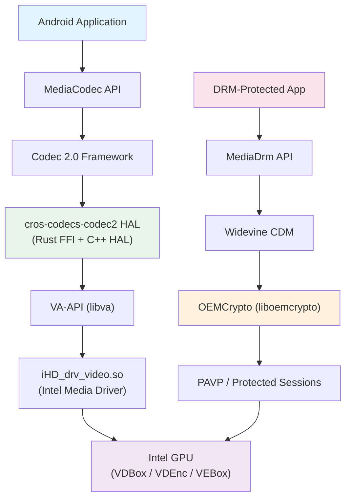
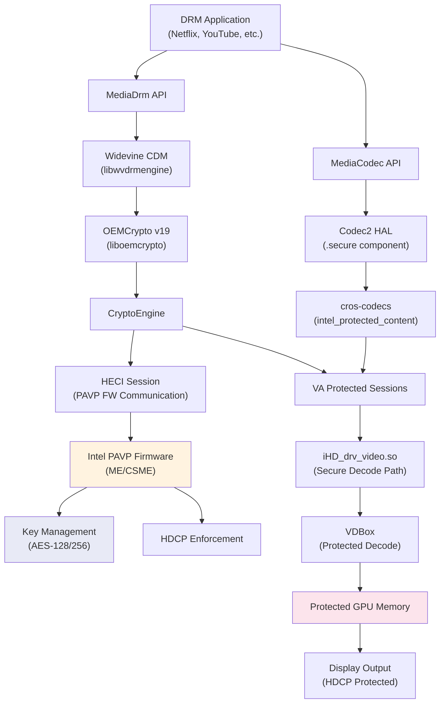
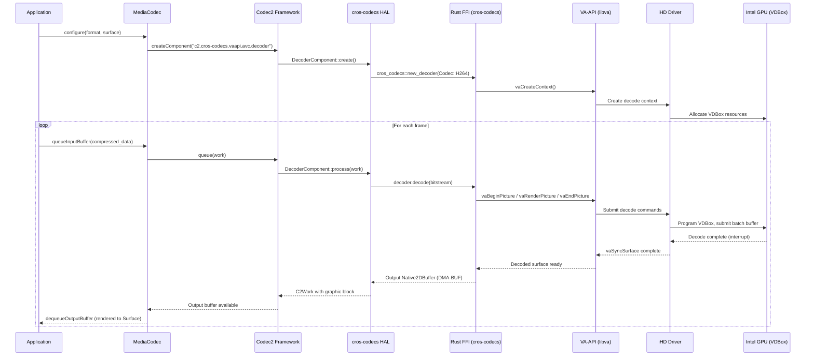
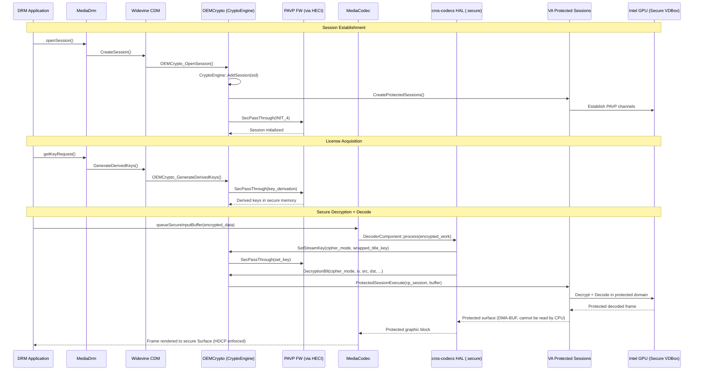

# Video, Media, and DRM/Widevine Implementation

## 1. Architecture Overview

The Android Desktop Platform video subsystem follows a layered architecture that bridges
Android's MediaCodec framework to Intel GPU hardware through VA-API. For DRM-protected
content, an additional PAVP (Protected Audio Video Path) channel secures the decryption
and decoding pipeline.



### Normal (Clear) Playback Path

1. Application sends compressed video bitstream via `MediaCodec`
2. Codec 2.0 framework dispatches to the `cros-codecs-codec2` vendor HAL service
3. The HAL invokes cros-codecs (Rust) through the CXX FFI bridge
4. cros-codecs calls VA-API (`libva`) to submit decode/encode jobs
5. VA-API dispatches to `iHD_drv_video.so` (Intel Media Driver)
6. iHD programs the GPU's VDBox (decode) or VDEnc (encode) fixed-function units
7. Decoded frames are returned as DMA-BUF backed graphic buffers

### Secure (DRM) Playback Path

1. Application negotiates a DRM session via `MediaDrm`
2. Widevine CDM processes the license and passes encrypted content to OEMCrypto
3. OEMCrypto uses VA Protected Sessions to communicate with Intel PAVP firmware via HECI
4. Encrypted bitstream is decrypted inside the GPU's secure domain
5. Decoded frames remain in protected memory; HDCP enforces output protection

---

## 2. Key Components

| Component | Path | Language | Purpose |
|-----------|------|----------|---------|
| Video aconfig flags | `vendor/google/desktop/video/flags.aconfig` | Aconfig | Feature flags for cros-codecs decoder/encoder HAL |
| Video aconfig lib | `vendor/google/desktop/video/Android.bp` | Soong | Build definitions for aconfig declarations |
| cros-codecs FFI | `vendor/google/desktop/video/cros-codecs-codec2/ffi/` | Rust | CXX bridge between cros-codecs Rust library and C++ HAL |
| cros-codecs HAL | `vendor/google/desktop/video/cros-codecs-codec2/hal/` | C++ | Codec 2.0 IComponentStore service backed by cros-codecs |
| Video Capability | `vendor/google/desktop/video/capability/` | Rust | Runtime video capability detection (VA-API or V4L2) |
| DRM Network Service | `vendor/google/desktop/video/drm-network/` | AIDL XML | IDrmNetworkService compatibility matrix |
| HW Security Cert Helper | `vendor/google/desktop/video/hwsec_cert_helper/` | C++ | GSC-based certificate provisioning for Widevine RoT/CIK |
| Intel Media Driver (iHD) | `vendor/intel/media-driver/` | C/C++ | VA-API user-mode driver for HW video decode/encode/VPP |
| OEMCrypto (Widevine) | `vendor/intel/widevine/oemcrypto/` | C++ | Intel implementation of Widevine OEMCrypto CENC API |
| Codec2 XML config | `device/google/desktop/fatcat/media_codecs_c2_fatcat.xml` | XML | Top-level codec configuration for fatcat |
| CrOS codecs XML | `device/google/desktop/fatcat/media_codecs_cros_codecs_codec2.xml` | XML | HW codec capabilities and measured frame rates |
| Secure codecs XML | `device/google/desktop/fatcat/media_codecs_cros_codecs_codec2_with_secure_codecs.xml` | XML | HW codec config including `.secure` decoder variants |
| SW codec overrides | `device/google/desktop/common/media_codecs_sw_overwrite_desktop.xml` | XML | Disables SW HEVC, adjusts SW decoder resolution limits |
| Performance XML | `device/google/desktop/fatcat/media_codecs_performance.xml` | XML | SW codec measured frame rates for CTS compliance |
| Media profiles | `device/google/desktop/fatcat/configs/media_profiles/` | XML | Per-SKU camcorder/encoder profile definitions |
| Performance XML generator | `vendor/google/desktop/video/tools/performance_xml_generator/` | Python/Shell | Tooling to generate measured frame rate XML from CTS logs |

---

## 3. Codec2 HAL - cros-codecs-codec2

### Overview

The `cros-codecs-codec2` component is a hardware video codec HAL that implements
Android's `android.hardware.media.c2.IComponentStore` AIDL interface. It is built
on top of the `cros-codecs` Rust library, originally from ChromeOS, ported to run
on Android Desktop with both VA-API (x86_64) and V4L2 (arm64) backends.

### Architecture

```
cros-codecs-codec2/
  ffi/                         # Rust FFI layer
    src/lib.rs                 # CXX bridge: Codec enum, init, new_decoder, new_encoder
    src/backend.rs             # Backend abstraction (real vs mock)
    src/backend/real/
      decoder.rs               # Real decoder implementation
      encoder.rs               # Real encoder implementation
      capabilities.rs          # HW capability queries
      client.rs                # VA-API / V4L2 client
      allocation.rs            # DMA-BUF buffer allocation
      decoder/vaapi.rs         # VA-API specific decoder backend
      decoder/v4l2.rs          # V4L2 specific decoder backend
      encoder/vaapi.rs         # VA-API specific encoder backend
      encoder/v4l2.rs          # V4L2 specific encoder backend
    src/backend/mock.rs        # Mock backend for testing
    include/CppTypes.h         # C++ type definitions for FFI
    Android.bp                 # Build: libcros_codecs_c2_ffi, libcros_codecs_c2_ffi_bridge
  hal/                         # C++ Codec 2.0 HAL
    vendor.cpp                 # Service entry point
    Store.cpp/h                # IComponentStore implementation
    DecoderComponent.cpp/h     # C2Component for decoding
    EncoderComponent.cpp/h     # C2Component for encoding
    DecoderInterfaceHelper.*   # Decoder parameter configuration
    EncoderInterfaceHelper.*   # Encoder parameter configuration
    CrosCodecsDecoderWork.*    # Decoder work queue management
    CrosCodecsEncoderWork.*    # Encoder work queue management
    C2BlockPoolNative2DBufferProvider.*   # Block pool buffer provider
    C2GraphicBlockNative2DBuffer.*        # Graphic block implementation
    DmaBufNative2DBufferPlane.*           # DMA-BUF plane management
    GraphicBufferAllocatorNative2DBufferProvider.*  # Gralloc buffer provider
    Utils.*                    # Utility functions
    Android.bp                 # Build: service binary, static lib, tests, seccomp
```

### FFI Bridge Design

The FFI is built with `cxx` crate bindings:

- **C++ static library** (`libcros_codecs_c2_ffi_bridge`): Generated C++ headers and sources
  from `cxxbridge`, wrapping the Rust static library
- **Rust FFI static lib** (`libcros_codecs_c2_ffi`): Implements the bridge, depends on
  `libcros_codecs`, `libvideo_capability`, `libcxx`
- **Architecture-specific features**:
  - x86_64: `vaapi` feature, links `libva`
  - arm64: `v4l2` feature, links `libv4l2r`
- **Vulkan image processing**: Optional feature controlled by `soong_config_set_bool`
  (`cros_codecs_vulkan_config.enable_vulkan_image_processing`)

### Supported Codecs via FFI

The Rust FFI defines the following codec enum:

```rust
enum Codec {
    H264,   // AVC
    H265,   // HEVC
    VP8,
    VP9,
    AV1,
}
```

### Service Configuration

The HAL runs as a vendor service:

```
service android-hardware-media-c2-cros-codecs-service /vendor/bin/hw/android.hardware.media.c2-cros-codecs-service
    class hal
    user mediacodec
    group camera mediadrm drmrpc
    ioprio rt 4
    task_profiles ProcessCapacityHigh
```

The VINTF manifest declares:
```xml
<hal format="aidl">
    <name>android.hardware.media.c2</name>
    <version>1</version>
    <fqname>IComponentStore/default</fqname>
</hal>
```

### Feature Flags

Two aconfig flags control the HAL activation:

| Flag | Namespace | Description |
|------|-----------|-------------|
| `cros_codecs_decoder_hal` | `desktop_video` | Controls whether to use cros-codecs HAL for HW video decode |
| `cros_codecs_encoder_hal` | `desktop_video` | Controls whether to use cros-codecs HAL for HW video encode |

---

## 4. Intel Media Driver - iHD

### Overview

The Intel Media Driver (`iHD_drv_video.so`) is a VA-API user-mode driver providing
hardware-accelerated video decoding, encoding, and video post-processing. It is built
from the open-source `media-driver` project (version 25.3.4) and compiled for Android
via Soong using an auto-generated `Android.bp` (produced by `ninja-to-soong`).

### Architecture

The driver has a dual-architecture internal structure:

| Layer | Description | Generations |
|-------|-------------|-------------|
| `media_driver/` (legacy) | Original HAL layer for older platforms | Gen8 (BDW) through Xe_M (DG2) |
| `media_softlet/` (next-gen) | Refactored modular architecture | Gen12+ through Xe3 (PTL) |
| `media_embargo/` | Proprietary content protection (CP/CENC) modules | Gen12+ through Xe3 |
| `media_softlet_embargo/` | Proprietary CP modules for softlet | Gen12+ |

### Key Hardware Components

The driver programs three main GPU fixed-function units:

- **VDBox** (Video Decode Box): Fully hardware-accelerated decode engine
- **VDEnc** (Video Dencode Engine) + **HuC** (Header Unit Codec): Low-power encode
- **VEBox/SFC** (Video Enhancement Box / Scalable Function Compute): Video processing
  (denoise, deinterlace, CSC, scaling, HDR tone mapping)

### Three Components

1. **Video Decoding**: Hardware-based decoder via VDBox
2. **Video Encoding**: Two modes:
   - VDEnc/HuC for low-power encoding (unified from MTL onwards)
   - PAK + shader (VME + media kernels) for legacy encoding
3. **Video Processing**: VEBox/SFC hardware + shader-based solutions for advanced features

---

## 5. GPU Generation Support

### Media Interface Registration

Each GPU generation has a dedicated `media_interfaces_*.cpp` that registers codec,
VP, and renderhal implementations. The Android build includes all generations in a
single `iHD_drv_video.so` binary:

| Generation | Codename(s) | media_interface | Architecture |
|------------|-------------|-----------------|--------------|
| Gen8 | BDW (Broadwell) | `media_interfaces_m8_bdw` | Legacy `media_driver` |
| Gen9 | SKL, KBL, CFL, BXT, GLK, CML | `media_interfaces_m9_*` | Legacy |
| Gen11 | ICL (Ice Lake), JSL, EHL | `media_interfaces_m11_*` | Legacy |
| Gen12 | TGL, RKL, ADL-S/P/N, DG1 | `media_interfaces_m12_*` | Legacy |
| Xe_M (DG2) | Alchemist / ATSM | `media_interfaces_dg2` | Legacy + Softlet |
| Xe_HP | XeHP SDV, PVC | `media_interfaces_xehp_sdv`, `media_interfaces_pvc` | Legacy + Softlet |
| Xe_LPM+ (MTL) | Meteor Lake, ARL | `media_interfaces_mtl`, `media_interfaces_arl` | Softlet |
| Xe2_LPM (LNL) | Lunar Lake | `media_interfaces_lnl` | Softlet |
| Xe2_HPM (BMG) | Battlemage | `media_interfaces_bmg` | Softlet |
| Xe3_LPM (PTL) | Panther Lake | `media_interfaces_ptl` | Softlet |

### Build-Time Platform Flags

The Android build enables all supported platforms via compiler defines:

```
-DIGFX_GEN8_BDW_SUPPORTED  -DIGFX_GEN9_SKL_SUPPORTED  -DIGFX_GEN9_KBL_SUPPORTED
-DIGFX_GEN9_BXT_SUPPORTED  -DIGFX_GEN9_CFL_SUPPORTED  -DIGFX_GEN9_GLK_SUPPORTED
-DIGFX_GEN9_CML_SUPPORTED  -DIGFX_GEN11_ICLLP_SUPPORTED  -DIGFX_GEN11_JSL_SUPPORTED
-DIGFX_GEN12_TGLLP_SUPPORTED  -DIGFX_GEN12_RKL_SUPPORTED  -DIGFX_GEN12_DG1_SUPPORTED
-DIGFX_GEN12_ADLP_SUPPORTED  -DIGFX_GEN12_ADLS_SUPPORTED  -DIGFX_GEN12_ADLN_SUPPORTED
-DIGFX_DG2_SUPPORTED  -DIGFX_XEHP_SDV_SUPPORTED  -DIGFX_XE_HPG_SUPPORTED
-DIGFX_MTL_SUPPORTED  -DIGFX_ARL_SUPPORTED  -DIGFX_LNL_SUPPORTED
-DIGFX_XE2_HPG_SUPPORTED  -DIGFX_PTL_SUPPORTED
```

### Codec Support by Generation (Fatcat / PTL Relevant)

For the fatcat platform (PTL - Panther Lake / Xe3), the iHD driver supports:

| Codec | Decode | Encode (VDEnc) | Max Resolution |
|-------|--------|----------------|----------------|
| AVC (H.264) | Yes | Yes | 4096x4096 |
| HEVC (H.265) 8/10/12-bit | Yes | Yes (8/10-bit) | 7680x4320 (8K) |
| HEVC 422/444 | Yes | Yes | 7680x4320 |
| VP8 | Yes | No | 4096x4096 |
| VP9 8/10/12-bit | Yes (decode only on PTL) | No (PTL) | 16384x16384 |
| AV1 8/10-bit | Yes | Yes | 16384x16384 |
| VVC 8/10-bit | No (PTL) | No | N/A |
| MPEG-2 | Yes | No | -- |
| JPEG | Yes | Yes | -- |

### Content Protection Support

The `media_embargo/` directory contains proprietary content protection (CP) modules
per generation:

- `cp_hal_gpu_g12.cpp`, `cp_hal_gpu_xe_lpm_plus.cpp`, `cp_hal_gpu_xe3_lpm.cpp`
- `cp_hal_gsc_*.cpp` - GSC (Graphics System Controller) integration
- `mhw_cp_*.cpp` - CP hardware command programming
- `cp_interface_ptl/` - PTL-specific CP registration
- PXP (Protected Xe Path) session management: `mos_pxp_sm.c`, `mos_pxp_sm_xe.c`

---

## 6. Widevine DRM

### Overview

Intel's Widevine implementation provides OEMCrypto CENC APIs that enable Level 1 (L1)
secure playback on Intel Desktop platforms. The implementation uses VA Protected Sessions
and PAVP firmware for hardware-level key management and decryption.

### OEMCrypto Version History

Three versions are maintained in the tree:

| Aspect | v16 | v17 | v19 |
|--------|-----|-----|-----|
| **Path** | `vendor/intel/widevine/oemcrypto/v16/` | `vendor/intel/widevine/oemcrypto/v17/` | `vendor/intel/widevine/oemcrypto/v19/` |
| **API Version** | 16 | 17 | 19 |
| **Minor API Version** | 4 | 4 | 4 |
| **Key ID Size Defines** | N/A | `WV_MAX_KEY_ID_SIZE 16` | `WV_MAX_KEY_ID_SIZE 16` |
| **AES Key Sizes** | N/A | AES128 (16) + AES256 (32) | AES128 (16) + AES256 (32) |
| **Max Buffer Size** | N/A | 32 KB | 32 KB |
| **Sandbox Support** | VTag struct (sandbox_idx, pid, thread_id) | Implicit | SetSandBoxIdx/GetSandBoxIdx API |
| **HDCP API** | Basic | Basic | GetHdcpRequiredVersion, GetCurrentHdcpVersion, EnableHdcp, TerminateHdcpPort |
| **Protected Sessions** | VA Protected Sessions | VA Protected Sessions | VA Protected Sessions (array of 10) |
| **IV Type** | N/A | N/A | `std::array<uint8_t, 16>` |
| **Source Files** | oemcrypto_engine.cc, oemcrypto_intel.cc, oemcrypto_intel_ext.cc | Same | Same |
| **Active in fatcat** | No | No | **Yes** (via `PRODUCT_SOONG_NAMESPACES`) |

### fatcat Configuration

From `fatcat_common.mk`:
```makefile
PRODUCT_SOONG_NAMESPACES += vendor/intel/widevine/oemcrypto/v19
```

### Build Configuration (All Versions Share Same Structure)

Each version builds `liboemcrypto` as a shared library:

```
cc_library_shared {
    name: "liboemcrypto",
    srcs: [
        "oemcrypto_engine.cc",
        "oemcrypto_intel.cc",
        "oemcrypto_intel_ext.cc",
        "//vendor/intel/widevine/oemcrypto:liboemcrypto_intel_utils",
    ],
    header_libs: ["libva_headers", "liboemcrypto_intel_headers"],
    shared_libs: ["libcrypto", "libdrm", "liblog", "libutils", "libva"],
    vendor: true,
    // x86_64 only
}
```

### CryptoEngine (v19) Architecture

The `CryptoEngine` class manages the core DRM operations:

```cpp
class CryptoEngine {
    // VA-API display and DRM file descriptor
    int drm_fd;
    VADisplay va_dpy;

    // PAVP communication
    VAProtectedSessionID heci_session_;       // HECI channel to PAVP FW
    VAProtectedSessionID cp_sessions_[10];    // Per-cipher-mode CP sessions
    std::mutex cp_session_locks_[10];         // Thread-safe CP session access

    // Session management
    ActiveSessions sessions_;                 // Map of OEMCrypto sessions

    // HDCP
    OEMCrypto_HDCP_Capability hdcp_version_;

    // Key operations
    bool SetStreamKey(OEMCryptoCipherMode cipher_mode, const WrappedTitleKey& wtk);
    bool DecryptionBlt(cipher_mode, iv, src, dst, data_length, clear_bytes, encrypt_bytes);

    // PAVP firmware communication
    bool SecPassThrough(void* pInput, uint32_t inSize, void* pOutput, uint32_t outSize);

    // VA-API protected session management
    bool CreateProtectedSessions();
    void DestroyProtectedSessions();
    VAStatus ProtectedSessionExecute(VAProtectedSessionID, VABufferID);
};
```

### PAVP (Protected Audio Video Path)

PAVP provides the hardware root of trust for Widevine. Key definitions from
`pavp_common_api_defs.h`:

| Definition | Value | Purpose |
|------------|-------|---------|
| `PAVP_HECI_BUFFER_SIZE` | 17 KB | HECI message buffer size |
| `PAVP_HECI_MAX_MSG_SIZE` | HECI buffer - 20 bytes | Maximum PAVP message payload |
| `PAVP_HECI_CLIENT_GUID` | `{0xfbf6fcf1, 0x96cf, ...}` | HECI client identifier for PAVP FW |

**PAVP Modes:**
- `PAVP_MODE_LITE` (1): Lightweight mode
- `PAVP_MODE_HEAVY` (2): Full protection mode
- `PAVP_MODE_ID` (3): Identification mode
- `PAVP_MODE_STOUT` (4): Strongest protection

**PAVP API Versions:**
- PAVP 1.5, 2.0, 3.0, 3.2 (legacy)
- PAVP 4.0, 4.1, 4.2, 4.3 (current - used by v17/v19)

**PAVP 4.2 Command IDs:**
- `PAVP_CMD_ID_42_INV_STREAM_KEY` (0x07): Invalidate a PAVP slot
- `PAVP_CMD_ID_42_GET_HANDLE` (0x10): Get DAL WYSIWYG handle
- `PAVP_CMD_ID_42_INIT_4` (0x1E): Initialize a PAVP slot
- `PAVP_CMD_ID_42_ENC_PLANE_ENABLES_4` (0x20): Encrypt PAVP memory mode
- `PAVP_CMD_ID_42_GET_CAPABILITIES` (0x28): Query PAVP capabilities
- `PAVP_CMD_ID_42_GET_TRUSTED_FW_VER` (0x29): Get signed FW version
- `PAVP_CMD_ID_42_GET_CERT_CHAIN` (0x2A): Get On-die CA certificate chain

### PAVP Command Helpers

The `pavp_helper.h` provides C++ template wrappers for PAVP commands:

- `Cmd_FF<api_ver, cmd, Input, Output>` - Fixed-size input, fixed-size output
- `Cmd_FV<api_ver, cmd, Input, Output>` - Fixed-size input, variable-size output
- `Cmd_VF<api_ver, cmd, Input, Output>` - Variable-size input, fixed-size output
- `Cmd_VV<api_ver, cmd, Input, Output>` - Variable-size input, variable-size output

Each template auto-fills the PAVP header (api_version, command_id, status, buffer_len).

### Common Utility Files

| File | Purpose |
|------|---------|
| `common/wv_utils.cc/h` | `RangeCheck()` for buffer validation |
| `common/oemcrypto_session.h` | `SessionContext` class: key storage, expiration tracking, cipher mode |
| `common/cp_crypto_common_defs.h` | Crypto constants (AES key sizes, SHA256 digest length) |
| `common/pavp_common_api_defs.h` | PAVP modes, versions, HECI definitions |
| `common/pavp_core_api.h` | PAVP 4.2 command IDs and structures |
| `common/pavp_status.h` | PAVP status/error codes |
| `common/pavp_helper.h` | C++ template command wrappers |
| `common/pavp_oem_policy_api.h` | OEM policy API definitions |
| `common/va_protected_content_private.h` | VA protected content private definitions |
| `common/libva_protected_content/` | libva protected content header exports |

---

## 7. DRM Network Service

The DRM Network Service provides network connectivity for DRM license acquisition.

### AIDL Interface

Defined via compatibility matrix at
`vendor/google/desktop/video/drm-network/com.android.desktop.drm_network.compat.xml`:

```xml
<compatibility-matrix type="device" version="1.0">
    <hal format="aidl" optional="true">
        <name>com.android.desktop.drm_network</name>
        <version>1</version>
        <interface>
            <name>IDrmNetworkService</name>
            <instance>default</instance>
        </interface>
    </hal>
</compatibility-matrix>
```

This is declared as **optional** (`optional="true"`), meaning the system can function
without this service present. The service enables DRM plugins (like Widevine) to
perform network operations (license requests, renewals) through a dedicated channel
that is separated from application-level networking.

---

## 8. Hardware Security Certificate Helper

### Purpose

The `hwsec_cert_helper` library provides certificate provisioning for Widevine by
communicating with the Google Security Chip (GSC) via the `android.system.desktop.security.gsc`
AIDL interface.

### API

```cpp
namespace hwsec_cert_helper {

enum class CertificateType { kWidevineRoT, kCIK };

// Returns the Boot Certificate Chain (empty string on failure)
std::string getBootCertificateChain();

// Fills Widevine Root of Trust cert, CIK cert, and Boot Certificate Chain
bool fillCertificates(std::vector<uint8_t>& rot,
                      std::vector<uint8_t>& cik,
                      std::string& bcc);
}
```

### GSC Client

The `GscClient` class provides a singleton interface to the GSC hardware:

```cpp
class GscClient {
    static GscClient* getInstance();
    std::vector<uint8_t> executeCommand(const std::vector<uint8_t>& cmd);
private:
    std::shared_ptr<aidl::android::system::desktop::security::gsc::IGsc> mGsc;
};
```

### Build Configuration

- **Library**: `libhwsec_cert_helper` (vendor shared library)
- **Dependencies**: `libbase`, `libbinder_ndk`, `libcrypto`, `android.system.desktop.security.gsc-V1-ndk`
- **Architecture**: arm64 only (disabled on x86_64)
- **Compatibility matrix**: `compatibility_matrix_gsc.xml`

---

## 9. Video Capability Reporting

### Purpose

The `libvideo_capability` Rust library provides runtime detection of hardware video
codec capabilities by querying the underlying acceleration backend (VA-API or V4L2).

### Build Configuration

```
rust_library {
    name: "libvideo_capability",
    crate_name: "video_capability",
    srcs: ["lib.rs"],
    defaults: ["video_capability_defaults"],
}
```

**Default dependencies**:
- `liblog_rust`, `libnix`, `libregex`, `libstrum`, `libxml_rust`, `libzerocopy`
- `libcros_codecs_test_common`
- Proc macros: `libstrum_macros`

**Architecture-specific:**
- x86_64: `vaapi` feature, depends on `libcros_libva`
- arm64: `v4l2` feature, depends on `libv4l2r`

### Tests

| Test | Type | Purpose |
|------|------|---------|
| `media_capabilities_unit_test` | Unit test | Tests capability detection logic |
| `DesktopMediaCodecCapabilitiesTestCases` | Device test (DTS) | End-to-end capability validation on hardware |

---

## 10. Media Codec Configuration

### Configuration Hierarchy

The fatcat platform's codec configuration is layered:

```
media_codecs_c2_fatcat.xml            (top-level, includes below)
  |-- media_codecs_sw_overwrite_desktop.xml  (SW codec overrides)
  |-- media_codecs_cros_codecs_codec2.xml    (HW codec definitions) [non-secure]
  |     OR
  |-- media_codecs_cros_codecs_codec2_with_secure_codecs.xml  [secure-enabled]
  |-- media_codecs_dax3.xml                  (DAX3 audio codec, included by reference)
  |-- VP8 encoder performance point override
```

The system property `ro.media.xml_variant.codecs=_c2_fatcat` selects the top-level config.

### Hardware Decoders (CrOS Codecs via VA-API)

| Codec Name | MIME Type | Min Size | Max Size | Max Concurrent | Secure Variant |
|-----------|-----------|----------|----------|----------------|----------------|
| `c2.cros-codecs.vaapi.av1.decoder` | `video/av01` | 128x128 | 16384x16384 | 8 | Yes (`.secure`) |
| `c2.cros-codecs.vaapi.avc.decoder` | `video/avc` | 128x128 | 4096x4096 | 8 | Yes (`.secure`) |
| `c2.cros-codecs.vaapi.hevc.decoder` | `video/hevc` | 128x128 | 7680x4320 | 8 | Yes (`.secure`) |
| `c2.cros-codecs.vaapi.vp8.decoder` | `video/x-vnd.on2.vp8` | 128x128 | 4096x4096 | 8 | No |
| `c2.cros-codecs.vaapi.vp9.decoder` | `video/x-vnd.on2.vp9` | 128x128 | 16384x16384 | 8 | Yes (`.secure`) |

All HW decoders support:
- `adaptive-playback` feature
- `dynamic-color-aspects` feature (non-secure config)
- Performance point: 3840x2160 @ 30fps

### Hardware Encoders (CrOS Codecs via VA-API)

| Codec Name | MIME Type | Min Size | Max Size | Max Concurrent | Max Bitrate |
|-----------|-----------|----------|----------|----------------|-------------|
| `c2.cros-codecs.vaapi.avc.encoder` | `video/avc` | 128x128 | 4096x4096 | 32 | 200 Mbps (non-secure) / 12 Mbps (secure) |
| `c2.cros-codecs.vaapi.vp9.encoder` | `video/x-vnd.on2.vp9` | 128x128 | 8192x8192 | 32 | 200 Mbps (non-secure) / 12 Mbps (secure) |
| `c2.cros-codecs.vaapi.av1.encoder` | `video/av01` | 128x128 | 8192x8192 | 32 | 200 Mbps (non-secure) / 12 Mbps (secure) |

All HW encoders have performance point: 1280x720 @ 30fps.

### Software Codec Overrides

The `media_codecs_sw_overwrite_desktop.xml` makes the following adjustments:

| Override | Effect |
|----------|--------|
| `c2.android.hevc.encoder` | **Disabled** (`enabled="false"`) |
| `c2.android.hevc.decoder` | **Disabled** (`enabled="false"`) |
| `c2.android.vp8.decoder` | Size limit raised to 4096x3072 (from 2x2 min) |
| `c2.android.vp9.decoder` | Size limit raised to 4096x3072 |
| `c2.android.av1.decoder` | Size limit raised to 4096x4096 |

Rationale: SW HEVC is disabled because the HW decoder handles HEVC. SW VP8/VP9/AV1
decoders retain higher resolution limits as software fallbacks.

### Additional Encoder Overrides (fatcat-specific)

In `media_codecs_c2_fatcat.xml`:
```xml
<MediaCodec name="c2.android.vp8.encoder" type="video/x-vnd.on2.vp8" update="true">
    <Limit name="performance-point-1280x720" range="30-30" />
</MediaCodec>
```

### Measured Frame Rates (Performance XML)

Software codec performance data for CTS compliance (representative values at 1080p):

| SW Codec | 320x240 fps | 720x480 fps | 1280x720 fps | 1920x1080 fps |
|----------|-------------|-------------|--------------|---------------|
| c2.android.avc.decoder | 1376 | 632 | 210 | 92 |
| c2.android.hevc.decoder | 1523 | 760 | 362 | 261 |
| c2.android.vp9.decoder | 1496 | -- | 391 | 243 |
| c2.android.av1.decoder | 833 | 374 | 176 | -- |
| c2.android.avc.encoder | 2260 | 1157 | 645 | 347 |
| c2.android.vp8.encoder | 2069 | -- | 171 | 75 |

---

## 11. Media Profiles

### Per-SKU Variants

Media profiles define camcorder recording capabilities per device SKU. The fatcat platform
provides **29 variants** across 7 SKU families:

| # | Variant Directory | Profile File | SKU Family |
|---|-------------------|--------------|------------|
| 1 | `fatcat_2` | `media_profiles_fatcat_2.xml` | fatcat |
| 2 | `fatcat_6` | `media_profiles_fatcat_6.xml` | fatcat |
| 3 | `fatcat4es_2` | `media_profiles_fatcat4es_2.xml` | fatcat4es |
| 4 | `fatcat4es_6` | `media_profiles_fatcat4es_6.xml` | fatcat4es |
| 5 | `fatcatish_2` | `media_profiles_fatcatish_2.xml` | fatcatish |
| 6 | `fatcatish4es_2` | `media_profiles_fatcatish4es_2.xml` | fatcatish4es |
| 7 | `fatcatite_2` | `media_profiles_fatcatite_2.xml` | fatcatite |
| 8 | `fatcatite_6` | `media_profiles_fatcatite_6.xml` | fatcatite |
| 9 | `fatcatite4es_2` | `media_profiles_fatcatite4es_2.xml` | fatcatite4es |
| 10 | `fatcatite4es_6` | `media_profiles_fatcatite4es_6.xml` | fatcatite4es |
| 11 | `fatcatnuvo_2` | `media_profiles_fatcatnuvo_2.xml` | fatcatnuvo |
| 12 | `fatcatnuvo_6` | `media_profiles_fatcatnuvo_6.xml` | fatcatnuvo |
| 13 | `fatcatnuvo4es_2` | `media_profiles_fatcatnuvo4es_2.xml` | fatcatnuvo4es |
| 14 | `fatcatnuvo4es_6` | `media_profiles_fatcatnuvo4es_6.xml` | fatcatnuvo4es |
| 15 | `felino_1` | `media_profiles_felino_1.xml` | felino |
| 16 | `felino_2147483647` | `media_profiles_felino_2147483647.xml` | felino |
| 17 | `felino4es_1` | `media_profiles_felino4es_1.xml` | felino4es |
| 18 | `felino4es_2147483647` | `media_profiles_felino4es_2147483647.xml` | felino4es |
| 19 | `francka_2147483647` | `media_profiles_francka_2147483647.xml` | francka |
| 20 | `francka_65536` | `media_profiles_francka_65536.xml` | francka |
| 21 | `francka_65537` | `media_profiles_francka_65537.xml` | francka |
| 22 | `francka_65538` | `media_profiles_francka_65538.xml` | francka |
| 23 | `francka_65539` | `media_profiles_francka_65539.xml` | francka |
| 24 | `francka_65540` | `media_profiles_francka_65540.xml` | francka |
| 25 | `francka_65541` | `media_profiles_francka_65541.xml` | francka |
| 26 | `francka_65542` | `media_profiles_francka_65542.xml` | francka |
| 27 | `francka_65543` | `media_profiles_francka_65543.xml` | francka |
| 28 | `kinmen_1` | `media_profiles_kinmen_1.xml` | kinmen |
| 29 | `kinmen_2147483647` | `media_profiles_kinmen_2147483647.xml` | kinmen |

The numeric suffix represents the camera device revision/variant ID. Values like
`2147483647` (0x7FFFFFFF) typically indicate a "default" or "catch-all" variant.

### SKU Families

| Family | Description |
|--------|-------------|
| **fatcat** | Primary PTL Desktop SKU |
| **fatcat4es** | PTL with 4 E-cores variant |
| **fatcatish** | PTL "ish" variant |
| **fatcatish4es** | PTL "ish" with 4 E-cores |
| **fatcatite** | PTL "ite" variant |
| **fatcatnuvo** | PTL "nuvo" variant |
| **felino** | Alternate PTL configuration |
| **francka** | Francka board variant (8 sub-variants for different camera configs) |
| **kinmen** | Kinmen board variant |

### Representative Profile Content

From `media_profiles_fatcat_2.xml`:

- **Camera 0 & 1**: Identical profiles
  - 720p: H.264 @ 8 Mbps, 30fps, AAC audio @ 96kbps
  - 1080p: H.264 @ 12 Mbps, 30fps, AAC audio @ 96kbps
  - Timelapse variants for both resolutions
  - JPEG encoding quality levels: 90, 80, 70
  - Image decoding memory cap: 20 MB

- **Video Encoder Capabilities**:
  - H.264: 64kbps - 17Mbps, 320x240 - 1920x1080, 15-30 fps
  - H.263: 64kbps - 1Mbps, 320x240 - 1920x1080, 15-30 fps
  - MPEG4: 64kbps - 2Mbps, 320x240 - 1920x1080, 15-30 fps

- **Audio Encoder Capabilities**:
  - AAC, HE-AAC, AAC-ELD, AMR-WB, AMR-NB

- **Decoder Capabilities**:
  - WMV: disabled
  - WMA: disabled

---

## 12. Secure Video Playback Flow



---

## 13. Data Flow - Normal Playback



---

## 14. Data Flow - Secure Playback



---

## 15. Build Integration

### PRODUCT_PACKAGES and Configuration

From `fatcat_common.mk`:

```makefile
# Codec configuration property
PRODUCT_PROPERTY_OVERRIDES += \
    ro.media.xml_variant.codecs=_c2_fatcat

# Install codec XML configurations
PRODUCT_COPY_FILES += \
    $(FATCAT_PATH)/media_codecs_c2_fatcat.xml:$(TARGET_COPY_OUT_VENDOR)/etc/media_codecs_c2_fatcat.xml \
    $(FATCAT_PATH)/media_codecs_performance.xml:$(TARGET_COPY_OUT_VENDOR)/etc/media_codecs_performance.xml

# Secure codecs (conditional)
PRODUCT_COPY_FILES += \
    $(FATCAT_PATH)/media_codecs_cros_codecs_codec2_with_secure_codecs.xml:$(TARGET_COPY_OUT_VENDOR)/etc/media_codecs_cros_codecs_codec2.xml
# OR (non-secure):
    $(FATCAT_PATH)/media_codecs_cros_codecs_codec2.xml:$(TARGET_COPY_OUT_VENDOR)/etc/media_codecs_cros_codecs_codec2.xml
```

### Soong Namespace Configuration

```makefile
# OEMCrypto v19 is the active Widevine implementation
PRODUCT_SOONG_NAMESPACES += vendor/intel/widevine/oemcrypto/v19

# Enable Intel protected content in cros-codecs
$(call soong_config_set, cros_codecs_config, protected_content, intel)
$(call soong_config_set_bool, cros_codecs_config, intel_protected_content, true)
```

### Key Build Modules

| Module | Type | Location |
|--------|------|----------|
| `android.hardware.media.c2-cros-codecs-service` | `cc_binary` (vendor) | HAL service binary |
| `android.hardware.media.c2-cros-codecs-lib` | `cc_library_static` | Core HAL implementation |
| `libcros_codecs_c2_ffi_bridge` | `cc_library_static` | CXX FFI bridge (C++ side) |
| `libcros_codecs_c2_ffi` | `rust_ffi_static` | CXX FFI bridge (Rust side) |
| `libvideo_capability` | `rust_library` | Video capability detection |
| `iHD_drv_video` | `cc_library_shared` | Intel Media Driver |
| `liboemcrypto` | `cc_library_shared` | Widevine OEMCrypto (v19) |
| `libhwsec_cert_helper` | `cc_library_shared` | HW security cert helper |
| `com.google.android.desktop.video-aconfig` | `aconfig_declarations` | Feature flag definitions |
| `com.google.android.desktop.video-aconfig-c-lib` | `cc_aconfig_library` | C++ aconfig library |

### v4l2_codec2 Dependency

The fatcat build also includes `external/v4l2_codec2` in `PRODUCT_PACKAGES`:
```makefile
external/v4l2_codec2 \
```
This provides a fallback V4L2-based Codec2 HAL, though the primary path on x86_64
fatcat uses the VA-API based cros-codecs HAL.

---

## 16. Inter-Subsystem Dependencies

### GPU Driver (xe/i915)

The video subsystem depends on the Intel GPU kernel mode driver:

- **iHD media driver** requires `/dev/dri/renderD128` (or similar DRM render node)
- **OEMCrypto** opens a DRM file descriptor (`drm_fd`) for VA display creation
- **Protected content** requires PXP (Protected Xe Path) kernel support:
  - `media_softlet/linux/common/os/xe/` - Xe KMD interface
  - `media_softlet/linux/common/os/i915/` - i915 legacy KMD interface
  - `media_embargo/.../cp_next/os/i915childpxp/mos_pxp_sm.c` - PXP session management (i915)
  - `media_embargo/.../cp_next/os/xe_pxp/mos_pxp_sm_xe.c` - PXP session management (Xe)

### Trusty / GSC

- **HW Security Cert Helper** communicates with GSC via `android.system.desktop.security.gsc` AIDL
- Certificate provisioning (Widevine RoT, CIK) flows through GSC hardware
- `compatibility_matrix_gsc.xml` declares the GSC HAL requirement

### hal_config.xml

The HAL configuration file declares which hardware services are available. Video-related
entries include:
- `android.hardware.media.c2` (Codec2 HAL)
- Media driver libraries and capabilities

### Display / HDCP

- OEMCrypto v19 manages HDCP versions via `GetCurrentHdcpVersion()` / `EnableHdcp()`
- The display subsystem must support HDCP for L1 secure playback
- `TerminateHdcpPort()` is called during session cleanup

---

## 17. SEPolicy

The video/media/DRM subsystems have the following SELinux policies:

### mediacodec.te

```
allow mediacodec graphics_device:dir search;
allow mediacodec hal_graphics_allocator_default_tmpfs:file { read write };
allow mediacodec logd:unix_stream_socket connectto;
allow mediacodec logdr_socket:sock_file write;
allow mediacodec sysfs_gpu:dir { search open read };
```

Grants the `mediacodec` domain access to:
- GPU device nodes (for DMA-BUF allocation)
- Graphics allocator shared memory
- System logging
- GPU sysfs information (capability queries)

### mediaswcodec.te

```
allow mediaswcodec hal_graphics_allocator_default_tmpfs:file { read write };
```

Software codec process needs access to graphics allocator temporary files for
buffer sharing.

### mediaserver.te

```
gpu_access(mediaserver)
allow mediaserver hal_graphics_allocator_default_tmpfs:file { read write map };
```

Mediaserver gets full GPU access via the `gpu_access()` macro (which grants access
to render nodes, DRM devices, etc.) plus graphics allocator tmpfs access with map
permission for efficient zero-copy buffer sharing.

---

## 18. Testing

### Unit Tests

| Test Module | Type | Purpose |
|-------------|------|---------|
| `media_capabilities_unit_test` | `rust_test` (unit) | Video capability detection logic |
| `DesktopMediaCodecCapabilitiesTestCases` | `rust_test` (DTS) | On-device codec capability validation |
| `android.hardware.media.c2-cros-codecs-lib-test` | `cc_test` (device) | HAL unit tests (decoder work, store) |
| `hwsec_cert_helper_test` | `cc_test` | HW security certificate helper tests |

### Performance XML Generator

Located at `vendor/google/desktop/video/tools/performance_xml_generator/`:

| Tool | Purpose |
|------|---------|
| `generate_xml.sh` | Orchestrates measured frame rate XML generation |
| `get_log_data.py` | Extracts performance data from CTS/benchmark logs |
| `get_perf_per_model.py` | Aggregates performance data per device model |

These tools process CTS MediaCodec benchmark results to produce the
`media_codecs_performance.xml` file with measured frame rate ranges.

### CTS Compliance

The measured frame rate values in the XML configs serve CTS validation:
- Values include statistical metadata (N=sample count, v90%/v97%=variation at percentile)
- FLAKY annotations indicate high variance results
- Ranges are intentionally wide to accommodate variation across device SKUs

### Running Tests

```bash
# HAL unit tests
atest android.hardware.media.c2-cros-codecs-lib-test

# Capability tests (requires root)
atest DesktopMediaCodecCapabilitiesTestCases

# HW security tests (requires root)
atest hwsec_cert_helper_test
```

---

## 19. Key Files Reference

| File | Absolute Path | Purpose |
|------|---------------|---------|
| Video flags | `vendor/google/desktop/video/flags.aconfig` | cros_codecs_decoder_hal, cros_codecs_encoder_hal |
| Video build | `vendor/google/desktop/video/Android.bp` | Aconfig declarations and C++ aconfig library |
| FFI bridge build | `vendor/google/desktop/video/cros-codecs-codec2/ffi/Android.bp` | Rust FFI static lib and CXX bridge generation |
| FFI lib.rs | `vendor/google/desktop/video/cros-codecs-codec2/ffi/src/lib.rs` | CXX bridge definition (Codec enum, init, new_decoder/encoder) |
| HAL build | `vendor/google/desktop/video/cros-codecs-codec2/hal/Android.bp` | HAL service, static lib, tests, seccomp policy |
| HAL service entry | `vendor/google/desktop/video/cros-codecs-codec2/hal/vendor.cpp` | Service main() |
| HAL init.rc | `vendor/google/desktop/video/cros-codecs-codec2/hal/android.hardware.media.c2-cros-codecs-service.rc` | Service definition |
| HAL VINTF | `vendor/google/desktop/video/cros-codecs-codec2/hal/manifest_media_c2_cros_codecs.xml` | AIDL IComponentStore declaration |
| Decoder component | `vendor/google/desktop/video/cros-codecs-codec2/hal/DecoderComponent.cpp` | C2Component implementation for decoding |
| Encoder component | `vendor/google/desktop/video/cros-codecs-codec2/hal/EncoderComponent.cpp` | C2Component implementation for encoding |
| Store | `vendor/google/desktop/video/cros-codecs-codec2/hal/Store.cpp` | IComponentStore: codec enumeration and instantiation |
| Video capability | `vendor/google/desktop/video/capability/Android.bp` | libvideo_capability build (Rust, VA-API/V4L2) |
| DRM network compat | `vendor/google/desktop/video/drm-network/com.android.desktop.drm_network.compat.xml` | IDrmNetworkService compatibility matrix |
| HW cert helper | `vendor/google/desktop/video/hwsec_cert_helper/Android.bp` | libhwsec_cert_helper build |
| HW cert API | `vendor/google/desktop/video/hwsec_cert_helper/hwsec_cert_helper.h` | fillCertificates(), getBootCertificateChain() |
| GSC client | `vendor/google/desktop/video/hwsec_cert_helper/gsc_client.h` | GscClient singleton for GSC communication |
| iHD driver build | `vendor/intel/media-driver/Android.bp` | iHD_drv_video.so (auto-generated Soong) |
| iHD CMakeLists | `vendor/intel/media-driver/CMakeLists.txt` | Upstream CMake build (v25.3.4) |
| iHD README | `vendor/intel/media-driver/README.md` | Platform support, codec/VPP feature matrices |
| OEMCrypto common | `vendor/intel/widevine/oemcrypto/Android.bp` | Shared headers and utils |
| OEMCrypto v19 | `vendor/intel/widevine/oemcrypto/v19/Android.bp` | liboemcrypto build (active for fatcat) |
| OEMCrypto v17 | `vendor/intel/widevine/oemcrypto/v17/Android.bp` | liboemcrypto build (legacy) |
| OEMCrypto v16 | `vendor/intel/widevine/oemcrypto/v16/Android.bp` | liboemcrypto build (legacy) |
| Engine v19 header | `vendor/intel/widevine/oemcrypto/v19/oemcrypto_engine.h` | CryptoEngine class (HDCP, VA sessions, PAVP) |
| Session context | `vendor/intel/widevine/oemcrypto/common/oemcrypto_session.h` | SessionContext: keys, cipher mode, expiration |
| PAVP defs | `vendor/intel/widevine/oemcrypto/common/pavp_common_api_defs.h` | PAVP modes, versions, HECI definitions |
| PAVP core API | `vendor/intel/widevine/oemcrypto/common/pavp_core_api.h` | PAVP 4.2 command IDs |
| PAVP status | `vendor/intel/widevine/oemcrypto/common/pavp_status.h` | PAVP error/status codes |
| PAVP helper | `vendor/intel/widevine/oemcrypto/common/pavp_helper.h` | C++ template command wrappers |
| WV utils | `vendor/intel/widevine/oemcrypto/common/wv_utils.h` | Buffer range validation |
| Codec config | `device/google/desktop/fatcat/media_codecs_c2_fatcat.xml` | Top-level codec config |
| CrOS codecs XML | `device/google/desktop/fatcat/media_codecs_cros_codecs_codec2.xml` | HW codec definitions (non-secure) |
| Secure codecs XML | `device/google/desktop/fatcat/media_codecs_cros_codecs_codec2_with_secure_codecs.xml` | HW codec definitions (with .secure variants) |
| SW overrides | `device/google/desktop/common/media_codecs_sw_overwrite_desktop.xml` | SW codec disables and resolution adjustments |
| Performance XML | `device/google/desktop/fatcat/media_codecs_performance.xml` | SW codec measured frame rates |
| Media profiles dir | `device/google/desktop/fatcat/configs/media_profiles/` | 29 per-SKU media profile variants |
| fatcat_common.mk | `device/google/desktop/fatcat/fatcat_common.mk` | Build integration (packages, soong namespaces) |
| Perf XML tools | `vendor/google/desktop/video/tools/performance_xml_generator/` | Performance data extraction scripts |
| SEPolicy mediacodec | `device/google/desktop/common/sepolicy/mediacodec.te` | GPU access for mediacodec domain |
| SEPolicy mediaswcodec | `device/google/desktop/common/sepolicy/mediaswcodec.te` | Allocator access for SW codecs |
| SEPolicy mediaserver | `device/google/desktop/common/sepolicy/mediaserver.te` | GPU + allocator access for mediaserver |
