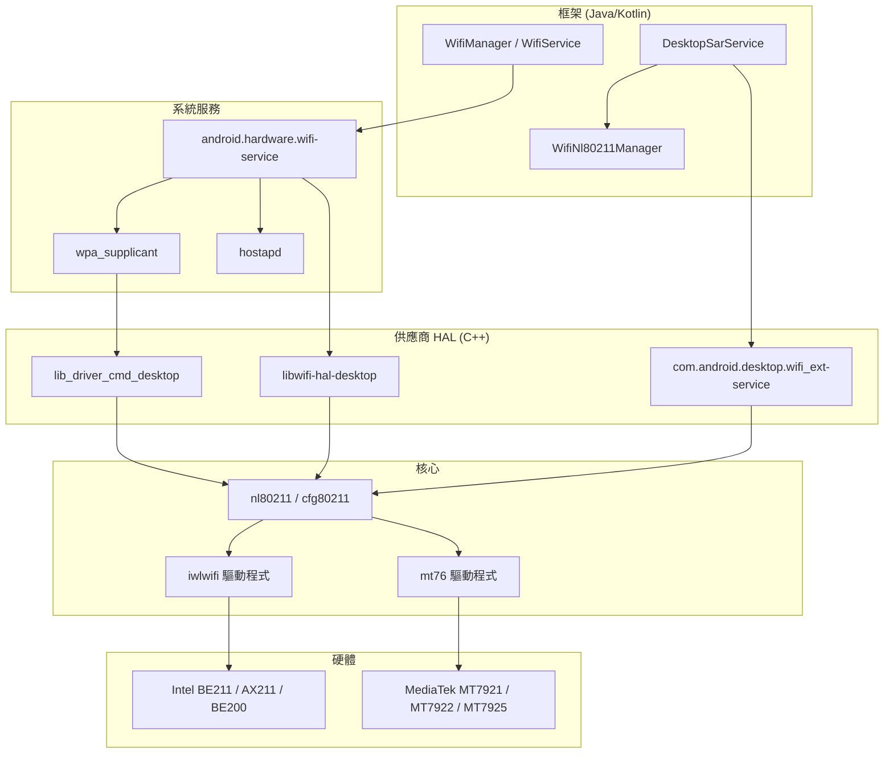
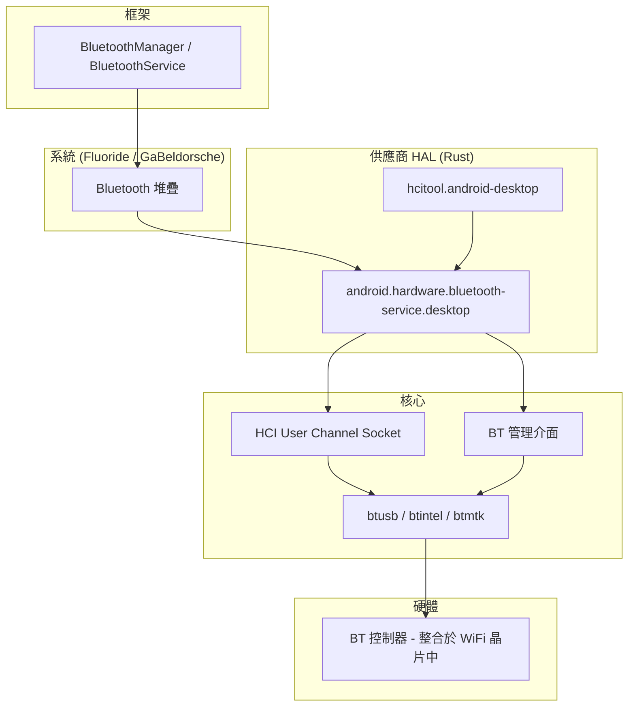
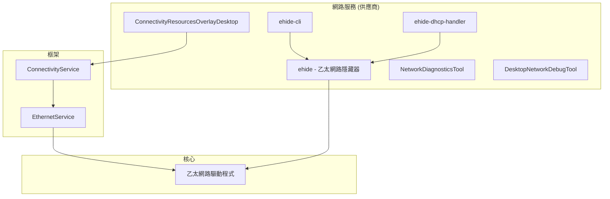
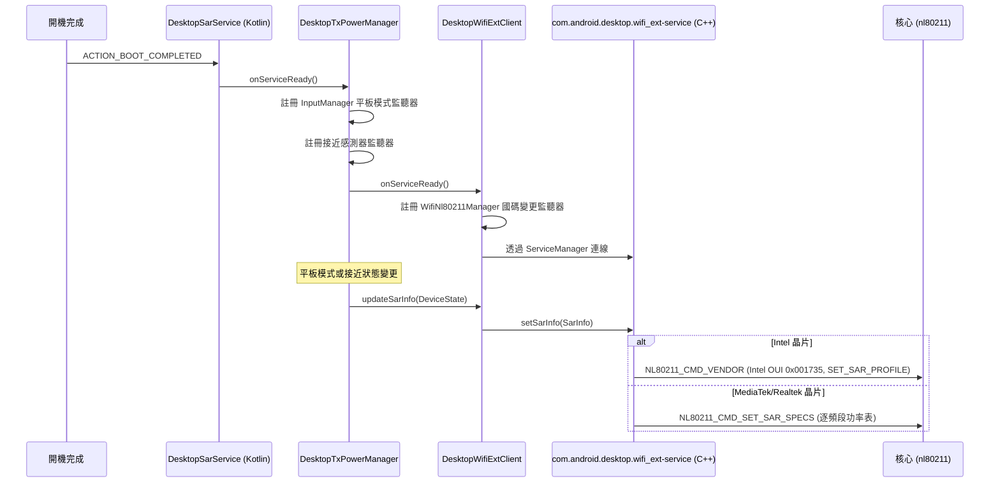
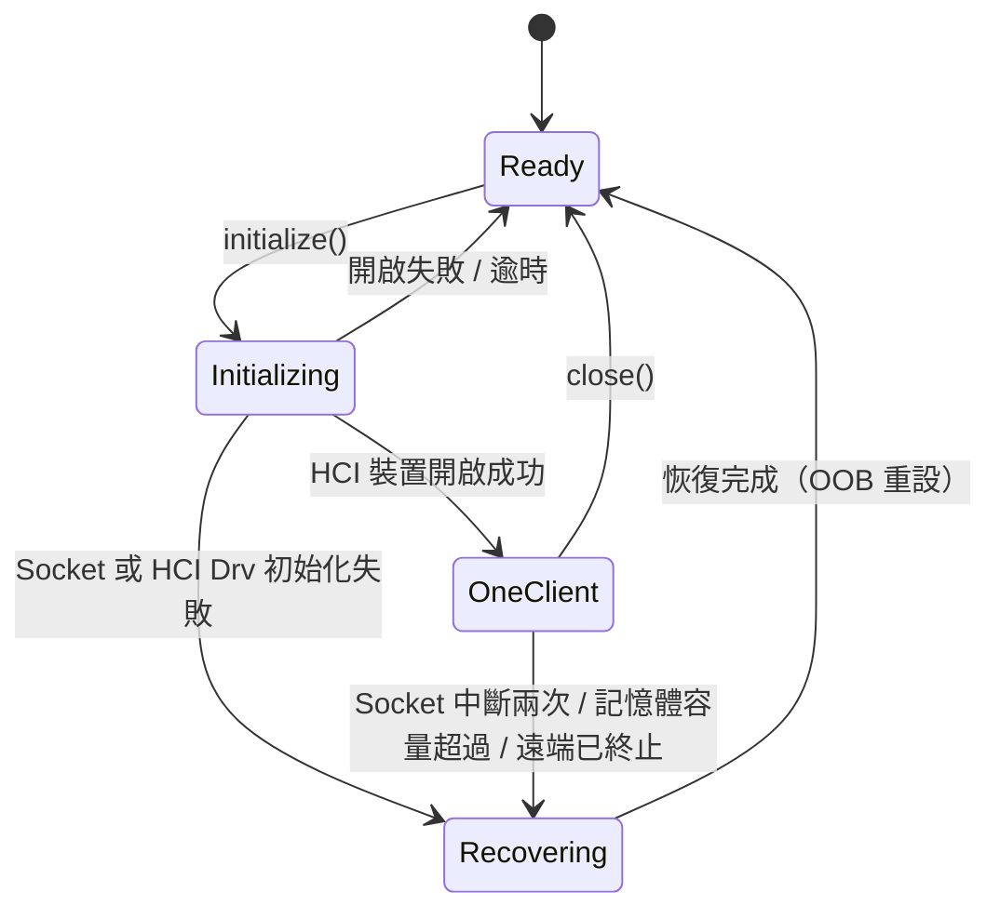
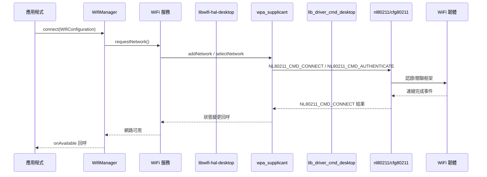
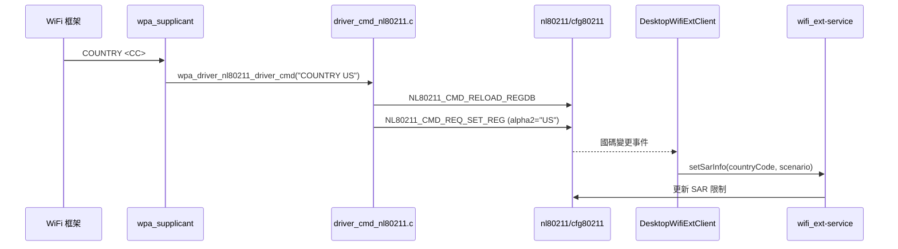
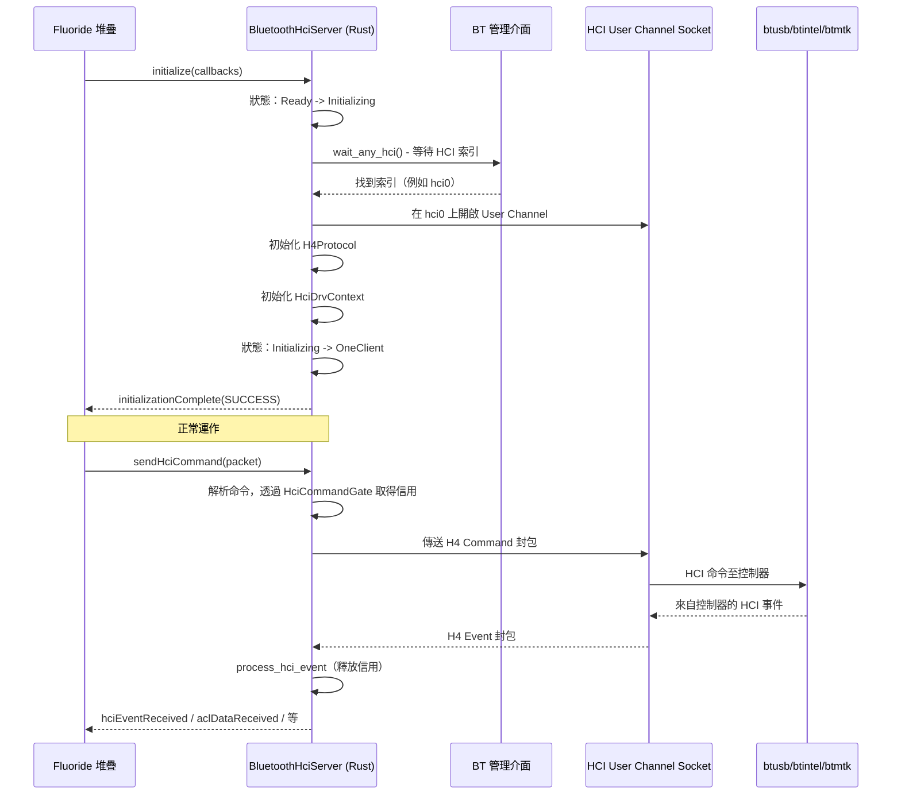
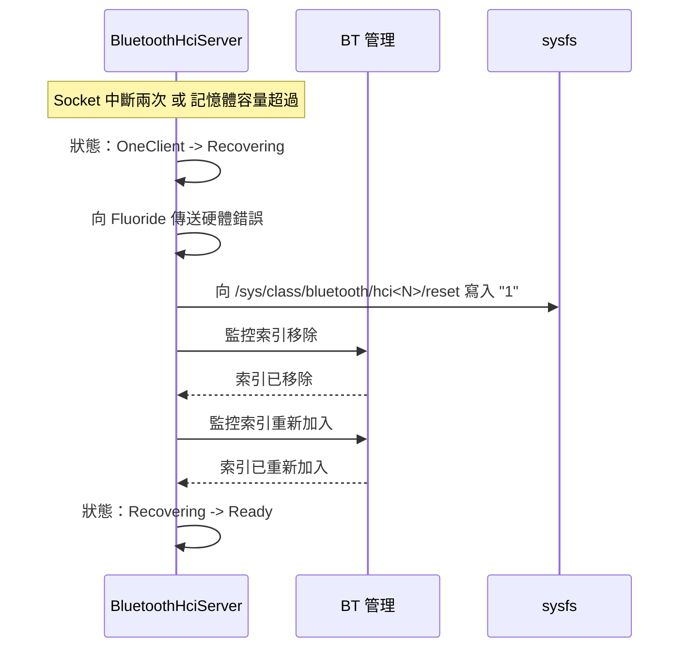
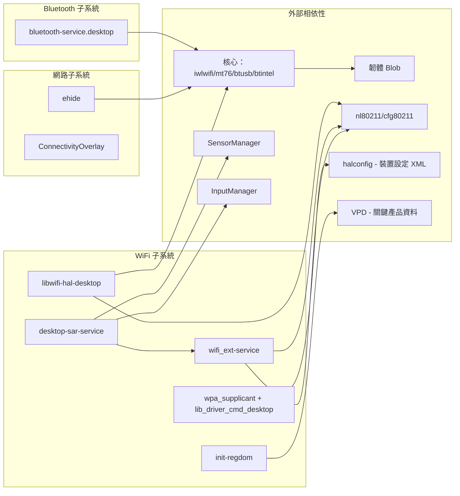

# WiFi、Bluetooth 及連線功能實作

## 1. 架構概觀

Android 桌面平台實作了完整的連線堆疊，涵蓋 WiFi、Bluetooth 及乙太網路子系統。此架構遵循標準的 Android HAL 模型，並針對 x86 硬體多樣性（Intel 及 MediaTek 晶片組）進行桌面專屬的客製化，包含筆記型電腦/平板外型規格的 SAR（特定吸收率）合規性，以及用於開發工作流程的乙太網路隱藏機制（ehide）。

### WiFi 堆疊



### Bluetooth 堆疊



### 乙太網路 / 網路服務



---

## 2. 主要元件

| 元件 | 類型 | 語言 | 位置 | 用途 |
|------|------|------|------|------|
| `libwifi-hal-desktop` | 靜態函式庫 (C++) | C++ | `vendor/google/desktop/wifi/hal/` | WiFi HAL - 供應商偵測、介面管理、NL80211 通訊 |
| `com.android.desktop.wifi_ext-service` | AIDL 服務 (C++) | C++ | `vendor/google/desktop/wifi/wifi_ext/src/` | WiFi 擴充功能 - 透過 NL80211 進行 SAR 功率控制 |
| `desktop-sar-service` | Android 應用程式 (Kotlin) | Kotlin | `vendor/google/desktop/wifi/sar/service/` | SAR 協調器 - 監控平板模式、接近感測器、國碼 |
| `lib_driver_cmd_desktop` | 靜態函式庫 (C) | C | `vendor/google/desktop/wifi/wpa_supplicant_8_lib/` | WPA supplicant 驅動程式命令介面 |
| `init-regdom` | Shell 執行檔 | Shell | `vendor/google/desktop/wifi/sar/` | 從 VPD 初始化法規領域 |
| `android.hardware.bluetooth-service.desktop` | AIDL 服務 (Rust) | Rust | `vendor/google/desktop/bluetooth/hci_hal/` | Bluetooth HCI HAL - User Channel socket、恢復機制、命令閘控 |
| `hcitool.android-desktop` | CLI 工具 (Rust) | Rust | `vendor/google/desktop/bluetooth/hci_hal/` | Bluetooth HCI 除錯/診斷工具 |
| `ehide` | 服務 (Rust) | Rust | `vendor/google/desktop/network/ehide/` | 對 Android 隱藏乙太網路介面，同時保留 ADB-over-TCP |
| `netlink-utils-desktop` | Java 函式庫 | Java | `vendor/google/desktop/network/netlink-utils/` | Netlink 訊息解析公用程式 |
| `ConnectivityResourcesOverlayDesktop` | RRO | XML | `vendor/google/desktop/network/ConnectivityResourcesOverlayDesktop/` | ehide 介面的連線資源覆蓋層 |
| `DesktopNetworkDebugTool` | Android 應用程式 (Kotlin) | Kotlin | `vendor/google/desktop/network/DesktopNetworkDebugTool/` | 具有 ADB shell 整合的網路除錯工具 |
| `NetworkDiagnosticsTool` | Java 函式庫 (Kotlin) | Kotlin | `vendor/google/desktop/network/NetworkDiagnosticsTool/` | 網路診斷（DNS、ICMP、HTTP/HTTPS 探測） |

---

## 3. WiFi HAL 實作

### 模組：`libwifi-hal-desktop`

**建置定義：** `vendor/google/desktop/wifi/hal/Android.bp`

```
cc_library_static {
    name: "libwifi-hal-desktop",
    vendor: true,
    defaults: ["libwifi_hal_cflags_defaults"],
    srcs: [
        "common.cpp",
        "cpp_bindings.cpp",
        "interface_combinations.cpp",
        "interface_configuration.cpp",
        "wifi_hal_desktop.cpp",
    ],
    shared_libs: ["libcutils", "liblog", "libnl"],
}
```

### 原始碼檔案及職責

| 檔案 | 用途 |
|------|------|
| `wifi_hal_desktop.cpp` | HAL 主要進入點：初始化、事件迴圈、介面管理、供應商偵測、功能集查詢 |
| `common.cpp` | 控制代碼轉換公用程式、主要 `wlan0` 介面查詢 |
| `common.h` | 核心資料結構：`HalInfo`、`InterfaceInfo`、`WifiVendor` 列舉 |
| `cpp_bindings.cpp` / `.h` | NL80211 命令/回應包裝器（`WifiCommand`、`WifiRequest`、`WifiEvent`） |
| `interface_combinations.cpp` / `.h` | NL80211 介面組合矩陣解析 |
| `interface_configuration.cpp` / `.h` | 透過 NL80211 建立/刪除虛擬介面 |

### 供應商偵測

HAL 在初始化時透過讀取 `/sys/class/net/<iface>/device/vendor` 動態偵測 WiFi 供應商：

```cpp
static const std::map<unsigned int, WifiVendor> kVendorMap = {
    {0x8086, WIFI_VENDOR_INTEL},
    {0x17cb, WIFI_VENDOR_QUALCOMM},
    {0x168c, WIFI_VENDOR_QUALCOMM},
    {0x14c3, WIFI_VENDOR_MTK},
    {0x10ec, WIFI_VENDOR_REALTEK},
};
```

### 支援的 HAL 函式表

HAL 透過 `init_wifi_vendor_hal_func_table()` 註冊以下函式：

| 函式 | 說明 |
|------|------|
| `wifi_initialize` | 初始化 HAL、建立 NL socket、偵測介面、偵測供應商 |
| `wifi_cleanup` | 清理虛擬介面、釋放 NL socket、結束事件迴圈 |
| `wifi_event_loop` | NL 事件 socket 和清理 socket 上的主要輪詢迴圈 |
| `wifi_get_ifaces` | 回傳偵測到的 WiFi 介面控制代碼陣列 |
| `wifi_get_iface_name` | 從控制代碼回傳介面名稱 |
| `wifi_trigger_subsystem_restart` | 供應商專屬重啟（Intel：觸發核心傾印） |
| `wifi_get_supported_iface_concurrency_matrix` | 回傳從 NL80211 衍生的並行矩陣 |
| `wifi_virtual_interface_create` | 透過 NL80211 建立虛擬介面（STA、AP、P2P、NAN） |
| `wifi_virtual_interface_delete` | 透過 NL80211 刪除虛擬介面 |
| `wifi_set_country_code` | 透過 NL80211 設定法規國碼 |
| `wifi_get_supported_feature_set` | 查詢 NL80211 擴充功能（例如 DYNAMIC_SET_MAC） |
| `wifi_get_driver_version` | 回傳帶有供應商前綴的驅動程式版本字串 |
| `wifi_get_firmware_version` | 回傳帶有供應商前綴的韌體版本字串 |
| `wifi_set_subsystem_restart_handler` | 註冊子系統重啟事件的回呼函式 |

### 介面探索

WiFi 介面透過掃描 `/sys/class/net/` 並依前綴過濾來探索：

- `wlan*` - Station 介面
- `swlan*` - 軟體建立的 WLAN 介面
- `p2p*` - Wi-Fi Direct (P2P) 介面
- `aware*` - Wi-Fi Aware (NAN) 介面

### 虛擬介面管理

最多可建立 6 個虛擬介面（`MAX_VIRTUAL_IFACES`）。建立時使用 `NL80211_CMD_NEW_INTERFACE` 搭配適當的 `NL80211_IFTYPE_*` 類型。介面在 `activeVirtualIfaces` 中追蹤，並在 HAL 卸載時自動清理。

### 介面組合矩陣

HAL 在初始化時從核心驅動程式查詢 `NL80211_ATTR_INTERFACE_COMBINATIONS`，以確定實際的並行能力。這種動態方式取代了靜態佔位定義：

- 解析 `NL80211_IFACE_COMB_LIMITS`、`NL80211_IFACE_COMB_MAXNUM` 及 `NL80211_IFACE_COMB_NUM_CHANNELS`
- 將 NL80211 介面類型（STATION、AP、P2P_GO、P2P_CLIENT、NAN）對應至 WiFi HAL 類型
- 目前過濾組合為 `numberOfChannels >= 2`（具 DBS 能力），以防止錯誤的 MCC 假設

### Intel 專屬：子系統重啟

對於 Intel WiFi 晶片，`wifi_trigger_subsystem_restart()` 會向 sysfs 核心傾印路徑（`/sys/class/net/<iface>/device/coredump`）寫入 `"1"` 以觸發韌體傾印和重設。

---

## 4. WiFi SAR（特定吸收率）控制

SAR 子系統根據裝置模式（翻蓋式 vs. 平板）及地理區域，確保 WiFi TX 功率限制符合法規要求。

### 架構



### 元件

#### 1. `desktop-sar-service`（Kotlin Android 應用程式）

**位置：** `vendor/google/desktop/wifi/sar/service/`

**Manifest：** 持久性應用程式，具有 `RECEIVE_BOOT_COMPLETED` 及 `TABLET_MODE` 權限。僅以系統使用者身分執行。

**主要類別：**

- **`BootCompletedReceiver`** - 在開機時若 `enabled_dynamic_sar` 旗標已設定，則啟動 `DesktopSarService`
- **`DesktopSarService`** - 管理 SAR 生命週期的 Android 服務，同時公開測試用 `Messenger` 介面
- **`DesktopTxPowerManager`** - 透過以下方式監控裝置狀態：
  - `InputManager.OnTabletModeChangedListener` 用於翻蓋/平板模式
  - `SensorEventListener` 用於 `TYPE_LOW_LATENCY_OFFBODY_DETECT` 接近感測器
- **`DesktopWifiExtClient`** - 連接至 `IDesktopWifiExt` 服務的 AIDL 客戶端；透過 `WifiNl80211Manager.CountryCodeChangedListener` 監控國碼變更

**裝置狀態判定：**

| 接近狀態 | 裝置模式 | SAR 情境 |
|----------|----------|----------|
| 離體 | 翻蓋式 | `CLAMSHELL` |
| 貼體 | 翻蓋式 | `TABLET_MODE` |
| 離體 | 平板模式 | `TABLET_MODE` |
| 貼體 | 平板模式 | `TABLET_MODE` |

僅「離體 + 翻蓋式」組合會產生 `CLAMSHELL` 模式；其他所有情況基於安全考量均使用 `TABLET_MODE`。

#### 2. `com.android.desktop.wifi_ext-service`（C++ AIDL 服務）

**位置：** `vendor/google/desktop/wifi/wifi_ext/src/`

**Init RC：** 以使用者 `wifi`、群組 `wifi gps system` 執行，具有 `NET_ADMIN` 及 `NET_RAW` 能力。

**AIDL 介面（`IDesktopWifiExt`）：**

```
oneway interface IDesktopWifiExt {
    void setSarInfo(in SarInfo info);
    void registerSarCallback(in IDesktopWifiExtSarCallback callback);
}
```

**AIDL 資料類型：**

- `SarInfo` - 包含 `countryCode`（ISO 3166-1 alpha-2）及 `scenario`（`SarScenario`）
- `SarScenario` - 列舉：`CLAMSHELL = 0`、`TABLET_MODE = 1`
- `Status` - 列舉：`SUCCESS = 0`、`FAILURE = 1`、`MISSING_CONFIG = 2`、`INVALID_CONFIG = 3`

**供應商專屬 SAR 實作：**

| 供應商 | 方法 | 詳細說明 |
|--------|------|----------|
| Intel | `NL80211_CMD_VENDOR` | 使用 Intel OUI `0x001735`，供應商命令 `IWL_MVM_VENDOR_CMD_SET_SAR_PROFILE` (28)。為鏈路 A 和 B 在平板設定檔索引 1 和翻蓋設定檔索引 2 之間選擇。 |
| MediaTek / Realtek | `NL80211_CMD_SET_SAR_SPECS` | 從 `halconfig`（裝置專屬 XML 設定）讀取逐頻段功率表。支援 14 個頻段（2g、5g 子頻段 1-5、6g 子頻段 1-6）。在傳送前套用法規領域偏移量（EU/FCC/其他）。 |

**法規領域偵測：** 透過 `NL80211_CMD_GET_REG` 查詢核心以取得作用中的國碼和 DFS 區域，將 `NL80211_DFS_ETSI` 對應至 EU、`NL80211_DFS_FCC` 對應至 FCC，其餘皆對應至其他。

### 功能旗標

動態 SAR 功能由 `enabled_dynamic_sar` 旗標控制：

```
package: "com.android.desktop.sar.flags"
container: "system_ext"
flag {
    name: "enabled_dynamic_sar"
    namespace: "desktop_connectivity"
}
```

此旗標同時控制原生 C++ 服務（透過 `com_android_desktop_sar_flags.h`）和 Kotlin SAR 服務（透過 `Flags.enabledDynamicSar()`）。

---

## 5. WiFi 擴充功能（wifi_ext）

### AIDL 介面定義

**位置：** `vendor/google/desktop/wifi/wifi_ext/`

`com.android.desktop.wifi_ext` AIDL 介面是具有版本 1（已凍結）的 VINTF 穩定介面：

```
aidl_interface {
    name: "com.android.desktop.wifi_ext",
    stability: "vintf",
    soc_specific: true,
    frozen: true,
    versions_with_info: [{ version: "1" }],
}
```

**啟用的後端：** Java、NDK。停用：C++、Rust。

### VINTF Manifest

```xml
<manifest version="1.0" type="device">
    <hal format="aidl">
        <name>com.android.desktop.wifi_ext</name>
        <fqname>IDesktopWifiExt/default</fqname>
        <version>1</version>
    </hal>
</manifest>
```

### 相容性矩陣

框架預期此 HAL 存在：

```xml
<compatibility-matrix version="1.0" type="framework">
    <hal format="aidl">
        <name>com.android.desktop.wifi_ext</name>
        <interface>
          <name>IDesktopWifiExt</name>
          <instance>default</instance>
       </interface>
    </hal>
</compatibility-matrix>
```

---

## 6. WPA Supplicant 整合

### 模組：`lib_driver_cmd_desktop`

**建置定義：** `vendor/google/desktop/wifi/wpa_supplicant_8_lib/Android.bp`

```
cc_library_static {
    name: "lib_driver_cmd_desktop",
    vendor: true,
    cflags: ["-DCONFIG_ANDROID_LOG", "-DCONFIG_P2P"],
    srcs: ["driver_cmd_nl80211.c"],
}
```

### 驅動程式命令處理

`wpa_driver_nl80211_driver_cmd()` 函式處理私有驅動程式命令：

| 命令 | 行為 |
|------|------|
| `COUNTRY <CC>` | 重新載入法規資料庫（`NL80211_CMD_RELOAD_REGDB`），然後設定區域（`NL80211_CMD_REQ_SET_REG`） |
| `MACADDR` | 透過 `NL80211_CMD_GET_INTERFACE` 取得 MAC 位址 |
| `MIRACAST` | 靜默忽略（桌面驅動程式不支援） |
| `BTCOEXMODE` | 靜默忽略 |
| `BTCOEXSCAN-START/STOP` | 靜默忽略 |
| `SETSUSPENDMODE` | 靜默忽略 |

沒有 NETDEVICE 的 P2P 命令會被重新導向至父介面。

### WPA Supplicant 設定

**主要設定**（`wpa_supplicant.conf`）：

| 設定 | 值 | 用途 |
|------|-----|------|
| `ctrl_interface` | `wlan0` | 控制介面名稱 |
| `eapol_version` | `1` | EAPOL 協定版本 |
| `ap_scan` | `1` | 讓 wpa_supplicant 執行掃描 |
| `fast_reauth` | `1` | 啟用快速重新認證 |
| `pmf` | `1` | 需要受保護管理框架 |
| `sae_check_mfp` | `1` | 對 SAE（WPA3）強制 MFP |
| `sae_pwe` | `2` | SAE 密碼元素推導（hash-to-element） |
| `android_force_roaming_enabled` | `1` | 啟用 Android 漫遊 |
| `bgscan_enabled` | `1` | 啟用背景掃描 |

**Station 覆蓋層**（`wpa_supplicant_overlay.conf`）：

| 設定 | 值 | 用途 |
|------|-----|------|
| `disable_scan_offload` | `1` | 停用向韌體卸載掃描 |
| `p2p_disabled` | `1` | 在 station 模式下停用 P2P |
| `bgscan` | `"simple:64:-70:360"` | 背景掃描：64 秒短間隔、-70dBm 閾值、360 秒長間隔 |

**P2P 覆蓋層**（`p2p_supplicant_overlay.conf`）：

| 設定 | 值 | 用途 |
|------|-----|------|
| `disable_scan_offload` | `1` | 停用掃描卸載 |
| `p2p_interface_random_mac_addr` | `1` | P2P 介面使用隨機 MAC |
| `p2p_go_ht40` | `1` | 為 P2P GO 啟用 HT40 |
| `p2p_go_vht` | `1` | 為 P2P GO 啟用 VHT（WiFi 5） |
| `p2p_go_he` | `1` | 為 P2P GO 啟用 HE（WiFi 6） |

### WiFi 屬性

```makefile
wifi.direct.interface=p2p-dev-wlan0
wifi.aware.interface=aware0-wlan0
```

### 板級設定

```makefile
BOARD_HOSTAPD_DRIVER = NL80211
BOARD_WPA_SUPPLICANT_DRIVER = NL80211
WPA_SUPPLICANT_VERSION = VER_2_1_DEVEL
BOARD_WLAN_DEVICE = desktop
BOARD_WPA_SUPPLICANT_PRIVATE_LIB = lib_driver_cmd_desktop
```

---

## 7. Bluetooth HCI HAL

### 模組：`android.hardware.bluetooth-service.desktop`

**建置定義：** `vendor/google/desktop/bluetooth/hci_hal/Android.bp`

Bluetooth HCI HAL 完全以 **Rust** 實作，並實作 `android.hardware.bluetooth` AIDL V1 介面。

### 架構

| 元件 | 說明 |
|------|------|
| `bluetooth_hci.rs` | 主要 `BluetoothHciServer` - 實作 `IBluetoothHciAsyncServer` 及 `IHciToolAsyncServer` |
| `bluetooth_hci_drv.rs` | 供應商專屬操作的 HCI 驅動程式上下文 |
| `bluetooth_mgmt.rs` | 用於 HCI 裝置探索和監控的 BT 管理介面 |
| `bluetooth_socket.rs` | HCI User Channel socket 實作 |
| `h4_protocol.rs` | H4 封包分幀協定（Command、ACL、SCO、Event、ISO、Driver） |
| `packets.rs` | PDL 產生的封包定義 |

### PDL 封包定義

三個 PDL（Packet Description Language）檔案產生 Rust 程式碼：

| PDL 檔案 | 產生結果 | 用途 |
|----------|----------|------|
| `hci_packets.pdl` | `hci_packets.rs` | 標準 HCI 封包 |
| `hci_drv_packets.pdl` | `hci_drv_packets.rs` | HCI 驅動程式控制封包 |
| `mgmt_packets.pdl` | `mgmt_packets.rs` | BT 管理介面封包 |

### 狀態機



- **Ready** - 無作用中客戶端，等待 `initialize()` 呼叫
- **Initializing** - 正在開啟 HCI 裝置、設定 H4 協定
- **OneClient** - 與 Fluoride 堆疊的作用中連線，處理 HCI 封包
- **Recovering** - 透過 sysfs `/sys/class/bluetooth/hci<N>/reset` 執行 OOB（帶外）重設

### 關鍵設計決策

1. **User Channel Socket**：HAL 使用 HCI User Channel（`HCI_CHANNEL_USER`）繞過核心 Bluetooth 堆疊，直接與控制器通訊。

2. **命令閘控**：`HciCommandGate` 使用基於信號量的信用系統，確保同一時間只有一個 HCI 命令處於待處理狀態。

3. **Intel 專屬的特殊處理**：
   - 在非 Intel 硬體上丟棄 Intel 專屬 HCI 命令 `0xFC1E`
   - 在 `PageTimeout` 後為經典連線實作重連冷卻時間（`RECONNECTION_COOLDOWN = 1s`），以解決 Intel 韌體錯誤
   - 透過讀取 `/sys/class/net/wlan0/device/vendor`（檢查 `0x8086`）偵測 Intel 硬體

4. **恢復機制**：在重複的 socket 失敗或 `MEMORY_CAPACITY_EXCEEDED` 錯誤（閾值：10）時，HAL 透過向 `/sys/class/bluetooth/hci<N>/reset` 寫入 `"1"` 觸發 OOB 重設，然後監控 MGMT 介面等待索引消失並重新出現。

### HCI Tool AIDL

`IHciTool` 介面提供注入原始 HCI 命令的除錯機制：

```
interface IHciTool {
    byte[] insertHciCommand(in byte[] data);
}
```

這會繞過正常的 HCI 命令流程並直接回傳回應。

### Init RC

```
service vendor.bluetooth-desktop /vendor/bin/hw/android.hardware.bluetooth-service.desktop
    class hal
    capabilities BLOCK_SUSPEND NET_ADMIN SYS_NICE
    user bluetooth
    group bluetooth
    task_profiles HighPerformance
```

### VINTF 片段

```xml
<manifest version="1.0" type="device">
    <hal format="aidl">
        <name>android.hardware.bluetooth</name>
        <fqname>IBluetoothHci/default</fqname>
    </hal>
</manifest>
```

---

## 8. 支援的 WiFi/BT 晶片

| 晶片 | 供應商 | WiFi 世代 | 驅動程式 | WiFi 韌體套件 | BT 韌體套件 | BT 介面 |
|------|--------|-----------|----------|---------------|-------------|---------|
| Intel BE211 | Intel | WiFi 7 (BE) | `iwlwifi` | `linux_firmware_iwlwifi-sc-a0-wh-b0-c101` | `linux_firmware_btpci-ibt_be211` | PCIe (btpci) |
| Intel AX211 | Intel | WiFi 6E (AX) | `iwlwifi` | （隨核心提供） | `linux_firmware_btusb-ibt_ax211` | USB (btusb) |
| Intel BE200 | Intel | WiFi 7 (BE) | `iwlwifi` | `linux_firmware_iwlwifi-gl-c0-fm-c0-c101` | （未指定） | -- |
| MediaTek MT7921 | MediaTek | WiFi 6 (AX) | `mt76` | `linux_firmware_mt7921` | `linux_firmware_mt7921-bt` | USB |
| MediaTek MT7922 | MediaTek | WiFi 6E (AX) | `mt76` | `linux_firmware_mt7922` | `linux_firmware_mt7922-bt` | USB |
| MediaTek MT7925 | MediaTek | WiFi 7 (BE) | `mt76` | `linux_firmware_mt7925` | （包含在 WiFi 韌體中） | USB |

---

## 9. 逐晶片設定

每個晶片在 `device/google/desktop/common/shared/` 下有專屬的 makefile，將所需的韌體套件加入 `PRODUCT_PACKAGES`。

### Intel BE211

**檔案：** `device/google/desktop/common/shared/intel_BE211.mk`

```makefile
PRODUCT_PACKAGES += \
    linux_firmware_iwlwifi-sc-a0-wh-b0-c101 \
    linux_firmware_btpci-ibt_be211
```

- 具 WiFi 7 (802.11be) 能力
- 使用 Solar Cougar (sc) 韌體變體，世代 a0，WH stepping b0
- Bluetooth 使用 PCIe 傳輸（`btpci`）- 整合 BT 的較新傳輸路徑

### Intel AX211

**檔案：** `device/google/desktop/common/shared/intel_AX211.mk`

```makefile
PRODUCT_PACKAGES += \
    linux_firmware_btusb-ibt_ax211
```

- 具 WiFi 6E (802.11ax) 能力
- WiFi 韌體假定可透過核心或其他套件取得
- Bluetooth 使用 USB 傳輸（`btusb`）

### Intel BE200

**檔案：** `device/google/desktop/common/shared/intel_BE200.mk`

```makefile
PRODUCT_PACKAGES += \
    linux_firmware_iwlwifi-gl-c0-fm-c0-c101
```

- 具 WiFi 7 (802.11be) 能力
- 使用 GL 韌體變體，世代 c0，FM stepping c0
- 未列出獨立的 BT 韌體套件（可能已捆綁）

### MediaTek MT7921

**檔案：** `device/google/desktop/common/shared/mediatek_MT7921.mk`

```makefile
PRODUCT_PACKAGES += \
    linux_firmware_mt7921 \
    linux_firmware_mt7921-bt
```

- 具 WiFi 6 (802.11ax) 能力
- 獨立的 WiFi 和 BT 韌體 blob

### MediaTek MT7922

**檔案：** `device/google/desktop/common/shared/mediatek_MT7922.mk`

```makefile
PRODUCT_PACKAGES += \
    linux_firmware_mt7922 \
    linux_firmware_mt7922-bt
```

- 具 WiFi 6E (802.11ax) 能力，支援 6 GHz
- 獨立的 WiFi 和 BT 韌體 blob

### MediaTek MT7925

**檔案：** `device/google/desktop/common/shared/mediatek_MT7925.mk`

```makefile
PRODUCT_PACKAGES += \
    linux_firmware_mt7925
```

- 具 WiFi 7 (802.11be) 能力
- 單一韌體套件（BT 可能已捆綁）

---

## 10. 網路服務

### ehide（乙太網路隱藏器）

**位置：** `vendor/google/desktop/network/ehide/`

**用途：** ehide 對整個 Android 網路堆疊隱藏乙太網路介面，同時透過備份網路命名空間維持 ADB-over-TCP 連線。這對於乙太網路埠必須保持可用於 ADB、但不應干擾 WiFi 測試的開發/測試情境至關重要。

**架構：**

| 二進位檔 | 用途 |
|----------|------|
| `ehide` | 主要守護程式 - 建立網路命名空間、設定介面、管理轉發 |
| `ehide-cli` | 與執行中的 ehide 實例互動的命令列工具 |
| `ehide-dhcp-handler` | toybox dhcp 用於設定 IPv4 位址/路由的 DHCP 處理程式 |
| `ehide-delayer.sh` | 實驗室佈建腳本 - 延遲 ehide 啟動 180 秒以允許 ADB 連線 |

**Init RC 屬性：**

- `persist.vendor.ehide.autostart=1` + `ro.vendor.adbd.unsafe=1` -> 啟動 ehide
- `vendor.ehide.ip_provision_failed=1` -> 立即停止 ehide

**需要的能力：** `NET_ADMIN`、`SYS_ADMIN`、`NET_BIND_SERVICE`、`NET_RAW`（以 root 執行）。

**使用的 Rust 函式庫：** `libtokio`、`libnix`、`librtnetlink`、`libcidr`、`libserde`、`libclap`、`libfutures`。

### ConnectivityResourcesOverlayDesktop

**位置：** `vendor/google/desktop/network/ConnectivityResourcesOverlayDesktop/`

以桌面專屬設定配置連線模組：

```xml
<string-array name="config_ethernet_interfaces">
    <item>eth5182;11,14;;</item>
    <item>eth5183;11,14;;</item>
</string-array>
```

- `eth5182` 和 `eth5183` 為 ehide 保留（隨機選擇的後綴）
- 指定能力 `11`（NOT_METERED）和 `14`（TRUSTED），使其他應用程式不會使用這些介面
- 支援同時隱藏最多 2 個乙太網路介面

```xml
<string-array name="config_networkSupportedKeepaliveCount">
    <item>0,3</item>
</string-array>
```

- 在 TRANSPORT_CELLULAR 中有 3 個 keepalive 卸載插槽，其他傳輸中則無

### netlink-utils-desktop

**位置：** `vendor/google/desktop/network/netlink-utils/`

提供 Netlink 訊息解析能力的全面 Java 函式庫：

| 類別 | 類別名稱 |
|------|----------|
| **核心** | `Struct`、`LegacyStruct`、`PacketBuilder`、`SocketUtils` |
| **Netlink 訊息** | `NetlinkMessage`、`NetlinkErrorMessage`、`NetlinkUtils`、`NetlinkConstants` |
| **路由 Netlink** | `RtNetlinkAddressMessage`、`RtNetlinkLinkMessage`、`RtNetlinkNeighborMessage`、`RtNetlinkPrefixMessage`、`RtNetlinkRouteMessage` |
| **Conntrack/Diag** | `ConntrackMessage`、`InetDiagMessage` |
| **XFRM** | `XfrmNetlinkMessage`、`XfrmNetlinkGetSaMessage`、`XfrmNetlinkNewSaMessage` |
| **結構體** | 各種：`StructNlMsgHdr`、`StructNlAttr`、`StructRtMsg`、`StructNdMsg` 等 |
| **協定標頭** | `EthernetHeader`、`Ipv4Header`、`Ipv6Header`、`TcpHeader`、`UdpHeader`、`Icmpv4Header`、`Icmpv6Header` |

### DesktopNetworkDebugTool

**位置：** `vendor/google/desktop/network/DesktopNetworkDebugTool/`

提供網路除錯能力的特權 Android 應用程式：

- ADB shell 命令執行
- 網路診斷 UI
- 平台簽署以取得提升的權限

### NetworkDiagnosticsTool

**位置：** `vendor/google/desktop/network/NetworkDiagnosticsTool/`

提供結構化網路診斷的 Kotlin 函式庫：

| 測試 | 用途 |
|------|------|
| `DNS_RESOLUTION_TEST` | 為特定網路解析指定的主機名稱 |
| `ICMP_TEST` | 檢查到主機的 ICMP 連通性 |
| `HTTP_PROBE_TEST` | 檢查 HTTP 探測是否成功 |
| `HTTPS_PROBE_TEST` | 檢查 HTTPS 探測是否成功 |

此函式庫提供具有可配置全域逾時和基於回呼的結果傳遞的非同步執行功能。

---

## 11. 資料流 - WiFi

### 連線建立



### 國碼流程



---

## 12. 資料流 - Bluetooth

### HCI 初始化



### 恢復流程



---

## 13. 韌體管理

### 韌體來源

所有 WiFi 和 Bluetooth 韌體 blob 均來自 `linux-firmware` 套件，並安裝至供應商分割區。

### Intel WiFi 韌體

| 韌體套件 | 晶片 | 韌體路徑模式 |
|----------|------|-------------|
| `linux_firmware_iwlwifi-sc-a0-wh-b0-c101` | BE211 | `/vendor/firmware/iwlwifi-sc-a0-wh-b0-*.ucode` |
| `linux_firmware_iwlwifi-gl-c0-fm-c0-c101` | BE200 | `/vendor/firmware/iwlwifi-gl-c0-fm-c0-*.ucode` |

Intel 韌體命名慣例：`iwlwifi-<generation>-<stepping>-<config>.ucode`

### Intel BT 韌體

| 韌體套件 | 傳輸方式 | 晶片 |
|----------|----------|------|
| `linux_firmware_btpci-ibt_be211` | PCIe | BE211 |
| `linux_firmware_btusb-ibt_ax211` | USB | AX211 |

### MediaTek 韌體

| 韌體套件 | 晶片 |
|----------|------|
| `linux_firmware_mt7921` | MT7921 WiFi |
| `linux_firmware_mt7921-bt` | MT7921 BT |
| `linux_firmware_mt7922` | MT7922 WiFi |
| `linux_firmware_mt7922-bt` | MT7922 BT |
| `linux_firmware_mt7925` | MT7925 WiFi+BT |

---

## 14. 設定

### 法規領域初始化

**腳本：** `vendor/google/desktop/wifi/sar/init.regdom.sh`

在 `sys.boot_completed=1` 時觸發，此腳本：

1. 讀取 VPD（關鍵產品資料）區域：`vpd -g region`
2. 擷取法規領域碼（大寫，`.` 之前的部分）
3. 對於限制性區域（`ID`、`AR`、`US`、`RU`）：
   - 等待最多 10 秒直到無線介面出現
   - 檢查是否為自我管理 PHY（若找到則跳過 - 這些透過 OTA 處理法規）
   - 設定法規領域：`iw reg set <regdomain>`
4. 所有其他區域：使用預設的「世界」法規領域

### WiFi 覆蓋層設定

**位置：** `vendor/google/desktop/overlay_packages/WifiDesktopOverlay/res/values/config.xml`

| 設定 | 值 | 用途 |
|------|-----|------|
| `config_wifi5ghzSupport` | `true` | 5 GHz 頻段支援 |
| `config_wifiSoftap5ghzSupported` | `true` | 5 GHz 上的 SoftAP |
| `config_wifiSoftap6ghzSupported` | `true` | 6 GHz 上的 SoftAP |
| `config_wifi_softap_sae_supported` | `true` | SoftAP 的 WPA3-SAE |
| `config_wifi_connected_mac_randomization_supported` | `true` | MAC 隨機化 |
| `config_wifiDriverSupportedNl80211RegChangedEvent` | `true` | 驅動程式支援法規變更事件 |
| `config_wifiMainlineSupplicantEnabled` | `true` | 使用 mainline WPA supplicant |

### WiFi 權限檔案

複製至 `/vendor/etc/permissions/`：

- `android.hardware.wifi.direct.xml` - WiFi Direct 能力宣告
- `android.hardware.wifi.passpoint.xml` - Passpoint 能力宣告

### Bluetooth 屬性

BT HAL 服務以下列設定執行：

- 使用者：`bluetooth`
- 群組：`bluetooth`
- 能力：`BLOCK_SUSPEND`、`NET_ADMIN`、`SYS_NICE`
- 工作設定檔：`HighPerformance`

---

## 15. 建置整合

### PRODUCT_PACKAGES（WiFi - 來自 `wifi.mk`）

```makefile
PRODUCT_PACKAGES += \
    mac80211_create_radios \
    dhcpclient \
    hostapd \
    wpa_supplicant \
    android.hardware.wifi@1.3-service \
    init.wifi.sh \
    android.hardware.wifi.prebuilt.xml \
    android.hardware.wifi-service \
    WifiDesktopOverlayGoogle \
    iw_vendor \
    com.android.desktop.wifi_ext-service \
    desktop-sar-service \
    wifi-regulatory-fw \
    init-regdom \
    wpa_cli
```

除錯/eng 建置額外包含 `trace-cmd`。

### 逐裝置晶片選擇

裝置 makefile 包含適當的晶片設定：

```makefile
# 具有 Intel BE211 的裝置範例：
$(call inherit-product, device/google/desktop/common/shared/intel_BE211.mk)

# 具有 MediaTek MT7922 的裝置範例：
$(call inherit-product, device/google/desktop/common/shared/mediatek_MT7922.mk)
```

這會為目標硬體加入正確的韌體套件。

### 介面組合佔位符

```makefile
# 靜態佔位符 - 在執行時由動態 NL80211 查詢覆寫
ifdef WIFI_HIDL_FEATURE_DISABLE_AP
    WIFI_HAL_INTERFACE_COMBINATIONS := {{{STA}, 1}, {{P2P}, 1}}
else
    WIFI_HAL_INTERFACE_COMBINATIONS := {{{STA}, 1}, {{P2P}, 1}}, {{{AP}, 1}}
endif
```

這些在實務上從未使用；HAL 會從驅動程式查詢實際能力。

### Soong 設定

```makefile
$(call soong_config_set,wifi,board_wlan_device,$(BOARD_WLAN_DEVICE))
```

在 Soong 設定命名空間 `wifi` 中將 `board_wlan_device` 設定為 `desktop`。

---

## 16. 子系統間相依性

### 相依性圖



### 主要相依性

| 元件 | 依賴項目 | 關係 |
|------|----------|------|
| `libwifi-hal-desktop` | `libnl`、`libcutils`、`liblog` | 共享函式庫 |
| `wifi_ext-service` | `libnl`、`libxml2`、`libhalconfig_cxx`、SAR 旗標 | NL80211 通訊、裝置設定、功能旗標 |
| `desktop-sar-service` | `wifi_ext` AIDL、`WifiNl80211Manager`、`InputManager`、`SensorManager` | SAR 資訊傳遞、裝置狀態監控 |
| `bluetooth-service.desktop` | `android.hardware.bluetooth` AIDL V1、`libbinder`、`libtokio` | BT 堆疊介面 |
| `init-regdom` | `vpd` 公用程式、`iw` 命令 | VPD 區域讀取、法規設定 |
| `ehide` | `librtnetlink`、`libnix`、`libtokio` | Netlink 路由操作 |

---

## 17. SEPolicy

### WiFi HAL（`hal_wifi_default.te`）

```
allow hal_wifi_default self:capability sys_module;
allow hal_wifi_default sysfs_coredump:file rw_file_perms;
set_prop(hal_wifi_default, vendor_wifi_version)
```

- `sys_module` 能力用於驅動程式互動
- sysfs 核心傾印觸發器的寫入存取（Intel 子系統重啟）
- 將 WiFi 驅動程式/韌體版本寫入供應商屬性

### WiFi 擴充功能（`wifi_ext.te`）

WiFi 擴充功能服務策略重用 `hal_wifi` 屬性以避免 neverallow 衝突：

```
hal_attribute(wifi_ext)
type hal_wifi_ext_default, domain;
hal_server_domain(hal_wifi_ext_default, hal_wifi)

type hal_wifi_ext_default_exec, exec_type, vendor_file_type, file_type;
init_daemon_domain(hal_wifi_ext_default)

# NL80211 通訊
net_domain(hal_wifi_ext_default)
allow hal_wifi_ext_default self:global_capability_class_set { net_admin net_raw };
allow hal_wifi_ext_default self:netlink_generic_socket create_socket_perms_no_ioctl;

# HAL 設定存取
get_prop(hal_wifi_ext_default, vendor_device_info_prop)
allow hal_wifi_ext_default vendor_configs_file:file { open read getattr };

# 服務註冊及客戶端通訊
add_service(hal_wifi_ext_default, hal_wifi_ext_service)
allow hal_wifi_ext_client hal_wifi_ext_service:service_manager find;
binder_call(hal_wifi_ext_client, hal_wifi_ext_default)
binder_call(hal_wifi_ext_default, hal_wifi_ext_client)
```

### 桌面 SAR 服務（`desktop_sar.te`）

```
# 公開：類型宣告
type desktop_sar_app, domain, coredomain;

# 私有：權限
app_domain(desktop_sar_app);
binder_use(desktop_sar_app);
allow desktop_sar_app activity_service:service_manager find;
allow desktop_sar_app wifinl80211_service:service_manager find;
binder_call(desktop_sar_app, wificond)
binder_call(wificond, desktop_sar_app)
allow desktop_sar_app sensorservice_service:service_manager find;
allow desktop_sar_app app_api_service:service_manager find;
```

SAR 應用程式同時是 `coredomain`（存取 `wifinl80211_service` 所需）和 `hal_wifi_ext_client`。

### Bluetooth（`bluetooth.te`）

```
allow bluetooth self:bluetooth_socket { bind create read write };
```

允許 Bluetooth 網域管理 BT socket 的最小桌面專屬新增項目。

### ehide（`ehide.te`）

```
type ehide, domain;
type ehide_exec, exec_type, vendor_file_type, file_type;
init_daemon_domain(ehide)

allow ehide self:capability { net_admin sys_admin net_bind_service net_raw };
allow ehide self:netlink_route_socket { bind create nlmsg_read nlmsg_readpriv nlmsg_write ... };
allow ehide self:tcp_socket { accept bind connect create getattr listen read setopt shutdown write };
allow ehide self:packet_socket { bind create read setopt write };
allow ehide vendor_ehide_prop:property_service set;
```

用於命名空間管理、DHCP、TCP 轉發及服務生命週期控制的完整網路權限。

### 法規領域初始化（`init-regdom.te`）

```
type init_regdom, domain;
type init_regdom_exec, exec_type, vendor_file_type, file_type;
init_daemon_domain(init_regdom);

allow init_regdom vendor_shell_exec:file rx_file_perms;
allow init_regdom iw_vendor_exec:file rx_file_perms;
```

執行供應商 shell 和 `iw` 命令以進行法規領域設定的權限。

---

## 18. 測試

### SAR 服務測試

**模組：** `desktop-sar-test`

- 針對 SAR 服務的 instrumented Android 測試（`android_test`）
- 使用 `AndroidTest.xml` 測試設定
- 測試套件：`device-tests`、`dts`
- 測試 `MSG_TRIGGER_SAR_UPDATE` Messenger 介面以觸發 SAR 更新

### ehide 測試

**模組：** `ehide_test`

- 需要 root 的 Rust 單元測試（`rust_test`）
- 測試套件：`general-tests`

**模組：** `EhideIntegrationTestCases`

- Java/Kotlin 主機測試
- 測試套件：`general-tests`
- `vendor/google/desktop/network/TEST_MAPPING` 中的測試對應：在 `desktop-postsubmit` 中執行

### 網路除錯/診斷測試

**模組：** `DesktopNetworkDebugToolUnitTests`

- Ravenwood 測試（在主機上執行）
- 測試 `AdbAuth` 及 `CmdHistory` 元件

### WiFi HAL 測試

WiFi HAL 在 userdebug/eng 建置上使用 trace-cmd 進行自動化測試和現場除錯：

```makefile
ifneq (,$(filter userdebug eng, $(TARGET_BUILD_VARIANT)))
    PRODUCT_PACKAGES += trace-cmd
endif
```

---

## 19. 關鍵檔案參考

| 檔案路徑 | 說明 |
|----------|------|
| `vendor/google/desktop/wifi/hal/Android.bp` | WiFi HAL 建置定義 |
| `vendor/google/desktop/wifi/hal/wifi_hal_desktop.cpp` | WiFi HAL 主要實作（1275 行） |
| `vendor/google/desktop/wifi/hal/common.h` | 核心資料結構：`HalInfo`、`InterfaceInfo`、`WifiVendor` |
| `vendor/google/desktop/wifi/hal/common.cpp` | 控制代碼轉換、`wlan0` 介面查詢 |
| `vendor/google/desktop/wifi/hal/interface_combinations.cpp` | NL80211 介面組合解析 |
| `vendor/google/desktop/wifi/hal/interface_configuration.cpp` | 虛擬介面建立/刪除 |
| `vendor/google/desktop/wifi/hal/cpp_bindings.cpp` | NL80211 命令/回應包裝器 |
| `vendor/google/desktop/wifi/wifi_ext/Android.bp` | WiFi 擴充功能 AIDL 介面定義 |
| `vendor/google/desktop/wifi/wifi_ext/com/android/desktop/wifi_ext/IDesktopWifiExt.aidl` | WiFi ext AIDL：`setSarInfo`、`registerSarCallback` |
| `vendor/google/desktop/wifi/wifi_ext/com/android/desktop/wifi_ext/SarInfo.aidl` | SAR 資訊 parcelable：國碼 + 情境 |
| `vendor/google/desktop/wifi/wifi_ext/com/android/desktop/wifi_ext/SarScenario.aidl` | SAR 情境列舉：CLAMSHELL、TABLET_MODE |
| `vendor/google/desktop/wifi/wifi_ext/com/android/desktop/wifi_ext/Status.aidl` | 狀態列舉：SUCCESS、FAILURE、MISSING_CONFIG、INVALID_CONFIG |
| `vendor/google/desktop/wifi/wifi_ext/src/Android.bp` | WiFi ext 服務建置 |
| `vendor/google/desktop/wifi/wifi_ext/src/wifi_ext.cpp` | WiFi ext 實作：透過 NL80211 供應商命令的 SAR |
| `vendor/google/desktop/wifi/wifi_ext/src/service.cpp` | WiFi ext 服務進入點 |
| `vendor/google/desktop/wifi/wifi_ext/src/manifest_desktop_wifi_ext_aidl.xml` | VINTF manifest 片段 |
| `vendor/google/desktop/wifi/wifi_ext/src/com.android.desktop.wifi_ext-service.rc` | wifi_ext 服務的 Init RC |
| `vendor/google/desktop/wifi/wifi.desktop.compat.xml` | wifi_ext 的框架相容性矩陣 |
| `vendor/google/desktop/wifi/sar/Android.bp` | 法規領域初始化建置 |
| `vendor/google/desktop/wifi/sar/init.regdom.sh` | 基於 VPD 的法規領域初始化腳本 |
| `vendor/google/desktop/wifi/sar/init.regdom.rc` | 法規領域腳本的 Init 觸發器 |
| `vendor/google/desktop/wifi/sar/service/Android.bp` | SAR 服務（Kotlin 應用程式）建置 |
| `vendor/google/desktop/wifi/sar/service/AndroidManifest.xml` | SAR 服務 manifest |
| `vendor/google/desktop/wifi/sar/service/com/android/desktop/sar/BootCompletedReceiver.kt` | 開機接收器 - 啟動 SAR 服務 |
| `vendor/google/desktop/wifi/sar/service/com/android/desktop/sar/DesktopSarService.kt` | SAR Android 服務 |
| `vendor/google/desktop/wifi/sar/service/com/android/desktop/sar/DesktopTxPowerManager.kt` | 裝置狀態監控（平板模式、接近狀態） |
| `vendor/google/desktop/wifi/sar/service/com/android/desktop/sar/DesktopWifiExtClient.kt` | wifi_ext 的 AIDL 客戶端、國碼監聽器 |
| `vendor/google/desktop/wifi/flags/dynamic_sar.aconfig` | 動態 SAR 功能旗標定義 |
| `vendor/google/desktop/wifi/flags/Android.bp` | SAR 旗標建置（Java + C++ aconfig 函式庫） |
| `vendor/google/desktop/wifi/wpa_supplicant_8_lib/Android.bp` | WPA supplicant 驅動程式命令建置 |
| `vendor/google/desktop/wifi/wpa_supplicant_8_lib/driver_cmd_nl80211.c` | WPA supplicant COUNTRY、MACADDR、P2P 存根 |
| `vendor/google/desktop/bluetooth/hci_hal/Android.bp` | BT HCI HAL 建置（Rust） |
| `vendor/google/desktop/bluetooth/hci_hal/src/lib.rs` | BT HCI 函式庫根目錄 |
| `vendor/google/desktop/bluetooth/hci_hal/src/bluetooth_hci.rs` | `BluetoothHciServer` - BT HAL 主要實作（943 行） |
| `vendor/google/desktop/bluetooth/hci_hal/src/bin/service.rs` | BT HAL 服務進入點 |
| `vendor/google/desktop/bluetooth/hci_hal/bluetooth-service-desktop.rc` | BT HAL Init RC |
| `vendor/google/desktop/bluetooth/hci_hal/bluetooth-service-desktop.xml` | BT HAL VINTF manifest |
| `vendor/google/desktop/bluetooth/hci_hal/aidl/Android.bp` | IHciTool AIDL 定義 |
| `vendor/google/desktop/bluetooth/hci_hal/aidl/android/desktop/bluetooth/hcihal/IHciTool.aidl` | HCI 工具除錯介面 |
| `vendor/google/desktop/network/Android.bp` | 網路模組頂層建置 |
| `vendor/google/desktop/network/ehide/Android.bp` | ehide 建置（Rust） |
| `vendor/google/desktop/network/ehide/ehide.rc` | ehide Init RC |
| `vendor/google/desktop/network/ehide/ehide-delayer.sh` | 實驗室佈建延遲腳本 |
| `vendor/google/desktop/network/ehide/src/lib.rs` | ehide 函式庫根目錄 |
| `vendor/google/desktop/network/netlink-utils/Android.bp` | Netlink 公用程式建置 |
| `vendor/google/desktop/network/ConnectivityResourcesOverlayDesktop/Android.bp` | 連線覆蓋層建置 |
| `vendor/google/desktop/network/ConnectivityResourcesOverlayDesktop/res/values/config.xml` | ehide 介面設定、keepalive 卸載 |
| `vendor/google/desktop/network/DesktopNetworkDebugTool/Android.bp` | 網路除錯工具建置 |
| `vendor/google/desktop/network/NetworkDiagnosticsTool/Android.bp` | 網路診斷建置 |
| `vendor/google/desktop/network/NetworkDiagnosticsTool/src/.../NetworkDiagnostics.kt` | 診斷介面 |
| `device/google/desktop/common/wifi/wifi.mk` | WiFi makefile - 套件、屬性、設定 |
| `device/google/desktop/common/wifi/wpa_supplicant.conf` | 主要 WPA supplicant 設定 |
| `device/google/desktop/common/wifi/wpa_supplicant_overlay.conf` | Station 模式覆蓋層 |
| `device/google/desktop/common/wifi/p2p_supplicant_overlay.conf` | P2P 覆蓋層 |
| `device/google/desktop/common/shared/intel_BE211.mk` | Intel BE211 韌體套件 |
| `device/google/desktop/common/shared/intel_AX211.mk` | Intel AX211 韌體套件 |
| `device/google/desktop/common/shared/intel_BE200.mk` | Intel BE200 韌體套件 |
| `device/google/desktop/common/shared/mediatek_MT7921.mk` | MediaTek MT7921 韌體套件 |
| `device/google/desktop/common/shared/mediatek_MT7922.mk` | MediaTek MT7922 韌體套件 |
| `device/google/desktop/common/shared/mediatek_MT7925.mk` | MediaTek MT7925 韌體套件 |
| `vendor/google/desktop/overlay_packages/WifiDesktopOverlay/res/values/config.xml` | WiFi 覆蓋層：5/6 GHz、SAE、MAC 隨機化 |
| `device/google/desktop/common/sepolicy/hal_wifi_default.te` | WiFi HAL SEPolicy |
| `device/google/desktop/common/sepolicy/wifi_ext.te` | WiFi 擴充功能 SEPolicy |
| `device/google/desktop/common/sepolicy/bluetooth.te` | Bluetooth SEPolicy |
| `device/google/desktop/common/sepolicy/ehide.te` | ehide SEPolicy |
| `device/google/desktop/common/sepolicy/init-regdom.te` | 法規領域初始化 SEPolicy |
| `device/google/desktop/common/sepolicy/system_ext/public/desktop_sar.te` | SAR 服務類型宣告 |
| `device/google/desktop/common/sepolicy/system_ext/private/desktop_sar.te` | SAR 服務權限 |
