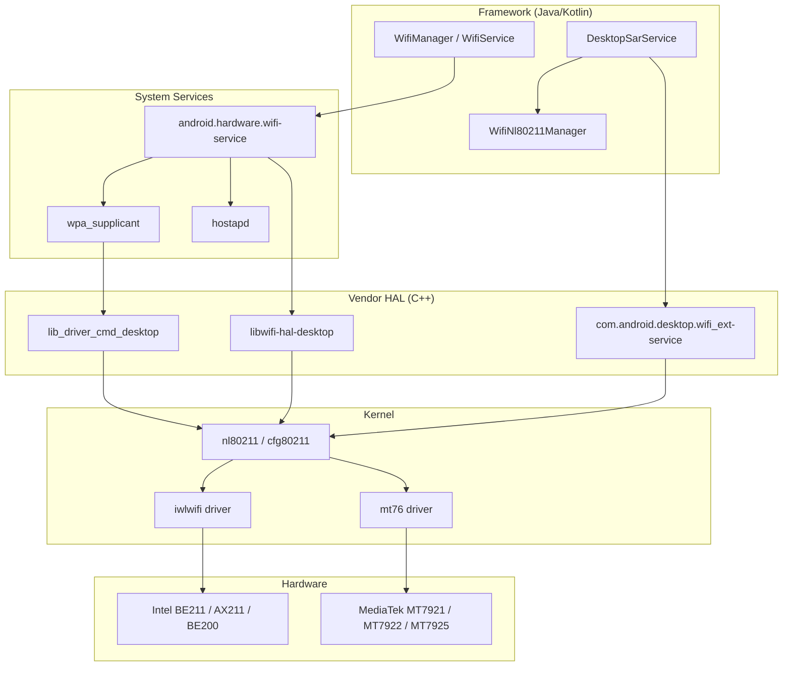
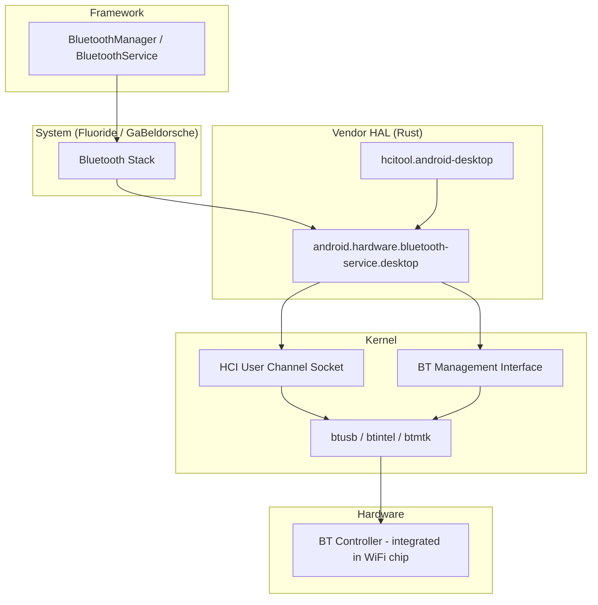
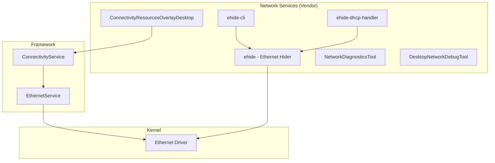
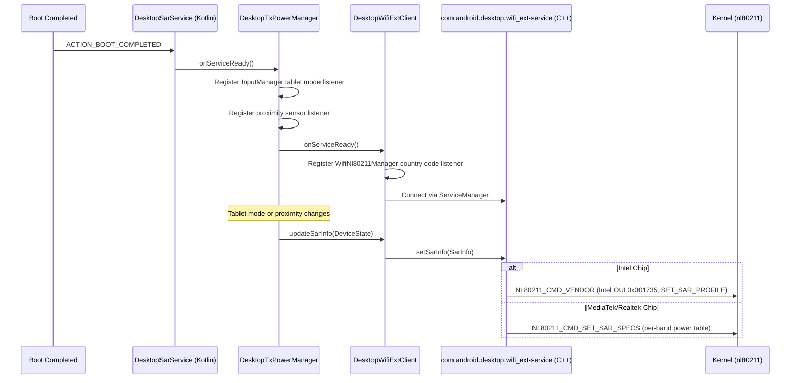
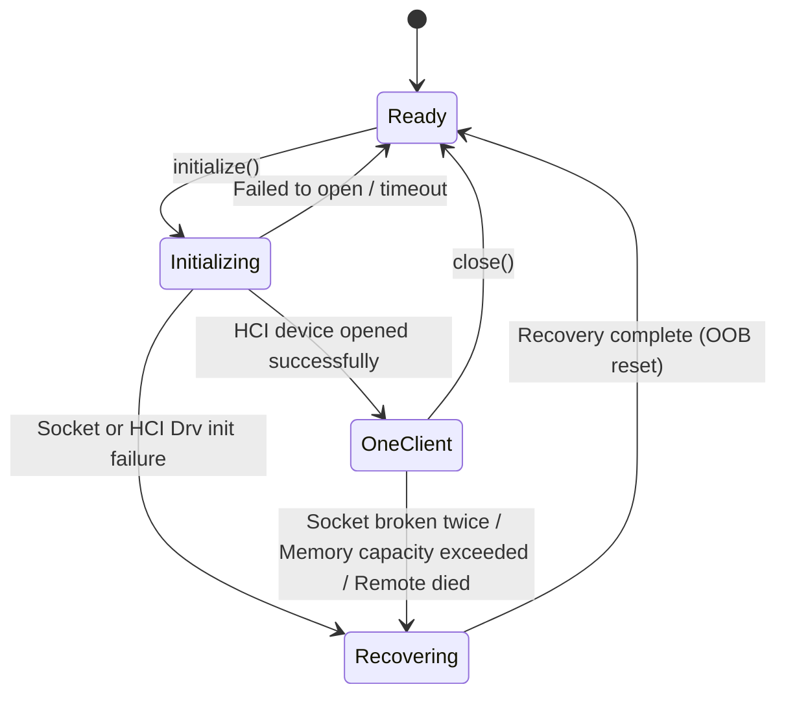
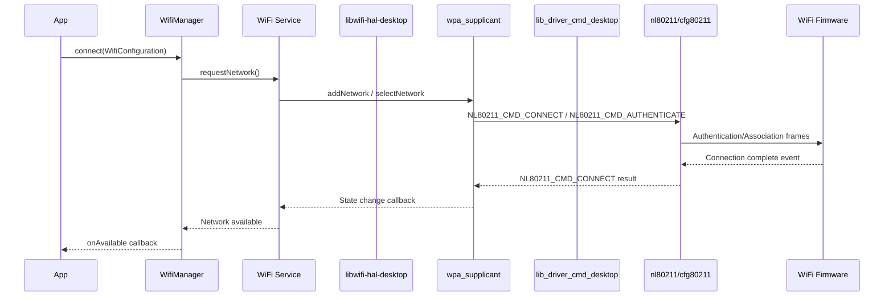
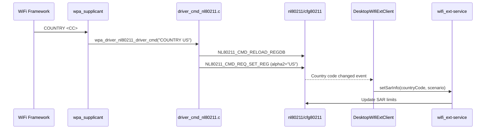
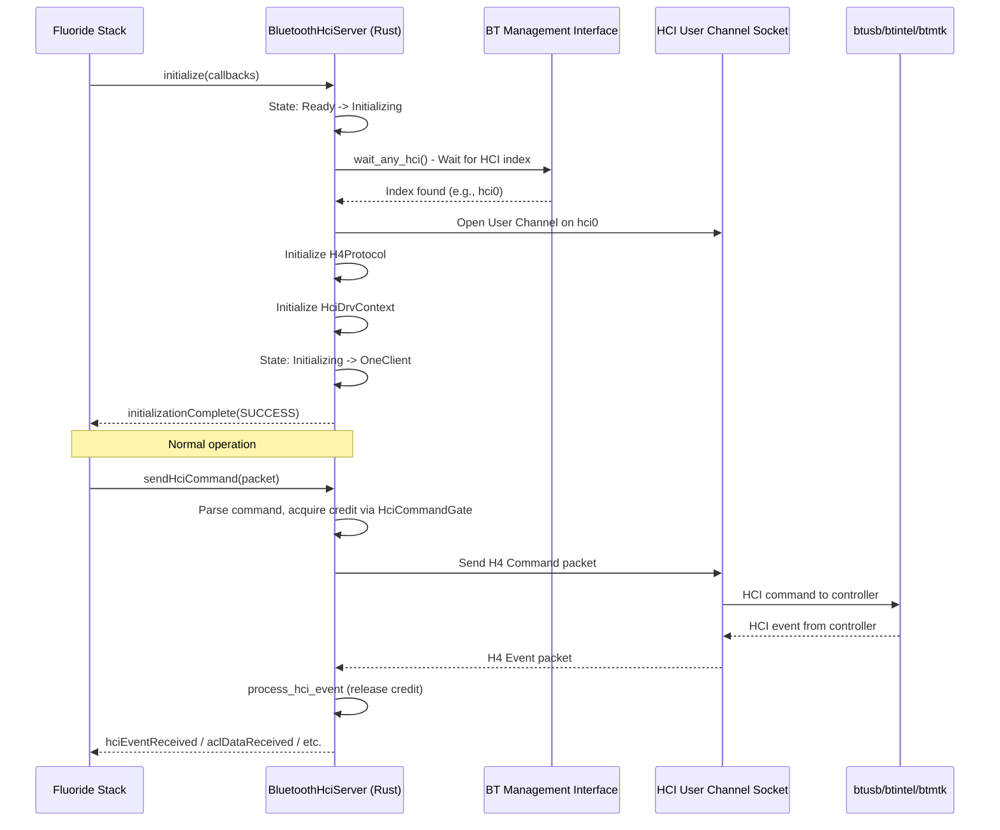
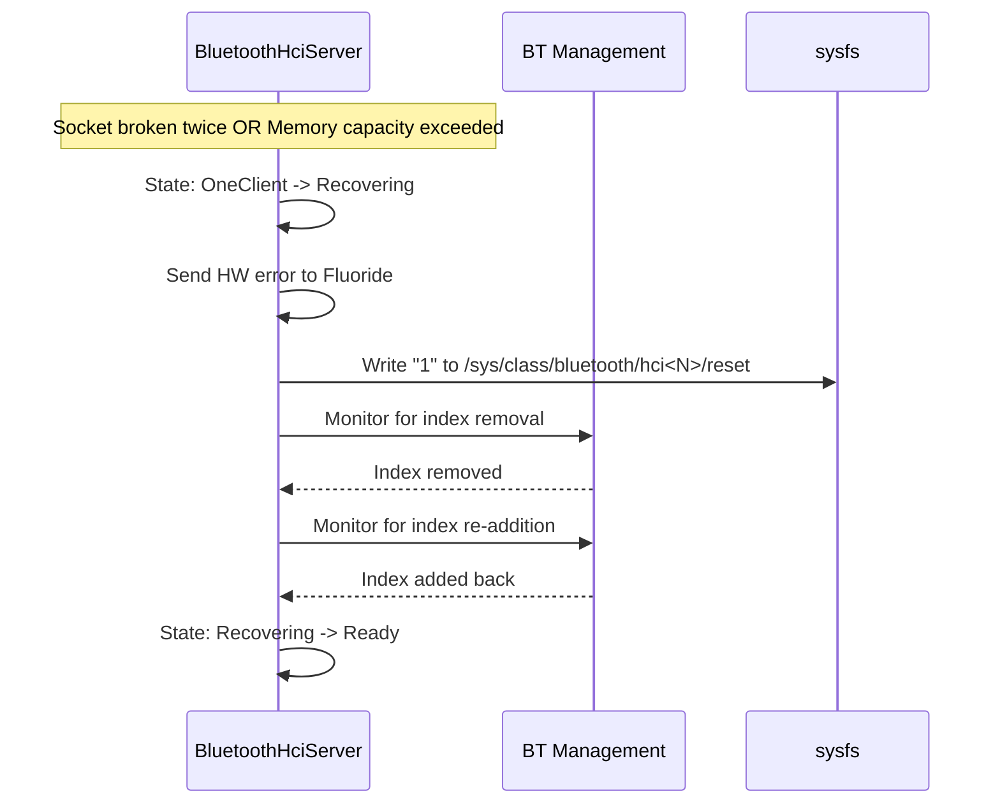
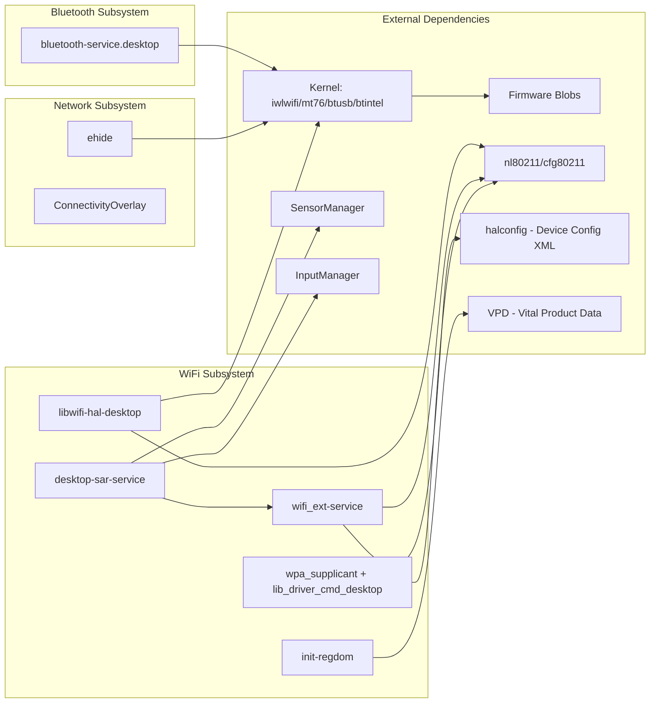

# WiFi, Bluetooth, and Connectivity Implementation

## 1. Architecture Overview

The Android Desktop Platform implements a full connectivity stack encompassing WiFi, Bluetooth, and Ethernet subsystems. The architecture follows the standard Android HAL model with desktop-specific customizations for x86 hardware diversity (Intel and MediaTek chipsets), SAR (Specific Absorption Rate) compliance for laptop/tablet form factors, and an Ethernet hiding mechanism (ehide) for development workflows.

### WiFi Stack



### Bluetooth Stack



### Ethernet / Network Services



---

## 2. Key Components

| Component | Type | Language | Location | Purpose |
|-----------|------|----------|----------|---------|
| `libwifi-hal-desktop` | Static Library (C++) | C++ | `vendor/google/desktop/wifi/hal/` | WiFi HAL - vendor detection, interface management, NL80211 communication |
| `com.android.desktop.wifi_ext-service` | AIDL Service (C++) | C++ | `vendor/google/desktop/wifi/wifi_ext/src/` | WiFi extension - SAR power control via NL80211 |
| `desktop-sar-service` | Android App (Kotlin) | Kotlin | `vendor/google/desktop/wifi/sar/service/` | SAR orchestrator - monitors tablet mode, proximity, country code |
| `lib_driver_cmd_desktop` | Static Library (C) | C | `vendor/google/desktop/wifi/wpa_supplicant_8_lib/` | WPA supplicant driver command interface |
| `init-regdom` | Shell Binary | Shell | `vendor/google/desktop/wifi/sar/` | Regulatory domain initialization from VPD |
| `android.hardware.bluetooth-service.desktop` | AIDL Service (Rust) | Rust | `vendor/google/desktop/bluetooth/hci_hal/` | Bluetooth HCI HAL - User Channel socket, recovery, command gating |
| `hcitool.android-desktop` | CLI Tool (Rust) | Rust | `vendor/google/desktop/bluetooth/hci_hal/` | Bluetooth HCI debug/diagnostic tool |
| `ehide` | Service (Rust) | Rust | `vendor/google/desktop/network/ehide/` | Hides Ethernet interface from Android while preserving ADB-over-TCP |
| `netlink-utils-desktop` | Java Library | Java | `vendor/google/desktop/network/netlink-utils/` | Netlink message parsing utilities |
| `ConnectivityResourcesOverlayDesktop` | RRO | XML | `vendor/google/desktop/network/ConnectivityResourcesOverlayDesktop/` | Connectivity resource overlay for ehide interfaces |
| `DesktopNetworkDebugTool` | Android App (Kotlin) | Kotlin | `vendor/google/desktop/network/DesktopNetworkDebugTool/` | Network debug tool with ADB shell integration |
| `NetworkDiagnosticsTool` | Java Library (Kotlin) | Kotlin | `vendor/google/desktop/network/NetworkDiagnosticsTool/` | Network diagnostics (DNS, ICMP, HTTP/HTTPS probes) |

---

## 3. WiFi HAL Implementation

### Module: `libwifi-hal-desktop`

**Build definition:** `vendor/google/desktop/wifi/hal/Android.bp`

```
cc_library_static {
    name: "libwifi-hal-desktop",
    vendor: true,
    defaults: ["libwifi_hal_cflags_defaults"],
    srcs: [
        "common.cpp",
        "cpp_bindings.cpp",
        "interface_combinations.cpp",
        "interface_configuration.cpp",
        "wifi_hal_desktop.cpp",
    ],
    shared_libs: ["libcutils", "liblog", "libnl"],
}
```

### Source Files and Responsibilities

| File | Purpose |
|------|---------|
| `wifi_hal_desktop.cpp` | Main HAL entry point: initialization, event loop, interface management, vendor detection, feature set query |
| `common.cpp` | Handle conversion utilities, primary `wlan0` interface lookup |
| `common.h` | Core data structures: `HalInfo`, `InterfaceInfo`, `WifiVendor` enum |
| `cpp_bindings.cpp` / `.h` | NL80211 command/response wrappers (`WifiCommand`, `WifiRequest`, `WifiEvent`) |
| `interface_combinations.cpp` / `.h` | NL80211 interface combination matrix parsing |
| `interface_configuration.cpp` / `.h` | Virtual interface creation/deletion via NL80211 |

### Vendor Detection

The HAL dynamically detects the WiFi vendor at initialization by reading `/sys/class/net/<iface>/device/vendor`:

```cpp
static const std::map<unsigned int, WifiVendor> kVendorMap = {
    {0x8086, WIFI_VENDOR_INTEL},
    {0x17cb, WIFI_VENDOR_QUALCOMM},
    {0x168c, WIFI_VENDOR_QUALCOMM},
    {0x14c3, WIFI_VENDOR_MTK},
    {0x10ec, WIFI_VENDOR_REALTEK},
};
```

### Supported HAL Function Table

The HAL registers the following functions via `init_wifi_vendor_hal_func_table()`:

| Function | Description |
|----------|-------------|
| `wifi_initialize` | Initialize HAL, create NL sockets, detect interfaces, detect vendor |
| `wifi_cleanup` | Clean up virtual interfaces, free NL sockets, exit event loop |
| `wifi_event_loop` | Main poll loop on NL event socket and cleanup socket |
| `wifi_get_ifaces` | Return array of detected WiFi interface handles |
| `wifi_get_iface_name` | Return interface name from handle |
| `wifi_trigger_subsystem_restart` | Vendor-specific restart (Intel: coredump trigger) |
| `wifi_get_supported_iface_concurrency_matrix` | Return NL80211-derived concurrency matrix |
| `wifi_virtual_interface_create` | Create virtual interface (STA, AP, P2P, NAN) via NL80211 |
| `wifi_virtual_interface_delete` | Delete virtual interface via NL80211 |
| `wifi_set_country_code` | Set regulatory country code via NL80211 |
| `wifi_get_supported_feature_set` | Query NL80211 extended features (e.g., DYNAMIC_SET_MAC) |
| `wifi_get_driver_version` | Return vendor-prefixed driver version string |
| `wifi_get_firmware_version` | Return vendor-prefixed firmware version string |
| `wifi_set_subsystem_restart_handler` | Register callback for subsystem restart events |

### Interface Discovery

WiFi interfaces are discovered by scanning `/sys/class/net/` and filtering by prefix:

- `wlan*` - Station interfaces
- `swlan*` - Software-created WLAN interfaces
- `p2p*` - Wi-Fi Direct (P2P) interfaces
- `aware*` - Wi-Fi Aware (NAN) interfaces

### Virtual Interface Management

Up to 6 virtual interfaces (`MAX_VIRTUAL_IFACES`) can be created. Creation uses `NL80211_CMD_NEW_INTERFACE` with the appropriate `NL80211_IFTYPE_*` type. Interfaces are tracked in `activeVirtualIfaces` and automatically cleaned up during HAL teardown.

### Interface Combination Matrix

The HAL queries `NL80211_ATTR_INTERFACE_COMBINATIONS` from the kernel driver at initialization time to determine the actual concurrency capabilities. This dynamic approach replaces static placeholder definitions:

- Parses `NL80211_IFACE_COMB_LIMITS`, `NL80211_IFACE_COMB_MAXNUM`, and `NL80211_IFACE_COMB_NUM_CHANNELS`
- Maps NL80211 interface types (STATION, AP, P2P_GO, P2P_CLIENT, NAN) to WiFi HAL types
- Currently filters combinations to those with `numberOfChannels >= 2` (DBS-capable) to prevent erroneous MCC assumptions

### Intel-Specific: Subsystem Restart

For Intel WiFi chips, `wifi_trigger_subsystem_restart()` writes `"1"` to the sysfs coredump path (`/sys/class/net/<iface>/device/coredump`) to trigger a firmware dump and reset.

---

## 4. WiFi SAR (Specific Absorption Rate) Control

The SAR subsystem ensures WiFi TX power limits comply with regulatory requirements based on device mode (clamshell vs. tablet) and geographic region.

### Architecture



### Components

#### 1. `desktop-sar-service` (Kotlin Android App)

**Location:** `vendor/google/desktop/wifi/sar/service/`

**Manifest:** Persistent app with `RECEIVE_BOOT_COMPLETED` and `TABLET_MODE` permissions. Runs as system user only.

**Key classes:**

- **`BootCompletedReceiver`** - Starts `DesktopSarService` on boot if `enabled_dynamic_sar` flag is set
- **`DesktopSarService`** - Android Service managing the SAR lifecycle, also exposes a test `Messenger` interface
- **`DesktopTxPowerManager`** - Monitors device state via:
  - `InputManager.OnTabletModeChangedListener` for clamshell/tablet mode
  - `SensorEventListener` for `TYPE_LOW_LATENCY_OFFBODY_DETECT` proximity sensor
- **`DesktopWifiExtClient`** - AIDL client connecting to `IDesktopWifiExt` service; monitors country code changes via `WifiNl80211Manager.CountryCodeChangedListener`

**Device State Resolution:**

| Proximity | Device Mode | SAR Scenario |
|-----------|-------------|--------------|
| OFFBODY | CLAMSHELL | `CLAMSHELL` |
| ONBODY | CLAMSHELL | `TABLET_MODE` |
| OFFBODY | TABLET_MODE | `TABLET_MODE` |
| ONBODY | TABLET_MODE | `TABLET_MODE` |

Only the `OFFBODY + CLAMSHELL` combination results in `CLAMSHELL` mode; all others use `TABLET_MODE` for safety.

#### 2. `com.android.desktop.wifi_ext-service` (C++ AIDL Service)

**Location:** `vendor/google/desktop/wifi/wifi_ext/src/`

**Init RC:** Runs as user `wifi`, group `wifi gps system`, with `NET_ADMIN` and `NET_RAW` capabilities.

**AIDL Interface (`IDesktopWifiExt`):**

```
oneway interface IDesktopWifiExt {
    void setSarInfo(in SarInfo info);
    void registerSarCallback(in IDesktopWifiExtSarCallback callback);
}
```

**AIDL Data Types:**

- `SarInfo` - Contains `countryCode` (ISO 3166-1 alpha-2) and `scenario` (`SarScenario`)
- `SarScenario` - Enum: `CLAMSHELL = 0`, `TABLET_MODE = 1`
- `Status` - Enum: `SUCCESS = 0`, `FAILURE = 1`, `MISSING_CONFIG = 2`, `INVALID_CONFIG = 3`

**Vendor-Specific SAR Implementation:**

| Vendor | Method | Details |
|--------|--------|---------|
| Intel | `NL80211_CMD_VENDOR` | Uses Intel OUI `0x001735`, vendor command `IWL_MVM_VENDOR_CMD_SET_SAR_PROFILE` (28). Selects between tablet profile index 1 and clamshell profile index 2 for chain A and B. |
| MediaTek / Realtek | `NL80211_CMD_SET_SAR_SPECS` | Reads per-band power tables from `halconfig` (device-specific XML config). Supports 14 bands (2g, 5g sub-bands 1-5, 6g sub-bands 1-6). Applies regulatory domain offsets (EU/FCC/Other) before sending. |

**Regulatory Domain Detection:** Queries the kernel via `NL80211_CMD_GET_REG` to get the active country code and DFS region, mapping `NL80211_DFS_ETSI` to EU, `NL80211_DFS_FCC` to FCC, and everything else to Other.

### Feature Flag

The dynamic SAR feature is gated by the `enabled_dynamic_sar` flag:

```
package: "com.android.desktop.sar.flags"
container: "system_ext"
flag {
    name: "enabled_dynamic_sar"
    namespace: "desktop_connectivity"
}
```

This flag controls both the native C++ service (via `com_android_desktop_sar_flags.h`) and the Kotlin SAR service (via `Flags.enabledDynamicSar()`).

---

## 5. WiFi Extensions (wifi_ext)

### AIDL Interface Definition

**Location:** `vendor/google/desktop/wifi/wifi_ext/`

The `com.android.desktop.wifi_ext` AIDL interface is a VINTF-stable interface with version 1 (frozen):

```
aidl_interface {
    name: "com.android.desktop.wifi_ext",
    stability: "vintf",
    soc_specific: true,
    frozen: true,
    versions_with_info: [{ version: "1" }],
}
```

**Backends enabled:** Java, NDK. Disabled: C++, Rust.

### VINTF Manifest

```xml
<manifest version="1.0" type="device">
    <hal format="aidl">
        <name>com.android.desktop.wifi_ext</name>
        <fqname>IDesktopWifiExt/default</fqname>
        <version>1</version>
    </hal>
</manifest>
```

### Compatibility Matrix

The framework expects this HAL to be present:

```xml
<compatibility-matrix version="1.0" type="framework">
    <hal format="aidl">
        <name>com.android.desktop.wifi_ext</name>
        <interface>
          <name>IDesktopWifiExt</name>
          <instance>default</instance>
       </interface>
    </hal>
</compatibility-matrix>
```

---

## 6. WPA Supplicant Integration

### Module: `lib_driver_cmd_desktop`

**Build definition:** `vendor/google/desktop/wifi/wpa_supplicant_8_lib/Android.bp`

```
cc_library_static {
    name: "lib_driver_cmd_desktop",
    vendor: true,
    cflags: ["-DCONFIG_ANDROID_LOG", "-DCONFIG_P2P"],
    srcs: ["driver_cmd_nl80211.c"],
}
```

### Driver Command Handling

The `wpa_driver_nl80211_driver_cmd()` function processes private driver commands:

| Command | Behavior |
|---------|----------|
| `COUNTRY <CC>` | Reloads regulatory database (`NL80211_CMD_RELOAD_REGDB`) then sets region (`NL80211_CMD_REQ_SET_REG`) |
| `MACADDR` | Retrieves MAC address via `NL80211_CMD_GET_INTERFACE` |
| `MIRACAST` | Silently ignored (not supported on desktop drivers) |
| `BTCOEXMODE` | Silently ignored |
| `BTCOEXSCAN-START/STOP` | Silently ignored |
| `SETSUSPENDMODE` | Silently ignored |

P2P commands without a NETDEVICE are re-routed to the parent interface.

### WPA Supplicant Configuration

**Main config** (`wpa_supplicant.conf`):

| Setting | Value | Purpose |
|---------|-------|---------|
| `ctrl_interface` | `wlan0` | Control interface name |
| `eapol_version` | `1` | EAPOL protocol version |
| `ap_scan` | `1` | Let wpa_supplicant perform scanning |
| `fast_reauth` | `1` | Enable fast re-authentication |
| `pmf` | `1` | Protected Management Frames required |
| `sae_check_mfp` | `1` | Enforce MFP for SAE (WPA3) |
| `sae_pwe` | `2` | SAE Password Element derivation (hash-to-element) |
| `android_force_roaming_enabled` | `1` | Enable Android roaming |
| `bgscan_enabled` | `1` | Enable background scanning |

**Station overlay** (`wpa_supplicant_overlay.conf`):

| Setting | Value | Purpose |
|---------|-------|---------|
| `disable_scan_offload` | `1` | Disable scan offload to firmware |
| `p2p_disabled` | `1` | Disable P2P in station mode |
| `bgscan` | `"simple:64:-70:360"` | Background scan: 64s short interval, -70dBm threshold, 360s long interval |

**P2P overlay** (`p2p_supplicant_overlay.conf`):

| Setting | Value | Purpose |
|---------|-------|---------|
| `disable_scan_offload` | `1` | Disable scan offload |
| `p2p_interface_random_mac_addr` | `1` | Random MAC for P2P interface |
| `p2p_go_ht40` | `1` | Enable HT40 for P2P GO |
| `p2p_go_vht` | `1` | Enable VHT (WiFi 5) for P2P GO |
| `p2p_go_he` | `1` | Enable HE (WiFi 6) for P2P GO |

### WiFi Properties

```makefile
wifi.direct.interface=p2p-dev-wlan0
wifi.aware.interface=aware0-wlan0
```

### Board-Level Configuration

```makefile
BOARD_HOSTAPD_DRIVER = NL80211
BOARD_WPA_SUPPLICANT_DRIVER = NL80211
WPA_SUPPLICANT_VERSION = VER_2_1_DEVEL
BOARD_WLAN_DEVICE = desktop
BOARD_WPA_SUPPLICANT_PRIVATE_LIB = lib_driver_cmd_desktop
```

---

## 7. Bluetooth HCI HAL

### Module: `android.hardware.bluetooth-service.desktop`

**Build definition:** `vendor/google/desktop/bluetooth/hci_hal/Android.bp`

The Bluetooth HCI HAL is implemented entirely in **Rust** and implements the `android.hardware.bluetooth` AIDL V1 interface.

### Architecture

| Component | Description |
|-----------|-------------|
| `bluetooth_hci.rs` | Main `BluetoothHciServer` - implements `IBluetoothHciAsyncServer` and `IHciToolAsyncServer` |
| `bluetooth_hci_drv.rs` | HCI driver context for vendor-specific operations |
| `bluetooth_mgmt.rs` | BT Management interface for HCI device discovery and monitoring |
| `bluetooth_socket.rs` | HCI User Channel socket implementation |
| `h4_protocol.rs` | H4 packet framing protocol (Command, ACL, SCO, Event, ISO, Driver) |
| `packets.rs` | PDL-generated packet definitions |

### PDL Packet Definitions

Three PDL (Packet Description Language) files generate Rust code:

| PDL File | Generated | Purpose |
|----------|-----------|---------|
| `hci_packets.pdl` | `hci_packets.rs` | Standard HCI packets |
| `hci_drv_packets.pdl` | `hci_drv_packets.rs` | HCI driver control packets |
| `mgmt_packets.pdl` | `mgmt_packets.rs` | BT Management interface packets |

### State Machine



- **Ready** - No active client, waiting for `initialize()` call
- **Initializing** - Opening HCI device, setting up H4 protocol
- **OneClient** - Active connection to Fluoride stack, processing HCI packets
- **Recovering** - Performing OOB (Out-of-Band) reset via sysfs `/sys/class/bluetooth/hci<N>/reset`

### Key Design Decisions

1. **User Channel Socket**: The HAL uses the HCI User Channel (`HCI_CHANNEL_USER`) to bypass the kernel Bluetooth stack and communicate directly with the controller.

2. **Command Gating**: The `HciCommandGate` ensures only one HCI command is pending at a time using a semaphore-based credit system.

3. **Intel-Specific Quirks**:
   - Drops Intel-specific HCI command `0xFC1E` on non-Intel hardware
   - Implements a reconnection cooldown (`RECONNECTION_COOLDOWN = 1s`) after `PageTimeout` for Classic connections to work around Intel firmware bugs
   - Detects Intel hardware by reading `/sys/class/net/wlan0/device/vendor` (checking for `0x8086`)

4. **Recovery**: On repeated socket failures or `MEMORY_CAPACITY_EXCEEDED` errors (threshold: 10), the HAL triggers an OOB reset by writing `"1"` to `/sys/class/bluetooth/hci<N>/reset`, then monitors the MGMT interface for the index to disappear and reappear.

### HCI Tool AIDL

The `IHciTool` interface provides a debug mechanism for injecting raw HCI commands:

```
interface IHciTool {
    byte[] insertHciCommand(in byte[] data);
}
```

This bypasses the normal HCI command flow and returns the response directly.

### Init RC

```
service vendor.bluetooth-desktop /vendor/bin/hw/android.hardware.bluetooth-service.desktop
    class hal
    capabilities BLOCK_SUSPEND NET_ADMIN SYS_NICE
    user bluetooth
    group bluetooth
    task_profiles HighPerformance
```

### VINTF Fragment

```xml
<manifest version="1.0" type="device">
    <hal format="aidl">
        <name>android.hardware.bluetooth</name>
        <fqname>IBluetoothHci/default</fqname>
    </hal>
</manifest>
```

---

## 8. Supported WiFi/BT Chips

| Chip | Vendor | WiFi Gen | Driver | WiFi Firmware Package | BT Firmware Package | BT Interface |
|------|--------|----------|--------|-----------------------|---------------------|--------------|
| Intel BE211 | Intel | WiFi 7 (BE) | `iwlwifi` | `linux_firmware_iwlwifi-sc-a0-wh-b0-c101` | `linux_firmware_btpci-ibt_be211` | PCIe (btpci) |
| Intel AX211 | Intel | WiFi 6E (AX) | `iwlwifi` | (included with kernel) | `linux_firmware_btusb-ibt_ax211` | USB (btusb) |
| Intel BE200 | Intel | WiFi 7 (BE) | `iwlwifi` | `linux_firmware_iwlwifi-gl-c0-fm-c0-c101` | (none specified) | -- |
| MediaTek MT7921 | MediaTek | WiFi 6 (AX) | `mt76` | `linux_firmware_mt7921` | `linux_firmware_mt7921-bt` | USB |
| MediaTek MT7922 | MediaTek | WiFi 6E (AX) | `mt76` | `linux_firmware_mt7922` | `linux_firmware_mt7922-bt` | USB |
| MediaTek MT7925 | MediaTek | WiFi 7 (BE) | `mt76` | `linux_firmware_mt7925` | (included in WiFi fw) | USB |

---

## 9. Per-Chip Configuration

Each chip has a dedicated makefile in `device/google/desktop/common/shared/` that adds the required firmware packages to `PRODUCT_PACKAGES`.

### Intel BE211

**File:** `device/google/desktop/common/shared/intel_BE211.mk`

```makefile
PRODUCT_PACKAGES += \
    linux_firmware_iwlwifi-sc-a0-wh-b0-c101 \
    linux_firmware_btpci-ibt_be211
```

- WiFi 7 (802.11be) capable
- Uses Solar Cougar (sc) firmware variant, generation a0, with WH stepping b0
- Bluetooth uses PCIe transport (`btpci`) - a newer transport path for integrated BT

### Intel AX211

**File:** `device/google/desktop/common/shared/intel_AX211.mk`

```makefile
PRODUCT_PACKAGES += \
    linux_firmware_btusb-ibt_ax211
```

- WiFi 6E (802.11ax) capable
- WiFi firmware assumed to be available via kernel or other packages
- Bluetooth uses USB transport (`btusb`)

### Intel BE200

**File:** `device/google/desktop/common/shared/intel_BE200.mk`

```makefile
PRODUCT_PACKAGES += \
    linux_firmware_iwlwifi-gl-c0-fm-c0-c101
```

- WiFi 7 (802.11be) capable
- Uses GL firmware variant, generation c0, with FM stepping c0
- No separate BT firmware package listed (may be bundled)

### MediaTek MT7921

**File:** `device/google/desktop/common/shared/mediatek_MT7921.mk`

```makefile
PRODUCT_PACKAGES += \
    linux_firmware_mt7921 \
    linux_firmware_mt7921-bt
```

- WiFi 6 (802.11ax) capable
- Separate WiFi and BT firmware blobs

### MediaTek MT7922

**File:** `device/google/desktop/common/shared/mediatek_MT7922.mk`

```makefile
PRODUCT_PACKAGES += \
    linux_firmware_mt7922 \
    linux_firmware_mt7922-bt
```

- WiFi 6E (802.11ax) capable with 6 GHz support
- Separate WiFi and BT firmware blobs

### MediaTek MT7925

**File:** `device/google/desktop/common/shared/mediatek_MT7925.mk`

```makefile
PRODUCT_PACKAGES += \
    linux_firmware_mt7925
```

- WiFi 7 (802.11be) capable
- Single firmware package (BT may be bundled)

---

## 10. Network Services

### ehide (Ethernet Hider)

**Location:** `vendor/google/desktop/network/ehide/`

**Purpose:** ehide hides the Ethernet interface from the entire Android network stack while maintaining ADB-over-TCP connectivity through a backup network namespace. This is essential for development/testing scenarios where the Ethernet port must remain available for ADB but should not interfere with WiFi testing.

**Architecture:**

| Binary | Purpose |
|--------|---------|
| `ehide` | Main daemon - creates network namespace, configures interfaces, manages forwarding |
| `ehide-cli` | Command-line tool for interacting with running ehide instance |
| `ehide-dhcp-handler` | DHCP handler used by toybox dhcp to configure IPv4 addresses/routes |
| `ehide-delayer.sh` | Lab provisioning script - delays ehide start by 180s to allow ADB connection |

**Init RC properties:**

- `persist.vendor.ehide.autostart=1` + `ro.vendor.adbd.unsafe=1` -> Start ehide
- `vendor.ehide.ip_provision_failed=1` -> Stop ehide immediately

**Capabilities required:** `NET_ADMIN`, `SYS_ADMIN`, `NET_BIND_SERVICE`, `NET_RAW` (runs as root).

**Rust libraries used:** `libtokio`, `libnix`, `librtnetlink`, `libcidr`, `libserde`, `libclap`, `libfutures`.

### ConnectivityResourcesOverlayDesktop

**Location:** `vendor/google/desktop/network/ConnectivityResourcesOverlayDesktop/`

Configures the Connectivity module with desktop-specific settings:

```xml
<string-array name="config_ethernet_interfaces">
    <item>eth5182;11,14;;</item>
    <item>eth5183;11,14;;</item>
</string-array>
```

- `eth5182` and `eth5183` are reserved for ehide (randomly chosen suffixes)
- Capabilities `11` (NOT_METERED) and `14` (TRUSTED) are assigned so other apps do not use these interfaces
- Supports hiding up to 2 Ethernet interfaces simultaneously

```xml
<string-array name="config_networkSupportedKeepaliveCount">
    <item>0,3</item>
</string-array>
```

- 3 keepalive offload slots in TRANSPORT_CELLULAR, none in others

### netlink-utils-desktop

**Location:** `vendor/google/desktop/network/netlink-utils/`

A comprehensive Java library providing Netlink message parsing capabilities:

| Category | Classes |
|----------|---------|
| **Core** | `Struct`, `LegacyStruct`, `PacketBuilder`, `SocketUtils` |
| **Netlink Messages** | `NetlinkMessage`, `NetlinkErrorMessage`, `NetlinkUtils`, `NetlinkConstants` |
| **Route Netlink** | `RtNetlinkAddressMessage`, `RtNetlinkLinkMessage`, `RtNetlinkNeighborMessage`, `RtNetlinkPrefixMessage`, `RtNetlinkRouteMessage` |
| **Conntrack/Diag** | `ConntrackMessage`, `InetDiagMessage` |
| **XFRM** | `XfrmNetlinkMessage`, `XfrmNetlinkGetSaMessage`, `XfrmNetlinkNewSaMessage` |
| **Structs** | Various: `StructNlMsgHdr`, `StructNlAttr`, `StructRtMsg`, `StructNdMsg`, etc. |
| **Protocol Headers** | `EthernetHeader`, `Ipv4Header`, `Ipv6Header`, `TcpHeader`, `UdpHeader`, `Icmpv4Header`, `Icmpv6Header` |

### DesktopNetworkDebugTool

**Location:** `vendor/google/desktop/network/DesktopNetworkDebugTool/`

A privileged Android app providing network debugging capabilities:

- ADB shell command execution
- Network diagnostics UI
- Platform-signed for elevated permissions

### NetworkDiagnosticsTool

**Location:** `vendor/google/desktop/network/NetworkDiagnosticsTool/`

A Kotlin library providing structured network diagnostics:

| Test | Purpose |
|------|---------|
| `DNS_RESOLUTION_TEST` | Resolve given hostname for a specific network |
| `ICMP_TEST` | Check ICMP connectivity to a host |
| `HTTP_PROBE_TEST` | Check successful HTTP probe |
| `HTTPS_PROBE_TEST` | Check successful HTTPS probe |

The library provides async execution with configurable global timeouts and callback-based result delivery.

---

## 11. Data Flow - WiFi

### Connection Establishment



### Country Code Flow



---

## 12. Data Flow - Bluetooth

### HCI Initialization



### Recovery Flow



---

## 13. Firmware Management

### Firmware Sources

All WiFi and Bluetooth firmware blobs are sourced from `linux-firmware` packages and installed to the vendor partition.

### Intel WiFi Firmware

| Firmware Package | Chip | Firmware Path Pattern |
|-----------------|------|----------------------|
| `linux_firmware_iwlwifi-sc-a0-wh-b0-c101` | BE211 | `/vendor/firmware/iwlwifi-sc-a0-wh-b0-*.ucode` |
| `linux_firmware_iwlwifi-gl-c0-fm-c0-c101` | BE200 | `/vendor/firmware/iwlwifi-gl-c0-fm-c0-*.ucode` |

Intel firmware naming convention: `iwlwifi-<generation>-<stepping>-<config>.ucode`

### Intel BT Firmware

| Firmware Package | Transport | Chip |
|-----------------|-----------|------|
| `linux_firmware_btpci-ibt_be211` | PCIe | BE211 |
| `linux_firmware_btusb-ibt_ax211` | USB | AX211 |

### MediaTek Firmware

| Firmware Package | Chip |
|-----------------|------|
| `linux_firmware_mt7921` | MT7921 WiFi |
| `linux_firmware_mt7921-bt` | MT7921 BT |
| `linux_firmware_mt7922` | MT7922 WiFi |
| `linux_firmware_mt7922-bt` | MT7922 BT |
| `linux_firmware_mt7925` | MT7925 WiFi+BT |

---

## 14. Configuration

### Regulatory Domain Initialization

**Script:** `vendor/google/desktop/wifi/sar/init.regdom.sh`

Triggered on `sys.boot_completed=1`, this script:

1. Reads the VPD (Vital Product Data) region: `vpd -g region`
2. Extracts the regulatory domain code (uppercase, before any `.`)
3. For restrictive regions (`ID`, `AR`, `US`, `RU`):
   - Waits up to 10 seconds for a wireless interface
   - Checks for self-managed PHY (skips if found - these handle regulatory OTA)
   - Sets the regulatory domain: `iw reg set <regdomain>`
4. All other regions: uses the default "world" regulatory domain

### WiFi Overlay Configuration

**Location:** `vendor/google/desktop/overlay_packages/WifiDesktopOverlay/res/values/config.xml`

| Config | Value | Purpose |
|--------|-------|---------|
| `config_wifi5ghzSupport` | `true` | 5 GHz band support |
| `config_wifiSoftap5ghzSupported` | `true` | SoftAP on 5 GHz |
| `config_wifiSoftap6ghzSupported` | `true` | SoftAP on 6 GHz |
| `config_wifi_softap_sae_supported` | `true` | WPA3-SAE for SoftAP |
| `config_wifi_connected_mac_randomization_supported` | `true` | MAC randomization |
| `config_wifiDriverSupportedNl80211RegChangedEvent` | `true` | Driver supports reg change events |
| `config_wifiMainlineSupplicantEnabled` | `true` | Use mainline WPA supplicant |

### WiFi Permission Files

Copied to `/vendor/etc/permissions/`:

- `android.hardware.wifi.direct.xml` - WiFi Direct capability declaration
- `android.hardware.wifi.passpoint.xml` - Passpoint capability declaration

### Bluetooth Properties

The BT HAL service runs with:

- User: `bluetooth`
- Group: `bluetooth`
- Capabilities: `BLOCK_SUSPEND`, `NET_ADMIN`, `SYS_NICE`
- Task profile: `HighPerformance`

---

## 15. Build Integration

### PRODUCT_PACKAGES (WiFi - from `wifi.mk`)

```makefile
PRODUCT_PACKAGES += \
    mac80211_create_radios \
    dhcpclient \
    hostapd \
    wpa_supplicant \
    android.hardware.wifi@1.3-service \
    init.wifi.sh \
    android.hardware.wifi.prebuilt.xml \
    android.hardware.wifi-service \
    WifiDesktopOverlayGoogle \
    iw_vendor \
    com.android.desktop.wifi_ext-service \
    desktop-sar-service \
    wifi-regulatory-fw \
    init-regdom \
    wpa_cli
```

Debug/eng builds additionally include `trace-cmd`.

### Per-Device Chip Selection

Device makefiles include the appropriate chip configuration:

```makefile
# Example for a device with Intel BE211:
$(call inherit-product, device/google/desktop/common/shared/intel_BE211.mk)

# Example for a device with MediaTek MT7922:
$(call inherit-product, device/google/desktop/common/shared/mediatek_MT7922.mk)
```

This adds the correct firmware packages for the target hardware.

### Interface Combination Placeholder

```makefile
# Static placeholder - overridden by dynamic NL80211 query at runtime
ifdef WIFI_HIDL_FEATURE_DISABLE_AP
    WIFI_HAL_INTERFACE_COMBINATIONS := {{{STA}, 1}, {{P2P}, 1}}
else
    WIFI_HAL_INTERFACE_COMBINATIONS := {{{STA}, 1}, {{P2P}, 1}}, {{{AP}, 1}}
endif
```

These are never used in practice; the HAL queries actual capabilities from the driver.

### Soong Config

```makefile
$(call soong_config_set,wifi,board_wlan_device,$(BOARD_WLAN_DEVICE))
```

Sets `board_wlan_device` to `desktop` in Soong configuration namespace `wifi`.

---

## 16. Inter-Subsystem Dependencies

### Dependency Graph



### Key Dependencies

| Component | Depends On | Relationship |
|-----------|-----------|--------------|
| `libwifi-hal-desktop` | `libnl`, `libcutils`, `liblog` | Shared libraries |
| `wifi_ext-service` | `libnl`, `libxml2`, `libhalconfig_cxx`, SAR flags | NL80211 communication, device config, feature flags |
| `desktop-sar-service` | `wifi_ext` AIDL, `WifiNl80211Manager`, `InputManager`, `SensorManager` | SAR info delivery, device state monitoring |
| `bluetooth-service.desktop` | `android.hardware.bluetooth` AIDL V1, `libbinder`, `libtokio` | BT stack interface |
| `init-regdom` | `vpd` utility, `iw` command | VPD region read, regulatory set |
| `ehide` | `librtnetlink`, `libnix`, `libtokio` | Netlink route manipulation |

---

## 17. SEPolicy

### WiFi HAL (`hal_wifi_default.te`)

```
allow hal_wifi_default self:capability sys_module;
allow hal_wifi_default sysfs_coredump:file rw_file_perms;
set_prop(hal_wifi_default, vendor_wifi_version)
```

- `sys_module` capability for driver interaction
- Write access to sysfs coredump trigger (Intel subsystem restart)
- Writes WiFi driver/firmware version to vendor properties

### WiFi Extension (`wifi_ext.te`)

The WiFi Extension service policy reuses `hal_wifi` attributes to avoid neverallow conflicts:

```
hal_attribute(wifi_ext)
type hal_wifi_ext_default, domain;
hal_server_domain(hal_wifi_ext_default, hal_wifi)

type hal_wifi_ext_default_exec, exec_type, vendor_file_type, file_type;
init_daemon_domain(hal_wifi_ext_default)

# NL80211 communication
net_domain(hal_wifi_ext_default)
allow hal_wifi_ext_default self:global_capability_class_set { net_admin net_raw };
allow hal_wifi_ext_default self:netlink_generic_socket create_socket_perms_no_ioctl;

# HAL config access
get_prop(hal_wifi_ext_default, vendor_device_info_prop)
allow hal_wifi_ext_default vendor_configs_file:file { open read getattr };

# Service registration and client communication
add_service(hal_wifi_ext_default, hal_wifi_ext_service)
allow hal_wifi_ext_client hal_wifi_ext_service:service_manager find;
binder_call(hal_wifi_ext_client, hal_wifi_ext_default)
binder_call(hal_wifi_ext_default, hal_wifi_ext_client)
```

### Desktop SAR Service (`desktop_sar.te`)

```
# Public: type declaration
type desktop_sar_app, domain, coredomain;

# Private: permissions
app_domain(desktop_sar_app);
binder_use(desktop_sar_app);
allow desktop_sar_app activity_service:service_manager find;
allow desktop_sar_app wifinl80211_service:service_manager find;
binder_call(desktop_sar_app, wificond)
binder_call(wificond, desktop_sar_app)
allow desktop_sar_app sensorservice_service:service_manager find;
allow desktop_sar_app app_api_service:service_manager find;
```

The SAR app is both a `coredomain` (needed for `wifinl80211_service` access) and a `hal_wifi_ext_client`.

### Bluetooth (`bluetooth.te`)

```
allow bluetooth self:bluetooth_socket { bind create read write };
```

Minimal desktop-specific addition allowing the Bluetooth domain to manage BT sockets.

### ehide (`ehide.te`)

```
type ehide, domain;
type ehide_exec, exec_type, vendor_file_type, file_type;
init_daemon_domain(ehide)

allow ehide self:capability { net_admin sys_admin net_bind_service net_raw };
allow ehide self:netlink_route_socket { bind create nlmsg_read nlmsg_readpriv nlmsg_write ... };
allow ehide self:tcp_socket { accept bind connect create getattr listen read setopt shutdown write };
allow ehide self:packet_socket { bind create read setopt write };
allow ehide vendor_ehide_prop:property_service set;
```

Comprehensive networking permissions for namespace management, DHCP, TCP forwarding, and service lifecycle control.

### Regulatory Domain Init (`init-regdom.te`)

```
type init_regdom, domain;
type init_regdom_exec, exec_type, vendor_file_type, file_type;
init_daemon_domain(init_regdom);

allow init_regdom vendor_shell_exec:file rx_file_perms;
allow init_regdom iw_vendor_exec:file rx_file_perms;
```

Permissions to execute vendor shell and `iw` command for regulatory domain configuration.

---

## 18. Testing

### SAR Service Tests

**Module:** `desktop-sar-test`

- Instrumented Android test (`android_test`) targeting the SAR service
- Uses `AndroidTest.xml` test config
- Test suites: `device-tests`, `dts`
- Tests the `MSG_TRIGGER_SAR_UPDATE` Messenger interface for triggering SAR updates

### ehide Tests

**Module:** `ehide_test`

- Rust unit test (`rust_test`) requiring root
- Test suite: `general-tests`

**Module:** `EhideIntegrationTestCases`

- Java/Kotlin host test
- Test suite: `general-tests`
- Test mapping in `vendor/google/desktop/network/TEST_MAPPING`: runs in `desktop-postsubmit`

### Network Debug/Diagnostics Tests

**Module:** `DesktopNetworkDebugToolUnitTests`

- Ravenwood test (runs on host)
- Tests `AdbAuth` and `CmdHistory` components

### WiFi HAL Testing

The WiFi HAL uses trace-cmd on userdebug/eng builds for automated testing and field debugging:

```makefile
ifneq (,$(filter userdebug eng, $(TARGET_BUILD_VARIANT)))
    PRODUCT_PACKAGES += trace-cmd
endif
```

---

## 19. Key Files Reference

| File Path | Description |
|-----------|-------------|
| `vendor/google/desktop/wifi/hal/Android.bp` | WiFi HAL build definition |
| `vendor/google/desktop/wifi/hal/wifi_hal_desktop.cpp` | WiFi HAL main implementation (1275 lines) |
| `vendor/google/desktop/wifi/hal/common.h` | Core data structures: `HalInfo`, `InterfaceInfo`, `WifiVendor` |
| `vendor/google/desktop/wifi/hal/common.cpp` | Handle conversion, `wlan0` interface lookup |
| `vendor/google/desktop/wifi/hal/interface_combinations.cpp` | NL80211 interface combination parsing |
| `vendor/google/desktop/wifi/hal/interface_configuration.cpp` | Virtual interface create/delete |
| `vendor/google/desktop/wifi/hal/cpp_bindings.cpp` | NL80211 command/response wrappers |
| `vendor/google/desktop/wifi/wifi_ext/Android.bp` | WiFi extension AIDL interface definition |
| `vendor/google/desktop/wifi/wifi_ext/com/android/desktop/wifi_ext/IDesktopWifiExt.aidl` | WiFi ext AIDL: `setSarInfo`, `registerSarCallback` |
| `vendor/google/desktop/wifi/wifi_ext/com/android/desktop/wifi_ext/SarInfo.aidl` | SAR info parcelable: country code + scenario |
| `vendor/google/desktop/wifi/wifi_ext/com/android/desktop/wifi_ext/SarScenario.aidl` | SAR scenario enum: CLAMSHELL, TABLET_MODE |
| `vendor/google/desktop/wifi/wifi_ext/com/android/desktop/wifi_ext/Status.aidl` | Status enum: SUCCESS, FAILURE, MISSING_CONFIG, INVALID_CONFIG |
| `vendor/google/desktop/wifi/wifi_ext/src/Android.bp` | WiFi ext service build |
| `vendor/google/desktop/wifi/wifi_ext/src/wifi_ext.cpp` | WiFi ext implementation: SAR via NL80211 vendor commands |
| `vendor/google/desktop/wifi/wifi_ext/src/service.cpp` | WiFi ext service entry point |
| `vendor/google/desktop/wifi/wifi_ext/src/manifest_desktop_wifi_ext_aidl.xml` | VINTF manifest fragment |
| `vendor/google/desktop/wifi/wifi_ext/src/com.android.desktop.wifi_ext-service.rc` | Init RC for wifi_ext service |
| `vendor/google/desktop/wifi/wifi.desktop.compat.xml` | Framework compatibility matrix for wifi_ext |
| `vendor/google/desktop/wifi/sar/Android.bp` | Regulatory domain init build |
| `vendor/google/desktop/wifi/sar/init.regdom.sh` | VPD-based regulatory domain initialization script |
| `vendor/google/desktop/wifi/sar/init.regdom.rc` | Init trigger for regdom script |
| `vendor/google/desktop/wifi/sar/service/Android.bp` | SAR service (Kotlin app) build |
| `vendor/google/desktop/wifi/sar/service/AndroidManifest.xml` | SAR service manifest |
| `vendor/google/desktop/wifi/sar/service/com/android/desktop/sar/BootCompletedReceiver.kt` | Boot receiver - starts SAR service |
| `vendor/google/desktop/wifi/sar/service/com/android/desktop/sar/DesktopSarService.kt` | SAR Android service |
| `vendor/google/desktop/wifi/sar/service/com/android/desktop/sar/DesktopTxPowerManager.kt` | Device state monitoring (tablet mode, proximity) |
| `vendor/google/desktop/wifi/sar/service/com/android/desktop/sar/DesktopWifiExtClient.kt` | AIDL client to wifi_ext, country code listener |
| `vendor/google/desktop/wifi/flags/dynamic_sar.aconfig` | Dynamic SAR feature flag definition |
| `vendor/google/desktop/wifi/flags/Android.bp` | SAR flag build (Java + C++ aconfig libraries) |
| `vendor/google/desktop/wifi/wpa_supplicant_8_lib/Android.bp` | WPA supplicant driver cmd build |
| `vendor/google/desktop/wifi/wpa_supplicant_8_lib/driver_cmd_nl80211.c` | WPA supplicant COUNTRY, MACADDR, P2P stubs |
| `vendor/google/desktop/bluetooth/hci_hal/Android.bp` | BT HCI HAL build (Rust) |
| `vendor/google/desktop/bluetooth/hci_hal/src/lib.rs` | BT HCI library root |
| `vendor/google/desktop/bluetooth/hci_hal/src/bluetooth_hci.rs` | `BluetoothHciServer` - main BT HAL implementation (943 lines) |
| `vendor/google/desktop/bluetooth/hci_hal/src/bin/service.rs` | BT HAL service entry point |
| `vendor/google/desktop/bluetooth/hci_hal/bluetooth-service-desktop.rc` | BT HAL init RC |
| `vendor/google/desktop/bluetooth/hci_hal/bluetooth-service-desktop.xml` | BT HAL VINTF manifest |
| `vendor/google/desktop/bluetooth/hci_hal/aidl/Android.bp` | IHciTool AIDL definition |
| `vendor/google/desktop/bluetooth/hci_hal/aidl/android/desktop/bluetooth/hcihal/IHciTool.aidl` | HCI tool debug interface |
| `vendor/google/desktop/network/Android.bp` | Network module top-level build |
| `vendor/google/desktop/network/ehide/Android.bp` | ehide build (Rust) |
| `vendor/google/desktop/network/ehide/ehide.rc` | ehide init RC |
| `vendor/google/desktop/network/ehide/ehide-delayer.sh` | Lab provisioning delay script |
| `vendor/google/desktop/network/ehide/src/lib.rs` | ehide library root |
| `vendor/google/desktop/network/netlink-utils/Android.bp` | Netlink utils build |
| `vendor/google/desktop/network/ConnectivityResourcesOverlayDesktop/Android.bp` | Connectivity overlay build |
| `vendor/google/desktop/network/ConnectivityResourcesOverlayDesktop/res/values/config.xml` | ehide interface config, keepalive offload |
| `vendor/google/desktop/network/DesktopNetworkDebugTool/Android.bp` | Network debug tool build |
| `vendor/google/desktop/network/NetworkDiagnosticsTool/Android.bp` | Network diagnostics build |
| `vendor/google/desktop/network/NetworkDiagnosticsTool/src/.../NetworkDiagnostics.kt` | Diagnostics interface |
| `device/google/desktop/common/wifi/wifi.mk` | WiFi makefile - packages, properties, configs |
| `device/google/desktop/common/wifi/wpa_supplicant.conf` | Main WPA supplicant config |
| `device/google/desktop/common/wifi/wpa_supplicant_overlay.conf` | Station mode overlay |
| `device/google/desktop/common/wifi/p2p_supplicant_overlay.conf` | P2P overlay |
| `device/google/desktop/common/shared/intel_BE211.mk` | Intel BE211 firmware packages |
| `device/google/desktop/common/shared/intel_AX211.mk` | Intel AX211 firmware packages |
| `device/google/desktop/common/shared/intel_BE200.mk` | Intel BE200 firmware packages |
| `device/google/desktop/common/shared/mediatek_MT7921.mk` | MediaTek MT7921 firmware packages |
| `device/google/desktop/common/shared/mediatek_MT7922.mk` | MediaTek MT7922 firmware packages |
| `device/google/desktop/common/shared/mediatek_MT7925.mk` | MediaTek MT7925 firmware packages |
| `vendor/google/desktop/overlay_packages/WifiDesktopOverlay/res/values/config.xml` | WiFi overlay: 5/6 GHz, SAE, MAC randomization |
| `device/google/desktop/common/sepolicy/hal_wifi_default.te` | WiFi HAL SEPolicy |
| `device/google/desktop/common/sepolicy/wifi_ext.te` | WiFi extension SEPolicy |
| `device/google/desktop/common/sepolicy/bluetooth.te` | Bluetooth SEPolicy |
| `device/google/desktop/common/sepolicy/ehide.te` | ehide SEPolicy |
| `device/google/desktop/common/sepolicy/init-regdom.te` | Regulatory domain init SEPolicy |
| `device/google/desktop/common/sepolicy/system_ext/public/desktop_sar.te` | SAR service type declaration |
| `device/google/desktop/common/sepolicy/system_ext/private/desktop_sar.te` | SAR service permissions |
