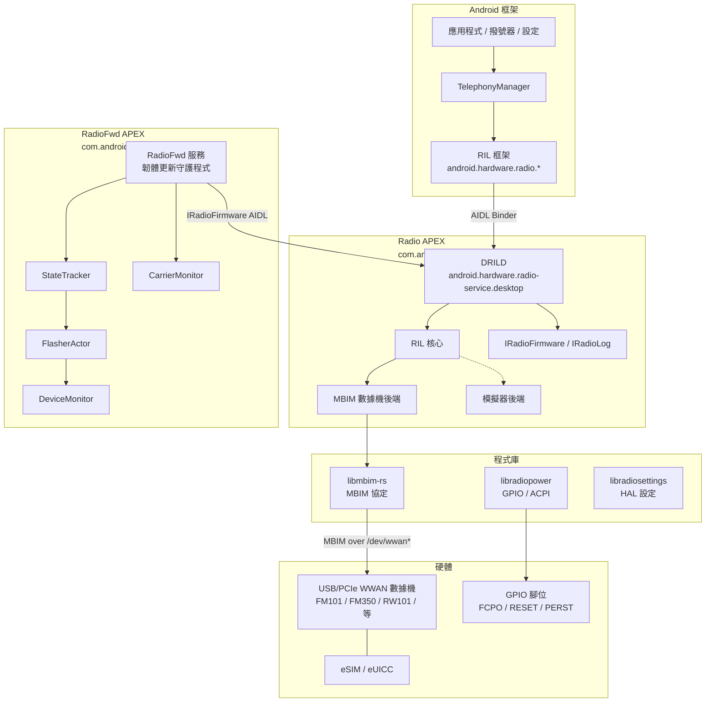
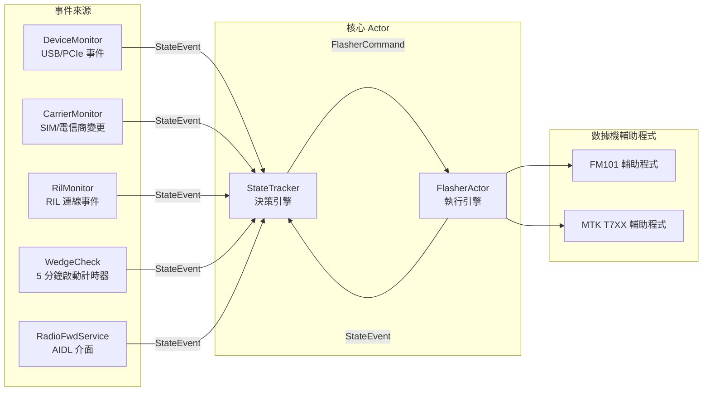
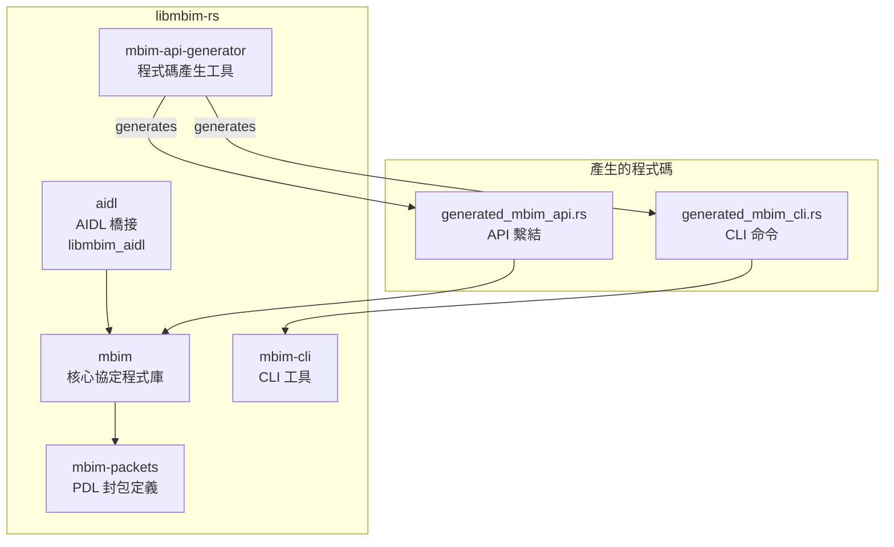
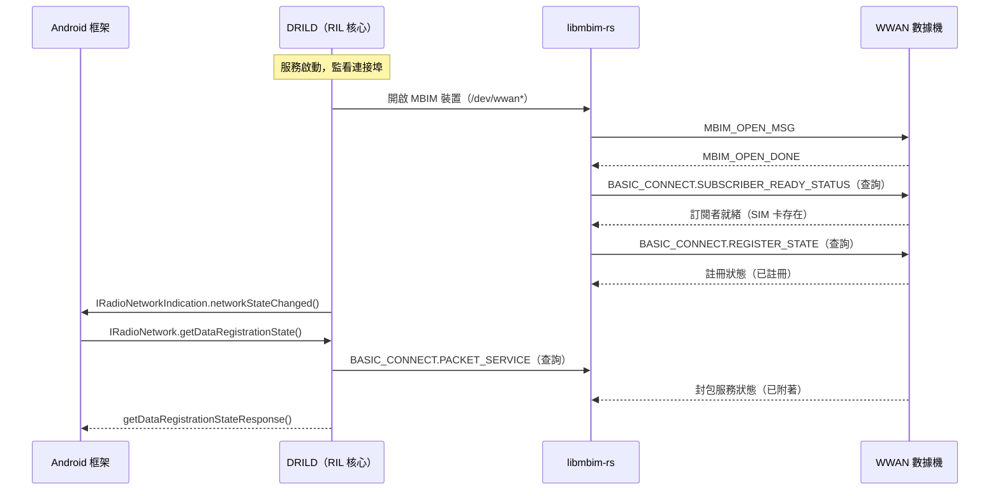
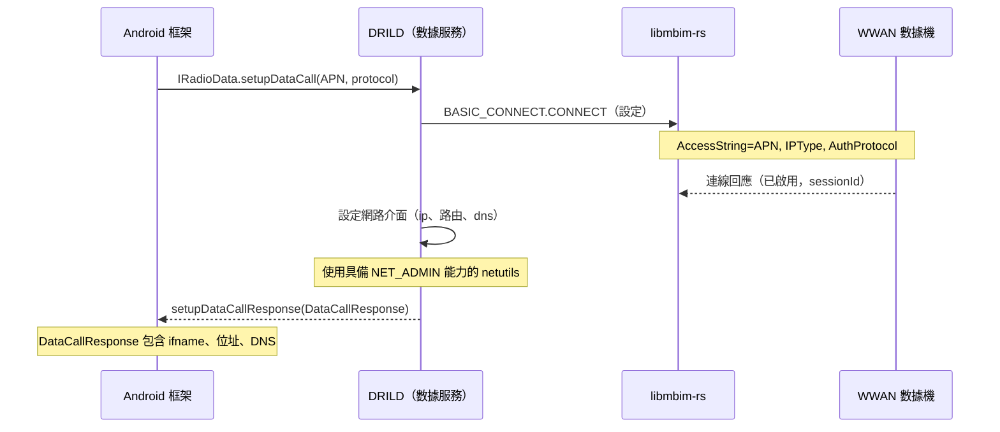
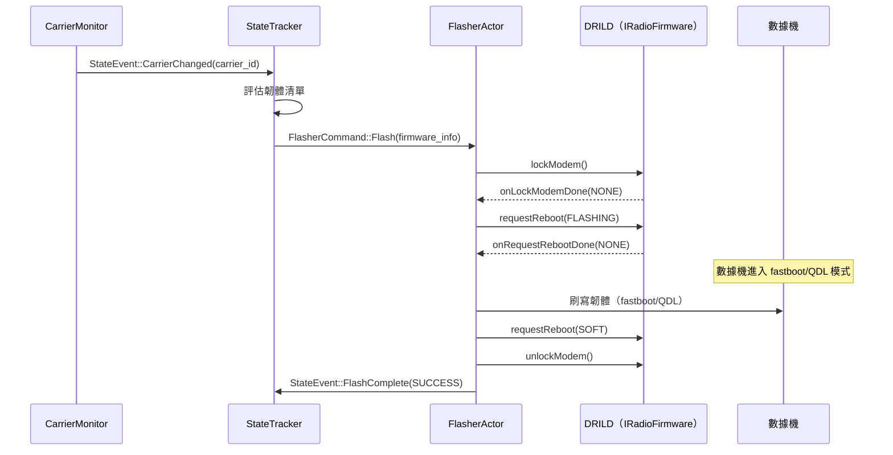
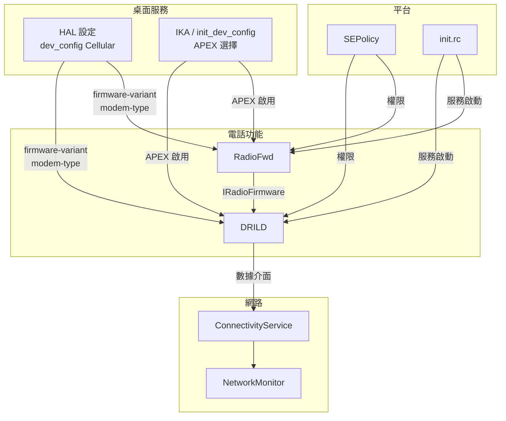

# 無線電/行動通訊與電話功能實作

## 1. 架構概述

Android 桌面平台實作了完整的行動通訊/電話堆疊，以 **DRILD**（Desktop Radio Interface Layer Daemon，桌面無線電介面層守護程式）和 **MBIM**（Mobile Broadband Interface Model，行動寬頻介面模型）協定為核心。與傳統 Android 手機使用基頻處理器搭配專有 RIL 不同，桌面平台透過標準化的 MBIM 協定與外部 USB/PCIe WWAN 數據機通訊，完全以 Rust 實作。



系統特色：

- **DRILD**：以 Rust 撰寫的 HAL 守護程式，取代傳統的 C/C++ `rild`，實作所有標準 Radio HAL AIDL 介面，以及桌面專用的韌體與日誌擴充功能。
- **RadioFwd**：伴隨守護程式，負責數據機韌體管理、電信商感知韌體切換，以及數據機生命週期操作（刷機、重設、復原）。
- **libmbim-rs**：純 Rust 的 MBIM 協定程式庫，透過 JSON API 定義進行程式碼產生。
- **APEX 封裝**：兩個守護程式分別封裝在獨立的 vendor APEX 模組中，可獨立更新。
- **eSIM/eUICC 支援**：透過 `EuiccGoogle` 和 `EuiccOverlay` 提供內建支援。

## 2. 主要元件

| 元件 | 類型 | 語言 | 位置 | 說明 |
|-----------|------|----------|----------|-------------|
| `android.hardware.radio-service.desktop` | HAL 守護程式 | Rust | `vendor/google/desktop/radio/drild/` | 實作 Radio HAL 的桌面 RIL 守護程式 |
| `android.hardware.radiofwd-service.desktop` | 服務 | Rust | `vendor/google/desktop/radio/radiofwd/` | 數據機韌體更新與生命週期守護程式 |
| `libmbim` | 程式庫 | Rust | `vendor/google/desktop/libs/libmbim-rs/mbim/` | MBIM 協定實作 |
| `libmbim_aidl` | 程式庫 | Rust | `vendor/google/desktop/libs/libmbim-rs/aidl/` | MBIM AIDL 橋接，供 CLI 工具使用 |
| `libradiopower` | 程式庫 | Rust | `vendor/google/desktop/radio/libs/libradiopower/` | GPIO/ACPI 數據機電源控制 |
| `libradiosettings` | 程式庫 | Rust | `vendor/google/desktop/radio/libs/libradiosettings/` | HAL 設定與裝置配置 |
| `rilcli` | 除錯工具 | Rust | `vendor/google/desktop/radio/drild/cli/` | RIL 命令列介面 |
| `mbim-cli` | 除錯工具 | Rust | `vendor/google/desktop/libs/libmbim-rs/mbim-cli/` | MBIM 命令列介面 |
| `rilfakeconfig` | 除錯工具 | Rust | `vendor/google/desktop/radio/drild/rilfakeconfig/` | 模擬器模式設定 |
| `modemlogger` | 除錯工具 | Rust | `vendor/google/desktop/radio/drild/modemlogger/` | 數據機日誌收集工具 |
| `radiofwdcli` | 除錯工具 | Rust | `vendor/google/desktop/radio/radiofwd/cli/` | RadioFwd 命令列介面 |
| `modb_to_android_converter` | 主機端工具 | Python | `vendor/google/desktop/radio/modb_converter/` | ChromeOS MODB 轉 Android APN 轉換器 |
| `EuiccGoogle` | 應用程式 | Java | （預先建置） | eSIM/eUICC 管理應用程式 |
| `CarrierConfigOverlayDesktop` | 覆蓋層 | XML | （預先建置） | 桌面專用電信商設定 |
| `qdl` | 工具程式 | 原生 | （預先建置） | Qualcomm 下載模式刷機工具 |

## 3. DRILD - 桌面無線電介面層守護程式

### 3.1 概述

DRILD（`android.hardware.radio-service.desktop`）是核心 Radio HAL 實作。完全以 Rust 撰寫，採用非同步 Tokio 執行環境，取代傳統的 C 語言 `rild`，直接實作 AOSP Radio AIDL 介面。

**原始碼位置**：`/mnt/nvme11/home/gaggery/ww04-fatcat-bkc/vendor/google/desktop/radio/drild/`

### 3.2 服務初始化

取自 `android.hardware.radio-service.desktop.rc`：
```
service vendor.dril-daemon /apex/com.android.hardware.radio.desktop/bin/android.hardware.radio-service.desktop
    class hal
    user radio
    group radio system
    capabilities NET_ADMIN
```

守護程式以 `radio` 使用者身分執行，具備 `NET_ADMIN` 能力以進行網路介面設定。

### 3.3 Radio HAL 介面（VINTF 清單）

DRILD 註冊以下 AIDL HAL 介面（取自 `android.hardware.radio-service.desktop.xml`）：

| 介面 | 版本 | 實例 | 說明 |
|-----------|---------|----------|-------------|
| `android.hardware.radio.config/IRadioConfig` | 3 | `default` | 無線電設定（SIM 卡槽、電話能力） |
| `android.hardware.radio.data/IRadioData` | 3 | `slot1` | 數據連線（APN、數據通話） |
| `android.hardware.radio.modem/IRadioModem` | 3 | `slot1` | 數據機狀態（電源、IMEI、基頻版本） |
| `android.hardware.radio.sim/IRadioSim` | 3 | `slot1` | SIM 卡操作（ICCID、IMSI、PIN） |
| `android.hardware.radio.network/IRadioNetwork` | 3 | `slot1` | 網路註冊、訊號、基地台資訊 |
| `android.hardware.radio.desktop.firmware/IRadioFirmware` | 1 | `default` | 桌面專用韌體操作 |
| `android.hardware.radio.desktop.log/IRadioLog` | 1 | `default` | 桌面專用數據機日誌 |
| `com.android.desktop.mbim/IMbimCommandExecutor` | 1 | `default` | 原始 MBIM 命令透通（除錯用） |

### 3.4 模組架構

取自 `src/main.rs`，DRILD 守護程式由以下模組組成：

| 模組 | 原始檔案 | 說明 |
|--------|------------|-------------|
| `ril_core` | `ril_core.rs` (103KB) | 中央協調器；管理數據機生命週期並分派請求 |
| `modem` | `modem.rs` (164KB) | 數據機抽象層 |
| `modem/modem_mbim` | `modem_mbim.rs` (228KB) | MBIM 專用數據機後端（最大的單一原始檔案） |
| `modem/modem_simulator` | `modem_simulator.rs` | 模擬器後端，用於無硬體的測試 |
| `network_service` | `network_service.rs` (70KB) | `IRadioNetwork` 實作 |
| `sim_service` | `sim_service.rs` (42KB) | `IRadioSim` 實作 |
| `data_service` | `data_service.rs` (19KB) | `IRadioData` 實作 |
| `modem_service` | `modem_service.rs` (16KB) | `IRadioModem` 實作 |
| `config_service` | `config_service.rs` (13KB) | `IRadioConfig` 實作 |
| `firmware_service` | `firmware_service.rs` | `IRadioFirmware` 實作 |
| `log_service` | `log_service.rs` | `IRadioLog` 實作 |
| `queue_manager` | `queue_manager.rs` (47KB) | 請求佇列與序列化 |
| `port_info` | `port_info.rs` (23KB) | 數據機連接埠探索與監控 |
| `arfcn` | `arfcn.rs` (22KB) | ARFCN（絕對無線電頻道編號）處理 |
| `sim_io_request` | `sim_io_request.rs` | SIM I/O 請求處理 |
| `sim_filesystem` | `sim_filesystem.rs` | SIM 檔案系統（EF/DF）導覽 |
| `bertlv` | `bertlv.rs` | BER-TLV 編碼/解碼，用於 SIM APDU |
| `fibocom_helper` | `fibocom_helper.rs` | Fibocom 數據機專用輔助程式 |
| `modem_power_controller` | `modem_power_controller.rs` | 數據機電源狀態管理 |
| `response_helper` | `response_helper.rs` | 無線電回應建構輔助程式 |
| `mbimcli_service` | `mbimcli_service.rs` | MBIM CLI AIDL 服務（僅限除錯版本） |

### 3.5 雙模式運作

DRILD 支援兩種在執行階段決定的運作模式：

```rust
fn should_use_simulator_mode() -> bool {
    cfg!(feature = "simulator_mode") || {
        // Check sysprop: persist.vendor.desktop.radio.force-simulator-mode
    }
}
```

1. **MBIM 模式**（正式環境）：透過 `/dev/wwan*` 字元裝置使用 MBIM 協定與真實 WWAN 數據機通訊。
2. **模擬器模式**（測試用）：執行軟體模擬數據機，用於無實體硬體的開發與測試。可在執行階段透過系統屬性強制啟用。

### 3.6 自訂 AIDL 介面

#### IRadioFirmware

桌面專用韌體 HAL，用於數據機韌體管理：

```
oneway interface IRadioFirmware {
    void lockModem(in IRadioFirmwareCallback callback);
    void unlockModem(in IRadioFirmwareCallback callback);
    void getCarrier(in IRadioFirmwareCallback callback);
    void getFwVersions(in IRadioFirmwareCallback callback);
    void requestReboot(in RebootType reboot_type, in IRadioFirmwareCallback callback);
}
```

**RebootType** 列舉：
- `SOFT` -- 數據機正常自行重新啟動
- `HARD` -- 透過 GPIO 強制重新啟動
- `FLASHING` -- 重新啟動進入刷機模式
- `RECOVERY` -- 重新啟動進入復原模式

**FirmwareError** 列舉：`NONE`、`SYSTEM_ERR`

#### IRadioLog

桌面專用數據機日誌 HAL：

```
oneway interface IRadioLog {
    void setLogging(in boolean enable, in IRadioLogCallback callback);
}
```

**LogError** 列舉：`NONE`、`MODEM_NOT_SUPPORTED`、`MODEM_NOT_AVAILABLE`、`MODEM_ERR`、
`INTERNAL_ERR`、`CANCELLED`、`ABORTED`

## 4. RadioFwd - 無線電轉發服務

### 4.1 概述

RadioFwd（`android.hardware.radiofwd-service.desktop`）是數據機韌體更新與生命週期管理守護程式。它監控數據機狀態與電信商變更，並使用基於 Actor 的架構協調韌體刷機操作。

**原始碼位置**：`/mnt/nvme11/home/gaggery/ww04-fatcat-bkc/vendor/google/desktop/radio/radiofwd/`

### 4.2 服務初始化

取自 `android.hardware.radiofwd-service.rc`：
```
service radiofwd /apex/com.android.hardware.radiofwd/bin/android.hardware.radiofwd-service.desktop
    class hal
    user radio
    group radio system wakelock usb dialout
```

額外的群組成員資格：
- `system`：GPIO 腳位互動
- `wakelock`：刷機期間取得喚醒鎖
- `usb`：USB 端點互動
- `dialout`：TTY 裝置互動

### 4.3 架構

RadioFwd 使用基於 Actor 的架構，包含兩個透過通道通訊的主要 Actor：



### 4.4 模組架構

| 模組 | 原始檔案 | 說明 |
|--------|------------|-------------|
| `state_tracker` | `state_tracker.rs` (24KB) | 中央決策引擎；接收事件、發出命令 |
| `flasher` | `flasher.rs` (16KB) | 韌體刷機執行 Actor |
| `device_monitor` | `device_monitor.rs` (26KB) | USB/PCIe 裝置列舉與熱插拔監控 |
| `carrier_monitor` | `carrier_monitor.rs` (15KB) | SIM 卡與電信商變更偵測 |
| `ril_monitor` | `ril_monitor.rs` (9KB) | RIL 服務連線監控 |
| `fastboot_client` | `fastboot_client.rs` (15KB) | Fastboot 協定客戶端，用於數據機刷機 |
| `fastboot_transport` | `fastboot_transport.rs` (10KB) | Fastboot USB 傳輸層 |
| `fastboot_helper` | `fastboot_helper.rs` (6KB) | Fastboot 協定輔助程式 |
| `qdl_helper` | `qdl_helper.rs` (6KB) | Qualcomm 下載模式輔助程式 |
| `modem_helper` | `modem_helper.rs` (14KB) | 數據機類型專用輔助特徵與工廠 |
| `modem_helper/fm101_helper` | `fm101_helper.rs` (14KB) | Fibocom FM101 數據機專用邏輯 |
| `modem_helper/mtk_t7xx_helper` | `mtk_t7xx_helper.rs` (10KB) | MediaTek T7XX（FM350/RW350）數據機邏輯 |
| `parsed_firmware_manifest` | `parsed_firmware_manifest.rs` (25KB) | Protobuf 韌體清單解析器 |
| `radiofwd_service` | `radiofwd_service.rs` (10KB) | AIDL 服務實作 |
| `ril_client` | `ril_client.rs` (3KB) | DRILD 的 IRadioModem/IRadioSim 客戶端 |
| `ril_firmware_client` | `ril_firmware_client.rs` (8KB) | DRILD 的 IRadioFirmware 客戶端 |
| `sysfs_util` | `sysfs_util.rs` (8KB) | Sysfs 屬性讀寫工具 |
| `sigterm_listener` | `sigterm_listener.rs` (5KB) | 優雅的 SIGTERM 關閉處理 |
| `wakelock_guard` | `wakelock_guard.rs` (3KB) | RAII 喚醒鎖管理 |
| `modem_lock_guard` | `modem_lock_guard.rs` (2KB) | RAII 數據機鎖管理 |

### 4.5 IRadioFwdService AIDL 介面

```
oneway interface IRadioFwdService {
    void flash(in String carrier, in IRadioFwdServiceCallback callback);
    void reset(in IRadioFwdServiceCallback callback);
}
```

**RadioFwdErrorCode** 列舉值：
`UNKNOWN`、`IO`、`MANIFEST_PARSE`、`MANIFEST_VALIDATION`、`VARIANT_NOT_FOUND`、
`FIRMWARE_FILE_NOT_FOUND`、`BINDER_COMMUNICATION`、`DEVICE_NOT_AVAILABLE`、`DEVICE_TIMEOUT`、
`FLASH_IN_PROGRESS`、`EXTERNAL_COMMAND`、`FASTBOOT`、`MODEM_LOCK`、`MODEM_COMMUNICATION`、
`WAKELOCK`、`MISSING_DEVICE_ID`、`DEVICE_MONITOR_SETUP`、`RADIO_POWER`、`ACTOR_SEND`、
`UNKNOWN_MODEM_TYPE`、`TERMINATED`、`SUCCESS`、`UNSUPPORTED_OPERATION`

### 4.6 韌體清單（Protobuf）

韌體套件由 protobuf 清單（`firmware_manifest.proto`）描述：

```protobuf
message FirmwareManifest {
    repeated Device device = 1;
}

message Device {
    string variant = 1;
    string default_main_firmware_version = 2;
    string recovery_directory = 3;
    repeated MainFirmware main_firmware = 4;
    repeated CarrierFirmware carrier_firmware = 5;
}

message MainFirmware {
    string filename = 1;
    string version = 2;
    repeated AssociatedFirmware assoc_firmware = 3;
    string dirname = 4;
}

message CarrierFirmware {
    string filename = 1;
    repeated string carrier_id = 2;
    string version = 3;
    string main_firmware_version = 4;
    string dirname = 5;
}
```

韌體檔案安裝位置：`/apex/com.android.hardware.radiofirmware/etc/firmware/`

### 4.7 卡死偵測

RadioFwd 包含數據機「卡死」偵測機制，在啟動後 5 分鐘觸發：

```rust
const WEDGE_CHECK_STARTUP_TIMEOUT: Duration = Duration::from_secs(5 * 60);
```

如果數據機在此逾時後仍未正確註冊，StateTracker 將啟動復原動作。

## 5. MODB 轉換器

**原始碼位置**：`/mnt/nvme11/home/gaggery/ww04-fatcat-bkc/vendor/google/desktop/radio/modb_converter/`

MODB（Mobile Operator Database，行動電信商資料庫）轉換器是主機端的 Python 工具，將 ChromeOS 行動電信商資料庫轉換為 Android 的 APN XML 格式。

### 5.1 建置

```bash
m modb_to_android_converter
```

### 5.2 使用方式

```bash
modb_to_android_converter \
    <path/to/serviceproviders.textproto> \
    <path/to/carriers.csv> \
    <path/to/output/apn-conf.xml> \
    <number_of_lines_to_process>
```

此工具讀取：
- **serviceproviders.textproto**：ChromeOS 行動電信商資料庫
- **carriers.csv**：來自使用數據的電信商 UUID 和 MCCMNC 列表

輸出：Android 格式的 `apns-conf.xml`，包含電信商 APN 定義。

### 5.3 建置定義

```
python_binary_host {
    name: "modb_to_android_converter",
    srcs: ["modb_to_android_converter.py"],
    main: "modb_to_android_converter.py",
    libs: ["libprotobuf-python"],
}
```

## 6. 無線電程式庫（libs/）

### 6.1 libradiopower

**原始碼位置**：`/mnt/nvme11/home/gaggery/ww04-fatcat-bkc/vendor/google/desktop/radio/libs/libradiopower/`

提供基於 GPIO 和 ACPI 的數據機電源控制。此程式庫為不同的開發板和數據機組合抽象化硬體專用的電源時序。

#### 支援的操作

| 操作 | 說明 |
|-----------|-------------|
| `initialize()` | 初始化裝置設定與 GPIO 腳位 |
| `power_on()` | 透過 GPIO 時序開啟數據機電源 |
| `power_off()` | 透過 GPIO 關閉數據機電源 |
| `reset()` | 重設數據機（GPIO 或 ACPI sysfs） |
| `reset_into_fastboot()` | 透過 ACPI sysfs 重設進入 fastboot 模式 |
| `warm_boot()` | 透過 GPIO 暖開機數據機 |
| `shutdown()` | 完全關閉數據機 |

#### 開發板專用 GPIO 設定

| 開發板 | 晶片 | W_DISABLE | SAR_DETECT | ENABLE | FCPO | RESET | PERST |
|-------|------|-----------|------------|--------|------|-------|-------|
| `corsola` | `/dev/gpiochip0` | 178 | 179 | 180 | 181 | 182 | -- |
| `brya` | `/dev/gpiochip0` | -- | -- | 76 | 309 | 336 | 320 |
| `crota`（brya 變體） | `/dev/gpiochip0` | -- | -- | 76 | 83 | 84 | -- |

#### 數據機延遲設定

| 數據機類型 | RESET->FCPO | FCPO->RESET | VCC->FCPO | RESET 脈衝 | FCPO 脈衝 |
|------------|-------------|-------------|-----------|-------------|------------|
| EM060、LCUK54 | 100ms | 1000ms | 2ms | 500ms | 200ms |
| FM101、RW101、RW135 | 10ms | 20ms | 2ms | 10ms | 500ms |
| FM350、RW350 | 10ms | 20ms | 2ms | 10ms | 500ms |

#### 電源控制策略

- **USB 數據機**（FM101、RW101、RW135、EM060、LCUK54）：GPIO 控制電源與重設
- **PCIe 數據機**（FM350、RW350）：ACPI/驅動程式控制重設；無 GPIO 電源控制

### 6.2 libradiosettings

**原始碼位置**：`/mnt/nvme11/home/gaggery/ww04-fatcat-bkc/vendor/google/desktop/radio/libs/libradiosettings/`

提供單例 `Settings` 結構體，在啟動時從 HAL 設定和系統屬性初始化。

#### Settings 欄位

| 欄位 | 來源 | 說明 |
|-------|--------|-------------|
| `board_name` | `ro.product.name` | 開發板識別碼（例如 "brya"、"corsola"） |
| `model_name` | `ro.boot.product.vendor.sku`（前綴） | 型號名稱（例如 "redrix"、"ponyta"） |
| `sku_id` | `ro.boot.product.vendor.sku`（後綴） | SKU 識別碼（例如 "262402"） |
| `firmware_variant` | HAL 設定 `Cellular/firmware-variant` | 韌體變體字串 |
| `modem_type` | HAL 設定 `Cellular/modem-type` | 數據機類型列舉 |

#### 支援的數據機類型

| 列舉 | 數據機 | 介面 |
|------|-------|-----------|
| `EM060` | Quectel EM060 | USB |
| `FM101` | Fibocom FM101 | USB |
| `FM350` | Fibocom FM350 | PCIe (T7XX) |
| `LCUK54` | NetPrisma LCUK54 | USB |
| `RW101` | RollingWireless RW101 | USB |
| `RW135` | RollingWireless RW135 | USB |
| `RW350` | RollingWireless RW350 | PCIe (T7XX) |

#### 支援的開發板

目前支援的行動通訊設定查詢開發板名稱：`brya`、`corsola`。

## 7. MBIM 協定支援（libmbim-rs）

### 7.1 概述

**原始碼位置**：`/mnt/nvme11/home/gaggery/ww04-fatcat-bkc/vendor/google/desktop/libs/libmbim-rs/`

`libmbim-rs` 是 MBIM（Mobile Broadband Interface Model）協定的純 Rust 實作。它提供 DRILD 與 WWAN 數據機硬體之間的傳輸層。

### 7.2 程式庫結構



### 7.3 核心程式庫模組

取自 `mbim/src/lib.rs`：

| 模組 | 說明 |
|--------|-------------|
| `api` | 高階 MBIM API（從 JSON 定義產生） |
| `device` | MBIM 裝置抽象與命令執行器 |
| `transport` | 透過檔案描述符的原始 MBIM 傳輸 |
| `file_transport` | 基於檔案的傳輸實作 |
| `message` | MBIM 訊息編碼/解碼 |
| `fragment` | MBIM 訊息分段/重組 |
| `information_buffer` | MBIM 資訊緩衝區序列化 |
| `cancellation` | 命令取消支援 |
| `cli` | CLI 支援工具 |
| `error` | 錯誤類型 |
| `private_info` | 隱私感知日誌（依建置變體條件啟用） |
| `version` | MBIM 協定版本處理 |

### 7.4 MBIM API JSON 定義

MBIM API 透過 `mbim/mbim_api_json/` 中的 JSON 檔案定義：

| JSON 檔案 | MBIM 服務 |
|-----------|--------------|
| `basic_connect.json` (38KB) | 核心連線（附著、註冊、連線） |
| `basic_connect_v2.json` | Basic Connect v2 擴充 |
| `basic_connect_v3.json` | Basic Connect v3 擴充 |
| `ms_basic_connect_extensions.json` (30KB) | Microsoft 擴充（已佈建的上下文、LTE 附著） |
| `ms_basic_connect_extensions_v2.json` | MS 擴充 v2 |
| `ms_basic_connect_extensions_v3.json` (13KB) | MS 擴充 v3（5G、URSP） |
| `ms_uicc_low_level.json` (15KB) | UICC/SIM 卡底層操作 |
| `sms.json` | SMS 傳送/接收 |
| `auth.json` | 驗證（AKA、AKAP、SIM） |
| `atds.json` | AT 裝置服務 |
| `sar.json` | SAR（特定吸收率） |
| `qdu.json` | Qualcomm 裝置更新 |
| `ms_voice_extensions.json` | 語音通話擴充 |
| `ms_host_shutdown.json` | 主機關閉通知 |
| `fibocom.json` | Fibocom 廠商專用命令 |
| `google.json` | Google 廠商專用命令 |
| `intel_firmware_update.json` | Intel 韌體更新 |
| `intel_firmware_update_v2.json` | Intel 韌體更新 v2 |
| `intel_tools.json` | Intel 診斷工具 |

### 7.5 MBIM AIDL 介面

`IMbimCommandExecutor` AIDL 介面允許外部工具（如 `mbim-cli`）透過 DRILD 傳送原始 MBIM 命令：

```
interface IMbimCommandExecutor {
    CommandResponseResult sendCommandMessage(
        in CommandMetadata metadata, in byte[] informationBuffer);
}

parcelable CommandMetadata {
    String deviceServiceId;   // 裝置服務的 UUID
    MbimExVersion version;    // MBIM 擴充版本
    int cid;                  // 命令 ID
    CommandType commandType;  // QUERY 或 SET
}

parcelable CommandResponse {
    int statusCode;
    byte[] informationBuffer;
}
```

### 7.6 建置與測試

```bash
# 建置所有目標
mmm vendor/google/desktop/libs/libmbim-rs

# 執行單元測試
atest libmbim_test libmbim_packets_test libmbim_api_generator_test libmbim_aidl_test

# 模糊測試
cargo fuzz run mbim_fuzzer  # （從 mbim/fuzz/ 目錄）
```

## 8. eSIM/eUICC 支援

桌面平台包含完整的 eSIM 支援：

### 8.1 套件

取自 `radio.mk`：
```makefile
PRODUCT_PACKAGES += EuiccGoogle
PRODUCT_PACKAGES += EuiccOverlay
```

- **EuiccGoogle**：Google 的 eSIM 管理應用程式（設定檔下載、啟用、管理）
- **EuiccOverlay**：桌面專用的 eSIM UI 自訂覆蓋層

### 8.2 恢復原廠設定行為

```makefile
PRODUCT_PRODUCT_PROPERTIES += \
    masterclear.allow_retain_esim_profiles_after_fdr=true
```

恢復原廠設定後 eSIM 設定檔會**保留**，允許使用者在裝置重設後保留其行動通訊方案。

### 8.3 VINTF 宣告

Radio APEX 透過預先建置的功能檔案宣告 eSIM 能力：
```
prebuilts: [
    "android.hardware.telephony.euicc.prebuilt.xml",
],
```

### 8.4 SIM I/O 實作

DRILD 包含完整的 SIM I/O 支援：

- `sim_service.rs` (42KB) -- 完整的 `IRadioSim` 實作
- `sim_io_request.rs` -- SIM I/O 請求處理
- `sim_filesystem.rs` -- SIM 檔案系統（EF/DF）導覽
- `bertlv.rs` -- BER-TLV 編碼/解碼，用於 SIM APDU
- `modem/sim_io_engine.rs` (30KB) -- SIM I/O 執行引擎
- `modem/sim_io_engine/command_apdu.rs` (27KB) -- Command APDU 建構
- `modem/modem_mbim/sim_io.rs` (18KB) -- MBIM 專用 SIM I/O

## 9. APN 設定

**檔案**：`/mnt/nvme11/home/gaggery/ww04-fatcat-bkc/vendor/google/desktop/radio/apns-conf-data-only.xml`

平台出貨時附帶純數據 APN 設定（無 MMS、無語音 APN 類型），針對桌面使用情境。該檔案安裝至 `product/etc/apns-conf.xml`。

### 9.1 已設定的電信商

| 電信商 | 電信商 ID | APN | 協定 | 類型 |
|---------|-----------|-----|----------|------|
| T-Mobile US | 1 | `fast.t-mobile.com` | IPV4V6 | default |
| Telefonica ES | 34 | `telefonica.es` | IPV4V6 | default |
| Movistar（USB 數據機） | 34 | `movistar.es` | IPV4V6 | default |
| NTT docomo SP Mode | 850 | `spmode.ne.jp` | IPV4V6 | default,ia |
| NTT docomo mopera U | 850 | `mopera.net` | IPV4V6 | default,ia |
| AT&T Broadband | 1187 | `broadband` | IPV4V6 | default,ia |
| Rogers Internet | 1403 | `ltemobile.apn` | IPV4V6 | default,ia |
| Telus Internet | 1404 | `isp.telus.com` | IPV4V6 | default |
| Telus Mobile Web | 1404 | `sp.telus.com` | IPV4V6 | default |
| Verizon IMS | 1839 | `ims` | IPV4V6 | ia |
| Verizon Internet | 1839 | `vzwinternet` | IPV4V6 | default |
| DT（電信商 1911） | 1911 | `internet` | IPV4V6 | default,ia |
| DT 僅 IPv6 | 1911 | `internet-ipv6` | IPV6 | default,ia |
| DT 僅 IPv4 | 1911 | `internet-ipv4` | IP | default,ia |
| h2g2（測試用） | 10014 | `h2g2` | IPV4V6 | default |
| Rogers 5G Internet | 10025 | `mobile.apn` | IPV4V6 | default |

### 9.2 APN 產生

APN 是使用 `modb_to_android_converter` 工具從 ChromeOS MODB 資料產生的，該工具從 ChromeOS 指標數據中對應使用量最高的電信商。

## 10. APEX 封裝

### 10.1 Radio APEX（`com.android.hardware.radio.desktop`）

| 屬性 | 值 |
|----------|-------|
| 名稱 | `com.android.hardware.radio.desktop` |
| 版本 | 1 |
| Vendor | true |
| 可更新 | false |
| 金鑰 | `com.android.hardware.key` |
| 憑證 | `com.android.hardware.certificate` |

**內容（正式版建置）**：
- `bin/android.hardware.radio-service.desktop`
- `etc/vintf/android.hardware.radio-service.desktop.xml`
- Init 腳本：`android.hardware.radio-service.desktop.rc`

**內容（userdebug/eng 額外內容）**：
- `bin/rilcli`
- `bin/rilfakeconfig`
- `bin/mbim-cli`
- `bin/modemlogger`

**覆蓋**（取代舊版 RIL 實作）：
- `libril`、`libreference-ril`、`rild`
- `libril-modem-lib`、`libcuttlefish-rild`、`libcuttlefish-ril-2`、`libril_intermediates`

**預先建置的功能宣告**：
- `android.hardware.telephony.data.prebuilt.xml`
- `android.hardware.telephony.euicc.prebuilt.xml`

**SELinux 檔案上下文**（`apex/file_contexts`）：
```
/bin/android\.hardware\.radio-service\.desktop     u:object_r:hal_radio_default_exec:s0
/bin/rilcli                                        u:object_r:hal_radio_default_exec:s0
/bin/mbim-cli                                      u:object_r:hal_radio_default_exec:s0
/bin/rilfakeconfig                                 u:object_r:hal_radio_default_exec:s0
/bin/modemlogger                                   u:object_r:hal_radio_default_exec:s0
```

#### 空 APEX 變體

空 APEX `com.android.hardware.radio.desktop.empty` 用於 IKA（Image Kernel Architecture）驗證 -- 確保 APEX 選擇邏輯能根據硬體能力正確啟用/停用 Radio APEX。

### 10.2 RadioFwd APEX（`com.android.hardware.radiofwd`）

| 屬性 | 值 |
|----------|-------|
| 名稱 | `com.android.hardware.radiofwd` |
| 版本 | 1 |
| Vendor | true |
| 可更新 | false |
| 金鑰 | `com.android.hardware.key` |

**內容（正式版建置）**：
- `bin/android.hardware.radiofwd-service.desktop`
- 服務清單：`android.hardware.radiofwd-service.xml`
- Init 腳本：`android.hardware.radiofwd-service.rc`

**內容（userdebug/eng 額外內容）**：
- `bin/radiofwdcli`

**SELinux 檔案上下文**：
```
/bin/android\.hardware\.radiofwd-service\.desktop   u:object_r:radiofwd_exec:s0
/bin/radiofwdcli                                    u:object_r:radiofwdcli_exec:s0
```

### 10.3 Radio 韌體 APEX（`com.android.hardware.radiofirmware`）

第三個 APEX（不在此原始碼樹中定義但有被參照）包含數據機韌體二進位檔案：
- 路徑：`/apex/com.android.hardware.radiofirmware/etc/`
- 韌體檔案：`/apex/com.android.hardware.radiofirmware/etc/firmware/`
- 清單：protobuf 定義的 `FirmwareManifest`

## 11. 資料流

### 11.1 數據機註冊序列



### 11.2 數據連線建立



### 11.3 韌體更新流程



## 12. 設定

### 12.1 radio.mk

**檔案**：`/mnt/nvme11/home/gaggery/ww04-fatcat-bkc/vendor/google/desktop/radio/radio.mk`

#### Soong 設定變數（僅限 userdebug/eng）

| 設定命名空間 | 變數 | 用途 |
|-----------------|----------|---------|
| `desktop_radio_features` | `with_rilcli` | 包含 `rilcli` 除錯工具 |
| `desktop_radio_features` | `with_rilfakeconfig` | 包含 `rilfakeconfig` 模擬器設定工具 |
| `desktop_radio_features` | `with_mbimcli` | 包含 `mbim-cli` 除錯工具 |
| `desktop_radio_features` | `with_modemlogger` | 包含 `modemlogger` 日誌收集工具 |
| `desktop_radio_features` | `with_private_info` | 啟用日誌中未遮蔽的私人資訊 |
| `desktop_radio_features` | `with_radiofwdcli` | 包含 `radiofwdcli` 除錯工具 |

#### DRILD Soong 設定變數

| 變數 | 功能旗標 | 效果 |
|----------|-------------|--------|
| `with_simulator_mode` | `simulator_mode` | 編譯模擬器後端 |
| `with_verbose_logging` | `enable_verbose_logging` | 啟用詳細日誌 |
| `with_mbimcli` | `mbimcli` | 啟用 MBIM CLI AIDL 服務 + `libmbim_aidl` |
| `with_private_info` | `enable_private_info` | 記錄未遮蔽的 IMSI、ICCID 等 |

### 12.2 系統屬性

| 屬性 | 類型 | 說明 |
|----------|------|-------------|
| `persist.vendor.desktop.radio.force-simulator-mode` | bool | 在真實硬體上強制使用模擬器模式 |
| `persist.vendor.desktop.radio.simulator-values.*` | string | 模擬器設定值 |
| `ro.product.name` | string | 用於 GPIO 設定查詢的開發板名稱 |
| `ro.boot.product.vendor.sku` | string | 用於裝置識別的 Model_SKU |
| `ro.boot.product.hardware.sku` | string | 備用 SKU 屬性（corsola） |
| `ro.boot.vendor.apex.com.android.hardware.radio.desktop` | string | APEX 啟用狀態 |
| `ro.boot.vendor.apex.com.android.hardware.radiofirmware` | string | 韌體 APEX 啟用狀態 |
| `ro.boot.vendor.apex.com.android.hardware.radiofwd` | string | RadioFwd APEX 啟用狀態 |

### 12.3 除錯工具

#### rilcli

DRILD 的互動式命令列工具。提供所有 Radio HAL 操作的子命令：
- `rilcli_config.rs` (18KB) -- IRadioConfig 命令
- `rilcli_data.rs` (31KB) -- IRadioData 命令
- `rilcli_network.rs` (75KB) -- IRadioNetwork 命令
- `rilcli_sim.rs` (55KB) -- IRadioSim 命令
- `rilcli_modem.rs` (24KB) -- IRadioModem 命令
- `rilcli_firmware.rs` (8KB) -- IRadioFirmware 命令
- `rilcli_log.rs` (2KB) -- IRadioLog 命令
- `rilcli_status.rs` (20KB) -- 狀態與資訊查詢

#### rilfakeconfig

透過系統屬性設定模擬器模式：
```bash
rilfakeconfig enable-simulator    # 啟用模擬器模式
rilfakeconfig disable-simulator   # 停用模擬器模式
rilfakeconfig set iccid <value>   # 設定假 ICCID
rilfakeconfig set imsi <value>    # 設定假 IMSI
rilfakeconfig set imei <value>    # 設定假 IMEI
rilfakeconfig set svn <value>     # 設定假 SVN
rilfakeconfig set serving-mcc <value>  # 設定服務 MCC
rilfakeconfig set serving-mnc <value>  # 設定服務 MNC
```

#### modemlogger

透過 IRadioLog 介面收集數據機診斷日誌。支援使用 T7XX 除錯中繼通道（`/sys/kernel/debug/wwan/wwan0/mtk_t7xx/relay_ch0`）的 FM350/RW350 數據機：

```bash
modemlogger --output-dir /data/local/tmp/modem_logs/
```

#### radiofwdcli

透過 IRadioFwdService 介面執行數據機韌體操作：
- 為特定電信商刷寫韌體
- 重設數據機硬體

#### mbim-cli

透過 DRILD 的 `IMbimCommandExecutor` AIDL 服務傳送原始 MBIM 命令，用於底層數據機除錯。

## 13. 建置整合

### 13.1 PRODUCT_PACKAGES

取自 `radio.mk`，以下套件包含在每個建置中：

```makefile
PRODUCT_PACKAGES += com.android.hardware.radio.desktop   # Radio HAL APEX
PRODUCT_PACKAGES += com.android.hardware.radiofwd         # RadioFwd APEX
PRODUCT_PACKAGES += EuiccGoogle                           # eSIM 應用程式
PRODUCT_PACKAGES += EuiccOverlay                          # eSIM UI 覆蓋層
PRODUCT_PACKAGES += CarrierConfig                         # 電信商設定
PRODUCT_PACKAGES += CarrierConfigOverlayDesktop           # 桌面電信商覆蓋層
PRODUCT_PACKAGES += qdl                                   # QDL 刷機工具
```

### 13.2 PRODUCT_COPY_FILES

```makefile
PRODUCT_COPY_FILES += \
    vendor/google/desktop/radio/apns-conf-data-only.xml:$(TARGET_COPY_OUT_PRODUCT)/etc/apns-conf.xml
```

### 13.3 相容性矩陣

```makefile
DEVICE_PRODUCT_COMPATIBILITY_MATRIX_FILE += \
    vendor/google/desktop/radio/android.hardware.radio-service.desktop.compat.xml
```

此宣告以下可選的框架端 HAL 預期：

| HAL | 介面 | 實例 |
|-----|-----------|----------|
| `android.hardware.radio.desktop.firmware` v1 | `IRadioFirmware` | default |
| `android.hardware.radio.desktop.log` v1 | `IRadioLog` | default |
| `com.android.desktop.mbim` v1 | `IMbimCommandExecutor` | default |

### 13.4 Rust 依賴

DRILD 連結以下主要 Rust crate：

| Crate | 用途 |
|-------|---------|
| `android.hardware.radio-V5-rust` | Radio HAL AIDL 繫結 |
| `android.hardware.radio.config-V5-rust` | Radio Config AIDL |
| `android.hardware.radio.data-V5-rust` | Radio Data AIDL |
| `android.hardware.radio.modem-V5-rust` | Radio Modem AIDL |
| `android.hardware.radio.network-V5-rust` | Radio Network AIDL |
| `android.hardware.radio.sim-V5-rust` | Radio SIM AIDL |
| `libmbim` | MBIM 協定程式庫 |
| `libradiopower` | GPIO/ACPI 數據機電源 |
| `libradiosettings` | 裝置設定 |
| `libbinder_rs` / `libbinder_tokio_rs` | Binder IPC |
| `libtokio` | 非同步執行環境 |
| `libnix` | Unix 系統呼叫 |
| `libueventd` | Uevent 監控 |
| `libinotify` | 檔案系統變更監控 |
| `libchrono` | 日期/時間處理（NITZ） |
| `libatrace_rust` | Perfetto 追蹤 |

## 14. 子系統間依賴

### 14.1 連線堆疊



### 14.2 桌面服務依賴

| 依賴 | 方向 | 說明 |
|------------|-----------|-------------|
| HAL 設定（`halconfig_rust`） | Settings -> HAL Config | 讀取 `Cellular/firmware-variant` 和 `Cellular/modem-type` |
| IKA（APEX 選擇） | Boot -> APEX | `init_dev_config` 根據 `dev_config Cellular modem-type` 選擇 Radio APEX |
| ConnectivityService | DRILD -> 框架 | DRILD 啟動的數據介面由 ConnectivityService 管理 |
| CarrierConfig | 框架 -> DRILD | 電信商專用設定套用至電話堆疊 |
| Suspend Service | RadioFwd -> 系統 | 韌體刷機期間持有喚醒鎖 |

### 14.3 硬體依賴

| 元件 | 介面 | 使用者 |
|-----------|-----------|---------|
| WWAN 裝置（`/dev/wwan*`） | MBIM 字元裝置 | DRILD |
| GPIO 晶片（`/dev/gpiochip0`） | GPIO cdev | DRILD、RadioFwd |
| USB 裝置（`/dev/bus/usb/*`） | USB | RadioFwd（fastboot、QDL） |
| TTY 裝置（`/dev/ttyUSB*`） | 序列埠 | RadioFwd |
| T7XX sysfs（`sysfs_t7xx`） | Sysfs | DRILD、RadioFwd |
| T7XX 除錯中繼 | debugfs | modemlogger |

## 15. SEPolicy

### 15.1 hal_radio_default（DRILD）

**檔案**：`/mnt/nvme11/home/gaggery/ww04-fatcat-bkc/device/google/desktop/common/sepolicy/hal_radio_default.te`

主要權限：
- **裝置存取**：讀取/搜尋裝置目錄，存取無線電裝置和字元/區塊檔案
- **GPIO**：對 `gpiochip_device` 進行開啟/ioctl/讀取/寫入
- **T7XX sysfs**：讀寫 `sysfs_t7xx` 以控制數據機驅動程式
- **網路工具**：執行 `netutils_wrapper` 進行介面設定
- **Proc net**：讀寫 `/proc/sys/net/ipv[46]/conf/*` 進行網路調校
- **Binder**：使用 vendor binder（`vndbinder_use`）

### 15.2 radiofwd

**檔案**：`/mnt/nvme11/home/gaggery/ww04-fatcat-bkc/device/google/desktop/common/sepolicy/radiofwd.te`

主要權限：
- **網域**：`radiofwd` 網域，入口點為 `radiofwd_exec`
- **轉換**：`init_daemon_domain`，從 `shell` 自動轉換，自動轉換至 `qdl`
- **HAL 客戶端**：`hal_client_domain(radiofwd, hal_telephony)` -- 授權與 DRILD 通訊
- **服務管理員**：透過 vendor binder 註冊 `radiofwd_service`
- **喚醒鎖**：`wakelock_use(radiofwd)`
- **USB**：存取 `usb_device` 目錄和字元檔案（用於 fastboot/QDL）
- **GPIO**：存取 `gpiochip_device` 以控制數據機電源
- **Sysfs**：讀寫以進行裝置列舉和數據機重設（包含 `sysfs_t7xx`）
- **無線電裝置**：存取 `radio_device` 以進行數據機通訊
- **雜訊抑制**：`dontaudit` 規則，用於列舉期間無害的裝置探測

### 15.3 radiofwdcli

**檔案**：`/mnt/nvme11/home/gaggery/ww04-fatcat-bkc/device/google/desktop/common/sepolicy/radiofwdcli.te`

僅限 `userdebug_or_eng` 建置：
- 從 `shell` 和 `su` 的網域轉換
- 對 `servicemanager` 和 `radiofwd` 的 Binder 呼叫
- 透過服務管理員存取 `radiofwd_service`
- 用於 CLI 輸出的虛擬終端 I/O

### 15.4 qdl

**檔案**：`/mnt/nvme11/home/gaggery/ww04-fatcat-bkc/device/google/desktop/common/sepolicy/qdl.te`

- 使用來自 `radiofwd` 的檔案描述符（stdout/stderr、可執行檔）
- USB 裝置存取，用於 QDL 刷機
- Sysfs 列舉，用於裝置發現
- Cgroup 目錄搜尋

### 15.5 服務定義

取自 `service.te`：
```
type radiofwd_service, service_manager_type;
```

## 16. 測試

### 16.1 測試套件

| 測試名稱 | 類型 | 位置 | 說明 |
|-----------|------|----------|-------------|
| `android.hardware.radio-service.desktop_test` | Rust 單元測試（主機） | `drild/` | DRILD 單元測試，使用 mockall |
| `android.hardware.radio-service.desktop.rilcli_test` | Rust 單元測試（主機） | `drild/cli/` | rilcli 單元測試 |
| `radiofwd_test` | Rust 單元測試（主機） | `radiofwd/` | RadioFwd 單元測試 |
| `radiofwdcli_test` | Rust 單元測試（主機） | `radiofwd/cli/` | radiofwdcli 單元測試 |
| `libmbim_test` | Rust 單元測試（主機） | `libs/libmbim-rs/mbim/` | MBIM 程式庫單元測試 |
| `libmbim_packets_test` | Rust 單元測試（主機） | `libs/libmbim-rs/mbim-packets/` | MBIM 封包測試 |
| `libmbim_api_generator_test` | Rust 單元測試（主機） | `libs/libmbim-rs/mbim-api-generator/` | API 產生器測試 |
| `libmbim_aidl_test` | Rust 單元測試（主機） | `libs/libmbim-rs/aidl/` | MBIM AIDL 橋接測試 |
| `libradiosettings_test` | Rust 單元測試（主機） | `radio/libs/libradiosettings/` | 無線電設定測試 |
| `libmbim_fuzzer` | Rust 模糊測試（主機） | `libs/libmbim-rs/mbim/fuzz/` | MBIM 協定模糊測試器 |
| `DesktopRadioHostTestCases` | Kotlin 主機測試 | `radio/test/` | APEX 選擇驗證 |

### 16.2 TEST_MAPPING

取自 `radio/TEST_MAPPING`：
```json
{
    "desktop-postsubmit": [
        { "name": "DesktopRadioHostTestCases" }
    ]
}
```

`DesktopRadioHostTestCases` 套件目前在 **postsubmit** 中（待穩定後計劃移至 presubmit -- 參見 b/474085629）。

### 16.3 APEX 選擇驗證測試

`ValidateRadioApexSelection` 測試（`radio/test/ValidateRadioApexSelection.kt`）驗證 APEX 選擇在不同設定下能正確運作：

| 測試 | 條件 | 預期結果 |
|------|-----------|-----------------|
| `radioApex_inactive_ika` | 預設 IKA（無數據機） | 三個 APEX 皆停用（`none`） |
| `radioApex_active_telephonyIka` | Telephony IKA | Radio APEX 啟用，韌體/radiofwd 停用 |
| `radioApex_inactive_cellularLessSku` | 真實硬體，無 modem-type | 三個 APEX 皆停用 |
| `radioApex_active_cellularCapableSku` | 真實硬體，已設定 modem-type | 三個 APEX 皆啟用 |

### 16.4 RadioFwd 測試 Protobuf

RadioFwd 包含 17 個測試 protobuf 檔案（`radiofwd/test_protos/`），涵蓋韌體清單解析的邊界情況：
- 通用/特定韌體選擇
- 電信商專用韌體切換
- 格式錯誤的清單（缺少欄位、絕對路徑）
- 復原目錄處理
- 預設韌體回退
- 多個主要韌體變體

## 17. 主要檔案參考

| 檔案 | 絕對路徑 | 說明 |
|------|---------------|-------------|
| `radio.mk` | `/mnt/nvme11/home/gaggery/ww04-fatcat-bkc/vendor/google/desktop/radio/radio.mk` | 頂層無線電 makefile |
| `compat.xml` | `/mnt/nvme11/home/gaggery/ww04-fatcat-bkc/vendor/google/desktop/radio/android.hardware.radio-service.desktop.compat.xml` | 框架相容性矩陣 |
| `apns-conf-data-only.xml` | `/mnt/nvme11/home/gaggery/ww04-fatcat-bkc/vendor/google/desktop/radio/apns-conf-data-only.xml` | APN 設定 |
| `TEST_MAPPING` | `/mnt/nvme11/home/gaggery/ww04-fatcat-bkc/vendor/google/desktop/radio/TEST_MAPPING` | 測試對應設定 |
| DRILD `Android.bp` | `/mnt/nvme11/home/gaggery/ww04-fatcat-bkc/vendor/google/desktop/radio/drild/Android.bp` | DRILD 建置規則與 APEX 定義 |
| DRILD `main.rs` | `/mnt/nvme11/home/gaggery/ww04-fatcat-bkc/vendor/google/desktop/radio/drild/src/main.rs` | DRILD 進入點 |
| DRILD init | `/mnt/nvme11/home/gaggery/ww04-fatcat-bkc/vendor/google/desktop/radio/drild/android.hardware.radio-service.desktop.rc` | DRILD init 腳本 |
| DRILD VINTF | `/mnt/nvme11/home/gaggery/ww04-fatcat-bkc/vendor/google/desktop/radio/drild/android.hardware.radio-service.desktop.xml` | DRILD HAL 清單 |
| RadioFwd `Android.bp` | `/mnt/nvme11/home/gaggery/ww04-fatcat-bkc/vendor/google/desktop/radio/radiofwd/Android.bp` | RadioFwd 建置規則與 APEX 定義 |
| RadioFwd `main.rs` | `/mnt/nvme11/home/gaggery/ww04-fatcat-bkc/vendor/google/desktop/radio/radiofwd/src/main.rs` | RadioFwd 進入點 |
| RadioFwd init | `/mnt/nvme11/home/gaggery/ww04-fatcat-bkc/vendor/google/desktop/radio/radiofwd/android.hardware.radiofwd-service.rc` | RadioFwd init 腳本 |
| `firmware_manifest.proto` | `/mnt/nvme11/home/gaggery/ww04-fatcat-bkc/vendor/google/desktop/radio/radiofwd/proto/firmware_manifest.proto` | 韌體清單 protobuf 架構 |
| `IRadioFirmware.aidl` | `/mnt/nvme11/home/gaggery/ww04-fatcat-bkc/vendor/google/desktop/radio/drild/android/hardware/radio/desktop/firmware/IRadioFirmware.aidl` | 桌面韌體 HAL 介面 |
| `IRadioLog.aidl` | `/mnt/nvme11/home/gaggery/ww04-fatcat-bkc/vendor/google/desktop/radio/drild/android/hardware/radio/desktop/log/IRadioLog.aidl` | 桌面日誌 HAL 介面 |
| `IRadioFwdService.aidl` | `/mnt/nvme11/home/gaggery/ww04-fatcat-bkc/vendor/google/desktop/radio/radiofwd/android/hardware/radiofwdservice/IRadioFwdService.aidl` | RadioFwd 服務介面 |
| `IMbimCommandExecutor.aidl` | `/mnt/nvme11/home/gaggery/ww04-fatcat-bkc/vendor/google/desktop/libs/libmbim-rs/aidl/com/android/desktop/mbim/IMbimCommandExecutor.aidl` | MBIM 命令執行器介面 |
| libmbim `lib.rs` | `/mnt/nvme11/home/gaggery/ww04-fatcat-bkc/vendor/google/desktop/libs/libmbim-rs/mbim/src/lib.rs` | MBIM 程式庫根 |
| libmbim `Android.bp` | `/mnt/nvme11/home/gaggery/ww04-fatcat-bkc/vendor/google/desktop/libs/libmbim-rs/mbim/Android.bp` | MBIM 程式庫建置定義 |
| libradiopower `lib.rs` | `/mnt/nvme11/home/gaggery/ww04-fatcat-bkc/vendor/google/desktop/radio/libs/libradiopower/src/lib.rs` | 無線電電源控制程式庫 |
| libradiopower `config.rs` | `/mnt/nvme11/home/gaggery/ww04-fatcat-bkc/vendor/google/desktop/radio/libs/libradiopower/src/config.rs` | GPIO/開發板設定 |
| libradiosettings `lib.rs` | `/mnt/nvme11/home/gaggery/ww04-fatcat-bkc/vendor/google/desktop/radio/libs/libradiosettings/src/lib.rs` | 無線電設定程式庫 |
| MODB 轉換器 | `/mnt/nvme11/home/gaggery/ww04-fatcat-bkc/vendor/google/desktop/radio/modb_converter/modb_to_android_converter.py` | ChromeOS MODB 轉 Android APN 轉換器 |
| SEPolicy hal_radio | `/mnt/nvme11/home/gaggery/ww04-fatcat-bkc/device/google/desktop/common/sepolicy/hal_radio_default.te` | DRILD SELinux 政策 |
| SEPolicy radiofwd | `/mnt/nvme11/home/gaggery/ww04-fatcat-bkc/device/google/desktop/common/sepolicy/radiofwd.te` | RadioFwd SELinux 政策 |
| SEPolicy radiofwdcli | `/mnt/nvme11/home/gaggery/ww04-fatcat-bkc/device/google/desktop/common/sepolicy/radiofwdcli.te` | radiofwdcli SELinux 政策 |
| SEPolicy qdl | `/mnt/nvme11/home/gaggery/ww04-fatcat-bkc/device/google/desktop/common/sepolicy/qdl.te` | QDL 刷機工具 SELinux 政策 |
| APEX 選擇測試 | `/mnt/nvme11/home/gaggery/ww04-fatcat-bkc/vendor/google/desktop/radio/test/ValidateRadioApexSelection.kt` | APEX 啟用驗證測試 |
