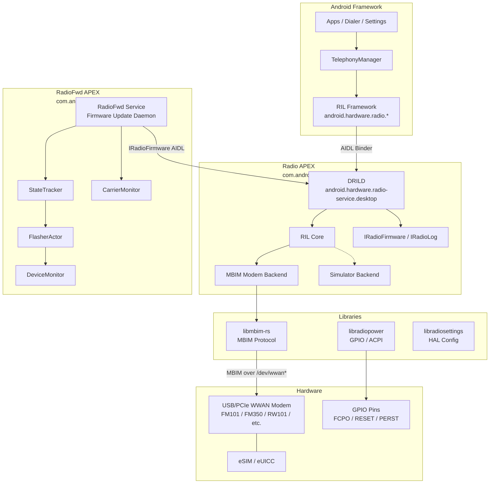
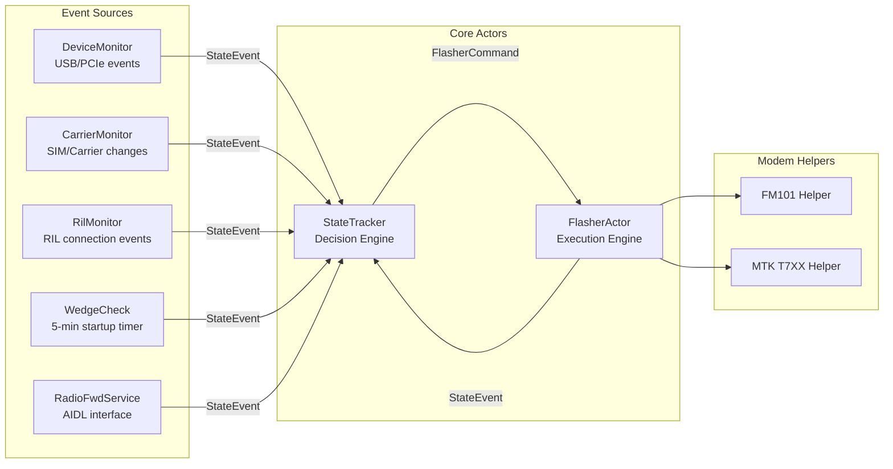
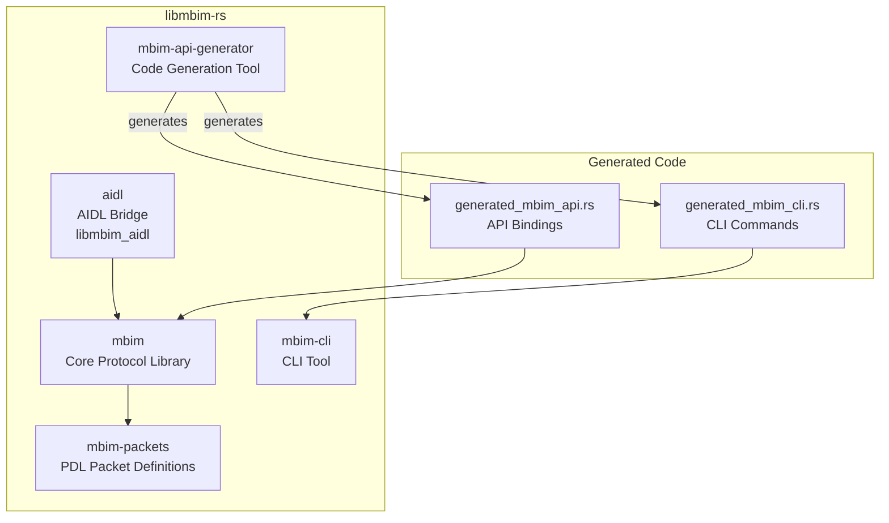
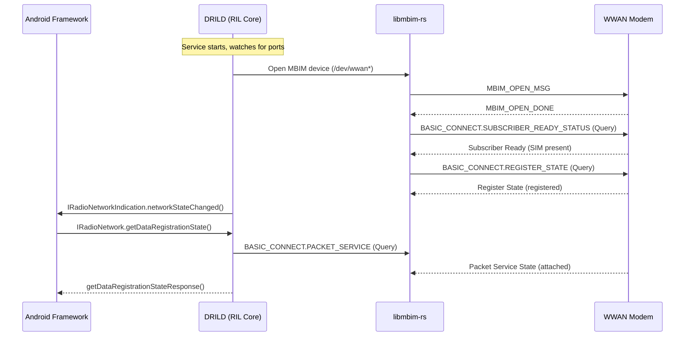
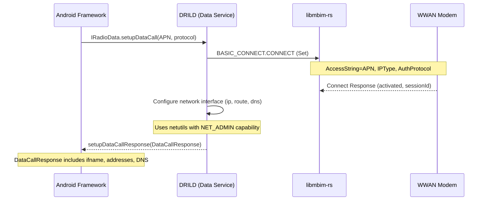
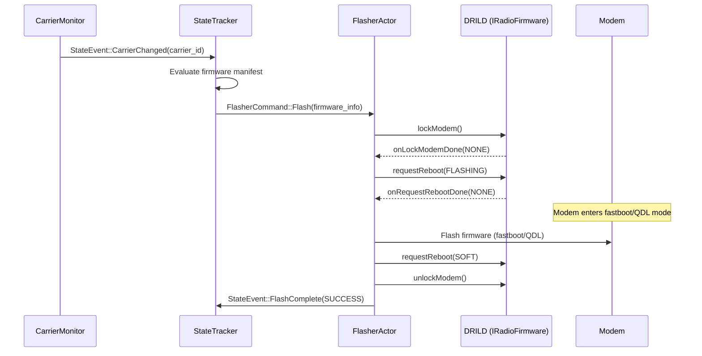
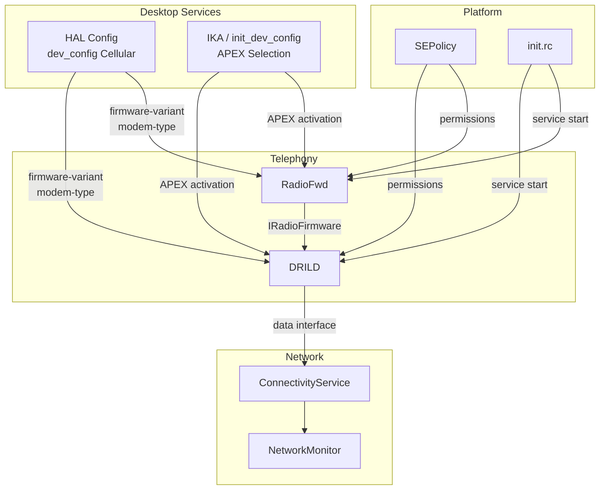

# Radio/Cellular and Telephony Implementation

## 1. Architecture Overview

The Android Desktop Platform implements a complete cellular/telephony stack built around the
**DRILD** (Desktop Radio Interface Layer Daemon) and the **MBIM** (Mobile Broadband Interface Model)
protocol. Unlike traditional Android phones that use a baseband processor with a proprietary RIL,
the Desktop Platform communicates with external USB/PCIe WWAN modems using the standardized MBIM
protocol, implemented entirely in Rust.



The system features:

- **DRILD**: A Rust-based HAL daemon replacing the traditional C/C++ `rild`, implementing all
  standard Radio HAL AIDL interfaces plus desktop-specific firmware and logging extensions.
- **RadioFwd**: A companion daemon for modem firmware management, carrier-aware firmware switching,
  and modem lifecycle operations (flash, reset, recovery).
- **libmbim-rs**: A pure-Rust MBIM protocol library with code generation from JSON API definitions.
- **APEX packaging**: Both daemons ship in separate vendor APEX modules for independent updates.
- **eSIM/eUICC support**: Built-in support via `EuiccGoogle` and `EuiccOverlay`.

## 2. Key Components

| Component | Type | Language | Location | Description |
|-----------|------|----------|----------|-------------|
| `android.hardware.radio-service.desktop` | HAL Daemon | Rust | `vendor/google/desktop/radio/drild/` | Desktop RIL daemon implementing Radio HAL |
| `android.hardware.radiofwd-service.desktop` | Service | Rust | `vendor/google/desktop/radio/radiofwd/` | Modem firmware update and lifecycle daemon |
| `libmbim` | Library | Rust | `vendor/google/desktop/libs/libmbim-rs/mbim/` | MBIM protocol implementation |
| `libmbim_aidl` | Library | Rust | `vendor/google/desktop/libs/libmbim-rs/aidl/` | MBIM AIDL bridge for CLI tools |
| `libradiopower` | Library | Rust | `vendor/google/desktop/radio/libs/libradiopower/` | GPIO/ACPI modem power control |
| `libradiosettings` | Library | Rust | `vendor/google/desktop/radio/libs/libradiosettings/` | HAL config and device settings |
| `rilcli` | Debug Tool | Rust | `vendor/google/desktop/radio/drild/cli/` | RIL command-line interface |
| `mbim-cli` | Debug Tool | Rust | `vendor/google/desktop/libs/libmbim-rs/mbim-cli/` | MBIM command-line interface |
| `rilfakeconfig` | Debug Tool | Rust | `vendor/google/desktop/radio/drild/rilfakeconfig/` | Simulator mode configuration |
| `modemlogger` | Debug Tool | Rust | `vendor/google/desktop/radio/drild/modemlogger/` | Modem log collection tool |
| `radiofwdcli` | Debug Tool | Rust | `vendor/google/desktop/radio/radiofwd/cli/` | RadioFwd command-line interface |
| `modb_to_android_converter` | Host Tool | Python | `vendor/google/desktop/radio/modb_converter/` | ChromeOS MODB to Android APN converter |
| `EuiccGoogle` | App | Java | (prebuilt) | eSIM/eUICC management application |
| `CarrierConfigOverlayDesktop` | Overlay | XML | (prebuilt) | Desktop-specific carrier config |
| `qdl` | Utility | Native | (prebuilt) | Qualcomm Download mode flasher |

## 3. DRILD - Desktop Radio Interface Layer Daemon

### 3.1 Overview

DRILD (`android.hardware.radio-service.desktop`) is the core Radio HAL implementation. Written
entirely in Rust with an async Tokio runtime, it replaces the traditional C-based `rild` and
directly implements the AOSP Radio AIDL interfaces.

**Source location**: `/mnt/nvme11/home/gaggery/ww04-fatcat-bkc/vendor/google/desktop/radio/drild/`

### 3.2 Service Init

From `android.hardware.radio-service.desktop.rc`:
```
service vendor.dril-daemon /apex/com.android.hardware.radio.desktop/bin/android.hardware.radio-service.desktop
    class hal
    user radio
    group radio system
    capabilities NET_ADMIN
```

The daemon runs as user `radio` with `NET_ADMIN` capability for network interface configuration.

### 3.3 Radio HAL Interfaces (VINTF Manifest)

DRILD registers the following AIDL HAL interfaces (from `android.hardware.radio-service.desktop.xml`):

| Interface | Version | Instance | Description |
|-----------|---------|----------|-------------|
| `android.hardware.radio.config/IRadioConfig` | 3 | `default` | Radio configuration (SIM slots, phone capability) |
| `android.hardware.radio.data/IRadioData` | 3 | `slot1` | Data connectivity (APN, data calls) |
| `android.hardware.radio.modem/IRadioModem` | 3 | `slot1` | Modem state (power, IMEI, baseband version) |
| `android.hardware.radio.sim/IRadioSim` | 3 | `slot1` | SIM card operations (ICCID, IMSI, PIN) |
| `android.hardware.radio.network/IRadioNetwork` | 3 | `slot1` | Network registration, signal, cell info |
| `android.hardware.radio.desktop.firmware/IRadioFirmware` | 1 | `default` | Desktop-specific firmware operations |
| `android.hardware.radio.desktop.log/IRadioLog` | 1 | `default` | Desktop-specific modem logging |
| `com.android.desktop.mbim/IMbimCommandExecutor` | 1 | `default` | Raw MBIM command passthrough (debug) |

### 3.4 Module Architecture

From `src/main.rs`, the DRILD daemon is organized into the following modules:

| Module | Source File | Description |
|--------|------------|-------------|
| `ril_core` | `ril_core.rs` (103KB) | Central coordinator; manages modem lifecycle and dispatches requests |
| `modem` | `modem.rs` (164KB) | Modem abstraction layer |
| `modem/modem_mbim` | `modem_mbim.rs` (228KB) | MBIM-specific modem backend (largest single source file) |
| `modem/modem_simulator` | `modem_simulator.rs` | Simulator backend for testing without hardware |
| `network_service` | `network_service.rs` (70KB) | `IRadioNetwork` implementation |
| `sim_service` | `sim_service.rs` (42KB) | `IRadioSim` implementation |
| `data_service` | `data_service.rs` (19KB) | `IRadioData` implementation |
| `modem_service` | `modem_service.rs` (16KB) | `IRadioModem` implementation |
| `config_service` | `config_service.rs` (13KB) | `IRadioConfig` implementation |
| `firmware_service` | `firmware_service.rs` | `IRadioFirmware` implementation |
| `log_service` | `log_service.rs` | `IRadioLog` implementation |
| `queue_manager` | `queue_manager.rs` (47KB) | Request queuing and serialization |
| `port_info` | `port_info.rs` (23KB) | Modem port discovery and monitoring |
| `arfcn` | `arfcn.rs` (22KB) | ARFCN (Absolute Radio Frequency Channel Number) handling |
| `sim_io_request` | `sim_io_request.rs` | SIM I/O request handling |
| `sim_filesystem` | `sim_filesystem.rs` | SIM filesystem (EF/DF) navigation |
| `bertlv` | `bertlv.rs` | BER-TLV encoding/decoding for SIM APDUs |
| `fibocom_helper` | `fibocom_helper.rs` | Fibocom modem-specific helpers |
| `modem_power_controller` | `modem_power_controller.rs` | Modem power state management |
| `response_helper` | `response_helper.rs` | Radio response construction helpers |
| `mbimcli_service` | `mbimcli_service.rs` | MBIM CLI AIDL service (debug builds only) |

### 3.5 Dual-Mode Operation

DRILD supports two operating modes determined at runtime:

```rust
fn should_use_simulator_mode() -> bool {
    cfg!(feature = "simulator_mode") || {
        // Check sysprop: persist.vendor.desktop.radio.force-simulator-mode
    }
}
```

1. **MBIM Mode** (production): Communicates with real WWAN modems via the MBIM protocol through
   `/dev/wwan*` character devices.
2. **Simulator Mode** (testing): Runs a software-based modem simulator for development and testing
   without physical hardware. Can be forced at runtime via system property.

### 3.6 Custom AIDL Interfaces

#### IRadioFirmware

Desktop-specific firmware HAL for modem firmware management:

```
oneway interface IRadioFirmware {
    void lockModem(in IRadioFirmwareCallback callback);
    void unlockModem(in IRadioFirmwareCallback callback);
    void getCarrier(in IRadioFirmwareCallback callback);
    void getFwVersions(in IRadioFirmwareCallback callback);
    void requestReboot(in RebootType reboot_type, in IRadioFirmwareCallback callback);
}
```

**RebootType** enum:
- `SOFT` -- Graceful modem self-reboot
- `HARD` -- Forceful GPIO-based reboot
- `FLASHING` -- Reboot into flashing mode
- `RECOVERY` -- Reboot into recovery mode

**FirmwareError** enum: `NONE`, `SYSTEM_ERR`

#### IRadioLog

Desktop-specific modem logging HAL:

```
oneway interface IRadioLog {
    void setLogging(in boolean enable, in IRadioLogCallback callback);
}
```

**LogError** enum: `NONE`, `MODEM_NOT_SUPPORTED`, `MODEM_NOT_AVAILABLE`, `MODEM_ERR`,
`INTERNAL_ERR`, `CANCELLED`, `ABORTED`

## 4. RadioFwd - Radio Forwarding Service

### 4.1 Overview

RadioFwd (`android.hardware.radiofwd-service.desktop`) is a modem firmware update and lifecycle
management daemon. It monitors modem state and carrier changes, and orchestrates firmware flashing
operations using an actor-based architecture.

**Source location**: `/mnt/nvme11/home/gaggery/ww04-fatcat-bkc/vendor/google/desktop/radio/radiofwd/`

### 4.2 Service Init

From `android.hardware.radiofwd-service.rc`:
```
service radiofwd /apex/com.android.hardware.radiofwd/bin/android.hardware.radiofwd-service.desktop
    class hal
    user radio
    group radio system wakelock usb dialout
```

Additional group memberships:
- `system`: GPIO pin interaction
- `wakelock`: Wake lock acquisition during flashing
- `usb`: USB endpoint interaction
- `dialout`: TTY device interaction

### 4.3 Architecture

RadioFwd uses an actor-based architecture with two primary actors communicating via channels:



### 4.4 Module Architecture

| Module | Source File | Description |
|--------|------------|-------------|
| `state_tracker` | `state_tracker.rs` (24KB) | Central decision engine; receives events, issues commands |
| `flasher` | `flasher.rs` (16KB) | Firmware flashing execution actor |
| `device_monitor` | `device_monitor.rs` (26KB) | USB/PCIe device enumeration and hot-plug monitoring |
| `carrier_monitor` | `carrier_monitor.rs` (15KB) | SIM card and carrier change detection |
| `ril_monitor` | `ril_monitor.rs` (9KB) | RIL service connection monitoring |
| `fastboot_client` | `fastboot_client.rs` (15KB) | Fastboot protocol client for modem flashing |
| `fastboot_transport` | `fastboot_transport.rs` (10KB) | Fastboot USB transport layer |
| `fastboot_helper` | `fastboot_helper.rs` (6KB) | Fastboot protocol helpers |
| `qdl_helper` | `qdl_helper.rs` (6KB) | Qualcomm Download mode helper |
| `modem_helper` | `modem_helper.rs` (14KB) | Modem-type-specific helper trait and factory |
| `modem_helper/fm101_helper` | `fm101_helper.rs` (14KB) | Fibocom FM101 modem-specific logic |
| `modem_helper/mtk_t7xx_helper` | `mtk_t7xx_helper.rs` (10KB) | MediaTek T7XX (FM350/RW350) modem logic |
| `parsed_firmware_manifest` | `parsed_firmware_manifest.rs` (25KB) | Protobuf firmware manifest parser |
| `radiofwd_service` | `radiofwd_service.rs` (10KB) | AIDL service implementation |
| `ril_client` | `ril_client.rs` (3KB) | Client for DRILD's IRadioModem/IRadioSim |
| `ril_firmware_client` | `ril_firmware_client.rs` (8KB) | Client for DRILD's IRadioFirmware |
| `sysfs_util` | `sysfs_util.rs` (8KB) | Sysfs attribute read/write utilities |
| `sigterm_listener` | `sigterm_listener.rs` (5KB) | Graceful SIGTERM shutdown handling |
| `wakelock_guard` | `wakelock_guard.rs` (3KB) | RAII wake lock management |
| `modem_lock_guard` | `modem_lock_guard.rs` (2KB) | RAII modem lock management |

### 4.5 IRadioFwdService AIDL Interface

```
oneway interface IRadioFwdService {
    void flash(in String carrier, in IRadioFwdServiceCallback callback);
    void reset(in IRadioFwdServiceCallback callback);
}
```

**RadioFwdErrorCode** enum values:
`UNKNOWN`, `IO`, `MANIFEST_PARSE`, `MANIFEST_VALIDATION`, `VARIANT_NOT_FOUND`,
`FIRMWARE_FILE_NOT_FOUND`, `BINDER_COMMUNICATION`, `DEVICE_NOT_AVAILABLE`, `DEVICE_TIMEOUT`,
`FLASH_IN_PROGRESS`, `EXTERNAL_COMMAND`, `FASTBOOT`, `MODEM_LOCK`, `MODEM_COMMUNICATION`,
`WAKELOCK`, `MISSING_DEVICE_ID`, `DEVICE_MONITOR_SETUP`, `RADIO_POWER`, `ACTOR_SEND`,
`UNKNOWN_MODEM_TYPE`, `TERMINATED`, `SUCCESS`, `UNSUPPORTED_OPERATION`

### 4.6 Firmware Manifest (Protobuf)

Firmware packages are described by a protobuf manifest (`firmware_manifest.proto`):

```protobuf
message FirmwareManifest {
    repeated Device device = 1;
}

message Device {
    string variant = 1;
    string default_main_firmware_version = 2;
    string recovery_directory = 3;
    repeated MainFirmware main_firmware = 4;
    repeated CarrierFirmware carrier_firmware = 5;
}

message MainFirmware {
    string filename = 1;
    string version = 2;
    repeated AssociatedFirmware assoc_firmware = 3;
    string dirname = 4;
}

message CarrierFirmware {
    string filename = 1;
    repeated string carrier_id = 2;
    string version = 3;
    string main_firmware_version = 4;
    string dirname = 5;
}
```

Firmware files are installed at: `/apex/com.android.hardware.radiofirmware/etc/firmware/`

### 4.7 Wedge Detection

RadioFwd includes a modem "wedge" detection mechanism that triggers 5 minutes after startup:

```rust
const WEDGE_CHECK_STARTUP_TIMEOUT: Duration = Duration::from_secs(5 * 60);
```

If the modem has not properly registered after this timeout, the StateTracker initiates recovery
actions.

## 5. MODB Converter

**Source location**: `/mnt/nvme11/home/gaggery/ww04-fatcat-bkc/vendor/google/desktop/radio/modb_converter/`

The MODB (Mobile Operator Database) converter is a host-side Python tool that converts the ChromeOS
Mobile Operator Database to Android's APN XML format.

### 5.1 Build

```bash
m modb_to_android_converter
```

### 5.2 Usage

```bash
modb_to_android_converter \
    <path/to/serviceproviders.textproto> \
    <path/to/carriers.csv> \
    <path/to/output/apn-conf.xml> \
    <number_of_lines_to_process>
```

The tool reads:
- **serviceproviders.textproto**: ChromeOS mobile operator database
- **carriers.csv**: List of carrier UUIDs and MCCMNCs from usage data

Output: Android-format `apns-conf.xml` with carrier APN definitions.

### 5.3 Build Definition

```
python_binary_host {
    name: "modb_to_android_converter",
    srcs: ["modb_to_android_converter.py"],
    main: "modb_to_android_converter.py",
    libs: ["libprotobuf-python"],
}
```

## 6. Radio Libraries (libs/)

### 6.1 libradiopower

**Source location**: `/mnt/nvme11/home/gaggery/ww04-fatcat-bkc/vendor/google/desktop/radio/libs/libradiopower/`

Provides GPIO and ACPI-based modem power control. The library abstracts hardware-specific power
sequencing for different board and modem combinations.

#### Supported Operations

| Operation | Description |
|-----------|-------------|
| `initialize()` | Initialize device config and GPIO pins |
| `power_on()` | Power on modem via GPIO sequence |
| `power_off()` | Power off modem via GPIO |
| `reset()` | Reset modem (GPIO or ACPI sysfs) |
| `reset_into_fastboot()` | Reset into fastboot mode via ACPI sysfs |
| `warm_boot()` | Warm boot modem via GPIO |
| `shutdown()` | Full modem shutdown |

#### Board-Specific GPIO Configurations

| Board | Chip | W_DISABLE | SAR_DETECT | ENABLE | FCPO | RESET | PERST |
|-------|------|-----------|------------|--------|------|-------|-------|
| `corsola` | `/dev/gpiochip0` | 178 | 179 | 180 | 181 | 182 | -- |
| `brya` | `/dev/gpiochip0` | -- | -- | 76 | 309 | 336 | 320 |
| `crota` (brya variant) | `/dev/gpiochip0` | -- | -- | 76 | 83 | 84 | -- |

#### Modem Delay Configurations

| Modem Type | RESET->FCPO | FCPO->RESET | VCC->FCPO | RESET Pulse | FCPO Pulse |
|------------|-------------|-------------|-----------|-------------|------------|
| EM060, LCUK54 | 100ms | 1000ms | 2ms | 500ms | 200ms |
| FM101, RW101, RW135 | 10ms | 20ms | 2ms | 10ms | 500ms |
| FM350, RW350 | 10ms | 20ms | 2ms | 10ms | 500ms |

#### Power Control Strategy

- **USB modems** (FM101, RW101, RW135, EM060, LCUK54): GPIO-controlled power and reset
- **PCIe modems** (FM350, RW350): ACPI/driver-controlled reset; no GPIO power control

### 6.2 libradiosettings

**Source location**: `/mnt/nvme11/home/gaggery/ww04-fatcat-bkc/vendor/google/desktop/radio/libs/libradiosettings/`

Provides a singleton `Settings` struct initialized from HAL config and system properties at startup.

#### Settings Fields

| Field | Source | Description |
|-------|--------|-------------|
| `board_name` | `ro.product.name` | Board identifier (e.g., "brya", "corsola") |
| `model_name` | `ro.boot.product.vendor.sku` (prefix) | Model name (e.g., "redrix", "ponyta") |
| `sku_id` | `ro.boot.product.vendor.sku` (suffix) | SKU identifier (e.g., "262402") |
| `firmware_variant` | HAL config `Cellular/firmware-variant` | Firmware variant string |
| `modem_type` | HAL config `Cellular/modem-type` | Modem type enum |

#### Supported Modem Types

| Enum | Modem | Interface |
|------|-------|-----------|
| `EM060` | Quectel EM060 | USB |
| `FM101` | Fibocom FM101 | USB |
| `FM350` | Fibocom FM350 | PCIe (T7XX) |
| `LCUK54` | NetPrisma LCUK54 | USB |
| `RW101` | RollingWireless RW101 | USB |
| `RW135` | RollingWireless RW135 | USB |
| `RW350` | RollingWireless RW350 | PCIe (T7XX) |

#### Supported Boards

Currently supported board names for cellular config lookup: `brya`, `corsola`.

## 7. MBIM Protocol Support (libmbim-rs)

### 7.1 Overview

**Source location**: `/mnt/nvme11/home/gaggery/ww04-fatcat-bkc/vendor/google/desktop/libs/libmbim-rs/`

`libmbim-rs` is a pure-Rust implementation of the MBIM (Mobile Broadband Interface Model) protocol.
It provides the transport layer between DRILD and the WWAN modem hardware.

### 7.2 Library Structure



### 7.3 Core Library Modules

From `mbim/src/lib.rs`:

| Module | Description |
|--------|-------------|
| `api` | High-level MBIM API (generated from JSON definitions) |
| `device` | MBIM device abstraction and command executor |
| `transport` | Raw MBIM transport over file descriptors |
| `file_transport` | File-based transport implementation |
| `message` | MBIM message encoding/decoding |
| `fragment` | MBIM message fragmentation/reassembly |
| `information_buffer` | MBIM information buffer serialization |
| `cancellation` | Command cancellation support |
| `cli` | CLI support utilities |
| `error` | Error types |
| `private_info` | Privacy-aware logging (conditional on build variant) |
| `version` | MBIM protocol version handling |

### 7.4 MBIM API JSON Definitions

The MBIM API is defined via JSON files in `mbim/mbim_api_json/`:

| JSON File | MBIM Service |
|-----------|--------------|
| `basic_connect.json` (38KB) | Core connectivity (attach, register, connect) |
| `basic_connect_v2.json` | Basic Connect v2 extensions |
| `basic_connect_v3.json` | Basic Connect v3 extensions |
| `ms_basic_connect_extensions.json` (30KB) | Microsoft extensions (provisioned contexts, LTE attach) |
| `ms_basic_connect_extensions_v2.json` | MS extensions v2 |
| `ms_basic_connect_extensions_v3.json` (13KB) | MS extensions v3 (5G, URSP) |
| `ms_uicc_low_level.json` (15KB) | UICC/SIM card low-level operations |
| `sms.json` | SMS send/receive |
| `auth.json` | Authentication (AKA, AKAP, SIM) |
| `atds.json` | AT Device Service |
| `sar.json` | SAR (Specific Absorption Rate) |
| `qdu.json` | Qualcomm Device Update |
| `ms_voice_extensions.json` | Voice call extensions |
| `ms_host_shutdown.json` | Host shutdown notification |
| `fibocom.json` | Fibocom vendor-specific commands |
| `google.json` | Google vendor-specific commands |
| `intel_firmware_update.json` | Intel firmware update |
| `intel_firmware_update_v2.json` | Intel firmware update v2 |
| `intel_tools.json` | Intel diagnostic tools |

### 7.5 MBIM AIDL Interface

The `IMbimCommandExecutor` AIDL interface allows external tools (like `mbim-cli`) to send raw MBIM
commands through DRILD:

```
interface IMbimCommandExecutor {
    CommandResponseResult sendCommandMessage(
        in CommandMetadata metadata, in byte[] informationBuffer);
}

parcelable CommandMetadata {
    String deviceServiceId;   // UUID of the device service
    MbimExVersion version;    // MBIM extension version
    int cid;                  // Command ID
    CommandType commandType;  // QUERY or SET
}

parcelable CommandResponse {
    int statusCode;
    byte[] informationBuffer;
}
```

### 7.6 Build and Test

```bash
# Build all targets
mmm vendor/google/desktop/libs/libmbim-rs

# Run unit tests
atest libmbim_test libmbim_packets_test libmbim_api_generator_test libmbim_aidl_test

# Fuzzing
cargo fuzz run mbim_fuzzer  # (from mbim/fuzz/ directory)
```

## 8. eSIM/eUICC Support

The Desktop Platform includes full eSIM support:

### 8.1 Packages

From `radio.mk`:
```makefile
PRODUCT_PACKAGES += EuiccGoogle
PRODUCT_PACKAGES += EuiccOverlay
```

- **EuiccGoogle**: Google's eSIM management application (profile download, activation, management)
- **EuiccOverlay**: Desktop-specific overlay for eSIM UI customization

### 8.2 Factory Reset Behavior

```makefile
PRODUCT_PRODUCT_PROPERTIES += \
    masterclear.allow_retain_esim_profiles_after_fdr=true
```

eSIM profiles are **retained** after factory data reset, allowing users to keep their cellular
plans across device resets.

### 8.3 VINTF Declaration

The Radio APEX declares eSIM capability via prebuilt feature files:
```
prebuilts: [
    "android.hardware.telephony.euicc.prebuilt.xml",
],
```

### 8.4 SIM I/O Implementation

DRILD includes comprehensive SIM I/O support:

- `sim_service.rs` (42KB) -- Full `IRadioSim` implementation
- `sim_io_request.rs` -- SIM I/O request handling
- `sim_filesystem.rs` -- SIM filesystem (EF/DF) navigation
- `bertlv.rs` -- BER-TLV encoding/decoding for SIM APDUs
- `modem/sim_io_engine.rs` (30KB) -- SIM I/O execution engine
- `modem/sim_io_engine/command_apdu.rs` (27KB) -- Command APDU construction
- `modem/modem_mbim/sim_io.rs` (18KB) -- MBIM-specific SIM I/O

## 9. APN Configuration

**File**: `/mnt/nvme11/home/gaggery/ww04-fatcat-bkc/vendor/google/desktop/radio/apns-conf-data-only.xml`

The platform ships a data-only APN configuration (no MMS, no voice APN types) targeting desktop
use cases. The file is installed to `product/etc/apns-conf.xml`.

### 9.1 Configured Carriers

| Carrier | Carrier ID | APN | Protocol | Type |
|---------|-----------|-----|----------|------|
| T-Mobile US | 1 | `fast.t-mobile.com` | IPV4V6 | default |
| Telefonica ES | 34 | `telefonica.es` | IPV4V6 | default |
| Movistar (USB modems) | 34 | `movistar.es` | IPV4V6 | default |
| NTT docomo SP Mode | 850 | `spmode.ne.jp` | IPV4V6 | default,ia |
| NTT docomo mopera U | 850 | `mopera.net` | IPV4V6 | default,ia |
| AT&T Broadband | 1187 | `broadband` | IPV4V6 | default,ia |
| Rogers Internet | 1403 | `ltemobile.apn` | IPV4V6 | default,ia |
| Telus Internet | 1404 | `isp.telus.com` | IPV4V6 | default |
| Telus Mobile Web | 1404 | `sp.telus.com` | IPV4V6 | default |
| Verizon IMS | 1839 | `ims` | IPV4V6 | ia |
| Verizon Internet | 1839 | `vzwinternet` | IPV4V6 | default |
| DT (carrier 1911) | 1911 | `internet` | IPV4V6 | default,ia |
| DT IPv6-only | 1911 | `internet-ipv6` | IPV6 | default,ia |
| DT IPv4-only | 1911 | `internet-ipv4` | IP | default,ia |
| h2g2 (test) | 10014 | `h2g2` | IPV4V6 | default |
| Rogers 5G Internet | 10025 | `mobile.apn` | IPV4V6 | default |

### 9.2 APN Generation

APNs are generated from ChromeOS MODB data using the `modb_to_android_converter` tool, which maps
the top carriers by usage from ChromeOS metrics data.

## 10. APEX Packaging

### 10.1 Radio APEX (`com.android.hardware.radio.desktop`)

| Property | Value |
|----------|-------|
| Name | `com.android.hardware.radio.desktop` |
| Version | 1 |
| Vendor | true |
| Updatable | false |
| Key | `com.android.hardware.key` |
| Certificate | `com.android.hardware.certificate` |

**Contents (release build)**:
- `bin/android.hardware.radio-service.desktop`
- `etc/vintf/android.hardware.radio-service.desktop.xml`
- Init script: `android.hardware.radio-service.desktop.rc`

**Contents (userdebug/eng additional)**:
- `bin/rilcli`
- `bin/rilfakeconfig`
- `bin/mbim-cli`
- `bin/modemlogger`

**Overrides** (replaces legacy RIL implementations):
- `libril`, `libreference-ril`, `rild`
- `libril-modem-lib`, `libcuttlefish-rild`, `libcuttlefish-ril-2`, `libril_intermediates`

**Prebuilt feature declarations**:
- `android.hardware.telephony.data.prebuilt.xml`
- `android.hardware.telephony.euicc.prebuilt.xml`

**SELinux file contexts** (`apex/file_contexts`):
```
/bin/android\.hardware\.radio-service\.desktop     u:object_r:hal_radio_default_exec:s0
/bin/rilcli                                        u:object_r:hal_radio_default_exec:s0
/bin/mbim-cli                                      u:object_r:hal_radio_default_exec:s0
/bin/rilfakeconfig                                 u:object_r:hal_radio_default_exec:s0
/bin/modemlogger                                   u:object_r:hal_radio_default_exec:s0
```

#### Empty APEX Variant

An empty APEX `com.android.hardware.radio.desktop.empty` exists for IKA (Image Kernel
Architecture) validation -- it ensures the APEX selection logic correctly activates/deactivates
the radio APEX based on hardware capability.

### 10.2 RadioFwd APEX (`com.android.hardware.radiofwd`)

| Property | Value |
|----------|-------|
| Name | `com.android.hardware.radiofwd` |
| Version | 1 |
| Vendor | true |
| Updatable | false |
| Key | `com.android.hardware.key` |

**Contents (release build)**:
- `bin/android.hardware.radiofwd-service.desktop`
- Service manifest: `android.hardware.radiofwd-service.xml`
- Init script: `android.hardware.radiofwd-service.rc`

**Contents (userdebug/eng additional)**:
- `bin/radiofwdcli`

**SELinux file contexts**:
```
/bin/android\.hardware\.radiofwd-service\.desktop   u:object_r:radiofwd_exec:s0
/bin/radiofwdcli                                    u:object_r:radiofwdcli_exec:s0
```

### 10.3 Radio Firmware APEX (`com.android.hardware.radiofirmware`)

A third APEX (not defined in this source tree but referenced) contains modem firmware binaries:
- Path: `/apex/com.android.hardware.radiofirmware/etc/`
- Firmware files: `/apex/com.android.hardware.radiofirmware/etc/firmware/`
- Manifest: protobuf-defined `FirmwareManifest`

## 11. Data Flow

### 11.1 Modem Registration Sequence



### 11.2 Data Connection Establishment



### 11.3 Firmware Update Flow



## 12. Configuration

### 12.1 radio.mk

**File**: `/mnt/nvme11/home/gaggery/ww04-fatcat-bkc/vendor/google/desktop/radio/radio.mk`

#### Soong Config Variables (userdebug/eng only)

| Config Namespace | Variable | Purpose |
|-----------------|----------|---------|
| `desktop_radio_features` | `with_rilcli` | Include `rilcli` debug tool |
| `desktop_radio_features` | `with_rilfakeconfig` | Include `rilfakeconfig` simulator config tool |
| `desktop_radio_features` | `with_mbimcli` | Include `mbim-cli` debug tool |
| `desktop_radio_features` | `with_modemlogger` | Include `modemlogger` log collection tool |
| `desktop_radio_features` | `with_private_info` | Enable unredacted private info in logs |
| `desktop_radio_features` | `with_radiofwdcli` | Include `radiofwdcli` debug tool |

#### DRILD Soong Config Variables

| Variable | Feature Flag | Effect |
|----------|-------------|--------|
| `with_simulator_mode` | `simulator_mode` | Compile in simulator backend |
| `with_verbose_logging` | `enable_verbose_logging` | Enable verbose logging |
| `with_mbimcli` | `mbimcli` | Enable MBIM CLI AIDL service + `libmbim_aidl` |
| `with_private_info` | `enable_private_info` | Log unredacted IMSI, ICCID, etc. |

### 12.2 System Properties

| Property | Type | Description |
|----------|------|-------------|
| `persist.vendor.desktop.radio.force-simulator-mode` | bool | Force simulator mode on real hardware |
| `persist.vendor.desktop.radio.simulator-values.*` | string | Simulator configuration values |
| `ro.product.name` | string | Board name for GPIO config lookup |
| `ro.boot.product.vendor.sku` | string | Model_SKU for device identification |
| `ro.boot.product.hardware.sku` | string | Fallback SKU property (corsola) |
| `ro.boot.vendor.apex.com.android.hardware.radio.desktop` | string | APEX activation state |
| `ro.boot.vendor.apex.com.android.hardware.radiofirmware` | string | Firmware APEX activation |
| `ro.boot.vendor.apex.com.android.hardware.radiofwd` | string | RadioFwd APEX activation |

### 12.3 Debug Tools

#### rilcli

Interactive command-line tool for DRILD. Provides subcommands for all Radio HAL operations:
- `rilcli_config.rs` (18KB) -- IRadioConfig commands
- `rilcli_data.rs` (31KB) -- IRadioData commands
- `rilcli_network.rs` (75KB) -- IRadioNetwork commands
- `rilcli_sim.rs` (55KB) -- IRadioSim commands
- `rilcli_modem.rs` (24KB) -- IRadioModem commands
- `rilcli_firmware.rs` (8KB) -- IRadioFirmware commands
- `rilcli_log.rs` (2KB) -- IRadioLog commands
- `rilcli_status.rs` (20KB) -- Status and info queries

#### rilfakeconfig

Configures the simulator mode via system properties:
```bash
rilfakeconfig enable-simulator    # Enable simulator mode
rilfakeconfig disable-simulator   # Disable simulator mode
rilfakeconfig set iccid <value>   # Set fake ICCID
rilfakeconfig set imsi <value>    # Set fake IMSI
rilfakeconfig set imei <value>    # Set fake IMEI
rilfakeconfig set svn <value>     # Set fake SVN
rilfakeconfig set serving-mcc <value>  # Set serving MCC
rilfakeconfig set serving-mnc <value>  # Set serving MNC
```

#### modemlogger

Collects modem diagnostic logs via the IRadioLog interface. Supports FM350/RW350 modems using
the T7XX debug relay channel (`/sys/kernel/debug/wwan/wwan0/mtk_t7xx/relay_ch0`):

```bash
modemlogger --output-dir /data/local/tmp/modem_logs/
```

#### radiofwdcli

Commands modem firmware operations via the IRadioFwdService interface:
- Flash firmware for a specific carrier
- Reset the modem hardware

#### mbim-cli

Sends raw MBIM commands through DRILD's `IMbimCommandExecutor` AIDL service for low-level
modem debugging.

## 13. Build Integration

### 13.1 PRODUCT_PACKAGES

From `radio.mk`, the following packages are included in every build:

```makefile
PRODUCT_PACKAGES += com.android.hardware.radio.desktop   # Radio HAL APEX
PRODUCT_PACKAGES += com.android.hardware.radiofwd         # RadioFwd APEX
PRODUCT_PACKAGES += EuiccGoogle                           # eSIM app
PRODUCT_PACKAGES += EuiccOverlay                          # eSIM UI overlay
PRODUCT_PACKAGES += CarrierConfig                         # Carrier configuration
PRODUCT_PACKAGES += CarrierConfigOverlayDesktop           # Desktop carrier overlay
PRODUCT_PACKAGES += qdl                                   # QDL flasher utility
```

### 13.2 PRODUCT_COPY_FILES

```makefile
PRODUCT_COPY_FILES += \
    vendor/google/desktop/radio/apns-conf-data-only.xml:$(TARGET_COPY_OUT_PRODUCT)/etc/apns-conf.xml
```

### 13.3 Compatibility Matrix

```makefile
DEVICE_PRODUCT_COMPATIBILITY_MATRIX_FILE += \
    vendor/google/desktop/radio/android.hardware.radio-service.desktop.compat.xml
```

This declares the following optional framework-side HAL expectations:

| HAL | Interface | Instance |
|-----|-----------|----------|
| `android.hardware.radio.desktop.firmware` v1 | `IRadioFirmware` | default |
| `android.hardware.radio.desktop.log` v1 | `IRadioLog` | default |
| `com.android.desktop.mbim` v1 | `IMbimCommandExecutor` | default |

### 13.4 Rust Dependencies

DRILD links against the following key Rust crates:

| Crate | Purpose |
|-------|---------|
| `android.hardware.radio-V5-rust` | Radio HAL AIDL bindings |
| `android.hardware.radio.config-V5-rust` | Radio Config AIDL |
| `android.hardware.radio.data-V5-rust` | Radio Data AIDL |
| `android.hardware.radio.modem-V5-rust` | Radio Modem AIDL |
| `android.hardware.radio.network-V5-rust` | Radio Network AIDL |
| `android.hardware.radio.sim-V5-rust` | Radio SIM AIDL |
| `libmbim` | MBIM protocol library |
| `libradiopower` | GPIO/ACPI modem power |
| `libradiosettings` | Device settings |
| `libbinder_rs` / `libbinder_tokio_rs` | Binder IPC |
| `libtokio` | Async runtime |
| `libnix` | Unix system calls |
| `libueventd` | Uevent monitoring |
| `libinotify` | Filesystem change monitoring |
| `libchrono` | Date/time handling (NITZ) |
| `libatrace_rust` | Perfetto tracing |

## 14. Inter-Subsystem Dependencies

### 14.1 Connectivity Stack



### 14.2 Desktop Services Dependencies

| Dependency | Direction | Description |
|------------|-----------|-------------|
| HAL Config (`halconfig_rust`) | Settings -> HAL Config | Reads `Cellular/firmware-variant` and `Cellular/modem-type` |
| IKA (APEX selection) | Boot -> APEX | `init_dev_config` selects radio APEXes based on `dev_config Cellular modem-type` |
| ConnectivityService | DRILD -> Framework | Data interface brought up by DRILD is managed by ConnectivityService |
| CarrierConfig | Framework -> DRILD | Carrier-specific configuration applied to telephony stack |
| Suspend Service | RadioFwd -> System | Wake locks held during firmware flashing |

### 14.3 Hardware Dependencies

| Component | Interface | Used By |
|-----------|-----------|---------|
| WWAN device (`/dev/wwan*`) | MBIM char device | DRILD |
| GPIO chip (`/dev/gpiochip0`) | GPIO cdev | DRILD, RadioFwd |
| USB devices (`/dev/bus/usb/*`) | USB | RadioFwd (fastboot, QDL) |
| TTY devices (`/dev/ttyUSB*`) | Serial | RadioFwd |
| T7XX sysfs (`sysfs_t7xx`) | Sysfs | DRILD, RadioFwd |
| T7XX debug relay | debugfs | modemlogger |

## 15. SEPolicy

### 15.1 hal_radio_default (DRILD)

**File**: `/mnt/nvme11/home/gaggery/ww04-fatcat-bkc/device/google/desktop/common/sepolicy/hal_radio_default.te`

Key permissions:
- **Device access**: Read/search device directory, access radio devices and char/block files
- **GPIO**: Open/ioctl/read/write on `gpiochip_device`
- **T7XX sysfs**: Read/write `sysfs_t7xx` for modem driver control
- **Network utilities**: Execute `netutils_wrapper` for interface configuration
- **Proc net**: Read/write `/proc/sys/net/ipv[46]/conf/*` for network tuning
- **Binder**: Uses vendor binder (`vndbinder_use`)

### 15.2 radiofwd

**File**: `/mnt/nvme11/home/gaggery/ww04-fatcat-bkc/device/google/desktop/common/sepolicy/radiofwd.te`

Key permissions:
- **Domain**: `radiofwd` domain with `radiofwd_exec` entry point
- **Transitions**: `init_daemon_domain`, auto-transition from `shell`, auto-transition to `qdl`
- **HAL client**: `hal_client_domain(radiofwd, hal_telephony)` -- authorized to talk to DRILD
- **Service manager**: Registers `radiofwd_service` via vendor binder
- **Wake locks**: `wakelock_use(radiofwd)`
- **USB**: Access `usb_device` directory and char files (for fastboot/QDL)
- **GPIO**: Access `gpiochip_device` for modem power control
- **Sysfs**: Read/write for device enumeration and modem reset (including `sysfs_t7xx`)
- **Radio devices**: Access `radio_device` for modem communication
- **Noise suppression**: `dontaudit` rules for harmless device probing during enumeration

### 15.3 radiofwdcli

**File**: `/mnt/nvme11/home/gaggery/ww04-fatcat-bkc/device/google/desktop/common/sepolicy/radiofwdcli.te`

Restricted to `userdebug_or_eng` builds:
- Domain transition from `shell` and `su`
- Binder calls to `servicemanager` and `radiofwd`
- Access to `radiofwd_service` via service manager
- Pseudo-terminal I/O for CLI output

### 15.4 qdl

**File**: `/mnt/nvme11/home/gaggery/ww04-fatcat-bkc/device/google/desktop/common/sepolicy/qdl.te`

- Uses file descriptors from `radiofwd` (stdout/stderr, executable)
- USB device access for QDL flashing
- Sysfs enumeration for device discovery
- Cgroup directory search

### 15.5 Service Definitions

From `service.te`:
```
type radiofwd_service, service_manager_type;
```

## 16. Testing

### 16.1 Test Suites

| Test Name | Type | Location | Description |
|-----------|------|----------|-------------|
| `android.hardware.radio-service.desktop_test` | Rust unit test (host) | `drild/` | DRILD unit tests with mockall |
| `android.hardware.radio-service.desktop.rilcli_test` | Rust unit test (host) | `drild/cli/` | rilcli unit tests |
| `radiofwd_test` | Rust unit test (host) | `radiofwd/` | RadioFwd unit tests |
| `radiofwdcli_test` | Rust unit test (host) | `radiofwd/cli/` | radiofwdcli unit tests |
| `libmbim_test` | Rust unit test (host) | `libs/libmbim-rs/mbim/` | MBIM library unit tests |
| `libmbim_packets_test` | Rust unit test (host) | `libs/libmbim-rs/mbim-packets/` | MBIM packet tests |
| `libmbim_api_generator_test` | Rust unit test (host) | `libs/libmbim-rs/mbim-api-generator/` | API generator tests |
| `libmbim_aidl_test` | Rust unit test (host) | `libs/libmbim-rs/aidl/` | MBIM AIDL bridge tests |
| `libradiosettings_test` | Rust unit test (host) | `radio/libs/libradiosettings/` | Radio settings tests |
| `libmbim_fuzzer` | Rust fuzz test (host) | `libs/libmbim-rs/mbim/fuzz/` | MBIM protocol fuzzer |
| `DesktopRadioHostTestCases` | Kotlin host test | `radio/test/` | APEX selection validation |

### 16.2 TEST_MAPPING

From `radio/TEST_MAPPING`:
```json
{
    "desktop-postsubmit": [
        { "name": "DesktopRadioHostTestCases" }
    ]
}
```

The `DesktopRadioHostTestCases` suite is currently in **postsubmit** (with a TODO to move to
presubmit after stabilization -- see b/474085629).

### 16.3 APEX Selection Validation Tests

The `ValidateRadioApexSelection` test (`radio/test/ValidateRadioApexSelection.kt`) validates that
APEX selection works correctly across different configurations:

| Test | Condition | Expected Result |
|------|-----------|-----------------|
| `radioApex_inactive_ika` | Default IKA (no modem) | All three APEXes deactivated (`none`) |
| `radioApex_active_telephonyIka` | Telephony IKA | Radio APEX active, firmware/radiofwd inactive |
| `radioApex_inactive_cellularLessSku` | Real HW, no modem-type | All three APEXes deactivated |
| `radioApex_active_cellularCapableSku` | Real HW, modem-type set | All three APEXes active |

### 16.4 RadioFwd Test Protos

RadioFwd includes 17 test protobuf files (`radiofwd/test_protos/`) covering firmware manifest
parsing edge cases:
- Generic/specific firmware selection
- Carrier-specific firmware switching
- Malformed manifests (missing fields, absolute paths)
- Recovery directory handling
- Default firmware fallback
- Multiple main firmware variants

## 17. Key Files Reference

| File | Absolute Path | Description |
|------|---------------|-------------|
| `radio.mk` | `/mnt/nvme11/home/gaggery/ww04-fatcat-bkc/vendor/google/desktop/radio/radio.mk` | Top-level radio makefile |
| `compat.xml` | `/mnt/nvme11/home/gaggery/ww04-fatcat-bkc/vendor/google/desktop/radio/android.hardware.radio-service.desktop.compat.xml` | Framework compatibility matrix |
| `apns-conf-data-only.xml` | `/mnt/nvme11/home/gaggery/ww04-fatcat-bkc/vendor/google/desktop/radio/apns-conf-data-only.xml` | APN configuration |
| `TEST_MAPPING` | `/mnt/nvme11/home/gaggery/ww04-fatcat-bkc/vendor/google/desktop/radio/TEST_MAPPING` | Test mapping configuration |
| DRILD `Android.bp` | `/mnt/nvme11/home/gaggery/ww04-fatcat-bkc/vendor/google/desktop/radio/drild/Android.bp` | DRILD build rules and APEX definition |
| DRILD `main.rs` | `/mnt/nvme11/home/gaggery/ww04-fatcat-bkc/vendor/google/desktop/radio/drild/src/main.rs` | DRILD entry point |
| DRILD init | `/mnt/nvme11/home/gaggery/ww04-fatcat-bkc/vendor/google/desktop/radio/drild/android.hardware.radio-service.desktop.rc` | DRILD init script |
| DRILD VINTF | `/mnt/nvme11/home/gaggery/ww04-fatcat-bkc/vendor/google/desktop/radio/drild/android.hardware.radio-service.desktop.xml` | DRILD HAL manifest |
| RadioFwd `Android.bp` | `/mnt/nvme11/home/gaggery/ww04-fatcat-bkc/vendor/google/desktop/radio/radiofwd/Android.bp` | RadioFwd build rules and APEX definition |
| RadioFwd `main.rs` | `/mnt/nvme11/home/gaggery/ww04-fatcat-bkc/vendor/google/desktop/radio/radiofwd/src/main.rs` | RadioFwd entry point |
| RadioFwd init | `/mnt/nvme11/home/gaggery/ww04-fatcat-bkc/vendor/google/desktop/radio/radiofwd/android.hardware.radiofwd-service.rc` | RadioFwd init script |
| `firmware_manifest.proto` | `/mnt/nvme11/home/gaggery/ww04-fatcat-bkc/vendor/google/desktop/radio/radiofwd/proto/firmware_manifest.proto` | Firmware manifest protobuf schema |
| `IRadioFirmware.aidl` | `/mnt/nvme11/home/gaggery/ww04-fatcat-bkc/vendor/google/desktop/radio/drild/android/hardware/radio/desktop/firmware/IRadioFirmware.aidl` | Desktop firmware HAL interface |
| `IRadioLog.aidl` | `/mnt/nvme11/home/gaggery/ww04-fatcat-bkc/vendor/google/desktop/radio/drild/android/hardware/radio/desktop/log/IRadioLog.aidl` | Desktop logging HAL interface |
| `IRadioFwdService.aidl` | `/mnt/nvme11/home/gaggery/ww04-fatcat-bkc/vendor/google/desktop/radio/radiofwd/android/hardware/radiofwdservice/IRadioFwdService.aidl` | RadioFwd service interface |
| `IMbimCommandExecutor.aidl` | `/mnt/nvme11/home/gaggery/ww04-fatcat-bkc/vendor/google/desktop/libs/libmbim-rs/aidl/com/android/desktop/mbim/IMbimCommandExecutor.aidl` | MBIM command executor interface |
| libmbim `lib.rs` | `/mnt/nvme11/home/gaggery/ww04-fatcat-bkc/vendor/google/desktop/libs/libmbim-rs/mbim/src/lib.rs` | MBIM library root |
| libmbim `Android.bp` | `/mnt/nvme11/home/gaggery/ww04-fatcat-bkc/vendor/google/desktop/libs/libmbim-rs/mbim/Android.bp` | MBIM library build definition |
| libradiopower `lib.rs` | `/mnt/nvme11/home/gaggery/ww04-fatcat-bkc/vendor/google/desktop/radio/libs/libradiopower/src/lib.rs` | Radio power control library |
| libradiopower `config.rs` | `/mnt/nvme11/home/gaggery/ww04-fatcat-bkc/vendor/google/desktop/radio/libs/libradiopower/src/config.rs` | GPIO/board configuration |
| libradiosettings `lib.rs` | `/mnt/nvme11/home/gaggery/ww04-fatcat-bkc/vendor/google/desktop/radio/libs/libradiosettings/src/lib.rs` | Radio settings library |
| MODB converter | `/mnt/nvme11/home/gaggery/ww04-fatcat-bkc/vendor/google/desktop/radio/modb_converter/modb_to_android_converter.py` | ChromeOS MODB to Android APN converter |
| SEPolicy hal_radio | `/mnt/nvme11/home/gaggery/ww04-fatcat-bkc/device/google/desktop/common/sepolicy/hal_radio_default.te` | DRILD SELinux policy |
| SEPolicy radiofwd | `/mnt/nvme11/home/gaggery/ww04-fatcat-bkc/device/google/desktop/common/sepolicy/radiofwd.te` | RadioFwd SELinux policy |
| SEPolicy radiofwdcli | `/mnt/nvme11/home/gaggery/ww04-fatcat-bkc/device/google/desktop/common/sepolicy/radiofwdcli.te` | radiofwdcli SELinux policy |
| SEPolicy qdl | `/mnt/nvme11/home/gaggery/ww04-fatcat-bkc/device/google/desktop/common/sepolicy/qdl.te` | QDL flasher SELinux policy |
| APEX selection test | `/mnt/nvme11/home/gaggery/ww04-fatcat-bkc/vendor/google/desktop/radio/test/ValidateRadioApexSelection.kt` | APEX activation validation test |
