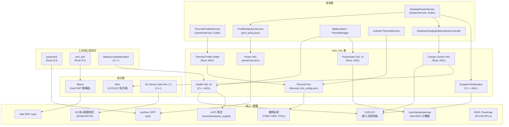
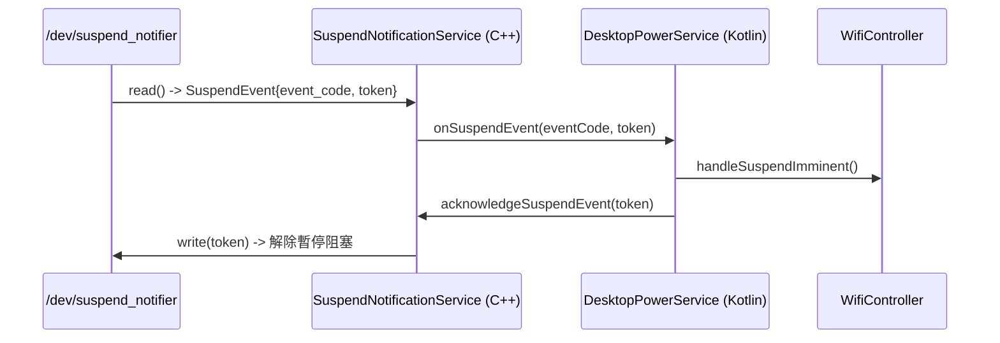
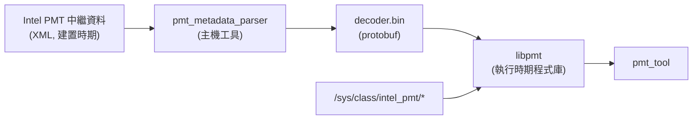
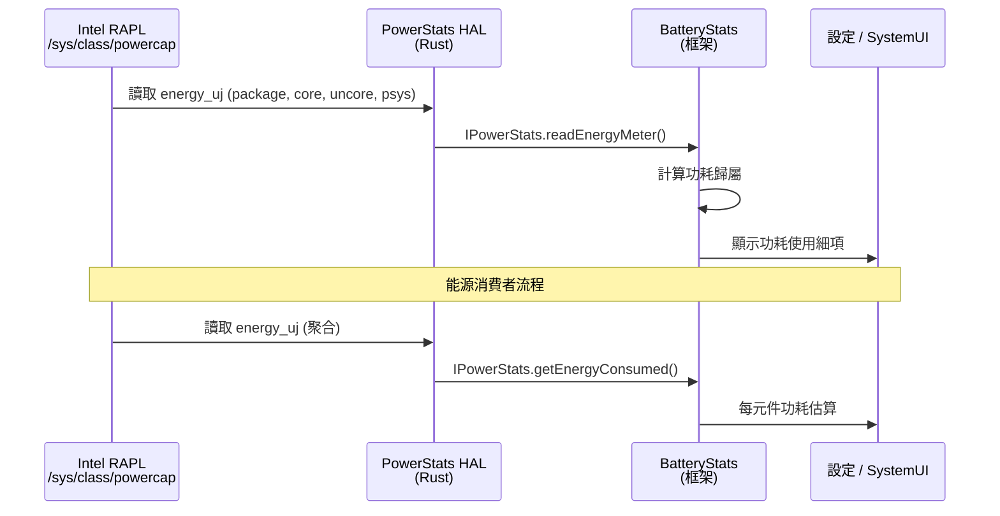
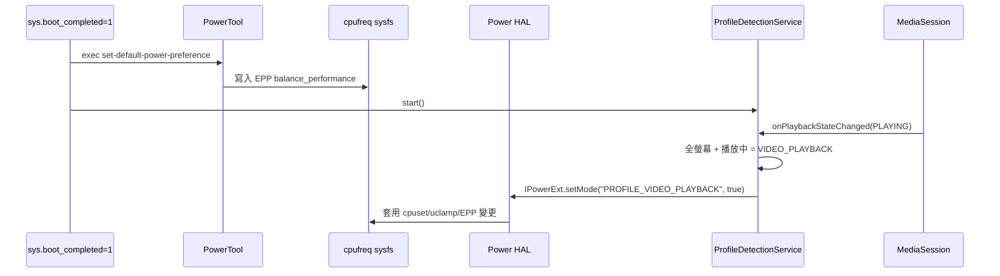
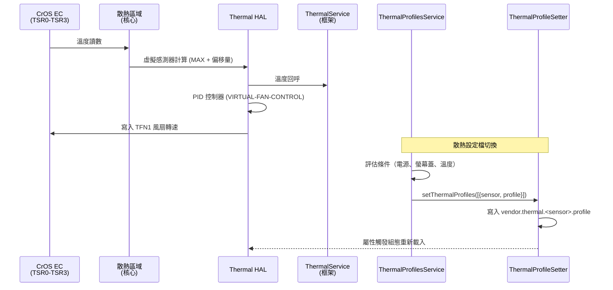
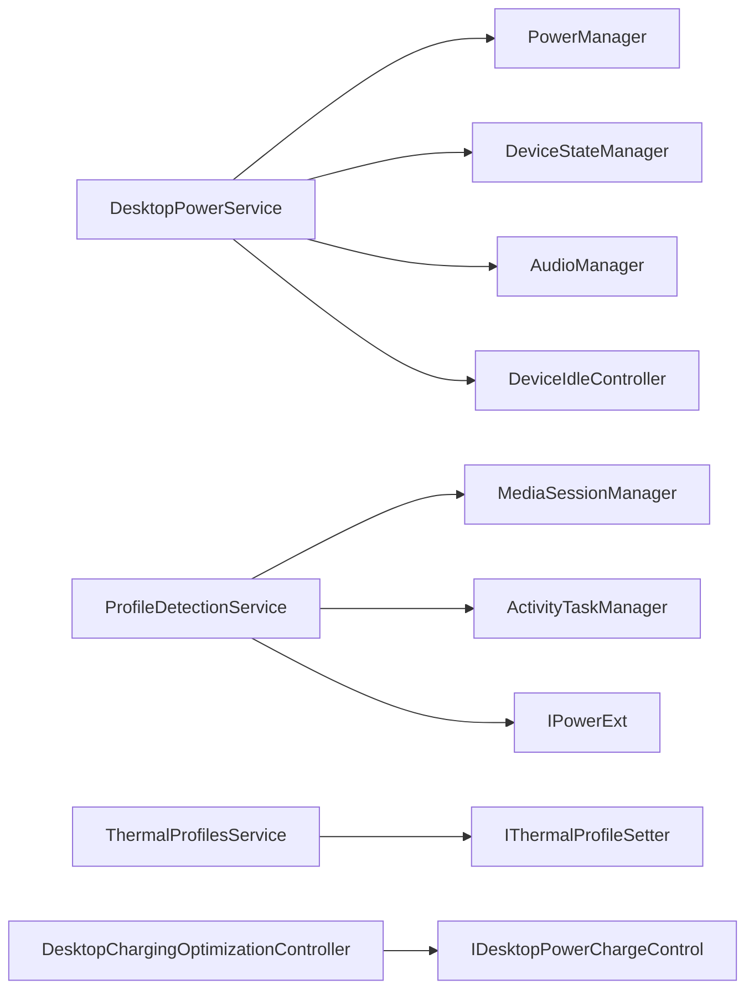

# 電源、散熱與感測器實作

## 1. 架構概述

Android 桌面平台針對 Intel x86_64 桌面/筆記型電腦硬體，實作了完整的電源、散熱與感測器堆疊。架構涵蓋從核心層級的 RAPL 計數器與 IIO 感測器驅動程式，經由供應商 HAL，到框架層級的桌面服務，負責協調電源設定檔、散熱管理與充電最佳化。



## 2. 關鍵元件

| 元件 | 語言 | 類型 | 位置 | 說明 |
|-----------|----------|------|----------|-------------|
| PowerStats HAL | Rust | AIDL HAL v2 | `vendor/google/desktop/power/powerstats/` | 基於 RAPL 的能源計量，供 BatteryStats 使用 |
| PowerTool | Rust | CLI 二進位檔 | `vendor/google/desktop/power/powertool/` | CPU 調速器與 EPP 調校工具 |
| 充電最佳化 | Rust | AIDL HAL v1 | `vendor/google/desktop/power/charging_optimization/` | 透過 EC 實現電池充電維持與速率限制 |
| 暫停通知 | C++ | AIDL HAL | `vendor/google/desktop/power/suspend_notification/` | 核心暫停/恢復事件轉發至框架 |
| Thermal Profile Setter | Rust | AIDL HAL | `vendor/google/desktop/power/thermal_profile_setter/` | 透過 sysfs 屬性進行執行時散熱設定檔切換 |
| Health HAL | C++ | AIDL HAL v5 | `vendor/google/desktop/health/` | 電池健康狀況、電量百分比對映、低電量警示 |
| IIO Sensor Sub-HAL | C++ | HAL 2.1 程式庫 | `vendor/google/desktop/sensors/iio/2.1/` | Linux IIO 至 Android Sensors Multi-HAL 橋接 |
| Intel PMT (libpmt) | Rust | 程式庫 | `vendor/google/desktop/intel-pmt/libpmt/` | 平台監控技術解碼器 |
| Intel PMT (pmt_tool) | Rust | CLI 二進位檔 | `vendor/google/desktop/intel-pmt/pmt_tool/` | PMT 資料收集與顯示工具 |
| DesktopPowerService | Kotlin | SystemService | `vendor/google/desktop/desktop-services/power/` | 框架層電源策略、暫停處理、WiFi 控制 |
| ThermalProfilesService | Kotlin | SystemService | `vendor/google/desktop/desktop-services/thermal_profiles/` | 基於條件的散熱設定檔協調 |
| ProfileDetectionService | Kotlin | Service | `desktop-services/power/src/.../ProfileDetectionService.kt` | 全螢幕影片與媒體工作階段偵測 |
| ec_battery_limits | Rust | 二進位檔 | `vendor/google/desktop/health/` | EC 電池顯示電量閾值發布器 |
| 低電量警示 | C++ | 二進位檔 | `vendor/google/desktop/health/` | 關機時的低電量動畫覆蓋畫面 |

## 3. PowerStats HAL（RAPL 計數器）

### 概述

PowerStats HAL 實作了 `android.hardware.power.stats.IPowerStats`（AIDL v2），將 Intel RAPL（Running Average Power Limit）能源計數器暴露給 Android 的 BatteryStats 框架。完全以 Rust 撰寫。

### 架構

HAL 使用建構器模式（`PowerStatsBuilder`）來註冊平台特定的能源計量提供者。在 x86_64 上，RAPL 計數器從 `/sys/class/powercap/intel-rapl:*` 動態探索。

**已註冊的 RAPL 能源通道：**

| 通道名稱 | 子系統 | RAPL 裝置 | 說明 |
|-------------|-----------|-------------|-------------|
| `package` | SoC | `package-0` | SoC 封裝總功耗 |
| `cores` | SoC | `core` | CPU 核心功耗 |
| `gpu` | SoC | `uncore` | 整合 GPU（uncore）功耗 |
| `psys` | Psys | `psys` | 平台層級系統功耗 |

### 關鍵原始碼檔案

- **`src/main.rs`** - 服務進入點，註冊 AIDL 服務 `android.hardware.power.stats.IPowerStats/default`
- **`src/power_stats.rs`** - 實作 `IPowerStats` 的 `PowerStats` 結構體，包含 `PowerStatsBuilder` 及 `EnergyMeterProvider` 與 `EnergyConsumerProvider` 特徵
- **`src/x86/rapl.rs`** - `RaplEnergyMeterDataProvider` 讀取 `/sys/class/powercap/intel-rapl:*/energy_uj`；`RaplEnergyMeterFactory` 探索 RAPL 節點
- **`src/x86/mod.rs`** - `add_arch_specific()` 註冊 SoC（package、cores、gpu）與 Psys 通道
- **`src/utils.rs`** - 使用 `CLOCK_BOOTTIME` 的 `get_boottime_ms()` 輔助函式

### 能源讀取流程

```
/sys/class/powercap/intel-rapl:*/energy_uj
  -> RaplEnergyMeterDataProvider::read_energy_meter()
    -> EnergyMeasurement { energyUWs, timestampMs }
      -> IPowerStats::readEnergyMeter() / getEnergyConsumed()
        -> Android BatteryStats
```

### VINTF 與 Init

```xml
<!-- android.hardware.power.stats.desktop.xml -->
<hal format="aidl">
    <name>android.hardware.power.stats</name>
    <version>2</version>
    <fqname>IPowerStats/default</fqname>
</hal>
```

```
# android.hardware.power.stats.desktop.rc
service vendor.power.stats-desktop /vendor/bin/hw/android.hardware.power.stats-service.desktop
    interface aidl android.hardware.power.stats.IPowerStats/default
    class hal
    user system
    group system
```

### 建置整合

```makefile
# device.mk
PRODUCT_SOONG_NAMESPACES += vendor/google/desktop/power/powerstats
PRODUCT_PACKAGES += android.hardware.power.stats-service.desktop
BOARD_VENDOR_SEPOLICY_DIRS += vendor/google/desktop/power/powerstats/sepolicy
```

## 4. PowerTool（CPU 調速器與效能調校 CLI）

### 概述

PowerTool 是位於 `/vendor/bin/powertool` 的 Rust CLI 工具，負責管理 CPU 調頻調速器與 Intel Energy Performance Preference（EPP）設定。它透過 init 觸發器在開機時執行，也可手動呼叫（需要 root 權限）。

### 指令

| 指令 | 說明 |
|---------|-------------|
| `set-default-power-preference` | 自動偵測平台：在 Intel 上設定 EPP `balance_performance`，其他平台設定 `schedutil` 調速器 |
| `set-governor <option>` | 設定 CPU 調頻調速器（`performance`、`schedutil`、`powersave`） |
| `show-governor` | 顯示目前的調頻調速器 |
| `set-epp <option>` | 設定 Intel EPP（`maximum`、`performance`、`balance-performance`、`balance-power`、`power`、`governor`、`raw [0-255]`） |
| `show-epp` | 顯示目前的 EPP 設定 |

### Init 觸發器

```
# powertool.rc

# 開機：設定預設電源偏好
on property:sys.boot_completed=1
    exec_background - root system -- /vendor/bin/powertool set-default-power-preference

# 透過屬性動態變更調速器
on property:vendor.powerhal.governor=*
    exec_background - root system -- /vendor/bin/powertool set-governor ${vendor.powerhal.governor}

# 透過屬性動態變更 EPP
on property:vendor.powerhal.epp=*
    exec_background - root system -- /vendor/bin/powertool set-epp ${vendor.powerhal.epp}
```

### 原始碼結構

| 檔案 | 用途 |
|------|---------|
| `src/main.rs` | 使用 `clap` 引數解析器的 CLI 進入點 |
| `src/preference/mod.rs` | 偏好模組宣告 |
| `src/preference/scaling_governor.rs` | 透過 sysfs 讀寫調速器 |
| `src/preference/energy_performance_preference.rs` | 透過 sysfs 讀寫 Intel EPP |
| `src/preference/sysfs_handler.rs` | 通用 sysfs 檔案操作 |

### 使用的 Sysfs 路徑

- 調頻調速器：`/sys/devices/system/cpu/cpu*/cpufreq/scaling_governor`
- EPP：`/sys/devices/system/cpu/cpu*/cpufreq/energy_performance_preference`

## 5. 充電最佳化

### 概述

充電最佳化子系統透過 CrOS 嵌入式控制器（EC）實現電池充電限制與速率控制。它由 AIDL 介面、Rust HAL 實作及 Kotlin 框架控制器組成。

### AIDL 介面

```
// IDesktopPowerChargeControl.aidl
@VintfStability
interface IDesktopPowerChargeControl {
    void setChargingStrategy(in ChargingStrategy strategy);
}
```

`ChargingStrategy` 是支援兩種模式的聯合型別：

| 模式 | 欄位 | 說明 |
|------|-------|-------------|
| 正常/維持 | `sustainParams` | 將電池維持在 `lowerPercent` 與 `upperPercent` 之間（0-100，-1 表示停用） |
| 降低速率 | `reducedRateMilliamps` | 以毫安培限制充電電流 |

### HAL 實作（Rust）

HAL 二進位檔 `vendor.google.desktop.charge-control-hal` 透過 `libec` 與 CrOS EC 通訊，設定充電維持閾值與電流限制。

```
# hal_desktop_charge_control_default.rc
service hal_desktop_charge_control_default /vendor/bin/hw/vendor.google.desktop.charge-control-hal
    class hal
    user system
    group system
```

### 框架控制器

`DesktopChargingOptimizationController`（Kotlin）在 `PHASE_DEVICE_SPECIFIC_SERVICES_READY` 開機階段透過 AIDL 連接至 HAL。`DesktopPowerService` 暴露 `setChargingPolicy()` binder 供設定應用程式呼叫：

- **策略 1（DEFAULT）**：停用維持（`lowerPercent=-1, upperPercent=-1`）
- **策略 2（CHARGE_LIMIT）**：維持在 80%（`lowerPercent=80, upperPercent=80`）

### VINTF

```xml
<hal format="aidl">
    <name>com.android.desktop.power</name>
    <version>1</version>
    <interface>
        <name>IDesktopPowerChargeControl</name>
        <instance>default</instance>
    </interface>
</hal>
```

## 6. 暫停通知（暫停/恢復事件處理）

### 概述

暫停通知服務橋接核心層級的暫停/恢復事件至 Android 框架服務。它從 CrOS EC 裝置 `/dev/suspend_notifier` 讀取資料，並透過 AIDL 回呼轉發事件。

### 架構



### 事件代碼

| 代碼 | 名稱 | 說明 |
|------|------|-------------|
| 1 | `SUSPEND_EVENT_CODE_SUSPEND_IMMINENT` | 系統正在準備暫停 |
| 2 | `SUSPEND_EVENT_CODE_RESUME` | 系統已恢復或暫停失敗 |

### AIDL 介面

```
// ISuspendNotificationService.aidl
@VintfStability
interface ISuspendNotificationService {
    void registerCallback(ISuspendEventCallback callback);
    void acknowledgeSuspendEvent(long token);
}

// ISuspendEventCallback.aidl
@VintfStability
oneway interface ISuspendEventCallback {
    void onSuspendEvent(long eventCode, long token);
}
```

### Init 服務

```
service suspend_notification_service /vendor/bin/hw/suspend_notification_service
    interface aidl com.android.desktop.power.ISuspendNotificationService/default
    class hal
    user system
    group system
    oneshot
```

### 框架整合

`DesktopPowerService` 在 `PHASE_DEVICE_SPECIFIC_SERVICES_READY` 階段註冊回呼。收到暫停即將發生的事件時，它會：
1. 停用 WiFi 連線管理器（防止在暗恢復期間重新連線）
2. 確認事件以解除核心暫停阻塞

此外，`DesktopPowerService` 透過以下方式處理螢幕蓋合上的裝置狀態變更：
- 暫停媒體播放
- 靜音音訊
- 停用框架喚醒鎖
- 移除系統電源白名單應用程式（受保護的應用程式如日曆除外）

## 7. Thermal HAL 組態

### 散熱區域（fatcat/thermal_info_config.json）

fatcat 散熱組態定義了來自 EC 的實體感測器（TSR0-TSR3）、虛擬衍生感測器，以及 PID 控制的風扇管理。

#### 實體感測器

| 名稱 | 類型 | 來源 | 說明 |
|------|------|--------|-------------|
| TSR0 | UNKNOWN | EC | 散熱感測器暫存器 0（DDR/SoC 區域） |
| TSR1 | UNKNOWN | EC | 散熱感測器暫存器 1（環境溫度） |
| TSR2 | UNKNOWN | EC | 散熱感測器暫存器 2（穩壓器） |
| TSR3 | UNKNOWN | EC | 散熱感測器暫存器 3（外殼表面） |

#### 虛擬感測器

所有虛擬感測器使用 `Formula: MAXIMUM`，搭配 `Offset: 150` 與 `Multiplier: 0.001`。

| 虛擬感測器 | 類型 | 來源 | 輪詢間隔 (ms) | 被動間隔 (ms) |
|----------------|------|--------|-------------|--------------|
| VIRTUAL-DDR-SOC | CPU | TSR0 | 10000 | 1000 |
| VIRTUAL-AMBIENT | BATTERY | TSR1 | 10000 | 1000 |
| VIRTUAL-REGULATOR | BATTERY | TSR2 | 10000 | 1000 |
| VIRTUAL-SKIN | BATTERY | TSR3 | 10000 | 1000 |
| VIRTUAL-FAN-CONTROL | UNKNOWN | 全部 4 個虛擬感測器 | 3000 | 1000 |

#### 觸發點（虛擬感測器：DDR-SOC、AMBIENT、REGULATOR、SKIN）

| 嚴重程度索引 | 高溫閾值 (C) | 遲滯值 (C) |
|----------------|-------------------|----------------|
| 1 | 65 | 0 |
| 4 | 75 | 10 |
| 6 | 80 | 0 |

#### 風扇控制（VIRTUAL-FAN-CONTROL）

風扇控制虛擬感測器聚合全部四個虛擬感測器的最高溫度，並使用 PID 控制：

| 參數 | 值 |
|-----------|-------|
| 高溫閾值（索引 1） | 10 C |
| 高溫閾值（索引 2） | 15 C |
| K_Po / K_Pu | 1.4 |
| K_I / K_D | 0 |
| S_Power | 50 |
| MaxAllocPower | 50 |
| MinAllocPower | 0 |

#### 冷卻裝置

| 名稱 | 類型 | 狀態數 | 說明 |
|------|------|--------|-------------|
| TFN1 | FAN | 0-50（51 種狀態） | EC 控制的風扇；State2Power 從 50 線性對映至 0 |

### Init 組態（init.fatcat.rc）

在 `vendor.thermal.link_ready=1` 時，設定以下權限：
- 風扇控制：`/dev/thermal/cdev-by-name/TFN1/cur_state`
- 充電限制器：`/dev/thermal/cdev-by-name/TCHG/cur_state`
- RAPL powercap PL1/PL2/PL4：`/sys/class/powercap/intel-rapl:0/constraint_{0,1,2}_*`
- RAPL MMIO 備份：`/sys/class/powercap/intel-rapl-mmio:0/constraint_{0,1,2}_*`

## 8. Thermal Profile Setter（執行時散熱設定檔切換）

### 概述

Thermal Profile Setter 是供應商端的 Rust AIDL 服務，接收來自框架的散熱設定檔變更，並將其寫入系統屬性，然後由 Thermal HAL 消費以在執行時切換散熱組態。

### AIDL 介面

```
// IThermalProfileSetter.aidl
@VintfStability
oneway interface IThermalProfileSetter {
    void setThermalProfiles(in List<ThermalProfile> profiles);
}

// ThermalProfile.aidl
@VintfStability
parcelable ThermalProfile {
    String sensor;
    String profile;
}
```

### 實作

當 `setThermalProfiles()` 被呼叫時，服務會寫入系統屬性：
```
vendor.thermal.<sensor>.profile = <profile>
```

例如，`sensor="VIRTUAL-DDR-SOC", profile="performance"` 會設定：
```
vendor.thermal.VIRTUAL-DDR-SOC.profile = performance
```

### Init 服務

```
service vendor.thermal_profile_setter /vendor/bin/thermal_profile_setter
    class core
    user system
    group system
    priority -10
```

### SEPolicy

```
type thermal_profile_setter, domain;
init_daemon_domain(thermal_profile_setter)
get_prop(thermal_profile_setter, vendor_desktop_thermal_profiles_prop)
set_prop(thermal_profile_setter, vendor_thermal_prop)
binder_use(thermal_profile_setter)
add_service(thermal_profile_setter, thermal_profile_setter_service)
```

### 框架整合（ThermalProfilesService）

`ThermalProfilesService`（Kotlin SystemService）作為基於條件的協調層：

1. 解析定義條件集的 XML 組態（電源來源、螢幕蓋狀態、平台類型、擴充基座模式、溫度、電池電量）
2. 透過 `ConditionsProcessor` 評估條件
3. 將匹配的條件集對映至包含 `powerHint` 與 `thermalProfile` 項目的動作集
4. 呼叫 `IThermalProfileSetter.setThermalProfiles()` 以套用變更

支援的條件類型：
- `powerSource`（AC / DC）
- `lidState`（開啟 / 關閉）
- `platformType`（翻蓋式 / 平板）
- `dockMode`（已對接 / 未對接）
- `temperature`（感測器 + 值 + 比較器）
- `batteryLevel`（值 + 比較器：eq、neq、gt、ge、lt、le）

## 9. 效能等級

平台根據可用 RAM 定義效能等級，每個等級都繼承自 `performance_common.mk`。

### 通用組態（performance_common.mk）

適用於所有桌面裝置（虛擬機器與實體硬體）。

**LMK（低記憶體終止程式）調校：**

| 屬性 | 值 | 用途 |
|----------|-------|---------|
| `ro.lmk.kill_heaviest_task` | `false` | 遵循 LRU 順序（對 Chrome 分頁終止順序很重要） |
| `ro.lmk.thrashing_limit_decay` | `10` | 在壓力下逐步降低抖動限制 |
| `ro.lmk.psi_partial_stall_ms` | `70` | PSI 部分停滯閾值（ChromeOS 上約第 93 百分位） |
| `ro.lmk.psi_complete_stall_ms` | `700` | PSI 完全停滯閾值（ChromeOS 上約第 99.9 百分位） |
| `ro.lmk.relaxed_available_memory` | `true` | 較寬鬆的可用記憶體計算以減少積極終止 |
| `ro.lmk.swap_compression_ratio` | `263` | 38% 壓縮比（ChromeOS 上約第 95 百分位） |
| `ro.lmk.lowmem_min_oom_score` | `800` | 僅在低水位標記突破時終止快取程序 |
| `ro.lmk.use_psi` | `true` | 使用 PSI 驅動的 LMKD 事件 |
| `ro.lmk.medium` | `800` | 中等壓力終止的最低 OOM 分數 |
| `ro.lmk.critical` | `0` | 危急壓力終止的最低 OOM 分數 |
| `ro.lmk.swap_util_max` | `100` | 無交換區使用率限制 |
| `ro.config.low_ram` | `false` | 非低 RAM 裝置 |
| `apexd.config.boot_activation.threads` | `0` | APEX 啟用執行緒數 = 佇列大小 |

### 高效能（>= 16 GB RAM）

```makefile
# performance_high.mk
$(call inherit-product, $(LOCAL_PATH)/performance_common.mk)
ro.lmk.thrashing_limit=10   # 極低 - 最小抖動容忍度
```

### 中等效能（~8 GB RAM）

```makefile
# performance_med.mk
$(call inherit-product, $(LOCAL_PATH)/performance_common.mk)
# 無額外覆寫 - 使用通用預設值
```

### 低效能（~4 GB RAM）

```makefile
# performance_low.mk
$(call inherit-product, $(LOCAL_PATH)/performance_common.mk)
ro.lmk.thrashing_limit=2    # 非常積極 - 保護低階裝置的 eMMC
```

## 10. Sensor HAL - IIO（工業 I/O）

### 概述

IIO Sensor Sub-HAL 橋接 Linux 工業 I/O（IIO）核心感測器裝置至 Android 的 Sensor Multi-HAL 2.1 框架。最初設計用於透過 SCMI 協定經 VIRTIO 運行的 Android 車載作業系統虛擬機器。

### 支援的感測器類型

- **加速度計**（連續）
- **陀螺儀**（連續）
- **方向感測器**（衍生）
- **RGB 感測器**（事件驅動）

### 關鍵原始碼檔案

| 檔案 | 用途 |
|------|---------|
| `SensorsSubHal.cpp/h` | 主要 ISensorsSubHal 實作；感測器探索與管理 |
| `SensorsSubHalClient.cpp/h` | 回呼傳遞的客戶端介面 |
| `SensorBase.cpp/h` | 所有感測器類型的基底類別；IIO 裝置開啟/讀取/設定 |
| `HWSensorBase.cpp/h` | 具有 IIO 緩衝區管理的硬體感測器基底類別 |
| `EventSensor.cpp/h` | 事件驅動感測器實作 |
| `OrientationSensor.cpp/h` | 從加速度計/陀螺儀衍生的方向感測器 |
| `RGBSensorBase.cpp/h` | RGB 色彩感測器實作 |
| `iio_utils.cpp/h` | IIO sysfs 解析工具（掃描元素、通道、觸發器） |
| `MultiPoll.cpp/h` | 基於 epoll 的多檔案描述符輪詢，用於並行感測器讀取 |
| `SensorThread.cpp/h` | 專用的感測器資料收集執行緒 |

### 建置目標

```
cc_library {
    name: "android.hardware.sensors@2.1-Desktop-IIO-Subhal",
    vendor: true,
    // ... links to sensors@2.0/2.1, multihal, etc.
}
```

### IIO 核心整合

HAL 透過掃描 `/sys/bus/iio/devices/iio:device*` 探索感測器，並讀取：
- `name` - 感測器識別
- `in_*_raw` - 原始感測器數值
- `in_*_scale` - 縮放因子
- `scan_elements/` - 緩衝區通道組態
- `trigger/` - 硬體觸發器設定

## 11. Intel PMT（平台監控技術）

### 概述

Intel PMT 提供硬體層級的平台遙測資料。實作包含用於解碼 PMT 資料的程式庫（`libpmt`）及用於收集與顯示資料的 CLI 工具（`pmt_tool`）。

### libpmt 架構



**模組：**

| 模組 | 用途 |
|--------|---------|
| `pmt_collector` | 從 sysfs 收集原始 PMT 資料 |
| `pmt_decoder` | 使用 protobuf 編碼的中繼資料解碼原始資料 |
| `pmt_sys_interface` | 系統介面抽象層 |
| `pmt_sysfs` | 直接 sysfs 存取層 |
| `transformation` | 資料轉換工具 |

### 建置流程

1. **建置時期**：`pmt_metadata_parser`（主機二進位檔）解析 Intel PMT XML 中繼資料並產生 `decoder.bin`（protobuf 二進位檔）
2. **執行時期**：`libpmt` 嵌入 `decoder.bin` 並使用它解碼從 `/sys/class/intel_pmt/*` 讀取的原始 PMT 資料

### pmt_tool

一個簡單的 Rust CLI 工具，使用 `libpmt` 搭配 `libchrono` 進行帶時間戳記的 PMT 資料收集。

```
rust_binary {
    name: "pmt_tool",
    srcs: ["src/pmt_tool.rs"],
    rustlibs: ["libchrono", "libpmt", "libanyhow"],
}
```

## 12. Health HAL（電池/裝置健康狀態回報）

### 概述

Health HAL 實作了 `android.hardware.health.IHealth`（AIDL v5），具備桌面特定的電池管理、EC 整合及低電量警示系統。

### 關鍵功能

#### 電池電量百分比轉換

實際電池電量百分比使用 EC 回報的閾值轉換為顯示友善的百分比：

```cpp
int TranslateRealToDisplaySoc(int real_soc) {
    double min = EcBatteryLimitProps::min_real_pct().value_or(0.0);
    double max = EcBatteryLimitProps::max_real_pct().value_or(100.0);
    return clamp((real_soc - min) / (max - min) * 100, 0, 100);
}
```

閾值由 `ec_battery_limits` 在開機時從 EC 的 `EC_CMD_DISPLAY_SOC` 指令發布：
- `vendor.cros_ec.display_soc.min_real_pct` - 關機電量閾值（千分比 / 10）
- `vendor.cros_ec.display_soc.max_real_pct` - 滿電因子電量閾值（千分比 / 10）

#### 危急電量隱藏

當外部電源已連接且電池處於危急狀態時，HAL 回報 `LOW` 而非 `CRITICAL`，以防止充電期間不必要的關機。

#### 電流符號修正

ACPI 電池驅動程式（PNP0C0A）即使在放電時也回報正值電流。HAL 在 `batteryStatus == DISCHARGING` 時修正符號。

#### 輪詢策略

- 停用定期例行作業（不喚醒系統）
- 使用 30 秒 `timerfd` 搭配 `TFD_NONBLOCK` 與 `EVENT_NO_WAKEUP_FD`，在喚醒狀態下更新電池狀態
- EC 中斷驅動基於 uevent 的更新

#### 電源供應探測

HAL 在啟動時掃描 `/sys/class/power_supply/`：
- 識別系統電池（類型為 `Battery`，非 `cros-ec-pchg`）
- 忽略 EC 周邊充電器電池（觸控筆等）
- 使用 `charge_now` 而非 `charge_counter`，適用於桌面電池驅動程式

### 低電量警示

`desktop-lowbatteryalert` 在電池處於危急狀態關機時，於所有實體螢幕上顯示 WebP 動畫覆蓋畫面：

```
# lowbatteryalert.rc
service lowbatteryalert /system_ext/bin/desktop-lowbatteryalert
    user graphics
    group graphics
    disabled
    oneshot
on shutdown
    exec_start lowbatteryalert
```

動畫檔案位於 `/system_ext/media/lowbattery.webp`，以 10fps 播放 3 次。

### Init 組態

```
# Health HAL 服務
service vendor.health-default /vendor/bin/hw/android.hardware.health-service.android-desktop
    class hal
    user system
    group system

# 充電模式（含 UI）
service vendor.charger /vendor/bin/hw/android.hardware.health-service.android-desktop --charger
    class charger
    seclabel u:r:charger_vendor:s0
    user system
    group system wakelock input
    capabilities SYS_BOOT

# EC 電池限制（開機時）
on property:sys.boot_completed=1
    exec_background - system cros_ec -- /vendor/bin/hw/ec_battery_limits
```

## 13. 桌面服務整合

### DesktopPowerService

`DesktopPowerService` 是在框架層級協調電源管理的 Kotlin `SystemService`。

**初始化階段：**

| 階段 | 動作 |
|-------|---------|
| `onStart()` | 發布供設定使用的 `IDesktopSettingHealthService` binder |
| `PHASE_DEVICE_SPECIFIC_SERVICES_READY` | 連接暫停通知、充電控制 HAL；註冊裝置狀態回呼；初始化 WiFi 控制器；設定鬧鐘配額 |
| `PHASE_BOOT_COMPLETED` | 啟動 `ProfileDetectionService` |

**關鍵子系統：**

1. **暫停事件處理** - 接收核心暫停/恢復通知，在暫停前停用 WiFi 連線，確認事件
2. **裝置狀態回呼** - 處理螢幕蓋開啟/合上（靜音音訊、暫停媒體、停用喚醒鎖、管理電源白名單）
3. **充電最佳化** - 將設定的充電限制策略代理至 HAL
4. **設定檔偵測** - 偵測全螢幕影片播放並發送 `PROFILE_VIDEO_PLAYBACK` 電源提示
5. **閒置時允許配額** - 將閒置鬧鐘配額限制為 1 以節省電力

### ProfileDetectionService

讀取 `/vendor/etc/perf_policy.json` 並監控：
- **MediaSessionManager** 的播放/暫停狀態
- **ActivityTaskManager** 的全螢幕前景應用程式偵測

當條件匹配時（例如媒體正在播放 + 全螢幕），發送 `IPowerExt.setMode("PROFILE_VIDEO_PLAYBACK", true)` 至 Power HAL。

**perf_policy.json (x86_64)：**
```json
{
  "profiles": [{
    "name": "VIDEO_PLAYBACK",
    "conditions": [
      {"source": "MEDIA_SESSION", "state": "PLAYING"},
      {"source": "TOP_APP", "fullscreen": true}
    ],
    "actions": [
      {"type": "POWER_HINT", "name": "PROFILE_VIDEO_PLAYBACK"}
    ]
  }]
}
```

### ThermalProfilesService

一個在 `PHASE_BOOT_COMPLETED` 時啟動 `Monitor` 的 `SystemService`。監視器：
1. 解析 XML 散熱設定檔組態
2. 評估條件集（電源來源、螢幕蓋狀態、平台類型、擴充基座模式、溫度、電池電量）
3. 將滿足的條件對映至包含電源提示與散熱設定檔的動作集
4. 透過 `IThermalProfileSetter.setThermalProfiles()` 套用散熱設定檔

## 14. 資料流 - 電源





## 15. 資料流 - 散熱



### 散熱閾值升級

```
溫度上升：
  10C -> 風扇啟動 (VIRTUAL-FAN-CONTROL HotThreshold[1])
  15C -> PID 風扇控制啟動 (VIRTUAL-FAN-CONTROL HotThreshold[2])
  65C -> 節流警告 (各感測器 HotThreshold[1])
  75C -> 積極節流 (各感測器 HotThreshold[4], 遲滯值 10C)
  80C -> 危急 (各感測器 HotThreshold[6])
```

## 16. 組態

### thermal_info_config.json (fatcat)

位於 `device/google/desktop/fatcat/thermal/fatcat/thermal_info_config.json`。定義：
- 4 個實體 EC 溫度感測器暫存器（TSR0-TSR3）
- 4 個閾值為 65/75/80 C 的虛擬感測器
- 1 個具有 PID 演算法的風扇控制虛擬感測器
- 1 個具有 51 種狀態的 TFN1 風扇冷卻裝置

通用的 `device/google/desktop/fatcat/thermal/thermal_info_config.json` 是空的佔位檔（`"Sensors":[]`）。

### powerhint.json (fatcat)

位於 `device/google/desktop/fatcat/power/powerhint.json`（通用）及 `power/fatcat/` 中依 CPU 核心數的變體。

**通用（powerhint.json）：**
- 僅 EPP 節點（`vendor.powerhal.epp`）
- `FIXED_PERFORMANCE` -> EPP `maximum`
- `LOW_POWER` -> EPP `balance-power`

**依 CPU 核心數變體：**

| 變體 | 檔案 | CPU 數 | EPP | Cpuset Top-App | 背景/受限 | WorkQueue 遮罩 |
|---------|------|------|-----|----------------|---------------|----------------|
| 6 CPU | `powerhint_cpus_6.json` | 0-5 | 是 | 0-5 / 2-5 | 2-5 | 3f / 3c |
| 8 CPU | `powerhint_cpus_8.json` | 0-7 | 是 | 0-7 / 4-7 | 4-7 | ff / f0 |
| 16 CPU | `powerhint_cpus_16.json` | 0-15 | 是 | 0-15 / 12-15 | 12-15 | ffff / f000 |

**通用電源提示（依 CPU 核心數變體）：**

| 提示 | 動作 |
|------|---------|
| `FIXED_PERFORMANCE` | EPP=`maximum`，結束 `PROFILE_VIDEO_PLAYBACK` |
| `LOW_POWER` | EPP=`balance-power` |
| `PROFILE_VIDEO_PLAYBACK` | 將 cpusets 限制至 E-core，停用 top-app uclamp，停用 sched_load_balance，限制 workqueue 親和性；結束 `FIXED_PERFORMANCE` |
| `AI_CPU_BOOST` | SocSliderBalance=1, SocSliderOffset=0, PlatformProfile=`performance`；結束 `PROFILE_VIDEO_PLAYBACK` |

**額外節點（依 CPU 核心數變體）：**

| 節點 | 路徑 | 預設值 | 用途 |
|------|------|---------|---------|
| SocSliderBalance | `/sys/module/processor_thermal_soc_slider/parameters/slider_balance` | 1 | Intel 散熱滑桿 CPU/GPU 平衡 |
| SocSliderOffset | `/sys/module/processor_thermal_soc_slider/parameters/slider_offset` | 4 | Intel 散熱滑桿偏移量 |
| PlatformProfile | `/sys/class/platform-profile/platform-profile-0/profile` | balanced | ACPI 平台設定檔（balanced/performance/low-power） |
| TopAppUclamp | `/dev/cpuctl/top-app/cpu.uclamp.min` | 65 | top-app 的最小使用率鉗位 |

### init.fatcat.rc 散熱項目

```
on property:vendor.thermal.link_ready=1
    # 風扇 (TFN1) 與充電限制器 (TCHG)
    chown root system /dev/thermal/cdev-by-name/TFN1/cur_state
    chown root system /dev/thermal/cdev-by-name/TCHG/cur_state

    # RAPL powercap PL1, PL2, PL4 (MSR 與 MMIO)
    chown root system /sys/class/powercap/intel-rapl:0/constraint_{0,1,2}_power_limit_uw
    chown root system /sys/class/powercap/intel-rapl:0/constraint_{0,1}_time_window_us
    chown root system /sys/class/powercap/intel-rapl-mmio:0/constraint_{0,1,2}_power_limit_uw
    chown root system /sys/class/powercap/intel-rapl-mmio:0/constraint_{0,1}_time_window_us
```

## 17. 建置整合

### 產品套件

| 套件 | 來源 |
|---------|--------|
| `android.hardware.power.stats-service.desktop` | `vendor/google/desktop/power/powerstats/device.mk` |
| `powertool` | `vendor/google/desktop/power/powertool/Android.bp` |
| `thermal_profile_setter` | `vendor/google/desktop/power/thermal_profile_setter/device.mk` |
| `suspend_notification_service` | `vendor/google/desktop/power/suspend_notification/Android.bp` |
| `vendor.google.desktop.charge-control-hal` | `vendor/google/desktop/power/charging_optimization/default/Android.bp` |
| `android.hardware.health-service.android-desktop` | `vendor/google/desktop/health/Android.bp` |
| `ec_battery_limits` | `vendor/google/desktop/health/Android.bp` |
| `desktop-lowbatteryalert` | `vendor/google/desktop/health/Android.bp` |
| `android.hardware.sensors@2.1-Desktop-IIO-Subhal` | `vendor/google/desktop/sensors/iio/2.1/Android.bp` |
| `perf_policy.json` | `vendor/google/desktop/desktop-services/power/Android.bp` |

### Soong 命名空間

```
PRODUCT_SOONG_NAMESPACES += vendor/google/desktop/power/powerstats
```

### 相容性矩陣

```xml
<!-- thermal_profile_setter.compat.xml -->
<compatibility-matrix version="1.0" type="framework">
    <hal format="aidl">
        <name>vendor.google.thermal_profile</name>
        <interface>
            <name>IThermalProfileSetter</name>
            <instance>default</instance>
        </interface>
    </hal>
</compatibility-matrix>
```

### SEPolicy 目錄

```
BOARD_VENDOR_SEPOLICY_DIRS += vendor/google/desktop/power/powerstats/sepolicy
BOARD_VENDOR_SEPOLICY_DIRS += vendor/google/desktop/power/thermal_profile_setter/sepolicy
BOARD_VENDOR_SEPOLICY_DIRS += device/google/gs-common/thermal/sepolicy/thermal_hal
```

## 18. 子系統間相依性

### 核心相依性

| 元件 | 核心功能 | Sysfs 路徑 |
|-----------|---------------|------------|
| PowerStats HAL | Intel RAPL powercap | `/sys/class/powercap/intel-rapl:*` |
| PowerTool | cpufreq, intel_pstate | `/sys/devices/system/cpu/cpu*/cpufreq/*` |
| Thermal HAL | ACPI 散熱區域、EC | `/dev/thermal/cdev-by-name/*`, `/sys/class/thermal/*` |
| IIO Sensor HAL | IIO 子系統 (SCMI) | `/sys/bus/iio/devices/*` |
| Intel PMT | intel_pmt 驅動程式 | `/sys/class/intel_pmt/*` |
| Health HAL | ACPI 電池 (PNP0C0A) | `/sys/class/power_supply/*` |
| 暫停通知 | CrOS EC 暫停通知器 | `/dev/suspend_notifier` |
| Power HAL | processor_thermal_soc_slider | `/sys/module/processor_thermal_soc_slider/parameters/*` |
| Power HAL | ACPI platform-profile | `/sys/class/platform-profile/platform-profile-0/profile` |

### CrOS EC（嵌入式控制器）

EC 是桌面平台電源管理的核心：

| 功能 | EC 指令/介面 |
|----------|---------------------|
| 電池充電限制 | 透過 `libec` 的 `EC_CMD_DISPLAY_SOC` |
| 充電策略 | `IDesktopPowerChargeControl` -> `libec` -> EC |
| 散熱感測器資料 | TSR0-TSR3 以散熱區域暴露 |
| 風扇控制 | 透過 Thermal HAL 的 TFN1 冷卻裝置 |
| 暫停通知 | `/dev/suspend_notifier` 裝置 |

### 框架相依性



## 19. SEPolicy

### PowerStats HAL

```
# file_contexts
/(vendor|system/vendor)/bin/hw/android\.hardware\.power\.stats-service\.desktop u:object_r:hal_power_stats_default_exec:s0

# hal_power_stats_default.te
allow hal_power_stats_default sysfs:file { getattr open read };
allow hal_power_stats_default sysfs_thermal:dir { search open read };
allow hal_power_stats_default sysfs_thermal:file { getattr open read };
```

### Thermal Profile Setter

```
# thermal_profile_setter.te
type thermal_profile_setter_exec, vendor_file_type, exec_type, file_type;
type thermal_profile_setter, domain;
init_daemon_domain(thermal_profile_setter)
get_prop(thermal_profile_setter, vendor_desktop_thermal_profiles_prop)
set_prop(thermal_profile_setter, vendor_thermal_prop)
binder_use(thermal_profile_setter)
add_service(thermal_profile_setter, thermal_profile_setter_service)
```

### 額外 SEPolicy 目錄

- `vendor/google/desktop/power/thermal_profile_setter/sepolicy/system_server.te` - 框架存取 Thermal Profile Setter
- `vendor/google/desktop/power/thermal_profile_setter/sepolicy/service_contexts` - 服務上下文標籤
- `vendor/google/desktop/power/thermal_profile_setter/sepolicy/service.te` - 服務類型定義
- `device/google/gs-common/thermal/sepolicy/thermal_hal` - 共用的 Thermal HAL 策略

## 20. 關鍵檔案參考

| 檔案 | 絕對路徑 | 用途 |
|------|--------------|---------|
| PowerStats Android.bp | `vendor/google/desktop/power/powerstats/Android.bp` | Rust PowerStats HAL 建置組態 |
| PowerStats device.mk | `vendor/google/desktop/power/powerstats/device.mk` | 產品套件與 SEPolicy |
| PowerStats main.rs | `vendor/google/desktop/power/powerstats/src/main.rs` | HAL 服務進入點 |
| RAPL 提供者 | `vendor/google/desktop/power/powerstats/src/x86/rapl.rs` | Intel RAPL 能源計數器讀取器 |
| PowerStats 邏輯 | `vendor/google/desktop/power/powerstats/src/power_stats.rs` | IPowerStats AIDL 實作 |
| PowerTool Android.bp | `vendor/google/desktop/power/powertool/Android.bp` | powertool CLI 建置組態 |
| PowerTool main.rs | `vendor/google/desktop/power/powertool/src/main.rs` | CLI 進入點 |
| PowerTool .rc | `vendor/google/desktop/power/powertool/powertool.rc` | 調速器/EPP 的 Init 觸發器 |
| Charge Control AIDL | `vendor/google/desktop/power/charging_optimization/aidl/Android.bp` | AIDL 介面定義 |
| Charge Control HAL | `vendor/google/desktop/power/charging_optimization/default/Android.bp` | Rust HAL 實作 |
| IDesktopPowerChargeControl | `vendor/google/desktop/power/charging_optimization/aidl/com/android/desktop/power/IDesktopPowerChargeControl.aidl` | 充電策略 AIDL |
| 暫停通知 | `vendor/google/desktop/power/suspend_notification/suspend_notification_service.cpp` | C++ 暫停事件轉發 |
| ISuspendNotificationService | `vendor/google/desktop/power/suspend_notification/aidl/com/android/desktop/power/ISuspendNotificationService.aidl` | 暫停事件 AIDL |
| Thermal Profile Setter | `vendor/google/desktop/power/thermal_profile_setter/Android.bp` | 建置組態（AIDL + Rust 服務） |
| Thermal Profile Setter main.rs | `vendor/google/desktop/power/thermal_profile_setter/src/main.rs` | AIDL 服務 -> 系統屬性寫入器 |
| IThermalProfileSetter | `vendor/google/desktop/power/thermal_profile_setter/vendor/google/thermal_profile/IThermalProfileSetter.aidl` | 設定檔切換器 AIDL |
| Health HAL | `vendor/google/desktop/health/Android.bp` | Health HAL、ec_battery_limits、lowbatteryalert |
| Health.cpp | `vendor/google/desktop/health/Health.cpp` | Health HAL 實作 |
| ec_battery_limits.rs | `vendor/google/desktop/health/ec_battery_limits.rs` | EC 電池顯示電量發布器 |
| 低電量警示 | `vendor/google/desktop/health/lowbatteryalert.cpp` | 關機低電量動畫 |
| IIO Sensor HAL | `vendor/google/desktop/sensors/iio/2.1/Android.bp` | IIO 感測器 sub-HAL 建置 |
| SensorsSubHal | `vendor/google/desktop/sensors/iio/2.1/SensorsSubHal.cpp` | 主要感測器 sub-HAL 邏輯 |
| libpmt | `vendor/google/desktop/intel-pmt/libpmt/Android.bp` | Intel PMT 解碼器程式庫 |
| pmt_tool | `vendor/google/desktop/intel-pmt/pmt_tool/Android.bp` | PMT 資料收集工具 |
| 散熱組態 (fatcat) | `device/google/desktop/fatcat/thermal/fatcat/thermal_info_config.json` | 散熱區域、感測器、風扇 PID |
| 電源提示（通用） | `device/google/desktop/fatcat/power/powerhint.json` | 僅 EPP 的電源提示 |
| 電源提示（8 CPU） | `device/google/desktop/fatcat/power/fatcat/powerhint_cpus_8.json` | 8 核心完整電源提示 |
| 電源提示（6 CPU） | `device/google/desktop/fatcat/power/fatcat/powerhint_cpus_6.json` | 6 核心完整電源提示 |
| 電源提示（16 CPU） | `device/google/desktop/fatcat/power/fatcat/powerhint_cpus_16.json` | 16 核心完整電源提示 |
| 效能通用 | `device/google/desktop/common/performance/performance_common.mk` | 所有桌面的 LMK 調校 |
| 效能高 | `device/google/desktop/common/performance/performance_high.mk` | >= 16 GB RAM 調校 |
| 效能中 | `device/google/desktop/common/performance/performance_med.mk` | ~8 GB RAM 調校 |
| 效能低 | `device/google/desktop/common/performance/performance_low.mk` | ~4 GB RAM 調校 |
| DesktopPowerService | `vendor/google/desktop/desktop-services/power/src/com/android/server/desktop/power/DesktopPowerService.kt` | 框架電源協調 |
| ProfileDetectionService | `vendor/google/desktop/desktop-services/power/src/com/android/server/desktop/power/ProfileDetectionService.kt` | 影片播放偵測 |
| ChargingOptController | `vendor/google/desktop/desktop-services/power/src/com/android/server/desktop/power/DesktopChargingOptimizationController.kt` | 充電限制控制器 |
| perf_policy.json (x86_64) | `vendor/google/desktop/desktop-services/power/conf/x86_64/perf_policy.json` | 設定檔偵測規則 |
| ThermalProfilesService | `vendor/google/desktop/desktop-services/thermal_profiles/src/com/android/server/desktop/thermal_profiles/ThermalProfilesService.kt` | 散熱設定檔協調 |
| ConfigParser | `vendor/google/desktop/desktop-services/thermal_profiles/src/com/android/server/desktop/thermal_profiles/ConfigParser.kt` | XML 散熱設定檔組態解析器 |
| init.fatcat.rc | `device/google/desktop/fatcat/init.fatcat.rc` | Thermal HAL 權限、powercap 設定 |
| Power README | `vendor/google/desktop/power/README.md` | 電源子系統文件 |
