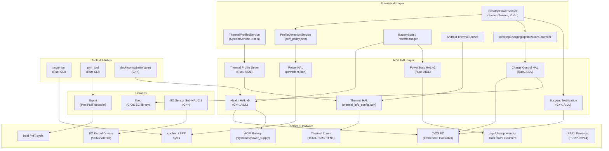
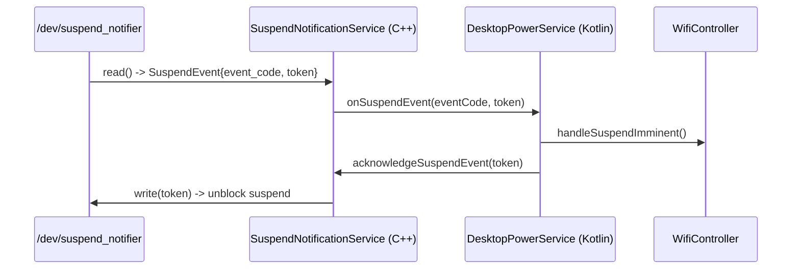
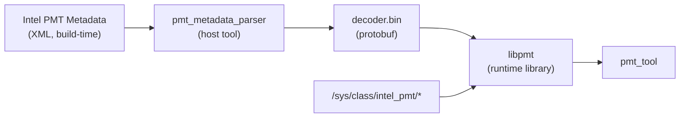
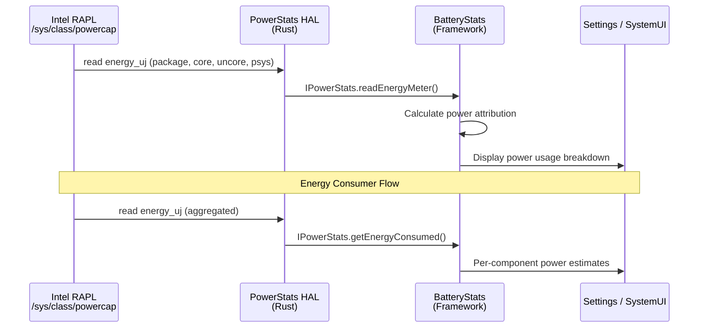
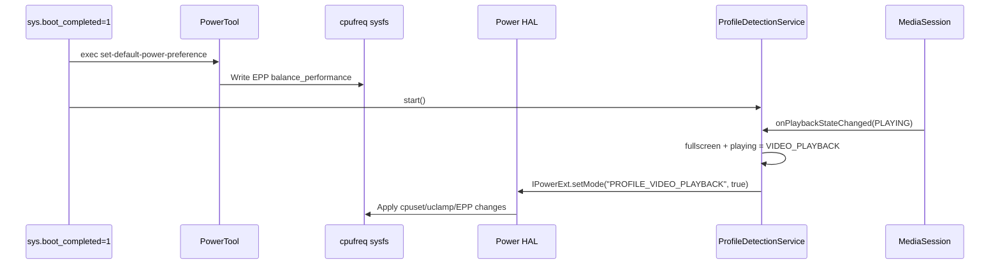
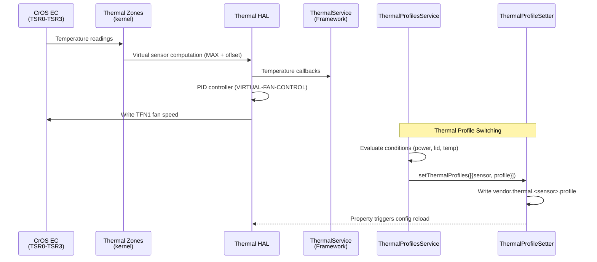
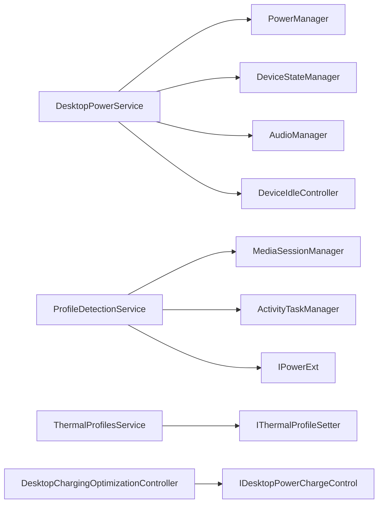

# Power, Thermal, and Sensors Implementation

## 1. Architecture Overview

The Android Desktop Platform implements a full power, thermal, and sensor stack tailored for Intel x86_64 desktop/laptop hardware. The architecture spans from kernel-level RAPL counters and IIO sensor drivers through vendor HALs to framework-level desktop services that orchestrate power profiles, thermal management, and charging optimization.



## 2. Key Components

| Component | Language | Type | Location | Description |
|-----------|----------|------|----------|-------------|
| PowerStats HAL | Rust | AIDL HAL v2 | `vendor/google/desktop/power/powerstats/` | RAPL-based energy metering for BatteryStats |
| PowerTool | Rust | CLI binary | `vendor/google/desktop/power/powertool/` | CPU governor and EPP tuning utility |
| Charging Optimization | Rust | AIDL HAL v1 | `vendor/google/desktop/power/charging_optimization/` | Battery charge sustain and rate limiting via EC |
| Suspend Notification | C++ | AIDL HAL | `vendor/google/desktop/power/suspend_notification/` | Kernel suspend/resume event relay to framework |
| Thermal Profile Setter | Rust | AIDL HAL | `vendor/google/desktop/power/thermal_profile_setter/` | Runtime thermal profile switching via sysfs props |
| Health HAL | C++ | AIDL HAL v5 | `vendor/google/desktop/health/` | Battery health, SoC mapping, low-battery alert |
| IIO Sensor Sub-HAL | C++ | HAL 2.1 lib | `vendor/google/desktop/sensors/iio/2.1/` | Linux IIO to Android Sensors Multi-HAL bridge |
| Intel PMT (libpmt) | Rust | Library | `vendor/google/desktop/intel-pmt/libpmt/` | Platform Monitoring Technology decoder |
| Intel PMT (pmt_tool) | Rust | CLI binary | `vendor/google/desktop/intel-pmt/pmt_tool/` | PMT data collection and display tool |
| DesktopPowerService | Kotlin | SystemService | `vendor/google/desktop/desktop-services/power/` | Framework power policy, suspend handling, WiFi control |
| ThermalProfilesService | Kotlin | SystemService | `vendor/google/desktop/desktop-services/thermal_profiles/` | Condition-based thermal profile orchestration |
| ProfileDetectionService | Kotlin | Service | `desktop-services/power/src/.../ProfileDetectionService.kt` | Fullscreen video and media session detection |
| ec_battery_limits | Rust | Binary | `vendor/google/desktop/health/` | EC battery display SoC threshold publisher |
| Low Battery Alert | C++ | Binary | `vendor/google/desktop/health/` | Animated low-battery overlay on shutdown |

## 3. PowerStats HAL (RAPL Counters)

### Overview

The PowerStats HAL implements `android.hardware.power.stats.IPowerStats` (AIDL v2) to expose Intel RAPL (Running Average Power Limit) energy counters to Android's BatteryStats framework. It is written entirely in Rust.

### Architecture

The HAL uses a builder pattern (`PowerStatsBuilder`) to register platform-specific energy meter providers. On x86_64, RAPL counters are discovered dynamically from `/sys/class/powercap/intel-rapl:*`.

**RAPL Energy Channels Registered:**

| Channel Name | Subsystem | RAPL Device | Description |
|-------------|-----------|-------------|-------------|
| `package` | SoC | `package-0` | Total SoC package power |
| `cores` | SoC | `core` | CPU core power |
| `gpu` | SoC | `uncore` | Integrated GPU (uncore) power |
| `psys` | Psys | `psys` | Platform-level system power |

### Key Source Files

- **`src/main.rs`** - Service entry point, registers AIDL service `android.hardware.power.stats.IPowerStats/default`
- **`src/power_stats.rs`** - `PowerStats` struct implementing `IPowerStats`, `PowerStatsBuilder` with `EnergyMeterProvider` and `EnergyConsumerProvider` traits
- **`src/x86/rapl.rs`** - `RaplEnergyMeterDataProvider` reads `/sys/class/powercap/intel-rapl:*/energy_uj`; `RaplEnergyMeterFactory` discovers RAPL nodes
- **`src/x86/mod.rs`** - `add_arch_specific()` registers SoC (package, cores, gpu) and Psys channels
- **`src/utils.rs`** - `get_boottime_ms()` helper using `CLOCK_BOOTTIME`

### Energy Reading Flow

```
/sys/class/powercap/intel-rapl:*/energy_uj
  -> RaplEnergyMeterDataProvider::read_energy_meter()
    -> EnergyMeasurement { energyUWs, timestampMs }
      -> IPowerStats::readEnergyMeter() / getEnergyConsumed()
        -> Android BatteryStats
```

### VINTF & Init

```xml
<!-- android.hardware.power.stats.desktop.xml -->
<hal format="aidl">
    <name>android.hardware.power.stats</name>
    <version>2</version>
    <fqname>IPowerStats/default</fqname>
</hal>
```

```
# android.hardware.power.stats.desktop.rc
service vendor.power.stats-desktop /vendor/bin/hw/android.hardware.power.stats-service.desktop
    interface aidl android.hardware.power.stats.IPowerStats/default
    class hal
    user system
    group system
```

### Build Integration

```makefile
# device.mk
PRODUCT_SOONG_NAMESPACES += vendor/google/desktop/power/powerstats
PRODUCT_PACKAGES += android.hardware.power.stats-service.desktop
BOARD_VENDOR_SEPOLICY_DIRS += vendor/google/desktop/power/powerstats/sepolicy
```

## 4. PowerTool (CPU Governor & Performance Tuning CLI)

### Overview

PowerTool is a Rust CLI utility at `/vendor/bin/powertool` that manages CPU scaling governors and Intel Energy Performance Preference (EPP) settings. It runs on boot via init triggers and can be invoked manually (requires root).

### Commands

| Command | Description |
|---------|-------------|
| `set-default-power-preference` | Auto-detects platform: sets EPP `balance_performance` on Intel, `schedutil` governor on others |
| `set-governor <option>` | Sets CPU scaling governor (`performance`, `schedutil`, `powersave`) |
| `show-governor` | Prints current scaling governor |
| `set-epp <option>` | Sets Intel EPP (`maximum`, `performance`, `balance-performance`, `balance-power`, `power`, `governor`, `raw [0-255]`) |
| `show-epp` | Prints current EPP setting |

### Init Triggers

```
# powertool.rc

# Boot: set default power preference
on property:sys.boot_completed=1
    exec_background - root system -- /vendor/bin/powertool set-default-power-preference

# Dynamic governor changes via property
on property:vendor.powerhal.governor=*
    exec_background - root system -- /vendor/bin/powertool set-governor ${vendor.powerhal.governor}

# Dynamic EPP changes via property
on property:vendor.powerhal.epp=*
    exec_background - root system -- /vendor/bin/powertool set-epp ${vendor.powerhal.epp}
```

### Source Structure

| File | Purpose |
|------|---------|
| `src/main.rs` | CLI entry point using `clap` argument parser |
| `src/preference/mod.rs` | Preference module declarations |
| `src/preference/scaling_governor.rs` | Governor read/write via sysfs |
| `src/preference/energy_performance_preference.rs` | Intel EPP read/write via sysfs |
| `src/preference/sysfs_handler.rs` | Generic sysfs file operations |

### Sysfs Paths Used

- Scaling governor: `/sys/devices/system/cpu/cpu*/cpufreq/scaling_governor`
- EPP: `/sys/devices/system/cpu/cpu*/cpufreq/energy_performance_preference`

## 5. Charging Optimization

### Overview

The Charging Optimization subsystem implements battery charge limiting and rate control through the CrOS Embedded Controller (EC). It consists of an AIDL interface, a Rust HAL implementation, and a Kotlin framework controller.

### AIDL Interface

```
// IDesktopPowerChargeControl.aidl
@VintfStability
interface IDesktopPowerChargeControl {
    void setChargingStrategy(in ChargingStrategy strategy);
}
```

The `ChargingStrategy` is a union type supporting two modes:

| Mode | Field | Description |
|------|-------|-------------|
| Normal/Sustain | `sustainParams` | Hold battery between `lowerPercent` and `upperPercent` (0-100, -1 to disable) |
| Reduced Rate | `reducedRateMilliamps` | Limit charging current in milliamps |

### HAL Implementation (Rust)

The HAL binary `vendor.google.desktop.charge-control-hal` communicates with the CrOS EC via `libec` to set charge sustain thresholds and current limits.

```
# hal_desktop_charge_control_default.rc
service hal_desktop_charge_control_default /vendor/bin/hw/vendor.google.desktop.charge-control-hal
    class hal
    user system
    group system
```

### Framework Controller

`DesktopChargingOptimizationController` (Kotlin) connects to the HAL via AIDL at boot phase `PHASE_DEVICE_SPECIFIC_SERVICES_READY`. The `DesktopPowerService` exposes a `setChargingPolicy()` binder for Settings to call:

- **Policy 1 (DEFAULT)**: Sustain disabled (`lowerPercent=-1, upperPercent=-1`)
- **Policy 2 (CHARGE_LIMIT)**: Sustain at 80% (`lowerPercent=80, upperPercent=80`)

### VINTF

```xml
<hal format="aidl">
    <name>com.android.desktop.power</name>
    <version>1</version>
    <interface>
        <name>IDesktopPowerChargeControl</name>
        <instance>default</instance>
    </interface>
</hal>
```

## 6. Suspend Notification (Suspend/Resume Event Handling)

### Overview

The Suspend Notification Service bridges kernel-level suspend/resume events to Android framework services. It reads from `/dev/suspend_notifier`, a CrOS EC device, and relays events via AIDL callbacks.

### Architecture



### Event Codes

| Code | Name | Description |
|------|------|-------------|
| 1 | `SUSPEND_EVENT_CODE_SUSPEND_IMMINENT` | System preparing to suspend |
| 2 | `SUSPEND_EVENT_CODE_RESUME` | System has resumed or suspend failed |

### AIDL Interface

```
// ISuspendNotificationService.aidl
@VintfStability
interface ISuspendNotificationService {
    void registerCallback(ISuspendEventCallback callback);
    void acknowledgeSuspendEvent(long token);
}

// ISuspendEventCallback.aidl
@VintfStability
oneway interface ISuspendEventCallback {
    void onSuspendEvent(long eventCode, long token);
}
```

### Init Service

```
service suspend_notification_service /vendor/bin/hw/suspend_notification_service
    interface aidl com.android.desktop.power.ISuspendNotificationService/default
    class hal
    user system
    group system
    oneshot
```

### Framework Integration

`DesktopPowerService` registers a callback at `PHASE_DEVICE_SPECIFIC_SERVICES_READY`. On suspend-imminent events, it:
1. Disables WiFi connectivity manager (prevent reconnection during dark resume)
2. Acknowledges the event to unblock kernel suspend

Additionally, `DesktopPowerService` handles lid-close device state changes by:
- Pausing media playback
- Muting audio
- Disabling framework wakelocks
- Removing system power whitelist apps (except protected ones like Calendar)

## 7. Thermal HAL Configuration

### Thermal Zones (fatcat/thermal_info_config.json)

The fatcat thermal configuration defines physical sensors from the EC (TSR0-TSR3), virtual derived sensors, and PID-controlled fan management.

#### Physical Sensors

| Name | Type | Source | Description |
|------|------|--------|-------------|
| TSR0 | UNKNOWN | EC | Thermal Sensor Register 0 (DDR/SoC area) |
| TSR1 | UNKNOWN | EC | Thermal Sensor Register 1 (Ambient) |
| TSR2 | UNKNOWN | EC | Thermal Sensor Register 2 (Regulator) |
| TSR3 | UNKNOWN | EC | Thermal Sensor Register 3 (Skin) |

#### Virtual Sensors

All virtual sensors use `Formula: MAXIMUM` with `Offset: 150` and `Multiplier: 0.001`.

| Virtual Sensor | Type | Source | Polling (ms) | Passive (ms) |
|----------------|------|--------|-------------|--------------|
| VIRTUAL-DDR-SOC | CPU | TSR0 | 10000 | 1000 |
| VIRTUAL-AMBIENT | BATTERY | TSR1 | 10000 | 1000 |
| VIRTUAL-REGULATOR | BATTERY | TSR2 | 10000 | 1000 |
| VIRTUAL-SKIN | BATTERY | TSR3 | 10000 | 1000 |
| VIRTUAL-FAN-CONTROL | UNKNOWN | All 4 virtual sensors | 3000 | 1000 |

#### Trip Points (Virtual Sensors: DDR-SOC, AMBIENT, REGULATOR, SKIN)

| Severity Index | Hot Threshold (C) | Hysteresis (C) |
|----------------|-------------------|----------------|
| 1 | 65 | 0 |
| 4 | 75 | 10 |
| 6 | 80 | 0 |

#### Fan Control (VIRTUAL-FAN-CONTROL)

The fan control virtual sensor aggregates the maximum temperature from all four virtual sensors and uses PID control:

| Parameter | Value |
|-----------|-------|
| Hot Threshold (index 1) | 10 C |
| Hot Threshold (index 2) | 15 C |
| K_Po / K_Pu | 1.4 |
| K_I / K_D | 0 |
| S_Power | 50 |
| MaxAllocPower | 50 |
| MinAllocPower | 0 |

#### Cooling Devices

| Name | Type | States | Description |
|------|------|--------|-------------|
| TFN1 | FAN | 0-50 (51 states) | EC-controlled fan; State2Power maps linearly from 50 to 0 |

### Init Configuration (init.fatcat.rc)

On `vendor.thermal.link_ready=1`, permissions are set for:
- Fan control: `/dev/thermal/cdev-by-name/TFN1/cur_state`
- Charge limiter: `/dev/thermal/cdev-by-name/TCHG/cur_state`
- RAPL powercap PL1/PL2/PL4: `/sys/class/powercap/intel-rapl:0/constraint_{0,1,2}_*`
- RAPL MMIO backup: `/sys/class/powercap/intel-rapl-mmio:0/constraint_{0,1,2}_*`

## 8. Thermal Profile Setter (Runtime Thermal Profile Switching)

### Overview

The Thermal Profile Setter is a vendor-side Rust AIDL service that receives thermal profile changes from the framework and writes them to system properties, which are then consumed by the Thermal HAL to switch thermal configurations at runtime.

### AIDL Interface

```
// IThermalProfileSetter.aidl
@VintfStability
oneway interface IThermalProfileSetter {
    void setThermalProfiles(in List<ThermalProfile> profiles);
}

// ThermalProfile.aidl
@VintfStability
parcelable ThermalProfile {
    String sensor;
    String profile;
}
```

### Implementation

When `setThermalProfiles()` is called, the service writes to system properties:
```
vendor.thermal.<sensor>.profile = <profile>
```

For example, `sensor="VIRTUAL-DDR-SOC", profile="performance"` sets:
```
vendor.thermal.VIRTUAL-DDR-SOC.profile = performance
```

### Init Service

```
service vendor.thermal_profile_setter /vendor/bin/thermal_profile_setter
    class core
    user system
    group system
    priority -10
```

### SEPolicy

```
type thermal_profile_setter, domain;
init_daemon_domain(thermal_profile_setter)
get_prop(thermal_profile_setter, vendor_desktop_thermal_profiles_prop)
set_prop(thermal_profile_setter, vendor_thermal_prop)
binder_use(thermal_profile_setter)
add_service(thermal_profile_setter, thermal_profile_setter_service)
```

### Framework Integration (ThermalProfilesService)

The `ThermalProfilesService` (Kotlin SystemService) acts as the condition-based orchestration layer:

1. Parses XML configuration defining condition sets (power source, lid state, platform type, dock mode, temperature, battery level)
2. Evaluates conditions via `ConditionsProcessor`
3. Maps matched condition sets to action sets containing `powerHint` and `thermalProfile` entries
4. Calls `IThermalProfileSetter.setThermalProfiles()` to apply changes

Condition types supported:
- `powerSource` (AC / DC)
- `lidState` (Open / Closed)
- `platformType` (Clamshell / Tablet)
- `dockMode` (Docked / Undocked)
- `temperature` (sensor + value + comparator)
- `batteryLevel` (value + comparator: eq, neq, gt, ge, lt, le)

## 9. Performance Tiers

The platform defines performance tiers based on available RAM, each inheriting from `performance_common.mk`.

### Common Configuration (performance_common.mk)

Applies to all desktop devices (VMs and real hardware).

**LMK (Low Memory Killer) Tunings:**

| Property | Value | Purpose |
|----------|-------|---------|
| `ro.lmk.kill_heaviest_task` | `false` | Respect LRU order (important for Chrome tab kill order) |
| `ro.lmk.thrashing_limit_decay` | `10` | Step-wise lower thrashing limit under pressure |
| `ro.lmk.psi_partial_stall_ms` | `70` | PSI partial stall threshold (~93rd percentile on ChromeOS) |
| `ro.lmk.psi_complete_stall_ms` | `700` | PSI complete stall threshold (~99.9th percentile on ChromeOS) |
| `ro.lmk.relaxed_available_memory` | `true` | Looser available memory calculation for less aggressive kills |
| `ro.lmk.swap_compression_ratio` | `263` | 38% compression ratio (~95th percentile on ChromeOS) |
| `ro.lmk.lowmem_min_oom_score` | `800` | Only kill cached processes on low watermark breach alone |
| `ro.lmk.use_psi` | `true` | Use PSI-driven LMKD events |
| `ro.lmk.medium` | `800` | Min OOM score for medium-pressure kills |
| `ro.lmk.critical` | `0` | Min OOM score for critical-pressure kills |
| `ro.lmk.swap_util_max` | `100` | No swap utilization limit |
| `ro.config.low_ram` | `false` | Not a low-RAM device |
| `apexd.config.boot_activation.threads` | `0` | APEX activation threads = queue size |

### High Performance (>= 16 GB RAM)

```makefile
# performance_high.mk
$(call inherit-product, $(LOCAL_PATH)/performance_common.mk)
ro.lmk.thrashing_limit=10   # Very low - minimal thrashing tolerance
```

### Medium Performance (~8 GB RAM)

```makefile
# performance_med.mk
$(call inherit-product, $(LOCAL_PATH)/performance_common.mk)
# No additional overrides - uses common defaults
```

### Low Performance (~4 GB RAM)

```makefile
# performance_low.mk
$(call inherit-product, $(LOCAL_PATH)/performance_common.mk)
ro.lmk.thrashing_limit=2    # Very aggressive - preserve eMMC on low-end
```

## 10. Sensor HAL - IIO (Industrial I/O)

### Overview

The IIO Sensor Sub-HAL bridges Linux Industrial I/O (IIO) kernel sensor devices to Android's Sensor Multi-HAL 2.1 framework. It was originally designed for Android Automotive OS VMs using the SCMI protocol over VIRTIO.

### Supported Sensor Types

- **Accelerometer** (continuous)
- **Gyroscope** (continuous)
- **Orientation Sensor** (derived)
- **RGB Sensor** (event-based)

### Key Source Files

| File | Purpose |
|------|---------|
| `SensorsSubHal.cpp/h` | Main ISensorsSubHal implementation; sensor discovery and management |
| `SensorsSubHalClient.cpp/h` | Client interface for callback delivery |
| `SensorBase.cpp/h` | Base class for all sensor types; IIO device open/read/configure |
| `HWSensorBase.cpp/h` | Hardware sensor base class with IIO buffer management |
| `EventSensor.cpp/h` | Event-based sensor implementation |
| `OrientationSensor.cpp/h` | Derived orientation sensor from accel/gyro |
| `RGBSensorBase.cpp/h` | RGB color sensor implementation |
| `iio_utils.cpp/h` | IIO sysfs parsing utilities (scan elements, channels, triggers) |
| `MultiPoll.cpp/h` | epoll-based multi-FD polling for concurrent sensor reads |
| `SensorThread.cpp/h` | Dedicated thread for sensor data collection |

### Build Target

```
cc_library {
    name: "android.hardware.sensors@2.1-Desktop-IIO-Subhal",
    vendor: true,
    // ... links to sensors@2.0/2.1, multihal, etc.
}
```

### IIO Kernel Integration

The HAL discovers sensors by scanning `/sys/bus/iio/devices/iio:device*` and reads:
- `name` - sensor identity
- `in_*_raw` - raw sensor values
- `in_*_scale` - scaling factor
- `scan_elements/` - buffer channel configuration
- `trigger/` - hardware trigger settings

## 11. Intel PMT (Platform Monitoring Technology)

### Overview

Intel PMT provides hardware-level platform telemetry data. The implementation consists of a library (`libpmt`) for decoding PMT data and a CLI tool (`pmt_tool`) for collecting and displaying it.

### libpmt Architecture



**Modules:**

| Module | Purpose |
|--------|---------|
| `pmt_collector` | Collects raw PMT data from sysfs |
| `pmt_decoder` | Decodes raw data using protobuf-encoded metadata |
| `pmt_sys_interface` | System interface abstraction |
| `pmt_sysfs` | Direct sysfs access layer |
| `transformation` | Data transformation utilities |

### Build Process

1. **Build-time**: `pmt_metadata_parser` (host binary) parses Intel PMT XML metadata and generates `decoder.bin` (protobuf binary)
2. **Runtime**: `libpmt` embeds `decoder.bin` and uses it to decode raw PMT data read from `/sys/class/intel_pmt/*`

### pmt_tool

A simple Rust CLI tool that uses `libpmt` with `libchrono` for timestamped PMT data collection.

```
rust_binary {
    name: "pmt_tool",
    srcs: ["src/pmt_tool.rs"],
    rustlibs: ["libchrono", "libpmt", "libanyhow"],
}
```

## 12. Health HAL (Battery/Device Health Reporting)

### Overview

The Health HAL implements `android.hardware.health.IHealth` (AIDL v5) with desktop-specific battery management, EC integration, and a low-battery alert system.

### Key Features

#### Battery SoC Translation

The real battery state-of-charge is translated to a display-friendly percentage using EC-reported thresholds:

```cpp
int TranslateRealToDisplaySoc(int real_soc) {
    double min = EcBatteryLimitProps::min_real_pct().value_or(0.0);
    double max = EcBatteryLimitProps::max_real_pct().value_or(100.0);
    return clamp((real_soc - min) / (max - min) * 100, 0, 100);
}
```

Thresholds are published by `ec_battery_limits` at boot from EC's `EC_CMD_DISPLAY_SOC` command:
- `vendor.cros_ec.display_soc.min_real_pct` - Shutdown SoC threshold (per mille / 10)
- `vendor.cros_ec.display_soc.max_real_pct` - Full factor SoC threshold (per mille / 10)

#### Critical Battery Hiding

When external power is connected and battery is critical, the HAL reports `LOW` instead of `CRITICAL` to prevent unnecessary shutdown while charging.

#### Current Sign Fix

The ACPI battery driver (PNP0C0A) reports positive current even during discharge. The HAL corrects the sign when `batteryStatus == DISCHARGING`.

#### Polling Strategy

- Periodic chores are disabled (no waking the system)
- A 30-second `timerfd` with `TFD_NONBLOCK` and `EVENT_NO_WAKEUP_FD` updates battery status while awake
- EC interrupts drive uevent-based updates

#### Power Supply Probing

The HAL scans `/sys/class/power_supply/` at startup:
- Identifies the system battery (type `Battery`, not `cros-ec-pchg`)
- Ignores EC peripheral charger batteries (stylus, etc.)
- Uses `charge_now` instead of `charge_counter` for desktop battery drivers

### Low Battery Alert

`desktop-lowbatteryalert` displays an animated WebP overlay on all physical displays when battery is critical at shutdown:

```
# lowbatteryalert.rc
service lowbatteryalert /system_ext/bin/desktop-lowbatteryalert
    user graphics
    group graphics
    disabled
    oneshot
on shutdown
    exec_start lowbatteryalert
```

The animation file is `/system_ext/media/lowbattery.webp`, played 3 times at 10fps.

### Init Configuration

```
# Health HAL service
service vendor.health-default /vendor/bin/hw/android.hardware.health-service.android-desktop
    class hal
    user system
    group system

# Charger mode (with UI)
service vendor.charger /vendor/bin/hw/android.hardware.health-service.android-desktop --charger
    class charger
    seclabel u:r:charger_vendor:s0
    user system
    group system wakelock input
    capabilities SYS_BOOT

# EC battery limits (on boot)
on property:sys.boot_completed=1
    exec_background - system cros_ec -- /vendor/bin/hw/ec_battery_limits
```

## 13. Desktop Services Integration

### DesktopPowerService

`DesktopPowerService` is a Kotlin `SystemService` that orchestrates power management at the framework level.

**Initialization Phases:**

| Phase | Actions |
|-------|---------|
| `onStart()` | Publishes `IDesktopSettingHealthService` binder for Settings |
| `PHASE_DEVICE_SPECIFIC_SERVICES_READY` | Connects to suspend notification, charge control HALs; registers device state callback; initializes WiFi controller; configures alarm quotas |
| `PHASE_BOOT_COMPLETED` | Starts `ProfileDetectionService` |

**Key Subsystems:**

1. **Suspend Event Handling** - Receives kernel suspend/resume notifications, disables WiFi connectivity before suspend, acknowledges events
2. **Device State Callback** - Handles lid open/close (mute audio, pause media, disable wakelocks, manage power whitelist)
3. **Charging Optimization** - Proxies Settings charge-limit policies to HAL
4. **Profile Detection** - Detects fullscreen video playback and sends `PROFILE_VIDEO_PLAYBACK` power hint
5. **Allow-While-Idle Quota** - Limits idle alarm quota to 1 for power savings

### ProfileDetectionService

Reads `/vendor/etc/perf_policy.json` and monitors:
- **MediaSessionManager** for playing/paused states
- **ActivityTaskManager** for fullscreen top-app detection

When conditions match (e.g., media playing + fullscreen), sends `IPowerExt.setMode("PROFILE_VIDEO_PLAYBACK", true)` to the Power HAL.

**perf_policy.json (x86_64):**
```json
{
  "profiles": [{
    "name": "VIDEO_PLAYBACK",
    "conditions": [
      {"source": "MEDIA_SESSION", "state": "PLAYING"},
      {"source": "TOP_APP", "fullscreen": true}
    ],
    "actions": [
      {"type": "POWER_HINT", "name": "PROFILE_VIDEO_PLAYBACK"}
    ]
  }]
}
```

### ThermalProfilesService

A `SystemService` that starts a `Monitor` on `PHASE_BOOT_COMPLETED`. The monitor:
1. Parses an XML thermal profiles configuration
2. Evaluates condition sets (power source, lid state, platform type, dock mode, temperature, battery level)
3. Maps satisfied conditions to action sets containing power hints and thermal profiles
4. Applies thermal profiles via `IThermalProfileSetter.setThermalProfiles()`

## 14. Data Flow - Power





## 15. Data Flow - Thermal



### Thermal Threshold Escalation

```
Temperature Rising:
  10C -> Fan starts (VIRTUAL-FAN-CONTROL HotThreshold[1])
  15C -> PID fan control engages (VIRTUAL-FAN-CONTROL HotThreshold[2])
  65C -> Throttling warning (per-sensor HotThreshold[1])
  75C -> Aggressive throttling (per-sensor HotThreshold[4], hysteresis 10C)
  80C -> Critical (per-sensor HotThreshold[6])
```

## 16. Configuration

### thermal_info_config.json (fatcat)

Located at `device/google/desktop/fatcat/thermal/fatcat/thermal_info_config.json`. Defines:
- 4 physical EC temperature sensor registers (TSR0-TSR3)
- 4 virtual sensors with thresholds at 65/75/80 C
- 1 fan-control virtual sensor with PID algorithm
- 1 TFN1 fan cooling device with 51 states

The generic `device/google/desktop/fatcat/thermal/thermal_info_config.json` is an empty placeholder (`"Sensors":[]`).

### powerhint.json (fatcat)

Located at `device/google/desktop/fatcat/power/powerhint.json` (generic) and per-CPU-count variants in `power/fatcat/`.

**Generic (powerhint.json):**
- Only EPP node (`vendor.powerhal.epp`)
- `FIXED_PERFORMANCE` -> EPP `maximum`
- `LOW_POWER` -> EPP `balance-power`

**Per-CPU Variants:**

| Variant | File | CPUs | EPP | Cpuset Top-App | BG/Restricted | WorkQueue Mask |
|---------|------|------|-----|----------------|---------------|----------------|
| 6 CPU | `powerhint_cpus_6.json` | 0-5 | Yes | 0-5 / 2-5 | 2-5 | 3f / 3c |
| 8 CPU | `powerhint_cpus_8.json` | 0-7 | Yes | 0-7 / 4-7 | 4-7 | ff / f0 |
| 16 CPU | `powerhint_cpus_16.json` | 0-15 | Yes | 0-15 / 12-15 | 12-15 | ffff / f000 |

**Common Power Hints (per-CPU variants):**

| Hint | Actions |
|------|---------|
| `FIXED_PERFORMANCE` | EPP=`maximum`, ends `PROFILE_VIDEO_PLAYBACK` |
| `LOW_POWER` | EPP=`balance-power` |
| `PROFILE_VIDEO_PLAYBACK` | Restrict cpusets to E-cores, disable top-app uclamp, disable sched_load_balance, restrict workqueue affinity; ends `FIXED_PERFORMANCE` |
| `AI_CPU_BOOST` | SocSliderBalance=1, SocSliderOffset=0, PlatformProfile=`performance`; ends `PROFILE_VIDEO_PLAYBACK` |

**Additional Nodes (per-CPU variants):**

| Node | Path | Default | Purpose |
|------|------|---------|---------|
| SocSliderBalance | `/sys/module/processor_thermal_soc_slider/parameters/slider_balance` | 1 | Intel thermal slider CPU/GPU balance |
| SocSliderOffset | `/sys/module/processor_thermal_soc_slider/parameters/slider_offset` | 4 | Intel thermal slider offset |
| PlatformProfile | `/sys/class/platform-profile/platform-profile-0/profile` | balanced | ACPI platform profile (balanced/performance/low-power) |
| TopAppUclamp | `/dev/cpuctl/top-app/cpu.uclamp.min` | 65 | Minimum utilization clamp for top-app |

### init.fatcat.rc Thermal Entries

```
on property:vendor.thermal.link_ready=1
    # Fan (TFN1) and charge limiter (TCHG)
    chown root system /dev/thermal/cdev-by-name/TFN1/cur_state
    chown root system /dev/thermal/cdev-by-name/TCHG/cur_state

    # RAPL powercap PL1, PL2, PL4 (MSR and MMIO)
    chown root system /sys/class/powercap/intel-rapl:0/constraint_{0,1,2}_power_limit_uw
    chown root system /sys/class/powercap/intel-rapl:0/constraint_{0,1}_time_window_us
    chown root system /sys/class/powercap/intel-rapl-mmio:0/constraint_{0,1,2}_power_limit_uw
    chown root system /sys/class/powercap/intel-rapl-mmio:0/constraint_{0,1}_time_window_us
```

## 17. Build Integration

### Product Packages

| Package | Source |
|---------|--------|
| `android.hardware.power.stats-service.desktop` | `vendor/google/desktop/power/powerstats/device.mk` |
| `powertool` | `vendor/google/desktop/power/powertool/Android.bp` |
| `thermal_profile_setter` | `vendor/google/desktop/power/thermal_profile_setter/device.mk` |
| `suspend_notification_service` | `vendor/google/desktop/power/suspend_notification/Android.bp` |
| `vendor.google.desktop.charge-control-hal` | `vendor/google/desktop/power/charging_optimization/default/Android.bp` |
| `android.hardware.health-service.android-desktop` | `vendor/google/desktop/health/Android.bp` |
| `ec_battery_limits` | `vendor/google/desktop/health/Android.bp` |
| `desktop-lowbatteryalert` | `vendor/google/desktop/health/Android.bp` |
| `android.hardware.sensors@2.1-Desktop-IIO-Subhal` | `vendor/google/desktop/sensors/iio/2.1/Android.bp` |
| `perf_policy.json` | `vendor/google/desktop/desktop-services/power/Android.bp` |

### Soong Namespaces

```
PRODUCT_SOONG_NAMESPACES += vendor/google/desktop/power/powerstats
```

### Compatibility Matrix

```xml
<!-- thermal_profile_setter.compat.xml -->
<compatibility-matrix version="1.0" type="framework">
    <hal format="aidl">
        <name>vendor.google.thermal_profile</name>
        <interface>
            <name>IThermalProfileSetter</name>
            <instance>default</instance>
        </interface>
    </hal>
</compatibility-matrix>
```

### SEPolicy Directories

```
BOARD_VENDOR_SEPOLICY_DIRS += vendor/google/desktop/power/powerstats/sepolicy
BOARD_VENDOR_SEPOLICY_DIRS += vendor/google/desktop/power/thermal_profile_setter/sepolicy
BOARD_VENDOR_SEPOLICY_DIRS += device/google/gs-common/thermal/sepolicy/thermal_hal
```

## 18. Inter-Subsystem Dependencies

### Kernel Dependencies

| Component | Kernel Feature | Sysfs Path |
|-----------|---------------|------------|
| PowerStats HAL | Intel RAPL powercap | `/sys/class/powercap/intel-rapl:*` |
| PowerTool | cpufreq, intel_pstate | `/sys/devices/system/cpu/cpu*/cpufreq/*` |
| Thermal HAL | ACPI thermal zones, EC | `/dev/thermal/cdev-by-name/*`, `/sys/class/thermal/*` |
| IIO Sensor HAL | IIO subsystem (SCMI) | `/sys/bus/iio/devices/*` |
| Intel PMT | intel_pmt driver | `/sys/class/intel_pmt/*` |
| Health HAL | ACPI battery (PNP0C0A) | `/sys/class/power_supply/*` |
| Suspend Notification | CrOS EC suspend notifier | `/dev/suspend_notifier` |
| Power HAL | processor_thermal_soc_slider | `/sys/module/processor_thermal_soc_slider/parameters/*` |
| Power HAL | ACPI platform-profile | `/sys/class/platform-profile/platform-profile-0/profile` |

### CrOS EC (Embedded Controller)

The EC is central to the desktop platform power management:

| Function | EC Command/Interface |
|----------|---------------------|
| Battery charge limits | `EC_CMD_DISPLAY_SOC` via `libec` |
| Charging strategy | `IDesktopPowerChargeControl` -> `libec` -> EC |
| Thermal sensor data | TSR0-TSR3 exposed as thermal zones |
| Fan control | TFN1 cooling device via thermal HAL |
| Suspend notification | `/dev/suspend_notifier` device |

### Framework Dependencies



## 19. SEPolicy

### PowerStats HAL

```
# file_contexts
/(vendor|system/vendor)/bin/hw/android\.hardware\.power\.stats-service\.desktop u:object_r:hal_power_stats_default_exec:s0

# hal_power_stats_default.te
allow hal_power_stats_default sysfs:file { getattr open read };
allow hal_power_stats_default sysfs_thermal:dir { search open read };
allow hal_power_stats_default sysfs_thermal:file { getattr open read };
```

### Thermal Profile Setter

```
# thermal_profile_setter.te
type thermal_profile_setter_exec, vendor_file_type, exec_type, file_type;
type thermal_profile_setter, domain;
init_daemon_domain(thermal_profile_setter)
get_prop(thermal_profile_setter, vendor_desktop_thermal_profiles_prop)
set_prop(thermal_profile_setter, vendor_thermal_prop)
binder_use(thermal_profile_setter)
add_service(thermal_profile_setter, thermal_profile_setter_service)
```

### Additional SEPolicy Directories

- `vendor/google/desktop/power/thermal_profile_setter/sepolicy/system_server.te` - Framework access to thermal profile setter
- `vendor/google/desktop/power/thermal_profile_setter/sepolicy/service_contexts` - Service context labeling
- `vendor/google/desktop/power/thermal_profile_setter/sepolicy/service.te` - Service type definitions
- `device/google/gs-common/thermal/sepolicy/thermal_hal` - Shared thermal HAL policies

## 20. Key Files Reference

| File | Absolute Path | Purpose |
|------|--------------|---------|
| PowerStats Android.bp | `vendor/google/desktop/power/powerstats/Android.bp` | Build config for Rust PowerStats HAL |
| PowerStats device.mk | `vendor/google/desktop/power/powerstats/device.mk` | Product package and sepolicy |
| PowerStats main.rs | `vendor/google/desktop/power/powerstats/src/main.rs` | HAL service entry point |
| RAPL provider | `vendor/google/desktop/power/powerstats/src/x86/rapl.rs` | Intel RAPL energy counter reader |
| PowerStats logic | `vendor/google/desktop/power/powerstats/src/power_stats.rs` | IPowerStats AIDL implementation |
| PowerTool Android.bp | `vendor/google/desktop/power/powertool/Android.bp` | Build config for powertool CLI |
| PowerTool main.rs | `vendor/google/desktop/power/powertool/src/main.rs` | CLI entry point |
| PowerTool .rc | `vendor/google/desktop/power/powertool/powertool.rc` | Init triggers for governor/EPP |
| Charge Control AIDL | `vendor/google/desktop/power/charging_optimization/aidl/Android.bp` | AIDL interface definitions |
| Charge Control HAL | `vendor/google/desktop/power/charging_optimization/default/Android.bp` | Rust HAL implementation |
| IDesktopPowerChargeControl | `vendor/google/desktop/power/charging_optimization/aidl/com/android/desktop/power/IDesktopPowerChargeControl.aidl` | Charging strategy AIDL |
| Suspend Notification | `vendor/google/desktop/power/suspend_notification/suspend_notification_service.cpp` | C++ suspend event relay |
| ISuspendNotificationService | `vendor/google/desktop/power/suspend_notification/aidl/com/android/desktop/power/ISuspendNotificationService.aidl` | Suspend event AIDL |
| Thermal Profile Setter | `vendor/google/desktop/power/thermal_profile_setter/Android.bp` | Build config (AIDL + Rust service) |
| Thermal Profile Setter main.rs | `vendor/google/desktop/power/thermal_profile_setter/src/main.rs` | AIDL service -> sysprop writer |
| IThermalProfileSetter | `vendor/google/desktop/power/thermal_profile_setter/vendor/google/thermal_profile/IThermalProfileSetter.aidl` | Profile setter AIDL |
| Health HAL | `vendor/google/desktop/health/Android.bp` | Health HAL, ec_battery_limits, lowbatteryalert |
| Health.cpp | `vendor/google/desktop/health/Health.cpp` | Health HAL implementation |
| ec_battery_limits.rs | `vendor/google/desktop/health/ec_battery_limits.rs` | EC battery display SoC publisher |
| Low Battery Alert | `vendor/google/desktop/health/lowbatteryalert.cpp` | Shutdown low-battery animation |
| IIO Sensor HAL | `vendor/google/desktop/sensors/iio/2.1/Android.bp` | IIO sensor sub-HAL build |
| SensorsSubHal | `vendor/google/desktop/sensors/iio/2.1/SensorsSubHal.cpp` | Main sensor sub-HAL logic |
| libpmt | `vendor/google/desktop/intel-pmt/libpmt/Android.bp` | Intel PMT decoder library |
| pmt_tool | `vendor/google/desktop/intel-pmt/pmt_tool/Android.bp` | PMT data collection tool |
| Thermal config (fatcat) | `device/google/desktop/fatcat/thermal/fatcat/thermal_info_config.json` | Thermal zones, sensors, fan PID |
| Power hints (generic) | `device/google/desktop/fatcat/power/powerhint.json` | EPP-only power hints |
| Power hints (8 CPU) | `device/google/desktop/fatcat/power/fatcat/powerhint_cpus_8.json` | Full power hints for 8-core |
| Power hints (6 CPU) | `device/google/desktop/fatcat/power/fatcat/powerhint_cpus_6.json` | Full power hints for 6-core |
| Power hints (16 CPU) | `device/google/desktop/fatcat/power/fatcat/powerhint_cpus_16.json` | Full power hints for 16-core |
| Performance common | `device/google/desktop/common/performance/performance_common.mk` | LMK tunings for all desktops |
| Performance high | `device/google/desktop/common/performance/performance_high.mk` | >= 16 GB RAM tuning |
| Performance med | `device/google/desktop/common/performance/performance_med.mk` | ~8 GB RAM tuning |
| Performance low | `device/google/desktop/common/performance/performance_low.mk` | ~4 GB RAM tuning |
| DesktopPowerService | `vendor/google/desktop/desktop-services/power/src/com/android/server/desktop/power/DesktopPowerService.kt` | Framework power orchestration |
| ProfileDetectionService | `vendor/google/desktop/desktop-services/power/src/com/android/server/desktop/power/ProfileDetectionService.kt` | Video playback detection |
| ChargingOptController | `vendor/google/desktop/desktop-services/power/src/com/android/server/desktop/power/DesktopChargingOptimizationController.kt` | Charge limit controller |
| perf_policy.json (x86_64) | `vendor/google/desktop/desktop-services/power/conf/x86_64/perf_policy.json` | Profile detection rules |
| ThermalProfilesService | `vendor/google/desktop/desktop-services/thermal_profiles/src/com/android/server/desktop/thermal_profiles/ThermalProfilesService.kt` | Thermal profile orchestration |
| ConfigParser | `vendor/google/desktop/desktop-services/thermal_profiles/src/com/android/server/desktop/thermal_profiles/ConfigParser.kt` | XML thermal profile config parser |
| init.fatcat.rc | `device/google/desktop/fatcat/init.fatcat.rc` | Thermal HAL permissions, powercap setup |
| Power README | `vendor/google/desktop/power/README.md` | Power subsystem documentation |
