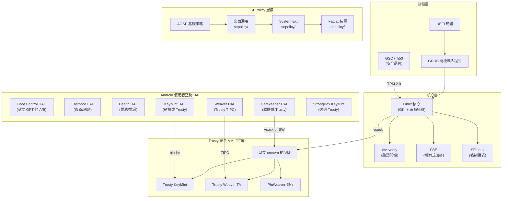
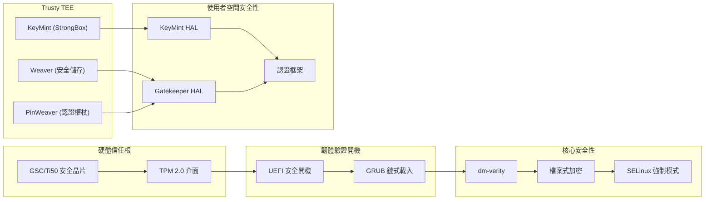
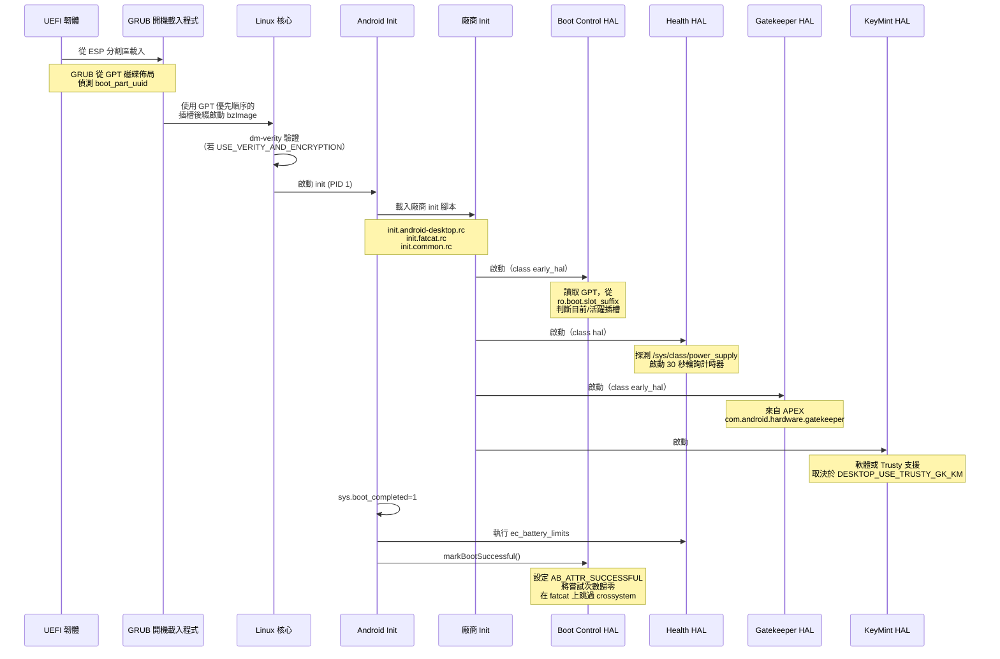
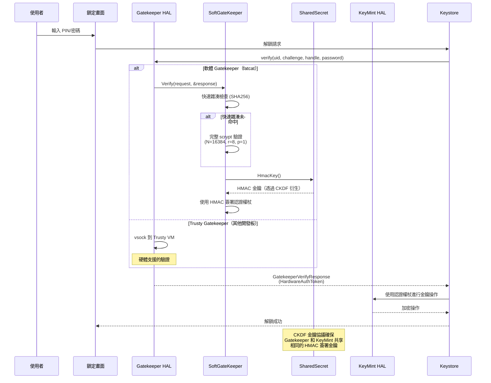

# 安全性、開機與 Trusty 實作

## 1. 架構概覽

Android 桌面平台實作了一個跨越韌體、開機載入程式、核心與使用者空間的分層安全架構。系統使用基於 GPT 的 A/B 分割區、源自 ChromeOS 的韌體工具，以及可選的 Trusty VM 整合來提供硬體支援的加密服務。



### 安全架構層級



## 2. 關鍵元件

| 元件 | 位置 | 語言 | AIDL 版本 | 封裝方式 |
|-----------|----------|----------|-------------|-----------|
| Gatekeeper HAL | `vendor/google/desktop/security/gatekeeper/` | C++ | V1 | APEX (`com.android.hardware.gatekeeper.desktop`) |
| Weaver HAL | `vendor/google/desktop/security/weaver_hal/` | Rust | V2 | 廠商二進位檔 |
| Boot Control HAL | `vendor/google/desktop/boot/aidl/` | C++ | V1 | 廠商二進位檔 |
| Fastboot HAL | `vendor/google/desktop/fastboot/` | Rust | V1 | 復原二進位檔 |
| Health HAL | `vendor/google/desktop/health/` | C++ | V5 | 廠商二進位檔 |
| KeyMint（軟體） | AOSP 預設 | Rust | N/A | 系統二進位檔 |
| KeyMint（Trusty） | `device/google/desktop/common/trusty/keymint/` | Rust | N/A | 廠商 APEX |
| StrongBox KeyMint | System ext | Rust | N/A | System ext 二進位檔 |
| GSC 常駐程式 (gscd) | System ext | C++ | N/A | 系統二進位檔 |
| PinWeaver 儲存 | System ext | N/A | N/A | 系統二進位檔 |
| 通用 SEPolicy | `device/google/desktop/common/sepolicy/` | TE | N/A | 建置時期 |
| Fatcat SEPolicy | `device/google/desktop/fatcat-sepolicy/` | TE | N/A | 建置時期 |

## 3. Gatekeeper HAL（裝置認證）

### 概觀

Gatekeeper HAL 提供裝置解鎖的密碼註冊與驗證功能。在桌面平台上，它以**軟體式** AIDL 服務的形式實作，封裝在廠商 APEX 內，當 `DESKTOP_USE_TRUSTY_GK_KM=true` 時可選用 Trusty 支援的變體。

### 原始碼檔案

| 檔案 | 用途 |
|------|---------|
| `vendor/google/desktop/security/gatekeeper/Android.bp` | 建置設定；定義 APEX 封裝 |
| `vendor/google/desktop/security/gatekeeper/GateKeeper.cpp` | AIDL `IGatekeeper` 實作，包裝 `SoftGateKeeper` |
| `vendor/google/desktop/security/gatekeeper/GateKeeper.h` | `SoftGateKeeperDevice` 類別的標頭檔 |
| `vendor/google/desktop/security/gatekeeper/SoftGateKeeper.h` | 使用 scrypt + HMAC-SHA256 的軟體 gatekeeper |
| `vendor/google/desktop/security/gatekeeper/SharedSecret.cpp` | `ISharedSecret` 實作，用於 HMAC 金鑰協議 |
| `vendor/google/desktop/security/gatekeeper/SharedSecret.h` | `SoftSharedSecret` 的標頭檔 |
| `vendor/google/desktop/security/gatekeeper/service.cpp` | 主要進入點：註冊 `IGatekeeper` 和 `ISharedSecret/gatekeeper` |

### 架構

軟體 Gatekeeper 由三個協作類別組成：

1. **`SoftGateKeeperDevice`** (`BnGatekeeper`) -- 實作 AIDL `IGatekeeper` 介面，提供 `enroll()`、`verify()`、`deleteUser()` 和 `deleteAllUsers()` 方法。將加密操作委派給 `SoftGateKeeper`。

2. **`SoftGateKeeper`**（繼承自 `::gatekeeper::GateKeeper`）-- 使用 scrypt（N=16384, r=8, p=1）和 HMAC-SHA256 簽章執行密碼雜湊。維護記憶體中的失敗記錄和最近驗證密碼的快速雜湊快取。回報 `IsHardwareBacked() = false`。

3. **`SoftSharedSecret`** (`BnSharedSecret`) -- 實作 Gatekeeper 與 KeyMint 之間金鑰協議的共享秘密協定。使用 32 位元組的零值金鑰協議金鑰（與 AOSP 的 `kFakeAgreementKey` 相符），透過 CKDF 衍生 HMAC 金鑰，並透過 HMAC-SHA256 產生 32 位元組的共享檢查。

### Init 設定

```
# vendor/google/desktop/security/gatekeeper/android.hardware.gatekeeper-service.desktop.rc
service vendor.gatekeeper_desktop /apex/com.android.hardware.gatekeeper/bin/hw/android.hardware.gatekeeper-service.desktop
    class early_hal
    user system
    group system
```

### VINTF 清單

```xml
<!-- android.hardware.gatekeeper-service.desktop.xml -->
<hal format="aidl">
    <name>android.hardware.gatekeeper</name>
    <version>1</version>
    <interface>
        <name>IGatekeeper</name>
        <instance>default</instance>
    </interface>
</hal>
```

此外，還提供了一個獨立的 SharedSecret VINTF 片段：

```xml
<!-- android.hardware.security.sharedsecret-gatekeeper.xml -->
<hal format="aidl">
    <name>android.hardware.security.sharedsecret</name>
    <fqname>ISharedSecret/gatekeeper</fqname>
</hal>
```

### APEX 封裝

Gatekeeper 以廠商 APEX `com.android.hardware.gatekeeper.desktop` 的形式交付，並設定 `vendorBootstrap: true`，使其能在套件管理員初始化之前啟動。

### SEPolicy

```
# device/google/desktop/common/sepolicy/hal_gatekeeper_desktop.te
type hal_gatekeeper_desktop, domain;
hal_server_domain(hal_gatekeeper_desktop, hal_gatekeeper)
type hal_gatekeeper_desktop_exec, exec_type, vendor_file_type, file_type;
init_daemon_domain(hal_gatekeeper_desktop)
allow hal_gatekeeper_desktop self:vsock_socket { read write create setopt connect };
```

vsock 權限使 Gatekeeper 能在該模式啟用時與 Trusty 安全 VM 通訊。此外，`keystore.te` 授予 keystore 存取 gatekeeper HAL 的權限：

```
hal_client_domain(keystore, hal_gatekeeper)
```

## 4. Weaver HAL（安全儲存）

### 概觀

Weaver HAL 提供 Android 憑證系統使用的安全鍵值儲存槽（例如用於合成密碼保護）。桌面實作以 **Rust** 撰寫，透過 **TIPC over vsock** 與 Trusty Weaver 信任應用程式通訊。

### 設定

- **插槽數量：** 1024
- **最大金鑰大小：** 32 位元組
- **最大值大小：** 64 位元組
- **Trusty 服務連接埠：** `com.android.trusty.weaver.desktop`
- **TIPC 裝置：** `VSOCK:200:0`

### 有線協定

操作使用簡單的二進位序列化：

**讀取請求：**
```
[1B op=0x00] [4B slot_id LE] [4B key_len LE] [key_bytes...]
```

**寫入請求：**
```
[1B op=0x01] [4B slot_id LE] [4B key_len LE] [4B value_len LE] [key_bytes...] [value_bytes...]
```

**讀取回應：**
```
[1B status] [8B timeout LE] [4B value_len LE] [value_bytes...]
```

**寫入回應：**
```
[1B status]  (0 = 成功)
```

讀取狀態碼：`0=OK`、`1=FAILED`、`2=INCORRECT_KEY`、`3=THROTTLE`。

### 條件啟用

Weaver HAL 僅在 Trusty 安全 VM 啟用時啟動：

```
# android.hardware.weaver-service.android-desktop.rc
service vendor.weaver_hal /vendor/bin/hw/android.hardware.weaver-service.android-desktop
    disabled
    class hal
    user hsm
    group hsm

on init && property:trusty.security_vm.enabled=1 && property:ro.boot.hypervisor.protected_vm.supported=1
    start vendor.weaver_hal
```

### 建置整合

取自 `device_common.mk`：
```makefile
ifeq ($(DESKTOP_USE_TRUSTY_GK_KM),true)
PRODUCT_PACKAGES += android.hardware.weaver-service.android-desktop
endif
```

### SEPolicy

```
# device/google/desktop/common/sepolicy/hal_weaver_desktop.te
type hal_weaver_desktop, domain;
hal_server_domain(hal_weaver_desktop, hal_weaver)
type hal_weaver_desktop_exec, exec_type, vendor_file_type, file_type;
init_daemon_domain(hal_weaver_desktop)
allow hal_weaver_desktop self:vsock_socket { create connect read getattr write lock append bind getopt map };
```

## 5. KeyMint（軟體與 Trusty 實作）

### 軟體 KeyMint（預設）

當 `DESKTOP_USE_TRUSTY_GK_KM` 未設定為 `true` 時，使用標準 AOSP 軟體 KeyMint 服務：

```makefile
PRODUCT_PACKAGES += android.hardware.security.keymint-service
```

這提供了適用於開發建置的純軟體金鑰管理解決方案。

### Trusty KeyMint（硬體支援）

當 `DESKTOP_USE_TRUSTY_GK_KM=true` 時，Trusty 支援的 KeyMint 封裝為廠商 APEX：

```
# device/google/desktop/common/trusty/keymint/Android.bp
apex {
    name: "com.android.hardware.keymint.rust_desktop_guest_trusty",
    manifest: "manifest.json",     // version 1, vendorBootstrap: true
    key: "com.android.hardware.key",
    soc_specific: true,
    updatable: false,
    prebuilts: [
        "android.hardware.hardware_keystore.xml",
        "android.hardware.security.keymint-service.trusty_system_vm.xml",
    ],
}
```

### StrongBox KeyMint

另外定義了一個 StrongBox 等級的 KeyMint，用於 Trusty 安全 VM：

```
# system_ext SEPolicy: hal_keymint_strongbox.te
type hal_keymint_strongbox_desktop, domain, coredomain, service_manager_type;
hal_server_domain(hal_keymint_strongbox_desktop, hal_keymint)
allow hal_keymint_strongbox_desktop self:vsock_socket { create connect read ... };
```

StrongBox KeyMint 透過 vsock 與 Trusty VM 通訊，並註冊以下服務：
- `android.hardware.security.keymint.IKeyMintDevice/strongbox`
- `android.hardware.security.sharedsecret.ISharedSecret/strongbox`
- `android.hardware.security.keymint.IRemotelyProvisionedComponent/strongbox`

### 系統 KeyMint（Trusty 通訊）

系統層級的 KeyMint HAL (`hal_keymint_system`) 與 Trusty 安全 VM 啟動器通訊：

```
# system_ext SEPolicy: hal_keymint_system.te
binder_call(hal_keymint_system, servicemanager)
allow hal_keymint_system accessor_trusty_keymint_comm_service:service_manager { find };
allow hal_keymint_system trusty_keymint_comm_service:service_manager { find };
binder_call(hal_keymint_system, trusty_security_vm_launcher);
allow hal_keymint_system early_virtmgr_domain:fd { use };
allow hal_keymint_system early_virtmgr_domain:vsock_socket { getattr getopt read write };
```

## 6. Trusty VM（基於 crosvm 的安全 VM）

### 概觀

Trusty 安全 VM 提供在 crosvm 虛擬機器內執行的硬體支援可信執行環境。它承載 KeyMint、Weaver、PinWeaver 和 Gatekeeper 信任應用程式，透過 vsock 與 Android 主機通訊。

### 建置產物（QEMU 參考）

Trusty QEMU 目標 (`desktop_qemu_trusty_arm64`) 提供參考實作：

```makefile
# device/google/desktop/common/trusty/desktop_qemu_trusty_base.mk
RELEASE_TRUSTY_GATEKEEPER_ENABLED := true
$(call soong_config_set_bool,qemu_trusty,enabled,true)

PRODUCT_PACKAGES += \
    gscd \
    gsctool \
    gscutil \
    pinweaver_storaged \
    pinweaver_storage_tool \
    trunks_send

PRODUCT_HOST_PACKAGES += \
    ti50_emulator_x86_64_bin \
    ti50_emulator_x86_64_lib
```

### 條件啟用

在實際硬體上，Trusty VM 由以下項目控制：

1. **`DESKTOP_USE_TRUSTY_GK_KM=true`** -- 啟用 Trusty 支援的 Gatekeeper + KeyMint
2. **`DESKTOP_DISABLE_TRUSTY_VM=true`** -- 完全停用 Trusty 安全 VM（fatcat 已設定）
3. **`trusty.security_vm.enabled=1`** -- 控制 Weaver HAL 啟動的執行階段屬性
4. **`ro.boot.hypervisor.protected_vm.supported=1`** -- 核心回報的受保護 VM 支援

### Fatcat 設定

Fatcat 開發板由於硬體限制**停用** Trusty VM：

```makefile
# device/google/desktop/fatcat/fatcat_common.mk
DESKTOP_DISABLE_TRUSTY_VM := true
$(call soong_config_set_bool, trusty_system_vm, enabled, false)

PRODUCT_PACKAGES_REMOVE += \
    desktop_trusty \
    desktop_trusty_ext_boot \
    trusty_security_vm_launcher \
    early_vms.xml \
    ...
```

這表示 fatcat 使用純軟體 Gatekeeper（APEX 封裝）和軟體 KeyMint。

### PinWeaver 儲存

PinWeaver 提供由 Trusty VM 支援的安全憑證儲存：

```
# system_ext SEPolicy: pinweaver.te
type pinweaver_storage, domain, coredomain;
init_daemon_domain(pinweaver_storage)
get_prop(pinweaver_storage, trusty_security_vm_sys_prop)
allow pinweaver_storage pinweaver_storage_metadata_file:dir create_dir_perms;
allow pinweaver_storage pinweaver_storage_metadata_file:file create_file_perms;
allow pinweaver_storage self:vsock_socket { create connect read ... };
```

儲存檔案位於 `/metadata/pinweaver/`。

## 7. Boot Control HAL（A/B 插槽管理）

### 概觀

Boot Control HAL 使用 GPT 分割區屬性實作 Android 的 A/B 分割區方案。以 C++ 撰寫，直接操作開機磁碟上的 GPT 項目。

### 原始碼檔案

| 檔案 | 用途 |
|------|---------|
| `vendor/google/desktop/boot/aidl/BootControl.cpp` | AIDL `IBootControl` 實作 |
| `vendor/google/desktop/boot/aidl/BootControl.h` | 包含 GPT 操作方法的類別宣告 |
| `vendor/google/desktop/boot/aidl/GptUtils.cpp` | 具備 CRC32 驗證的 GPT 讀寫/同步 |
| `vendor/google/desktop/boot/aidl/GptUtils.h` | GPT 結構（`gpt_header`、`gpt_entry`） |
| `vendor/google/desktop/boot/aidl/main.cpp` | 服務進入點 |

### GPT 插槽屬性

Boot Control HAL 使用與 ChromeOS 相容的 GPT 分割區屬性（參見 [ChromeOS 磁碟格式](https://chromium.googlesource.com/chromiumos/docs/+/HEAD/disk_format.md)）：

| 屬性 | 位元位置 | 遮罩 |
|-----------|-------------|------|
| 優先順序 | 48-51 | `AB_ATTR_PRIORITY_MASK` (15 << 48) |
| 剩餘嘗試次數 | 52-55 | `AB_ATTR_TRIES_MASK` (15 << 52) |
| 成功 | 56 | `AB_ATTR_SUCCESSFUL` (1 << 56) |

常數：
- `AB_ATTR_MAX_PRIORITY = 15` -- 指派給新啟用的插槽
- `AB_ATTR_BACKUP_PRIORITY = 6` -- 指派給先前活躍的插槽
- `AB_ATTR_UPDATE_TRIES = 3` -- 新啟用插槽的初始嘗試次數

### 關鍵操作

| 方法 | 行為 |
|--------|----------|
| `getNumberSlots()` | 探測 `/dev/block/by-name/vbmeta_{a,b}` 以計算可用插槽數 |
| `getCurrentSlot()` | 讀取 `ro.boot.slot_suffix` 屬性 |
| `getActiveBootSlot()` | 回傳最高優先順序的插槽 |
| `setActiveBootSlot(slot)` | 將新插槽設為最高優先順序 + 3 次嘗試；將舊插槽降級為備份優先順序 |
| `markBootSuccessful()` | 設定成功旗標 + 將嘗試次數歸零；呼叫 `crossystem fw_result=success`（除非設定 `SKIP_FW_STATUS`） |
| `setSlotAsUnbootable(slot)` | 將優先順序、嘗試次數和成功旗標歸零 |
| `getSnapshotMergeStatus()` | 從 misc 分割區的 `MiscVirtualAbMessage` 讀取 |

### GptUtils

`GptUtils` 類別管理原始 GPT 操作：
- 以 CRC32 驗證讀取主要和備份 GPT 標頭
- 將分割區名稱對應到 `gpt_entry*` 以進行屬性操作
- 將變更同步到主要和備份 GPT 表
- 處理 NVMe (`nvme0n1p2`) 和 MMC (`mmcblk0p13`) 裝置命名慣例

### 韌體狀態 (SKIP_FW_STATUS)

對於 fatcat，`SKIP_FW_STATUS` 透過以下方式設定：
```makefile
$(call soong_config_set_bool, boot_service_desktop, skip_fw_status, true)
```

這會跳過 `crossystem fw_result=success fw_try_count=0` 呼叫，因為 fatcat 使用 UEFI 韌體而非 ChromeOS ACPI。

### Init 設定

```
# 正常開機
service vendor.boot-default /vendor/bin/hw/android.hardware.boot-service.android-desktop
    class early_hal
    user root
    group root ap_firmware system

# 復原
service vendor.boot-default /system/bin/hw/android.hardware.boot-service.android-desktop_recovery
    class early_hal
    user root
    group root ap_firmware system
    seclabel u:r:hal_bootctl_default:s0
    interface aidl android.hardware.boot.IBootControl/default
```

## 8. Fastboot HAL（復原/刷寫）

### 概觀

Fastboot HAL 是一個復原模式的 Rust 服務，提供 OEM 命令支援和分割區類型查詢。它在 `misc` 分割區上操作以進行持久化開機設定。

### 原始碼檔案

| 檔案 | 用途 |
|------|---------|
| `vendor/google/desktop/fastboot/src/main.rs` | 進入點，服務註冊 |
| `vendor/google/desktop/fastboot/src/service.rs` | 包含 OEM 命令的 `IFastboot` 實作 |
| `vendor/google/desktop/fastboot/src/misc.rs` | Misc 分割區的 cmdline/bootconfig 讀寫 |
| `vendor/google/desktop/fastboot/src/aidl.rs` | AIDL 重新匯出模組 |

### OEM 命令

`doOemCommand()` 方法支援：

| 命令 | 格式 | 描述 |
|---------|--------|-------------|
| `oem cmdline` | （無參數） | 從 misc 讀取目前的核心 cmdline |
| `oem cmdline set <args>` | 替換 cmdline | 替換整個核心 cmdline |
| `oem cmdline add <args>` | 附加到 cmdline | 新增核心參數 |
| `oem cmdline del <pattern>` | 刪除符合項目 | 刪除符合萬用字元模式的核心參數 |
| `oem bootconfig` | （無參數） | 從 misc 讀取目前的 bootconfig |
| `oem bootconfig set <args>` | 替換 bootconfig | 替換整個 bootconfig |
| `oem bootconfig add <args>` | 附加 | 新增 bootconfig 參數 |
| `oem bootconfig del <pattern>` | 刪除符合項目 | 刪除符合萬用字元模式的 bootconfig 項目 |

### Misc 分割區格式

Misc 分割區在偏移量 4096 處儲存開機設定，具有以下結構：

```
Offset  Size    Field
0       4       Magic (0x4c4d4346 = "FCML")
4       1       Version (0)
5       1       Reserved
6       2       IP Checksum
8       2       Cmdline length
10      2       Bootconfig length
12      2036    Data (cmdline + bootconfig, NUL-terminated with separators)
```

### 分割區類型

```rust
fn getPartitionType(&self, name: &str) -> BinderResult<FileSystemType> {
    match name {
        "metadata" => Ok(FileSystemType::EXT4),
        "userdata" => Ok(FileSystemType::EXT4),
        _ => Ok(FileSystemType::RAW),
    }
}
```

### Init 設定

```
service fastboot-desktop-hal /system/bin/android.hardware.fastboot-service.desktop
    class hal
    user system
    group system
    seclabel u:r:hal_fastboot_default:s0
    interface aidl android.hardware.fastboot.IFastboot/default
```

## 9. Health HAL（裝置/電池健康狀態）

### 概觀

Health HAL 回報電池狀態、充電狀態和電源供應資訊。桌面實作包含以下特殊處理：
- EC 周邊充電器過濾（Chrome EC USB 充電器）
- ACPI 電池電流符號修正
- 使用 EC 回報的充電限制進行電池 SoC 轉換
- 連接外部電源時隱藏嚴重低電量
- 非喚醒式週期輪詢（30 秒間隔）

### 原始碼檔案

| 檔案 | 用途 |
|------|---------|
| `vendor/google/desktop/health/Health.cpp` | AOSP `Health` 的自訂 `HealthImpl` 子類別 |
| `vendor/google/desktop/health/Android.bp` | health、charger、低電量警示的建置規則 |
| `vendor/google/desktop/health/ec_battery_limits.sysprop` | EC 電池限制的系統屬性 |
| `vendor/google/desktop/health/ec_battery_limits.rs` | 查詢 EC 電池限制的 Rust 工具 |
| `vendor/google/desktop/health/lowbatteryalert.cpp` | 低電量 UI 覆蓋層 |

### 關鍵實作細節

**電源供應探測：**
```cpp
static std::pair<std::optional<std::filesystem::path>, std::vector<String8>> Probe() {
    // 迭代 /sys/class/power_supply/
    // 識別電池，過濾 EC 周邊充電器 (cros-ec-pchg)
    // 回傳系統電池路徑和忽略清單
}
```

**SoC 轉換：**
```cpp
static int TranslateRealToDisplaySoc(int real_soc) {
    double min = EcBatteryLimitProps::min_real_pct().value_or(0.0);
    double max = EcBatteryLimitProps::max_real_pct().value_or(100.0);
    return clamp((real_soc - min) / (max - min) * 100, 0, 100);
}
```

**非喚醒式輪詢計時器：**
```cpp
// 使用 timerfd_create(CLOCK_BOOTTIME, TFD_NONBLOCK) 搭配 EVENT_NO_WAKEUP_FD
// 喚醒時每 30 秒輪詢一次，不會喚醒系統
// 週期性任務已停用 (interval_fast = -1, interval_slow = -1)
```

### Init 設定

```
service vendor.health-default /vendor/bin/hw/android.hardware.health-service.android-desktop
    class hal
    user system
    group system
    file /dev/kmsg w

service vendor.charger /vendor/bin/hw/android.hardware.health-service.android-desktop --charger
    class charger
    seclabel u:r:charger_vendor:s0
    user system
    group system wakelock input
    capabilities SYS_BOOT

on property:sys.boot_completed=1
    exec_background - system cros_ec -- /vendor/bin/hw/ec_battery_limits
```

### SEPolicy

```
# device/google/desktop/common/sepolicy/hal_health_default.te
allow hal_health_default sysfs:file { getattr open read };
```

## 10. 驗證開機（dm-verity、加密）

### 設定旗標

```makefile
# device/google/desktop/common/common.mk
USE_VERITY_AND_ENCRYPTION ?= true
PRODUCT_SUPPORTS_VBOOT :=     # 暫時不支援 vboot
```

### fstab 變體

系統根據 `USE_VERITY_AND_ENCRYPTION` 選擇 fstab：

| 旗標值 | fstab 檔案 | 功能 |
|------------|-----------|----------|
| `true`（預設） | `fstab-verity-encryption` | dm-verity + 檔案式加密 |
| `false` | `fstab` | 無 verity，無加密 |

選定的 fstab 會安裝到：
- 廠商 ramdisk：`first_stage_ramdisk/fstab.android-desktop`
- 廠商分割區：`etc/fstab.android-desktop`

### SELinux 設定

```makefile
PRODUCT_ENFORCE_SELINUX_TREBLE_LABELING := true
PRODUCT_SELINUX_TREBLE_LABELING_TRACKING_LIST_FILE := .../treble-selinux-allow-list.yaml
```

### A/B OTA 支援

```makefile
# 帶壓縮的虛擬 A/B
$(call inherit-product, $(SRC_TARGET_DIR)/product/virtual_ab_ota/android_t_baseline.mk)
PRODUCT_VIRTUAL_AB_COMPRESSION := true
PRODUCT_VIRTUAL_AB_COMPRESSION_METHOD := lz4
PRODUCT_VIRTUAL_AB_COMPRESSION_FACTOR := 65536

PRODUCT_PACKAGES += \
    update_engine \
    update_engine_client \
    update_engine_sideload
```

### pKVM（受保護 KVM）

```makefile
# device/google/desktop/fatcat/fatcat_common.mk
PRODUCT_VENDOR_PROPERTIES += ro.boot.hypervisor.vm.supported=1
PRODUCT_BUILD_PVMFW_IMAGE := true
BOARD_PVMFWIMAGE_PARTITION_SIZE := 0x00200000
```

## 11. SEPolicy 架構（三層）

### 層級結構

```
AOSP 基礎策略
    |
    +-- 桌面通用策略 (device/google/desktop/common/sepolicy/)
    |       |
    |       +-- system_ext/public/  -- 匯出的類型/屬性
    |       +-- system_ext/private/ -- 私有類型強制
    |       |
    |       +-- Trusty 覆蓋層 (device/google/desktop/common/trusty/sepolicy/)
    |
    +-- 裝置通用策略 (device/google/desktop/common/device-common-sepolicy/)
    |       （僅限硬體裝置，不含模擬器）
    |
    +-- 裝置特定策略 (device/google/desktop/fatcat-sepolicy/)
            （Fatcat 開發板專用規則）
```

### 建置整合

```makefile
# 開發板層級策略目錄
BOARD_VENDOR_SEPOLICY_DIRS += device/google/desktop/common/sepolicy
BOARD_VENDOR_SEPOLICY_DIRS += device/google/desktop/fatcat-sepolicy/

# System ext 策略
SYSTEM_EXT_PUBLIC_SEPOLICY_DIRS += device/google/desktop/common/sepolicy/system_ext/public
SYSTEM_EXT_PRIVATE_SEPOLICY_DIRS += device/google/desktop/common/sepolicy/system_ext/private

# 裝置通用（僅限硬體）
BOARD_VENDOR_SEPOLICY_DIRS += device/google/desktop/common/device-common-sepolicy
```

### 策略能力

策略能力檔案 (`policy_capabilities`) 定義了桌面平台啟用的額外 SELinux 策略能力。

## 12. SEPolicy 細節

### 關鍵網域（通用層，.te 檔案）

**HAL 網域：**
| 網域 | 檔案 | 用途 |
|--------|------|---------|
| `hal_audio_default` | `hal_audio_default.te` | 音訊 HAL，具備廠商屬性存取、DRAS 服務 |
| `hal_camera_default` | `hal_camera_default.te` | 相機 HAL，具備 GPU、IPU、NPU、媒體裝置存取 |
| `hal_gatekeeper_desktop` | `hal_gatekeeper_desktop.te` | Gatekeeper HAL，具備 Trusty 的 vsock |
| `hal_weaver_desktop` | `hal_weaver_desktop.te` | Weaver HAL，具備 Trusty 的 vsock |
| `hal_health_default` | `hal_health_default.te` | Health HAL，具備 sysfs 讀取存取 |
| `hal_fingerprint_default` | `hal_fingerprint_default.te` | 指紋 HAL (CrosFP) |
| `hal_graphics_allocator_default` | `hal_graphics_allocator_default.te` | 圖形記憶體配置器 |
| `hal_graphics_composer_default` | `hal_graphics_composer_default.te` | HWC3 顯示合成器 |
| `hal_light_default` | `hal_light_default.te` | LED/背光控制 |
| `hal_power_default` | `hal_power_default.te` | 電源管理 HAL |
| `hal_radio_default` | `hal_radio_default.te` | 行動數據 HAL |
| `hal_usb_impl` | `hal_usb_impl.te` | USB HAL |
| `hal_wifi_default` | `hal_wifi_default.te` | WiFi HAL |
| `hal_desktop_charge_control_default` | `hal_desktop_charge_control_default.te` | 充電控制 HAL |

**系統網域：**
| 網域 | 檔案 | 用途 |
|--------|------|---------|
| `init` | `init.te` | Init，具備 module_request、binder、mounton 權限 |
| `kernel` | `kernel.te` | 核心，具備模組載入、韌體、DRI debugfs |
| `domain` | `domain.te` | 全域：所有核心網域的 mesa 屬性存取 |
| `recovery` | `recovery.te` | 復原模式，具備 GPU 裝置存取 |
| `keystore` | `keystore.te` | Keystore：gatekeeper 用戶端網域 |
| `system_server` | `system_server.te` | 系統伺服器擴充 |
| `surfaceflinger` | `surfaceflinger.te` | 顯示合成器 |
| `audioserver` | `audioserver.te` | 音訊服務 |
| `mediacodec` | `mediacodec.te` | 媒體編解碼器服務 |
| `cameraserver` | `cameraserver.te` | 相機服務 |
| `bluetooth` | `bluetooth.te` | 藍牙常駐程式 |

**廠商工具網域：**
| 網域 | 檔案 | 用途 |
|--------|------|---------|
| `ectool_vendor` | `ectool_vendor.te` | Chrome EC 工具 |
| `fwupd` | `fwupd.te` | 韌體更新常駐程式 |
| `gpu_counters` | `gpu_counters.te` | GPU 效能計數器 |
| `ehide` | `ehide.te` | 網路共享 (ehide) |
| `sshforwarder` | `sshforwarder.te` | SSH 轉 ADB 轉發器 |
| `powertool` | `powertool.te` | 電源管理工具 |
| `modetest` | `modetest.te` | DRM 模式測試 |
| `qdl` | `qdl.te` | Qualcomm 數據機復原 |
| `get_variant` | `get_variant.te` | 裝置變體偵測 |

**安全網域（system_ext）：**
| 網域 | 檔案 | 用途 |
|--------|------|---------|
| `gscd` | `gscd.te` | GSC 常駐程式：TPM + vsock + binder |
| `gscutil` | `gscutil.te` | GSC 工具：binder 到 gscd，metadata 存取 |
| `check_tpm_clear` | `check_tpm_clear.te` | TPM 清除檢查：gscd + gscutil + metadata |
| `pinweaver_storage` | `pinweaver.te` | PinWeaver：vsock + SQLite 在 /metadata |
| `hal_keymint_strongbox_desktop` | `hal_keymint_strongbox.te` | StrongBox KeyMint：vsock + service_manager |
| `hal_keymint_system` | `hal_keymint_system.te` | 系統 KeyMint：Trusty VM 啟動器 binder |
| `update_boot_info` | `update_boot_info.te` | 開機資訊更新器：gscd + keymint 通訊 |
| `udsattestation` | `udsattestation.te` | UDS 認證 |
| `lowbatteryalert` | `lowbatteryalert.te` | 低電量警示 UI |
| `timberslide` | `timberslide.te` | EC 日誌收集 |

### 檔案上下文（通用）

`device/google/desktop/common/sepolicy/file_contexts` 的關鍵項目：

```
# 廠商 HAL 二進位檔
/vendor/bin/hw/android\.hardware\.health-service\.android-desktop     u:object_r:hal_health_default_exec:s0
/vendor/bin/hw/android\.hardware\.boot@1\.2-service\.android-desktop  u:object_r:hal_bootctl_default_exec:s0
/vendor/bin/hw/android\.hardware\.weaver-service\.android-desktop     u:object_r:hal_weaver_desktop_exec:s0

# 區塊裝置
/dev/block/mapper/system(_dlkm|_ext)?_[ab]    u:object_r:system_block_device:s0
/dev/block/mapper/userdata                    u:object_r:userdata_block_device:s0
/dev/block/mmcblk[0-9]                        u:object_r:mmc_block_device:s0
/dev/block/nvme[0-9]n[0-9]                    u:object_r:nvme_block_device:s0
/dev/block/sd[a-z]                            u:object_r:sdx_block_device:s0

# 相機/媒體裝置
/dev/media[0-9]*       u:object_r:media_device:s0
/dev/v4l-subdev[0-9]*  u:object_r:v4l_sub_device:s0
/dev/ipu[0-9]*-psys.*  u:object_r:ipu_psys:s0

# Mesa/GPU 函式庫（same_process_hal_file 用於應用程式的 GPU 存取）
/vendor/lib64/libgallium_dri\.so    u:object_r:same_process_hal_file:s0
/vendor/lib64/egl/libEGL_mesa\.so   u:object_r:same_process_hal_file:s0
/vendor/lib64/hw/vulkan\.intel\.so  u:object_r:same_process_hal_file:s0

# 安全資料
/data/vendor/camera(/.*)?       u:object_r:camera_vendor_data_file:s0
/data/vendor/crosfp(/.*)?       u:object_r:fingerprint_vendor_data_file:s0
/data/vendor/fwupd(/.*)?        u:object_r:fwupd_data_file:s0
/data/misc/diagnostics(/.*)?    u:object_r:diagnostics_file:s0
```

### 檔案上下文（System Ext）

`device/google/desktop/common/sepolicy/system_ext/private/file_contexts` 的關鍵項目：

```
# TPM 和 EC 裝置
/dev/tpm0       u:object_r:tpm_char_device:s0
/dev/cros_ec    u:object_r:cros_ec_device:s0
/dev/cros_fp    u:object_r:cros_fp_device:s0

# HWSEC 二進位檔
/system/bin/gscd               u:object_r:gscd_exec:s0
/system/bin/pinweaver_storaged u:object_r:pinweaver_storage_exec:s0
/system/bin/gscutil            u:object_r:gscutil_exec:s0
/system/bin/check_tpm_clear    u:object_r:check_tpm_clear_exec:s0
/system/bin/update_boot_info   u:object_r:update_boot_info_exec:s0

# KeyMint 二進位檔
/system_ext/bin/hw/android\.hardware\.security\.keymint-service\.trusty_system_vm   u:object_r:hal_keymint_system_exec:s0
/system_ext/bin/hw/android\.hardware\.security\.keymint-service\.strongbox.desktop  u:object_r:hal_keymint_strongbox_desktop_exec:s0

# Gatekeeper（Trusty 變體）
/vendor/bin/hw/android\.hardware\.gatekeeper-service\.trusty  u:object_r:hal_gatekeeper_desktop_exec:s0

# PinWeaver 資料庫
/metadata/pinweaver(/.*)?      u:object_r:pinweaver_storage_metadata_file:s0
/metadata/gscutil(/.*)?        u:object_r:gscutil_metadata_file:s0
/metadata/hwsec_metadata(/.*)? u:object_r:hwsec_metadata_file:s0
```

### GenFS 上下文（通用）

`device/google/desktop/common/sepolicy/genfs_contexts` 的關鍵檔案系統標籤指派：

```
# 顯示器背光
genfscon sysfs /devices/pci0000:00/0000:00:02.0/drm/card0/card0-eDP-1/intel_backlight  u:object_r:sysfs_leds:s0

# 韌體
genfscon sysfs /firmware/log            u:object_r:sysfs_firmware_log:s0
genfscon sysfs /firmware/acpi/bgrt      u:object_r:sysfs_firmware_acpi_bgrt:s0
genfscon sysfs /devices/platform/GOOG0016:00  u:object_r:sysfs_chromeos_acpi:s0

# GPU/Mesa
genfscon proc /sys/dev/xe/observation_paranoid     u:object_r:proc_observation_paranoid:s0
genfscon proc /sys/dev/i915/perf_stream_paranoid   u:object_r:proc_observation_paranoid:s0

# Debugfs/Tracefs
genfscon debugfs /tracing/instances/drm  u:object_r:debugfs_drm_tracing:s0
genfscon debugfs /dri                    u:object_r:debugfs_dri:s0

# USB/Thunderbolt
genfscon sysfs /devices/pci0000:00/0000:00:0d.2/domain0  u:object_r:sysfs_thunderbolt:s0
genfscon sysfs /devices/pci0000:00/0000:00:0d.3/domain1  u:object_r:sysfs_thunderbolt:s0

# 子系統核心傾印
genfscon sysfs /class/devcoredump            u:object_r:sysfs_devcoredump:s0
genfscon sysfs /devices/virtual/devcoredump  u:object_r:sysfs_devcoredump:s0

# 持久化環形緩衝區追蹤
genfscon tracefs /instances/boot_mapped/...  u:object_r:debugfs_tracing:s0
```

### GenFS 上下文（Fatcat 專用）

```
# device/google/desktop/fatcat-sepolicy/genfs_contexts
genfscon sysfs /devices/pci0000:00/0000:00:02.0/config            u:object_r:sysfs_gpu:s0
genfscon sysfs /devices/pci0000:00/0000:00:02.0/device            u:object_r:sysfs_gpu:s0
genfscon sysfs /devices/platform/GOOG0002:00/leds                 u:object_r:sysfs_keyboard_backlight:s0
genfscon sysfs /devices/pci0000:00/0000:00:04.0/workload_hint/... u:object_r:sysfs_workload_hint:s0
genfscon sysfs /module/processor_thermal_soc_slider/...           u:object_r:sysfs_soc_slider_balance:s0
genfscon sysfs /devices/pci0000:00/0000:00:04.0/platform-profile/... u:object_r:sysfs_platform_profile:s0
```

### 屬性上下文

```
# device/google/desktop/common/sepolicy/property_contexts
persist.vendor.desktop.diagnostics.   u:object_r:vendor_desktop_diagnostics_prop:s0 prefix
persist.vendor.ehide.                 u:object_r:vendor_ehide_prop:s0 prefix
persist.vendor.adb_usb.               u:object_r:vendor_adb_usb:s0 prefix
vendor.audio.                         u:object_r:vendor_audio_prop:s0 prefix
vendor.device.                        u:object_r:vendor_device_info_prop:s0 prefix
vendor.media.                         u:object_r:vendor_media_prop:s0 prefix
vendor.mesa.                          u:object_r:vendor_mesa_prop:s0 prefix
vendor.sys_tuner.                     u:object_r:vendor_sys_tuner_prop:s0 prefix
vendor.desktop.ehide-lite.            u:object_r:vendor_desktop_ehide_lite_prop:s0 prefix
vendor.desktop.thermal_profiles.      u:object_r:vendor_desktop_thermal_profiles_prop:s0 prefix
vendor.desktop.profile_detection.     u:object_r:vendor_profile_detection_prop:s0 prefix
vendor.wlan.driver.version            u:object_r:vendor_wifi_version:s0
vendor.wlan.firmware.version          u:object_r:vendor_wifi_version:s0
```

### 服務上下文（System Ext）

關鍵安全相關的服務上下文項目：

```
android.hardware.security.keymint.IKeyMintDevice/default           u:object_r:hal_keymint_service:s0
android.hardware.gatekeeper.IGatekeeper/default                    u:object_r:hal_gatekeeper_service:s0
android.hardware.security.keymint.IKeyMintDevice/strongbox         u:object_r:hal_keymint_service:s0
android.hardware.security.sharedsecret.ISharedSecret/strongbox     u:object_r:hal_sharedsecret_service:s0
android.os.IAccessor/ICommService/security_vm_keymint              u:object_r:accessor_trusty_keymint_comm_service:s0
android.os.IAccessor/IGatekeeper/security_vm_gatekeeper            u:object_r:accessor_trusty_gatekeeper_service:s0
android.os.IAccessor/sharedsecret/security_vm_shared_secret        u:object_r:accessor_trusty_hwcrypto_sharedsecret_service:s0
android.os.IAccessor/IFingerGuard/security_vm_fingerguard          u:object_r:accessor_trusty_fingerguard:s0
android.os.IAccessor/IVmAttestation/default                        u:object_r:accessor_trusty_vm_attestation_service:s0
```

## 13. VINTF 與相容性矩陣

### 框架相容性矩陣

框架相容性矩陣 (`device/google/desktop/common/compatibility_matrix.xml`) 定義了可選的廠商 HAL 介面：

```xml
<compatibility-matrix version="1.0" type="framework">
    <hal format="aidl" optional="true">
        <name>vendor.google.desktop</name>
        <interface>
            <name>IProcfsReader</name>
            <instance>default</instance>
        </interface>
    </hal>
    <hal format="aidl" optional="true">
        <name>vendor.google.desktop</name>
        <interface>
            <name>IFutilityExecutor</name>
            <instance>default</instance>
        </interface>
    </hal>
    <hal format="aidl" optional="true">
        <name>vendor.google.desktop</name>
        <interface>
            <name>IEcExecutor</name>
            <instance>default</instance>
        </interface>
    </hal>
    <hal format="aidl" optional="true">
        <name>vendor.google.desktop</name>
        <interface>
            <name>ICameraToolExecutor</name>
            <instance>default</instance>
        </interface>
    </hal>
    <hal format="aidl" optional="true">
        <name>vendor.google.desktop.vpd_executor</name>
        <interface>
            <name>IVpdExecutor</name>
            <instance>default</instance>
        </interface>
    </hal>
    <hal format="aidl" optional="true">
        <name>com.android.desktop.power</name>
        <interface>
            <name>ISuspendNotificationService</name>
            <instance>default</instance>
        </interface>
    </hal>
    <hal format="aidl" optional="true">
        <name>com.android.desktop.power</name>
        <version>1</version>
        <interface>
            <name>IDesktopPowerChargeControl</name>
            <instance>default</instance>
        </interface>
    </hal>
</compatibility-matrix>
```

### 安全 HAL VINTF 片段

| HAL | 版本 | VINTF 檔案 |
|-----|---------|-----------|
| Gatekeeper | AIDL V1 | `android.hardware.gatekeeper-service.desktop.xml` |
| SharedSecret (GK) | AIDL | `android.hardware.security.sharedsecret-gatekeeper.xml` |
| Weaver | AIDL V2 | `android.hardware.weaver-service.android-desktop.xml` |
| Boot Control | AIDL | `android.hardware.boot-service.android-desktop.xml` |
| Fastboot | AIDL V1 | `android.hardware.fastboot-service.desktop.xml` |
| Health | AIDL V5 | `android.hardware.health-service.android-desktop.xml` |
| KeyMint（Trusty） | AIDL | `android.hardware.security.keymint-service.trusty_system_vm.xml` |

## 14. 裝置 HAL 清單（fatcat manifest.xml）

Fatcat 裝置清單非常精簡：

```xml
<!-- device/google/desktop/fatcat/manifest.xml -->
<manifest version="1.0" type="device" target-level="202604">
</manifest>
```

此空白清單完全依賴各個 HAL 套件的 VINTF 片段來宣告其介面。`target-level="202604"` 表示 2026Q4 版本的目標 FCM（框架相容性矩陣）版本。

VINTF 清單強制執行已啟用，但核心需求已針對開發放寬：
```makefile
PRODUCT_ENFORCE_VINTF_MANIFEST := true
PRODUCT_OTA_ENFORCE_VINTF_KERNEL_REQUIREMENTS := false
```

## 15. GSC/Ti50 整合（安全晶片）

### 概觀

Google 安全晶片（GSC）基於 Ti50 矽晶片，提供硬體支援的 TPM 2.0 功能。在 fatcat 開發板上，**GSC 已停用**，因為硬體不包含 Ti50 晶片。

### 設定

```makefile
# device/google/desktop/fatcat/fatcat_common.mk
DESKTOP_DISABLE_GSC := true
```

儘管 GSC 在 fatcat 上已停用，GSC 基礎設施已建置到通用平台中，並可在支援的開發板上使用。

### GSC 軟體堆疊

| 元件 | 二進位檔 | SEPolicy 網域 | 用途 |
|-----------|--------|----------------|---------|
| `gscd` | `/system/bin/gscd` | `gscd` | GSC 常駐程式：透過 `/dev/tpm0` 與 TPM 通訊，透過 vsock 與 Trusty 通訊 |
| `gsctool` | 系統二進位檔 | N/A | GSC 操作的命令列工具 |
| `gscutil` | `/system/bin/gscutil` | `gscutil` | GSC 韌體更新、metadata 快取的工具程式 |
| `check_tpm_clear` | `/system/bin/check_tpm_clear` | `check_tpm_clear` | 檢查 TPM 是否已清除 |
| `update_boot_info` | `/system/bin/update_boot_info` | `update_boot_info` | 透過 gscd 和 keymint 更新開機資訊 |

### GSC 通訊流程

```
gscd  --> /dev/tpm0          (TPM 2.0 字元裝置)
gscd  --> vsock              (Trusty 安全 VM)
gscutil --> binder --> gscd  (Binder IPC)
check_tpm_clear --> binder --> gscd --> /dev/tpm0
update_boot_info --> binder --> gscd
update_boot_info --> binder --> trusty_security_vm_launcher
```

### GSC Metadata 儲存

| 路徑 | SELinux 標籤 | 用途 |
|------|--------------|---------|
| `/data/misc/gscutil/` | `gscutil_misc_data` | 臨時 GSC 工具程式資料 |
| `/metadata/gscutil/` | `gscutil_metadata_file` | 跨重新開機快取的 GSC 資訊 |
| `/metadata/hwsec_metadata/` | `hwsec_metadata_file` | 硬體安全 metadata |

### Fatcat GSC 設定

雖然 fatcat 停用了 GSC VM，但仍包含 GSC 韌體套件以供工廠配置：

```makefile
# device/google/desktop/fatcat/fatcat_common.mk
$(call soong_config_set,gsc,fw_type,ti50)
PRODUCT_PACKAGES += \
    gsc_zip_etc \
    gsc_prepvt_zip_etc
```

GSC 相容性矩陣已被過濾掉：
```makefile
DEVICE_FRAMEWORK_COMPATIBILITY_MATRIX_FILES := $(filter-out vendor/google/desktop/video/hwsec_cert_helper/compatibility_matrix_gsc.xml,$(DEVICE_FRAMEWORK_COMPATIBILITY_MATRIX_FILES))
```

## 16. 資料流程 - 開機



## 17. 資料流程 - 認證



## 18. 設定

### 建置時期旗標

| 旗標 | 預設值 | Fatcat 值 | 效果 |
|------|---------|-------------|--------|
| `DESKTOP_USE_TRUSTY_GK_KM` | `false` | `false` | 啟用 Trusty 支援的 Gatekeeper + KeyMint |
| `DESKTOP_DISABLE_GSC` | `false` | `true` | 停用 GSC/Ti50 安全晶片整合 |
| `DESKTOP_DISABLE_TRUSTY_VM` | `false` | `true` | 停用 Trusty 安全 VM |
| `DESKTOP_DISABLE_EC` | `false` | `true` | 停用 Chrome EC 工具（ectool、timberslide） |
| `DESKTOP_DISABLE_HSUM` | `false` | `true` | 停用無頭系統使用者模式 |
| `USE_VERITY_AND_ENCRYPTION` | `true` | `true` | 啟用 dm-verity + FBE |
| `SKIP_FW_STATUS` | `false` | `true` | 跳過 crossystem 韌體狀態呼叫 |
| `USE_SWIFTSHADER` | `false` | `false` | 使用軟體 Vulkan 取代 Intel GPU |

### 執行階段屬性

| 屬性 | 描述 |
|----------|-------------|
| `trusty.security_vm.enabled` | 當 Trusty 安全 VM 執行時設為 `1` |
| `ro.boot.hypervisor.protected_vm.supported` | 若 pKVM 可用則設為 `1` |
| `ro.boot.hypervisor.vm.supported` | VM 支援時設為 `1` |
| `ro.boot.slot_suffix` | 目前 A/B 插槽後綴（`_a` 或 `_b`） |
| `sys.boot_completed` | 開機完成時設為 `1` |

### fstab 變體

| 變體 | 檔案 | 功能 |
|---------|------|----------|
| 含 verity + 加密 | `fstab-verity-encryption` | system/vendor 上的 dm-verity，userdata 上的 FBE |
| 不含 verity | `fstab` | 無完整性驗證或加密 |

## 19. 建置整合

### 套件選擇邏輯

```makefile
# KeyMint 和 Gatekeeper 選擇
ifeq ($(DESKTOP_USE_TRUSTY_GK_KM),true)
    # Trusty 支援的 KeyMint
    PRODUCT_PACKAGES += com.android.hardware.keymint.rust_desktop_guest_trusty
    TRUSTY_KEYMINT_IMPL := rust
    PRODUCT_PACKAGES += storageproxyd
    $(call inherit-product, system/core/trusty/trusty-base.mk)
    # Weaver HAL（需要 Trusty）
    PRODUCT_PACKAGES += android.hardware.weaver-service.android-desktop
else
    # 軟體 KeyMint
    PRODUCT_PACKAGES += android.hardware.security.keymint-service
    # 軟體 Gatekeeper（APEX）
    PRODUCT_PACKAGES += com.android.hardware.gatekeeper.desktop
endif

# Boot Control HAL（始終包含）
PRODUCT_PACKAGES += \
    android.hardware.boot-service.android-desktop \
    android.hardware.boot-service.android-desktop_recovery

# Health HAL（始終包含）
PRODUCT_PACKAGES += \
    android.hardware.health-service.android-desktop \
    android.hardware.health-service.android-desktop_recovery \
    ec_battery_limits

# Fastboot HAL（始終包含，僅限復原）
PRODUCT_PACKAGES += \
    fastbootd \
    android.hardware.fastboot-service.desktop
```

### Soong 設定

```makefile
# Boot Control：在 UEFI 開發板上跳過韌體狀態
$(call soong_config_set_bool, boot_service_desktop, skip_fw_status, true)

# Trusty VM：在 fatcat 上停用
$(call soong_config_set_bool, trusty_system_vm, enabled, false)

# GSC 韌體類型
$(call soong_config_set, gsc, fw_type, ti50)
```

## 20. 子系統間依賴關係

```
Boot Control HAL
    |-- GPT 分割區表（區塊裝置存取）
    |-- crossystem（韌體狀態，除非 SKIP_FW_STATUS）
    |-- MiscVirtualAbMessage（快照合併狀態）
    |-- ro.boot.slot_suffix（目前插槽偵測）

Gatekeeper HAL
    |-- SharedSecret（與 KeyMint 的 HMAC 金鑰協議）
    |-- keystore（用戶端網域）
    |-- Trusty VM（可選，vsock）

KeyMint HAL
    |-- SharedSecret（與 Gatekeeper 的 HMAC 金鑰協議）
    |-- Trusty VM（可選，vsock/binder）
    |-- Trusty Security VM 啟動器（當 Trusty 啟用時）
    |-- early_virtmgr_domain（vsock 的 FD 傳遞）

Weaver HAL
    |-- Trusty VM（必要，TIPC over vsock）
    |-- trusty.security_vm.enabled 屬性
    |-- ro.boot.hypervisor.protected_vm.supported 屬性

Health HAL
    |-- /sys/class/power_supply/*（電池資料）
    |-- EC 電池限制 (cros_ec)
    |-- timerfd（非喚醒式輪詢）

Fastboot HAL
    |-- /dev/block/by-name/misc（開機設定儲存）

GSC 堆疊
    |-- /dev/tpm0 (TPM 2.0)
    |-- Trusty VM (vsock)
    |-- /metadata/gscutil/、/metadata/hwsec_metadata/
    |-- gscd binder 服務

SEPolicy
    |-- 所有 HAL：init_daemon_domain、hal_server_domain
    |-- Trusty HAL：vsock_socket 權限
    |-- GPU HAL：Mesa/Intel 函式庫的 same_process_hal_file
```

## 21. 關鍵檔案參考

| 類別 | 檔案路徑 | 描述 |
|----------|-----------|-------------|
| **Gatekeeper** | `vendor/google/desktop/security/gatekeeper/Android.bp` | 建置規則和 APEX 定義 |
| | `vendor/google/desktop/security/gatekeeper/GateKeeper.cpp` | AIDL IGatekeeper 實作 |
| | `vendor/google/desktop/security/gatekeeper/SoftGateKeeper.h` | 軟體 gatekeeper（scrypt + HMAC） |
| | `vendor/google/desktop/security/gatekeeper/SharedSecret.cpp` | ISharedSecret 實作 (CKDF) |
| | `vendor/google/desktop/security/gatekeeper/service.cpp` | 服務主程式：註冊 GK + SharedSecret |
| **Weaver** | `vendor/google/desktop/security/weaver_hal/Android.bp` | 建置規則（Rust 二進位檔） |
| | `vendor/google/desktop/security/weaver_hal/src/main.rs` | IWeaver 實作（Trusty TIPC） |
| **Boot Control** | `vendor/google/desktop/boot/aidl/Android.bp` | 包含 SKIP_FW_STATUS soong 設定的建置規則 |
| | `vendor/google/desktop/boot/aidl/BootControl.cpp` | 基於 GPT 的 A/B 插槽管理 |
| | `vendor/google/desktop/boot/aidl/GptUtils.cpp` | GPT 讀寫/CRC32 驗證 |
| **Fastboot** | `vendor/google/desktop/fastboot/Android.bp` | 建置規則（Rust，復原二進位檔） |
| | `vendor/google/desktop/fastboot/src/service.rs` | IFastboot OEM 命令 |
| | `vendor/google/desktop/fastboot/src/misc.rs` | Misc 分割區讀寫 |
| **Health** | `vendor/google/desktop/health/Android.bp` | 建置規則（health + charger + 低電量） |
| | `vendor/google/desktop/health/Health.cpp` | 包含 SoC 轉換、輪詢計時器的自訂 Health |
| **Trusty** | `device/google/desktop/common/trusty/AndroidProducts.mk` | Trusty QEMU 產品 |
| | `device/google/desktop/common/trusty/desktop_qemu_trusty_base.mk` | Trusty 基礎：GSC/PinWeaver 套件 |
| | `device/google/desktop/common/trusty/keymint/Android.bp` | Trusty KeyMint APEX |
| **SEPolicy 通用** | `device/google/desktop/common/sepolicy/file_contexts` | 廠商檔案安全標籤 |
| | `device/google/desktop/common/sepolicy/genfs_contexts` | Sysfs/procfs/tracefs 標籤 |
| | `device/google/desktop/common/sepolicy/property_contexts` | 廠商屬性標籤 |
| | `device/google/desktop/common/sepolicy/hal_gatekeeper_desktop.te` | Gatekeeper SEPolicy |
| | `device/google/desktop/common/sepolicy/hal_weaver_desktop.te` | Weaver SEPolicy |
| | `device/google/desktop/common/sepolicy/init.te` | Init 網域擴充 |
| | `device/google/desktop/common/sepolicy/kernel.te` | 核心網域（模組載入、韌體） |
| **SEPolicy System Ext** | `device/google/desktop/common/sepolicy/system_ext/private/file_contexts` | System ext 檔案標籤 |
| | `device/google/desktop/common/sepolicy/system_ext/private/gscd.te` | GSC 常駐程式 SEPolicy |
| | `device/google/desktop/common/sepolicy/system_ext/private/hal_keymint_strongbox.te` | StrongBox KeyMint |
| | `device/google/desktop/common/sepolicy/system_ext/private/hal_keymint_system.te` | 系統 KeyMint |
| | `device/google/desktop/common/sepolicy/system_ext/private/pinweaver.te` | PinWeaver 儲存 |
| | `device/google/desktop/common/sepolicy/system_ext/private/check_tpm_clear.te` | TPM 清除檢查 |
| | `device/google/desktop/common/sepolicy/system_ext/private/service_contexts` | 安全服務標籤 |
| **SEPolicy Fatcat** | `device/google/desktop/fatcat-sepolicy/file_contexts` | NPU、GPU、SoC 常駐程式標籤 |
| | `device/google/desktop/fatcat-sepolicy/genfs_contexts` | Fatcat GPU/電源 sysfs 標籤 |
| | `device/google/desktop/fatcat-sepolicy/hal_power_default.te` | 電源 HAL（workload hint、SoC slider） |
| | `device/google/desktop/fatcat-sepolicy/npu_device.te` | 相機的 NPU 裝置存取 |
| | `device/google/desktop/fatcat-sepolicy/hal_drm_widevine.te` | Widevine DRM GPU 存取 |
| | `device/google/desktop/fatcat-sepolicy/vold.te` | Vold 核心模組請求 |
| **建置設定** | `device/google/desktop/common/common.mk` | 通用產品設定（verity、A/B、fstab） |
| | `device/google/desktop/common/device_common.mk` | HAL 套件選擇（KM、GK、Boot、Health） |
| | `device/google/desktop/fatcat/fatcat_common.mk` | Fatcat：停用 GSC、Trusty VM、EC |
| | `device/google/desktop/fatcat/BoardConfig.mk` | 開發板：核心模組、sepolicy、分割區佈局 |
| | `device/google/desktop/common/board_common.mk` | 通用開發板：super 分割區、核心 cmdline |
| **VINTF** | `device/google/desktop/common/compatibility_matrix.xml` | 框架 HAL 需求 |
| | `device/google/desktop/fatcat/manifest.xml` | 裝置清單 (target-level=202604) |
