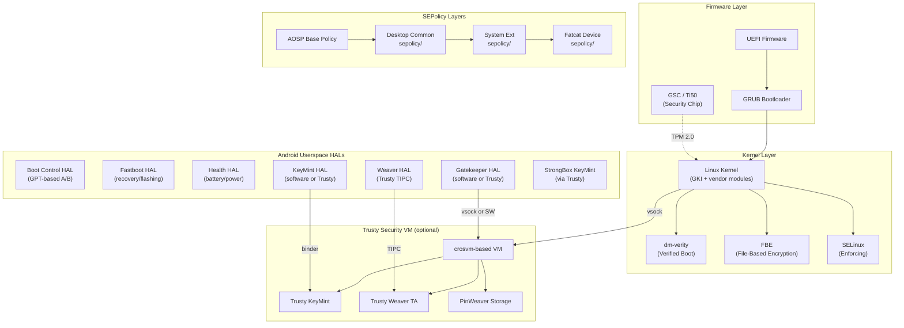
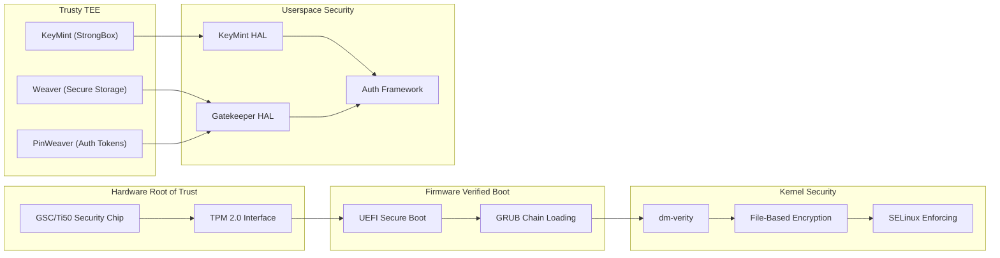
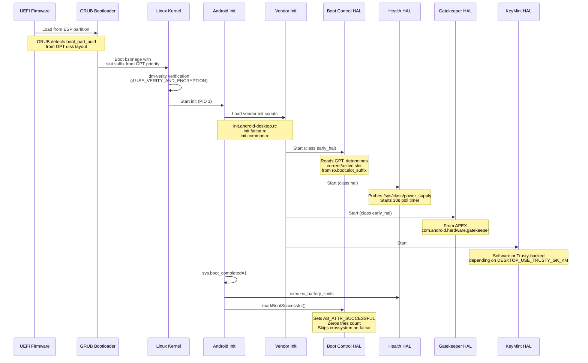
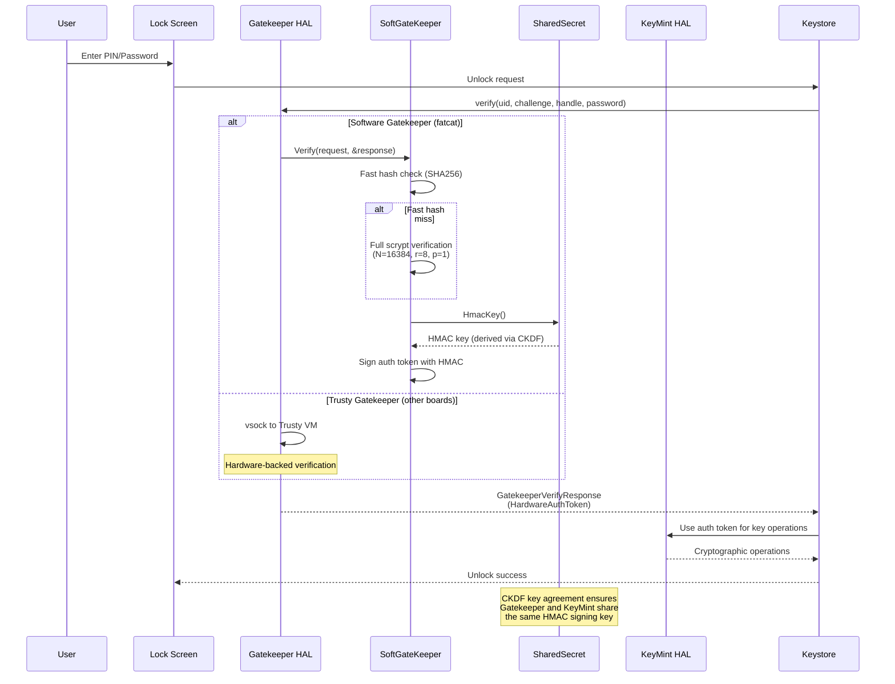

# Security, Boot, and Trusty Implementation

## 1. Architecture Overview

The Android Desktop Platform implements a layered security architecture spanning firmware, bootloader, kernel, and userspace. The system uses GPT-based A/B partitioning, ChromeOS-derived firmware tooling, and optional Trusty VM integration for hardware-backed cryptographic services.



### Security Architecture Layers



## 2. Key Components

| Component | Location | Language | AIDL Version | Packaging |
|-----------|----------|----------|-------------|-----------|
| Gatekeeper HAL | `vendor/google/desktop/security/gatekeeper/` | C++ | V1 | APEX (`com.android.hardware.gatekeeper.desktop`) |
| Weaver HAL | `vendor/google/desktop/security/weaver_hal/` | Rust | V2 | Vendor binary |
| Boot Control HAL | `vendor/google/desktop/boot/aidl/` | C++ | V1 | Vendor binary |
| Fastboot HAL | `vendor/google/desktop/fastboot/` | Rust | V1 | Recovery binary |
| Health HAL | `vendor/google/desktop/health/` | C++ | V5 | Vendor binary |
| KeyMint (Software) | AOSP default | Rust | N/A | System binary |
| KeyMint (Trusty) | `device/google/desktop/common/trusty/keymint/` | Rust | N/A | Vendor APEX |
| StrongBox KeyMint | System ext | Rust | N/A | System ext binary |
| GSC Daemon (gscd) | System ext | C++ | N/A | System binary |
| PinWeaver Storage | System ext | N/A | N/A | System binary |
| Common SEPolicy | `device/google/desktop/common/sepolicy/` | TE | N/A | Build-time |
| Fatcat SEPolicy | `device/google/desktop/fatcat-sepolicy/` | TE | N/A | Build-time |

## 3. Gatekeeper HAL (Device Authentication)

### Overview

The Gatekeeper HAL provides password enrollment and verification for device unlock. On the desktop platform, it is implemented as a **software-based** AIDL service packaged inside a vendor APEX, with an optional Trusty-backed variant when `DESKTOP_USE_TRUSTY_GK_KM=true`.

### Source Files

| File | Purpose |
|------|---------|
| `vendor/google/desktop/security/gatekeeper/Android.bp` | Build configuration; defines APEX packaging |
| `vendor/google/desktop/security/gatekeeper/GateKeeper.cpp` | AIDL `IGatekeeper` implementation wrapping `SoftGateKeeper` |
| `vendor/google/desktop/security/gatekeeper/GateKeeper.h` | Header for `SoftGateKeeperDevice` class |
| `vendor/google/desktop/security/gatekeeper/SoftGateKeeper.h` | Software gatekeeper using scrypt + HMAC-SHA256 |
| `vendor/google/desktop/security/gatekeeper/SharedSecret.cpp` | `ISharedSecret` implementation for HMAC key agreement |
| `vendor/google/desktop/security/gatekeeper/SharedSecret.h` | Header for `SoftSharedSecret` |
| `vendor/google/desktop/security/gatekeeper/service.cpp` | Main entry point: registers both `IGatekeeper` and `ISharedSecret/gatekeeper` |

### Architecture

The software Gatekeeper consists of three cooperating classes:

1. **`SoftGateKeeperDevice`** (`BnGatekeeper`) -- Implements the AIDL `IGatekeeper` interface with `enroll()`, `verify()`, `deleteUser()`, and `deleteAllUsers()` methods. Delegates cryptographic operations to `SoftGateKeeper`.

2. **`SoftGateKeeper`** (inherits `::gatekeeper::GateKeeper`) -- Performs password hashing using scrypt (N=16384, r=8, p=1) and HMAC-SHA256 signatures. Maintains in-memory failure records and a fast-hash cache for recently verified passwords. Reports `IsHardwareBacked() = false`.

3. **`SoftSharedSecret`** (`BnSharedSecret`) -- Implements the shared secret protocol for key agreement between Gatekeeper and KeyMint. Uses a 32-byte zero key agreement key (matching AOSP's `kFakeAgreementKey`), derives an HMAC key via CKDF, and produces a 32-byte sharing check via HMAC-SHA256.

### Init Configuration

```
# vendor/google/desktop/security/gatekeeper/android.hardware.gatekeeper-service.desktop.rc
service vendor.gatekeeper_desktop /apex/com.android.hardware.gatekeeper/bin/hw/android.hardware.gatekeeper-service.desktop
    class early_hal
    user system
    group system
```

### VINTF Manifest

```xml
<!-- android.hardware.gatekeeper-service.desktop.xml -->
<hal format="aidl">
    <name>android.hardware.gatekeeper</name>
    <version>1</version>
    <interface>
        <name>IGatekeeper</name>
        <instance>default</instance>
    </interface>
</hal>
```

Additionally, a separate SharedSecret VINTF fragment is provided:

```xml
<!-- android.hardware.security.sharedsecret-gatekeeper.xml -->
<hal format="aidl">
    <name>android.hardware.security.sharedsecret</name>
    <fqname>ISharedSecret/gatekeeper</fqname>
</hal>
```

### APEX Packaging

The Gatekeeper is delivered as vendor APEX `com.android.hardware.gatekeeper.desktop` with `vendorBootstrap: true`, enabling it to start before the package manager initializes.

### SEPolicy

```
# device/google/desktop/common/sepolicy/hal_gatekeeper_desktop.te
type hal_gatekeeper_desktop, domain;
hal_server_domain(hal_gatekeeper_desktop, hal_gatekeeper)
type hal_gatekeeper_desktop_exec, exec_type, vendor_file_type, file_type;
init_daemon_domain(hal_gatekeeper_desktop)
allow hal_gatekeeper_desktop self:vsock_socket { read write create setopt connect };
```

The vsock permissions enable the Gatekeeper to communicate with the Trusty security VM when that mode is active. Additionally, `keystore.te` grants keystore access to the gatekeeper HAL:

```
hal_client_domain(keystore, hal_gatekeeper)
```

## 4. Weaver HAL (Secure Storage)

### Overview

The Weaver HAL provides secure key-value storage slots used by the Android credential system (e.g., for synthetic password protection). The desktop implementation is written in **Rust** and communicates with a Trusty Weaver trusted application via **TIPC over vsock**.

### Configuration

- **Slots:** 1024
- **Max key size:** 32 bytes
- **Max value size:** 64 bytes
- **Trusty service port:** `com.android.trusty.weaver.desktop`
- **TIPC device:** `VSOCK:200:0`

### Wire Protocol

Operations use a simple binary serialization:

**Read request:**
```
[1B op=0x00] [4B slot_id LE] [4B key_len LE] [key_bytes...]
```

**Write request:**
```
[1B op=0x01] [4B slot_id LE] [4B key_len LE] [4B value_len LE] [key_bytes...] [value_bytes...]
```

**Read response:**
```
[1B status] [8B timeout LE] [4B value_len LE] [value_bytes...]
```

**Write response:**
```
[1B status]  (0 = success)
```

Read status codes: `0=OK`, `1=FAILED`, `2=INCORRECT_KEY`, `3=THROTTLE`.

### Conditional Activation

The Weaver HAL is only started when the Trusty security VM is active:

```
# android.hardware.weaver-service.android-desktop.rc
service vendor.weaver_hal /vendor/bin/hw/android.hardware.weaver-service.android-desktop
    disabled
    class hal
    user hsm
    group hsm

on init && property:trusty.security_vm.enabled=1 && property:ro.boot.hypervisor.protected_vm.supported=1
    start vendor.weaver_hal
```

### Build Integration

From `device_common.mk`:
```makefile
ifeq ($(DESKTOP_USE_TRUSTY_GK_KM),true)
PRODUCT_PACKAGES += android.hardware.weaver-service.android-desktop
endif
```

### SEPolicy

```
# device/google/desktop/common/sepolicy/hal_weaver_desktop.te
type hal_weaver_desktop, domain;
hal_server_domain(hal_weaver_desktop, hal_weaver)
type hal_weaver_desktop_exec, exec_type, vendor_file_type, file_type;
init_daemon_domain(hal_weaver_desktop)
allow hal_weaver_desktop self:vsock_socket { create connect read getattr write lock append bind getopt map };
```

## 5. KeyMint (Software and Trusty Implementations)

### Software KeyMint (Default)

When `DESKTOP_USE_TRUSTY_GK_KM` is not set to `true`, the standard AOSP software KeyMint service is used:

```makefile
PRODUCT_PACKAGES += android.hardware.security.keymint-service
```

This provides a software-only key management solution suitable for development builds.

### Trusty KeyMint (Hardware-Backed)

When `DESKTOP_USE_TRUSTY_GK_KM=true`, the Trusty-backed KeyMint is packaged as a vendor APEX:

```
# device/google/desktop/common/trusty/keymint/Android.bp
apex {
    name: "com.android.hardware.keymint.rust_desktop_guest_trusty",
    manifest: "manifest.json",     // version 1, vendorBootstrap: true
    key: "com.android.hardware.key",
    soc_specific: true,
    updatable: false,
    prebuilts: [
        "android.hardware.hardware_keystore.xml",
        "android.hardware.security.keymint-service.trusty_system_vm.xml",
    ],
}
```

### StrongBox KeyMint

A StrongBox-level KeyMint is also defined for use with the Trusty security VM:

```
# system_ext SEPolicy: hal_keymint_strongbox.te
type hal_keymint_strongbox_desktop, domain, coredomain, service_manager_type;
hal_server_domain(hal_keymint_strongbox_desktop, hal_keymint)
allow hal_keymint_strongbox_desktop self:vsock_socket { create connect read ... };
```

The StrongBox KeyMint communicates with the Trusty VM via vsock and registers services for:
- `android.hardware.security.keymint.IKeyMintDevice/strongbox`
- `android.hardware.security.sharedsecret.ISharedSecret/strongbox`
- `android.hardware.security.keymint.IRemotelyProvisionedComponent/strongbox`

### System KeyMint (Trusty Comm)

The system-level KeyMint HAL (`hal_keymint_system`) communicates with the Trusty security VM launcher:

```
# system_ext SEPolicy: hal_keymint_system.te
binder_call(hal_keymint_system, servicemanager)
allow hal_keymint_system accessor_trusty_keymint_comm_service:service_manager { find };
allow hal_keymint_system trusty_keymint_comm_service:service_manager { find };
binder_call(hal_keymint_system, trusty_security_vm_launcher);
allow hal_keymint_system early_virtmgr_domain:fd { use };
allow hal_keymint_system early_virtmgr_domain:vsock_socket { getattr getopt read write };
```

## 6. Trusty VM (crosvm-Based Secure VM)

### Overview

The Trusty security VM provides a hardware-backed trusted execution environment running within a crosvm virtual machine. It hosts KeyMint, Weaver, PinWeaver, and Gatekeeper trusted applications, communicating with the Android host over vsock.

### Build Products (QEMU Reference)

The Trusty QEMU target (`desktop_qemu_trusty_arm64`) provides a reference implementation:

```makefile
# device/google/desktop/common/trusty/desktop_qemu_trusty_base.mk
RELEASE_TRUSTY_GATEKEEPER_ENABLED := true
$(call soong_config_set_bool,qemu_trusty,enabled,true)

PRODUCT_PACKAGES += \
    gscd \
    gsctool \
    gscutil \
    pinweaver_storaged \
    pinweaver_storage_tool \
    trunks_send

PRODUCT_HOST_PACKAGES += \
    ti50_emulator_x86_64_bin \
    ti50_emulator_x86_64_lib
```

### Conditional Enablement

On real hardware, the Trusty VM is controlled by:

1. **`DESKTOP_USE_TRUSTY_GK_KM=true`** -- Enables Trusty-backed Gatekeeper + KeyMint
2. **`DESKTOP_DISABLE_TRUSTY_VM=true`** -- Disables the Trusty security VM entirely (set for fatcat)
3. **`trusty.security_vm.enabled=1`** -- Runtime property that gates Weaver HAL startup
4. **`ro.boot.hypervisor.protected_vm.supported=1`** -- Kernel-reported protected VM support

### Fatcat Configuration

The fatcat board **disables** the Trusty VM due to hardware limitations:

```makefile
# device/google/desktop/fatcat/fatcat_common.mk
DESKTOP_DISABLE_TRUSTY_VM := true
$(call soong_config_set_bool, trusty_system_vm, enabled, false)

PRODUCT_PACKAGES_REMOVE += \
    desktop_trusty \
    desktop_trusty_ext_boot \
    trusty_security_vm_launcher \
    early_vms.xml \
    ...
```

This means fatcat uses software-only Gatekeeper (APEX-packaged) and software KeyMint.

### PinWeaver Storage

PinWeaver provides secure credential storage backed by the Trusty VM:

```
# system_ext SEPolicy: pinweaver.te
type pinweaver_storage, domain, coredomain;
init_daemon_domain(pinweaver_storage)
get_prop(pinweaver_storage, trusty_security_vm_sys_prop)
allow pinweaver_storage pinweaver_storage_metadata_file:dir create_dir_perms;
allow pinweaver_storage pinweaver_storage_metadata_file:file create_file_perms;
allow pinweaver_storage self:vsock_socket { create connect read ... };
```

Storage files reside at `/metadata/pinweaver/`.

## 7. Boot Control HAL (A/B Slot Management)

### Overview

The Boot Control HAL implements Android's A/B partition scheme using GPT partition attributes. It is written in C++ and directly manipulates GPT entries on the boot disk.

### Source Files

| File | Purpose |
|------|---------|
| `vendor/google/desktop/boot/aidl/BootControl.cpp` | AIDL `IBootControl` implementation |
| `vendor/google/desktop/boot/aidl/BootControl.h` | Class declaration with GPT manipulation methods |
| `vendor/google/desktop/boot/aidl/GptUtils.cpp` | GPT read/write/sync with CRC32 validation |
| `vendor/google/desktop/boot/aidl/GptUtils.h` | GPT structures (`gpt_header`, `gpt_entry`) |
| `vendor/google/desktop/boot/aidl/main.cpp` | Service entry point |

### GPT Slot Attributes

The Boot Control HAL uses ChromeOS-compatible GPT partition attributes (per [ChromeOS disk format](https://chromium.googlesource.com/chromiumos/docs/+/HEAD/disk_format.md)):

| Attribute | Bit Position | Mask |
|-----------|-------------|------|
| Priority | 48-51 | `AB_ATTR_PRIORITY_MASK` (15 << 48) |
| Tries Remaining | 52-55 | `AB_ATTR_TRIES_MASK` (15 << 52) |
| Successful | 56 | `AB_ATTR_SUCCESSFUL` (1 << 56) |

Constants:
- `AB_ATTR_MAX_PRIORITY = 15` -- Assigned to newly-activated slot
- `AB_ATTR_BACKUP_PRIORITY = 6` -- Assigned to previously-active slot
- `AB_ATTR_UPDATE_TRIES = 3` -- Initial tries for a newly-activated slot

### Key Operations

| Method | Behavior |
|--------|----------|
| `getNumberSlots()` | Probes `/dev/block/by-name/vbmeta_{a,b}` to count available slots |
| `getCurrentSlot()` | Reads `ro.boot.slot_suffix` property |
| `getActiveBootSlot()` | Returns highest-priority slot |
| `setActiveBootSlot(slot)` | Sets new slot to max priority + 3 tries; demotes old slot to backup priority |
| `markBootSuccessful()` | Sets successful flag + zeros tries; calls `crossystem fw_result=success` (unless `SKIP_FW_STATUS`) |
| `setSlotAsUnbootable(slot)` | Zeros priority, tries, and successful flag |
| `getSnapshotMergeStatus()` | Reads from `MiscVirtualAbMessage` in misc partition |

### GptUtils

The `GptUtils` class manages raw GPT operations:
- Reads primary and backup GPT headers with CRC32 validation
- Maps partition names to `gpt_entry*` for attribute manipulation
- Syncs changes to both primary and backup GPT tables
- Handles NVMe (`nvme0n1p2`) and MMC (`mmcblk0p13`) device naming conventions

### Firmware Status (SKIP_FW_STATUS)

For fatcat, `SKIP_FW_STATUS` is set via:
```makefile
$(call soong_config_set_bool, boot_service_desktop, skip_fw_status, true)
```

This skips `crossystem fw_result=success fw_try_count=0` calls since fatcat uses UEFI firmware rather than ChromeOS ACPI.

### Init Configuration

```
# Normal boot
service vendor.boot-default /vendor/bin/hw/android.hardware.boot-service.android-desktop
    class early_hal
    user root
    group root ap_firmware system

# Recovery
service vendor.boot-default /system/bin/hw/android.hardware.boot-service.android-desktop_recovery
    class early_hal
    user root
    group root ap_firmware system
    seclabel u:r:hal_bootctl_default:s0
    interface aidl android.hardware.boot.IBootControl/default
```

## 8. Fastboot HAL (Recovery/Flashing)

### Overview

The Fastboot HAL is a recovery-mode Rust service providing OEM command support and partition type queries. It operates on the `misc` partition for persistent boot configuration.

### Source Files

| File | Purpose |
|------|---------|
| `vendor/google/desktop/fastboot/src/main.rs` | Entry point, service registration |
| `vendor/google/desktop/fastboot/src/service.rs` | `IFastboot` implementation with OEM commands |
| `vendor/google/desktop/fastboot/src/misc.rs` | Misc partition read/write for cmdline/bootconfig |
| `vendor/google/desktop/fastboot/src/aidl.rs` | AIDL re-export module |

### OEM Commands

The `doOemCommand()` method supports:

| Command | Format | Description |
|---------|--------|-------------|
| `oem cmdline` | (no args) | Read current kernel cmdline from misc |
| `oem cmdline set <args>` | Replace cmdline | Replace entire kernel cmdline |
| `oem cmdline add <args>` | Append to cmdline | Add kernel parameter |
| `oem cmdline del <pattern>` | Remove matching | Delete kernel parameters matching wildcard pattern |
| `oem bootconfig` | (no args) | Read current bootconfig from misc |
| `oem bootconfig set <args>` | Replace bootconfig | Replace entire bootconfig |
| `oem bootconfig add <args>` | Append | Add bootconfig parameter |
| `oem bootconfig del <pattern>` | Remove matching | Delete bootconfig entries matching wildcard pattern |

### Misc Partition Format

The misc partition stores boot configuration at offset 4096 with the following structure:

```
Offset  Size    Field
0       4       Magic (0x4c4d4346 = "FCML")
4       1       Version (0)
5       1       Reserved
6       2       IP Checksum
8       2       Cmdline length
10      2       Bootconfig length
12      2036    Data (cmdline + bootconfig, NUL-terminated with separators)
```

### Partition Types

```rust
fn getPartitionType(&self, name: &str) -> BinderResult<FileSystemType> {
    match name {
        "metadata" => Ok(FileSystemType::EXT4),
        "userdata" => Ok(FileSystemType::EXT4),
        _ => Ok(FileSystemType::RAW),
    }
}
```

### Init Configuration

```
service fastboot-desktop-hal /system/bin/android.hardware.fastboot-service.desktop
    class hal
    user system
    group system
    seclabel u:r:hal_fastboot_default:s0
    interface aidl android.hardware.fastboot.IFastboot/default
```

## 9. Health HAL (Device/Battery Health)

### Overview

The Health HAL reports battery state, charge status, and power supply information. The desktop implementation includes special handling for:
- EC peripheral charger filtering (Chrome EC USB chargers)
- ACPI battery current sign correction
- Battery SoC translation using EC-reported charge limits
- Critical battery hiding when external power is connected
- Non-waking periodic polling (30-second interval)

### Source Files

| File | Purpose |
|------|---------|
| `vendor/google/desktop/health/Health.cpp` | Custom `HealthImpl` subclass of AOSP `Health` |
| `vendor/google/desktop/health/Android.bp` | Build rules for health, charger, low battery alert |
| `vendor/google/desktop/health/ec_battery_limits.sysprop` | System properties for EC battery limits |
| `vendor/google/desktop/health/ec_battery_limits.rs` | Rust tool to query EC battery limits |
| `vendor/google/desktop/health/lowbatteryalert.cpp` | Low battery UI overlay |

### Key Implementation Details

**Power Supply Probing:**
```cpp
static std::pair<std::optional<std::filesystem::path>, std::vector<String8>> Probe() {
    // Iterates /sys/class/power_supply/
    // Identifies batteries, filters out EC peripheral chargers (cros-ec-pchg)
    // Returns system battery path and ignore list
}
```

**SoC Translation:**
```cpp
static int TranslateRealToDisplaySoc(int real_soc) {
    double min = EcBatteryLimitProps::min_real_pct().value_or(0.0);
    double max = EcBatteryLimitProps::max_real_pct().value_or(100.0);
    return clamp((real_soc - min) / (max - min) * 100, 0, 100);
}
```

**Non-Waking Poll Timer:**
```cpp
// Uses timerfd_create(CLOCK_BOOTTIME, TFD_NONBLOCK) with EVENT_NO_WAKEUP_FD
// Polls every 30 seconds while awake, does not wake the system
// Periodic chores are disabled (interval_fast = -1, interval_slow = -1)
```

### Init Configuration

```
service vendor.health-default /vendor/bin/hw/android.hardware.health-service.android-desktop
    class hal
    user system
    group system
    file /dev/kmsg w

service vendor.charger /vendor/bin/hw/android.hardware.health-service.android-desktop --charger
    class charger
    seclabel u:r:charger_vendor:s0
    user system
    group system wakelock input
    capabilities SYS_BOOT

on property:sys.boot_completed=1
    exec_background - system cros_ec -- /vendor/bin/hw/ec_battery_limits
```

### SEPolicy

```
# device/google/desktop/common/sepolicy/hal_health_default.te
allow hal_health_default sysfs:file { getattr open read };
```

## 10. Verified Boot (dm-verity, Encryption)

### Configuration Flags

```makefile
# device/google/desktop/common/common.mk
USE_VERITY_AND_ENCRYPTION ?= true
PRODUCT_SUPPORTS_VBOOT :=     # Temporarily no vboot support
```

### fstab Variants

The system selects the fstab based on `USE_VERITY_AND_ENCRYPTION`:

| Flag Value | fstab File | Features |
|------------|-----------|----------|
| `true` (default) | `fstab-verity-encryption` | dm-verity + File-Based Encryption |
| `false` | `fstab` | No verity, no encryption |

The chosen fstab is installed to both:
- Vendor ramdisk: `first_stage_ramdisk/fstab.android-desktop`
- Vendor partition: `etc/fstab.android-desktop`

### SELinux Configuration

```makefile
PRODUCT_ENFORCE_SELINUX_TREBLE_LABELING := true
PRODUCT_SELINUX_TREBLE_LABELING_TRACKING_LIST_FILE := .../treble-selinux-allow-list.yaml
```

### A/B OTA Support

```makefile
# Virtual A/B with compression
$(call inherit-product, $(SRC_TARGET_DIR)/product/virtual_ab_ota/android_t_baseline.mk)
PRODUCT_VIRTUAL_AB_COMPRESSION := true
PRODUCT_VIRTUAL_AB_COMPRESSION_METHOD := lz4
PRODUCT_VIRTUAL_AB_COMPRESSION_FACTOR := 65536

PRODUCT_PACKAGES += \
    update_engine \
    update_engine_client \
    update_engine_sideload
```

### pKVM (Protected KVM)

```makefile
# device/google/desktop/fatcat/fatcat_common.mk
PRODUCT_VENDOR_PROPERTIES += ro.boot.hypervisor.vm.supported=1
PRODUCT_BUILD_PVMFW_IMAGE := true
BOARD_PVMFWIMAGE_PARTITION_SIZE := 0x00200000
```

## 11. SEPolicy Architecture (Three Layers)

### Layer Structure

```
AOSP Base Policy
    |
    +-- Desktop Common Policy (device/google/desktop/common/sepolicy/)
    |       |
    |       +-- system_ext/public/  -- Exported types/attributes
    |       +-- system_ext/private/ -- Private type enforcement
    |       |
    |       +-- Trusty overlay (device/google/desktop/common/trusty/sepolicy/)
    |
    +-- Device-Common Policy (device/google/desktop/common/device-common-sepolicy/)
    |       (HW devices only, not emulators)
    |
    +-- Device-Specific Policy (device/google/desktop/fatcat-sepolicy/)
            (Fatcat board-specific rules)
```

### Build Integration

```makefile
# Board-level policy directories
BOARD_VENDOR_SEPOLICY_DIRS += device/google/desktop/common/sepolicy
BOARD_VENDOR_SEPOLICY_DIRS += device/google/desktop/fatcat-sepolicy/

# System ext policy
SYSTEM_EXT_PUBLIC_SEPOLICY_DIRS += device/google/desktop/common/sepolicy/system_ext/public
SYSTEM_EXT_PRIVATE_SEPOLICY_DIRS += device/google/desktop/common/sepolicy/system_ext/private

# Device-common (HW-only)
BOARD_VENDOR_SEPOLICY_DIRS += device/google/desktop/common/device-common-sepolicy
```

### Policy Capabilities

The policy capabilities file (`policy_capabilities`) defines additional SELinux policy capabilities enabled for the desktop platform.

## 12. SEPolicy Details

### Key Domains (Common Layer, .te files)

**HAL Domains:**
| Domain | File | Purpose |
|--------|------|---------|
| `hal_audio_default` | `hal_audio_default.te` | Audio HAL with vendor property access, DRAS service |
| `hal_camera_default` | `hal_camera_default.te` | Camera HAL with GPU, IPU, NPU, media device access |
| `hal_gatekeeper_desktop` | `hal_gatekeeper_desktop.te` | Gatekeeper HAL with vsock for Trusty |
| `hal_weaver_desktop` | `hal_weaver_desktop.te` | Weaver HAL with vsock for Trusty |
| `hal_health_default` | `hal_health_default.te` | Health HAL with sysfs read access |
| `hal_fingerprint_default` | `hal_fingerprint_default.te` | Fingerprint HAL (CrosFP) |
| `hal_graphics_allocator_default` | `hal_graphics_allocator_default.te` | Graphics memory allocator |
| `hal_graphics_composer_default` | `hal_graphics_composer_default.te` | HWC3 display composer |
| `hal_light_default` | `hal_light_default.te` | LED/backlight control |
| `hal_power_default` | `hal_power_default.te` | Power management HAL |
| `hal_radio_default` | `hal_radio_default.te` | Cellular modem HAL |
| `hal_usb_impl` | `hal_usb_impl.te` | USB HAL |
| `hal_wifi_default` | `hal_wifi_default.te` | WiFi HAL |
| `hal_desktop_charge_control_default` | `hal_desktop_charge_control_default.te` | Charge control HAL |

**System Domains:**
| Domain | File | Purpose |
|--------|------|---------|
| `init` | `init.te` | Init with module_request, binder, mounton permissions |
| `kernel` | `kernel.te` | Kernel with module loading, firmware, DRI debugfs |
| `domain` | `domain.te` | Global: mesa property access for all core domains |
| `recovery` | `recovery.te` | Recovery mode with GPU device access |
| `keystore` | `keystore.te` | Keystore: gatekeeper client domain |
| `system_server` | `system_server.te` | System server extensions |
| `surfaceflinger` | `surfaceflinger.te` | Display compositor |
| `audioserver` | `audioserver.te` | Audio service |
| `mediacodec` | `mediacodec.te` | Media codec service |
| `cameraserver` | `cameraserver.te` | Camera service |
| `bluetooth` | `bluetooth.te` | Bluetooth daemon |

**Vendor Utility Domains:**
| Domain | File | Purpose |
|--------|------|---------|
| `ectool_vendor` | `ectool_vendor.te` | Chrome EC tool |
| `fwupd` | `fwupd.te` | Firmware update daemon |
| `gpu_counters` | `gpu_counters.te` | GPU performance counters |
| `ehide` | `ehide.te` | Network sharing (ehide) |
| `sshforwarder` | `sshforwarder.te` | SSH-to-ADB forwarder |
| `powertool` | `powertool.te` | Power management tool |
| `modetest` | `modetest.te` | DRM mode testing |
| `qdl` | `qdl.te` | Qualcomm modem recovery |
| `get_variant` | `get_variant.te` | Device variant detection |

**Security Domains (system_ext):**
| Domain | File | Purpose |
|--------|------|---------|
| `gscd` | `gscd.te` | GSC daemon: TPM + vsock + binder |
| `gscutil` | `gscutil.te` | GSC utility: binder to gscd, metadata access |
| `check_tpm_clear` | `check_tpm_clear.te` | TPM clear check: gscd + gscutil + metadata |
| `pinweaver_storage` | `pinweaver.te` | PinWeaver: vsock + SQLite in /metadata |
| `hal_keymint_strongbox_desktop` | `hal_keymint_strongbox.te` | StrongBox KeyMint: vsock + service_manager |
| `hal_keymint_system` | `hal_keymint_system.te` | System KeyMint: Trusty VM launcher binder |
| `update_boot_info` | `update_boot_info.te` | Boot info updater: gscd + keymint comm |
| `udsattestation` | `udsattestation.te` | UDS attestation |
| `lowbatteryalert` | `lowbatteryalert.te` | Low battery alert UI |
| `timberslide` | `timberslide.te` | EC log collection |

### File Contexts (Common)

Key entries from `device/google/desktop/common/sepolicy/file_contexts`:

```
# Vendor HAL binaries
/vendor/bin/hw/android\.hardware\.health-service\.android-desktop     u:object_r:hal_health_default_exec:s0
/vendor/bin/hw/android\.hardware\.boot@1\.2-service\.android-desktop  u:object_r:hal_bootctl_default_exec:s0
/vendor/bin/hw/android\.hardware\.weaver-service\.android-desktop     u:object_r:hal_weaver_desktop_exec:s0

# Block devices
/dev/block/mapper/system(_dlkm|_ext)?_[ab]    u:object_r:system_block_device:s0
/dev/block/mapper/userdata                    u:object_r:userdata_block_device:s0
/dev/block/mmcblk[0-9]                        u:object_r:mmc_block_device:s0
/dev/block/nvme[0-9]n[0-9]                    u:object_r:nvme_block_device:s0
/dev/block/sd[a-z]                            u:object_r:sdx_block_device:s0

# Camera/Media devices
/dev/media[0-9]*       u:object_r:media_device:s0
/dev/v4l-subdev[0-9]*  u:object_r:v4l_sub_device:s0
/dev/ipu[0-9]*-psys.*  u:object_r:ipu_psys:s0

# Mesa/GPU libraries (same_process_hal_file for GPU access from apps)
/vendor/lib64/libgallium_dri\.so    u:object_r:same_process_hal_file:s0
/vendor/lib64/egl/libEGL_mesa\.so   u:object_r:same_process_hal_file:s0
/vendor/lib64/hw/vulkan\.intel\.so  u:object_r:same_process_hal_file:s0

# Security data
/data/vendor/camera(/.*)?       u:object_r:camera_vendor_data_file:s0
/data/vendor/crosfp(/.*)?       u:object_r:fingerprint_vendor_data_file:s0
/data/vendor/fwupd(/.*)?        u:object_r:fwupd_data_file:s0
/data/misc/diagnostics(/.*)?    u:object_r:diagnostics_file:s0
```

### File Contexts (System Ext)

Key entries from `device/google/desktop/common/sepolicy/system_ext/private/file_contexts`:

```
# TPM and EC devices
/dev/tpm0       u:object_r:tpm_char_device:s0
/dev/cros_ec    u:object_r:cros_ec_device:s0
/dev/cros_fp    u:object_r:cros_fp_device:s0

# HWSEC binaries
/system/bin/gscd               u:object_r:gscd_exec:s0
/system/bin/pinweaver_storaged u:object_r:pinweaver_storage_exec:s0
/system/bin/gscutil            u:object_r:gscutil_exec:s0
/system/bin/check_tpm_clear    u:object_r:check_tpm_clear_exec:s0
/system/bin/update_boot_info   u:object_r:update_boot_info_exec:s0

# KeyMint binaries
/system_ext/bin/hw/android\.hardware\.security\.keymint-service\.trusty_system_vm   u:object_r:hal_keymint_system_exec:s0
/system_ext/bin/hw/android\.hardware\.security\.keymint-service\.strongbox.desktop  u:object_r:hal_keymint_strongbox_desktop_exec:s0

# Gatekeeper (Trusty variant)
/vendor/bin/hw/android\.hardware\.gatekeeper-service\.trusty  u:object_r:hal_gatekeeper_desktop_exec:s0

# PinWeaver database
/metadata/pinweaver(/.*)?      u:object_r:pinweaver_storage_metadata_file:s0
/metadata/gscutil(/.*)?        u:object_r:gscutil_metadata_file:s0
/metadata/hwsec_metadata(/.*)? u:object_r:hwsec_metadata_file:s0
```

### GenFS Contexts (Common)

Key filesystem label assignments from `device/google/desktop/common/sepolicy/genfs_contexts`:

```
# Display backlight
genfscon sysfs /devices/pci0000:00/0000:00:02.0/drm/card0/card0-eDP-1/intel_backlight  u:object_r:sysfs_leds:s0

# Firmware
genfscon sysfs /firmware/log            u:object_r:sysfs_firmware_log:s0
genfscon sysfs /firmware/acpi/bgrt      u:object_r:sysfs_firmware_acpi_bgrt:s0
genfscon sysfs /devices/platform/GOOG0016:00  u:object_r:sysfs_chromeos_acpi:s0

# GPU/Mesa
genfscon proc /sys/dev/xe/observation_paranoid     u:object_r:proc_observation_paranoid:s0
genfscon proc /sys/dev/i915/perf_stream_paranoid   u:object_r:proc_observation_paranoid:s0

# Debugfs/Tracefs
genfscon debugfs /tracing/instances/drm  u:object_r:debugfs_drm_tracing:s0
genfscon debugfs /dri                    u:object_r:debugfs_dri:s0

# USB/Thunderbolt
genfscon sysfs /devices/pci0000:00/0000:00:0d.2/domain0  u:object_r:sysfs_thunderbolt:s0
genfscon sysfs /devices/pci0000:00/0000:00:0d.3/domain1  u:object_r:sysfs_thunderbolt:s0

# Subsystem coredumps
genfscon sysfs /class/devcoredump            u:object_r:sysfs_devcoredump:s0
genfscon sysfs /devices/virtual/devcoredump  u:object_r:sysfs_devcoredump:s0

# Persistent ring buffer tracing
genfscon tracefs /instances/boot_mapped/...  u:object_r:debugfs_tracing:s0
```

### GenFS Contexts (Fatcat-Specific)

```
# device/google/desktop/fatcat-sepolicy/genfs_contexts
genfscon sysfs /devices/pci0000:00/0000:00:02.0/config            u:object_r:sysfs_gpu:s0
genfscon sysfs /devices/pci0000:00/0000:00:02.0/device            u:object_r:sysfs_gpu:s0
genfscon sysfs /devices/platform/GOOG0002:00/leds                 u:object_r:sysfs_keyboard_backlight:s0
genfscon sysfs /devices/pci0000:00/0000:00:04.0/workload_hint/... u:object_r:sysfs_workload_hint:s0
genfscon sysfs /module/processor_thermal_soc_slider/...           u:object_r:sysfs_soc_slider_balance:s0
genfscon sysfs /devices/pci0000:00/0000:00:04.0/platform-profile/... u:object_r:sysfs_platform_profile:s0
```

### Property Contexts

```
# device/google/desktop/common/sepolicy/property_contexts
persist.vendor.desktop.diagnostics.   u:object_r:vendor_desktop_diagnostics_prop:s0 prefix
persist.vendor.ehide.                 u:object_r:vendor_ehide_prop:s0 prefix
persist.vendor.adb_usb.               u:object_r:vendor_adb_usb:s0 prefix
vendor.audio.                         u:object_r:vendor_audio_prop:s0 prefix
vendor.device.                        u:object_r:vendor_device_info_prop:s0 prefix
vendor.media.                         u:object_r:vendor_media_prop:s0 prefix
vendor.mesa.                          u:object_r:vendor_mesa_prop:s0 prefix
vendor.sys_tuner.                     u:object_r:vendor_sys_tuner_prop:s0 prefix
vendor.desktop.ehide-lite.            u:object_r:vendor_desktop_ehide_lite_prop:s0 prefix
vendor.desktop.thermal_profiles.      u:object_r:vendor_desktop_thermal_profiles_prop:s0 prefix
vendor.desktop.profile_detection.     u:object_r:vendor_profile_detection_prop:s0 prefix
vendor.wlan.driver.version            u:object_r:vendor_wifi_version:s0
vendor.wlan.firmware.version          u:object_r:vendor_wifi_version:s0
```

### Service Contexts (System Ext)

Key security-related service context entries:

```
android.hardware.security.keymint.IKeyMintDevice/default           u:object_r:hal_keymint_service:s0
android.hardware.gatekeeper.IGatekeeper/default                    u:object_r:hal_gatekeeper_service:s0
android.hardware.security.keymint.IKeyMintDevice/strongbox         u:object_r:hal_keymint_service:s0
android.hardware.security.sharedsecret.ISharedSecret/strongbox     u:object_r:hal_sharedsecret_service:s0
android.os.IAccessor/ICommService/security_vm_keymint              u:object_r:accessor_trusty_keymint_comm_service:s0
android.os.IAccessor/IGatekeeper/security_vm_gatekeeper            u:object_r:accessor_trusty_gatekeeper_service:s0
android.os.IAccessor/sharedsecret/security_vm_shared_secret        u:object_r:accessor_trusty_hwcrypto_sharedsecret_service:s0
android.os.IAccessor/IFingerGuard/security_vm_fingerguard          u:object_r:accessor_trusty_fingerguard:s0
android.os.IAccessor/IVmAttestation/default                        u:object_r:accessor_trusty_vm_attestation_service:s0
```

## 13. VINTF and Compatibility Matrix

### Framework Compatibility Matrix

The framework compatibility matrix (`device/google/desktop/common/compatibility_matrix.xml`) defines optional vendor HAL interfaces:

```xml
<compatibility-matrix version="1.0" type="framework">
    <hal format="aidl" optional="true">
        <name>vendor.google.desktop</name>
        <interface>
            <name>IProcfsReader</name>
            <instance>default</instance>
        </interface>
    </hal>
    <hal format="aidl" optional="true">
        <name>vendor.google.desktop</name>
        <interface>
            <name>IFutilityExecutor</name>
            <instance>default</instance>
        </interface>
    </hal>
    <hal format="aidl" optional="true">
        <name>vendor.google.desktop</name>
        <interface>
            <name>IEcExecutor</name>
            <instance>default</instance>
        </interface>
    </hal>
    <hal format="aidl" optional="true">
        <name>vendor.google.desktop</name>
        <interface>
            <name>ICameraToolExecutor</name>
            <instance>default</instance>
        </interface>
    </hal>
    <hal format="aidl" optional="true">
        <name>vendor.google.desktop.vpd_executor</name>
        <interface>
            <name>IVpdExecutor</name>
            <instance>default</instance>
        </interface>
    </hal>
    <hal format="aidl" optional="true">
        <name>com.android.desktop.power</name>
        <interface>
            <name>ISuspendNotificationService</name>
            <instance>default</instance>
        </interface>
    </hal>
    <hal format="aidl" optional="true">
        <name>com.android.desktop.power</name>
        <version>1</version>
        <interface>
            <name>IDesktopPowerChargeControl</name>
            <instance>default</instance>
        </interface>
    </hal>
</compatibility-matrix>
```

### Security HAL VINTF Fragments

| HAL | Version | VINTF File |
|-----|---------|-----------|
| Gatekeeper | AIDL V1 | `android.hardware.gatekeeper-service.desktop.xml` |
| SharedSecret (GK) | AIDL | `android.hardware.security.sharedsecret-gatekeeper.xml` |
| Weaver | AIDL V2 | `android.hardware.weaver-service.android-desktop.xml` |
| Boot Control | AIDL | `android.hardware.boot-service.android-desktop.xml` |
| Fastboot | AIDL V1 | `android.hardware.fastboot-service.desktop.xml` |
| Health | AIDL V5 | `android.hardware.health-service.android-desktop.xml` |
| KeyMint (Trusty) | AIDL | `android.hardware.security.keymint-service.trusty_system_vm.xml` |

## 14. Device HAL Manifest (fatcat manifest.xml)

The fatcat device manifest is minimal:

```xml
<!-- device/google/desktop/fatcat/manifest.xml -->
<manifest version="1.0" type="device" target-level="202604">
</manifest>
```

This empty manifest relies entirely on VINTF fragments from individual HAL packages to declare their interfaces. The `target-level="202604"` indicates the target FCM (Framework Compatibility Matrix) version for the 2026Q4 release.

VINTF manifest enforcement is enabled but kernel requirements are relaxed for development:
```makefile
PRODUCT_ENFORCE_VINTF_MANIFEST := true
PRODUCT_OTA_ENFORCE_VINTF_KERNEL_REQUIREMENTS := false
```

## 15. GSC/Ti50 Integration (Security Chip)

### Overview

The Google Security Chip (GSC), based on the Ti50 silicon, provides hardware-backed TPM 2.0 functionality. On fatcat boards, **GSC is disabled** because the hardware does not include a Ti50 chip.

### Configuration

```makefile
# device/google/desktop/fatcat/fatcat_common.mk
DESKTOP_DISABLE_GSC := true
```

Despite GSC being disabled on fatcat, the GSC infrastructure is built into the common platform and available on supported boards.

### GSC Software Stack

| Component | Binary | SEPolicy Domain | Purpose |
|-----------|--------|----------------|---------|
| `gscd` | `/system/bin/gscd` | `gscd` | GSC daemon: communicates with TPM via `/dev/tpm0` and Trusty via vsock |
| `gsctool` | System binary | N/A | Command-line tool for GSC operations |
| `gscutil` | `/system/bin/gscutil` | `gscutil` | Utility for GSC firmware updates, metadata caching |
| `check_tpm_clear` | `/system/bin/check_tpm_clear` | `check_tpm_clear` | Checks if TPM has been cleared |
| `update_boot_info` | `/system/bin/update_boot_info` | `update_boot_info` | Updates boot information via gscd and keymint |

### GSC Communication Flow

```
gscd  --> /dev/tpm0          (TPM 2.0 character device)
gscd  --> vsock              (Trusty security VM)
gscutil --> binder --> gscd  (Binder IPC)
check_tpm_clear --> binder --> gscd --> /dev/tpm0
update_boot_info --> binder --> gscd
update_boot_info --> binder --> trusty_security_vm_launcher
```

### GSC Metadata Storage

| Path | SELinux Label | Purpose |
|------|--------------|---------|
| `/data/misc/gscutil/` | `gscutil_misc_data` | Temporary GSC utility data |
| `/metadata/gscutil/` | `gscutil_metadata_file` | GSC info cached across reboots |
| `/metadata/hwsec_metadata/` | `hwsec_metadata_file` | Hardware security metadata |

### Fatcat GSC Configuration

While fatcat disables the GSC VM, it still includes GSC firmware packages for factory provisioning:

```makefile
# device/google/desktop/fatcat/fatcat_common.mk
$(call soong_config_set,gsc,fw_type,ti50)
PRODUCT_PACKAGES += \
    gsc_zip_etc \
    gsc_prepvt_zip_etc
```

The GSC compatibility matrix is filtered out:
```makefile
DEVICE_FRAMEWORK_COMPATIBILITY_MATRIX_FILES := $(filter-out vendor/google/desktop/video/hwsec_cert_helper/compatibility_matrix_gsc.xml,$(DEVICE_FRAMEWORK_COMPATIBILITY_MATRIX_FILES))
```

## 16. Data Flow - Boot



## 17. Data Flow - Authentication



## 18. Configuration

### Build-Time Flags

| Flag | Default | Fatcat Value | Effect |
|------|---------|-------------|--------|
| `DESKTOP_USE_TRUSTY_GK_KM` | `false` | `false` | Enables Trusty-backed Gatekeeper + KeyMint |
| `DESKTOP_DISABLE_GSC` | `false` | `true` | Disables GSC/Ti50 security chip integration |
| `DESKTOP_DISABLE_TRUSTY_VM` | `false` | `true` | Disables Trusty security VM |
| `DESKTOP_DISABLE_EC` | `false` | `true` | Disables Chrome EC tools (ectool, timberslide) |
| `DESKTOP_DISABLE_HSUM` | `false` | `true` | Disables Headless System User Mode |
| `USE_VERITY_AND_ENCRYPTION` | `true` | `true` | Enables dm-verity + FBE |
| `SKIP_FW_STATUS` | `false` | `true` | Skips crossystem firmware status calls |
| `USE_SWIFTSHADER` | `false` | `false` | Uses software Vulkan instead of Intel GPU |

### Runtime Properties

| Property | Description |
|----------|-------------|
| `trusty.security_vm.enabled` | Set to `1` when Trusty security VM is running |
| `ro.boot.hypervisor.protected_vm.supported` | Set to `1` if pKVM is available |
| `ro.boot.hypervisor.vm.supported` | Set to `1` for VM support |
| `ro.boot.slot_suffix` | Current A/B slot suffix (`_a` or `_b`) |
| `sys.boot_completed` | Set to `1` when boot is complete |

### fstab Variants

| Variant | File | Features |
|---------|------|----------|
| With verity + encryption | `fstab-verity-encryption` | dm-verity on system/vendor, FBE on userdata |
| Without verity | `fstab` | No integrity verification or encryption |

## 19. Build Integration

### Package Selection Logic

```makefile
# KeyMint and Gatekeeper selection
ifeq ($(DESKTOP_USE_TRUSTY_GK_KM),true)
    # Trusty-backed KeyMint
    PRODUCT_PACKAGES += com.android.hardware.keymint.rust_desktop_guest_trusty
    TRUSTY_KEYMINT_IMPL := rust
    PRODUCT_PACKAGES += storageproxyd
    $(call inherit-product, system/core/trusty/trusty-base.mk)
    # Weaver HAL (requires Trusty)
    PRODUCT_PACKAGES += android.hardware.weaver-service.android-desktop
else
    # Software KeyMint
    PRODUCT_PACKAGES += android.hardware.security.keymint-service
    # Software Gatekeeper (APEX)
    PRODUCT_PACKAGES += com.android.hardware.gatekeeper.desktop
endif

# Boot Control HAL (always included)
PRODUCT_PACKAGES += \
    android.hardware.boot-service.android-desktop \
    android.hardware.boot-service.android-desktop_recovery

# Health HAL (always included)
PRODUCT_PACKAGES += \
    android.hardware.health-service.android-desktop \
    android.hardware.health-service.android-desktop_recovery \
    ec_battery_limits

# Fastboot HAL (always included, recovery-only)
PRODUCT_PACKAGES += \
    fastbootd \
    android.hardware.fastboot-service.desktop
```

### Soong Configuration

```makefile
# Boot Control: skip firmware status on UEFI boards
$(call soong_config_set_bool, boot_service_desktop, skip_fw_status, true)

# Trusty VM: disable on fatcat
$(call soong_config_set_bool, trusty_system_vm, enabled, false)

# GSC firmware type
$(call soong_config_set, gsc, fw_type, ti50)
```

## 20. Inter-Subsystem Dependencies

```
Boot Control HAL
    |-- GPT partition table (block device access)
    |-- crossystem (firmware status, unless SKIP_FW_STATUS)
    |-- MiscVirtualAbMessage (snapshot merge status)
    |-- ro.boot.slot_suffix (current slot detection)

Gatekeeper HAL
    |-- SharedSecret (HMAC key agreement with KeyMint)
    |-- keystore (client domain)
    |-- Trusty VM (optional, vsock)

KeyMint HAL
    |-- SharedSecret (HMAC key agreement with Gatekeeper)
    |-- Trusty VM (optional, vsock/binder)
    |-- Trusty Security VM Launcher (when Trusty enabled)
    |-- early_virtmgr_domain (FD passing for vsock)

Weaver HAL
    |-- Trusty VM (required, TIPC over vsock)
    |-- trusty.security_vm.enabled property
    |-- ro.boot.hypervisor.protected_vm.supported property

Health HAL
    |-- /sys/class/power_supply/* (battery data)
    |-- EC battery limits (cros_ec)
    |-- timerfd (non-waking poll)

Fastboot HAL
    |-- /dev/block/by-name/misc (boot config storage)

GSC Stack
    |-- /dev/tpm0 (TPM 2.0)
    |-- Trusty VM (vsock)
    |-- /metadata/gscutil/, /metadata/hwsec_metadata/
    |-- gscd binder service

SEPolicy
    |-- All HALs: init_daemon_domain, hal_server_domain
    |-- Trusty HALs: vsock_socket permissions
    |-- GPU HALs: same_process_hal_file for Mesa/Intel libraries
```

## 21. Key Files Reference

| Category | File Path | Description |
|----------|-----------|-------------|
| **Gatekeeper** | `vendor/google/desktop/security/gatekeeper/Android.bp` | Build rules and APEX definition |
| | `vendor/google/desktop/security/gatekeeper/GateKeeper.cpp` | AIDL IGatekeeper implementation |
| | `vendor/google/desktop/security/gatekeeper/SoftGateKeeper.h` | Software gatekeeper (scrypt + HMAC) |
| | `vendor/google/desktop/security/gatekeeper/SharedSecret.cpp` | ISharedSecret implementation (CKDF) |
| | `vendor/google/desktop/security/gatekeeper/service.cpp` | Service main: registers GK + SharedSecret |
| **Weaver** | `vendor/google/desktop/security/weaver_hal/Android.bp` | Build rules (Rust binary) |
| | `vendor/google/desktop/security/weaver_hal/src/main.rs` | IWeaver implementation (Trusty TIPC) |
| **Boot Control** | `vendor/google/desktop/boot/aidl/Android.bp` | Build rules with SKIP_FW_STATUS soong config |
| | `vendor/google/desktop/boot/aidl/BootControl.cpp` | GPT-based A/B slot management |
| | `vendor/google/desktop/boot/aidl/GptUtils.cpp` | GPT read/write/CRC32 validation |
| **Fastboot** | `vendor/google/desktop/fastboot/Android.bp` | Build rules (Rust, recovery binary) |
| | `vendor/google/desktop/fastboot/src/service.rs` | IFastboot OEM commands |
| | `vendor/google/desktop/fastboot/src/misc.rs` | Misc partition read/write |
| **Health** | `vendor/google/desktop/health/Android.bp` | Build rules (health + charger + low battery) |
| | `vendor/google/desktop/health/Health.cpp` | Custom Health with SoC translation, poll timer |
| **Trusty** | `device/google/desktop/common/trusty/AndroidProducts.mk` | Trusty QEMU product |
| | `device/google/desktop/common/trusty/desktop_qemu_trusty_base.mk` | Trusty base: GSC/PinWeaver packages |
| | `device/google/desktop/common/trusty/keymint/Android.bp` | Trusty KeyMint APEX |
| **SEPolicy Common** | `device/google/desktop/common/sepolicy/file_contexts` | Vendor file security labels |
| | `device/google/desktop/common/sepolicy/genfs_contexts` | Sysfs/procfs/tracefs labels |
| | `device/google/desktop/common/sepolicy/property_contexts` | Vendor property labels |
| | `device/google/desktop/common/sepolicy/hal_gatekeeper_desktop.te` | Gatekeeper SEPolicy |
| | `device/google/desktop/common/sepolicy/hal_weaver_desktop.te` | Weaver SEPolicy |
| | `device/google/desktop/common/sepolicy/init.te` | Init domain extensions |
| | `device/google/desktop/common/sepolicy/kernel.te` | Kernel domain (module load, firmware) |
| **SEPolicy System Ext** | `device/google/desktop/common/sepolicy/system_ext/private/file_contexts` | System ext file labels |
| | `device/google/desktop/common/sepolicy/system_ext/private/gscd.te` | GSC daemon SEPolicy |
| | `device/google/desktop/common/sepolicy/system_ext/private/hal_keymint_strongbox.te` | StrongBox KeyMint |
| | `device/google/desktop/common/sepolicy/system_ext/private/hal_keymint_system.te` | System KeyMint |
| | `device/google/desktop/common/sepolicy/system_ext/private/pinweaver.te` | PinWeaver storage |
| | `device/google/desktop/common/sepolicy/system_ext/private/check_tpm_clear.te` | TPM clear check |
| | `device/google/desktop/common/sepolicy/system_ext/private/service_contexts` | Security service labels |
| **SEPolicy Fatcat** | `device/google/desktop/fatcat-sepolicy/file_contexts` | NPU, GPU, SoC daemon labels |
| | `device/google/desktop/fatcat-sepolicy/genfs_contexts` | Fatcat GPU/power sysfs labels |
| | `device/google/desktop/fatcat-sepolicy/hal_power_default.te` | Power HAL (workload hint, SoC slider) |
| | `device/google/desktop/fatcat-sepolicy/npu_device.te` | NPU device access for camera |
| | `device/google/desktop/fatcat-sepolicy/hal_drm_widevine.te` | Widevine DRM GPU access |
| | `device/google/desktop/fatcat-sepolicy/vold.te` | Vold kernel module request |
| **Build Config** | `device/google/desktop/common/common.mk` | Common product config (verity, A/B, fstab) |
| | `device/google/desktop/common/device_common.mk` | HAL package selection (KM, GK, Boot, Health) |
| | `device/google/desktop/fatcat/fatcat_common.mk` | Fatcat: disables GSC, Trusty VM, EC |
| | `device/google/desktop/fatcat/BoardConfig.mk` | Board: kernel modules, sepolicy, partition layout |
| | `device/google/desktop/common/board_common.mk` | Common board: super partition, kernel cmdline |
| **VINTF** | `device/google/desktop/common/compatibility_matrix.xml` | Framework HAL requirements |
| | `device/google/desktop/fatcat/manifest.xml` | Device manifest (target-level=202604) |
