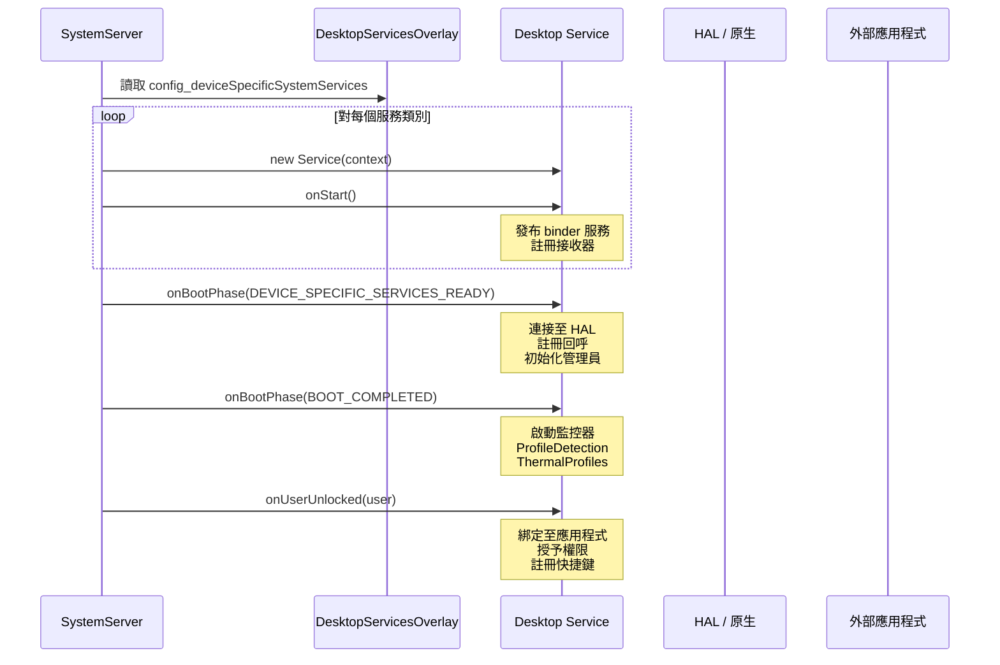
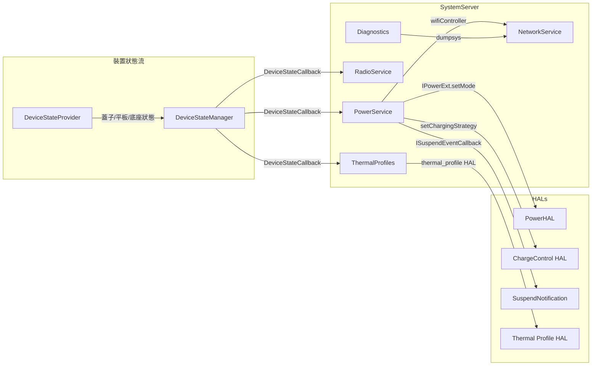
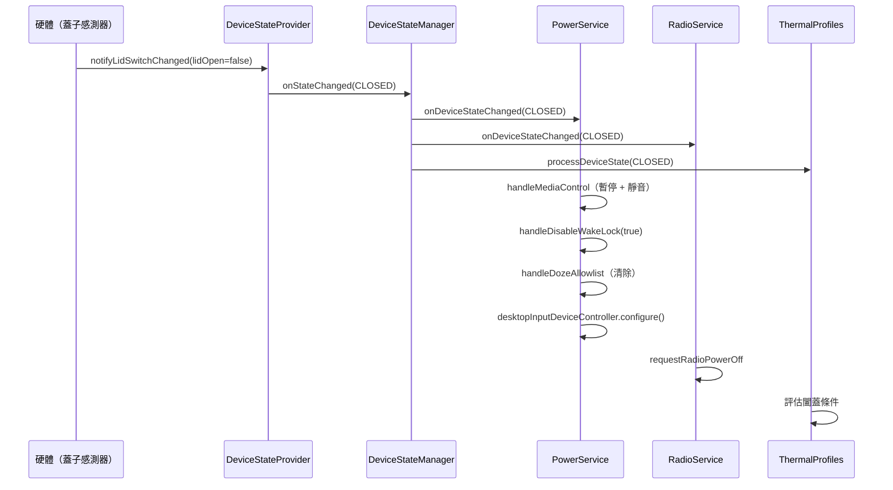

# Desktop Services 實作說明

## 1. 架構概覽

Desktop Services 是一組模組化的 Android `SystemService` 實作集合，用於擴展 Android 框架的桌面特定功能。所有服務編譯為單一的 `desktop-services` Java 函式庫，並透過 `config_deviceSpecificSystemServices` 覆蓋機制載入至 `system_server`。此函式庫與 AOSP 的 `services.impl` 為對等關係，在建置時透過靜態函式庫相依性進行連結。

```mermaid
graph TB
    subgraph SystemServer["system_server 程序"]
        direction TB
        Overlay["DesktopServicesOverlay<br/>(config_deviceSpecificSystemServices)"]

        subgraph DS["desktop-services.jar"]
            direction LR

            subgraph Core["核心 / 情境"]
                CE["ContextEngineService"]
            end

            subgraph SysMgmt["系統管理"]
                DIAG["DiagnosticsService"]
                SNAP["SnapshotSystemService"]
            end

            subgraph UX["使用者體驗"]
                INPUT["UserInitializeService"]
                MEDIA_OBS["AudioDeviceObserverService"]
                MEDIA_VOL["AudioVolumeService"]
                VC["VideoChatManager"]
                FB["UserChangeBroadcastService"]
            end

            subgraph DataMig["資料與遷移"]
                DM["DataMigrationService"]
                SS["SettingsSyncService"]
                RM["RepairModeService"]
            end

            subgraph NetRadio["網路與無線電"]
                NET["NetworkService"]
                DRM["DrmNetworkService"]
                RAD["RadioService"]
            end

            subgraph PwrTherm["電源與散熱"]
                PWR["PowerService"]
                TP["ThermalProfilesService"]
            end

            subgraph SecPerm["安全性"]
                PERM["PermissionGrantService"]
            end
        end
    end

    subgraph VendorPartition["Vendor 分區（原生）"]
        SOCD["socdaemon<br/>(C++ 二進位檔)"]
        PHAL["PowerHAL"]
        CHAL["ChargeControl HAL"]
        TPHAL["ThermalProfile HAL"]
        SUSPEND["SuspendNotificationService"]
    end

    subgraph ExternalApps["外部應用程式 / 服務"]
        ALAI["com.google.android.desktop.alai<br/>(LOAM ContentObserver)"]
        SSAPP["com.android.settingssync"]
        SNAPS["com.google.android.snapshotservice"]
        BB["BetterBug 系列"]
    end

    Overlay -->|實例化| DS
    PWR -->|binder| SUSPEND
    PWR -->|binder| CHAL
    PWR -.->|IPowerExt| PHAL
    SOCD -->|PowerHAL hints| PHAL
    TP -->|vendor.google.thermal_profile| TPHAL
    CE -->|bindServiceAsUser| ALAI
    SS -->|broadcast| SSAPP
    SNAP -->|bindService| SNAPS
    FB -->|broadcast| BB
    DRM -->|HTTP POST| Internet["Widevine 伺服器"]
```



## 2. 主要元件

| 服務 | 套件路徑 | Binder 名稱 | 用途 | AIDL 介面 |
|---|---|---|---|---|
| `DesktopContextEngineService` | `context_engine/` | --（綁定至外部） | 中央資料中介；綁定至 LOAM ContentObserver | -- |
| `DesktopDataMigrationService` | `data_migration/` | `desktop_data_migration` | 從舊版作業系統遷移應用程式、媒體及 Chrome 資料 | `com.android.desktop.data_migration` |
| `DesktopDiagnosticsService` | `diagnostics/` | `desktop_diagnostics` | 定期收集 CPU/記憶體指標，支援 dumpsys | --（僅 Binder dump） |
| `DesktopDrmNetworkService` | `drm_network/` | `IDrmNetworkService/default` | 為 Widevine HDCP 金鑰佈建提供 HTTP 代理 | `IDrmNetworkService`（VINTF） |
| `DesktopUserChangeBroadcastService` | `feedback/` | -- | 向 BetterBug 應用程式廣播使用者變更意圖 | -- |
| `DesktopAudioDeviceObserverService` | `media/` | -- | 監聽活躍音訊裝置，將資訊推送至 DRAS | -- |
| `DesktopAudioVolumeService` | `media/` | -- | 透過 DRAS 對 USB 音訊裝置進行絕對音量控制 | -- |
| `DesktopUserInitializeService` | `input/` | -- | 為新使用者註冊 ChromeOS 相容鍵盤快捷鍵 | -- |
| `DesktopNetworkService` | `network/` | `desktop_net` | 網路管理、ehide-lite、網路診斷、停用 PNO 掃描 | --（shell 指令） |
| `DesktopPermissionGrantService` | `permission/` | --（本地） | 預先授予 Chrome 作為預設瀏覽器的 CAMERA/RECORD_AUDIO 權限 | -- |
| `DesktopPowerService` | `power/` | `IDesktopSettingHealthService/default` | 闔蓋電源管理、暫停處理、充電限制、WiFi 休眠控制、設定檔偵測 | `IDesktopSettingHealthService`、`ISuspendNotificationService` |
| `DesktopRadioService` | `radio/` | -- | 在闔蓋及飛航模式時關閉數據機無線電 | -- |
| `DesktopRepairModeService` | `repairmode/` | -- | 管理基於 DSU 的維修模式環境 | -- |
| `SettingsSyncService` | `settings_sync/` | -- | 監聽 Secure 設定變更，通知 SettingsSync 應用程式 | -- |
| `SnapshotSystemService` | `snapshot/` | `ISnapshot/default`、`IAqueduct/default` | 為 SnapshotCollector 提供 dmesg/檔案存取及 Aqueduct 上傳代理 | `ISnapshot`、`IAqueduct` |
| `ThermalProfilesService` | `thermal_profiles/` | -- | 基於條件的散熱設定檔切換（溫度、電池、蓋子、底座） | `vendor.google.thermal_profile` |
| `DesktopVideoChatManager` | `video_chat/` | `IVideoChatManager/default` | 管理視訊聊天特效（模糊、修容、補光） | `IVideoChatManager` |
| **socdaemon**（原生） | `socdaemon/` | -- | 使用 WLT/HFI 提示的 SoC 層級核心控管常駐程式 | --（原生，PowerHAL） |

## 3. 情境引擎

**路徑：** `vendor/google/desktop/desktop-services/context_engine/`

情境引擎服務作為系統伺服器與 LOAM（Local On-device AI Model）應用程式（`com.google.android.desktop.alai`）之間的橋梁。它維持與 LOAM 應用程式的 `ContentObserver` 服務的持久綁定。

### 生命週期

1. **`onStart()`** -- 記錄初始化日誌（不發布 binder）。
2. **`onUserUnlocked(user)`** -- 跳過系統使用者；使用 `bindServiceAsUser()` 搭配 `BIND_AUTO_CREATE | BIND_FOREGROUND_SERVICE` 為已解鎖的使用者綁定 LOAM ContentObserver 服務。
3. **`onUserStopped(user)`** -- 解除服務綁定並取消註冊套件監聽器。

### 韌性機制

`PackageMonitor` 監聽 LOAM 套件的強制停止事件。當 LOAM 應用程式被強制停止時（與崩潰不同，崩潰會自動重新建立綁定），監聽器會解除綁定並手動重新綁定。

### 關鍵常數

```kotlin
SERVICE_PACKAGE_NAME = "com.google.android.desktop.alai"
SERVICE_CLASS_NAME   = "com.google.android.desktop.alai.loam.app.contentobserver.ContentObserver"
```

**原始碼：** `context_engine/src/com/android/server/desktop/context_engine/DesktopContextEngineService.kt`

## 4. 系統管理服務

### 4.1 socdaemon（原生 C++ 二進位檔）

**路徑：** `vendor/google/desktop/desktop-services/socdaemon/`

一個位於 vendor 分區的原生常駐程式，透過監控工作負載類型（WLT）、硬體回饋介面（HFI）及系統負載來執行 SoC 層級的核心控管，然後向 PowerHAL 發送電源提示。

**架構：**
- `SocDaemon` -- 主要協調器；產生監控執行緒，管理核心控管進入（10 秒）和退出（1 秒）的防抖邏輯。
- `HintManager` -- 透過 `android.hardware.power.IPower` 及 Pixel 電源擴充 `IPowerExt` 與 PowerHAL 通訊。
- `WltMonitor` -- 透過 sysfs/netlink 監控工作負載類型。
- `HfiMonitor` -- 監控 Intel 硬體回饋介面。
- `SysLoadMonitor` -- 追蹤系統 CPU 負載，退出判定使用斜率閾值 5.0。
- `SysfsMonitor` -- 通用 sysfs 屬性監控器。

**Init 設定**（`socdaemon.rc`）：
```
service vendor.socdaemon /vendor/bin/socdaemon --sendHint true --socHint wlt --notification-delay 128
    class main
    user root
    group system
    disabled
    oneshot
```

當 `vendor.powerhal.config` 設定為支援的 powerhint JSON（204/404/484）且 `vendor.powerhal.init=1` 時自動啟動。當 OOB（開箱即用）設定啟用時停止。

**建置：** `cc_binary` 目標為 vendor 分區，連結 `liblog`、`libbinder_ndk`、`pixel-power-ext-V1-ndk` 及 `libnl`。

### 4.2 診斷服務

**路徑：** `vendor/google/desktop/desktop-services/diagnostics/`

每 5 分鐘收集系統指標，並將其持久化至 SQLite 資料庫以供錯誤報告使用。

**收集的指標：**
| 指標 | 來源 |
|---|---|
| 記憶體 PSI | `/proc/pressure/memory` |
| MemInfo | `/proc/meminfo` |
| ZRAM I/O | `/sys/block/zram*/stat` |
| VM 統計資料 | `/proc/vmstat` |
| CPU 使用率 | `/proc/stat` |
| CPU 頻率 | `/sys/devices/system/cpu/*/cpufreq` |

**儲存：**
- 資料庫位置：`/data/misc/diagnostics/metrics.db`
- 每次開機週期大小限制：3 MB
- 指標在儲存前會進行 GZIP 壓縮
- 保留前次開機的指標以供比較

**Dumpsys 介面：**
```
adb shell dumpsys desktop_diagnostics latest    # 目前開機
adb shell dumpsys desktop_diagnostics previous  # 前次開機
adb shell dumpsys desktop_diagnostics -a        # 所有記錄
```

**閘控：** 由系統屬性 `persist.vendor.desktop.diagnostics.record.enable` 控制。

**測試：** Robolectric 單元測試位於 `diagnostics/tests/`，包含 meminfo、memory PSI、vmstat 及 zram I/O 解析的原始測試資料。基準測試位於 `diagnostics/benchmark/`。

**原始碼：** `diagnostics/src/com/android/server/desktop/diagnostics/DesktopDiagnosticsService.kt`

## 5. 使用者體驗服務

### 5.1 輸入服務

**路徑：** `vendor/google/desktop/desktop-services/input/`

兩個類別協同運作：

1. **`DesktopUserInitializeService`** -- 為所有使用者註冊 `ACTION_USER_INITIALIZE` 的 `BroadcastReceiver`。當新使用者建立時，委派給 `KeyboardShortcutsRegistrationService`。

2. **`KeyboardShortcutsRegistrationService`** -- 為最新使用者註冊 ChromeOS 相容鍵盤快捷鍵：
   - `Ctrl + Overview` -- 擷取全螢幕截圖
   - `Ctrl + Shift + Overview` -- 擷取部分截圖
   - `Ctrl + Alt + Overview` -- 擷取應用程式視窗截圖

使用 `InputManager.addCustomInputGesture()` API。快捷鍵以自訂手勢方式註冊，使用者可自行刪除。

**功能旗標：** `disable_internal_input_devices_in_tablet_mode`（命名空間：`desktop_input`）

### 5.2 媒體服務

**路徑：** `vendor/google/desktop/desktop-services/media/`

**DesktopAudioDeviceObserverService：**
- 透過 `AudioManager` 回呼監聽活躍音訊輸出裝置變更。
- 透過 `audioManager.setParameters("dras.observer_service.active_device_type=...")` 將活躍裝置類型推送至 DRAS（Desktop Remote Audio Service）。
- 同時監控偏好裝置變更（使用者選擇）及裝置新增/移除事件。

**DesktopAudioVolumeService：**
- 為 USB 音訊裝置（耳機、裝置、配件）實作絕對音量控制。
- 透過 `AudioSystem.setDeviceAbsoluteVolumeEnabled()` 將 USB 裝置類型設為絕對音量裝置。
- 管理接收裝置的連接順序清單，在裝置新增/移除時套用 LIFO 優先順序。
- 將框架音量指數對應至 HAL 音量（0-100 範圍），並透過 DRAS 參數（`dras.usb.output.*`）進行通訊。
- 處理靜音/取消靜音事件，透過框架路由回軟體靜音。

### 5.3 視訊聊天管理員

**路徑：** `vendor/google/desktop/desktop-services/video_chat/`

管理視訊聊天視覺特效設定，並提供 AIDL 介面供 HAL 及客戶端通訊。

**AIDL 介面：** `IVideoChatManager`（binder 名稱：`com.android.desktop.video_chat.IVideoChatManager/default`）

**管理的設定：**
- `desktop-effects-portrait-relight` -- 人像補光切換
- `desktop-effects-face-retouch` -- 臉部修容切換
- `desktop-effects-blur-level` -- 背景模糊等級（位元組）

**功能：**
- 透過 `RemoteCallbackList<IVideoChatListener>` 進行監聽器註冊，支援推播通知
- 使用者切換支援：在使用者切換時讀取各使用者的 Secure 設定
- 能力管理（以位元組陣列取得/設定功能能力）

### 5.4 回饋服務

**路徑：** `vendor/google/desktop/desktop-services/feedback/`

**DesktopUserChangeBroadcastService：**
- 在 `onUserUnlocked()` 時，授予 BetterBug 系列應用程式 `GET_ACCOUNTS` 權限並廣播 `USER_CHANGE` 意圖。
- 目標套件：`com.google.android.apps.internal.betterbug`、`com.google.android.apps.betterbug.partners`
- 跳過系統使用者（userId = 0）。

## 6. 資料與遷移服務

### 6.1 資料遷移服務

**路徑：** `vendor/google/desktop/desktop-services/data_migration/`

處理從舊版作業系統（ChromeOS / ARC++）至 Android Desktop 的資料遷移。

**Shell 指令**（`adb shell cmd desktop_data_migration`）：

| 指令 | 說明 |
|---|---|
| `install-apps <user-id> <data-dir>` | 安裝在舊版 Android `/data` 中找到的所有套件 |
| `install-app <user-id> <apk-dir>` | 從 APK 目錄安裝單一套件 |
| `copy-app-data <user-id> <data-dir>` | 遷移 `/data/user` 及 `/data/user_de` 目錄 |
| `copy-media <user-id> <data-dir>` | 遷移 `/data/media` 目錄 |
| `migrate-chrome-data <user-id> <chrome-profile-dir>` | 將 Chrome 設定檔資料遷移至 Clank |

**匯入器：**
- `ArcDataImporter` -- 處理 ARC++ 應用程式安裝及資料遷移
- `ChromeDataImporter` -- 處理 Chrome 至 Clank 設定檔資料遷移

**受保護廣播：** `com.android.server.desktop.data_migration.PACKAGE_INSTALL_COMMIT`（於覆蓋清單中宣告）

### 6.2 設定同步服務

**路徑：** `vendor/google/desktop/desktop-services/settings_sync/`

監聽特定 `Settings.Secure` 值的變更，並透過廣播通知 `com.android.settingssync` 系統應用程式。

**監控的設定：**
- `ADAPTIVE_SLEEP`
- `ADAPTIVE_CONNECTIVITY_ENABLED`
- `SCREENSAVER_ENABLED`

**機制：** 跨 `USER_ALL` 為每個設定註冊 `ContentObserver`。當發生變更時，向 SettingsSync 套件中的 `SettingsObserver` 接收器發送 `ON_SETTING_CHANGED` 廣播，並將變更的 URI 作為意圖資料。

### 6.3 維修模式服務

**路徑：** `vendor/google/desktop/desktop-services/repairmode/`

管理基於 DSU（Dynamic System Update）的維修模式環境。

**啟用條件：** 當使用中的 DSU 插槽名稱為 `repairmode.lock` 時，服務處於啟用狀態。

**受限環境設定**（當 `restrictedEnvironment` 旗標啟用時）：
1. 將系統使用者（使用者 0）設為受限環境的開機使用者
2. 設定佈建狀態（裝置已佈建 + 使用者設定完成）以允許 SystemUI
3. 啟用維修模式主畫面活動（`com.google.android.factory.launcher/.MainActivity`）
4. 為無頭系統使用者類型設定暫時活動允許清單

**功能旗標：** `enable_desktop_repair_mode_service`（命名空間：`desktop_serviceability`）

## 7. 網路與無線電服務

### 7.1 網路服務

**路徑：** `vendor/google/desktop/desktop-services/network/`

功能最豐富的網路服務，提供：

**網路管理：**
- 開機時停用 WiFi PNO（Preferred Network Offload）掃描
- 設定 `WIFI_ALWAYS_REQUESTED` 以在高優先順序網路（乙太網路）旁保持 WiFi 啟用
- 管理 ehide-lite 虛擬乙太網路介面（`eth5182`、`eth5183`）以實現網路隔離
- 提供 WiFi 啟用/停用、目前 WiFi 查詢及乙太網路 IP 設定的 shell 指令

**網路診斷：**
- 在錯誤報告啟動時自動觸發（`BUGREPORT_STARTED` 廣播）
- 針對每個已連接網路執行診斷套件：
  - DNS 解析測試
  - ICMP ping 測試（DNS 伺服器、閘道、遠端）
  - HTTP 探測測試
  - HTTPS 探測測試
- 結果可透過 `adb shell dumpsys desktop_net` 取得
- 全域測試逾時：15 秒；傾印逾時：5 秒

**Shell 指令**（`adb shell cmd desktop_net`）：

| 指令 | 說明 |
|---|---|
| `enable-network <netId>` | 啟用並連接至 WiFi 網路 |
| `disable-network <netId>` | 停用 WiFi 網路 |
| `current-wifi` | 列印目前 WiFi SSID |
| `config-ethernet <ifname> [options]` | 設定乙太網路 IP（靜態/DHCP） |
| `ehide-lite {start\|stop\|status}` | 管理 ehide-lite（需要屬性） |

**輔助類別：**
- `EhideManager` -- 管理 ehide-lite 虛擬介面
- `EhideInterface` -- 個別 ehide 介面抽象
- `NetlinkInterfaceHelper` -- 基於 Netlink 的介面管理

### 7.2 DRM 網路服務

**路徑：** `vendor/google/desktop/desktop-services/drm_network/`

為 Widevine HDCP 金鑰佈建請求提供 HTTP 代理功能。

**AIDL 介面**（`@VintfStability`）：
```
interface IDrmNetworkService {
    byte[] sendHttpRequest(String url, in byte[] requestData, in RequestDataType requestDataType);
}
```

**錯誤碼：**
- `NETWORK_TIMEOUT` (0) -- 網路不可用或 socket 逾時
- `INVALID_REQUEST` (1) -- 不支援的請求資料類型
- `INVALID_URL` (2) -- 格式錯誤的 URL
- `HTTP_ERROR` (3) -- 非 200 的 HTTP 回應
- `INVALID_RESPONSE` (4) -- 非 ASCII 回應本體
- `UNKNOWN_ERROR` (5) -- 非預期的例外

**VINTF 片段：** `com.android.desktop.drm_network.xml` 宣告 `IDrmNetworkService` HAL 介面（版本 1，hwbinder 傳輸）。

**行為：** 為具有網際網路能力的網路註冊 `NetworkCallback`。HTTP 請求會阻塞直到網路可用，然後執行具有可設定內容類型（目前僅 JSON）的 POST 請求。網路逾時：1 分鐘。

### 7.3 無線電服務

**路徑：** `vendor/google/desktop/desktop-services/radio/`

根據裝置實體狀態和飛航模式管理行動數據無線電電源狀態。

**闔蓋行為：**
- 闔蓋時關閉無線電（透過 `requestRadioPowerOffForReason`）
- 開蓋時恢復無線電（透過 `clearRadioPowerOffForReason`）

**飛航模式行為：**
- 啟用飛航模式時啟動 1 分鐘計時器
- 計時器到期後，呼叫 `telephonyManager.shutdownAllRadios()` 完全關閉數據機電源
- 若在到期前停用飛航模式則取消計時器

**防護條件：** 僅在具有資料功能且 TelephonyManager 和 DeviceStateManager 可用的裝置上啟用。由 `enable_desktop_radio_service` 旗標控制。

**原始碼：** `radio/src/com/android/server/desktop/radio/DesktopRadioService.kt`

## 8. 電源與散熱服務

### 8.1 電源服務

**路徑：** `vendor/google/desktop/desktop-services/power/`

子系統中最複雜的服務，管理電源狀態、裝置狀態、暫停處理、充電最佳化、WiFi 休眠控制及效能設定檔偵測。

#### 裝置狀態管理

`DesktopDeviceStateProvider` 提供四種裝置狀態：

| 狀態 ID | 名稱 | 實體屬性 | 系統屬性 |
|---|---|---|---|
| 0 | CLOSED | `LID_CLOSED` | `TRIGGER_SLEEP` |
| 1 | DOCKED | `DOCKED` | -- |
| 2 | OPEN | `LID_OPEN` | `TRIGGER_WAKE` |
| 3 | TABLET | `SLATE` | `TRIGGER_WAKE` |

狀態判定邏輯（依優先順序）：
1. 平板模式開啟 + 闔蓋 = 無效（不可能的狀態）
2. 外接顯示器 + 闔蓋 = DOCKED
3. 無外接顯示器 + 闔蓋 = CLOSED
4. 平板模式開啟 + 開蓋 = TABLET
5. 平板模式關閉 + 開蓋 = OPEN

監聽：`InputManagerInternal.LidSwitchCallback`、`DisplayManager.DisplayListener`、`InputManager.OnTabletModeChangedListener`。

#### 闔蓋電源行為

進入 CLOSED 狀態時：
- **媒體暫停：** 發送 `KEYCODE_MEDIA_PAUSE` 按鍵事件
- **音訊靜音：** 靜音音訊（開蓋時若先前未靜音則取消靜音）
- **喚醒鎖定停用：** 呼叫 `powerManagerInternal.setForceDisableWakelocks(true)`
- **打盹白名單清除：** 從系統電源白名單中移除所有套件（`com.android.providers.calendar` 除外）
- **輸入裝置停用：** 透過 `DesktopInputDeviceController` 設定內部輸入裝置

#### 暫停通知處理

與 `ISuspendNotificationService` HAL 通訊（binder 名稱：`com.android.desktop.power.ISuspendNotificationService/default`）：
- 接收暫停即將發生事件，在確認前啟動 WiFi 控制器
- 確認事件以解除核心暫停路徑的阻塞

#### 充電最佳化

`DesktopChargingOptimizationController` 透過 `IDesktopPowerChargeControl` HAL 管理充電限制：
- 維持策略：將電池維持在 80%（下限 = 上限 = 80）
- 透過 `IDesktopSettingHealthService` AIDL 暴露給 Settings Intelligence 套件

#### WiFi 控制器

`power/src/.../wifi/` 包含：
- `WifiController` -- 協調暫停/恢復期間的 WiFi 連線管理員狀態
- `WifiHandler` -- 處理 WiFi 狀態變更指令
- `WifiStateMachine` -- 休眠期間 WiFi 連線的狀態機

#### 設定檔偵測服務

`ProfileDetectionService` 實作應用程式感知的電源設定檔偵測：
- 從 `/vendor/etc/perf_policy.json` 讀取設定
- 監控媒體工作階段（播放/暫停狀態）及前景應用程式（全螢幕狀態）
- 評估設定檔條件並透過 `IPowerExt.setMode()` 發送電源提示
- 由屬性控制：`vendor.desktop.profile_detection.enabled`

**設定範例**（x86_64）：
```json
{
  "profiles": [{
    "name": "VIDEO_PLAYBACK",
    "conditions": [
      {"source": "MEDIA_SESSION", "state": "PLAYING"},
      {"source": "TOP_APP", "fullscreen": true}
    ],
    "actions": [{"type": "POWER_HINT", "name": "PROFILE_VIDEO_PLAYBACK"}]
  }]
}
```

#### 鬧鐘管理員設定

透過 `DeviceConfig` 將 `allow_while_idle_quota` 和 `allow_while_idle_compat_quota` 設定為 1，以限制桌面裝置的閒置鬧鐘喚醒。

### 8.2 散熱設定檔服務

**路徑：** `vendor/google/desktop/desktop-services/thermal_profiles/`

基於條件的散熱設定檔管理系統，評估裝置狀態條件並套用散熱動作。

**架構：**
```
ThermalProfilesService
  --> Monitor (BroadcastReceiver, DelayedUpdateJobProvider)
        --> ConfigParser (XML: /vendor/etc/thermal_profile_config.xml)
        --> ConditionsProcessor (評估條件集)
        --> ActionPerformer (執行散熱設定檔變更)
```

**監控的條件類型：**
| 條件 | 來源 |
|---|---|
| 溫度 | `IThermalService`（ThermalEventListener） |
| 電池電量 | `ACTION_BATTERY_CHANGED` 廣播 |
| 電源來源（AC/DC） | `ACTION_BATTERY_CHANGED` 廣播 |
| 蓋子狀態（開/閉） | `DeviceStateManager` 回呼 |
| 平台類型（平板/翻蓋） | `DeviceStateManager` 回呼 |
| 底座模式（已接/未接） | `DeviceStateManager` 回呼 |

**設定：** 基於 XML 的設定檔位於 `/vendor/etc/thermal_profile_config.xml`（可透過 `vendor.desktop.thermal_profiles.config` 屬性覆蓋）。解析失敗時設定 `vendor.desktop.thermal_profiles.degraded` 屬性。

**排程：** 使用 Kotlin 協程（`MainScope`）進行具有可設定逾時的延遲條件重新評估。

**HAL 整合：** 與 `vendor.google.thermal_profile` V1 HAL 通訊。

## 9. 安全性與權限服務

### 9.1 權限授予服務

**路徑：** `vendor/google/desktop/desktop-services/permission/`

自動預先授予桌面裝置上預設 Chrome 瀏覽器的 `CAMERA` 和 `RECORD_AUDIO` 執行時期權限。

**目標套件：**
- `com.android.chrome`（正式版）
- `com.chrome.beta`（Beta 版）
- `com.chrome.dev`（Dev 版）
- `com.chrome.canary`（Canary 版）

**權限授予邏輯：**

| 目前狀態 | 使用者已設定？ | 動作 |
|---|---|---|
| 未授予，使用者從未操作 | 否 | 授予 + 設定 `GRANTED_BY_DEFAULT` 旗標 |
| 使用者拒絕 | 是 | 跳過（尊重使用者選擇） |
| 使用者授予 | 是 | 新增 `GRANTED_BY_DEFAULT` 旗標 |
| 由其他政策授予 | 否 | 跳過 |

**撤銷邏輯**（當 Chrome 不再是預設瀏覽器時）：
- 若使用者確認了授予（`USER_SET` + `GRANTED_BY_DEFAULT`）：僅移除旗標，保留授予
- 若僅預先授予（`GRANTED_BY_DEFAULT` 而無 `USER_SET`）：撤銷權限

**生命週期：** 在 `onUserUnlocked()` 時啟用。透過 `OnRoleHoldersChangedListener` 監聽 `RoleManager.ROLE_BROWSER` 變更。

**功能旗標：** `enable_desktop_permission_grant_service`（命名空間：`desktop_native_framework`）

## 10. 狀態管理（Snapshot）

**路徑：** `vendor/google/desktop/desktop-services/snapshot/`

提供系統伺服器層級的服務，協助 SnapshotCollector vendor 原生程序與 SnapshotService 應用程式互動。

**發布的 Binder 服務：**
1. `com.google.android.snapshot.ISnapshot/default` -- 始終發布
2. `com.google.android.aqueduct.IAqueduct/default` -- 由 `enable_aqueduct_binder_service` 旗標控制

### ISnapshot 介面

**`sendBroadcast(snapshotIntent, user, receiverPermission)`** -- 代表原生 SnapshotCollector 發送廣播，支援特殊使用者類型（ALL、CURRENT、SYSTEM）及特定使用者 ID。清除呼叫身分以進行系統層級廣播傳遞。

**`getLogStream(logType, args)`** -- 建立 socket 對並從背景執行緒將日誌輸出（例如 `dmesg`）串流至客戶端。支援 5 秒逾時。回傳客戶端側的 `ParcelFileDescriptor`。

**`getFile(path)`** -- 透過 socket 對串流任意檔案內容。使用低階 `Os.open()`/`Os.read()` 進行系統層級檔案存取。

### IAqueduct 介面

**`upload(category, pfd, uuid)`** -- 將檔案上傳代理至 SnapshotService 應用程式的 `AqueductProxyService`（`com.google.android.snapshotservice`）。綁定至代理服務、上傳資料，然後解除綁定。

**權限：**
- `com.google.android.snapshotservice.permission.SEND_SNAPSHOT_BROADCAST`
- `com.google.android.snapshotservice.permission.LAUNCH_AQUEDUCT_PROXY_SERVICE`

## 11. DesktopServicesOverlay

**路徑：** `vendor/google/desktop/desktop-services/DesktopServicesOverlay/`

一個執行時期資源覆蓋（RRO），目標為 `android` 框架套件，用於注入桌面特定設定。

**建置類型：** `runtime_resource_overlay`，`product_specific: true`

**套件：** `com.android.desktop.services.overlay`

**覆蓋設定**（`res/values/config.xml`）：

### 服務註冊

`config_deviceSpecificSystemServices` 字串陣列定義所有桌面服務的實例化順序：

1. `DesktopContextEngineService`
2. `DesktopDataMigrationService`
3. `DesktopDiagnosticsService`
4. `DesktopDrmNetworkService`
5. `DesktopUserChangeBroadcastService`
6. `DesktopAudioDeviceObserverService`
7. `DesktopAudioVolumeService`
8. `DesktopPermissionGrantService`
9. `DesktopRadioService`
10. `DesktopRepairModeService`
11. `DesktopNetworkService`
12. `DesktopPowerService`
13. `ThermalProfilesService`
14. `SettingsSyncService`
15. `SnapshotSystemService`
16. `DesktopVideoChatManager`
17. `DesktopUserInitializeService`

### 裝置狀態政策

```xml
<string name="config_deviceSpecificDeviceStatePolicyProvider">
    com.android.server.desktop.power.DesktopDeviceStatePolicy$Provider
</string>
```

### 其他覆蓋

- 桌布特效生成服務：指向 Google AI 套件中的 `AiAiWallpaperEffectsGenerationService`。

### 清單權限與廣播

覆蓋清單宣告：
- **受保護廣播：** `com.android.server.desktop.data_migration.PACKAGE_INSTALL_COMMIT`
- **使用的權限：** `SEND_SNAPSHOT_BROADCAST`、`LAUNCH_AQUEDUCT_PROXY_SERVICE`、`MANAGE_KEY_GESTURES`、`MANAGE_USERS`、`INTERACT_ACROSS_USERS_FULL`

## 12. 功能旗標（aconfig）

**路徑：** `vendor/google/desktop/desktop-services/aconfig/`

所有旗標共用套件 `com.android.desktop.services.flags` 及容器 `system`。

| 旗標 | 命名空間 | 檔案 | 說明 |
|---|---|---|---|
| `enable_charge_limit` | `desktop_pnp` | `power.aconfig` | 啟用充電限制功能以最佳化電池健康 |
| `enable_aqueduct_binder_service` | `desktop_stats` | `snapshot.aconfig` | 控制是否發布 Aqueduct 代理 binder 服務 |
| `disable_internal_input_devices_in_tablet_mode` | `desktop_input` | `input.aconfig` | 在平板模式下停用內部鍵盤/觸控板 |
| `enable_desktop_permission_grant_service` | `desktop_native_framework` | `permission.aconfig` | 控制 DesktopPermissionGrantService 啟用 |
| `enable_desktop_radio_service` | `desktop_connectivity` | `radio.aconfig` | 控制 DesktopRadioService 啟用 |
| `enable_desktop_repair_mode_service` | `desktop_serviceability` | `repairmode.aconfig` | 控制 DesktopRepairModeService 啟用 |

**建置整合：**
```
aconfig_declarations {
    name: "com.android.desktop.services.flags",
    package: "com.android.desktop.services.flags",
    container: "system",
    srcs: ["**/*.aconfig"],
}
java_aconfig_library {
    name: "com.android.desktop.services.flags-lib",
    aconfig_declarations: "com.android.desktop.services.flags",
}
```

此外，維修模式有獨立的旗標命名空間：
- `com.google.android.desktop.repairmode.flags` 搭配 `restrictedEnvironment` 旗標

## 13. 資料流

### 服務生命週期



### 服務間通訊



### 闔蓋事件流程



## 14. 設定

### 系統屬性

| 屬性 | 服務 | 說明 |
|---|---|---|
| `persist.vendor.desktop.diagnostics.record.enable` | Diagnostics | 啟用/停用指標記錄 |
| `vendor.desktop.profile_detection.enabled` | Power | 啟用設定檔偵測（影片播放提示） |
| `vendor.desktop.ehide-lite.enabled` | Network | 啟用 ehide-lite 管理指令 |
| `vendor.desktop.thermal_profiles.config` | Thermal | 覆蓋散熱設定檔設定檔案路徑 |
| `vendor.desktop.thermal_profiles.degraded` | Thermal | 設定解析失敗時設定 |
| `vendor.powerhal.config` | socdaemon | PowerHAL 設定檔，觸發 socdaemon 啟動 |
| `vendor.powerhal.init` | socdaemon | PowerHAL 已初始化旗標 |

### 設定檔案

| 檔案 | 位置 | 格式 | 用途 |
|---|---|---|---|
| `perf_policy.json` | `/vendor/etc/perf_policy.json` | JSON | 電源設定檔偵測條件及動作 |
| `thermal_profile_config.xml` | `/vendor/etc/thermal_profile_config.xml` | XML | 散熱條件、動作及條件集 |
| `powerhint_*.json` | `/vendor/etc/power/` | JSON | PowerHAL 提示設定（204/404/484 矽片） |

### 設定鍵值

| 鍵值 | 類型 | 服務 | 說明 |
|---|---|---|---|
| `Settings.Secure.ADAPTIVE_SLEEP` | Secure | SettingsSync | 監控以進行同步 |
| `Settings.Secure.ADAPTIVE_CONNECTIVITY_ENABLED` | Secure | SettingsSync | 監控以進行同步 |
| `Settings.Secure.SCREENSAVER_ENABLED` | Secure | SettingsSync | 監控以進行同步 |
| `desktop-effects-portrait-relight` | Secure（個別使用者） | VideoChatManager | 人像補光切換 |
| `desktop-effects-face-retouch` | Secure（個別使用者） | VideoChatManager | 臉部修容切換 |
| `desktop-effects-blur-level` | Secure（個別使用者） | VideoChatManager | 背景模糊等級 |
| `Settings.Global.WIFI_ALWAYS_REQUESTED` | Global | NetworkService | 在乙太網路連線時保持 WiFi 啟用 |
| `Settings.Global.AIRPLANE_MODE_ON` | Global | RadioService | 監控以啟動數據機關閉計時器 |

## 15. 建置整合

### 主要建置模組

```
// Android.bp (頂層)
java_library {
    name: "desktop-services",
    installable: true,
    srcs: [
        ":desktop-services.context_engine-srcs",
        ":desktop-services.data_migration-srcs",
        ":desktop-services.diagnostics-srcs",
        ":desktop-services.drm_network-srcs",
        ":desktop-services.feedback-srcs",
        ":desktop-services.input-srcs",
        ":desktop-services.media-srcs",
        ":desktop-services.permission-srcs",
        ":desktop-services.radio-srcs",
        ":desktop-services.repairmode-srcs",
        ":desktop-services.network-srcs",
        ":desktop-services.power-srcs",
        ":desktop-services.thermal_profiles-srcs",
        ":desktop-services.settings_sync-srcs",
        ":desktop-services.snapshot-srcs",
        ":desktop-services.video_chat-srcs",
    ],
    libs: ["services.impl"],
    required: ["DesktopServicesOverlay"],
    platform_apis: true,
}
```

### 靜態函式庫相依性

| 函式庫 | 用途 |
|---|---|
| `com.android.desktop.data_migration-java` | 資料遷移 AIDL 綁定 |
| `com.android.desktop.drm_network-aidl-V1-java` | DRM 網路 AIDL（VINTF） |
| `com.android.desktop.power-V1-java` | 電源暫停通知 AIDL |
| `com.android.desktop.video_chat-aidl-V1-java` | 視訊聊天管理員 AIDL |
| `com.android.desktop.services.flags-lib` | Aconfig 功能旗標 |
| `com.android.desktop.power-charge-control-hal-V1-java` | 充電控制 HAL AIDL |
| `com.google.android.desktop.repairmode.flags-lib` | 維修模式功能旗標 |
| `com.google.android.aqueduct-aidl-V1-java` | Aqueduct 上傳代理 AIDL |
| `com.google.android.snapshot-aidl-V1-java` | Snapshot 服務 AIDL |
| `pixel-power-ext-V1-java` | Pixel 電源擴充 HAL |
| `vendor.google.thermal_profile-V1-java` | 散熱設定檔 HAL |
| `network-diagnostics` | 網路診斷測試框架 |
| `netlink-utils-desktop` | Netlink 介面工具 |
| `kotlin-stdlib` | Kotlin 標準函式庫 |
| `kotlinx_coroutines_android` | Kotlin 協程（Android） |
| `kotlinx_coroutines` | Kotlin 協程（核心） |
| `kotlinx_serialization_json` | Kotlin JSON 序列化 |
| `gson` | Google JSON 解析器 |

### Kotlin 外掛

- `kotlin-serialize-compiler-plugin` -- Kotlin 序列化所需

### 子模組慣例

每個子模組定義一個名為 `desktop-services.<module>-srcs` 的 `filegroup`，用於收集其 Kotlin/AIDL 原始碼。範例：
```
filegroup {
    name: "desktop-services.power-srcs",
    srcs: ["src/**/*.kt", "src/**/*.aidl"],
}
```

### 原生模組（socdaemon）

以 `cc_binary` 建置，目標為 vendor 分區：
- 連結：`liblog`、`libc++`、`libbinder_ndk`、`pixel-power-ext-V1-ndk`、`libnl`
- Init 腳本：`socdaemon.rc`
- 編譯器旗標：`-Wall -Wextra -Werror`

## 16. 跨子系統相依性

### 上游相依性（Desktop Services 依賴的）

| 子系統 | 介面 | 使用者 |
|---|---|---|
| AOSP `services.impl` | `lib` 相依性 | 所有服務（用於系統服務 API） |
| PowerHAL（`android.hardware.power`） | `IPower`、`IPowerExt` | socdaemon、ProfileDetectionService |
| SuspendNotificationService | `ISuspendNotificationService` | DesktopPowerService |
| ChargeControl HAL | `IDesktopPowerChargeControl` | DesktopChargingOptimizationController |
| Thermal Profile HAL | `vendor.google.thermal_profile` | ThermalProfilesService |
| DeviceStateManager | `DeviceStateManager.DeviceStateCallback` | PowerService、RadioService、ThermalProfilesService |
| ThermalService | `IThermalService` | ThermalProfilesService（溫度事件） |
| ConnectivityManager | `NetworkCallback` | DrmNetworkService、NetworkService |
| AudioManager | 裝置回呼、音量 API | 媒體服務 |
| InputManager | 蓋子開關、平板模式、按鍵手勢 | PowerService、Input 服務 |
| MediaSessionManager | 工作階段變更監聽器 | ProfileDetectionService |
| RoleManager | 瀏覽器角色變更監聽器 | PermissionGrantService |
| DynamicSystemManager | DSU 狀態 | RepairModeService |

### 下游相依性（其他子系統依賴 Desktop Services 的）

| 消費者 | 介面 | 服務 |
|---|---|---|
| SnapshotCollector（原生） | `ISnapshot`、`IAqueduct` | SnapshotSystemService |
| Widevine DRM HAL | `IDrmNetworkService` | DrmNetworkService |
| Settings Intelligence | `IDesktopSettingHealthService` | PowerService |
| 視訊聊天 HAL / 應用程式 | `IVideoChatManager` | VideoChatManager |
| LOAM 應用程式 | 服務綁定 | ContextEngineService |
| SettingsSync 應用程式 | 廣播接收器 | SettingsSyncService |
| BetterBug 應用程式 | 廣播接收器 | FeedbackService |

## 17. SEPolicy

Desktop Services 在 `desktop-services/` 樹狀結構中不維護自己的 SEPolicy 目錄。這些服務的 SEPolicy 規則預計位於裝置層級或 vendor 層級的 sepolicy 目錄中（例如 `device/google/desktop/common/sepolicy/` 或 `device/google/desktop/fatcat/sepolicy/`）。

與桌面服務相關的主要 SEPolicy 上下文：
- `desktop_diagnostics` binder 服務需要存取 `/data/misc/diagnostics/` 檔案
- `socdaemon` 以 `root` 身分在 vendor 分區的 `system` 群組中執行
- DRM 網路服務需要網路 socket 存取權限以執行 HTTP POST 操作
- Snapshot 服務需要存取 `dmesg` 及任意檔案讀取權限
- 散熱設定檔服務需要存取散熱服務 binder 及 sysfs 節點
- 電源服務需要存取 PowerHAL、充電控制 HAL 及暫停通知 binder 服務

## 18. 測試

### 測試基礎架構

| 服務 | 測試路徑 | 類型 | 框架 |
|---|---|---|---|
| Diagnostics | `diagnostics/tests/` | 單元測試 | Robolectric |
| Diagnostics | `diagnostics/benchmark/` | 基準測試 | AndroidJUnit |
| Power | `power/tests/` | 儀器測試 | AndroidJUnit |
| Thermal Profiles | `thermal_profiles/tests/` | 單元測試 | AndroidJUnit |
| Input | `input/tests/` | 單元測試 | AndroidJUnit |
| Radio | `radio/tests/` | 單元測試 | AndroidJUnit |
| Data Migration | `data_migration/test/` | 儀器測試 | AndroidJUnit |
| Data Migration | `data_migration/test/app/` | 測試應用程式 | -- |

### 測試詳情

**診斷測試：**
- `MemoryMetricsTest.kt` -- 驗證記憶體指標收集及解析，對照預期 JSON 輸出
- `MetricsHelperTest.kt` -- 測試壓縮/解壓縮及資料庫操作
- 測試資源包含原始 meminfo、memory PSI、vmstat 及 zram I/O 資料，附帶預期 JSON 輸出

**電源測試：**
- `DesktopPowerServiceTest.kt` -- 測試闔蓋行為（媒體暫停、靜音、喚醒鎖定）
- `DesktopChargingOptimizationControllerTest.kt` -- 測試充電限制策略建立
- `DesktopDeviceStateProviderTest.kt` -- 測試狀態機轉換
- `DesktopInputDeviceControllerTest.kt` -- 測試平板模式下輸入裝置啟用/停用
- `WifiControllerTest.kt`、`WifiHandlerTest.kt`、`WifiStateMachineTest.kt` -- WiFi 休眠控制測試

**散熱設定檔測試：**
- `ConfigParserTest.kt` -- XML 設定解析，包含各種測試設定（空白、僅動作、僅條件）
- `ConditionsProcessorTest.kt` -- 條件評估邏輯
- `ActionPerformerTest.kt` -- 動作執行驗證
- `TimeoutConditionTest.kt` -- 延遲重新評估計時

**輸入測試：**
- `KeyboardShortcutsRegistrationServiceTest.kt` -- 驗證新使用者的快捷鍵註冊

**無線電測試：**
- `DesktopRadioServiceTest.kt` -- 測試闔蓋時無線電關閉及飛航模式計時器

### TEST_MAPPING

```json
{
  "desktop-presubmit": [
    {"name": "CtsStrictJavaPackagesTestCases"}
  ]
}
```

`CtsStrictJavaPackagesTestCases` 測試確保桌面服務函式庫不會引入不允許的 Java 套件相依性。

## 19. 主要檔案參考

| 檔案 | 絕對路徑 |
|---|---|
| 主要 Android.bp | `vendor/google/desktop/desktop-services/Android.bp` |
| TEST_MAPPING | `vendor/google/desktop/desktop-services/TEST_MAPPING` |
| Aconfig 旗標 | `vendor/google/desktop/desktop-services/aconfig/Android.bp` |
| Overlay config.xml | `vendor/google/desktop/desktop-services/DesktopServicesOverlay/res/values/config.xml` |
| Overlay 清單 | `vendor/google/desktop/desktop-services/DesktopServicesOverlay/AndroidManifest.xml` |
| ContextEngine 服務 | `vendor/google/desktop/desktop-services/context_engine/src/com/android/server/desktop/context_engine/DesktopContextEngineService.kt` |
| DataMigration 服務 | `vendor/google/desktop/desktop-services/data_migration/src/com/android/server/desktop/data_migration/DesktopDataMigrationService.kt` |
| Diagnostics 服務 | `vendor/google/desktop/desktop-services/diagnostics/src/com/android/server/desktop/diagnostics/DesktopDiagnosticsService.kt` |
| DrmNetwork 服務 | `vendor/google/desktop/desktop-services/drm_network/src/com/android/server/desktop/drm_network/DesktopDrmNetworkService.kt` |
| DrmNetwork AIDL | `vendor/google/desktop/desktop-services/drm_network/aidl/com/android/desktop/drm_network/IDrmNetworkService.aidl` |
| DrmNetwork VINTF | `vendor/google/desktop/desktop-services/drm_network/com.android.desktop.drm_network.xml` |
| Feedback 服務 | `vendor/google/desktop/desktop-services/feedback/src/com/android/server/desktop/feedback/DesktopUserChangeBroadcastService.kt` |
| Input 初始化服務 | `vendor/google/desktop/desktop-services/input/src/com/android/server/desktop/input/DesktopUserInitializeService.kt` |
| 鍵盤快捷鍵 | `vendor/google/desktop/desktop-services/input/src/com/android/server/desktop/input/KeyboardShortcutsRegistrationService.kt` |
| AudioDeviceObserver | `vendor/google/desktop/desktop-services/media/src/com/android/server/desktop/media/DesktopAudioDeviceObserverService.kt` |
| AudioVolume 服務 | `vendor/google/desktop/desktop-services/media/src/com/android/server/desktop/media/DesktopAudioVolumeService.kt` |
| Network 服務 | `vendor/google/desktop/desktop-services/network/src/com/android/server/desktop/network/DesktopNetworkService.kt` |
| Permission 服務 | `vendor/google/desktop/desktop-services/permission/src/com/android/server/desktop/permission/DesktopPermissionGrantService.kt` |
| Power 服務 | `vendor/google/desktop/desktop-services/power/src/com/android/server/desktop/power/DesktopPowerService.kt` |
| DeviceStatePolicy | `vendor/google/desktop/desktop-services/power/src/com/android/server/desktop/power/DesktopDeviceStatePolicy.kt` |
| DeviceStateProvider | `vendor/google/desktop/desktop-services/power/src/com/android/server/desktop/power/DesktopDeviceStateProvider.kt` |
| ChargingController | `vendor/google/desktop/desktop-services/power/src/com/android/server/desktop/power/DesktopChargingOptimizationController.kt` |
| ProfileDetection | `vendor/google/desktop/desktop-services/power/src/com/android/server/desktop/power/ProfileDetectionService.kt` |
| Health AIDL | `vendor/google/desktop/desktop-services/power/src/com/android/server/desktop/power/IDesktopSettingHealthService.aidl` |
| WiFi 控制器 | `vendor/google/desktop/desktop-services/power/src/com/android/server/desktop/power/wifi/WifiController.kt` |
| 效能政策（x86_64） | `vendor/google/desktop/desktop-services/power/conf/x86_64/perf_policy.json` |
| 效能政策（arm64） | `vendor/google/desktop/desktop-services/power/conf/arm64/perf_policy.json` |
| Radio 服務 | `vendor/google/desktop/desktop-services/radio/src/com/android/server/desktop/radio/DesktopRadioService.kt` |
| RepairMode 服務 | `vendor/google/desktop/desktop-services/repairmode/src/com/android/server/desktop/repairmode/DesktopRepairModeService.kt` |
| SettingsSync 服務 | `vendor/google/desktop/desktop-services/settings_sync/src/com/android/server/desktop/settings_sync/SettingsSyncService.kt` |
| Snapshot 服務 | `vendor/google/desktop/desktop-services/snapshot/src/com/android/server/desktop/snapshot/SnapshotSystemService.kt` |
| ThermalProfiles 服務 | `vendor/google/desktop/desktop-services/thermal_profiles/src/com/android/server/desktop/thermal_profiles/ThermalProfilesService.kt` |
| ThermalProfiles 監控器 | `vendor/google/desktop/desktop-services/thermal_profiles/src/com/android/server/desktop/thermal_profiles/Monitor.kt` |
| VideoChatManager | `vendor/google/desktop/desktop-services/video_chat/src/com/android/server/desktop/video_chat/DesktopVideoChatManager.kt` |
| socdaemon Android.bp | `vendor/google/desktop/desktop-services/socdaemon/Android.bp` |
| socdaemon README | `vendor/google/desktop/desktop-services/socdaemon/README.md` |
| socdaemon 標頭檔 | `vendor/google/desktop/desktop-services/socdaemon/SocDaemon.h` |
| socdaemon init | `vendor/google/desktop/desktop-services/socdaemon/socdaemon.rc` |

所有路徑相對於儲存庫根目錄 `/mnt/nvme11/home/gaggery/ww04-fatcat-bkc/`。
