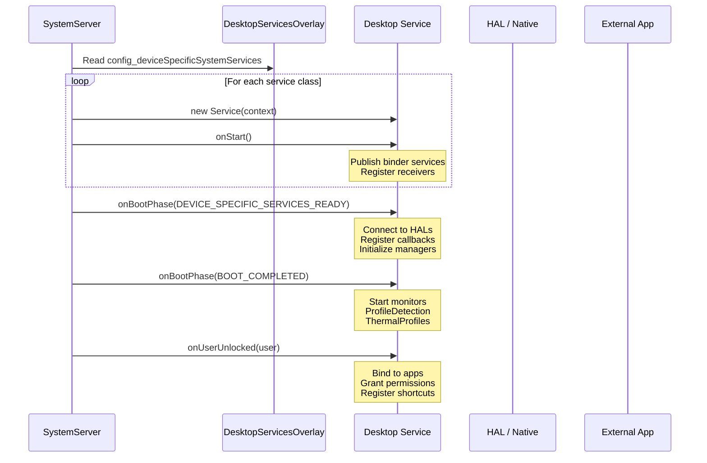
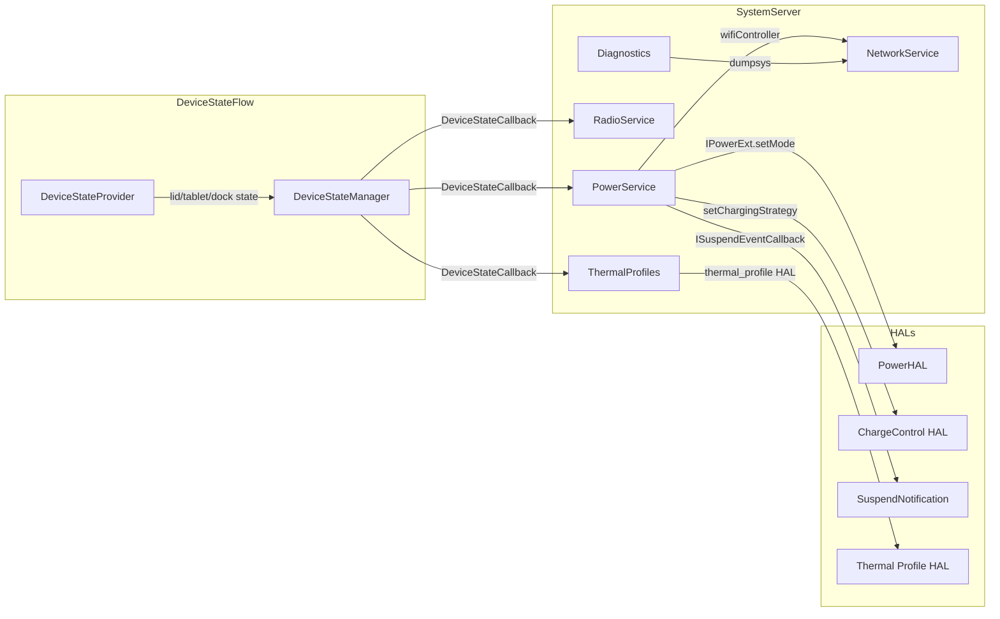
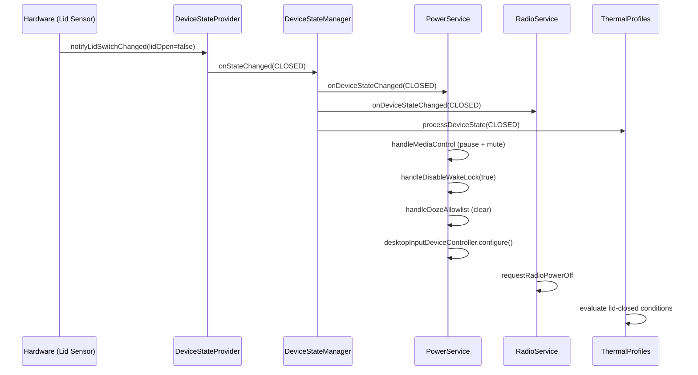

# Desktop Services Implementation

## 1. Architecture Overview

Desktop Services is a modular collection of Android `SystemService` implementations that extend the Android framework with desktop-specific functionality. All services are compiled into a single `desktop-services` Java library and loaded into `system_server` via the `config_deviceSpecificSystemServices` overlay mechanism. The library is a peer to AOSP's `services.impl` and is linked at build time through static library dependencies.

```mermaid
graph TB
    subgraph SystemServer["system_server Process"]
        direction TB
        Overlay["DesktopServicesOverlay<br/>(config_deviceSpecificSystemServices)"]

        subgraph DS["desktop-services.jar"]
            direction LR

            subgraph Core["Core / Context"]
                CE["ContextEngineService"]
            end

            subgraph SysMgmt["System Management"]
                DIAG["DiagnosticsService"]
                SNAP["SnapshotSystemService"]
            end

            subgraph UX["User Experience"]
                INPUT["UserInitializeService"]
                MEDIA_OBS["AudioDeviceObserverService"]
                MEDIA_VOL["AudioVolumeService"]
                VC["VideoChatManager"]
                FB["UserChangeBroadcastService"]
            end

            subgraph DataMig["Data & Migration"]
                DM["DataMigrationService"]
                SS["SettingsSyncService"]
                RM["RepairModeService"]
            end

            subgraph NetRadio["Network & Radio"]
                NET["NetworkService"]
                DRM["DrmNetworkService"]
                RAD["RadioService"]
            end

            subgraph PwrTherm["Power & Thermal"]
                PWR["PowerService"]
                TP["ThermalProfilesService"]
            end

            subgraph SecPerm["Security"]
                PERM["PermissionGrantService"]
            end
        end
    end

    subgraph VendorPartition["Vendor Partition (Native)"]
        SOCD["socdaemon<br/>(C++ binary)"]
        PHAL["PowerHAL"]
        CHAL["ChargeControl HAL"]
        TPHAL["ThermalProfile HAL"]
        SUSPEND["SuspendNotificationService"]
    end

    subgraph ExternalApps["External Apps / Services"]
        ALAI["com.google.android.desktop.alai<br/>(LOAM ContentObserver)"]
        SSAPP["com.android.settingssync"]
        SNAPS["com.google.android.snapshotservice"]
        BB["BetterBug Family"]
    end

    Overlay -->|instantiates| DS
    PWR -->|binder| SUSPEND
    PWR -->|binder| CHAL
    PWR -.->|IPowerExt| PHAL
    SOCD -->|PowerHAL hints| PHAL
    TP -->|vendor.google.thermal_profile| TPHAL
    CE -->|bindServiceAsUser| ALAI
    SS -->|broadcast| SSAPP
    SNAP -->|bindService| SNAPS
    FB -->|broadcast| BB
    DRM -->|HTTP POST| Internet["Widevine Server"]
```



## 2. Key Components

| Service | Package Path | Binder Name | Purpose | AIDL Interfaces |
|---|---|---|---|---|
| `DesktopContextEngineService` | `context_engine/` | -- (binds to external) | Central data broker; binds to LOAM ContentObserver | -- |
| `DesktopDataMigrationService` | `data_migration/` | `desktop_data_migration` | Migrates apps, media, and Chrome data from legacy OS | `com.android.desktop.data_migration` |
| `DesktopDiagnosticsService` | `diagnostics/` | `desktop_diagnostics` | Periodic CPU/memory metrics collection, dumpsys support | -- (Binder dump only) |
| `DesktopDrmNetworkService` | `drm_network/` | `IDrmNetworkService/default` | HTTP proxy for Widevine HDCP key provisioning | `IDrmNetworkService` (VINTF) |
| `DesktopUserChangeBroadcastService` | `feedback/` | -- | Broadcasts user-change intents to BetterBug apps | -- |
| `DesktopAudioDeviceObserverService` | `media/` | -- | Observes active audio device, pushes info to DRAS | -- |
| `DesktopAudioVolumeService` | `media/` | -- | Absolute volume control for USB audio devices via DRAS | -- |
| `DesktopUserInitializeService` | `input/` | -- | Registers ChromeOS-compatible keyboard shortcuts for new users | -- |
| `DesktopNetworkService` | `network/` | `desktop_net` | Network management, ehide-lite, network diagnostics, PNO scan disable | -- (shell commands) |
| `DesktopPermissionGrantService` | `permission/` | -- (local) | Pre-grants CAMERA/RECORD_AUDIO to Chrome as default browser | -- |
| `DesktopPowerService` | `power/` | `IDesktopSettingHealthService/default` | Lid-close power management, suspend handling, charge limiting, WiFi sleep control, profile detection | `IDesktopSettingHealthService`, `ISuspendNotificationService` |
| `DesktopRadioService` | `radio/` | -- | Powers off modem radio on lid-close and airplane mode | -- |
| `DesktopRepairModeService` | `repairmode/` | -- | Manages DSU-based repair mode environment | -- |
| `SettingsSyncService` | `settings_sync/` | -- | Observes Secure settings changes, notifies SettingsSync app | -- |
| `SnapshotSystemService` | `snapshot/` | `ISnapshot/default`, `IAqueduct/default` | Provides dmesg/file access and Aqueduct upload proxy for SnapshotCollector | `ISnapshot`, `IAqueduct` |
| `ThermalProfilesService` | `thermal_profiles/` | -- | Condition-based thermal profile switching (temperature, battery, lid, dock) | `vendor.google.thermal_profile` |
| `DesktopVideoChatManager` | `video_chat/` | `IVideoChatManager/default` | Manages video chat effects (blur, retouch, relight) | `IVideoChatManager` |
| **socdaemon** (native) | `socdaemon/` | -- | SoC-level core containment daemon using WLT/HFI hints | -- (native, PowerHAL) |

## 3. Context Engine

**Path:** `vendor/google/desktop/desktop-services/context_engine/`

The Context Engine service acts as a bridge between the system server and the LOAM (Local On-device AI Model) application (`com.google.android.desktop.alai`). It maintains a persistent binding to the LOAM app's `ContentObserver` service.

### Lifecycle

1. **`onStart()`** -- Logs initialization (no binder published).
2. **`onUserUnlocked(user)`** -- Skips the system user; binds to the LOAM ContentObserver service for the unlocked user using `bindServiceAsUser()` with `BIND_AUTO_CREATE | BIND_FOREGROUND_SERVICE`.
3. **`onUserStopped(user)`** -- Unbinds the service and unregisters the package monitor.

### Resilience

A `PackageMonitor` watches for force-stop events on the LOAM package. When the LOAM app is force-stopped (as opposed to crashing, which re-establishes the binding automatically), the monitor unbinds and re-binds manually.

### Key Constants

```kotlin
SERVICE_PACKAGE_NAME = "com.google.android.desktop.alai"
SERVICE_CLASS_NAME   = "com.google.android.desktop.alai.loam.app.contentobserver.ContentObserver"
```

**Source:** `context_engine/src/com/android/server/desktop/context_engine/DesktopContextEngineService.kt`

## 4. System Management Services

### 4.1 socdaemon (Native C++ Binary)

**Path:** `vendor/google/desktop/desktop-services/socdaemon/`

A vendor-partition native daemon that performs SoC-level core containment by monitoring workload type (WLT), hardware feedback interface (HFI), and system load, then sending power hints to the PowerHAL.

**Architecture:**
- `SocDaemon` -- Main orchestrator; spawns monitor threads, manages debounce logic for core containment entry (10s) and exit (1s).
- `HintManager` -- Communicates with PowerHAL via `android.hardware.power.IPower` and the Pixel power extension `IPowerExt`.
- `WltMonitor` -- Monitors Workload Type via sysfs/netlink.
- `HfiMonitor` -- Monitors Intel Hardware Feedback Interface.
- `SysLoadMonitor` -- Tracks system CPU load with a slope threshold of 5.0 for exit decisions.
- `SysfsMonitor` -- Generic sysfs attribute monitor.

**Init Configuration** (`socdaemon.rc`):
```
service vendor.socdaemon /vendor/bin/socdaemon --sendHint true --socHint wlt --notification-delay 128
    class main
    user root
    group system
    disabled
    oneshot
```

Started automatically when `vendor.powerhal.config` is set to a supported powerhint JSON (204/404/484) and `vendor.powerhal.init=1`. Stopped when OOB (Out-Of-Box) configurations are active.

**Build:** `cc_binary` targeting vendor partition, linking `liblog`, `libbinder_ndk`, `pixel-power-ext-V1-ndk`, and `libnl`.

### 4.2 Diagnostics Service

**Path:** `vendor/google/desktop/desktop-services/diagnostics/`

Collects system metrics at 5-minute intervals and persists them to a SQLite database for inclusion in bug reports.

**Collected Metrics:**
| Metric | Source |
|---|---|
| Memory PSI | `/proc/pressure/memory` |
| MemInfo | `/proc/meminfo` |
| ZRAM I/O | `/sys/block/zram*/stat` |
| VM Stats | `/proc/vmstat` |
| CPU Usage | `/proc/stat` |
| CPU Frequency | `/sys/devices/system/cpu/*/cpufreq` |

**Storage:**
- Database location: `/data/misc/diagnostics/metrics.db`
- Size limit: 3 MB per boot cycle
- Metrics are GZIP-compressed before storage
- Previous boot metrics are retained for comparison

**Dumpsys Interface:**
```
adb shell dumpsys desktop_diagnostics latest    # Current boot
adb shell dumpsys desktop_diagnostics previous  # Previous boot
adb shell dumpsys desktop_diagnostics -a        # All recorded
```

**Gating:** Controlled by system property `persist.vendor.desktop.diagnostics.record.enable`.

**Testing:** Robolectric unit tests in `diagnostics/tests/` with raw test data for meminfo, memory PSI, vmstat, and zram I/O parsing. Benchmark tests in `diagnostics/benchmark/`.

**Source:** `diagnostics/src/com/android/server/desktop/diagnostics/DesktopDiagnosticsService.kt`

## 5. User Experience Services

### 5.1 Input Services

**Path:** `vendor/google/desktop/desktop-services/input/`

Two classes work together:

1. **`DesktopUserInitializeService`** -- Registers a `BroadcastReceiver` for `ACTION_USER_INITIALIZE` across all users. When a new user is created, it delegates to `KeyboardShortcutsRegistrationService`.

2. **`KeyboardShortcutsRegistrationService`** -- Registers ChromeOS-compatible keyboard shortcuts for the newest user:
   - `Ctrl + Overview` -- Take fullscreen screenshot
   - `Ctrl + Shift + Overview` -- Take partial screenshot
   - `Ctrl + Alt + Overview` -- Take app window screenshot

Uses `InputManager.addCustomInputGesture()` API. Shortcuts are registered as custom gestures and can be deleted by the user.

**Feature Flag:** `disable_internal_input_devices_in_tablet_mode` (namespace: `desktop_input`)

### 5.2 Media Services

**Path:** `vendor/google/desktop/desktop-services/media/`

**DesktopAudioDeviceObserverService:**
- Observes active audio output device changes via `AudioManager` callbacks.
- Pushes the active device type to DRAS (Desktop Remote Audio Service) via `audioManager.setParameters("dras.observer_service.active_device_type=...")`.
- Monitors both preferred device changes (user selection) and device add/remove events.

**DesktopAudioVolumeService:**
- Implements absolute volume control for USB audio devices (headset, device, accessory).
- Sets USB device types as absolute volume devices via `AudioSystem.setDeviceAbsoluteVolumeEnabled()`.
- Manages a connection-order list of sink devices, applying LIFO priority when devices are added/removed.
- Maps framework volume indices to HAL volume (0-100 range) and communicates via DRAS parameters (`dras.usb.output.*`).
- Handles mute/unmute events by routing them back through the framework for software mute.

### 5.3 Video Chat Manager

**Path:** `vendor/google/desktop/desktop-services/video_chat/`

Manages video chat visual effects settings and provides an AIDL interface for HAL and client communication.

**AIDL Interface:** `IVideoChatManager` (binder name: `com.android.desktop.video_chat.IVideoChatManager/default`)

**Managed Settings:**
- `desktop-effects-portrait-relight` -- Portrait relighting toggle
- `desktop-effects-face-retouch` -- Face retouching toggle
- `desktop-effects-blur-level` -- Background blur level (byte)

**Features:**
- Listener registration via `RemoteCallbackList<IVideoChatListener>` for push notifications
- User-switching support: reads per-user Secure settings on user switch
- Capabilities management (get/set feature capabilities as byte array)

### 5.4 Feedback Service

**Path:** `vendor/google/desktop/desktop-services/feedback/`

**DesktopUserChangeBroadcastService:**
- On `onUserUnlocked()`, grants `GET_ACCOUNTS` permission to BetterBug family apps and broadcasts `USER_CHANGE` intent.
- Target packages: `com.google.android.apps.internal.betterbug`, `com.google.android.apps.betterbug.partners`
- Skips the system user (userId = 0).

## 6. Data & Migration Services

### 6.1 Data Migration Service

**Path:** `vendor/google/desktop/desktop-services/data_migration/`

Handles migration of data from a legacy OS (ChromeOS / ARC++) to Android Desktop.

**Shell Commands** (`adb shell cmd desktop_data_migration`):

| Command | Description |
|---|---|
| `install-apps <user-id> <data-dir>` | Installs all packages found in legacy Android `/data` |
| `install-app <user-id> <apk-dir>` | Installs a single package from APK directory |
| `copy-app-data <user-id> <data-dir>` | Migrates `/data/user` and `/data/user_de` directories |
| `copy-media <user-id> <data-dir>` | Migrates `/data/media` directory |
| `migrate-chrome-data <user-id> <chrome-profile-dir>` | Migrates Chrome profile data to Clank |

**Importers:**
- `ArcDataImporter` -- Handles ARC++ app installation and data migration
- `ChromeDataImporter` -- Handles Chrome-to-Clank profile data migration

**Protected Broadcast:** `com.android.server.desktop.data_migration.PACKAGE_INSTALL_COMMIT` (declared in overlay manifest)

### 6.2 Settings Sync Service

**Path:** `vendor/google/desktop/desktop-services/settings_sync/`

Observes changes to specific `Settings.Secure` values and notifies the `com.android.settingssync` system app via broadcast.

**Monitored Settings:**
- `ADAPTIVE_SLEEP`
- `ADAPTIVE_CONNECTIVITY_ENABLED`
- `SCREENSAVER_ENABLED`

**Mechanism:** Registers `ContentObserver` for each setting across `USER_ALL`. On change, sends `ON_SETTING_CHANGED` broadcast to `SettingsObserver` receiver in the SettingsSync package with the changed URI as intent data.

### 6.3 Repair Mode Service

**Path:** `vendor/google/desktop/desktop-services/repairmode/`

Manages a DSU (Dynamic System Update) based repair mode environment.

**Activation:** Service is active when a DSU with slot name `repairmode.lock` is in use.

**Restricted Environment Setup** (when `restrictedEnvironment` flag is enabled):
1. Sets system user (user 0) as boot user for restricted environment
2. Sets provisioning state (device provisioned + user setup complete) to allow SystemUI
3. Enables repair mode home activity (`com.google.android.factory.launcher/.MainActivity`)
4. Configures temporary activities allowlist for headless system user type

**Feature Flag:** `enable_desktop_repair_mode_service` (namespace: `desktop_serviceability`)

## 7. Network & Radio Services

### 7.1 Network Service

**Path:** `vendor/google/desktop/desktop-services/network/`

The most feature-rich networking service, providing:

**Network Management:**
- Disables WiFi PNO (Preferred Network Offload) scanning on boot
- Sets `WIFI_ALWAYS_REQUESTED` to keep WiFi active alongside higher-priority networks (Ethernet)
- Manages ehide-lite virtual Ethernet interfaces (`eth5182`, `eth5183`) for network isolation
- Provides shell commands for WiFi enable/disable, current WiFi query, and Ethernet IP configuration

**Network Diagnostics:**
- Automatically triggered on bug report initiation (`BUGREPORT_STARTED` broadcast)
- Runs per-connected-network diagnostic suites:
  - DNS resolution test
  - ICMP ping tests (DNS servers, gateway, remote)
  - HTTP probe tests
  - HTTPS probe tests
- Results available via `adb shell dumpsys desktop_net`
- Global test timeout: 15 seconds; dump timeout: 5 seconds

**Shell Commands** (`adb shell cmd desktop_net`):

| Command | Description |
|---|---|
| `enable-network <netId>` | Enable and connect to WiFi network |
| `disable-network <netId>` | Disable WiFi network |
| `current-wifi` | Print current WiFi SSID |
| `config-ethernet <ifname> [options]` | Configure Ethernet IP (static/DHCP) |
| `ehide-lite {start\|stop\|status}` | Manage ehide-lite (requires property) |

**Helper Classes:**
- `EhideManager` -- Manages ehide-lite virtual interfaces
- `EhideInterface` -- Individual ehide interface abstraction
- `NetlinkInterfaceHelper` -- Netlink-based interface management

### 7.2 DRM Network Service

**Path:** `vendor/google/desktop/desktop-services/drm_network/`

Provides HTTP proxy capability for Widevine HDCP key provisioning requests.

**AIDL Interface** (`@VintfStability`):
```
interface IDrmNetworkService {
    byte[] sendHttpRequest(String url, in byte[] requestData, in RequestDataType requestDataType);
}
```

**Error Codes:**
- `NETWORK_TIMEOUT` (0) -- Network unavailable or socket timeout
- `INVALID_REQUEST` (1) -- Unsupported request data type
- `INVALID_URL` (2) -- Malformed URL
- `HTTP_ERROR` (3) -- Non-200 HTTP response
- `INVALID_RESPONSE` (4) -- Non-ASCII response body
- `UNKNOWN_ERROR` (5) -- Unexpected exception

**VINTF Fragment:** `com.android.desktop.drm_network.xml` declares the `IDrmNetworkService` HAL interface (version 1, hwbinder transport).

**Behavior:** Registers a `NetworkCallback` for internet-capable networks. HTTP requests block until network is available, then execute POST requests with configurable content type (currently JSON only). Network timeout: 1 minute.

### 7.3 Radio Service

**Path:** `vendor/google/desktop/desktop-services/radio/`

Manages cellular radio power state based on device physical state and airplane mode.

**Lid-Close Behavior:**
- Powers off radio when lid is closed (via `requestRadioPowerOffForReason`)
- Restores radio when lid is opened (via `clearRadioPowerOffForReason`)

**Airplane Mode Behavior:**
- Starts a 1-minute timer when airplane mode is enabled
- After timer expires, calls `telephonyManager.shutdownAllRadios()` to fully power down the modem
- Cancels timer if airplane mode is disabled before expiry

**Guards:** Only activates on data-capable devices with available TelephonyManager and DeviceStateManager. Gated by `enable_desktop_radio_service` flag.

**Source:** `radio/src/com/android/server/desktop/radio/DesktopRadioService.kt`

## 8. Power & Thermal Services

### 8.1 Power Service

**Path:** `vendor/google/desktop/desktop-services/power/`

The most complex service in the subsystem, managing power state, device states, suspend handling, charging optimization, WiFi sleep control, and performance profile detection.

#### Device State Management

`DesktopDeviceStateProvider` provides four device states:

| State ID | Name | Physical Properties | System Properties |
|---|---|---|---|
| 0 | CLOSED | `LID_CLOSED` | `TRIGGER_SLEEP` |
| 1 | DOCKED | `DOCKED` | -- |
| 2 | OPEN | `LID_OPEN` | `TRIGGER_WAKE` |
| 3 | TABLET | `SLATE` | `TRIGGER_WAKE` |

State determination logic (in priority order):
1. Tablet mode ON + lid closed = INVALID (impossible state)
2. External display + lid closed = DOCKED
3. No external display + lid closed = CLOSED
4. Tablet mode ON + lid open = TABLET
5. Tablet mode OFF + lid open = OPEN

Listens to: `InputManagerInternal.LidSwitchCallback`, `DisplayManager.DisplayListener`, `InputManager.OnTabletModeChangedListener`.

#### Lid-Close Power Behaviors

When entering CLOSED state:
- **Media pause:** Dispatches `KEYCODE_MEDIA_PAUSE` key events
- **Audio mute:** Mutes audio (unmutes on lid open if was not already muted)
- **Wakelock disable:** Calls `powerManagerInternal.setForceDisableWakelocks(true)`
- **Doze allowlist clear:** Removes all packages from system power whitelist (except `com.android.providers.calendar`)
- **Input device disable:** Configures internal input devices via `DesktopInputDeviceController`

#### Suspend Notification Handling

Communicates with the `ISuspendNotificationService` HAL (binder name: `com.android.desktop.power.ISuspendNotificationService/default`):
- Receives suspend-imminent events, engages WiFi controller before acknowledging
- Acknowledges events to unblock the kernel suspend path

#### Charging Optimization

`DesktopChargingOptimizationController` manages charge limit via `IDesktopPowerChargeControl` HAL:
- Sustain strategy: maintain battery at 80% (lower bound = upper bound = 80)
- Exposed via `IDesktopSettingHealthService` AIDL for Settings Intelligence package

#### WiFi Controller

`power/src/.../wifi/` contains:
- `WifiController` -- Coordinates WiFi connectivity manager state across suspend/resume
- `WifiHandler` -- Handles WiFi state change commands
- `WifiStateMachine` -- State machine for WiFi connectivity during sleep

#### Profile Detection Service

`ProfileDetectionService` implements application-aware power profile detection:
- Reads configuration from `/vendor/etc/perf_policy.json`
- Monitors media sessions (playing/paused state) and top app (fullscreen state)
- Evaluates profile conditions and sends power hints via `IPowerExt.setMode()`
- Gated by property: `vendor.desktop.profile_detection.enabled`

**Example Configuration** (x86_64):
```json
{
  "profiles": [{
    "name": "VIDEO_PLAYBACK",
    "conditions": [
      {"source": "MEDIA_SESSION", "state": "PLAYING"},
      {"source": "TOP_APP", "fullscreen": true}
    ],
    "actions": [{"type": "POWER_HINT", "name": "PROFILE_VIDEO_PLAYBACK"}]
  }]
}
```

#### Alarm Manager Configuration

Configures `allow_while_idle_quota` and `allow_while_idle_compat_quota` to 1 via `DeviceConfig` to restrict idle alarm wakeups on desktop devices.

### 8.2 Thermal Profiles Service

**Path:** `vendor/google/desktop/desktop-services/thermal_profiles/`

A condition-based thermal profile management system that evaluates device state conditions and applies thermal actions.

**Architecture:**
```
ThermalProfilesService
  --> Monitor (BroadcastReceiver, DelayedUpdateJobProvider)
        --> ConfigParser (XML: /vendor/etc/thermal_profile_config.xml)
        --> ConditionsProcessor (evaluates condition sets)
        --> ActionPerformer (executes thermal profile changes)
```

**Monitored Condition Types:**
| Condition | Source |
|---|---|
| Temperature | `IThermalService` (ThermalEventListener) |
| Battery level | `ACTION_BATTERY_CHANGED` broadcast |
| Power source (AC/DC) | `ACTION_BATTERY_CHANGED` broadcast |
| Lid state (open/closed) | `DeviceStateManager` callback |
| Platform type (tablet/clamshell) | `DeviceStateManager` callback |
| Dock mode (docked/undocked) | `DeviceStateManager` callback |

**Configuration:** XML-based config at `/vendor/etc/thermal_profile_config.xml` (overridable via `vendor.desktop.thermal_profiles.config` property). Sets `vendor.desktop.thermal_profiles.degraded` property on parse failure.

**Scheduling:** Uses Kotlin coroutines (`MainScope`) for delayed condition re-evaluation with configurable timeouts.

**HAL Integration:** Communicates with `vendor.google.thermal_profile` V1 HAL.

## 9. Security & Permission Services

### 9.1 Permission Grant Service

**Path:** `vendor/google/desktop/desktop-services/permission/`

Automatically pre-grants `CAMERA` and `RECORD_AUDIO` runtime permissions to the default Chrome browser on desktop devices.

**Target Packages:**
- `com.android.chrome` (Stable)
- `com.chrome.beta` (Beta)
- `com.chrome.dev` (Dev)
- `com.chrome.canary` (Canary)

**Permission Grant Logic:**

| Current State | User Set? | Action |
|---|---|---|
| Not granted, user never touched | No | Grant + set `GRANTED_BY_DEFAULT` flag |
| Denied by user | Yes | Skip (respect user choice) |
| Granted by user | Yes | Add `GRANTED_BY_DEFAULT` flag |
| Granted by another policy | No | Skip |

**Revocation Logic** (when Chrome stops being default browser):
- If user confirmed the grant (`USER_SET` + `GRANTED_BY_DEFAULT`): remove flag only, keep grant
- If only pre-granted (`GRANTED_BY_DEFAULT` without `USER_SET`): revoke permission

**Lifecycle:** Activates on `onUserUnlocked()`. Listens for `RoleManager.ROLE_BROWSER` changes via `OnRoleHoldersChangedListener`.

**Feature Flag:** `enable_desktop_permission_grant_service` (namespace: `desktop_native_framework`)

## 10. State Management (Snapshot)

**Path:** `vendor/google/desktop/desktop-services/snapshot/`

Provides a system-server-level service that assists the SnapshotCollector vendor native process in interacting with the SnapshotService app.

**Published Binder Services:**
1. `com.google.android.snapshot.ISnapshot/default` -- Always published
2. `com.google.android.aqueduct.IAqueduct/default` -- Gated by `enable_aqueduct_binder_service` flag

### ISnapshot Interface

**`sendBroadcast(snapshotIntent, user, receiverPermission)`** -- Sends broadcasts on behalf of the native SnapshotCollector, supporting special user types (ALL, CURRENT, SYSTEM) and specific user IDs. Clears calling identity for system-level broadcast delivery.

**`getLogStream(logType, args)`** -- Creates a socket pair and streams log output (e.g., `dmesg`) from a background thread to the client. Supports a 5-second timeout. Returns a `ParcelFileDescriptor` for the client side.

**`getFile(path)`** -- Streams arbitrary file contents through a socket pair. Reads using low-level `Os.open()`/`Os.read()` for system-level file access.

### IAqueduct Interface

**`upload(category, pfd, uuid)`** -- Proxies file uploads to the SnapshotService app's `AqueductProxyService` (`com.google.android.snapshotservice`). Binds to the proxy service, uploads the data, then unbinds.

**Permissions:**
- `com.google.android.snapshotservice.permission.SEND_SNAPSHOT_BROADCAST`
- `com.google.android.snapshotservice.permission.LAUNCH_AQUEDUCT_PROXY_SERVICE`

## 11. DesktopServicesOverlay

**Path:** `vendor/google/desktop/desktop-services/DesktopServicesOverlay/`

A Runtime Resource Overlay (RRO) that targets the `android` framework package to inject desktop-specific configurations.

**Build Type:** `runtime_resource_overlay` with `product_specific: true`

**Package:** `com.android.desktop.services.overlay`

**Overlay Configuration** (`res/values/config.xml`):

### Service Registration

The `config_deviceSpecificSystemServices` string-array defines the instantiation order of all desktop services:

1. `DesktopContextEngineService`
2. `DesktopDataMigrationService`
3. `DesktopDiagnosticsService`
4. `DesktopDrmNetworkService`
5. `DesktopUserChangeBroadcastService`
6. `DesktopAudioDeviceObserverService`
7. `DesktopAudioVolumeService`
8. `DesktopPermissionGrantService`
9. `DesktopRadioService`
10. `DesktopRepairModeService`
11. `DesktopNetworkService`
12. `DesktopPowerService`
13. `ThermalProfilesService`
14. `SettingsSyncService`
15. `SnapshotSystemService`
16. `DesktopVideoChatManager`
17. `DesktopUserInitializeService`

### Device State Policy

```xml
<string name="config_deviceSpecificDeviceStatePolicyProvider">
    com.android.server.desktop.power.DesktopDeviceStatePolicy$Provider
</string>
```

### Other Overlays

- Wallpaper effects generation service: Points to `AiAiWallpaperEffectsGenerationService` in the Google AI package.

### Manifest Permissions & Broadcasts

The overlay manifest declares:
- **Protected broadcast:** `com.android.server.desktop.data_migration.PACKAGE_INSTALL_COMMIT`
- **Permissions used:** `SEND_SNAPSHOT_BROADCAST`, `LAUNCH_AQUEDUCT_PROXY_SERVICE`, `MANAGE_KEY_GESTURES`, `MANAGE_USERS`, `INTERACT_ACROSS_USERS_FULL`

## 12. Feature Flags (aconfig)

**Path:** `vendor/google/desktop/desktop-services/aconfig/`

All flags share the package `com.android.desktop.services.flags` and container `system`.

| Flag | Namespace | File | Description |
|---|---|---|---|
| `enable_charge_limit` | `desktop_pnp` | `power.aconfig` | Enables charge limit feature for battery health optimization |
| `enable_aqueduct_binder_service` | `desktop_stats` | `snapshot.aconfig` | Controls whether the Aqueduct proxy binder service is published |
| `disable_internal_input_devices_in_tablet_mode` | `desktop_input` | `input.aconfig` | Disables internal keyboard/touchpad in tablet mode |
| `enable_desktop_permission_grant_service` | `desktop_native_framework` | `permission.aconfig` | Controls DesktopPermissionGrantService activation |
| `enable_desktop_radio_service` | `desktop_connectivity` | `radio.aconfig` | Controls DesktopRadioService activation |
| `enable_desktop_repair_mode_service` | `desktop_serviceability` | `repairmode.aconfig` | Controls DesktopRepairModeService activation |

**Build Integration:**
```
aconfig_declarations {
    name: "com.android.desktop.services.flags",
    package: "com.android.desktop.services.flags",
    container: "system",
    srcs: ["**/*.aconfig"],
}
java_aconfig_library {
    name: "com.android.desktop.services.flags-lib",
    aconfig_declarations: "com.android.desktop.services.flags",
}
```

Additionally, repair mode has a separate flag namespace:
- `com.google.android.desktop.repairmode.flags` with `restrictedEnvironment` flag

## 13. Data Flow

### Service Lifecycle



### Inter-Service Communication



### Lid-Close Event Flow



## 14. Configuration

### System Properties

| Property | Service | Description |
|---|---|---|
| `persist.vendor.desktop.diagnostics.record.enable` | Diagnostics | Enable/disable metrics recording |
| `vendor.desktop.profile_detection.enabled` | Power | Enable profile detection (video playback hints) |
| `vendor.desktop.ehide-lite.enabled` | Network | Enable ehide-lite management commands |
| `vendor.desktop.thermal_profiles.config` | Thermal | Override thermal profiles config file path |
| `vendor.desktop.thermal_profiles.degraded` | Thermal | Set on config parse failure |
| `vendor.powerhal.config` | socdaemon | PowerHAL config file, triggers socdaemon start |
| `vendor.powerhal.init` | socdaemon | PowerHAL initialized flag |

### Configuration Files

| File | Location | Format | Purpose |
|---|---|---|---|
| `perf_policy.json` | `/vendor/etc/perf_policy.json` | JSON | Power profile detection conditions and actions |
| `thermal_profile_config.xml` | `/vendor/etc/thermal_profile_config.xml` | XML | Thermal conditions, actions, and condition sets |
| `powerhint_*.json` | `/vendor/etc/power/` | JSON | PowerHAL hint configurations (204/404/484 silicon) |

### Settings Keys

| Key | Type | Service | Description |
|---|---|---|---|
| `Settings.Secure.ADAPTIVE_SLEEP` | Secure | SettingsSync | Monitored for sync |
| `Settings.Secure.ADAPTIVE_CONNECTIVITY_ENABLED` | Secure | SettingsSync | Monitored for sync |
| `Settings.Secure.SCREENSAVER_ENABLED` | Secure | SettingsSync | Monitored for sync |
| `desktop-effects-portrait-relight` | Secure (per-user) | VideoChatManager | Portrait relight toggle |
| `desktop-effects-face-retouch` | Secure (per-user) | VideoChatManager | Face retouch toggle |
| `desktop-effects-blur-level` | Secure (per-user) | VideoChatManager | Background blur level |
| `Settings.Global.WIFI_ALWAYS_REQUESTED` | Global | NetworkService | Keep WiFi active with Ethernet |
| `Settings.Global.AIRPLANE_MODE_ON` | Global | RadioService | Monitored for modem shutdown timer |

## 15. Build Integration

### Main Build Module

```
// Android.bp (top-level)
java_library {
    name: "desktop-services",
    installable: true,
    srcs: [
        ":desktop-services.context_engine-srcs",
        ":desktop-services.data_migration-srcs",
        ":desktop-services.diagnostics-srcs",
        ":desktop-services.drm_network-srcs",
        ":desktop-services.feedback-srcs",
        ":desktop-services.input-srcs",
        ":desktop-services.media-srcs",
        ":desktop-services.permission-srcs",
        ":desktop-services.radio-srcs",
        ":desktop-services.repairmode-srcs",
        ":desktop-services.network-srcs",
        ":desktop-services.power-srcs",
        ":desktop-services.thermal_profiles-srcs",
        ":desktop-services.settings_sync-srcs",
        ":desktop-services.snapshot-srcs",
        ":desktop-services.video_chat-srcs",
    ],
    libs: ["services.impl"],
    required: ["DesktopServicesOverlay"],
    platform_apis: true,
}
```

### Static Library Dependencies

| Library | Purpose |
|---|---|
| `com.android.desktop.data_migration-java` | Data migration AIDL bindings |
| `com.android.desktop.drm_network-aidl-V1-java` | DRM network AIDL (VINTF) |
| `com.android.desktop.power-V1-java` | Power suspend notification AIDL |
| `com.android.desktop.video_chat-aidl-V1-java` | Video chat manager AIDL |
| `com.android.desktop.services.flags-lib` | Aconfig feature flags |
| `com.android.desktop.power-charge-control-hal-V1-java` | Charge control HAL AIDL |
| `com.google.android.desktop.repairmode.flags-lib` | Repair mode feature flags |
| `com.google.android.aqueduct-aidl-V1-java` | Aqueduct upload proxy AIDL |
| `com.google.android.snapshot-aidl-V1-java` | Snapshot service AIDL |
| `pixel-power-ext-V1-java` | Pixel power extension HAL |
| `vendor.google.thermal_profile-V1-java` | Thermal profile HAL |
| `network-diagnostics` | Network diagnostics test framework |
| `netlink-utils-desktop` | Netlink interface utilities |
| `kotlin-stdlib` | Kotlin standard library |
| `kotlinx_coroutines_android` | Kotlin coroutines (Android) |
| `kotlinx_coroutines` | Kotlin coroutines (core) |
| `kotlinx_serialization_json` | Kotlin JSON serialization |
| `gson` | Google JSON parser |

### Kotlin Plugins

- `kotlin-serialize-compiler-plugin` -- Required for Kotlin serialization

### Sub-Module Convention

Each sub-module defines a `filegroup` named `desktop-services.<module>-srcs` that collects its Kotlin/AIDL sources. Example:
```
filegroup {
    name: "desktop-services.power-srcs",
    srcs: ["src/**/*.kt", "src/**/*.aidl"],
}
```

### Native Module (socdaemon)

Built as `cc_binary` targeting vendor partition:
- Links: `liblog`, `libc++`, `libbinder_ndk`, `pixel-power-ext-V1-ndk`, `libnl`
- Init script: `socdaemon.rc`
- Compiler flags: `-Wall -Wextra -Werror`

## 16. Inter-Subsystem Dependencies

### Upstream Dependencies (Desktop Services depends on)

| Subsystem | Interface | Used By |
|---|---|---|
| AOSP `services.impl` | `lib` dependency | All services (for system service APIs) |
| PowerHAL (`android.hardware.power`) | `IPower`, `IPowerExt` | socdaemon, ProfileDetectionService |
| SuspendNotificationService | `ISuspendNotificationService` | DesktopPowerService |
| ChargeControl HAL | `IDesktopPowerChargeControl` | DesktopChargingOptimizationController |
| Thermal Profile HAL | `vendor.google.thermal_profile` | ThermalProfilesService |
| DeviceStateManager | `DeviceStateManager.DeviceStateCallback` | PowerService, RadioService, ThermalProfilesService |
| ThermalService | `IThermalService` | ThermalProfilesService (temperature events) |
| ConnectivityManager | `NetworkCallback` | DrmNetworkService, NetworkService |
| AudioManager | Device callbacks, volume APIs | Media services |
| InputManager | Lid switch, tablet mode, key gestures | PowerService, Input services |
| MediaSessionManager | Session change listener | ProfileDetectionService |
| RoleManager | Browser role change listener | PermissionGrantService |
| DynamicSystemManager | DSU status | RepairModeService |

### Downstream Dependencies (other subsystems depend on Desktop Services)

| Consumer | Interface | Service |
|---|---|---|
| SnapshotCollector (native) | `ISnapshot`, `IAqueduct` | SnapshotSystemService |
| Widevine DRM HAL | `IDrmNetworkService` | DrmNetworkService |
| Settings Intelligence | `IDesktopSettingHealthService` | PowerService |
| Video chat HAL / apps | `IVideoChatManager` | VideoChatManager |
| LOAM app | Service binding | ContextEngineService |
| SettingsSync app | Broadcast receiver | SettingsSyncService |
| BetterBug apps | Broadcast receiver | FeedbackService |

## 17. SEPolicy

Desktop Services does not maintain its own SEPolicy directory within the `desktop-services/` tree. SEPolicy rules for these services are expected to reside in the device-level or vendor-level sepolicy directories (e.g., `device/google/desktop/common/sepolicy/` or `device/google/desktop/fatcat/sepolicy/`).

Key SEPolicy contexts relevant to desktop services:
- `desktop_diagnostics` binder service requires file access to `/data/misc/diagnostics/`
- `socdaemon` runs as `root` in group `system` on the vendor partition
- DRM network service requires network socket access for HTTP POST operations
- Snapshot service requires access to `dmesg` and arbitrary file reading
- Thermal profiles service needs access to thermal service binder and sysfs nodes
- Power service needs access to PowerHAL, charge control HAL, and suspend notification binder services

## 18. Testing

### Test Infrastructure

| Service | Test Path | Type | Framework |
|---|---|---|---|
| Diagnostics | `diagnostics/tests/` | Unit | Robolectric |
| Diagnostics | `diagnostics/benchmark/` | Benchmark | AndroidJUnit |
| Power | `power/tests/` | Instrumentation | AndroidJUnit |
| Thermal Profiles | `thermal_profiles/tests/` | Unit | AndroidJUnit |
| Input | `input/tests/` | Unit | AndroidJUnit |
| Radio | `radio/tests/` | Unit | AndroidJUnit |
| Data Migration | `data_migration/test/` | Instrumentation | AndroidJUnit |
| Data Migration | `data_migration/test/app/` | Test app | -- |

### Test Details

**Diagnostics Tests:**
- `MemoryMetricsTest.kt` -- Validates memory metric collection and parsing against expected JSON output
- `MetricsHelperTest.kt` -- Tests compression/decompression and database operations
- Test resources include raw meminfo, memory PSI, vmstat, and zram I/O data with expected JSON outputs

**Power Tests:**
- `DesktopPowerServiceTest.kt` -- Tests lid-close behaviors (media pause, mute, wakelock)
- `DesktopChargingOptimizationControllerTest.kt` -- Tests charge limit strategy creation
- `DesktopDeviceStateProviderTest.kt` -- Tests state machine transitions
- `DesktopInputDeviceControllerTest.kt` -- Tests input device enable/disable in tablet mode
- `WifiControllerTest.kt`, `WifiHandlerTest.kt`, `WifiStateMachineTest.kt` -- WiFi sleep control tests

**Thermal Profiles Tests:**
- `ConfigParserTest.kt` -- XML config parsing with various test configs (empty, actions-only, conditions-only)
- `ConditionsProcessorTest.kt` -- Condition evaluation logic
- `ActionPerformerTest.kt` -- Action execution verification
- `TimeoutConditionTest.kt` -- Delayed re-evaluation timing

**Input Tests:**
- `KeyboardShortcutsRegistrationServiceTest.kt` -- Validates shortcut registration for new users

**Radio Tests:**
- `DesktopRadioServiceTest.kt` -- Tests radio power-off on lid close and airplane mode timer

### TEST_MAPPING

```json
{
  "desktop-presubmit": [
    {"name": "CtsStrictJavaPackagesTestCases"}
  ]
}
```

The `CtsStrictJavaPackagesTestCases` test ensures that the desktop services library does not introduce disallowed Java package dependencies.

## 19. Key Files Reference

| File | Absolute Path |
|---|---|
| Main Android.bp | `vendor/google/desktop/desktop-services/Android.bp` |
| TEST_MAPPING | `vendor/google/desktop/desktop-services/TEST_MAPPING` |
| Aconfig flags | `vendor/google/desktop/desktop-services/aconfig/Android.bp` |
| Overlay config.xml | `vendor/google/desktop/desktop-services/DesktopServicesOverlay/res/values/config.xml` |
| Overlay manifest | `vendor/google/desktop/desktop-services/DesktopServicesOverlay/AndroidManifest.xml` |
| ContextEngine service | `vendor/google/desktop/desktop-services/context_engine/src/com/android/server/desktop/context_engine/DesktopContextEngineService.kt` |
| DataMigration service | `vendor/google/desktop/desktop-services/data_migration/src/com/android/server/desktop/data_migration/DesktopDataMigrationService.kt` |
| Diagnostics service | `vendor/google/desktop/desktop-services/diagnostics/src/com/android/server/desktop/diagnostics/DesktopDiagnosticsService.kt` |
| DrmNetwork service | `vendor/google/desktop/desktop-services/drm_network/src/com/android/server/desktop/drm_network/DesktopDrmNetworkService.kt` |
| DrmNetwork AIDL | `vendor/google/desktop/desktop-services/drm_network/aidl/com/android/desktop/drm_network/IDrmNetworkService.aidl` |
| DrmNetwork VINTF | `vendor/google/desktop/desktop-services/drm_network/com.android.desktop.drm_network.xml` |
| Feedback service | `vendor/google/desktop/desktop-services/feedback/src/com/android/server/desktop/feedback/DesktopUserChangeBroadcastService.kt` |
| Input initialize service | `vendor/google/desktop/desktop-services/input/src/com/android/server/desktop/input/DesktopUserInitializeService.kt` |
| Keyboard shortcuts | `vendor/google/desktop/desktop-services/input/src/com/android/server/desktop/input/KeyboardShortcutsRegistrationService.kt` |
| AudioDeviceObserver | `vendor/google/desktop/desktop-services/media/src/com/android/server/desktop/media/DesktopAudioDeviceObserverService.kt` |
| AudioVolume service | `vendor/google/desktop/desktop-services/media/src/com/android/server/desktop/media/DesktopAudioVolumeService.kt` |
| Network service | `vendor/google/desktop/desktop-services/network/src/com/android/server/desktop/network/DesktopNetworkService.kt` |
| Permission service | `vendor/google/desktop/desktop-services/permission/src/com/android/server/desktop/permission/DesktopPermissionGrantService.kt` |
| Power service | `vendor/google/desktop/desktop-services/power/src/com/android/server/desktop/power/DesktopPowerService.kt` |
| DeviceStatePolicy | `vendor/google/desktop/desktop-services/power/src/com/android/server/desktop/power/DesktopDeviceStatePolicy.kt` |
| DeviceStateProvider | `vendor/google/desktop/desktop-services/power/src/com/android/server/desktop/power/DesktopDeviceStateProvider.kt` |
| ChargingController | `vendor/google/desktop/desktop-services/power/src/com/android/server/desktop/power/DesktopChargingOptimizationController.kt` |
| ProfileDetection | `vendor/google/desktop/desktop-services/power/src/com/android/server/desktop/power/ProfileDetectionService.kt` |
| Health AIDL | `vendor/google/desktop/desktop-services/power/src/com/android/server/desktop/power/IDesktopSettingHealthService.aidl` |
| WiFi controller | `vendor/google/desktop/desktop-services/power/src/com/android/server/desktop/power/wifi/WifiController.kt` |
| Perf policy (x86_64) | `vendor/google/desktop/desktop-services/power/conf/x86_64/perf_policy.json` |
| Perf policy (arm64) | `vendor/google/desktop/desktop-services/power/conf/arm64/perf_policy.json` |
| Radio service | `vendor/google/desktop/desktop-services/radio/src/com/android/server/desktop/radio/DesktopRadioService.kt` |
| RepairMode service | `vendor/google/desktop/desktop-services/repairmode/src/com/android/server/desktop/repairmode/DesktopRepairModeService.kt` |
| SettingsSync service | `vendor/google/desktop/desktop-services/settings_sync/src/com/android/server/desktop/settings_sync/SettingsSyncService.kt` |
| Snapshot service | `vendor/google/desktop/desktop-services/snapshot/src/com/android/server/desktop/snapshot/SnapshotSystemService.kt` |
| ThermalProfiles service | `vendor/google/desktop/desktop-services/thermal_profiles/src/com/android/server/desktop/thermal_profiles/ThermalProfilesService.kt` |
| ThermalProfiles monitor | `vendor/google/desktop/desktop-services/thermal_profiles/src/com/android/server/desktop/thermal_profiles/Monitor.kt` |
| VideoChatManager | `vendor/google/desktop/desktop-services/video_chat/src/com/android/server/desktop/video_chat/DesktopVideoChatManager.kt` |
| socdaemon Android.bp | `vendor/google/desktop/desktop-services/socdaemon/Android.bp` |
| socdaemon README | `vendor/google/desktop/desktop-services/socdaemon/README.md` |
| socdaemon header | `vendor/google/desktop/desktop-services/socdaemon/SocDaemon.h` |
| socdaemon init | `vendor/google/desktop/desktop-services/socdaemon/socdaemon.rc` |

All paths are relative to the repository root at `/mnt/nvme11/home/gaggery/ww04-fatcat-bkc/`.
