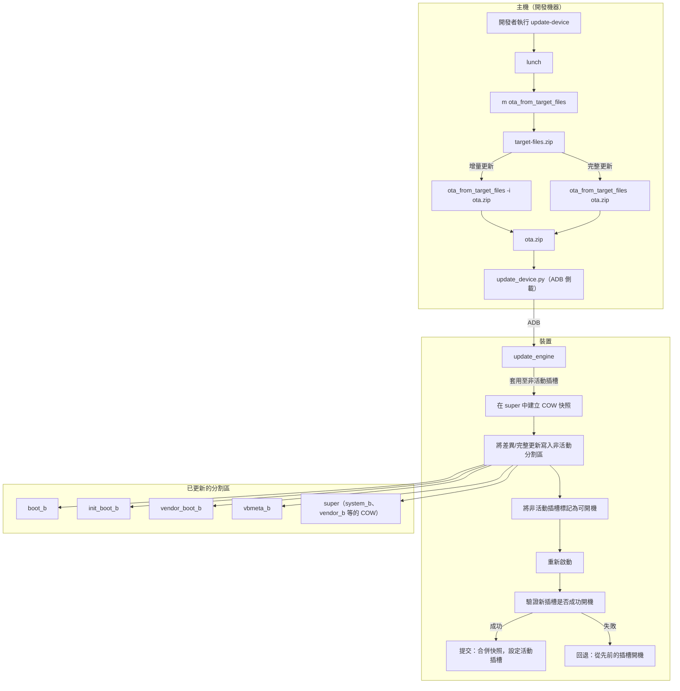

# 儲存、配置、OTA 與佈建實作

## 1. 架構概覽

Android 桌面平台（AluminiumOS）採用 GPT 磁碟配置，在 ChromeOS 分割區方案基礎上擴展了 Android 專用分割區。系統支援透過 GRUB 進行 UEFI 開機、A/B 插槽更新以實現無縫 OTA、透過 `super` 分割區進行壓縮式 Virtual A/B，以及全磁碟和雙重開機安裝模式。


### 開機流程


## 2. 關鍵元件

| 元件 | 路徑 | 語言 | 用途 |
|------|------|------|------|
| `disk_layout.json` | `vendor/google/desktop/layout/` | JSON | 主要磁碟分割區配置定義 |
| `disk_layout_x86.json` | `vendor/google/desktop/layout/` | JSON | x86 專用配置（與預設相同） |
| `disk_layout_arm.json` | `vendor/google/desktop/layout/` | JSON | ARM 配置，含 DTB/DTBO 分割區 |
| `disk_layout_extcbfs.json` | `vendor/google/desktop/layout/` | JSON | 擴展 CBFS 配置，含更大的 RWFW |
| `regen_partition_script.py` | `vendor/google/desktop/layout/` | Python | 從 JSON 產生 Shell 分割區腳本 |
| `partition-common.sh` | `vendor/google/desktop/layout/` | Shell | 通用分割區輔助函式 |
| `partition-common-sgdisk.sh` | `vendor/google/desktop/layout/` | Shell | 基於 sgdisk 的分割區操作 |
| `partition-common-cgpt.sh` | `vendor/google/desktop/layout/` | Shell | 基於 cgpt 的分割區操作（ChromeOS） |
| `pack_image` | `vendor/google/desktop/layout/` | Shell | 建置最終的 `android-desktop_image.bin` |
| `pack_image_with_esp` | `vendor/google/desktop/layout/` | Shell | 包裝器：先建置 ESP 再打包映像 |
| `build_esp_image` | `vendor/google/desktop/layout/` | Shell | 建置 EFI 系統分割區映像 |
| `grub.cfg.template` | `vendor/google/desktop/layout/` | GRUB 設定 | GRUB 開機選單與核心載入 |
| `esp_image.mk` | `vendor/google/desktop/layout/` | Makefile | ESP 映像的建置整合 |
| `fat32_add_file.py` | `vendor/google/desktop/layout/` | Python | 不需掛載即可將檔案加入 FAT32 映像 |
| `android-desktop-install` | `vendor/google/desktop/installer/` | Shell | 裝置端安裝程式（USB 到磁碟） |
| `linux-wrapper.sh` | `vendor/google/desktop/installer/dev/` | Shell | 主機端包裝器，用於執行安裝程式 |
| `update-device` | `vendor/google/desktop/update-device/` | Shell | 主機端 OTA 更新工具 |
| `update-partition` | `vendor/google/desktop/update-partition/` | Shell | 分割區級別映像置換工具 |
| `al-install` | `vendor/google/desktop/provision/` | Shell | 實驗室佈建腳本 |
| `disk_info` | `vendor/google/desktop/storage/disk_info/` | C++ | 磁碟健康狀態/資訊回報 |
| `storage_metrics_service` | `vendor/google/desktop/storage/storage_metrics_service/` | Rust | 儲存指標收集常駐程式 |
| `fstab` | `device/google/desktop/common/shared/fstab/` | 設定 | 基本檔案系統掛載表 |
| `fstab-verity-encryption` | `device/google/desktop/common/shared/fstab/` | 設定 | 含 AVB、加密、fsverity 的 fstab |
| `vendorsetup.sh` | `vendor/intel/utils/` | Shell | Intel 供應商建置設定（lunch 覆寫） |
| `autopatch.sh` | `vendor/intel/utils/` | Shell | Intel BKC 建置的補丁管理 |

## 3. 磁碟配置

### 3.1 配置結構

磁碟配置定義於 `vendor/google/desktop/layout/disk_layout.json`，使用支援註解的 JSON 格式。它指定了：

- **中繼資料**：區塊大小（512）、檔案系統區塊大小（4096）、2 MiB 對齊，以及用於裝置探索的 rootdev sysfs 路徑
- **配置範本**：`common`（基礎）、`base`（裝置安裝）、`usb`（USB 開機）、`recovery`（復原媒體）

配置系統使用繼承機制：`base`、`usb` 和 `recovery` 會覆寫 `common` 中的特定分割區。

### 3.2 分割區表（通用配置）

| GPT 編號 | 標籤 | 類型 | 大小 | 檔案系統 | 用途 |
|----------|------|------|------|----------|------|
| 9 | `ota_recovery_a` | data | 128 MiB | -- | OTA 復原插槽 A（必須是第一個分割區） |
| 6 | `KERN-C` | data | 0 | -- | 保留（ChromeOS 插槽 C） |
| 7 | `ROOT-C` | data | 0 | -- | 保留（ChromeOS 插槽 C） |
| 25 | `RWFW-A` | firmware | 0 | -- | 保留的可讀寫韌體插槽 A |
| 26 | `RWFW-B` | firmware | 0 | -- | 保留的可讀寫韌體插槽 B |
| 8 | `OEM` | data | 4 MiB | ext4 | 主機板專用檔案 |
| 12 | `EFI-SYSTEM` | efi | 64 MiB | vfat | EFI 系統分割區 (GRUB) |
| 2 | `KERN-A` | data | 32 MiB | -- | ChromeOS 核心插槽 A |
| 3 | `super` | data | 8 GiB | dm-linear | Android 動態分割區 |
| 4 | `KERN-B` | data | 0 | -- | ChromeOS 核心插槽 B |
| 5 | `ROOT-B` | data | 0 | -- | ChromeOS root B |
| 13 | `boot_a` | kernel | 64 MiB | -- | Android 核心插槽 A |
| 14 | `boot_b` | kernel | 64 MiB | -- | Android 核心插槽 B |
| 15 | `vbmeta_a` | vbmeta | 4 MiB | -- | 驗證開機中繼資料 A |
| 16 | `vbmeta_b` | vbmeta | 4 MiB | -- | 驗證開機中繼資料 B |
| 17 | `metadata` | data | 16 MiB | ext4 | Android 中繼資料（加密金鑰） |
| 18 | `init_boot_a` | data | 32 MiB | -- | Android init ramdisk A |
| 19 | `init_boot_b` | data | 32 MiB | -- | Android init ramdisk B |
| 20 | `vendor_boot_a` | data | 32 MiB | -- | 供應商 ramdisk A（fstab） |
| 21 | `vendor_boot_b` | data | 32 MiB | -- | 供應商 ramdisk B（fstab） |
| 22 | `pvmfw_a` | data | 4 MiB | -- | 受保護的虛擬機器韌體 A |
| 23 | `pvmfw_b` | data | 4 MiB | -- | 受保護的虛擬機器韌體 B |
| 24 | `misc` | data | 4 MiB | -- | 恢復原廠設定 / 開機控制 |
| 27 | `recovery_a` | data | 32 MiB | -- | Android Recovery A (fastbootd) |
| 28 | `recovery_b` | data | 32 MiB | -- | Android Recovery B (fastbootd) |
| 29 | `desktop_security_persist` | data | 16 MiB | -- | TEE 持久性儲存（恢復原廠設定後保留） |
| 30 | `desktop_security_storage` | data | 32 MiB | -- | TEE 安全儲存（恢復原廠設定時清除） |
| 31 | `frp_persist` | data | 2 MiB | -- | 恢復原廠設定保護儲存 |
| 1 | `userdata` | data | 4 GiB（擴展） | ext4 | 使用者資料（填滿剩餘空間） |
| 10 | `ota_recovery_b` | data | 128 MiB | -- | OTA 復原插槽 B（必須是最後一個分割區） |

**固定分割區總空間**：約 8.9 GiB（不含 userdata 擴展）

### 3.3 架構專用配置

**x86 (`disk_layout_x86.json`)**：與預設配置相同。metadata 分割區為 64 MiB（預設為 16 MiB），init_boot 分割區為 8 MiB（預設為 32 MiB）。

**ARM (`disk_layout_arm.json`)**：新增 DTB/DTBO 分割區以支援裝置樹：
- 分割區 31：`dtb_a`（2 MiB），分割區 32：`dtbo_a`（8 MiB）
- 分割區 33：`dtb_b`（2 MiB），分割區 34：`dtbo_b`（8 MiB）
- FRP 移至分割區 35

**ExtCBFS (`disk_layout_extcbfs.json`)**：繼承自 `disk_layout.json`，將 RWFW 分割區（25、26）增加至各 16 MiB，適用於具有較大可讀寫韌體的裝置。

### 3.4 復原配置覆寫

`recovery` 變體擴展了某些分割區以用於復原媒體：
- `KERN-A`（分割區 2）：512 MiB（原為 32 MiB）-- 存放復原核心
- `KERN-B`（分割區 4）：4 MiB -- 存放分割區映像（squashfs/erofs）
- `ROOT-B`（分割區 5）：512 MiB -- 存放復原根檔案系統

### 3.5 特殊分割區放置規則

- **ota_recovery_a**（分割區 9）必須是磁碟上**第一個**實體分割區
- **ota_recovery_b**（分割區 10）必須是磁碟上**最後一個**實體分割區（使用 `last_partition` 功能）
- **userdata**（分割區 1）使用 `expand` 功能填滿所有剩餘磁碟空間
- 這些放置約束存在的原因是 OTA 復原程式碼不假定 GPT 正確性，而是在磁碟邊界掃描復原分割區

## 4. ESP 映像（EFI 系統分割區）

### 4.1 ESP 內容

ESP 是一個 64 MiB 的 FAT32 分割區，包含 UEFI 開機所需的一切：

```
/EFI/BOOT/BOOTX64.EFI          - GRUB EFI 開機載入程式
/EFI/BOOT/grub.cfg             - GRUB 設定
/EFI/BOOT/fonts/unicode.pf2    - Unicode 字型（用於圖形介面）
/EFI/BOOT/themes/android/      - 開機選單佈景主題
/EFI/BOOT/x86_64-efi/          - GRUB 模組
/EFI/BOOT/boot_splash.png      - 開機啟動畫面
/android/kernel                 - Linux 核心
/android/ramdisk.img            - 合併的 ramdisk（通用 + 供應商）
/android/logo.png               - 開機標誌（選用）
```

在雙重開機模式下，另有一個 `/EFI/AluminiumOS/` 目錄鏡像 `/EFI/BOOT/`，以避免與其他作業系統的開機載入程式衝突。

### 4.2 ESP 建置流程

`build_esp_image` 腳本（`vendor/google/desktop/layout/build_esp_image`）建構 ESP 映像：

1. **複製預建 ESP**：從包含 GRUB EFI 二進位檔和模組的預建 `esp.img` 開始
2. **建立 /android 目錄**：使用 `fat32_add_file.py` 在 FAT32 映像中建立目錄
3. **新增核心**：將建置的核心複製到 `/android/kernel`
4. **合併 ramdisk**：解壓縮 `ramdisk.img` 和 `vendor_ramdisk.img`（兩者皆為 LZ4 壓縮的 cpio 封存檔），串接 cpio 串流，以 LZ4 重新壓縮，然後加入 `/android/ramdisk.img`
5. **處理 grub.cfg**：將 `@EXTRA_KERNEL_CMDLINE@` 佔位符替換為 `BOARD_KERNEL_CMDLINE` 值
6. **新增開機標誌**：如果存在則複製 `logo.png`

### 4.3 建置整合

`esp_image.mk` 檔案設定 `PACK_DESKTOP_ESP_IMAGE := true`，使得核心 Makefile 在 `m dist` 時建置 `esp.img`。可設定的變數：
- `BOARD_ESP_IMAGE_SIZE_MB` - ESP 分割區大小（預設：64）
- `BOARD_GRUB_CFG` - 自訂 grub.cfg 的路徑

## 5. 分割區管理腳本

### 5.1 腳本產生流程


`regen_partition_script.py` Python 工具讀取 `disk_layout.json` 並產生 `partition-script.sh`，其中包含如下 Shell 變數：

- `PARTITION_NUM_<NAME>` - GPT 分割區編號
- `PARTITION_SIZE_<NAME>` - 分割區大小（位元組）
- `FORMAT_<NAME>` - 分割區類型代碼
- `FS_FORMAT_<NAME>` - 檔案系統格式
- `DATA_SIZE_<NAME>` - 資料大小

它也會產生 `write_partition_table()` 和 `write_base_table()` Shell 函式，針對每個分割區呼叫 `part_add()`。

### 5.2 partition-common.sh

提供基礎工具函式：

- `numsectors()` - 回傳檔案/裝置以 512 位元組磁區為單位的大小
- `blocksize()` - 回傳區塊裝置的邏輯區塊大小
- `make_partition_dev()` - 建構分割區裝置路徑（處理 `/dev/sda3` 和 `/dev/mmcblk0p2` 兩種命名方式）

### 5.3 partition-common-sgdisk.sh

封裝 `sgdisk` 操作：

- `part_add()` - 建立 GPT 分割區：`sgdisk --new=<num>:<start>:<end> --typecode=<num>:<code> --change-name=<num>:<label>`
- `part_prio()` / `part_clear_priority()` - 設定/清除 ChromeOS 開機優先權屬性（位元 48-51）
- `part_set_success()` - 設定 ChromeOS 開機成功屬性（位元 56）
- `create_image()` - 建立或清除磁碟映像/裝置

### 5.4 分割區映像打包

產生的 `partition-script.sh` 和通用腳本會被打包成 squashfs 和 erofs 映像以部署至裝置：

- `gen-partition-image` -- 建置 `partition.img`（squashfs，zstd 壓縮等級 22）
- `gen-partition-erofs-image` -- 建置 `partition.erofs.img`（erofs，lz4hc 壓縮等級 9）

## 6. 安裝程式（android-desktop-install）

### 6.1 概覽

**來源**：`vendor/google/desktop/installer/android-desktop-install`

安裝程式腳本將 Android 桌面映像從可移除媒體（USB）複製到目標裝置的固定儲存。它支援三種安裝模式：

1. **完整安裝** -- 清除磁碟、建立完整 GPT、複製所有分割區
2. **雙重開機安裝** -- 保留現有作業系統，在未配置的空間中建立 Android 分割區
3. **重新安裝** -- 覆寫現有的 AluminiumOS 分割區，不修改分割區表

### 6.2 命令列介面

```
android-desktop-install [<SRC> <DST> [<FLAG_INT>]]
```

- `<SRC>`：來源裝置路徑（USB 磁碟機）
- `<DST>`：目標裝置路徑（固定儲存）
- `<FLAG_INT>`：位元遮罩旗標：
  - 位元 0（`0x0001`）：跳過 userdata 清除
  - 位元 1（`0x0002`）：跳過基本表（GPT）建立
  - 位元 2（`0x0004`）：強制雙重開機模式

### 6.3 完整安裝流程

1. **載入分割區腳本**：載入 `partition-common-sgdisk.sh`、`partition-common.sh`、`partition-script.sh`
2. **驗證目標裝置**：檢查裝置是否為不可移除的
3. **建立 GPT**：在目標裝置上呼叫 `write_partition_table()`
4. **重新載入分割區表**：`blockdev --rereadpt`、`udevadm settle`
5. **複製分割區**：遍歷所有已定義的分割區，呼叫 `write_partition()` 以 `dd bs=8M` 逐一複製
6. **重設 metadata**：以 ext4 格式化 metadata 分割區
7. **重設 userdata**：歸零並重新格式化 userdata 分割區
8. **重設 misc**：清除 misc 分割區
9. **重設安全儲存**：清除 TPM 支援的安全儲存 MAC 並歸零安全分割區

### 6.4 雙重開機安裝流程

1. **偵測現有 ESP**：使用 sgdisk、blkid、標籤檢查和掛載探測方法掃描 EFI 系統分割區
2. **尋找未配置空間**：使用 `sgdisk --first-in-largest` / `--end-of-largest`，回退至手動計算
3. **驗證空間**：最少需要 25 GB（8 GB super + 16 GB userdata + 約 1 GB 其他）
4. **偵測其他作業系統**：掛載分割區以檢查 Windows、Ubuntu、Fedora、Debian 的開機檔案
5. **建立 Android 分割區**：從 GPT 分割區 32 開始，使用 `DUALBOOT_PARTITIONS` 清單建立分割區
6. **安裝 GRUB 到 ESP**：將 GRUB 複製到 `/EFI/AluminiumOS/` 和 `/EFI/BOOT/`，備份現有 EFI 項目
7. **設定開機順序**：使用 `efibootmgr`（如果可用）建立 EFI 開機項目並將 AluminiumOS 設為第一開機選項
8. **複製分割區映像**：將來源分割區對應到雙重開機目標分割區（32+）

### 6.5 雙重開機分割區對應

在雙重開機模式下，分割區從 32 開始重新編號以避免衝突：

| 標準編號 | 雙重開機編號 | 分割區 |
|----------|------------|--------|
| 3 | 32 | super |
| 13 | 33 | boot_a |
| 18 | 34 | init_boot_a |
| 20 | 35 | vendor_boot_a |
| 15 | 36 | vbmeta_a |
| 17 | 37 | metadata |
| 22 | 38 | pvmfw_a |
| 24 | 39 | misc |
| 27 | 40 | recovery_a |
| 29 | 41 | desktop_security_persist |
| 30 | 42 | desktop_security_storage |
| 31 | 43 | frp_persist |
| 9 | 44 | ota_recovery_a |
| 1 | 45 | userdata |

### 6.6 安全操作

安裝過程中，安裝程式會執行 TPM 操作以清除 Trusty 安全儲存：

- **`delete_trusty_storage_super_block_mac_tdp()`**：傳送原始 TPM 2.0 命令以刪除 TDP MAC
- **`delete_trusty_storage_super_block_mac_td()`**：傳送原始 TPM 2.0 命令以刪除 TD MAC
- **`reset_secure_storage()`**：停止 GSC 常駐程式，清除外部 MAC，歸零安全分割區

### 6.7 linux-wrapper.sh

輔助腳本（`vendor/google/desktop/installer/dev/linux-wrapper.sh`）使得能從標準 Linux 或 ChromeOS 主機執行安裝程式：

1. 以迴圈方式掛載 `.bin` 映像
2. 透過 `lpunpack` 從 super 分割區擷取 `vendor_a`
3. 從供應商映像複製分割區腳本
4. 修補安裝程式以供主機使用（調整路徑、停用喚醒鎖定）
5. 執行修改後的安裝程式

## 7. OTA 復原

### 7.1 概覽

**來源**：`vendor/google/desktop/ota_recovery/`

OTA 復原子系統提供一個輕量級、獨立的使用者空間環境，用於執行無線更新復原和系統維護任務。它獨立於主要 Android 系統運行。

`ota_recovery_a` 和 `ota_recovery_b` 分割區（各 128 MiB）策略性地放置在磁碟的開頭和結尾。復原程式碼不假定 GPT 正確性，而是在磁碟邊界掃描這些分割區，以提供對分割區表損毀的韌性。

### 7.2 A/B 插槽架構

平台使用搭配 `super` 分割區的 Virtual A/B：

- **實體 A/B 分割區**：`boot_{a,b}`、`init_boot_{a,b}`、`vendor_boot_{a,b}`、`vbmeta_{a,b}`、`pvmfw_{a,b}`、`recovery_{a,b}`、`ota_recovery_{a,b}`
- **邏輯 A/B 分割區**（位於 `super` 內）：`system_{a,b}`、`vendor_{a,b}`、`product_{a,b}`、`system_ext_{a,b}`、`system_dlkm_{a,b}`、`vendor_dlkm_{a,b}`

Virtual A/B 在 `super` 分割區內使用寫入時複製（COW）快照，避免需要複製整個 8 GiB 的 super 分割區。

### 7.3 update_engine 整合

OTA 更新由 Android 的 `update_engine` 驅動，它會：
1. 下載 OTA 有效負載
2. 將差異或完整更新套用至非活動插槽
3. 將更新後的插槽標記為可開機
4. 觸發重新啟動至新插槽

## 8. Update-Device（主機端裝置更新工具）

**來源**：`vendor/google/desktop/update-device/update-device`

一個主機端 Bash 腳本，自動化從開發機器透過 ADB 連線到裝置的 OTA 更新工作流程。

### 8.1 用法

```bash
update-device [-s <device>] [-f|--force-full-update] [--no-rebuild] [-w|--wipe-user-data] [<build_target>]
```

### 8.2 工作流程

1. **驗證環境**：需要 `ANDROID_BUILD_TOP`，驗證 ADB 連線
2. **解析建置目標**：從參數，或從 `TARGET_PRODUCT`/`TARGET_RELEASE`/`TARGET_BUILD_VARIANT`
3. **建置 OTA 套件**：
   - 執行 `m ota_from_target_files target-files-package`
   - 如果是增量更新：`ota_from_target_files -v -i <last_target_files> <target_files> <ota.zip>`
   - 如果是完整更新（強制或無基準）：`ota_from_target_files -v <target_files> <ota.zip>`
4. **儲存基準**：複製目前的 target files 作為 `ota-<product>-last-target-files.zip` 供未來增量更新使用
5. **推送 OTA 到裝置**：呼叫 `system/update_engine/scripts/` 中的 `update_device.py`
6. **驗證成功**：監控輸出中的 `onPayloadApplicationComplete(ErrorCode::kSuccess (0))`

### 8.3 建置目標

```
Android.bp: sh_binary_host { name: "update-device" }
```

作為主機端二進位檔安裝 -- 開發者可以在 `m` 之後直接呼叫。

## 9. Update-Partition（分割區級別更新工具）

**來源**：`vendor/google/desktop/update-partition/update-partition`

一個輕量級主機端腳本，用於在 GPT 磁碟映像中進行就地分割區置換。

### 9.1 用法

```bash
update-partition <partition_name> <gpt_image> <swap_image>
```

### 9.2 操作方式

1. 使用 `sgdisk --print` 找到指定名稱分割區的起始磁區
2. 使用 `dd` 搭配 `seek=<start_sector>` 就地覆寫映像中的分割區區域
3. 區塊大小：512 位元組

這對於在完整磁碟映像中替換個別分割區映像（例如僅更新 boot 或 super 分割區）非常有用，無需重建整個映像。

### 9.3 建置目標

```
Android.bp: sh_binary_host { name: "update-partition-host" }
```

## 10. 佈建（裝置佈建流程）

### 10.1 概覽

**來源**：`vendor/google/desktop/provision/al-install`

`al-install` 腳本在從佈建映像（通常是 USB）開機的裝置上佈建 AluminiumOS，主要用於實驗室環境。它搭配快取伺服器以高效分發建置產物。

### 10.2 用法

```bash
al-install <build_path> <cache_ip> [<fw_blob_path>] [<user_img>]
```

### 10.3 佈建流程

1. **下載分割區腳本**：從快取伺服器取得 `partition-common-cgpt.sh`、`partition-common.sh`、`partition-script.sh`
2. **啟動韌體更新**（背景執行）：
   - 透過 `futility gbb --get --flash --hwid` 偵測裝置型號
   - 從快取伺服器下載韌體 blob
   - 使用 `futility update --fast --force` 或 `chromeos-firmwareupdate --mode=recovery` 套用韌體
3. **分割目標磁碟**：
   - 透過 `get_fixed_dst_drive` 找到固定儲存
   - 使用 `cgpt create` 和 `write_base_table` 建立 GPT
   - 重設 userdata 和 metadata 分割區
4. **下載建置映像**：
   - 支援 `.bin`、`.gz` 和 `.zst` 壓縮格式
   - 下載到 userdata 分割區掛載點
   - 以迴圈方式掛載映像
5. **刷寫分割區**：
   - 從快取伺服器下載 `android-desktop-install`
   - 如果可用，執行安裝程式腳本以複製分割區
   - 備用方案：直接以 `dd` 複製關鍵分割區（boot_a、vendor_boot_a、init_boot_a、vbmeta_a、super、pvmfw_a、EFI-SYSTEM）
6. **選用除錯映像**：如果指定了 `USER_IMG`，則在兩個插槽上以除錯版本替換 vendor_boot
7. **等待韌體更新**：等待背景韌體更新完成
8. **清理**：卸離迴圈裝置，卸載分割區

## 11. 儲存服務

### 11.1 disk_info

**來源**：`vendor/google/desktop/storage/disk_info/`

一個 C++ 供應商二進位檔，回報磁碟健康狀態、資訊和檔案系統統計資料。

**架構**：
```
DiskInfo（基礎類別）
  ├── NvmeInfo     - 透過 NVMe 管理命令取得 NVMe 專用健康資料
  ├── UfsInfo      - UFS 專用健康資料
  └── FilesystemInfo - ext4/f2fs 檔案系統統計資料
```

**類別階層**（來自 `disk_info.h`）：
- `DiskInfo::GetDiskInfo(rootdev)` - 工廠方法，回傳適當的子類別
- `DumpInfo()` - 輸出裝置識別和容量資訊
- `DumpHealthInfo()` - 輸出健康指標（磨損、溫度、錯誤）
- `GetDiscardReadValue()` - 回傳 TRIM/discard 支援狀態
- `DumpFilesystemInfo()` - 輸出檔案系統使用統計資料

**建置**：`cc_binary { name: "disk_info", vendor: true }` 搭配透過 `nvme_sys_command.cpp` 的 NVMe 管理命令支援。

**原始檔**：
- `disk_info_cli.cpp` - 命令列介面
- `disk_info.cpp` / `disk_info.h` - 基礎類別
- `filesystem_info.cpp` / `filesystem_info.h` - 檔案系統統計資料
- `nvme_info.cpp` / `nvme_info.h` - NVMe 健康回報
- `nvme_sys_command.cpp` / `nvme_sys_command.h` - NVMe 管理命令
- `ufs_info.cpp` / `ufs_info.h` - UFS 健康回報
- `disk_info_test.cpp` - 單元測試

### 11.2 storage_metrics_service

**來源**：`vendor/google/desktop/storage/storage_metrics_service/`

一個 Rust 供應商常駐程式，收集儲存指標並回報給 Android 框架統計服務。

**相依性**：
- `android.frameworks.stats-V2-rust` - AIDL 統計介面
- `libbinder_rs` - Binder IPC
- `libprotobuf` + 設定 proto - 透過 protobuf 進行設定
- `libandroid_logger` / `liblog_rust` - 日誌記錄

**建置**：`rust_binary { name: "storage_metrics_service", vendor: true }` 搭配 `rust_protobuf` 處理設定 proto。

## 12. 檔案系統表（fstab 設定）

### 12.1 基本 fstab

**來源**：`device/google/desktop/common/shared/fstab/fstab`

不含驗證開機或加密的最小化 fstab，用於開發/測試：

```
# 邏輯分割區（位於 super 內）- 雙格式，優先使用 erofs
system      /system      erofs  ro       wait,logical,first_stage_mount
system      /system      ext4   ro,noatime  wait,logical,first_stage_mount
vendor      /vendor      erofs  ro       wait,logical,first_stage_mount
vendor      /vendor      ext4   ro,noatime  wait,logical,first_stage_mount
system_dlkm /system_dlkm erofs  ro       wait,logical,first_stage_mount
system_dlkm /system_dlkm ext4   noatime,ro  wait,logical,first_stage_mount
product     /product     erofs  ro       wait,logical,first_stage_mount
product     /product     ext4   noatime,ro  wait,logical,first_stage_mount
system_ext  /system_ext  erofs  ro       wait,logical,first_stage_mount
system_ext  /system_ext  ext4   noatime,ro  wait,logical,first_stage_mount
vendor_dlkm /vendor_dlkm erofs  ro       wait,logical,first_stage_mount
vendor_dlkm /vendor_dlkm ext4   noatime,ro  wait,logical,first_stage_mount

# 使用者資料
/dev/block/by-name/userdata /data ext4 rw,nodev,noatime,nosuid,errors=panic wait,check,quota,formattable,latemount
```

主要特性：
- 每個邏輯分割區有**雙重條目**：erofs 優先（偏好），ext4 備用
- 所有邏輯分割區使用 `first_stage_mount`（在完整系統啟動前由 init 掛載）
- 無 A/B 插槽選擇（`slotselect` 不存在）
- 無驗證開機（`avb` 不存在）
- userdata 無檔案加密

### 12.2 正式環境 fstab（fstab-verity-encryption）

**來源**：`device/google/desktop/common/shared/fstab/fstab-verity-encryption`

完整功能的 fstab，含 AVB、加密和 fsverity：

```
# 邏輯分割區 - 含 AVB 驗證和插槽選擇
system      /system      erofs  ro  wait,logical,first_stage_mount,slotselect,avb=vbmeta,readahead_size_kb=128
vendor      /vendor      erofs  ro  wait,logical,first_stage_mount,slotselect,avb=vbmeta,readahead_size_kb=128
...

# 含 AVB 的實體分割區
/dev/block/by-name/boot         /boot         emmc  defaults  slotselect,avb=boot,first_stage_mount
/dev/block/by-name/init_boot    /init_boot    emmc  defaults  slotselect,avb=init_boot,first_stage_mount
/dev/block/by-name/vendor_boot  /vendor_boot  emmc  defaults  slotselect,avb=vendor_boot,first_stage_mount
/dev/block/by-name/vbmeta       /vbmeta       emmc  defaults  slotselect,first_stage_mount

# 含行內加密的加密使用者資料
/dev/block/by-name/userdata /data ext4 rw,nodev,noatime,nosuid,errors=panic,inlinecrypt \
    wait,check,quota,formattable,latemount,\
    fileencryption=aes-256-xts:aes-256-cts:inlinecrypt_optimized,\
    keydirectory=/metadata/vold/metadata_encryption,\
    fsverity,reservedsize=128M,checkpoint=block

# 加密金鑰儲存的中繼資料
/dev/block/by-name/metadata /metadata ext4 noatime,nosuid,nodev,discard,data=journal,commit=1 \
    wait,formattable,first_stage_mount,check

# Misc 分割區
/dev/block/by-name/misc /misc emmc defaults defaults

# 可移除儲存裝置自動掛載規則
/devices/*/nvme/nvme[1-9]*/* auto auto defaults voldmanaged=sdcard1:auto
/devices/*/mmc_host*         auto auto defaults voldmanaged=sdcard1:auto
/devices/*/usb*              auto auto defaults voldmanaged=usb:auto
```

主要安全功能：
- **Android 驗證開機（AVB）**：`avb=vbmeta` 根據 vbmeta 鏈驗證分割區完整性
- **A/B 插槽選擇**：`slotselect` 根據活動插槽附加 `_a` 或 `_b` 後綴
- **基於檔案的加密**：AES-256-XTS 用於資料，AES-256-CTS 用於檔案名稱，搭配行內加密加速
- **中繼資料加密**：金鑰儲存於 `/metadata/vold/metadata_encryption`
- **fsverity**：APK 和系統檔案的檔案級別完整性驗證
- **檢查點**：區塊級別檢查點支援，用於安全的 OTA 回退
- **預讀取**：系統分割區上 128 KB 的預讀取以提升開機效能

### 12.3 外部儲存

正式環境 fstab 包含 vold 管理的規則，用於熱插拔儲存裝置：
- 額外的 NVMe 磁碟機（nvme1+）-- 掛載為 `sdcard1`
- MMC/eMMC 記憶卡 -- 掛載為 `sdcard1`
- USB 大容量儲存 -- 掛載為 `usb`

## 13. GRUB 開機設定

### 13.1 grub.cfg 範本

**來源**：`vendor/google/desktop/layout/grub.cfg.template`

GRUB 設定提供帶有佈景主題的圖形化開機選單，包含多個開機選項：

### 13.2 模組載入

開機時載入的必要 GRUB 模組：
- **視訊**：`video`、`video_fb`、`efi_gop`、`all_video`、`font`、`gfxterm`
- **佈景主題**：`bitmap`、`bitmap_scale`、`gfxterm_background`、`png`、`jpeg`、`gfxmenu`、`trig`
- **檔案系統**：`part_gpt`、`fat`、`ext2`、`search`、`probe`
- **系統**：`halt`、`reboot`、`fwsetup`、`chain`（用於雙重開機鏈式載入）

### 13.3 核心命令列

傳遞給 Linux 核心的預設參數：

```
androidboot.hardware=android-desktop
androidboot.hardware.platform=android-desktop
androidboot.slot_suffix=_a
androidboot.verifiedbootstate=orange
androidboot.veritymode=logging
androidboot.vbmeta.device_state=unlocked
```

加上動態參數：
- `androidboot.boot_part_uuid=<UUID>` -- 從 ESP 分割區 UUID 探測（偏好方式）
- `androidboot.boot_devices=pci0000:00/...` -- 備用的基於 PCI 路徑的識別方式
- `@EXTRA_KERNEL_CMDLINE@` -- 建置時以 `BOARD_KERNEL_CMDLINE` 替換

### 13.4 開機裝置識別

`load_android_from_esp` 函式動態識別開機裝置：

1. **主要方式**：`probe --set=boot_part_uuid --part-uuid ${root}` -- GPT 分割區 UUID
2. **備用方式**：`probe --set=boot_part_uuid --fs-uuid ${root}` -- 檔案系統 UUID
3. **最後手段**：靜態 `androidboot.boot_devices` PCI 路徑清單

### 13.5 開機選單項目

| 項目 | 說明 |
|------|------|
| AluminiumOS | 以 `force_normal_boot=1` 正常開機 |
| Windows Boot Manager | 鏈式載入 `/EFI/Microsoft/Boot/bootmgfw.efi`（如果偵測到） |
| Ubuntu / Fedora / Debian / 等 | 鏈式載入各自的 EFI 載入程式（如果偵測到） |
| UEFI Firmware Settings | 呼叫 `fwsetup` |
| Reboot / Shutdown | 系統控制 |

**進階選項子選單**：
- 詳細開機（串列主控台 + 除錯日誌）
- SELinux 寬容模式
- Android Recovery 模式（`force_normal_boot=0`）
- ADB Root（`ro.adb.secure=0 ro.debuggable=1`）
- Fastboot 模式
- 明確指定 root 裝置覆寫（sda18、nvme0n1p18）
- ESP 內容檢查
- GRUB 命令列

### 13.6 開機啟動畫面

`show_boot_logo` 函式：
1. 停用佈景主題以離開 gfxmenu 模式
2. 切換到全新的 gfxterm 以清除畫面
3. 將 `${prefix}/boot_splash.png` 延伸為背景
4. 清除剩餘文字

## 14. 建置整合

### 14.1 vendorsetup.sh（Intel 供應商設定）

**來源**：`vendor/intel/utils/vendorsetup.sh`

覆寫標準的 `lunch()` 函式以：
1. 將 AOSP 的 `lunch` 儲存為 `aosp_lunch()`
2. 設定 `TARGET_RELEASE=cl2a`（Celadon 發布設定）
3. 解析目標名稱並注入發布設定：`<target>-cl2a-<variant>`
4. 以完整的目標字串呼叫 `aosp_lunch`
5. 呼叫 `autopatch.sh` 以套用供應商專用補丁

### 14.2 autopatch.sh（補丁管理）

**來源**：`vendor/intel/utils/autopatch.sh`

管理 AOSP 程式碼庫之上的供應商專用補丁：

1. **補丁目錄**：
   - `vendor/intel/utils/aosp_diff/` -- AOSP 補丁（包含 `preliminary/` 和 `${TARGET_PRODUCT}/`）
   - `vendor/intel/utils/bsp_diff/` -- BSP 補丁
2. **套用流程**（`apply_patch()` 函式）：
   - 從每個 `.patch` 檔案擷取 `Date:` 標頭
   - 在最近的 git 歷史紀錄（500 次提交）中搜尋相符的作者日期
   - 如果未找到日期：以 `git am -3 --keep-cr --whitespace=nowarn` 套用
   - 如果找到日期：回報「Already applied」
3. **`fpnat()` 函式**：在目錄樹中找到所有 `.patch` 檔案，排序後呼叫 `apply_patch()`

### 14.3 pack_image（映像組裝）

**來源**：`vendor/google/desktop/layout/pack_image`

組裝最終的 `android-desktop_image.bin`：

1. 透過 `write_partition_table()` 建立 GPT 結構
2. 使用 `dd` 搭配 `oflag=seek_bytes` 寫入分割區映像：
   - `esp.img` -> 分割區 12 (EFI-SYSTEM)
   - `boot.img` -> 分割區 13 (boot_a)
   - `super.img` -> 分割區 3 (super) -- 使用 128M 區塊大小
   - `init_boot.img` -> 分割區 18 (init_boot_a)
   - `vendor_boot.img` -> 分割區 20 (vendor_boot_a)
   - `vbmeta.img` -> 分割區 15 (vbmeta_a)
   - `pvmfw.img` -> 分割區 22 (pvmfw_a) -- 選用
   - `dtbo.img` -> DTBO_A 分割區 -- 選用（ARM）
3. 透過 `mkuserimg_mke2fs` 在映像中建立中繼資料檔案系統
4. 可選擇以 `pzstd -19` 壓縮以產生 `.bin.zst`

支援 `--recovery` 和 `--update` 模式以建立特殊映像：
- **Recovery**：將復原核心寫入 KERN-A、韌體寫入 ROOT-B、分割區映像寫入 KERN-B
- **Update**：與更新媒體的 recovery 類似

## 15. 資料流 - 安裝


## 16. 資料流 - OTA 更新



## 17. 子系統間相依性


### 關鍵相依性

| 元件 | 相依於 | 提供給 |
|------|--------|--------|
| `disk_layout.json` | -- | `regen_partition_script.py`、所有配置變體 |
| `regen_partition_script.py` | `disk_layout.json`、`py/` 程式庫 | `partition-script.sh` |
| `partition-script.sh` | `regen_partition_script.py` | `pack_image`、`android-desktop-install`、`al-install` |
| `build_esp_image` | 核心、ramdisk、grub.cfg.template、`fat32_add_file.py` | `esp.img` |
| `pack_image` | `partition-script.sh`、所有 `.img` 檔案、`esp.img` | `android-desktop_image.bin` |
| `android-desktop-install` | `partition-script.sh`、`partition-common*.sh` | 磁碟上已安裝的系統 |
| `fstab-verity-encryption` | 分割區名稱需與 `disk_layout.json` 相符 | Android init（first_stage_mount） |
| `update-device` | 建置系統、`ota_from_target_files`、ADB | 裝置上的 OTA 更新 |
| `al-install` | 快取伺服器、`partition-script.sh`、`android-desktop-install` | 已在實驗室佈建的裝置 |
| `disk_info` | 區塊裝置 sysfs | 磁碟健康資料 |
| `storage_metrics_service` | `disk_info` 資料、`android.frameworks.stats` | 指標遙測 |
| `vendorsetup.sh` | `autopatch.sh` | 已套用補丁的建置環境 |

## 18. 關鍵檔案參考

| 檔案 | 絕對路徑 | 說明 |
|------|----------|------|
| `disk_layout.json` | `vendor/google/desktop/layout/disk_layout.json` | 主要 GPT 分割區配置（標準） |
| `disk_layout_x86.json` | `vendor/google/desktop/layout/disk_layout_x86.json` | x86 專用配置（metadata 64 MiB、init_boot 8 MiB） |
| `disk_layout_arm.json` | `vendor/google/desktop/layout/disk_layout_arm.json` | ARM 配置，含 DTB/DTBO 分割區 |
| `disk_layout_extcbfs.json` | `vendor/google/desktop/layout/disk_layout_extcbfs.json` | 擴展 CBFS 配置（RWFW 16 MiB） |
| `Android.bp (layout)` | `vendor/google/desktop/layout/Android.bp` | 配置工具和分割區映像的建置規則 |
| `regen_partition_script.py` | `vendor/google/desktop/layout/regen_partition_script.py` | JSON 到 Shell 分割區腳本產生器 |
| `partition-common.sh` | `vendor/google/desktop/layout/partition-common.sh` | 通用分割區工具函式 |
| `partition-common-sgdisk.sh` | `vendor/google/desktop/layout/partition-common-sgdisk.sh` | 基於 sgdisk 的分割區建立/管理 |
| `partition-common-cgpt.sh` | `vendor/google/desktop/layout/partition-common-cgpt.sh` | 基於 cgpt 的分割區建立（ChromeOS） |
| `pack_image` | `vendor/google/desktop/layout/pack_image` | 從分割區映像組裝完整磁碟映像 |
| `pack_image_with_esp` | `vendor/google/desktop/layout/pack_image_with_esp` | 包裝器：先建置 ESP 再打包完整映像 |
| `pack_migration_image` | `vendor/google/desktop/layout/pack_migration_image` | 建置遷移專用磁碟映像 |
| `build_esp_image` | `vendor/google/desktop/layout/build_esp_image` | 建置含 GRUB+核心+ramdisk 的 EFI 系統分割區 |
| `fat32_add_file.py` | `vendor/google/desktop/layout/fat32_add_file.py` | 不需作業系統掛載即可將檔案加入 FAT32 映像 |
| `grub.cfg.template` | `vendor/google/desktop/layout/grub.cfg.template` | GRUB 開機選單設定範本 |
| `esp_image.mk` | `vendor/google/desktop/layout/esp_image.mk` | 啟用 ESP 建置的 Makefile include |
| `test_with_qemu` | `vendor/google/desktop/layout/test_with_qemu` | QEMU 測試輔助腳本 |
| `android-desktop-install` | `vendor/google/desktop/installer/android-desktop-install` | 裝置端安裝程式（完整、雙重開機、重新安裝） |
| `Android.bp (installer)` | `vendor/google/desktop/installer/Android.bp` | 安裝程式建置規則 |
| `linux-wrapper.sh` | `vendor/google/desktop/installer/dev/linux-wrapper.sh` | 在 Linux/ChromeOS 上執行安裝程式的主機端包裝器 |
| `Android.bp (ota_recovery)` | `vendor/google/desktop/ota_recovery/Android.bp` | OTA 復原建置規則（佔位符） |
| `update-device` | `vendor/google/desktop/update-device/update-device` | 主機端 OTA 更新腳本（ADB） |
| `update-partition` | `vendor/google/desktop/update-partition/update-partition` | 主機端分割區置換工具 |
| `al-install` | `vendor/google/desktop/provision/al-install` | 實驗室佈建腳本 |
| `Android.bp (disk_info)` | `vendor/google/desktop/storage/disk_info/Android.bp` | 磁碟資訊二進位檔建置規則 |
| `disk_info.h` | `vendor/google/desktop/storage/disk_info/disk_info.h` | 磁碟資訊 C++ 標頭檔 |
| `Android.bp (storage_metrics)` | `vendor/google/desktop/storage/storage_metrics_service/Android.bp` | 儲存指標 Rust 服務建置規則 |
| `fstab` | `device/google/desktop/common/shared/fstab/fstab` | 基本 fstab（無 verity/加密） |
| `fstab-verity-encryption` | `device/google/desktop/common/shared/fstab/fstab-verity-encryption` | 含 AVB + 檔案加密的正式環境 fstab |
| `vendorsetup.sh` | `vendor/intel/utils/vendorsetup.sh` | Intel 供應商建置設定（lunch 覆寫） |
| `autopatch.sh` | `vendor/intel/utils/autopatch.sh` | Intel BKC 建置的補丁管理 |
