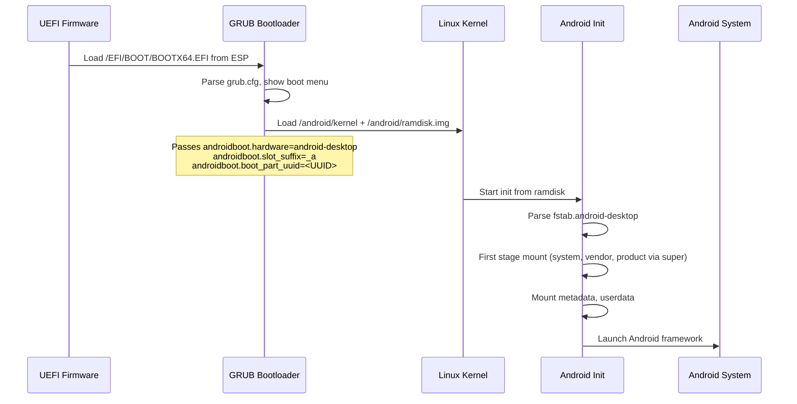
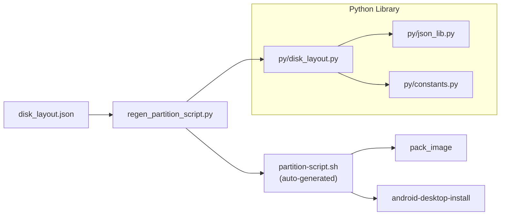
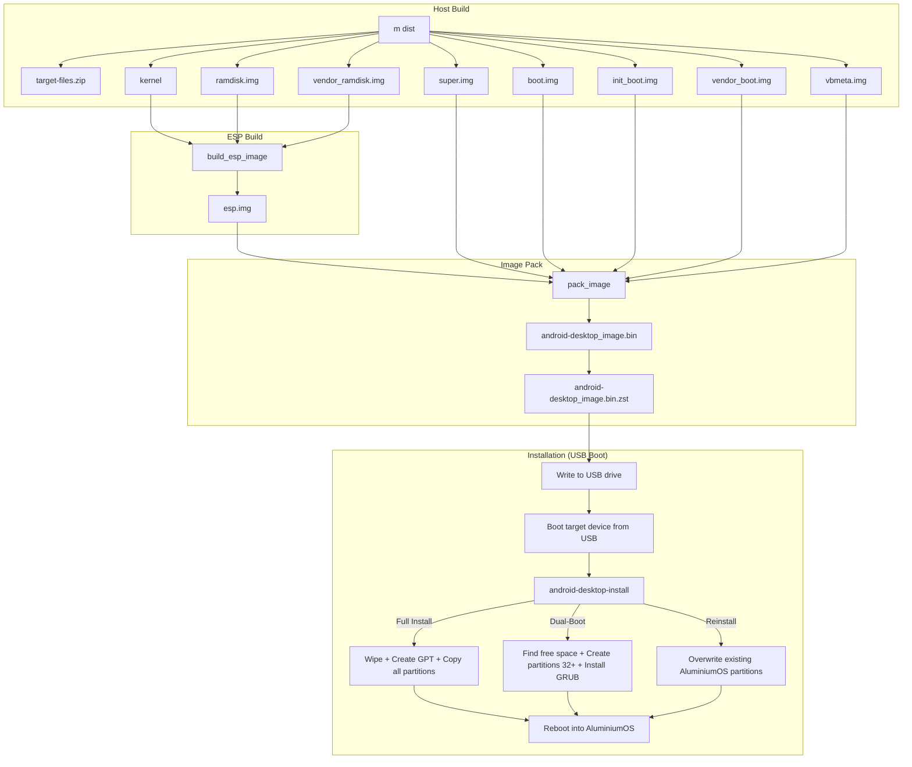
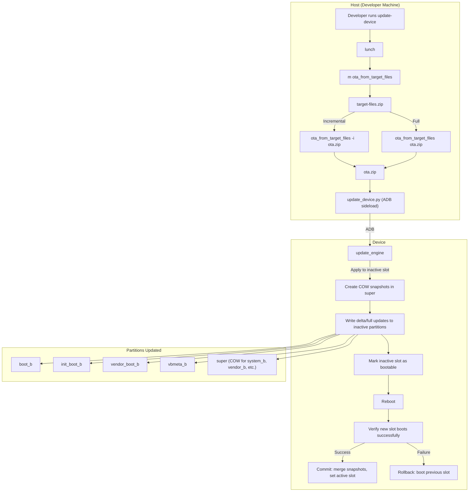
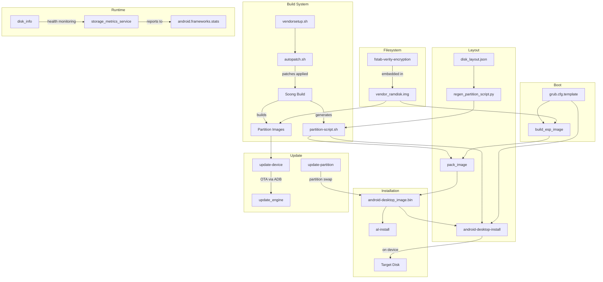

# Storage, Layout, OTA, and Provisioning Implementation

## 1. Architecture Overview

The Android Desktop Platform (AluminiumOS) uses a GPT-based disk layout that extends the ChromeOS partition scheme with Android-specific partitions. The system supports UEFI boot via GRUB, A/B slot updates for seamless OTA, Virtual A/B with compression via the `super` partition, and both full-disk and dual-boot installation modes.

```mermaid
graph TB
    subgraph "Disk Layout (GPT)"
        direction TB
        ESP["Partition 12: EFI-SYSTEM (64 MiB)<br/>FAT32 - GRUB + kernel + ramdisk"]
        KERN_A["Partition 2: KERN-A (32 MiB)<br/>ChromeOS kernel slot A"]
        SUPER["Partition 3: super (8 GiB)<br/>Dynamic partitions via dm-linear"]
        BOOT_A["Partition 13: boot_a (64 MiB)"]
        BOOT_B["Partition 14: boot_b (64 MiB)"]
        INIT_A["Partition 18: init_boot_a (32 MiB)"]
        INIT_B["Partition 19: init_boot_b (32 MiB)"]
        VBOOT_A["Partition 20: vendor_boot_a (32 MiB)"]
        VBOOT_B["Partition 21: vendor_boot_b (32 MiB)"]
        VBMETA_A["Partition 15: vbmeta_a (4 MiB)"]
        VBMETA_B["Partition 16: vbmeta_b (4 MiB)"]
        META["Partition 17: metadata (16-64 MiB)<br/>ext4 - encryption keys"]
        MISC["Partition 24: misc (4 MiB)"]
        REC_A["Partition 27: recovery_a (32 MiB)"]
        REC_B["Partition 28: recovery_b (32 MiB)"]
        OTA_A["Partition 9: ota_recovery_a (128 MiB)<br/>FIRST partition on disk"]
        OTA_B["Partition 10: ota_recovery_b (128 MiB)<br/>LAST partition on disk"]
        SEC_P["Partition 29: desktop_security_persist (16 MiB)"]
        SEC_S["Partition 30: desktop_security_storage (32 MiB)"]
        FRP["Partition 31: frp_persist (2 MiB)"]
        UDATA["Partition 1: userdata (4 GiB+expand)<br/>ext4 - fills remaining space"]
    end

    subgraph "super Partition (Dynamic)"
        SYS_A["system_a (erofs/ext4)"]
        VND_A["vendor_a (erofs/ext4)"]
        PRD_A["product_a (erofs/ext4)"]
        SYS_EXT_A["system_ext_a (erofs/ext4)"]
        SYS_DLKM_A["system_dlkm_a (erofs/ext4)"]
        VND_DLKM_A["vendor_dlkm_a (erofs/ext4)"]
    end

    SUPER --> SYS_A
    SUPER --> VND_A
    SUPER --> PRD_A
    SUPER --> SYS_EXT_A
    SUPER --> SYS_DLKM_A
    SUPER --> VND_DLKM_A
```



### Boot Flow



## 2. Key Components

| Component | Path | Language | Purpose |
|-----------|------|----------|---------|
| `disk_layout.json` | `vendor/google/desktop/layout/` | JSON | Master disk partition layout definition |
| `disk_layout_x86.json` | `vendor/google/desktop/layout/` | JSON | x86-specific layout (same as default) |
| `disk_layout_arm.json` | `vendor/google/desktop/layout/` | JSON | ARM layout with DTB/DTBO partitions |
| `disk_layout_extcbfs.json` | `vendor/google/desktop/layout/` | JSON | Extended CBFS layout with larger RWFW |
| `regen_partition_script.py` | `vendor/google/desktop/layout/` | Python | Generates shell partition scripts from JSON |
| `partition-common.sh` | `vendor/google/desktop/layout/` | Shell | Common partition helper functions |
| `partition-common-sgdisk.sh` | `vendor/google/desktop/layout/` | Shell | sgdisk-based partition operations |
| `partition-common-cgpt.sh` | `vendor/google/desktop/layout/` | Shell | cgpt-based partition operations (ChromeOS) |
| `pack_image` | `vendor/google/desktop/layout/` | Shell | Builds final `android-desktop_image.bin` |
| `pack_image_with_esp` | `vendor/google/desktop/layout/` | Shell | Wrapper: builds ESP then packs image |
| `build_esp_image` | `vendor/google/desktop/layout/` | Shell | Builds EFI System Partition image |
| `grub.cfg.template` | `vendor/google/desktop/layout/` | GRUB config | GRUB boot menu and kernel loading |
| `esp_image.mk` | `vendor/google/desktop/layout/` | Makefile | Build integration for ESP image |
| `fat32_add_file.py` | `vendor/google/desktop/layout/` | Python | Adds files to FAT32 image without mounting |
| `android-desktop-install` | `vendor/google/desktop/installer/` | Shell | On-device installer (USB to disk) |
| `linux-wrapper.sh` | `vendor/google/desktop/installer/dev/` | Shell | Host-side wrapper for running installer |
| `update-device` | `vendor/google/desktop/update-device/` | Shell | Host-side OTA update utility |
| `update-partition` | `vendor/google/desktop/update-partition/` | Shell | Partition-level image swap utility |
| `al-install` | `vendor/google/desktop/provision/` | Shell | Lab provisioning script |
| `disk_info` | `vendor/google/desktop/storage/disk_info/` | C++ | Disk health/info reporting |
| `storage_metrics_service` | `vendor/google/desktop/storage/storage_metrics_service/` | Rust | Storage metrics collection daemon |
| `fstab` | `device/google/desktop/common/shared/fstab/` | Config | Basic filesystem mount table |
| `fstab-verity-encryption` | `device/google/desktop/common/shared/fstab/` | Config | fstab with AVB, encryption, fsverity |
| `vendorsetup.sh` | `vendor/intel/utils/` | Shell | Intel vendor build setup (lunch override) |
| `autopatch.sh` | `vendor/intel/utils/` | Shell | Patch management for Intel BKC builds |

## 3. Disk Layout

### 3.1 Layout Structure

The disk layout is defined in `vendor/google/desktop/layout/disk_layout.json` using a JSON-with-comments format. It specifies:

- **Metadata**: Block size (512), filesystem block size (4096), 2 MiB alignment, and rootdev sysfs paths for device discovery
- **Layout templates**: `common` (base), `base` (device install), `usb` (USB boot), `recovery` (recovery media)

The layout system uses inheritance: `base`, `usb`, and `recovery` override specific partitions from `common`.

### 3.2 Partition Table (Common Layout)

| GPT # | Label | Type | Size | Filesystem | Purpose |
|-------|-------|------|------|------------|---------|
| 9 | `ota_recovery_a` | data | 128 MiB | -- | OTA recovery slot A (must be FIRST partition) |
| 6 | `KERN-C` | data | 0 | -- | Reserved (ChromeOS slot C) |
| 7 | `ROOT-C` | data | 0 | -- | Reserved (ChromeOS slot C) |
| 25 | `RWFW-A` | firmware | 0 | -- | Reserved RW firmware slot A |
| 26 | `RWFW-B` | firmware | 0 | -- | Reserved RW firmware slot B |
| 8 | `OEM` | data | 4 MiB | ext4 | Board-specific files |
| 12 | `EFI-SYSTEM` | efi | 64 MiB | vfat | EFI System Partition (GRUB) |
| 2 | `KERN-A` | data | 32 MiB | -- | ChromeOS kernel slot A |
| 3 | `super` | data | 8 GiB | dm-linear | Android dynamic partitions |
| 4 | `KERN-B` | data | 0 | -- | ChromeOS kernel slot B |
| 5 | `ROOT-B` | data | 0 | -- | ChromeOS root B |
| 13 | `boot_a` | kernel | 64 MiB | -- | Android kernel slot A |
| 14 | `boot_b` | kernel | 64 MiB | -- | Android kernel slot B |
| 15 | `vbmeta_a` | vbmeta | 4 MiB | -- | Verified boot metadata A |
| 16 | `vbmeta_b` | vbmeta | 4 MiB | -- | Verified boot metadata B |
| 17 | `metadata` | data | 16 MiB | ext4 | Android metadata (encryption keys) |
| 18 | `init_boot_a` | data | 32 MiB | -- | Android init ramdisk A |
| 19 | `init_boot_b` | data | 32 MiB | -- | Android init ramdisk B |
| 20 | `vendor_boot_a` | data | 32 MiB | -- | Vendor ramdisk A (fstab) |
| 21 | `vendor_boot_b` | data | 32 MiB | -- | Vendor ramdisk B (fstab) |
| 22 | `pvmfw_a` | data | 4 MiB | -- | Protected VM firmware A |
| 23 | `pvmfw_b` | data | 4 MiB | -- | Protected VM firmware B |
| 24 | `misc` | data | 4 MiB | -- | Factory reset / boot control |
| 27 | `recovery_a` | data | 32 MiB | -- | Android Recovery A (fastbootd) |
| 28 | `recovery_b` | data | 32 MiB | -- | Android Recovery B (fastbootd) |
| 29 | `desktop_security_persist` | data | 16 MiB | -- | TEE persistent storage (survives factory reset) |
| 30 | `desktop_security_storage` | data | 32 MiB | -- | TEE secure storage (wiped on factory reset) |
| 31 | `frp_persist` | data | 2 MiB | -- | Factory Reset Protection storage |
| 1 | `userdata` | data | 4 GiB (expand) | ext4 | User data (fills remaining space) |
| 10 | `ota_recovery_b` | data | 128 MiB | -- | OTA recovery slot B (must be LAST partition) |

**Total fixed partition space**: ~8.9 GiB (excluding userdata expansion)

### 3.3 Architecture-Specific Layouts

**x86 (`disk_layout_x86.json`)**: Identical to the default layout. The metadata partition is 64 MiB (vs 16 MiB in default), and init_boot partitions are 8 MiB (vs 32 MiB).

**ARM (`disk_layout_arm.json`)**: Adds DTB/DTBO partitions for device tree support:
- Partition 31: `dtb_a` (2 MiB), Partition 32: `dtbo_a` (8 MiB)
- Partition 33: `dtb_b` (2 MiB), Partition 34: `dtbo_b` (8 MiB)
- FRP moves to partition 35

**ExtCBFS (`disk_layout_extcbfs.json`)**: Inherits from `disk_layout.json`, increases RWFW partitions (25, 26) to 16 MiB each for devices with larger read-write firmware.

### 3.4 Recovery Layout Overrides

The `recovery` variant expands certain partitions for recovery media:
- `KERN-A` (partition 2): 512 MiB (vs 32 MiB) -- holds recovery kernel
- `KERN-B` (partition 4): 4 MiB -- holds partition image (squashfs/erofs)
- `ROOT-B` (partition 5): 512 MiB -- holds recovery rootfs

### 3.5 Special Partition Placement Rules

- **ota_recovery_a** (partition 9) must be the **first** physical partition on disk
- **ota_recovery_b** (partition 10) must be the **last** physical partition on disk (uses `last_partition` feature)
- **userdata** (partition 1) uses the `expand` feature to fill all remaining disk space
- These placement constraints exist because the OTA recovery code does not assume GPT correctness and scans for recovery partitions at disk boundaries

## 4. ESP Image (EFI System Partition)

### 4.1 ESP Contents

The ESP is a 64 MiB FAT32 partition containing everything needed for UEFI boot:

```
/EFI/BOOT/BOOTX64.EFI          - GRUB EFI bootloader
/EFI/BOOT/grub.cfg             - GRUB configuration
/EFI/BOOT/fonts/unicode.pf2    - Unicode font for graphics
/EFI/BOOT/themes/android/      - Boot menu theme
/EFI/BOOT/x86_64-efi/          - GRUB modules
/EFI/BOOT/boot_splash.png      - Boot splash image
/android/kernel                 - Linux kernel
/android/ramdisk.img            - Combined ramdisk (generic + vendor)
/android/logo.png               - Boot logo (optional)
```

In dual-boot mode, an additional directory `/EFI/AluminiumOS/` mirrors `/EFI/BOOT/` to avoid conflicts with other OS bootloaders.

### 4.2 ESP Build Process

The `build_esp_image` script (`vendor/google/desktop/layout/build_esp_image`) constructs the ESP image:

1. **Copy prebuilt ESP**: Starts from a prebuilt `esp.img` containing GRUB EFI binary and modules
2. **Create /android directory**: Uses `fat32_add_file.py` to create the directory in the FAT32 image
3. **Add kernel**: Copies the built kernel to `/android/kernel`
4. **Combine ramdisks**: Decompresses `ramdisk.img` and `vendor_ramdisk.img` (both LZ4-compressed cpio archives), concatenates the cpio streams, re-compresses with LZ4, and adds to `/android/ramdisk.img`
5. **Process grub.cfg**: Replaces the `@EXTRA_KERNEL_CMDLINE@` placeholder with `BOARD_KERNEL_CMDLINE` values
6. **Add boot logo**: Copies `logo.png` if present

### 4.3 Build Integration

The `esp_image.mk` file sets `PACK_DESKTOP_ESP_IMAGE := true`, which causes the core Makefile to build `esp.img` during `m dist`. Configurable variables:
- `BOARD_ESP_IMAGE_SIZE_MB` - ESP partition size (default: 64)
- `BOARD_GRUB_CFG` - Path to custom grub.cfg

## 5. Partition Management Scripts

### 5.1 Script Generation Pipeline



The `regen_partition_script.py` Python tool reads `disk_layout.json` and generates `partition-script.sh` containing shell variables like:

- `PARTITION_NUM_<NAME>` - GPT partition number
- `PARTITION_SIZE_<NAME>` - Partition size in bytes
- `FORMAT_<NAME>` - Partition type code
- `FS_FORMAT_<NAME>` - Filesystem format
- `DATA_SIZE_<NAME>` - Data size

It also generates `write_partition_table()` and `write_base_table()` shell functions that call `part_add()` for each partition.

### 5.2 partition-common.sh

Provides fundamental utilities:

- `numsectors()` - Returns file/device size in 512-byte sectors
- `blocksize()` - Returns block device's logical block size
- `make_partition_dev()` - Constructs partition device path (handles both `/dev/sda3` and `/dev/mmcblk0p2` naming)

### 5.3 partition-common-sgdisk.sh

Wraps `sgdisk` operations:

- `part_add()` - Creates a GPT partition: `sgdisk --new=<num>:<start>:<end> --typecode=<num>:<code> --change-name=<num>:<label>`
- `part_prio()` / `part_clear_priority()` - Sets/clears ChromeOS boot priority attributes (bits 48-51)
- `part_set_success()` - Sets ChromeOS boot success attribute (bit 56)
- `create_image()` - Creates or zaps a disk image/device

### 5.4 Partition Image Packaging

The generated `partition-script.sh` and common scripts are packaged into both squashfs and erofs images for deployment to devices:

- `gen-partition-image` -- Builds `partition.img` (squashfs, zstd level 22)
- `gen-partition-erofs-image` -- Builds `partition.erofs.img` (erofs, lz4hc level 9)

## 6. Installer (android-desktop-install)

### 6.1 Overview

**Source**: `vendor/google/desktop/installer/android-desktop-install`

The installer script copies an Android Desktop image from removable media (USB) to the target device's fixed storage. It supports three installation modes:

1. **Full Install** -- Wipes disk, creates full GPT, copies all partitions
2. **Dual-Boot Install** -- Preserves existing OS, creates Android partitions in unallocated space
3. **Reinstall** -- Overwrites existing AluminiumOS partitions without modifying the partition table

### 6.2 Command-Line Interface

```
android-desktop-install [<SRC> <DST> [<FLAG_INT>]]
```

- `<SRC>`: Source device path (USB drive)
- `<DST>`: Destination device path (fixed storage)
- `<FLAG_INT>`: Bitmask flags:
  - Bit 0 (`0x0001`): Skip userdata wipe
  - Bit 1 (`0x0002`): Skip base table (GPT) creation
  - Bit 2 (`0x0004`): Force dual-boot mode

### 6.3 Full Install Flow

1. **Source partition scripts**: Loads `partition-common-sgdisk.sh`, `partition-common.sh`, `partition-script.sh`
2. **Validate destination**: Checks device is not removable
3. **Create GPT**: Calls `write_partition_table()` on the destination device
4. **Reload partition table**: `blockdev --rereadpt`, `udevadm settle`
5. **Copy partitions**: Iterates through all defined partitions, calling `write_partition()` which uses `dd bs=8M` for each
6. **Reset metadata**: Formats metadata partition with ext4
7. **Reset userdata**: Zeros and reformats userdata partition
8. **Reset misc**: Clears the misc partition
9. **Reset secure storage**: Clears TPM-backed secure storage MACs and zeros security partitions

### 6.4 Dual-Boot Install Flow

1. **Detect existing ESP**: Scans for EFI System Partition using sgdisk, blkid, label check, and mount-probe methods
2. **Find unallocated space**: Uses `sgdisk --first-in-largest` / `--end-of-largest`, with fallback to manual calculation
3. **Verify space**: Requires minimum 25 GB (8 GB super + 16 GB userdata + ~1 GB other)
4. **Detect other OS**: Mounts partitions to check for Windows, Ubuntu, Fedora, Debian boot files
5. **Create Android partitions**: Starting at GPT partition 32, creates partitions using the `DUALBOOT_PARTITIONS` list
6. **Install GRUB to ESP**: Copies GRUB to `/EFI/AluminiumOS/` and `/EFI/BOOT/`, backs up existing EFI entries
7. **Set boot order**: Uses `efibootmgr` (if available) to create an EFI boot entry and set AluminiumOS as first boot option
8. **Copy partition images**: Maps source partitions to dual-boot destination partitions (32+)

### 6.5 Dual-Boot Partition Mapping

In dual-boot mode, partitions are renumbered starting at 32 to avoid conflicts:

| Standard # | Dual-Boot # | Partition |
|-----------|-------------|-----------|
| 3 | 32 | super |
| 13 | 33 | boot_a |
| 18 | 34 | init_boot_a |
| 20 | 35 | vendor_boot_a |
| 15 | 36 | vbmeta_a |
| 17 | 37 | metadata |
| 22 | 38 | pvmfw_a |
| 24 | 39 | misc |
| 27 | 40 | recovery_a |
| 29 | 41 | desktop_security_persist |
| 30 | 42 | desktop_security_storage |
| 31 | 43 | frp_persist |
| 9 | 44 | ota_recovery_a |
| 1 | 45 | userdata |

### 6.6 Security Operations

During installation, the installer performs TPM operations to clear Trusty secure storage:

- **`delete_trusty_storage_super_block_mac_tdp()`**: Sends raw TPM 2.0 command to delete TDP MAC
- **`delete_trusty_storage_super_block_mac_td()`**: Sends raw TPM 2.0 command to delete TD MAC
- **`reset_secure_storage()`**: Stops the GSC daemon, clears external MACs, zeros security partitions

### 6.7 linux-wrapper.sh

A helper script (`vendor/google/desktop/installer/dev/linux-wrapper.sh`) enables running the installer from a standard Linux or ChromeOS host:

1. Loop-mounts the `.bin` image
2. Extracts `vendor_a` from the super partition via `lpunpack`
3. Copies partition scripts from the vendor image
4. Patches the installer for host use (adjusts paths, disables wake locks)
5. Runs the modified installer

## 7. OTA Recovery

### 7.1 Overview

**Source**: `vendor/google/desktop/ota_recovery/`

The OTA Recovery subsystem provides a lightweight, standalone userspace environment for performing Over-The-Air recovery and system maintenance tasks. It operates independently of the main Android system.

The `ota_recovery_a` and `ota_recovery_b` partitions (128 MiB each) are strategically placed at the beginning and end of the disk. The recovery code does not assume GPT correctness and scans for these partitions at disk boundaries, providing resilience against partition table corruption.

### 7.2 A/B Slot Architecture

The platform uses Virtual A/B with the `super` partition:

- **Physical A/B partitions**: `boot_{a,b}`, `init_boot_{a,b}`, `vendor_boot_{a,b}`, `vbmeta_{a,b}`, `pvmfw_{a,b}`, `recovery_{a,b}`, `ota_recovery_{a,b}`
- **Logical A/B partitions** (inside `super`): `system_{a,b}`, `vendor_{a,b}`, `product_{a,b}`, `system_ext_{a,b}`, `system_dlkm_{a,b}`, `vendor_dlkm_{a,b}`

Virtual A/B uses Copy-on-Write (COW) snapshots within the `super` partition, avoiding the need to duplicate the entire 8 GiB super partition.

### 7.3 update_engine Integration

OTA updates are driven by Android's `update_engine`, which:
1. Downloads the OTA payload
2. Applies delta or full updates to the inactive slot
3. Marks the updated slot as bootable
4. Triggers reboot to the new slot

## 8. Update-Device (Host-Side Device Update Utility)

**Source**: `vendor/google/desktop/update-device/update-device`

A host-side Bash script that automates the OTA update workflow from a development machine to a connected device over ADB.

### 8.1 Usage

```bash
update-device [-s <device>] [-f|--force-full-update] [--no-rebuild] [-w|--wipe-user-data] [<build_target>]
```

### 8.2 Workflow

1. **Validate environment**: Requires `ANDROID_BUILD_TOP`, verifies ADB connectivity
2. **Resolve build target**: From argument, or from `TARGET_PRODUCT`/`TARGET_RELEASE`/`TARGET_BUILD_VARIANT`
3. **Build OTA package**:
   - Runs `m ota_from_target_files target-files-package`
   - If incremental: `ota_from_target_files -v -i <last_target_files> <target_files> <ota.zip>`
   - If full (forced or no baseline): `ota_from_target_files -v <target_files> <ota.zip>`
4. **Save baseline**: Copies current target files as `ota-<product>-last-target-files.zip` for future incremental updates
5. **Push OTA to device**: Invokes `update_device.py` from `system/update_engine/scripts/`
6. **Verify success**: Monitors output for `onPayloadApplicationComplete(ErrorCode::kSuccess (0))`

### 8.3 Build Target

```
Android.bp: sh_binary_host { name: "update-device" }
```

Installed as a host binary -- developers can invoke it directly after `m`.

## 9. Update-Partition (Partition-Level Update Utility)

**Source**: `vendor/google/desktop/update-partition/update-partition`

A lightweight host-side script for in-place partition swapping within a GPT disk image.

### 9.1 Usage

```bash
update-partition <partition_name> <gpt_image> <swap_image>
```

### 9.2 Operation

1. Uses `sgdisk --print` to find the named partition's start sector
2. Uses `dd` with `seek=<start_sector>` to overwrite the partition region in-place
3. Block size: 512 bytes

This is useful for replacing individual partition images (e.g., updating just the boot or super partition) within a full disk image without rebuilding the entire image.

### 9.3 Build Target

```
Android.bp: sh_binary_host { name: "update-partition-host" }
```

## 10. Provisioning (Device Provisioning Flow)

### 10.1 Overview

**Source**: `vendor/google/desktop/provision/al-install`

The `al-install` script provisions AluminiumOS on devices booted from a provisioning image (typically USB), primarily in lab environments. It operates with a caching server to efficiently distribute build artifacts.

### 10.2 Usage

```bash
al-install <build_path> <cache_ip> [<fw_blob_path>] [<user_img>]
```

### 10.3 Provisioning Flow

1. **Download partition scripts**: Fetches `partition-common-cgpt.sh`, `partition-common.sh`, `partition-script.sh` from the cache server
2. **Start firmware update** (background):
   - Detects device model via `futility gbb --get --flash --hwid`
   - Downloads firmware blob from cache server
   - Applies firmware using `futility update --fast --force` or `chromeos-firmwareupdate --mode=recovery`
3. **Partition target disk**:
   - Finds fixed storage via `get_fixed_dst_drive`
   - Creates GPT with `cgpt create` and `write_base_table`
   - Resets userdata and metadata partitions
4. **Download build image**:
   - Supports `.bin`, `.gz`, and `.zst` compressed formats
   - Downloads to userdata partition mount
   - Loop-mounts the image
5. **Flash partitions**:
   - Downloads `android-desktop-install` from cache server
   - If available, runs installer script to copy partitions
   - Fallback: direct `dd` copy of key partitions (boot_a, vendor_boot_a, init_boot_a, vbmeta_a, super, pvmfw_a, EFI-SYSTEM)
6. **Optional debug image**: If `USER_IMG` specified, replaces vendor_boot with debug version on both slots
7. **Wait for firmware**: Waits for background firmware update to complete
8. **Cleanup**: Detaches loop device, unmounts partitions

## 11. Storage Services

### 11.1 disk_info

**Source**: `vendor/google/desktop/storage/disk_info/`

A C++ vendor binary that reports disk health, info, and filesystem statistics.

**Architecture**:
```
DiskInfo (base class)
  ├── NvmeInfo     - NVMe-specific health data via NVMe admin commands
  ├── UfsInfo      - UFS-specific health data
  └── FilesystemInfo - ext4/f2fs filesystem statistics
```

**Class hierarchy** (from `disk_info.h`):
- `DiskInfo::GetDiskInfo(rootdev)` - Factory method that returns the appropriate subclass
- `DumpInfo()` - Outputs device identification and capacity
- `DumpHealthInfo()` - Outputs health indicators (wear, temperature, errors)
- `GetDiscardReadValue()` - Returns TRIM/discard support status
- `DumpFilesystemInfo()` - Outputs filesystem usage statistics

**Build**: `cc_binary { name: "disk_info", vendor: true }` with NVMe admin command support via `nvme_sys_command.cpp`.

**Source files**:
- `disk_info_cli.cpp` - Command-line interface
- `disk_info.cpp` / `disk_info.h` - Base class
- `filesystem_info.cpp` / `filesystem_info.h` - Filesystem statistics
- `nvme_info.cpp` / `nvme_info.h` - NVMe health reporting
- `nvme_sys_command.cpp` / `nvme_sys_command.h` - NVMe admin commands
- `ufs_info.cpp` / `ufs_info.h` - UFS health reporting
- `disk_info_test.cpp` - Unit tests

### 11.2 storage_metrics_service

**Source**: `vendor/google/desktop/storage/storage_metrics_service/`

A Rust vendor daemon that collects and reports storage metrics to the Android framework stats service.

**Dependencies**:
- `android.frameworks.stats-V2-rust` - AIDL stats interface
- `libbinder_rs` - Binder IPC
- `libprotobuf` + config proto - Configuration via protobuf
- `libandroid_logger` / `liblog_rust` - Logging

**Build**: `rust_binary { name: "storage_metrics_service", vendor: true }` with `rust_protobuf` for the config proto.

## 12. Filesystem Tables (fstab Configurations)

### 12.1 Basic fstab

**Source**: `device/google/desktop/common/shared/fstab/fstab`

Minimal fstab for development/testing without verified boot or encryption:

```
# Logical partitions (inside super) - dual format with erofs preferred
system      /system      erofs  ro       wait,logical,first_stage_mount
system      /system      ext4   ro,noatime  wait,logical,first_stage_mount
vendor      /vendor      erofs  ro       wait,logical,first_stage_mount
vendor      /vendor      ext4   ro,noatime  wait,logical,first_stage_mount
system_dlkm /system_dlkm erofs  ro       wait,logical,first_stage_mount
system_dlkm /system_dlkm ext4   noatime,ro  wait,logical,first_stage_mount
product     /product     erofs  ro       wait,logical,first_stage_mount
product     /product     ext4   noatime,ro  wait,logical,first_stage_mount
system_ext  /system_ext  erofs  ro       wait,logical,first_stage_mount
system_ext  /system_ext  ext4   noatime,ro  wait,logical,first_stage_mount
vendor_dlkm /vendor_dlkm erofs  ro       wait,logical,first_stage_mount
vendor_dlkm /vendor_dlkm ext4   noatime,ro  wait,logical,first_stage_mount

# Userdata
/dev/block/by-name/userdata /data ext4 rw,nodev,noatime,nosuid,errors=panic wait,check,quota,formattable,latemount
```

Key characteristics:
- Each logical partition has **dual entries**: erofs first (preferred), ext4 fallback
- All logical partitions use `first_stage_mount` (mounted by init before full system is up)
- No A/B slot selection (`slotselect` absent)
- No verified boot (`avb` absent)
- No file encryption on userdata

### 12.2 Production fstab (fstab-verity-encryption)

**Source**: `device/google/desktop/common/shared/fstab/fstab-verity-encryption`

Full-featured fstab with AVB, encryption, and fsverity:

```
# Logical partitions - with AVB verification and slot selection
system      /system      erofs  ro  wait,logical,first_stage_mount,slotselect,avb=vbmeta,readahead_size_kb=128
vendor      /vendor      erofs  ro  wait,logical,first_stage_mount,slotselect,avb=vbmeta,readahead_size_kb=128
...

# Physical partitions with AVB
/dev/block/by-name/boot         /boot         emmc  defaults  slotselect,avb=boot,first_stage_mount
/dev/block/by-name/init_boot    /init_boot    emmc  defaults  slotselect,avb=init_boot,first_stage_mount
/dev/block/by-name/vendor_boot  /vendor_boot  emmc  defaults  slotselect,avb=vendor_boot,first_stage_mount
/dev/block/by-name/vbmeta       /vbmeta       emmc  defaults  slotselect,first_stage_mount

# Encrypted userdata with inline encryption
/dev/block/by-name/userdata /data ext4 rw,nodev,noatime,nosuid,errors=panic,inlinecrypt \
    wait,check,quota,formattable,latemount,\
    fileencryption=aes-256-xts:aes-256-cts:inlinecrypt_optimized,\
    keydirectory=/metadata/vold/metadata_encryption,\
    fsverity,reservedsize=128M,checkpoint=block

# Metadata for encryption key storage
/dev/block/by-name/metadata /metadata ext4 noatime,nosuid,nodev,discard,data=journal,commit=1 \
    wait,formattable,first_stage_mount,check

# Misc partition
/dev/block/by-name/misc /misc emmc defaults defaults

# Removable storage auto-mount rules
/devices/*/nvme/nvme[1-9]*/* auto auto defaults voldmanaged=sdcard1:auto
/devices/*/mmc_host*         auto auto defaults voldmanaged=sdcard1:auto
/devices/*/usb*              auto auto defaults voldmanaged=usb:auto
```

Key security features:
- **Android Verified Boot (AVB)**: `avb=vbmeta` verifies partition integrity against vbmeta chain
- **A/B Slot Selection**: `slotselect` appends `_a` or `_b` suffix based on active slot
- **File-based Encryption**: AES-256-XTS for data, AES-256-CTS for filenames, with inline crypto acceleration
- **Metadata Encryption**: Keys stored in `/metadata/vold/metadata_encryption`
- **fsverity**: File-level integrity verification for APKs and system files
- **Checkpoint**: Block-level checkpoint support for safe OTA rollback
- **Readahead**: 128 KB readahead on system partitions for boot performance

### 12.3 External Storage

The production fstab includes vold-managed rules for hot-pluggable storage:
- Additional NVMe drives (nvme1+) -- mounted as `sdcard1`
- MMC/eMMC cards -- mounted as `sdcard1`
- USB mass storage -- mounted as `usb`

## 13. GRUB Boot Configuration

### 13.1 grub.cfg Template

**Source**: `vendor/google/desktop/layout/grub.cfg.template`

The GRUB configuration provides a themed graphical boot menu with multiple boot options:

### 13.2 Module Loading

Essential GRUB modules loaded at boot:
- **Video**: `video`, `video_fb`, `efi_gop`, `all_video`, `font`, `gfxterm`
- **Theme**: `bitmap`, `bitmap_scale`, `gfxterm_background`, `png`, `jpeg`, `gfxmenu`, `trig`
- **Filesystem**: `part_gpt`, `fat`, `ext2`, `search`, `probe`
- **System**: `halt`, `reboot`, `fwsetup`, `chain` (for dual-boot chainloading)

### 13.3 Kernel Command Line

Default parameters passed to the Linux kernel:

```
androidboot.hardware=android-desktop
androidboot.hardware.platform=android-desktop
androidboot.slot_suffix=_a
androidboot.verifiedbootstate=orange
androidboot.veritymode=logging
androidboot.vbmeta.device_state=unlocked
```

Plus dynamic parameters:
- `androidboot.boot_part_uuid=<UUID>` -- Probed from ESP partition UUID (preferred)
- `androidboot.boot_devices=pci0000:00/...` -- Fallback PCI path-based identification
- `@EXTRA_KERNEL_CMDLINE@` -- Replaced at build time with `BOARD_KERNEL_CMDLINE`

### 13.4 Boot Device Identification

The `load_android_from_esp` function dynamically identifies the boot device:

1. **Primary**: `probe --set=boot_part_uuid --part-uuid ${root}` -- GPT partition UUID
2. **Fallback**: `probe --set=boot_part_uuid --fs-uuid ${root}` -- Filesystem UUID
3. **Last resort**: Static `androidboot.boot_devices` PCI path list

### 13.5 Boot Menu Entries

| Entry | Description |
|-------|-------------|
| AluminiumOS | Normal boot with `force_normal_boot=1` |
| Windows Boot Manager | Chainloads `/EFI/Microsoft/Boot/bootmgfw.efi` (if detected) |
| Ubuntu / Fedora / Debian / etc. | Chainloads respective EFI loaders (if detected) |
| UEFI Firmware Settings | Invokes `fwsetup` |
| Reboot / Shutdown | System control |

**Advanced Options submenu**:
- Verbose boot (serial console + debug logging)
- SELinux Permissive mode
- Android Recovery mode (`force_normal_boot=0`)
- ADB Root (`ro.adb.secure=0 ro.debuggable=1`)
- Fastboot Mode
- Explicit root device override (sda18, nvme0n1p18)
- ESP contents check
- GRUB command line

### 13.6 Boot Splash

The `show_boot_logo` function:
1. Disables the theme to exit gfxmenu mode
2. Switches to fresh gfxterm to clear the screen
3. Stretches `${prefix}/boot_splash.png` as background
4. Clears remaining text

## 14. Build Integration

### 14.1 vendorsetup.sh (Intel Vendor Setup)

**Source**: `vendor/intel/utils/vendorsetup.sh`

Overrides the standard `lunch()` function to:
1. Save the AOSP `lunch` as `aosp_lunch()`
2. Set `TARGET_RELEASE=cl2a` (Celadon release config)
3. Parse the target name and inject the release config: `<target>-cl2a-<variant>`
4. Call `aosp_lunch` with the full target string
5. Invoke `autopatch.sh` to apply vendor-specific patches

### 14.2 autopatch.sh (Patch Management)

**Source**: `vendor/intel/utils/autopatch.sh`

Manages vendor-specific patches on top of the AOSP codebase:

1. **Patch directories**:
   - `vendor/intel/utils/aosp_diff/` -- AOSP patches (includes `preliminary/` and `${TARGET_PRODUCT}/`)
   - `vendor/intel/utils/bsp_diff/` -- BSP patches
2. **Application flow** (`apply_patch()` function):
   - Extracts `Date:` header from each `.patch` file
   - Searches recent git history (500 commits) for matching author date
   - If date not found: applies with `git am -3 --keep-cr --whitespace=nowarn`
   - If date found: reports "Already applied"
3. **`fpnat()` function**: Finds all `.patch` files in a directory tree, sorts them, and calls `apply_patch()`

### 14.3 pack_image (Image Assembly)

**Source**: `vendor/google/desktop/layout/pack_image`

Assembles the final `android-desktop_image.bin`:

1. Creates GPT structure via `write_partition_table()`
2. Writes partition images using `dd` with `oflag=seek_bytes`:
   - `esp.img` -> partition 12 (EFI-SYSTEM)
   - `boot.img` -> partition 13 (boot_a)
   - `super.img` -> partition 3 (super) -- uses 128M block size
   - `init_boot.img` -> partition 18 (init_boot_a)
   - `vendor_boot.img` -> partition 20 (vendor_boot_a)
   - `vbmeta.img` -> partition 15 (vbmeta_a)
   - `pvmfw.img` -> partition 22 (pvmfw_a) -- optional
   - `dtbo.img` -> partition for DTBO_A -- optional (ARM)
3. Creates metadata filesystem in-image via `mkuserimg_mke2fs`
4. Optionally compresses with `pzstd -19` to produce `.bin.zst`

Supports `--recovery` and `--update` modes for specialized images:
- **Recovery**: Writes recovery kernel to KERN-A, firmware to ROOT-B, partition image to KERN-B
- **Update**: Similar to recovery for update media

## 15. Data Flow - Installation



## 16. Data Flow - OTA Update



## 17. Inter-Subsystem Dependencies



### Key Dependencies

| Component | Depends On | Provides To |
|-----------|-----------|-------------|
| `disk_layout.json` | -- | `regen_partition_script.py`, all layout variants |
| `regen_partition_script.py` | `disk_layout.json`, `py/` library | `partition-script.sh` |
| `partition-script.sh` | `regen_partition_script.py` | `pack_image`, `android-desktop-install`, `al-install` |
| `build_esp_image` | Kernel, ramdisks, grub.cfg.template, `fat32_add_file.py` | `esp.img` |
| `pack_image` | `partition-script.sh`, all `.img` files, `esp.img` | `android-desktop_image.bin` |
| `android-desktop-install` | `partition-script.sh`, `partition-common*.sh` | Installed system on disk |
| `fstab-verity-encryption` | Partition names matching `disk_layout.json` | Android init (first_stage_mount) |
| `update-device` | Build system, `ota_from_target_files`, ADB | OTA update on device |
| `al-install` | Cache server, `partition-script.sh`, `android-desktop-install` | Lab-provisioned device |
| `disk_info` | Block device sysfs | Disk health data |
| `storage_metrics_service` | `disk_info` data, `android.frameworks.stats` | Metrics telemetry |
| `vendorsetup.sh` | `autopatch.sh` | Build environment with patches applied |

## 18. Key Files Reference

| File | Absolute Path | Description |
|------|--------------|-------------|
| `disk_layout.json` | `vendor/google/desktop/layout/disk_layout.json` | Master GPT partition layout (standard) |
| `disk_layout_x86.json` | `vendor/google/desktop/layout/disk_layout_x86.json` | x86-specific layout (metadata 64 MiB, init_boot 8 MiB) |
| `disk_layout_arm.json` | `vendor/google/desktop/layout/disk_layout_arm.json` | ARM layout with DTB/DTBO partitions |
| `disk_layout_extcbfs.json` | `vendor/google/desktop/layout/disk_layout_extcbfs.json` | Extended CBFS layout (RWFW 16 MiB) |
| `Android.bp (layout)` | `vendor/google/desktop/layout/Android.bp` | Build rules for layout tools and partition images |
| `regen_partition_script.py` | `vendor/google/desktop/layout/regen_partition_script.py` | JSON-to-shell partition script generator |
| `partition-common.sh` | `vendor/google/desktop/layout/partition-common.sh` | Common partition utility functions |
| `partition-common-sgdisk.sh` | `vendor/google/desktop/layout/partition-common-sgdisk.sh` | sgdisk-based partition creation/management |
| `partition-common-cgpt.sh` | `vendor/google/desktop/layout/partition-common-cgpt.sh` | cgpt-based partition creation (ChromeOS) |
| `pack_image` | `vendor/google/desktop/layout/pack_image` | Assembles full disk image from partition images |
| `pack_image_with_esp` | `vendor/google/desktop/layout/pack_image_with_esp` | Wrapper: builds ESP then packs full image |
| `pack_migration_image` | `vendor/google/desktop/layout/pack_migration_image` | Builds migration-specific disk image |
| `build_esp_image` | `vendor/google/desktop/layout/build_esp_image` | Builds EFI System Partition with GRUB+kernel+ramdisk |
| `fat32_add_file.py` | `vendor/google/desktop/layout/fat32_add_file.py` | Adds files to FAT32 image without OS mount |
| `grub.cfg.template` | `vendor/google/desktop/layout/grub.cfg.template` | GRUB boot menu configuration template |
| `esp_image.mk` | `vendor/google/desktop/layout/esp_image.mk` | Makefile include to enable ESP building |
| `test_with_qemu` | `vendor/google/desktop/layout/test_with_qemu` | QEMU testing helper script |
| `android-desktop-install` | `vendor/google/desktop/installer/android-desktop-install` | On-device installer (full, dual-boot, reinstall) |
| `Android.bp (installer)` | `vendor/google/desktop/installer/Android.bp` | Installer build rules |
| `linux-wrapper.sh` | `vendor/google/desktop/installer/dev/linux-wrapper.sh` | Host wrapper for running installer on Linux/ChromeOS |
| `Android.bp (ota_recovery)` | `vendor/google/desktop/ota_recovery/Android.bp` | OTA recovery build rules (placeholder) |
| `update-device` | `vendor/google/desktop/update-device/update-device` | Host-side OTA update script (ADB) |
| `update-partition` | `vendor/google/desktop/update-partition/update-partition` | Host-side partition swap utility |
| `al-install` | `vendor/google/desktop/provision/al-install` | Lab provisioning script |
| `Android.bp (disk_info)` | `vendor/google/desktop/storage/disk_info/Android.bp` | Disk info binary build rules |
| `disk_info.h` | `vendor/google/desktop/storage/disk_info/disk_info.h` | Disk info C++ header |
| `Android.bp (storage_metrics)` | `vendor/google/desktop/storage/storage_metrics_service/Android.bp` | Storage metrics Rust service build rules |
| `fstab` | `device/google/desktop/common/shared/fstab/fstab` | Basic fstab (no verity/encryption) |
| `fstab-verity-encryption` | `device/google/desktop/common/shared/fstab/fstab-verity-encryption` | Production fstab with AVB + file encryption |
| `vendorsetup.sh` | `vendor/intel/utils/vendorsetup.sh` | Intel vendor build setup (lunch override) |
| `autopatch.sh` | `vendor/intel/utils/autopatch.sh` | Intel patch management for BKC builds |
