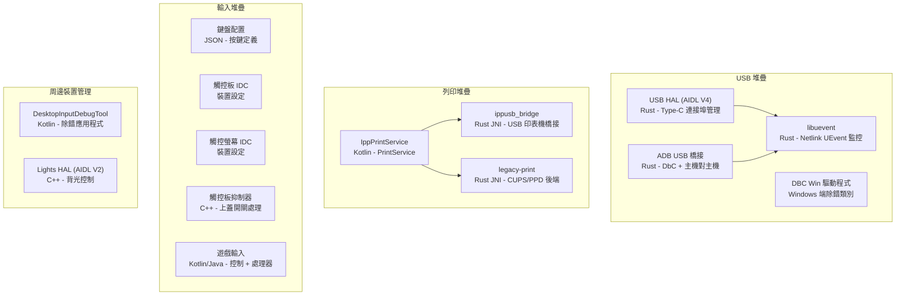
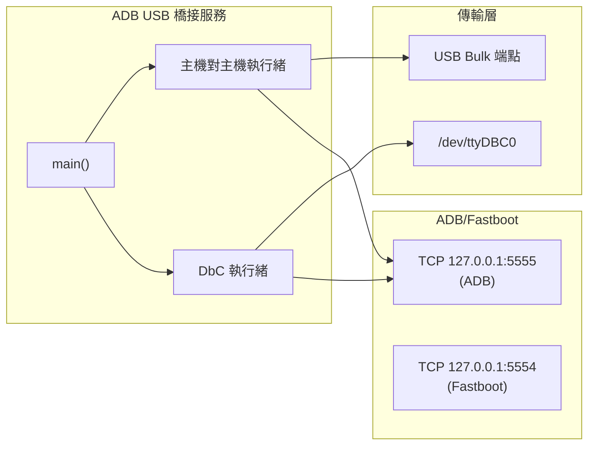
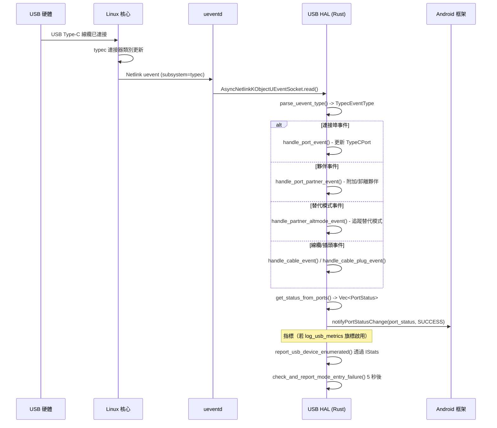
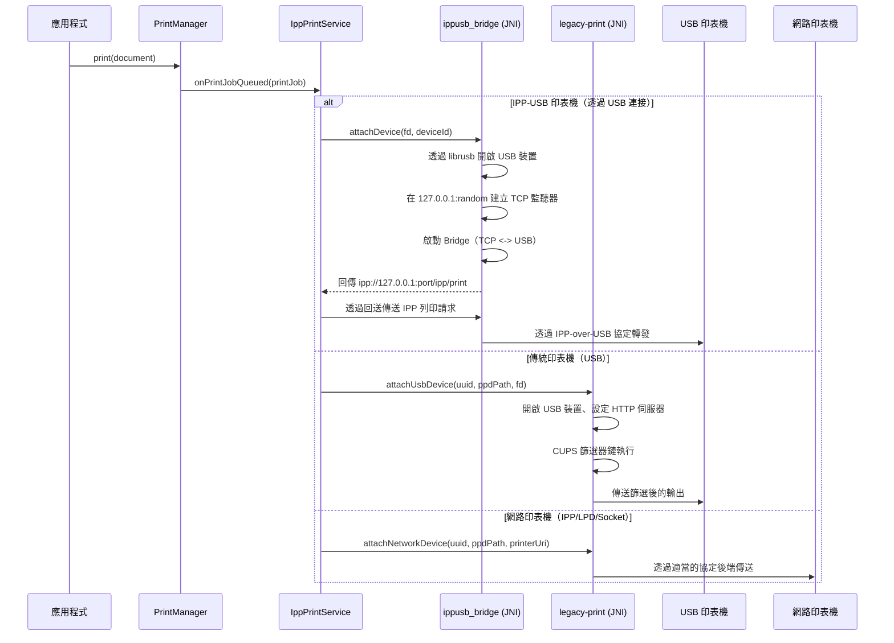
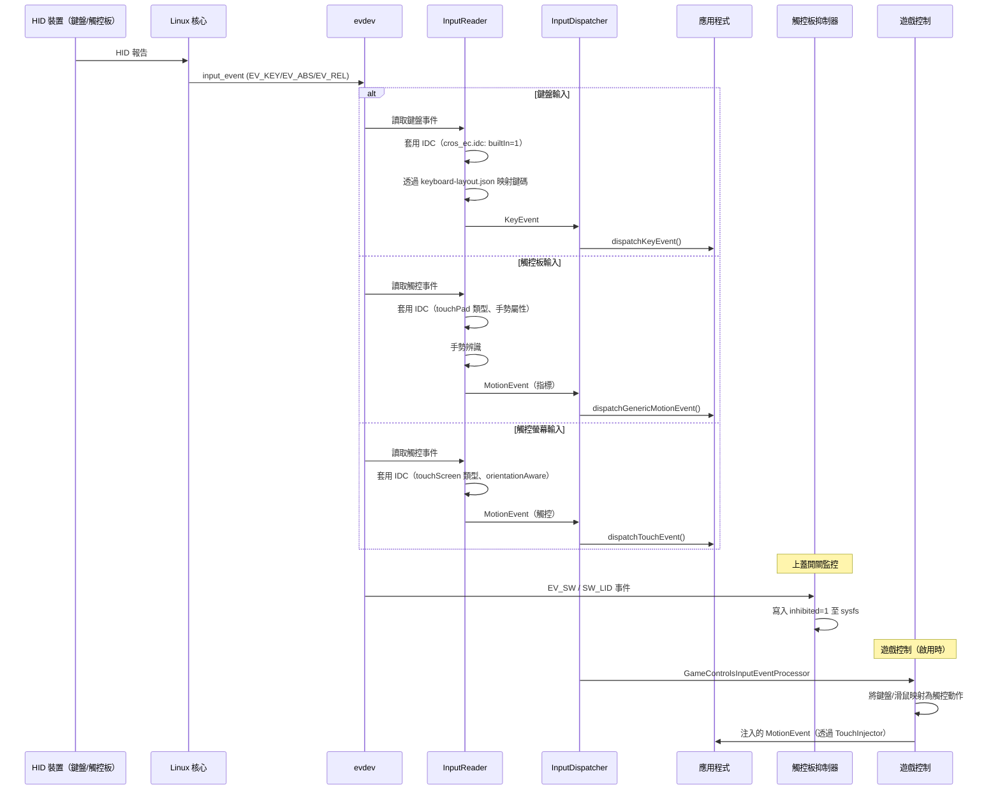
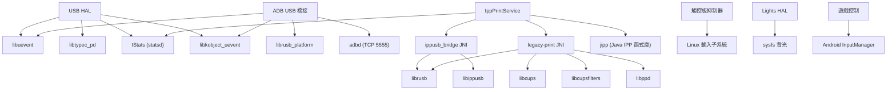

# USB、周邊裝置、輸入與列印實作

## 1. 架構概觀

Android 桌面平台提供全面的 USB 連線、周邊輸入裝置及列印支援。與行動版 Android 不同，桌面平台主要以 USB 主機模式運作，需要鍵盤/觸控板作為主要輸入裝置，並提供功能完整的列印子系統，支援現代 IPP 及傳統印表機。



## 2. 關鍵元件

| 元件 | 語言 | 類型 | 位置 | 用途 |
|------|------|------|------|------|
| USB HAL | Rust | AIDL HAL 服務 | `vendor/google/desktop/usb/aidl_hal/` | Type-C 連接埠管理、角色切換 |
| ADB USB Bridge | Rust | 供應商二進位檔 | `vendor/google/desktop/usb/adb-usb-bridge/` | 透過 DbC 及主機對主機線纜的 ADB |
| libuevent | Rust | 函式庫 | `vendor/google/desktop/usb/libuevent/` | Netlink UEvent 通訊端抽象層 |
| DBC Win Driver | INF/ZIP | Windows 驅動程式 | `vendor/google/desktop/usb/dbc-win-driver/` | Windows 除錯類別橋接驅動程式 |
| IppPrintService | Kotlin | Android 應用程式 | `vendor/google/desktop/print/IppPrintService/` | 具備探索功能的 IPP 列印服務 |
| ippusb_bridge | Rust | JNI 函式庫 | `vendor/google/desktop/print/ippusb_bridge/` | USB 印表機 IPP 協定橋接 |
| legacy-print | Rust | JNI 函式庫 | `vendor/google/desktop/print/legacy-print/` | 基於 CUPS/PPD 的傳統印表機支援 |
| Touchpad Inhibitor | C++ | 供應商二進位檔 | `vendor/google/desktop/touchpad-inhibitor/` | 上蓋關閉時停用觸控板 |
| Keyboard Layout | JSON | 設定檔 | `device/google/desktop/common/keyboard/` | 實體鍵盤按鍵定義 |
| Gaming Controls | Kotlin | Android 應用程式 | `vendor/google/desktop/gaming/controls/` | 遊戲控制輸入處理器服務 |
| Input Processor | Java | 函式庫 | `vendor/google/desktop/gaming/inputprocessor/` | 遊戲輸入事件處理函式庫 |
| Lights HAL | C++ | AIDL HAL 服務 | `vendor/google/desktop/lights/hal/` | 背光亮度控制 |
| InputDebugTool | Kotlin | Android 應用程式 | `vendor/google/desktop/peripherals/DesktopInputDebugTool/` | 輸入事件除錯工具 |

## 3. USB HAL（AIDL 介面、連接埠管理）

### 概觀

桌面 USB HAL 實作 `android.hardware.usb` AIDL 介面第 4 版。完全以 Rust 撰寫，透過監控核心 uevent 來管理 USB Type-C 連接埠，並在記憶體中維護連接埠拓撲結構，包含夥伴裝置、線纜、插頭及替代模式。

### VINTF 宣告

取自 `android.hardware.usb-service.android-desktop.xml`：
```xml
<hal format="aidl">
    <name>android.hardware.usb</name>
    <version>4</version>
    <interface>
        <name>IUsb</name>
        <instance>default</instance>
    </interface>
</hal>
```

### 服務架構

服務以 `tokio` 多執行緒非同步執行環境運行，使用 2 個工作執行緒：

1. **Binder 執行緒池** - 處理來自 Android 框架的 AIDL 呼叫
2. **UEvent 處理器** - 監控核心 netlink 通訊端上 USB Type-C 事件的非同步任務

**二進位檔**：`android.hardware.usb-service.android-desktop`
**Init 服務**：`vendor.usb_default`（類別 `hal`，使用者 `system`，群組 `system`）

### 模組結構

| 原始檔 | 用途 |
|--------|------|
| `src/service.rs` | 進入點、tokio 執行環境設定、binder 註冊 |
| `src/usb.rs` | `DesktopUsbHal` 結構體、`IUsbAsyncServer` 實作 |
| `src/event_handler.rs` | Type-C、USB PD 及 USB 子系統的 UEvent 處理 |
| `src/sysfs_typec.rs` | Type-C 連接埠/夥伴/線纜/插頭/替代模式的 Sysfs 抽象層 |
| `src/typec_regex.rs` | 用於 uevent 分類的正規表示式解析器 |
| `src/metrics.rs` | USB 裝置列舉與模式進入的 Statsd 指標 |

### IUsbAsyncServer 實作

`ArcUsbHalWrapper` 新型別模式包裝 `Arc<DesktopUsbHal>`，以滿足 Rust 孤兒規則來實作 `IUsbAsyncServer`：

- **`setCallback`** - 註冊框架回呼及死亡接收器以進行清理
- **`queryPortStatus`** - 透過回呼回報所有 Type-C 連接埠狀態
- **`switchRole`** - 透過寫入 sysfs（`data_role`、`power_role`）切換電力/資料角色
- **`enableUsbData`** - 透過 sysfs `authorized` 屬性授權/取消授權 USB 裝置
- **`resetUsbPort`** - 先取消授權，延遲 1 秒後重新授權
- **`enableContaminantPresenceDetection`** - 回傳 `NOT_SUPPORTED`
- **`enableUsbDataWhileDocked`** - 回傳 `NOT_SUPPORTED`
- **`limitPowerTransfer`** - 回傳 `NOT_SUPPORTED`
- **`queryStaticPortInformation`** - 回傳 `NOT_SUPPORTED`

### Type-C 連接埠模型

記憶體內模型追蹤完整的 Type-C 拓撲結構：

```
TypeCPort
  +-- port_num, syspath, data_role, power_role, mode
  +-- usb_data_status (ENABLED / DISABLED_FORCE)
  +-- PortPartner (optional)
  |     +-- num_alt_modes, accessory_mode
  |     +-- identity (TypeCNodeIdentity)
  |     +-- alt_modes: HashMap<u32, AltMode>
  +-- Cable (optional)
        +-- identity (TypeCNodeIdentity)
        +-- Plug (optional)
              +-- num_alt_modes
              +-- alt_modes: HashMap<u32, AltMode>
```

替代模式 SVID 對應已知協定：
- `0xFF01` - DisplayPort
- `0xFF00` - USB4
- `0x8087` - Thunderbolt 3

### 功能旗標

定義於 `desktop_usb_hal_flags.aconfig`：
- **`log_usb_metrics`** - 控制是否從 HAL 記錄 USB 成功指標原子

### 建置定義

```
rust_binary {
    name: "android.hardware.usb-service.android-desktop",
    crate_root: "src/service.rs",
    rustlibs: [
        "android.hardware.usb-V4-rust",
        "libbinder_rs", "libbinder_tokio_rs",
        "libkobject_uevent", "libuevent",
        "libtypec_pd", "libregex", ...
    ],
    proprietary: true,
}
```

## 4. ADB USB 橋接（桌面專用 USB ADB）

### 概觀

ADB USB 橋接是桌面專用服務，透過兩種不同的傳輸機制啟用 USB 上的 ADB（及 fastboot）除錯，兩者皆不依賴傳統 Android USB gadget 模式：

1. **USB Debug Class Bridge (DbC)** - 使用 XHCI 除錯功能，透過標準 USB 線纜進行直接除錯
2. **USB 主機對主機** - 使用 Google 自訂主機對主機線纜（VID `0x18D1`，PID `0x506D` / `0x27A7`）

### 架構

服務在獨立執行緒中同時運行兩個橋接迴圈：



### 橋接抽象層

兩種傳輸方式皆實作 `BridgeReadable` 與 `BridgeWriteable` trait：

```rust
pub trait BridgeReadable {
    fn read_data(&mut self) -> Result<Vec<u8>>;
}

pub trait BridgeWriteable {
    fn write_data(&mut self, buffer: &[u8]) -> Result<()>;
    fn handle_partner_conn_close(&mut self) -> Result<()>;
}
```

`bridge_loop()` 函式使用 `Arc<AtomicBool>` 結束信號，從一端讀取並寫入另一端。

### DbC 傳輸

- 在 `/sys/devices/pci0000:00/` 下搜尋包含 `dbc` 控制檔的 XHCI PCI 路徑
- 將 DbC 供應商 ID 設定為 Google 的 VID（`0x18D1`）
- 透過 inotify 監控 `/dev/ttyDBC0` 的建立/刪除事件
- 以原始模式設定 tty（9600 baud、CS8、無同位檢查）
- 夥伴連線關閉時，停用再重新啟用 DbC 以模擬 USB 重新列舉
- 同時監控 Type-C uevent 子系統，將連接埠角色設為 `host` 以正確設定多工器

### 主機對主機傳輸

- 使用 `librusb` 進行 USB bulk 傳輸，搭配熱插拔回呼
- 偵測 Google 主機對主機線纜（VID `0x18D1`，PID `0x506D`、`0x27A7`）
- 從活躍的組態描述元中找到 bulk IN/OUT 端點
- 支援透過供應商控制請求（`0xF8`）重設線纜（韌體版本 > 1.0.0）
- 處理暫停/恢復並具重試邏輯（最多重試 10 次，間隔 20ms）

### Init 設定

正常模式（`adb-usb-bridge-service.rc`）：
```
service adb-usb-bridge /vendor/bin/adb-usb-bridge
    class core
    disabled
    user nobody
    group usb

on property:init.svc.adbd=running
    start adb-usb-bridge
```

復原模式新增 fastboot 橋接支援，由 `sys.usb.config=fastboot` 觸發。

### 功能旗標

定義於 `adb_over_usb_flags.aconfig`：
- **`enable_adb_over_dbc`** - 透過 USB 3.x A-to-C 線纜的 DbC ADB
- **`enable_adb_over_usb_pl27a1_dongle`** - 使用 PL27A1 晶片轉接器的 ADB
- **`enable_adb_over_dbc_c_to_c`** - 透過 USB 3.x C-to-C 線纜的 DbC ADB

## 5. Debug Class Bridge（開發用 DBC）

### 概觀

DBC（Debug Class Bridge）Windows 驅動程式套件可讓從 Windows 主機透過 USB 連接到 Android 桌面裝置進行 ADB 除錯。此套件以 `dbc_windows_driver_universal.zip` 形式發布，包含未簽署的 INF 檔供開發使用。

### 安裝方式

根據 README：
1. 下載並解壓縮驅動程式檔案
2. 在 Windows 上開啟裝置管理員
3. 動作 -> 新增驅動程式，瀏覽至解壓縮的資料夾
4. 連接 USB-A（Windows）至 USB-C（Android）線纜
5. 在 Android 裝置上啟用開發者模式及 USB 除錯

### 檔案

| 檔案 | 用途 |
|------|------|
| `dbc_windows_driver_universal.zip` | 已簽署的通用驅動程式套件 |
| `unsigned/dbc.inf` | 驅動程式安裝用 INF 檔 |
| `unsigned/dbc_universal.inf` | 通用 INF 檔變體 |

## 6. libuevent（UEvent 監控函式庫）

### 概觀

`libuevent` 是一個 Rust 函式庫，提供同步與非同步介面，透過 netlink 通訊端監控核心 uevent。供 USB HAL 及 ADB USB Bridge 使用。

### 通訊端設定

- 建立 `NETLINK_KOBJECT_UEVENT` 資料報通訊端
- 設定 `SOCK_NONBLOCK | SOCK_CLOEXEC` 旗標
- 設定 1 MB 接收緩衝區（`RcvBuf`）
- 啟用憑證傳遞（`PassCred`）
- 繫結至所有多播群組（`0xffffffff`）

### API

**同步**（`NetlinkKObjectUEventSocket`）：
- `create()` - 建立 netlink 通訊端
- `read()` - 在 `poll()` 上阻塞後讀取並解析 uevent

**非同步**（`AsyncNetlinkKObjectUEventSocket`）：
- `create()` - 建立以 tokio 的 `AsyncFd` 包裝的通訊端
- `read()` - 使用 tokio 的就緒通知進行非同步讀取

兩者皆使用 `kobject_uevent` crate 將原始 uevent 資料解析為包含子系統、動作、裝置路徑及環境變數的 `UEvent` 結構體。

## 7. IPP 列印服務（Internet Printing Protocol 應用程式）

### 概觀

`IppPrintService` 是實作 `android.printservice.PrintService` 的主要 Android 列印服務應用程式。透過 IPP（Internet Printing Protocol）在網路和 USB 連線上探索並與印表機通訊。

### 套件

- **套件名稱**：`com.android.desktop.printservice`
- **憑證**：`platform`
- **權限**：網路狀態、WiFi、網際網路、區域網路、回送介面

### 子服務

應用程式在不同程序中運行三個 Android 服務：

1. **IppPrintService**（主程序）- PrintService 實作、印表機探索
2. **IppUsbService**（`:ippusb` 程序）- 透過 JNI 橋接的 USB 印表機管理
3. **LegacyPrintService**（`:legacy` 程序）- 透過 CUPS/PPD 的傳統印表機支援

### 印表機探索

服務透過以下方式探索印表機：
- **mDNS/DNS-SD** - 使用 `_ipp._tcp` 與 `_ipps._tcp` 服務類型的網路印表機探索
- **USB Host** - 回應 `android.hardware.usb.action.USB_DEVICE_ATTACHED` intent 的裝置篩選

### JNI 相依性

```
jni_libs: [
    "libippusb_bridge_jni",   // IPP-USB 協定轉譯
    "liblegacy_print_jni",     // CUPS/PPD 傳統列印後端
]
```

### 必要系統元件

```
required: [
    "epson-escpr-wrapper",  // Epson ESC/P-R 篩選器
    "gs",                   // Ghostscript
    "hpcups",               // HP CUPS 篩選器
    "hpps",                 // HP PostScript 篩選器
]
```

### 功能旗標

定義於 `flags.aconfig`：
- **`add_missing_desktop_telemetry`** - 印表機探索和列印工作事件的統計記錄
- **`enable_legacy_print`** - 透過 CUPS/PPD 的傳統印表機支援
- **`update_ui_26q2`** - 裝訂及 PIN 列印的 UI 更新
- **`manually_add_printer`** - 手動輸入印表機 URI
- **`support_old_color_mode`** - 當 `print-color-mode` 缺失時回退至 `output-mode`
- **`enable_job_release_with_pin`** - 在印表機端以 PIN 保護的列印工作釋放

## 8. IPP-USB 橋接（USB 印表機協定轉譯）

### 概觀

`ippusb_bridge` 是一個 Rust JNI 共享函式庫（`libippusb_bridge_jni`），在 Android 列印框架與透過 USB 連接的印表機之間橋接 IPP 協定流量，使用 IPP-over-USB 協定（IEEE 1284.4/USB 類別 7、子類別 1、協定 4）。

### 架構

橋接器的運作方式：
1. 從 Java `IppUsbService` 接收 USB 檔案描述元
2. 透過 `librusb` 開啟 USB 裝置
3. 在隨機連接埠建立本地 TCP 監聽器（`127.0.0.1:0`）
4. 運行非同步 `Bridge` 在 TCP 和 USB 之間代理 HTTP/IPP
5. 將 `ipp://127.0.0.1:<port>/ipp/print` URI 回傳給列印服務

### JNI 進入點

| JNI 方法 | 用途 |
|----------|------|
| `startService` | 初始化全域 `BridgeManager` 單例 |
| `attachDevice` | 開啟 USB 裝置、啟動 IPP 橋接、回傳 URI |
| `detachDevice` | 停止特定裝置的橋接 |
| `parseIeee1284Id` | 解析 IEEE-1284 裝置 ID 以取得製造商/型號/序號 |
| `stopService` | 卸離所有裝置 |

### 裝置識別

`DeviceId` 結構體解析 IEEE-1284 裝置 ID 格式：
```
MFG:<manufacturer>;MDL:<model>;SN:<serial>;CMD:<pdl1>,<pdl2>;
```

裝置令牌格式為 `ippusb:<manufacturer>|<model>|<serial>`，用於去重。

### BridgeManager

`BridgeManager` 維護一個 `HashMap<String, OpenDevice>` 存放活躍的橋接，每個橋接在 tokio 多執行緒執行環境上運行。`OpenDevice` 持有 USB fd、關閉通道及非同步任務控制代碼。

## 9. 傳統列印支援

### 概觀

`legacy-print` 模組（`liblegacy_print_jni`）為需要 CUPS 篩選器和 PPD（PostScript Printer Description）檔案的傳統印表機提供列印支援。支援多種後端協定。

### 後端協定

函式庫包含以下後端：
- **IPP**（`print_backend_ipp.rs`）- IPP 協定後端
- **LPD**（`print_backend_lpd.rs`）- 行式印表機常駐程式協定
- **Socket**（`print_backend_socket.rs`）- 原始 TCP/IP 通訊端列印（連接埠 9100）
- **USB**（`print_backend_usb.rs`）- 直接 USB 列印

### CUPS 篩選器鏈

`cupslink` 模組提供：
- **篩選器鏈**（`filter_chain.rs`）- 循序篩選管線
- **篩選選項**（`filter_options.rs`）- CUPS 篩選選項處理
- **印表機屬性**（`printer_attributes.rs`）- IPP 印表機屬性查詢
- **媒體欄資料庫**（`media_col_database.rs`）- 媒體尺寸/類型資料庫
- **篩選器記錄**（`filter_log.rs` + C 程式碼）- 透過 libcupsfilters 的篩選器記錄

### JNI 進入點

| JNI 方法 | 用途 |
|----------|------|
| `startService` | 初始化 `DeviceManager` 單例 |
| `attachNetworkDevice` | 以 URI 及 PPD 路徑附加網路印表機 |
| `attachUsbDevice` | 以 fd 及 PPD 路徑附加 USB 印表機 |
| `detachDevice` | 停止對特定裝置的列印 |
| `stopService` | 卸離所有裝置 |

### 建置相依性

連結 `libcupsfilters`、`libcups`、`libppd` 以執行篩選器鏈，以及 `librusb` 以存取 USB 裝置。

## 10. 觸控板抑制器（上蓋關閉時停用觸控板）

### 概觀

觸控板抑制器是一個 C++ 供應商常駐程式，監控筆記型電腦上蓋開關，並在上蓋關閉時停用觸控板。這可防止在使用外接顯示器的掀蓋模式下意外觸發觸控板輸入。

### 運作方式

1. **裝置掃描** - 掃描 `/dev/input` 以尋找：
   - 上蓋開關裝置（名稱為 "Lid Switch" 或 "cros_ec_buttons"）
   - 觸控板裝置（名稱包含 "Touchpad"）
2. **事件迴圈** - 從上蓋開關裝置讀取 `input_event` 結構體
3. **抑制** - 在 `EV_SW`/`SW_LID` 事件時，寫入 `1`（抑制）或 `0`（啟用）至：
   ```
   /sys/class/input/<touchpad>/device/inhibited
   ```

### Init 設定

```
service touchpad-inhibitor /vendor/bin/hw/touchpad-inhibitor
    class core
    user system
    group input
```

## 11. 鍵盤配置（keyboard-layout.json、按鍵映射）

### 概觀

鍵盤配置系統定義桌面/筆記型電腦外形的內建 ChromeOS EC 鍵盤的實體按鍵位置與鍵碼。

### 檔案

| 檔案 | 用途 |
|------|------|
| `keyboard-layout.json` | 含位置與 SVG 形狀的實體按鍵定義 |
| `keyboard-layout.schema.json` | 用於驗證的 JSON schema |
| `cros_ec.idc` | 將鍵盤標記為內建的輸入裝置設定 |

### keyboard-layout.json 結構

```json
{
  "version": "1.0",
  "width": 1028,
  "height": 386,
  "keyboard_definitions": [{
    "locale": "en-US",
    "key_definitions": [
      { "x": 8, "y": 8, "keycode": 111, "shape_svg": "..." }
    ]
  }]
}
```

此配置定義了標準 ANSI 美式鍵盤，含 5 列 65 個以上的按鍵，包括：
- **第 1 列**：功能鍵（Escape、返回、前進、重新整理、全螢幕等）
- **第 2 列**：數字列與 Backspace
- **第 3 列**：Tab + QWERTY 列與反斜線
- **第 4 列**：Caps Lock + 主列與 Enter
- **第 5 列**：Shift + 底列
- **第 6 列**：Ctrl、Fn、Meta、Alt、空白鍵、Alt、Ctrl、方向鍵

### cros_ec.idc

```
keyboard.builtIn = 1
```

將 ChromeOS EC 鍵盤標記為內建鍵盤，確保框架正確處理內部與外部鍵盤的行為差異。

## 12. 觸控板/觸控螢幕設定（每裝置 IDC 檔案）

### 通用觸控板 IDC 檔案

**`Elan_Touchpad.idc`**（通用）：
```properties
device.internal = 1
touch.deviceType = touchPad
gestureProp.Tap_Minimum_Pressure = 10.0
gestureProp.Pressure_Calibration_Offset = 0.0
gestureProp.Pressure_Calibration_Slope = 3.1416
```

**`Vendor_36b6_Product_c001.idc`**（通用，PNP0C50:04 36B6:C001）：
- 以較低的 `Tap_Minimum_Pressure = 2.0` 增強觸碰點按靈敏度
- 自訂觸覺按鈕力量閾值
- 啟用平滑加速
- 啟用快速抬起偵測，`Liftoff_Speed_Factor = 8.0`
- 連續點按逾時 250ms

### Fatcat 專用觸控板 IDC

**`Vendor_093a_Product_0936.idc`**（fatcat）：
```properties
device.internal = 1
touch.deviceType = touchPad
gestureProp.Tap_Minimum_Pressure = 10.0
gestureProp.Pressure_Calibration_Offset = 0.0
gestureProp.Pressure_Calibration_Slope = 3.1416
```

### 觸控螢幕 IDC 檔案

通用與 fatcat 共享相同的 Elan 觸控螢幕設定：

**`quicki2c-hid_04F3_4211.idc`**：
```properties
device.internal = 1
touch.deviceType = touchScreen
touch.orientationAware = 1
```

`touch.orientationAware = 1` 屬性在顯示器旋轉時啟用座標轉換。

### IDC 檔案命名慣例

IDC 檔案由 Android 輸入框架使用以下命名模式進行匹配：
- `Vendor_XXXX_Product_YYYY.idc` - 依 USB VID/PID 匹配
- `<device_name>.idc` - 依 sysfs 中的裝置名稱匹配

## 13. 遊戲輸入（Controls、遊戲輸入 InputProcessor）

### GameControlsInputProcessorService

一個 Android 應用程式（`GameControlsInputProcessorService`），提供 AIDL 服務，將鍵盤/滑鼠輸入轉譯為觸控輸入，供在桌面上運行的行動遊戲使用。

**AIDL 介面**：
- `IGameControlsInputProcessorService` - 主服務介面
- `IInputProcessorServiceListener` - 回呼監聽器

**Parcelable 模型**：
- `ActionData` - 輸入動作描述元
- `ActionTypeEnum` - 動作類型分類
- `GamepadControlsKey` - 遊戲控制器按鍵映射
- `DesktopControlsKey` - 桌面鍵盤/滑鼠按鍵映射

**Proto 定義**：`active_game_controls_data.proto` 定義遊戲控制映射的序列化格式。

### GameControlsInputProcessorLib

一個 Java 函式庫（`GameControlsInputProcessorLib`），提供輸入事件處理引擎：

| 類別 | 用途 |
|------|------|
| `GameControlsInputEventProcessor` | 主要事件處理器 |
| `Action` | 基底動作類別 |
| `ActionTap` | 單次點按動作 |
| `ActionVirtualJoystick` | 虛擬搖桿模擬 |
| `TouchInjector` | 觸控事件注入 |
| `PointersManager` | 多點觸控指標追蹤 |
| `HardcodedGameControlsData` | 預設控制映射 |

此函式庫與 `com.android.desktop.inputeventcompatprocessor` 搭配使用，並以 Java（而非 Kotlin）建置，因為它必須作為 `PRODUCT_BOOT_JARS` 元件運行。

### 功能旗標

位於 `vendor/google/desktop/gaming/aconfig/`，旗標由 `com.google.android.gaming` 套件控制。

## 14. Lights HAL（鍵盤背光、LED 控制）

### 概觀

桌面 Lights HAL 以 C++ 實作 `android.hardware.light` AIDL 介面 V2。目前支援背光亮度控制，掃描多個 sysfs 路徑以找到活躍的背光裝置。

### 背光路徑

HAL 依序探測以下 sysfs 背光路徑：
1. `/sys/class/backlight/intel_backlight/`
2. `/sys/class/backlight/backlight/`
3. `/sys/class/backlight/backlight-lcd0/`
4. `/sys/class/backlight/dp_aux_backlight/`

### 類別階層

```
DesktopHwLight (抽象基底)
  |-- id, ordinal, type
  |-- getHwLight() -> HwLight
  |-- setLightState(HwLightState) = 0  [純虛擬]
  |
  +-- BackLight
        |-- max_brightness_ (來自 sysfs max_brightness)
        |-- brightness_path_ (sysfs brightness 檔案)
        |-- setLightState() -> 將 RGB 縮放為亮度
```

### 亮度計算

RGB 色彩使用標準亮度公式轉換為單一亮度值：
```
brightness = ((77 * R) + (150 * G) + (29 * B)) >> 8
scaled = brightness * max_brightness / 255
```

### Init 設定

```
service vendor.lights.android-desktop /vendor/bin/hw/android.hardware.lights-service.android-desktop
    interface aidl android.hardware.light.ILights/default
    class hal
    user system
    group system
```

## 15. 周邊裝置管理（DesktopInputDebugTool）

### 概觀

`DesktopInputDebugTool`（發布為 `InputDebugTool`）是一個具特權的平台簽署 Compose UI 應用程式，用於除錯和視覺化周邊裝置的輸入事件。

### 事件檢視器

| 檢視器 | 用途 |
|--------|------|
| `KeyboardEventViewer` | 顯示鍵盤按鍵事件 |
| `MouseEventViewer` | 顯示滑鼠移動和按鍵事件 |
| `TouchpadEventViewer` | 視覺化觸控板手勢和事件 |
| `TouchscreenEventViewer` | 顯示觸控螢幕接觸事件 |
| `MainPage` | 檢視器之間的導覽 |

### 建置

以平台憑證建置為具特權的系統應用程式：
```
android_app {
    name: "InputDebugTool",
    platform_apis: true,
    certificate: "platform",
    privileged: true,
    static_libs: [
        "androidx.compose.material3_material3",
        "androidx.navigation_navigation-compose",
        ...
    ],
}
```

## 16. 資料流程 - USB



## 17. 資料流程 - 列印



## 18. 資料流程 - 輸入



## 19. 設定

### 系統屬性

| 屬性 | 用途 | 使用者 |
|------|------|--------|
| `persist.vendor.adb_usb.log.level` | ADB 橋接記錄層級（DEBUG/INFO/WARN/ERROR） | adb-usb-bridge |
| `init.svc.adbd` | ADB 常駐程式狀態（觸發橋接啟動/停止） | adb-usb-bridge |
| `sys.usb.config` | 復原模式的 USB 設定（adb/fastboot/none） | adb-usb-bridge-recovery |

### Sysfs 路徑

| 路徑 | 用途 |
|------|------|
| `/sys/class/typec/` | Type-C 連接埠資訊 |
| `/sys/class/typec/port*/data_role` | 連接埠資料角色（host/device） |
| `/sys/class/typec/port*/power_role` | 連接埠電力角色（source/sink） |
| `/sys/class/typec/port*/port*-partner/` | 夥伴裝置資訊 |
| `/sys/class/backlight/*/brightness` | 背光亮度控制 |
| `/sys/class/backlight/*/max_brightness` | 最大亮度值 |
| `/sys/class/input/*/device/inhibited` | 輸入裝置抑制控制 |
| `/sys/class/input/*/device/name` | 輸入裝置名稱 |
| `/sys/devices/pci0000:00/*/dbc` | DbC 控制（啟用/停用） |
| `/sys/devices/pci0000:00/*/dbc_idVendor` | DbC 供應商 ID |
| `/dev/ttyDBC0` | DbC TTY 裝置 |

### IDC 檔案部署路徑

IDC 檔案安裝至裝置上的 `/vendor/usr/idc/`。Android 輸入框架會搜尋與裝置供應商/產品 ID 或名稱匹配的 IDC 檔案。

## 20. 建置整合

### 供應商分區二進位檔

| 模組 | 安裝路徑 |
|------|----------|
| `android.hardware.usb-service.android-desktop` | `/vendor/bin/hw/` |
| `android.hardware.lights-service.android-desktop` | `/vendor/bin/hw/` |
| `touchpad-inhibitor` | `/vendor/bin/hw/` |
| `adb-usb-bridge` | `/vendor/bin/` |

### 系統分區應用程式

| 模組 | 類型 |
|------|------|
| `IppPrintService` | 系統應用程式 |
| `GameControlsInputProcessorService` | 系統應用程式 |
| `InputDebugTool` | 具特權的系統應用程式 |

### 函式庫

| 模組 | 類型 | 分區 |
|------|------|------|
| `libuevent` | Rust 函式庫 | 供應商 |
| `libippusb_bridge_jni` | JNI 共享函式庫 | 系統 |
| `liblegacy_print_jni` | JNI 共享函式庫 | 系統 |
| `GameControlsInputProcessorLib` | Java 函式庫 | 系統 |

### 測試模組

| 測試模組 | 類型 |
|----------|------|
| `desktop_usb_hal_test` | Rust 單元測試 |
| `adb-usb-bridge_test` | Rust 主機測試 |
| `libippusb_bridge_test` | Rust 主機測試 |
| `IppPrintServiceRobolectricTest` | Robolectric 測試 |
| `IppPrintServiceHostTest` | Java 主機測試 |
| `GameControlsInputProcessorServiceTests` | Android 測試 |
| `GameControlsInputProcessorLibTests` | Android 測試 |

## 21. 跨子系統相依性



## 22. SEPolicy

### USB HAL（`hal_usb_impl.te`）

```
type hal_usb_impl, domain;
hal_server_domain(hal_usb_impl, hal_usb)
type hal_usb_impl_exec, exec_type, vendor_file_type, file_type;
init_daemon_domain(hal_usb_impl)

# 存取 IStats 以取得指標
allow hal_usb_impl fwk_stats_service:service_manager find;
```

### ADB USB Bridge（`adb_usb_bridge.te`）

```
type adb_usb_bridge, domain;
type adb_usb_bridge_exec, vendor_file_type, exec_type, file_type;
init_daemon_domain(adb_usb_bridge)

# 用於監控的 Netlink uevent 通訊端
allow adb_usb_bridge self:netlink_kobject_uevent_socket { create read bind setopt };

# 用於 ADB 常駐程式通訊的 TCP 通訊端
allow adb_usb_bridge self:tcp_socket { read write create connect getopt setopt };
allow adb_usb_bridge port:tcp_socket name_connect;

# USB 和 Type-C 的 Sysfs 存取
allow adb_usb_bridge sysfs:file { open read getattr };
allow adb_usb_bridge sysfs_usb:file { open read getattr };
allow adb_usb_bridge usb_device:chr_file { open read write ioctl };
allow adb_usb_bridge usb_device:dir { open read search };

# DbC 裝置存取
allow adb_usb_bridge dbc_device:chr_file { open read write getattr ioctl };

# Type-C 角色切換和 PCI DbC 控制
allow adb_usb_bridge sysfs_typec_usb_role:file { open read write setattr getattr };
allow adb_usb_bridge sysfs_pci_dbc_setting:file { open read write getattr };

# 用於 /dev 監控的 inotify
allow adb_usb_bridge device:dir { open read watch };
```

### 觸控板抑制器（`touchpad_inhibitor.te`）

```
type touchpad_inhibitor, domain;
type touchpad_inhibitor_exec, exec_type, vendor_file_type, file_type;
init_daemon_domain(touchpad_inhibitor)

# 讀取輸入裝置
allow touchpad_inhibitor input_device:dir r_dir_perms;
allow touchpad_inhibitor input_device:chr_file r_file_perms;

# 寫入 sysfs 的 inhibited 屬性
allow touchpad_inhibitor sysfs:file { getattr open read write };
```

### Lights HAL（`hal_light_default.te`）

```
# GPU sysfs 存取以控制背光
allow hal_light_default sysfs_gpu:dir { search open read };
```

## 23. 關鍵檔案參考

| 檔案 | 絕對路徑 |
|------|----------|
| USB HAL Android.bp | `vendor/google/desktop/usb/aidl_hal/Android.bp` |
| USB HAL service.rs | `vendor/google/desktop/usb/aidl_hal/src/service.rs` |
| USB HAL usb.rs | `vendor/google/desktop/usb/aidl_hal/src/usb.rs` |
| USB HAL event_handler.rs | `vendor/google/desktop/usb/aidl_hal/src/event_handler.rs` |
| USB HAL sysfs_typec.rs | `vendor/google/desktop/usb/aidl_hal/src/sysfs_typec.rs` |
| USB HAL typec_regex.rs | `vendor/google/desktop/usb/aidl_hal/src/typec_regex.rs` |
| USB HAL metrics.rs | `vendor/google/desktop/usb/aidl_hal/src/metrics.rs` |
| USB HAL VINTF | `vendor/google/desktop/usb/aidl_hal/android.hardware.usb-service.android-desktop.xml` |
| USB HAL init.rc | `vendor/google/desktop/usb/aidl_hal/android.hardware.usb-service.android-desktop.rc` |
| USB HAL 旗標 | `vendor/google/desktop/usb/aidl_hal/aconfig/desktop_usb_hal_flags.aconfig` |
| ADB Bridge Android.bp | `vendor/google/desktop/usb/adb-usb-bridge/Android.bp` |
| ADB Bridge main.rs | `vendor/google/desktop/usb/adb-usb-bridge/src/main.rs` |
| ADB Bridge bridge.rs | `vendor/google/desktop/usb/adb-usb-bridge/src/bridge.rs` |
| ADB Bridge usb_dbc.rs | `vendor/google/desktop/usb/adb-usb-bridge/src/usb_dbc.rs` |
| ADB Bridge usb_host_to_host.rs | `vendor/google/desktop/usb/adb-usb-bridge/src/usb_host_to_host.rs` |
| ADB Bridge adb_socket.rs | `vendor/google/desktop/usb/adb-usb-bridge/src/adb_socket.rs` |
| ADB Bridge fastboot_socket.rs | `vendor/google/desktop/usb/adb-usb-bridge/src/fastboot_socket.rs` |
| ADB Bridge 旗標 | `vendor/google/desktop/usb/adb-usb-bridge/flags/adb_over_usb_flags.aconfig` |
| ADB Bridge init.rc | `vendor/google/desktop/usb/adb-usb-bridge/adb-usb-bridge-service.rc` |
| ADB Bridge recovery.rc | `vendor/google/desktop/usb/adb-usb-bridge/adb-usb-bridge-service-recovery.rc` |
| DBC Win Driver README | `vendor/google/desktop/usb/dbc-win-driver/README` |
| libuevent Android.bp | `vendor/google/desktop/usb/libuevent/Android.bp` |
| libuevent lib.rs | `vendor/google/desktop/usb/libuevent/src/lib.rs` |
| libuevent netlink.rs | `vendor/google/desktop/usb/libuevent/src/netlink.rs` |
| IppPrintService Android.bp | `vendor/google/desktop/print/IppPrintService/Android.bp` |
| IppPrintService Manifest | `vendor/google/desktop/print/IppPrintService/AndroidManifest.xml` |
| ippusb_bridge Android.bp | `vendor/google/desktop/print/ippusb_bridge/Android.bp` |
| ippusb_bridge lib.rs | `vendor/google/desktop/print/ippusb_bridge/src/lib.rs` |
| ippusb_bridge manager.rs | `vendor/google/desktop/print/ippusb_bridge/src/manager.rs` |
| ippusb_bridge device.rs | `vendor/google/desktop/print/ippusb_bridge/src/device.rs` |
| legacy-print Android.bp | `vendor/google/desktop/print/legacy-print/Android.bp` |
| legacy-print lib.rs | `vendor/google/desktop/print/legacy-print/src/lib.rs` |
| 列印旗標 | `vendor/google/desktop/print/flags/flags.aconfig` |
| Touchpad Inhibitor Android.bp | `vendor/google/desktop/touchpad-inhibitor/Android.bp` |
| Touchpad Inhibitor cpp | `vendor/google/desktop/touchpad-inhibitor/touchpad-inhibitor.cpp` |
| Touchpad Inhibitor init.rc | `vendor/google/desktop/touchpad-inhibitor/touchpad-inhibitor-service.rc` |
| 鍵盤配置 JSON | `device/google/desktop/common/keyboard/keyboard-layout.json` |
| 鍵盤配置 Schema | `device/google/desktop/common/keyboard/keyboard-layout.schema.json` |
| CrOS EC 鍵盤 IDC | `device/google/desktop/common/keyboard/cros_ec.idc` |
| 通用 Elan 觸控板 IDC | `device/google/desktop/common/touchpad/Elan_Touchpad.idc` |
| 通用 36B6:C001 觸控板 IDC | `device/google/desktop/common/touchpad/Vendor_36b6_Product_c001.idc` |
| 通用觸控螢幕 IDC | `device/google/desktop/common/touchscreen/quicki2c-hid_04F3_4211.idc` |
| Fatcat 觸控板 IDC | `device/google/desktop/fatcat/touchpad/Vendor_093a_Product_0936.idc` |
| Fatcat 觸控螢幕 IDC | `device/google/desktop/fatcat/touchscreen/quicki2c-hid_04F3_4211.idc` |
| Gaming Controls Android.bp | `vendor/google/desktop/gaming/controls/Android.bp` |
| Gaming InputProcessor Android.bp | `vendor/google/desktop/gaming/inputprocessor/Android.bp` |
| Lights HAL Android.bp | `vendor/google/desktop/lights/hal/src/Android.bp` |
| Lights HAL DesktopLights.cpp | `vendor/google/desktop/lights/hal/src/DesktopLights.cpp` |
| Lights HAL BackLight.cpp | `vendor/google/desktop/lights/hal/src/BackLight.cpp` |
| Lights HAL init.rc | `vendor/google/desktop/lights/hal/init/android.hardware.lights-service.android-desktop.rc` |
| InputDebugTool Android.bp | `vendor/google/desktop/peripherals/DesktopInputDebugTool/Android.bp` |
| SEPolicy USB HAL | `device/google/desktop/common/sepolicy/hal_usb_impl.te` |
| SEPolicy ADB Bridge | `device/google/desktop/common/sepolicy/adb_usb_bridge.te` |
| SEPolicy Lights HAL | `device/google/desktop/common/sepolicy/hal_light_default.te` |
| SEPolicy 觸控板抑制器 | `device/google/desktop/common/sepolicy/touchpad_inhibitor.te` |
