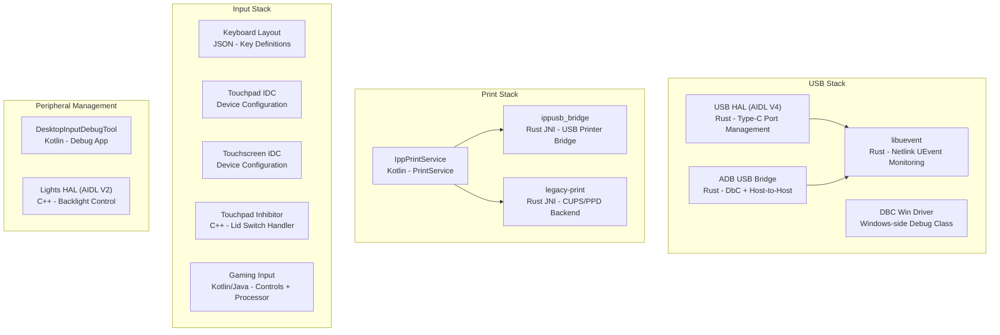
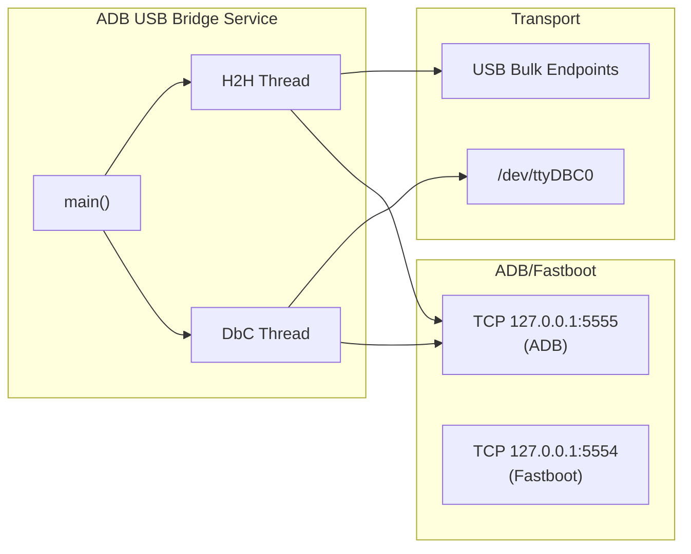
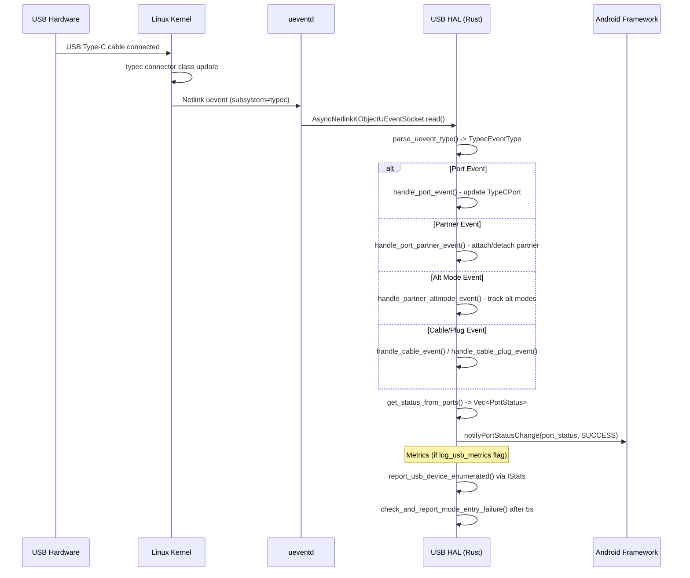
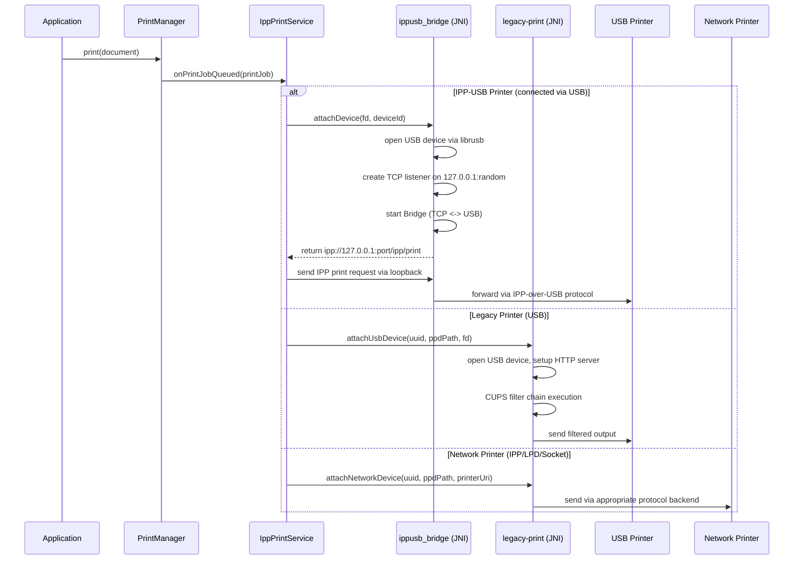
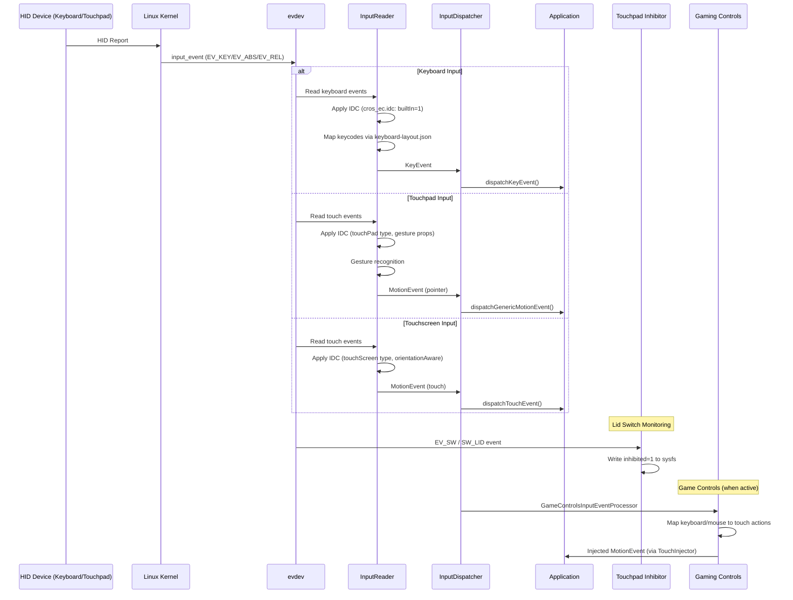
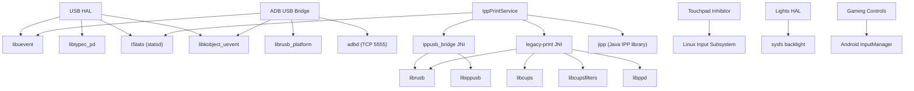

# USB, Peripherals, Input, and Print Implementation

## 1. Architecture Overview

The Android Desktop Platform provides comprehensive support for USB connectivity, peripheral input devices, and printing. Unlike mobile Android, the desktop platform operates primarily in USB host mode, requires keyboard/touchpad as primary input, and provides a full-featured print subsystem supporting both modern IPP and legacy printers.



## 2. Key Components

| Component | Language | Type | Location | Purpose |
|-----------|----------|------|----------|---------|
| USB HAL | Rust | AIDL HAL Service | `vendor/google/desktop/usb/aidl_hal/` | Type-C port management, role switching |
| ADB USB Bridge | Rust | Vendor Binary | `vendor/google/desktop/usb/adb-usb-bridge/` | ADB over DbC and Host-to-Host cables |
| libuevent | Rust | Library | `vendor/google/desktop/usb/libuevent/` | Netlink UEvent socket abstraction |
| DBC Win Driver | INF/ZIP | Windows Driver | `vendor/google/desktop/usb/dbc-win-driver/` | Windows Debug Class Bridge driver |
| IppPrintService | Kotlin | Android App | `vendor/google/desktop/print/IppPrintService/` | IPP print service with discovery |
| ippusb_bridge | Rust | JNI Library | `vendor/google/desktop/print/ippusb_bridge/` | USB printer IPP protocol bridge |
| legacy-print | Rust | JNI Library | `vendor/google/desktop/print/legacy-print/` | CUPS/PPD-based legacy printer support |
| Touchpad Inhibitor | C++ | Vendor Binary | `vendor/google/desktop/touchpad-inhibitor/` | Disable touchpad on lid close |
| Keyboard Layout | JSON | Config | `device/google/desktop/common/keyboard/` | Physical keyboard key definitions |
| Gaming Controls | Kotlin | Android App | `vendor/google/desktop/gaming/controls/` | Game controls input processor service |
| Input Processor | Java | Library | `vendor/google/desktop/gaming/inputprocessor/` | Game input event processing library |
| Lights HAL | C++ | AIDL HAL Service | `vendor/google/desktop/lights/hal/` | Backlight brightness control |
| InputDebugTool | Kotlin | Android App | `vendor/google/desktop/peripherals/DesktopInputDebugTool/` | Input event debugging tool |

## 3. USB HAL (AIDL Interface, Port Management)

### Overview

The Desktop USB HAL implements the `android.hardware.usb` AIDL interface version 4. Written entirely in Rust, it manages USB Type-C ports by monitoring kernel uevents and maintaining an in-memory representation of port topology including partners, cables, plugs, and alternate modes.

### VINTF Declaration

From `android.hardware.usb-service.android-desktop.xml`:
```xml
<hal format="aidl">
    <name>android.hardware.usb</name>
    <version>4</version>
    <interface>
        <name>IUsb</name>
        <instance>default</instance>
    </interface>
</hal>
```

### Service Architecture

The service runs as a `tokio` multi-threaded async runtime with 2 worker threads:

1. **Binder Thread Pool** - Handles incoming AIDL calls from the Android framework
2. **UEvent Handler** - Async task monitoring kernel netlink socket for USB Type-C events

**Binary**: `android.hardware.usb-service.android-desktop`
**Init service**: `vendor.usb_default` (class `hal`, user `system`, group `system`)

### Module Structure

| Source File | Purpose |
|-------------|---------|
| `src/service.rs` | Entry point, tokio runtime setup, binder registration |
| `src/usb.rs` | `DesktopUsbHal` struct, `IUsbAsyncServer` implementation |
| `src/event_handler.rs` | UEvent handling for Type-C, USB PD, and USB subsystems |
| `src/sysfs_typec.rs` | Sysfs abstraction for Type-C port/partner/cable/plug/altmode |
| `src/typec_regex.rs` | Regex parsers for uevent classification |
| `src/metrics.rs` | Statsd metrics for USB device enumeration and mode entry |

### IUsbAsyncServer Implementation

The `ArcUsbHalWrapper` newtype pattern wraps `Arc<DesktopUsbHal>` to satisfy Rust's orphan rule when implementing `IUsbAsyncServer`:

- **`setCallback`** - Registers framework callback with death recipient for cleanup
- **`queryPortStatus`** - Reports all Type-C port status via callback
- **`switchRole`** - Switches power/data role by writing to sysfs (`data_role`, `power_role`)
- **`enableUsbData`** - Authorizes/deauthorizes USB devices via sysfs `authorized` attribute
- **`resetUsbPort`** - De-authorizes then re-authorizes after 1-second delay
- **`enableContaminantPresenceDetection`** - Returns `NOT_SUPPORTED`
- **`enableUsbDataWhileDocked`** - Returns `NOT_SUPPORTED`
- **`limitPowerTransfer`** - Returns `NOT_SUPPORTED`
- **`queryStaticPortInformation`** - Returns `NOT_SUPPORTED`

### Type-C Port Model

The in-memory model tracks the complete Type-C topology:

```
TypeCPort
  +-- port_num, syspath, data_role, power_role, mode
  +-- usb_data_status (ENABLED / DISABLED_FORCE)
  +-- PortPartner (optional)
  |     +-- num_alt_modes, accessory_mode
  |     +-- identity (TypeCNodeIdentity)
  |     +-- alt_modes: HashMap<u32, AltMode>
  +-- Cable (optional)
        +-- identity (TypeCNodeIdentity)
        +-- Plug (optional)
              +-- num_alt_modes
              +-- alt_modes: HashMap<u32, AltMode>
```

Alt mode SVIDs map to known protocols:
- `0xFF01` - DisplayPort
- `0xFF00` - USB4
- `0x8087` - Thunderbolt 3

### Feature Flags

Defined in `desktop_usb_hal_flags.aconfig`:
- **`log_usb_metrics`** - Controls whether USB success metric atoms are logged from the HAL

### Build Definition

```
rust_binary {
    name: "android.hardware.usb-service.android-desktop",
    crate_root: "src/service.rs",
    rustlibs: [
        "android.hardware.usb-V4-rust",
        "libbinder_rs", "libbinder_tokio_rs",
        "libkobject_uevent", "libuevent",
        "libtypec_pd", "libregex", ...
    ],
    proprietary: true,
}
```

## 4. ADB USB Bridge (Desktop-Specific ADB over USB)

### Overview

The ADB USB Bridge is a desktop-specific service that enables ADB (and fastboot) debugging over USB using two distinct transport mechanisms, neither of which relies on the traditional Android USB gadget mode:

1. **USB Debug Class Bridge (DbC)** - Uses XHCI Debug Capability for direct debugging over standard USB cables
2. **USB Host-to-Host** - Uses a custom Google host-to-host cable (VID `0x18D1`, PIDs `0x506D` / `0x27A7`)

### Architecture

The service runs two concurrent bridge loops in separate threads:



### Bridge Abstraction

Both transports implement the `BridgeReadable` and `BridgeWriteable` traits:

```rust
pub trait BridgeReadable {
    fn read_data(&mut self) -> Result<Vec<u8>>;
}

pub trait BridgeWriteable {
    fn write_data(&mut self, buffer: &[u8]) -> Result<()>;
    fn handle_partner_conn_close(&mut self) -> Result<()>;
}
```

The `bridge_loop()` function reads from one side and writes to the other using an `Arc<AtomicBool>` exit signal.

### DbC Transport

- Searches for XHCI PCI paths under `/sys/devices/pci0000:00/` that contain a `dbc` control file
- Sets the DbC vendor ID to Google's VID (`0x18D1`)
- Monitors `/dev/ttyDBC0` via inotify for creation/deletion events
- Configures the tty with raw mode settings (9600 baud, CS8, no parity)
- On partner connection close, disables then re-enables DbC to simulate USB re-enumeration
- Also monitors Type-C uevent subsystem to set port role to `host` for proper mux configuration

### Host-to-Host Transport

- Uses `librusb` for USB bulk transfers with hotplug callbacks
- Detects Google host-to-host cable (VID `0x18D1`, PIDs `0x506D`, `0x27A7`)
- Finds bulk IN/OUT endpoints from the active configuration descriptor
- Supports cable reset via vendor control request (`0xF8`) for firmware version > 1.0.0
- Handles suspend/resume with retry logic (up to 10 retries at 20ms intervals)

### Init Configuration

Normal mode (`adb-usb-bridge-service.rc`):
```
service adb-usb-bridge /vendor/bin/adb-usb-bridge
    class core
    disabled
    user nobody
    group usb

on property:init.svc.adbd=running
    start adb-usb-bridge
```

Recovery mode adds fastboot bridge support, triggered by `sys.usb.config=fastboot`.

### Feature Flags

Defined in `adb_over_usb_flags.aconfig`:
- **`enable_adb_over_dbc`** - ADB over DbC for USB 3.x A-to-C cables
- **`enable_adb_over_usb_pl27a1_dongle`** - ADB with PL27A1 chip dongles
- **`enable_adb_over_dbc_c_to_c`** - ADB over DbC for USB 3.x C-to-C cables

## 5. Debug Class Bridge (DBC for Development)

### Overview

The DBC (Debug Class Bridge) Windows driver package enables ADB debugging from a Windows host connected to an Android Desktop device via USB. This is packaged as `dbc_windows_driver_universal.zip` with unsigned INF files for development use.

### Installation

Per the README:
1. Download and unzip the driver file
2. Open Device Manager on Windows
3. Action -> Add drivers, navigate to the unzipped folder
4. Connect USB-A (Windows) to USB-C (Android) cable
5. Enable developer mode and USB debugging on the Android device

### Files

| File | Purpose |
|------|---------|
| `dbc_windows_driver_universal.zip` | Signed universal driver package |
| `unsigned/dbc.inf` | INF file for driver installation |
| `unsigned/dbc_universal.inf` | Universal INF file variant |

## 6. libuevent (UEvent Monitoring Library)

### Overview

`libuevent` is a Rust library providing both synchronous and asynchronous interfaces for monitoring kernel uevents via netlink sockets. It is used by the USB HAL and ADB USB Bridge.

### Socket Configuration

- Creates a `NETLINK_KOBJECT_UEVENT` datagram socket
- Sets `SOCK_NONBLOCK | SOCK_CLOEXEC` flags
- Configures 1 MB receive buffer (`RcvBuf`)
- Enables credential passing (`PassCred`)
- Binds to all multicast groups (`0xffffffff`)

### API

**Synchronous** (`NetlinkKObjectUEventSocket`):
- `create()` - Creates the netlink socket
- `read()` - Blocks on `poll()` then reads and parses a uevent

**Asynchronous** (`AsyncNetlinkKObjectUEventSocket`):
- `create()` - Creates socket wrapped in tokio's `AsyncFd`
- `read()` - Async read using tokio's readiness notification

Both parse raw uevent data using the `kobject_uevent` crate into `UEvent` structs containing subsystem, action, devpath, and environment variables.

## 7. IPP Print Service (Internet Printing Protocol App)

### Overview

`IppPrintService` is the main Android print service application implementing `android.printservice.PrintService`. It discovers and communicates with printers via IPP (Internet Printing Protocol) over both network and USB connections.

### Package

- **Package name**: `com.android.desktop.printservice`
- **Certificate**: `platform`
- **Permissions**: Network state, WiFi, Internet, local network, loopback interface

### Sub-Services

The application runs three Android services in separate processes:

1. **IppPrintService** (main process) - PrintService implementation, printer discovery
2. **IppUsbService** (`:ippusb` process) - USB printer management via JNI bridge
3. **LegacyPrintService** (`:legacy` process) - Legacy printer support via CUPS/PPD

### Printer Discovery

The service discovers printers via:
- **mDNS/DNS-SD** - Network printer discovery using `_ipp._tcp` and `_ipps._tcp` service types
- **USB Host** - Responds to `android.hardware.usb.action.USB_DEVICE_ATTACHED` intent with device filter

### JNI Dependencies

```
jni_libs: [
    "libippusb_bridge_jni",   // IPP-USB protocol translation
    "liblegacy_print_jni",     // CUPS/PPD legacy print backends
]
```

### Required System Components

```
required: [
    "epson-escpr-wrapper",  // Epson ESC/P-R filter
    "gs",                   // Ghostscript
    "hpcups",               // HP CUPS filter
    "hpps",                 // HP PostScript filter
]
```

### Feature Flags

Defined in `flags.aconfig`:
- **`add_missing_desktop_telemetry`** - Stats logging for printer discovery and job events
- **`enable_legacy_print`** - Legacy printer support via CUPS/PPD
- **`update_ui_26q2`** - UI updates for finishings and PIN printing
- **`manually_add_printer`** - Manual printer URI entry
- **`support_old_color_mode`** - Fallback to `output-mode` when `print-color-mode` is missing
- **`enable_job_release_with_pin`** - PIN-protected job release at printer

## 8. IPP-USB Bridge (USB Printer Protocol Translation)

### Overview

The `ippusb_bridge` is a Rust JNI shared library (`libippusb_bridge_jni`) that bridges IPP protocol traffic between the Android print framework and USB-connected printers using the IPP-over-USB protocol (IEEE 1284.4/USB class 7, subclass 1, protocol 4).

### Architecture

The bridge operates by:
1. Accepting a USB file descriptor from the Java `IppUsbService`
2. Opening the USB device via `librusb`
3. Creating a local TCP listener on a random port (`127.0.0.1:0`)
4. Running an async `Bridge` that proxies HTTP/IPP between TCP and USB
5. Returning the `ipp://127.0.0.1:<port>/ipp/print` URI to the print service

### JNI Entry Points

| JNI Method | Purpose |
|-----------|---------|
| `startService` | Initializes the global `BridgeManager` singleton |
| `attachDevice` | Opens USB device, starts IPP bridge, returns URI |
| `detachDevice` | Stops the bridge for a specific device |
| `parseIeee1284Id` | Parses IEEE-1284 device ID for manufacturer/model/serial |
| `stopService` | Detaches all devices |

### Device Identification

The `DeviceId` struct parses IEEE-1284 device ID format:
```
MFG:<manufacturer>;MDL:<model>;SN:<serial>;CMD:<pdl1>,<pdl2>;
```

Device tokens are formatted as `ippusb:<manufacturer>|<model>|<serial>` for deduplication.

### BridgeManager

The `BridgeManager` maintains a `HashMap<String, OpenDevice>` of active bridges, each running on a tokio multi-thread runtime. The `OpenDevice` holds the USB fd, shutdown channel, and async task handle.

## 9. Legacy Print Support

### Overview

The `legacy-print` module (`liblegacy_print_jni`) provides printing support for legacy printers that require CUPS filters and PPD (PostScript Printer Description) files. It supports multiple backend protocols.

### Backend Protocols

The library includes backends for:
- **IPP** (`print_backend_ipp.rs`) - IPP protocol backend
- **LPD** (`print_backend_lpd.rs`) - Line Printer Daemon protocol
- **Socket** (`print_backend_socket.rs`) - Raw TCP/IP socket printing (port 9100)
- **USB** (`print_backend_usb.rs`) - Direct USB printing

### CUPS Filter Chain

The `cupslink` module provides:
- **Filter Chain** (`filter_chain.rs`) - Sequential filter pipeline
- **Filter Options** (`filter_options.rs`) - CUPS filter option handling
- **Printer Attributes** (`printer_attributes.rs`) - IPP printer attribute queries
- **Media Col Database** (`media_col_database.rs`) - Media size/type database
- **Filter Log** (`filter_log.rs` + C code) - Filter logging via libcupsfilters

### JNI Entry Points

| JNI Method | Purpose |
|-----------|---------|
| `startService` | Initializes `DeviceManager` singleton |
| `attachNetworkDevice` | Attaches network printer with URI and PPD path |
| `attachUsbDevice` | Attaches USB printer with fd and PPD path |
| `detachDevice` | Stops printing to a specific device |
| `stopService` | Detaches all devices |

### Build Dependencies

Links against `libcupsfilters`, `libcups`, `libppd` for filter chain execution and `librusb` for USB device access.

## 10. Touchpad Inhibitor (Lid-Close Touchpad Disable)

### Overview

The touchpad inhibitor is a C++ vendor daemon that monitors the laptop lid switch and disables the touchpad when the lid is closed. This prevents accidental touchpad input when using the device in clamshell mode with an external display.

### Operation

1. **Device Scanning** - Scans `/dev/input` for:
   - Lid switch device (name "Lid Switch" or "cros_ec_buttons")
   - Touchpad device (name containing "Touchpad")
2. **Event Loop** - Reads `input_event` structs from the lid switch device
3. **Inhibition** - On `EV_SW`/`SW_LID` events, writes `1` (inhibit) or `0` (enable) to:
   ```
   /sys/class/input/<touchpad>/device/inhibited
   ```

### Init Configuration

```
service touchpad-inhibitor /vendor/bin/hw/touchpad-inhibitor
    class core
    user system
    group input
```

## 11. Keyboard Layout (keyboard-layout.json, Key Mappings)

### Overview

The keyboard layout system defines the physical key positions and keycodes for the built-in ChromeOS EC keyboard used on desktop/laptop form factors.

### Files

| File | Purpose |
|------|---------|
| `keyboard-layout.json` | Physical key definitions with positions and SVG shapes |
| `keyboard-layout.schema.json` | JSON schema for validation |
| `cros_ec.idc` | Input Device Configuration marking keyboard as built-in |

### keyboard-layout.json Structure

```json
{
  "version": "1.0",
  "width": 1028,
  "height": 386,
  "keyboard_definitions": [{
    "locale": "en-US",
    "key_definitions": [
      { "x": 8, "y": 8, "keycode": 111, "shape_svg": "..." }
    ]
  }]
}
```

The layout defines a standard ANSI US keyboard with 65+ keys across 5 rows, including:
- **Row 1**: Function keys (Escape, Back, Forward, Refresh, Fullscreen, etc.)
- **Row 2**: Number row with Backspace
- **Row 3**: Tab + QWERTY row with Backslash
- **Row 4**: Caps Lock + home row with Enter
- **Row 5**: Shift + bottom row
- **Row 6**: Ctrl, Fn, Meta, Alt, Space, Alt, Ctrl, arrows

### cros_ec.idc

```
keyboard.builtIn = 1
```

Marks the ChromeOS EC keyboard as a built-in keyboard, ensuring proper framework handling for internal vs. external keyboard behavior.

## 12. Touchpad/Touchscreen Configuration (IDC Files per Device)

### Common Touchpad IDC Files

**`Elan_Touchpad.idc`** (common):
```properties
device.internal = 1
touch.deviceType = touchPad
gestureProp.Tap_Minimum_Pressure = 10.0
gestureProp.Pressure_Calibration_Offset = 0.0
gestureProp.Pressure_Calibration_Slope = 3.1416
```

**`Vendor_36b6_Product_c001.idc`** (common, PNP0C50:04 36B6:C001):
- Enhanced tap-to-click responsiveness with lower `Tap_Minimum_Pressure = 2.0`
- Custom haptic button force thresholds
- Smooth acceleration enabled
- Fast liftoff detection with `Liftoff_Speed_Factor = 8.0`
- Inter-tap timeout of 250ms

### Fatcat-Specific Touchpad IDC

**`Vendor_093a_Product_0936.idc`** (fatcat):
```properties
device.internal = 1
touch.deviceType = touchPad
gestureProp.Tap_Minimum_Pressure = 10.0
gestureProp.Pressure_Calibration_Offset = 0.0
gestureProp.Pressure_Calibration_Slope = 3.1416
```

### Touchscreen IDC Files

Both common and fatcat share the same Elan touchscreen configuration:

**`quicki2c-hid_04F3_4211.idc`**:
```properties
device.internal = 1
touch.deviceType = touchScreen
touch.orientationAware = 1
```

The `touch.orientationAware = 1` property enables coordinate transformation when the display is rotated.

### IDC File Naming Convention

IDC files are matched by the Android input framework using the following naming patterns:
- `Vendor_XXXX_Product_YYYY.idc` - Matches by USB VID/PID
- `<device_name>.idc` - Matches by device name from sysfs

## 13. Gaming Input (Controls, InputProcessor for Game Input)

### GameControlsInputProcessorService

An Android application (`GameControlsInputProcessorService`) that provides an AIDL service for translating keyboard/mouse input into touch input for mobile games running on desktop.

**AIDL Interfaces**:
- `IGameControlsInputProcessorService` - Main service interface
- `IInputProcessorServiceListener` - Callback listener

**Parcelable Models**:
- `ActionData` - Input action descriptor
- `ActionTypeEnum` - Action type classification
- `GamepadControlsKey` - Gamepad key mapping
- `DesktopControlsKey` - Desktop keyboard/mouse key mapping

**Proto Definition**: `active_game_controls_data.proto` defines the serialized format for game control mappings.

### GameControlsInputProcessorLib

A Java library (`GameControlsInputProcessorLib`) providing the input event processing engine:

| Class | Purpose |
|-------|---------|
| `GameControlsInputEventProcessor` | Main event processor |
| `Action` | Base action class |
| `ActionTap` | Single tap action |
| `ActionVirtualJoystick` | Virtual joystick emulation |
| `TouchInjector` | Touch event injection |
| `PointersManager` | Multi-touch pointer tracking |
| `HardcodedGameControlsData` | Default control mappings |

The library works with `com.android.desktop.inputeventcompatprocessor` and is built as Java (not Kotlin) since it must work as a `PRODUCT_BOOT_JARS` component.

### Feature Flags

Located in `vendor/google/desktop/gaming/aconfig/`, flags controlled under the `com.google.android.gaming` package.

## 14. Lights HAL (Keyboard Backlight, LED Control)

### Overview

The Desktop Lights HAL implements `android.hardware.light` AIDL interface V2 in C++. It currently supports backlight brightness control, scanning multiple sysfs paths for the active backlight device.

### Backlight Paths

The HAL probes the following sysfs backlight paths in order:
1. `/sys/class/backlight/intel_backlight/`
2. `/sys/class/backlight/backlight/`
3. `/sys/class/backlight/backlight-lcd0/`
4. `/sys/class/backlight/dp_aux_backlight/`

### Class Hierarchy

```
DesktopHwLight (abstract base)
  |-- id, ordinal, type
  |-- getHwLight() -> HwLight
  |-- setLightState(HwLightState) = 0  [pure virtual]
  |
  +-- BackLight
        |-- max_brightness_ (from sysfs max_brightness)
        |-- brightness_path_ (sysfs brightness file)
        |-- setLightState() -> scales RGB to brightness
```

### Brightness Calculation

RGB color is converted to a single brightness value using the standard luminance formula:
```
brightness = ((77 * R) + (150 * G) + (29 * B)) >> 8
scaled = brightness * max_brightness / 255
```

### Init Configuration

```
service vendor.lights.android-desktop /vendor/bin/hw/android.hardware.lights-service.android-desktop
    interface aidl android.hardware.light.ILights/default
    class hal
    user system
    group system
```

## 15. Peripheral Management (DesktopInputDebugTool)

### Overview

`DesktopInputDebugTool` (published as `InputDebugTool`) is a privileged platform-signed Compose UI application for debugging and visualizing input events from peripherals.

### Event Viewers

| Viewer | Purpose |
|--------|---------|
| `KeyboardEventViewer` | Displays keyboard key events |
| `MouseEventViewer` | Shows mouse movement and button events |
| `TouchpadEventViewer` | Visualizes touchpad gestures and events |
| `TouchscreenEventViewer` | Displays touchscreen contact events |
| `MainPage` | Navigation between viewers |

### Build

Built as a privileged system app with platform certificate:
```
android_app {
    name: "InputDebugTool",
    platform_apis: true,
    certificate: "platform",
    privileged: true,
    static_libs: [
        "androidx.compose.material3_material3",
        "androidx.navigation_navigation-compose",
        ...
    ],
}
```

## 16. Data Flow - USB



## 17. Data Flow - Print



## 18. Data Flow - Input



## 19. Configuration

### System Properties

| Property | Purpose | Used By |
|----------|---------|---------|
| `persist.vendor.adb_usb.log.level` | ADB bridge log level (DEBUG/INFO/WARN/ERROR) | adb-usb-bridge |
| `init.svc.adbd` | ADB daemon state (triggers bridge start/stop) | adb-usb-bridge |
| `sys.usb.config` | USB config (adb/fastboot/none) for recovery | adb-usb-bridge-recovery |

### Sysfs Paths

| Path | Purpose |
|------|---------|
| `/sys/class/typec/` | Type-C port information |
| `/sys/class/typec/port*/data_role` | Port data role (host/device) |
| `/sys/class/typec/port*/power_role` | Port power role (source/sink) |
| `/sys/class/typec/port*/port*-partner/` | Partner device info |
| `/sys/class/backlight/*/brightness` | Backlight brightness control |
| `/sys/class/backlight/*/max_brightness` | Maximum brightness value |
| `/sys/class/input/*/device/inhibited` | Input device inhibit control |
| `/sys/class/input/*/device/name` | Input device name |
| `/sys/devices/pci0000:00/*/dbc` | DbC control (enable/disable) |
| `/sys/devices/pci0000:00/*/dbc_idVendor` | DbC vendor ID |
| `/dev/ttyDBC0` | DbC TTY device |

### IDC File Deployment Paths

IDC files are installed to `/vendor/usr/idc/` on the device. The Android input framework searches for IDC files matching the device's vendor/product ID or name.

## 20. Build Integration

### Vendor Partition Binaries

| Module | Install Path |
|--------|-------------|
| `android.hardware.usb-service.android-desktop` | `/vendor/bin/hw/` |
| `android.hardware.lights-service.android-desktop` | `/vendor/bin/hw/` |
| `touchpad-inhibitor` | `/vendor/bin/hw/` |
| `adb-usb-bridge` | `/vendor/bin/` |

### System Partition Apps

| Module | Type |
|--------|------|
| `IppPrintService` | System app |
| `GameControlsInputProcessorService` | System app |
| `InputDebugTool` | Privileged system app |

### Libraries

| Module | Type | Partition |
|--------|------|-----------|
| `libuevent` | Rust library | Vendor |
| `libippusb_bridge_jni` | JNI shared library | System |
| `liblegacy_print_jni` | JNI shared library | System |
| `GameControlsInputProcessorLib` | Java library | System |

### Test Modules

| Test Module | Type |
|------------|------|
| `desktop_usb_hal_test` | Rust unit test |
| `adb-usb-bridge_test` | Rust host test |
| `libippusb_bridge_test` | Rust host test |
| `IppPrintServiceRobolectricTest` | Robolectric test |
| `IppPrintServiceHostTest` | Java host test |
| `GameControlsInputProcessorServiceTests` | Android test |
| `GameControlsInputProcessorLibTests` | Android test |

## 21. Inter-Subsystem Dependencies



## 22. SEPolicy

### USB HAL (`hal_usb_impl.te`)

```
type hal_usb_impl, domain;
hal_server_domain(hal_usb_impl, hal_usb)
type hal_usb_impl_exec, exec_type, vendor_file_type, file_type;
init_daemon_domain(hal_usb_impl)

# Access IStats for metrics
allow hal_usb_impl fwk_stats_service:service_manager find;
```

### ADB USB Bridge (`adb_usb_bridge.te`)

```
type adb_usb_bridge, domain;
type adb_usb_bridge_exec, vendor_file_type, exec_type, file_type;
init_daemon_domain(adb_usb_bridge)

# Netlink uevent socket for monitoring
allow adb_usb_bridge self:netlink_kobject_uevent_socket { create read bind setopt };

# TCP socket for ADB daemon communication
allow adb_usb_bridge self:tcp_socket { read write create connect getopt setopt };
allow adb_usb_bridge port:tcp_socket name_connect;

# Sysfs access for USB and Type-C
allow adb_usb_bridge sysfs:file { open read getattr };
allow adb_usb_bridge sysfs_usb:file { open read getattr };
allow adb_usb_bridge usb_device:chr_file { open read write ioctl };
allow adb_usb_bridge usb_device:dir { open read search };

# DbC device access
allow adb_usb_bridge dbc_device:chr_file { open read write getattr ioctl };

# Type-C role switching and PCI DbC control
allow adb_usb_bridge sysfs_typec_usb_role:file { open read write setattr getattr };
allow adb_usb_bridge sysfs_pci_dbc_setting:file { open read write getattr };

# inotify for /dev monitoring
allow adb_usb_bridge device:dir { open read watch };
```

### Touchpad Inhibitor (`touchpad_inhibitor.te`)

```
type touchpad_inhibitor, domain;
type touchpad_inhibitor_exec, exec_type, vendor_file_type, file_type;
init_daemon_domain(touchpad_inhibitor)

# Read input devices
allow touchpad_inhibitor input_device:dir r_dir_perms;
allow touchpad_inhibitor input_device:chr_file r_file_perms;

# Write inhibited attribute to sysfs
allow touchpad_inhibitor sysfs:file { getattr open read write };
```

### Lights HAL (`hal_light_default.te`)

```
# GPU sysfs access for backlight
allow hal_light_default sysfs_gpu:dir { search open read };
```

## 23. Key Files Reference

| File | Absolute Path |
|------|--------------|
| USB HAL Android.bp | `vendor/google/desktop/usb/aidl_hal/Android.bp` |
| USB HAL service.rs | `vendor/google/desktop/usb/aidl_hal/src/service.rs` |
| USB HAL usb.rs | `vendor/google/desktop/usb/aidl_hal/src/usb.rs` |
| USB HAL event_handler.rs | `vendor/google/desktop/usb/aidl_hal/src/event_handler.rs` |
| USB HAL sysfs_typec.rs | `vendor/google/desktop/usb/aidl_hal/src/sysfs_typec.rs` |
| USB HAL typec_regex.rs | `vendor/google/desktop/usb/aidl_hal/src/typec_regex.rs` |
| USB HAL metrics.rs | `vendor/google/desktop/usb/aidl_hal/src/metrics.rs` |
| USB HAL VINTF | `vendor/google/desktop/usb/aidl_hal/android.hardware.usb-service.android-desktop.xml` |
| USB HAL init.rc | `vendor/google/desktop/usb/aidl_hal/android.hardware.usb-service.android-desktop.rc` |
| USB HAL flags | `vendor/google/desktop/usb/aidl_hal/aconfig/desktop_usb_hal_flags.aconfig` |
| ADB Bridge Android.bp | `vendor/google/desktop/usb/adb-usb-bridge/Android.bp` |
| ADB Bridge main.rs | `vendor/google/desktop/usb/adb-usb-bridge/src/main.rs` |
| ADB Bridge bridge.rs | `vendor/google/desktop/usb/adb-usb-bridge/src/bridge.rs` |
| ADB Bridge usb_dbc.rs | `vendor/google/desktop/usb/adb-usb-bridge/src/usb_dbc.rs` |
| ADB Bridge usb_host_to_host.rs | `vendor/google/desktop/usb/adb-usb-bridge/src/usb_host_to_host.rs` |
| ADB Bridge adb_socket.rs | `vendor/google/desktop/usb/adb-usb-bridge/src/adb_socket.rs` |
| ADB Bridge fastboot_socket.rs | `vendor/google/desktop/usb/adb-usb-bridge/src/fastboot_socket.rs` |
| ADB Bridge flags | `vendor/google/desktop/usb/adb-usb-bridge/flags/adb_over_usb_flags.aconfig` |
| ADB Bridge init.rc | `vendor/google/desktop/usb/adb-usb-bridge/adb-usb-bridge-service.rc` |
| ADB Bridge recovery.rc | `vendor/google/desktop/usb/adb-usb-bridge/adb-usb-bridge-service-recovery.rc` |
| DBC Win Driver README | `vendor/google/desktop/usb/dbc-win-driver/README` |
| libuevent Android.bp | `vendor/google/desktop/usb/libuevent/Android.bp` |
| libuevent lib.rs | `vendor/google/desktop/usb/libuevent/src/lib.rs` |
| libuevent netlink.rs | `vendor/google/desktop/usb/libuevent/src/netlink.rs` |
| IppPrintService Android.bp | `vendor/google/desktop/print/IppPrintService/Android.bp` |
| IppPrintService Manifest | `vendor/google/desktop/print/IppPrintService/AndroidManifest.xml` |
| ippusb_bridge Android.bp | `vendor/google/desktop/print/ippusb_bridge/Android.bp` |
| ippusb_bridge lib.rs | `vendor/google/desktop/print/ippusb_bridge/src/lib.rs` |
| ippusb_bridge manager.rs | `vendor/google/desktop/print/ippusb_bridge/src/manager.rs` |
| ippusb_bridge device.rs | `vendor/google/desktop/print/ippusb_bridge/src/device.rs` |
| legacy-print Android.bp | `vendor/google/desktop/print/legacy-print/Android.bp` |
| legacy-print lib.rs | `vendor/google/desktop/print/legacy-print/src/lib.rs` |
| Print flags | `vendor/google/desktop/print/flags/flags.aconfig` |
| Touchpad Inhibitor Android.bp | `vendor/google/desktop/touchpad-inhibitor/Android.bp` |
| Touchpad Inhibitor cpp | `vendor/google/desktop/touchpad-inhibitor/touchpad-inhibitor.cpp` |
| Touchpad Inhibitor init.rc | `vendor/google/desktop/touchpad-inhibitor/touchpad-inhibitor-service.rc` |
| Keyboard Layout JSON | `device/google/desktop/common/keyboard/keyboard-layout.json` |
| Keyboard Layout Schema | `device/google/desktop/common/keyboard/keyboard-layout.schema.json` |
| CrOS EC Keyboard IDC | `device/google/desktop/common/keyboard/cros_ec.idc` |
| Common Elan Touchpad IDC | `device/google/desktop/common/touchpad/Elan_Touchpad.idc` |
| Common 36B6:C001 Touchpad IDC | `device/google/desktop/common/touchpad/Vendor_36b6_Product_c001.idc` |
| Common Touchscreen IDC | `device/google/desktop/common/touchscreen/quicki2c-hid_04F3_4211.idc` |
| Fatcat Touchpad IDC | `device/google/desktop/fatcat/touchpad/Vendor_093a_Product_0936.idc` |
| Fatcat Touchscreen IDC | `device/google/desktop/fatcat/touchscreen/quicki2c-hid_04F3_4211.idc` |
| Gaming Controls Android.bp | `vendor/google/desktop/gaming/controls/Android.bp` |
| Gaming InputProcessor Android.bp | `vendor/google/desktop/gaming/inputprocessor/Android.bp` |
| Lights HAL Android.bp | `vendor/google/desktop/lights/hal/src/Android.bp` |
| Lights HAL DesktopLights.cpp | `vendor/google/desktop/lights/hal/src/DesktopLights.cpp` |
| Lights HAL BackLight.cpp | `vendor/google/desktop/lights/hal/src/BackLight.cpp` |
| Lights HAL init.rc | `vendor/google/desktop/lights/hal/init/android.hardware.lights-service.android-desktop.rc` |
| InputDebugTool Android.bp | `vendor/google/desktop/peripherals/DesktopInputDebugTool/Android.bp` |
| SEPolicy USB HAL | `device/google/desktop/common/sepolicy/hal_usb_impl.te` |
| SEPolicy ADB Bridge | `device/google/desktop/common/sepolicy/adb_usb_bridge.te` |
| SEPolicy Lights HAL | `device/google/desktop/common/sepolicy/hal_light_default.te` |
| SEPolicy Touchpad Inhibitor | `device/google/desktop/common/sepolicy/touchpad_inhibitor.te` |
