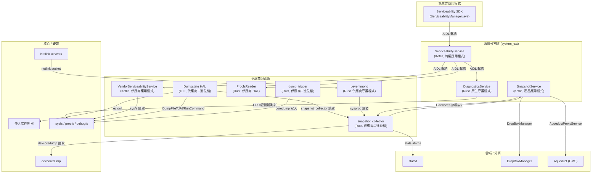
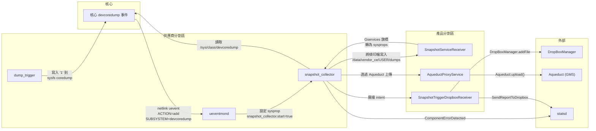
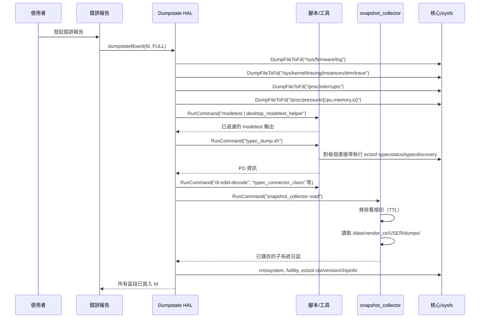
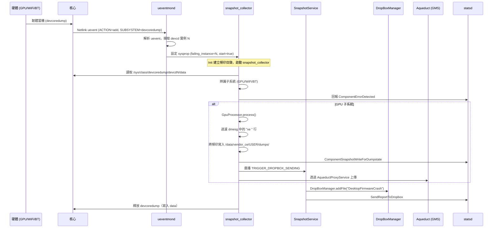
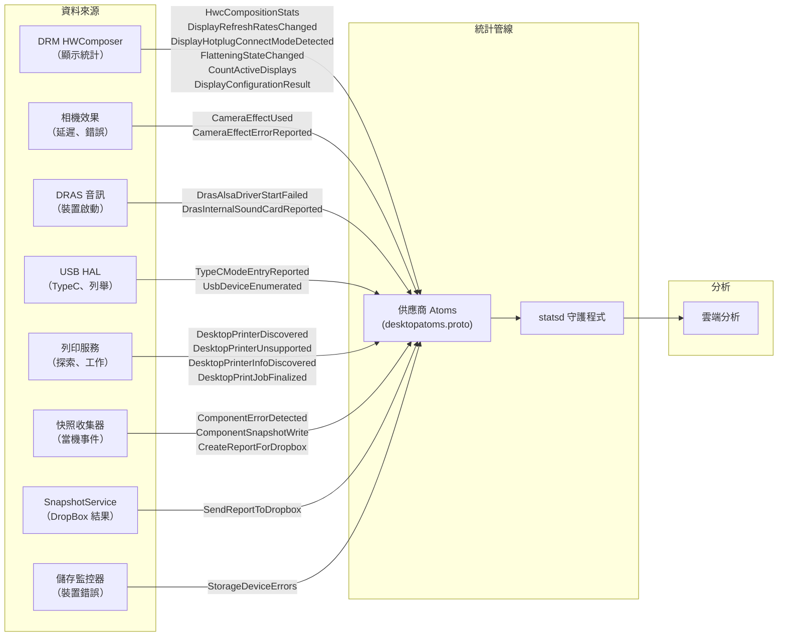
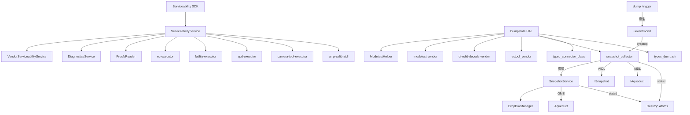

# 可服務性、診斷、Dumpstate、快照與統計資料實作

## 1. 架構概覽

Android 桌面平台實作了一個全面的可服務性與診斷子系統，橫跨多個層級——從硬體層級的傾印收集到雲端分析。此架構包含五大子系統：

1. **可服務性堆疊** —— 一個三層式 AIDL 服務架構，用於硬體診斷、元件檢查與維修操作
2. **Dumpstate HAL** —— 一個 AIDL HAL 實作，在錯誤報告期間收集桌面特定的硬體狀態
3. **快照子系統** —— 一個事件驅動的當機資料收集管線，監控核心 uevent、處理 devcoredump，並透過 DropBox 和 Aqueduct 發送當機報告
4. **Stats Atoms** —— 桌面特定的 statsd 供應商原子，用於遙測（顯示、音訊、USB、列印、快照、韌體）
5. **網路診斷** —— 用於網路連線測試與除錯的工具



## 2. 關鍵元件

| 元件 | 語言 | 位置 | 分割區 | 說明 |
|------|------|------|--------|------|
| ServiceabilityService | Kotlin | `serviceability/ServiceabilityService/` | system_ext | 主要可服務性進入點；委派至供應商 + 診斷 |
| VendorServiceabilityService | Kotlin | `serviceability/VendorServiceabilityService/` | vendor | 硬體資訊查詢（電池、CPU、儲存、熱管理、無線） |
| DiagnosticsService | Rust | `serviceability/DiagnosticsService/` | system_ext | CPU 壓力測試、質數搜尋、浮點精度、記憶體測試 |
| Serviceability SDK | Java | `serviceability/serviceability-sdk/` | system_ext | 供第三方應用程式使用的公開 API (ServiceabilityManager) |
| Serviceability AIDL | AIDL | `serviceability/aidl/` | N/A (產生) | IServiceabilityService、IVendorServiceabilityService 的介面定義 |
| Dumpstate HAL | C++ | `dumpstate/` | vendor | android.hardware.dumpstate HAL 實作 |
| ModetestHelper | C++ | `dumpstate/utils/` | vendor | 從 modetest 過濾 EDID 序號和大型 blob |
| typec_dump.sh | Shell | `dumpstate/scripts/` | vendor | 遍歷 USB-C 連接埠傾印 PD 狀態和探索資料 |
| SnapshotService | Kotlin | `snapshot/snapshotservice/` | product | 接收開機/報到 intent，管理 Gservices 旗標，發送至 DropBox |
| snapshot_collector | Rust | `snapshot/collector/` | vendor | 處理 GPU/WiFi/BT 的 devcoredump；為 dumpstate 讀取已儲存的傾印 |
| dump_trigger | Rust | `snapshot/dump_trigger/` | vendor | 透過寫入 sysfs coredump 檔案觸發 WiFi 韌體傾印 |
| ueventmond | Rust | `snapshot/ueventmond/` | vendor | 監控核心 netlink uevent 以偵測 devcoredump 新增事件 |
| ProcfsReader | Rust | `procfs-reader/` | vendor | 用於讀取 /proc/PID CPU 使用率資料的 AIDL HAL |
| Stats Atoms | Proto | `stats/desktopatoms.proto` | N/A (產生) | 桌面特定的 statsd 供應商原子（23 種原子類型） |
| NetworkDiagnosticsTool | Kotlin | `network/NetworkDiagnosticsTool/` | N/A (函式庫) | DNS、ICMP、HTTP/HTTPS 連線測試函式庫 |
| DesktopNetworkDebugTool | Kotlin | `network/DesktopNetworkDebugTool/` | system | 基於 ADB 的網路除錯 UI 應用程式 |

## 3. 可服務性堆疊

可服務性堆疊實作了一個三層式架構，在 Android 的分割區邊界之間分離關注點：

### ServiceabilityService（system_ext 分割區）

- **套件**: `com.android.desktop.serviceability`
- **類型**: 特權 system_ext 應用程式（`android.uid.system` 共享 UID）
- **繫結**: Intent action `com.android.desktop.serviceability.ServiceabilityService`
- **職責**:
  - 作為所有可服務性操作的統一進入點
  - 跨供應商邊界將硬體查詢委派至 `VendorServiceabilityService`
  - 將診斷測試委派至 `DiagnosticsService`（原生 Rust 守護程式）
  - 將 CPU 使用率查詢委派至 `ProcfsReader`（供應商 HAL）
  - 管理長時間執行的測試生命週期（`LongRunningTestRunner.kt`）
  - 追蹤元件清單（`ComponentManifest.kt`）以進行硬體列舉
  - EC 命令執行（`ecExecutorExtensions.kt`）

- **關鍵相依性**（來自 `Android.bp`）：
  - `camera-tool-executor-aidl`、`ec-executor-aidl`、`futility-executor-aidl`、`vpd-executor-aidl`
  - `procfs-reader-aidl`、`diag-service-aidl`
  - `vendor.google.desktop.serviceability-aidl`

### VendorServiceabilityService（vendor 分割區）

- **套件**: `vendor.google.desktop.serviceability`
- **類型**: 特權供應商應用程式（`android.uid.system` 共享 UID）
- **繫結**: Intent action `vendor.google.desktop.serviceability.VendorServiceabilityService`
- **權限**:
  - `BIND_SERVICEABILITY_SERVICE`（signature|privileged）
  - `BIND_SERVICEABILITY_SERVICE_SIGNATURE`（僅限 signature）
- **職責**:
  - 直接硬體資訊查詢（電池、CPU、熱管理、儲存、無線）
  - 區塊裝置列舉（`blockDevice.kt`）
  - sysfs 讀取以取得硬體狀態
  - 在供應商分割區中執行，可直接存取供應商特定路徑

### DiagnosticsService（system_ext 分割區，原生守護程式）

- **二進位檔**: `com.google.desktop.serviceability.diag.diag-service`
- **初始化**: 透過 `diag-service.rc` 延遲啟動（disabled、oneshot）
- **使用者/群組**: system/system，具有無限 memlock rlimit
- **語言**: Rust 搭配 Tokio 非同步執行環境
- **職責**:
  - CPU 密集型診斷測試透過 `task::spawn_blocking` 執行
  - 使用 `DashMap<String, ActiveTest>` 追蹤活動測試
  - 透過 `CancellationToken` 支援取消
  - 三個測試模組：`prime_search`、`floating_point_accuracy`、`memory`

## 4. Serviceability SDK

SDK（`serviceability-sdk/`）提供供第三方整合使用的公開 Java API：

- **函式庫**: `vendor.google.libraries.desktop.serviceability`（java_sdk_library）
- **主要類別**: `ServiceabilityManager.java`（80K+ 行——全面的 API 介面）
- **API 套件**: `vendor.google.libraries.desktop.serviceability`
- **可見性**: 公開 API（`api/current.txt`）和系統 API（`api/system-current.txt`）
- **發佈**: 封裝為 `desktop-serviceability-sdk` 供 SDK 發佈
- **標註**: `@MinVersion` 標註用於 API 層級控管

SDK 將 AIDL 介面包裝為使用者友善的 Java API，處理服務繫結，並透過 `vendor.google.desktop.serviceability-flags` 提供功能旗標整合。

## 5. Serviceability AIDL 介面

### IServiceabilityService (vendor.google.desktop.serviceability)

ServiceabilityService 公開的主要介面，包含 27 個以上的方法：

| 方法 | 說明 |
|------|------|
| `pdNumPorts(deviceType)` | 回傳裝置類型的 USB-PD 連接埠數量 |
| `getApFlashChipInfo()` | AP 快閃晶片供應商/名稱 |
| `getVpdEntries(region)` / `getVpdValue(region, key)` | 讀取 VPD（重要產品資料）條目 |
| `updateVpdEntries(region, entries)` | 寫入/刪除 VPD 條目 |
| `getCpuUsageInfo(pids)` | 每個程序的 CPU 使用率（委派至 ProcfsReader） |
| `setNormalChargingRange(lower, upper)` | 電池充電限制 |
| `pdChipInfos()` | PD 控制器晶片資訊 |
| `batteryCutoff()` | 關機後電池切斷 |
| `fetchEcThermalInfos()` | EC 熱感測器讀數 |
| `runCpuStressTest(duration, cb)` | CPU 壓力測試（含回呼） |
| `runCpuCacheTest(duration, cb)` | CPU 快取測試（含回呼） |
| `runPrimeSearchTest(duration, cb)` | 質數搜尋測試 |
| `runFloatingPointAccuracyTest(duration, cb)` | 浮點精度測試 |
| `runMemoryTest(testMask, cb)` | 記憶體測試（含位元遮罩） |
| `stopLongRunningTest(testId)` | 依 ID 取消執行中的測試 |
| `getFansSpeed()` / `setFanSpeed(idx, rpm)` / `setFansSpeedAuto()` | 風扇控制 |
| `setLedColor(name, color)` / `setLedColorAuto(name)` | LED 控制 |
| `isFingerprintAlive()` | 指紋感測器健康檢查 |
| `getMipiCameraInfo()` | MIPI 相機列舉 |
| `getEcComponentInfo()` | EC 元件列表 |
| `getWriteProtect(type)` / `setWriteProtect(type, enabled)` | EC/FP 寫入保護 |
| `fetchBatteryCtLabel()` | 電池 CT 標籤 |
| `hasSmartAmp()` / `runSmartAmpCalibration(temp, cb)` | 智慧放大器校準 |

### IVendorServiceabilityService (vendor.google.desktop.serviceability)

供應商端硬體資訊查詢介面：

| 方法 | 回傳類型 |
|------|----------|
| `getBatteryInfo()` | `BatteryInfo` |
| `getCpuUsageInfo()` | `CpuUsageInfo` |
| `getThermalInfo()` | `List<ThermalInfo>` |
| `getStorageInfo()` | `List<StorageInfo>` |
| `getCpuName()` | `String` |
| `getApFlashChipInfo()` | `ApFlashChipInfo` |
| `getWirelessInfo()` | `WirelessInfo` |
| `getPhysicalCpusInfo()` | `List<PhysicalCpuInfo>` |
| `getProductName()` | `String` |
| `getSoundCardName()` / `checkAudioDevice(card)` | 音訊裝置資訊 |
| `readHardwareDescriptorMappingTable()` | `byte[]` |
| `getCardReaderInfo()` | `List<CardReaderInfo>` |
| `getBlockDevicesInfo()` | `List<BlockDeviceInfo>` |

### IDiagnosticsService (com.google.desktop.serviceability.diag)

原生診斷測試介面：

| 方法 | 說明 |
|------|------|
| `runPrimeSearchTest(testId, duration, maxNum, cb)` | 搜尋至 maxNum 的質數 |
| `runFloatingPointAccuracyTest(testId, duration, cb)` | 浮點精度驗證 |
| `runMemoryTest(testId, memoryKiB, testMask, cb)` | 記憶體壓力測試 |
| `stopLongRunningTest(testId)` | 依 ID 取消測試 |

### AIDL 資料類型

可服務性 AIDL 定義了 16 種 parcelable 資料類型：

- `ApFlashChipInfo`、`AudioCalibrationResult`、`AudioCalibrationStatus`
- `BatteryInfo`、`BlockDeviceInfo`、`CardReaderInfo`
- `CpuUsageInfo`、`EcComponentInfo`、`LogicalCpuInfo`
- `MipiCameraInfo`、`PdChipInfo`、`PhysicalCpuInfo`
- `ProcessCpuUsage`、`StorageInfo`、`ThermalInfo`
- `VpdEntry`、`VpdRegion`、`WirelessInfo`

## 6. Dumpstate HAL

### 概覽

Dumpstate HAL 實作了 `android.hardware.dumpstate@V1` AIDL 介面，在 Android 錯誤報告期間提供桌面特定的硬體狀態收集。

- **二進位檔**: `android.hardware.dumpstate-service-desktop`
- **位置**: `/vendor/bin/hw/`
- **初始化服務**: `vendor.dumpstate-default`
- **使用者/群組**: nobody / system, ap_firmware, cros_ec, readtracefs, vendor_snapshot
- **VINTF**: `android.hardware.dumpstate / IDumpstateDevice / default`

### 支援的模式

| 模式 | 是否支援 | 說明 |
|------|----------|------|
| `FULL` | 是 | 包含所有區段的完整傾印 |
| `DEFAULT` | 是 | 與 FULL 相同 |
| `INTERACTIVE` | 是 | 與 FULL 相同 |
| `REMOTE` | 否 | 回傳 ERROR_UNSUPPORTED_MODE |
| `WEAR` | 否 | 回傳 ERROR_UNSUPPORTED_MODE |
| `CONNECTIVITY` | 否 | 回傳 ERROR_UNSUPPORTED_MODE |
| `WIFI` | 否 | 回傳 ERROR_UNSUPPORTED_MODE |
| `PROTO` | 否 | 回傳 ERROR_UNSUPPORTED_MODE |

### 傾印區段

`dumpstateBoard()` 方法收集 18 個以上的區段：

| 區段 | 來源 | 說明 |
|------|------|------|
| AP FIRMWARE LOG | `/sys/firmware/log` | 應用處理器韌體日誌 |
| DRM TRACE | `/sys/kernel/tracing/instances/drm/trace` | DRM 子系統核心追蹤 |
| INTERRUPTS | `/proc/interrupts` | 中斷統計資料 |
| PSI CPU/MEMORY/IO | `/proc/pressure/{cpu,memory,io}` | 壓力停滯資訊 |
| DRM STATE | `/sys/kernel/debug/dri/*/state` | DRM 裝置狀態（僅限 userdebug） |
| MODETEST | `modetest` / `modetest -M evdi` / `modetest -M udl` | 顯示模式測試（由 ModetestHelper 過濾） |
| DI-EDID-DECODE | `/sys/class/drm/card?-*/edid` | 所有已連接顯示器的 EDID 解碼 |
| EC-PDINFO | `typec_dump.sh` | USB Type-C PD 狀態和探索 |
| TYPEC_CONNECTOR_CLASS | `typec_connector_class` | USB Type-C 連接器類別資訊 |
| LSUSB | `lsusb` | USB 裝置列表（一般 + 詳細） |
| LSPCI | `lspci` | PCI 裝置列表 |
| SUBSYSTEM LOGS | `snapshot_collector read` | 已收集的當機傾印資料 |
| MTD INFO | `/sys/class/mtd/mtd0/flags`, `/proc/mtd` | MTD 分割區資訊 |
| SPI-NOR INFO | `/sys/class/mtd/mtd?/device/spi-nor/*` | SPI-NOR 快閃記憶體資訊（JEDEC、製造商、SFDP） |
| CROSSYSTEM | `crossystem` | Chrome OS 系統資訊 |
| FUTILITY INFO | `futility flash --wp-status`, `futility gbb --flags` | 韌體寫入保護和 GBB 旗標 |
| CBI | `ectool cbi get {0..12}` | Chrome 板載資訊（版本、OEM、SKU、DRAM、韌體組態） |
| EC INFO | `ectool version`, `ectool chipinfo` | 嵌入式控制器版本和晶片資訊 |

### 必要的二進位檔

Dumpstate HAL 宣告了以下相依性：
- `desktop_modetest_helper` —— 過濾 EDID 序號和大型 GAMMA/DEGAMMA LUT blob
- `modetest.vendor` —— DRM modetest 工具
- `di-edid-decode.vendor` —— EDID 解碼器
- `ectool_vendor` —— EC 命令工具
- `snapshot_collector` —— 當機傾印讀取器
- `typec_connector_class.vendor` —— USB-C 連接器類別工具
- `typec-dump-sh` —— USB-C 傾印腳本

## 7. Dumpstate 腳本

### typec_dump.sh

遍歷所有 USB Type-C 連接埠收集 PD 狀態：

```bash
#!/system/bin/sh
port=-1;
while true; do
    port=$((port+1));
    /vendor/bin/ectool typecstatus "${port}" 2>/dev/null || break;
    /vendor/bin/ectool typecdiscovery "${port}" sop 2>/dev/null || continue;
    /vendor/bin/ectool typecdiscovery "${port}" sop-prime 2>/dev/null || continue;
done
```

對每個連接埠，它收集：
- `typecstatus` —— PD 協商狀態、電源角色、資料角色、電壓、電流
- `typecdiscovery sop` —— SOP 探索身分（合作夥伴能力）
- `typecdiscovery sop-prime` —— SOP' 探索（纜線能力）

### ModetestHelper

一個 C++ 過濾器，處理 `modetest` 輸出以：
1. **EDIDFilter** —— 清除 EDID blob 中的序號（將 8 字元序號替換為零）
2. **BlobFilter** —— 移除 `GAMMA_LUT` 和 `DEGAMMA_LUT` 屬性的大型 blob 值（替換為 `<stripped blob value>`）

這可防止隱私敏感資料和不必要的大型資料出現在錯誤報告中。

## 8. 快照子系統架構

快照子系統提供一個事件驅動的管線，用於收集、處理和上傳韌體當機資料（devcoredump）。



### 功能旗標 (aconfig)

快照子系統受 `com.google.android.desktop.snapshot.flags` 套件中的 aconfig 旗標控管：

| 旗標 | 說明 |
|------|------|
| `enable_snapshot_collector` | 控制 snapshot_collector 是否可以執行 |
| `enable_snapshot_service` | 控制 SnapshotService 應用程式是否啟動 |
| `enable_uevent_monitor` | 控制 ueventmond 守護程式是否啟動 |
| `enable_gpu_snapshot` | 控制 GPU 傾印收集 |
| `enable_wifi_snapshot` | 控制 WiFi 傾印收集 |
| `enable_bluetooth_snapshot` | 控制 Bluetooth 傾印收集 |
| `enable_gpu_crash_uploading_to_aqueduct` | 控制 GPU 當機透過 Aqueduct 上傳 |

## 9. 快照收集器

`snapshot_collector` 是一個 Rust 二進位檔，以兩種模式運作：

### 讀取模式 (`snapshot_collector read`)

在錯誤報告產生期間由 Dumpstate HAL 使用：
1. 移除過期的傾印（超過 TTL）
2. 從 `/data/vendor_ce/<USER>/dumps/` 讀取所有已儲存的傾印
3. 將傾印內容輸出至標準輸出或檔案

### 處理 Devcoredump 模式 (`snapshot_collector process-devcoredump -d <N>`)

由 ueventmond 透過系統屬性觸發：
1. 從 `/sys/class/devcoredump/devcd<N>/data` 讀取 devcoredump
2. 辨識故障的子系統（GPU、WiFi 或 Bluetooth）
3. 回報 `ComponentErrorDetected` stats atom
4. 分派至適當的處理器：
   - **GpuProcessor** —— 結合 `AqueductProcessorBase`、`FeedbackProcessorBase` 和 `ErrorStatsProcessorBase`；過濾 GPU 相關的 dmesg 行（`xe ` 驅動程式前綴）
   - **WifiProcessor** —— WiFi 韌體傾印處理
   - **BluetoothProcessor** —— Bluetooth 韌體傾印處理
5. 處理後釋放 devcoredump

### 處理器架構

```rust
pub trait Processor {
    fn process(&mut self) -> Result<()>;
}
```

每個子系統處理器透過三個處理基底實作 `Processor` trait：
- **FeedbackProcessorBase** —— 為 dumpstate（錯誤報告）儲存傾印
- **ErrorStatsProcessorBase** —— 為每個使用者的錯誤統計儲存傾印
- **AqueductProcessorBase** —— 透過 Aqueduct 代理上傳當機資料

### 支援的元件

```rust
pub enum Component {
    GPU,        // xe GPU 驅動程式當機
    WIFI,       // iwlwifi 韌體當機
    BLUETOOTH,  // Bluetooth 韌體當機
}
```

### Init 組態 (`snapshot_collector.rc`)

```
on property:vendor.desktop.snapshot_collector.start=true
  chown vendor_snapshot /sys/class/devcoredump/devcd${...}/data
  mkdir /data/vendor_ce/${user_id}/dumps
  mkdir /data/vendor_ce/${user_id}/dumps/dropbox
  mkdir /data/vendor_ce/${user_id}/dumps/dropbox/tmp
  mkdir /data/vendor_ce/${user_id}/dumps/dropbox/.ratelimit_history
  start snapshot_collector
```

## 10. 傾印觸發器

`dump_trigger` 是一個 Rust CLI，用於觸發或清除裝置韌體傾印：

### 子命令

| 命令 | 說明 |
|------|------|
| `wifi-dump` | 透過寫入 `1` 到 sysfs coredump 檔案觸發 WiFi 韌體傾印 |
| `wifi-clear` | 清除 WiFi 韌體除錯緩衝區（目前對 iwlwifi 為無操作） |

### 運作方式

1. 掃描 `/sys/class/ieee80211/` 尋找 WiFi 裝置（phyN）
2. 讀取 `device/driver` 符號連結以辨識驅動程式名稱
3. 對 `iwlwifi` 驅動程式：寫入 `1` 到 `device/coredump` 以觸發韌體傾印
4. 觸發的傾印會產生核心 devcoredump 事件，由 ueventmond 偵測

### Init 組態 (`dump_trigger.rc`)

```
on property:vendor.desktop.snapshot_collector.start_wifi_dump=true
  start dump_trigger_wifi_dump

on property:vendor.desktop.snapshot_collector.clear_wifi_buffer=true
  start dump_trigger_wifi_clear
```

## 11. Ueventmond

`ueventmond`（uevent 監控守護程式）是一個 Rust 守護程式，監聽核心 uevent 並觸發快照收集。

### 運作方式

1. **啟動模式**（`ueventmond --start`）：檢查 `enable_uevent_monitor` aconfig 旗標並設定 sysprop 以啟動長時間執行的守護程式
2. **守護程式模式**：建立 netlink socket（`AF_NETLINK` / `NETLINK_KOBJECT_UEVENT`），繫結以接收所有核心 uevent，並循環處理訊息

### Uevent 處理

解析來自 netlink 訊息的 null 結尾鍵=值對：

```
ACTION=add
DEVPATH=/devices/virtual/devcoredump/devcd1
SUBSYSTEM=devcoredump
SEQNUM=4564
```

當 `ACTION=add` 且 `SUBSYSTEM=devcoredump` 時：
1. 從 DEVPATH 擷取實例編號（例如 `devcd1` -> `1`）
2. 設定 `vendor.desktop.snapshot_collector.failing_instance_number` sysprop
3. 設定 `vendor.desktop.snapshot_collector.start=true` 以觸發 snapshot_collector

### Init 組態 (`ueventmond-service.rc`)

```
on boot
    start ueventmond_start          # 檢查 aconfig 旗標

on property:vendor.desktop.snapshot_collector.ueventmond.start=true
    start ueventmond                # 啟動長時間執行的守護程式

service ueventmond /vendor/bin/ueventmond
    user vendor_snapshot
    group vendor_snapshot
    class late_start
    disabled
```

## 12. 快照服務

SnapshotService 是一個產品分割區的 Kotlin 應用程式，負責協調快照管線的 Java 端。

### 元件

#### SnapshotServiceReceiver

一個 `BroadcastReceiver`，處理：

| Intent | 動作 |
|--------|------|
| `BOOT_COMPLETED` | 為 snapshot_collector 設定使用者 ID sysprop；清除 WiFi 緩衝區 |
| `CHECKIN_COMPLETE` | 讀取 Gservices 旗標並更新 sysprop 以進行各子系統收集 |
| `com.google.desktop.snapshotservice.wifi_dump` | 透過 sysprop 觸發 WiFi 傾印 |

管理的 Gservices 旗標：
- `desktop:enable_wifi_snapshot`、`desktop:enable_bluetooth_snapshot`、`desktop:enable_gpu_snapshot`
- `desktop:enable_gpu_dropbox`、`desktop:gpu_crash_report_size_limit_in_kib`

旗標狀態序列化為 sysprop，格式為 `userId:flags;userId2:flags`（例如 `10:w,b;11:g`）。

#### SnapshotTriggerDropboxReceiver

接收來自 snapshot_collector 的 `TRIGGER_DROPBOX_SENDING` 廣播（透過 ISnapshot AIDL `sendBroadcast`），並：
1. 取得傾印目錄的檔案鎖定（透過 JNI `libsnapshotflock_jni`）
2. 將傾印檔案加入 `DropBoxManager`，標籤為 `DesktopFirmwareCrash`
3. 成功提交後刪除來源檔案
4. 記錄 `SendReportToDropbox` stats atom

#### AqueductProxyService

一個繫結服務，代理當機資料上傳至 Google 的 Aqueduct 管線：
1. 透過 `IAqueduct` AIDL 介面接收 `upload(category, pfd, uuid)` 呼叫
2. 使用 GMS 的 `Aqueduct.getClient(context)` 上傳 ParcelFileDescriptor 資料
3. 受 `LAUNCH_AQUEDUCT_PROXY_SERVICE` signature 權限保護

### AIDL 介面

#### ISnapshot (`com.google.android.snapshot`)

VINTF 穩定介面，用於快照系統操作：

| 方法 | 說明 |
|------|------|
| `sendBroadcast(intent, user, permission)` | 從供應商向系統發送廣播 |
| `getLogStream(logType, args)` | 回傳 gzip 壓縮的日誌串流（例如 dmesg） |
| `getFile(path)` | 以 ParcelFileDescriptor 回傳檔案 |

常數：`LOG_TYPE_DMESG = 1`

#### IAqueduct (`com.google.android.aqueduct`)

VINTF 穩定介面，用於當機資料上傳：

| 方法 | 說明 |
|------|------|
| `upload(category, pfd, uuid)` | 將檔案描述子資料上傳至 Aqueduct（oneway） |

## 13. Stats Atoms

`desktopatoms.proto` 定義了 23 種供應商原子類型，範圍為 110000-110022：

### 快照相關 Atoms

| Atom ID | 名稱 | 說明 |
|---------|------|------|
| 110014 | `ComponentErrorDetected` | 當偵測到 devcoredump uevent 時發出（元件：GPU/WiFi/BT） |
| 110015 | `ComponentSnapshotWriteForDumpstate` | 為 dumpstate 儲存快照時寫入；追蹤檔案大小和結果 |
| 110016 | `ComponentSnapshotReadForDumpstate` | 讀取已儲存快照時發出；追蹤數量和總大小 |
| 110017 | `CreateReportForDropbox` | 為 ErrorStats/DropBox 處理 devcoredump 後發出 |
| 110018 | `SendReportToDropbox` | 當 DropBoxManager 接收到檔案時發出（模組：snapshot） |

### 顯示/圖形 Atoms

| Atom ID | 名稱 | 說明 |
|---------|------|------|
| 110001 | `HwcCompositionStats` | HWC 合成指標（每分鐘的幀數、層數、平面數、像素運算） |
| 110012 | `DisplayRefreshRatesChanged` | 螢幕更新率變更時記錄 |
| 110013 | `DisplayHotplugConnectModeDetected` | 顯示器熱插拔時記錄（解析度、更新率、DPI） |
| 110019 | `FlatteningStateChanged` | HWC 扁平化控制器狀態變更 |
| 110020 | `CountActiveDisplays` | 每分鐘每種類型的作用中顯示器數量 |
| 110021 | `DisplayConfigurationResult` | 顯示器組態變更成功/失敗 |

### 音訊 Atoms

| Atom ID | 名稱 | 說明 |
|---------|------|------|
| 110000 | `DrasAlsaDriverStartFailed` | 音訊裝置啟動結果（喇叭、耳機、麥克風、HDMI、USB、BT） |
| 110004 | `DrasInternalSoundCardReported` | 內部音效卡偵測狀態 |

### USB/Type-C Atoms

| Atom ID | 名稱 | 說明 |
|---------|------|------|
| 110005 | `TypeCModeEntryReported` | 每個連接埠的 Type-C 模式進入結果（DP、USB4、TBT3） |
| 110006 | `UsbDeviceEnumerated` | 列舉時的 USB 裝置版本和速度 |

### 相機 Atoms

| Atom ID | 名稱 | 說明 |
|---------|------|------|
| 110002 | `CameraEffectUsed` | 相機效果統計（掉幀、延遲、作用中的效果） |
| 110003 | `CameraEffectErrorReported` | 相機效果錯誤 |

### 列印 Atoms

| Atom ID | 名稱 | 說明 |
|---------|------|------|
| 110007 | `DesktopPrinterDiscovered` | 印表機探索（mDNS/USB、協定） |
| 110008 | `DesktopPrinterUnsupported` | 不支援的印表機原因 |
| 110009 | `DesktopPrinterInfoDiscovered` | 印表機功能（色彩、尺寸、雙面列印、格式） |
| 110010 | `DesktopPrintJobFinalized` | 列印工作完成詳情 |

### 儲存/韌體 Atoms

| Atom ID | 名稱 | 說明 |
|---------|------|------|
| 110011 | `StorageDeviceErrors` | 儲存裝置未復原和總錯誤數 |
| 110022 | `FwupdUpdates` | 韌體更新狀態 |

## 14. Stats 列舉

### 快照列舉 (`enums/snapshot/snapshot_enums.proto`)

```protobuf
enum Component {
  COMPONENT_DEFAULT = 0;
  COMPONENT_WIFI = 1;
  COMPONENT_BLUETOOTH = 2;
  COMPONENT_GPU = 3;
}
```

### 列印列舉 (`enums/print/print_enums.proto`)

全面的印表機相關列舉：
- `DesktopPrinterDiscoveryScheme` —— MDNS、USB
- `DesktopPrinterProtocol` —— IPPS、IPP、APP_SOCKET、LPD、IPP_USB、LEGACY_USB
- `DesktopPrinterUnsupportedReason` —— NO_IPPV2、缺少 IPP 操作、無可用格式
- `DesktopPrinterDocumentFormat` —— PDF、PostScript、JPEG、PCL、PCLM、PWG Raster 等
- `DesktopPrinterMediaType`、`DesktopPrinterMediaSource`、`DesktopPrinterOutputBin`
- `DesktopPrinterPrintQuality`、`DesktopIppVersion`、`DesktopIppOperation`
- `DesktopPrintJobOrientation`、`DesktopPrintJobState`
- `DesktopPrinterPwgRasterDocumentType`、`DesktopPrinterPwgRasterDocumentSheetBack`
- `DesktopPrinterMultipleDocumentHandling`

## 15. Procfs 讀取器

一個供應商 HAL，透過穩定的 AIDL 介面提供對 `/proc/PID` 資料的特權存取。

### 架構

- **二進位檔**: `vendor.google.desktop.procfs-reader`
- **語言**: Rust 搭配 Tokio 非同步執行環境（15 個工作執行緒）
- **初始化**: 延遲啟動的 HAL（`disabled`、`oneshot`）
- **使用者/群組**: system/system,readproc
- **AIDL**: `vendor.google.desktop.IProcfsReader/default`（VINTF 穩定）
- **實作**: `parse_proc.rs`（18K+ 行）處理 /proc 解析

### AIDL 介面

```aidl
@VintfStability
interface IProcfsReader {
    List<ProcessCpuUsage> getCpuUsageInfo(in int[] pidRequest);
}
```

`ProcessCpuUsage` parcelable 包含每個程序的 CPU 使用率資料。

### 整合

ServiceabilityService 呼叫 ProcfsReader 以滿足 `getCpuUsageInfo()` 請求，橋接系統/供應商邊界以進行需要 `readproc` 群組成員資格的 procfs 存取。

## 16. 網路診斷

### NetworkDiagnosticsTool

一個 Kotlin 函式庫（`network-diagnostics`），提供結構化的網路連線測試框架：

```kotlin
interface NetworkDiagnostics {
    fun run()
    fun stop()
    fun getResults(): Array<DiagnosticsTest.Result>
    fun getState(): State
}
```

**測試類型**：
- `DNS_RESOLUTION_TEST` —— DNS 名稱解析（`DnsResolutionTest.kt`）
- `ICMP_TEST` —— ICMP ping 連線測試（`IcmpTest.kt`）
- `HTTP_PROBE_TEST` —— HTTP 探測（`HttpProbeTest.kt`）
- `HTTPS_PROBE_TEST` —— HTTPS 探測（`HttpsProbeTest.kt`）

**狀態**：`TEST_FINISHED`、`TEST_TIMEOUT`、`TEST_STOPPED`、`TEST_RUNNING`、`TEST_NOT_INITIATED`

### DesktopNetworkDebugTool

一個特權系統應用程式，提供網路除錯的使用者介面：

- **套件**: `DesktopNetworkDebugTool`
- **憑證**: platform
- **關鍵元件**:
  - `MainActivity.kt` —— 主要 UI（含命令輸入）
  - `AdbDiag.kt` —— 基於 ADB 的診斷
  - `AdbCmdExecutor.kt` —— ADB 命令執行
  - `AdbAuth.kt` —— ADB 驗證
  - `AdbMessage.kt` / `AdbShellProtocol.kt` —— ADB 協定實作
  - `CmdHistory.kt` —— 命令歷史記錄管理
  - `RawCmdExecutor.kt` —— 原始命令執行

## 17. 資料流程 —— 錯誤報告



## 18. 資料流程 —— Dumpstate（當機快照管線）



## 19. 資料流程 —— 統計



## 20. 組態

### 系統屬性（快照）

| 屬性 | 類型 | 說明 |
|------|------|------|
| `vendor.desktop.snapshot_collector.start` | bool | 觸發 snapshot_collector 處理 devcoredump |
| `vendor.desktop.snapshot_collector.failing_instance_number` | int | 要處理的 devcoredump 實例編號 |
| `vendor.desktop.snapshot_collector.user_id` | int | 傾印儲存的目標使用者 ID |
| `vendor.desktop.snapshot_collector.start_wifi_dump` | bool | 觸發 WiFi 韌體傾印 |
| `vendor.desktop.snapshot_collector.clear_wifi_buffer` | bool | 觸發 WiFi 緩衝區清除 |
| `vendor.desktop.snapshot_collector.ueventmond.start` | bool | 啟動 ueventmond 長時間執行守護程式 |
| `vendor.desktop.snapshot_collector.should_collect_wifi` | bool | WiFi 收集已啟用 |
| `vendor.desktop.snapshot_collector.should_collect_bluetooth` | bool | BT 收集已啟用 |
| `vendor.desktop.snapshot_collector.should_collect_gpu` | bool | GPU 收集已啟用 |
| `vendor.desktop.snapshot_collector.enable_gpu_dropbox` | bool | GPU DropBox 上傳已啟用 |
| `vendor.desktop.snapshot_collector.gpu_crash_report_size_limit_in_kib` | int | GPU 當機報告大小限制 |
| `vendor.desktop.snapshot_collector.flag_status` | string | 序列化的每個使用者旗標狀態 |
| `persist.vendor.verbose_logging_enabled` | bool | Dumpstate 詳細日誌記錄 |

### Gservices 旗標

| 旗標鍵 | 說明 |
|--------|------|
| `desktop:enable_wifi_snapshot` | 啟用 WiFi 快照收集 |
| `desktop:enable_bluetooth_snapshot` | 啟用 Bluetooth 快照收集 |
| `desktop:enable_gpu_snapshot` | 啟用 GPU 快照收集 |
| `desktop:enable_gpu_dropbox` | 啟用 GPU DropBox 上傳 |
| `desktop:gpu_crash_report_size_limit_in_kib` | GPU 當機報告大小限制 |

### 傾印儲存路徑

| 路徑 | 說明 |
|------|------|
| `/data/vendor_ce/<USER>/dumps/` | 主要傾印儲存目錄 |
| `/data/vendor_ce/<USER>/dumps/dropbox/` | 用於 DropBox 提交的傾印 |
| `/data/vendor_ce/<USER>/dumps/dropbox/tmp/` | 暫時傾印處理 |
| `/data/vendor_ce/<USER>/dumps/dropbox/.ratelimit_history/` | 速率限制狀態 |

## 21. 建置整合

### 可服務性

| 模組名稱 | 類型 | 分割區 |
|----------|------|--------|
| `com.android.desktop.serviceability` | `android_app` | system_ext |
| `vendor.google.desktop.serviceability` | `android_app` | vendor |
| `com.google.desktop.serviceability.diag.diag-service` | `rust_binary` | system_ext |
| `vendor.google.libraries.desktop.serviceability` | `java_sdk_library` | system_ext |
| `vendor.google.desktop.serviceability-aidl` | `aidl_interface` | N/A |
| `diag-service-aidl` | `aidl_interface` | N/A |
| `vendor.google.desktop.serviceability-sharelibs` | `java_library_static` | N/A |

### Dumpstate

| 模組名稱 | 類型 | 分割區 |
|----------|------|--------|
| `android.hardware.dumpstate-service-desktop` | `cc_binary` | vendor |
| `desktop_modetest_helper` | `cc_binary` | vendor |
| `typec-dump-sh` | `sh_binary` | vendor |
| `desktop_modetest_helper_test` | `cc_test_host` | host |

### 快照

| 模組名稱 | 類型 | 分割區 |
|----------|------|--------|
| `snapshotservice` | `android_app` | product |
| `snapshot_collector` | `rust_binary` | vendor |
| `dump_trigger` | `rust_binary` | vendor |
| `ueventmond` | `rust_binary` | vendor |
| `com.google.android.snapshot-aidl` | `aidl_interface` | N/A |
| `com.google.android.aqueduct-aidl` | `aidl_interface` | N/A |

### Procfs 讀取器

| 模組名稱 | 類型 | 分割區 |
|----------|------|--------|
| `vendor.google.desktop.procfs-reader` | `rust_binary` | vendor |
| `libprocfs_reader` | `rust_library` | vendor |
| `procfs-reader-aidl` | `aidl_interface` | N/A |

### 網路診斷

| 模組名稱 | 類型 | 分割區 |
|----------|------|--------|
| `network-diagnostics` | `java_library` | N/A |
| `DesktopNetworkDebugTool` | `android_app` | system |

## 22. 子系統間相依性



## 23. SEPolicy

### Dumpstate HAL SEPolicy

檔案：`dumpstate/sepolicy/hal_dumpstate_default.te`

關鍵策略授權：
- **Shell 執行**：`vendor_toolbox_exec`、`vendor_shell_exec`
- **韌體日誌**：`sysfs_firmware_log` 讀取
- **sysfs**：一般 sysfs 檔案/目錄讀取
- **DRM 追蹤**：`debugfs_drm_tracing` 讀取（所有版本）、`debugfs_dri`（僅限 userdebug/eng）
- **PSI**：`proc_pressure_cpu`、`proc_pressure_mem`、`proc_pressure_io` 讀取
- **GPU**：`gpu_device` 讀寫、`sysfs_gpu` 讀取（用於 modetest）
- **顯示**：`di_edid_decode_exec` 執行、`modetest_exec` 和 `desktop_modetest_helper_exec` 執行
- **USB-C**：`typec_conn_class_helper_exec` 執行、`sysfs_typec` 讀取、`sysfs_thunderbolt` 搜尋
- **韌體工具**：`firmware_tool_exec` 網域轉換、`firmware_tool_data_file` 讀取、MTD/SPI-NOR 存取
- **MTD 除錯**：`debugfs_mtd`（僅限 userdebug/eng）

檔案上下文：
```
/vendor/bin/hw/android\.hardware\.dumpstate-service-desktop   u:object_r:hal_dumpstate_default_exec:s0
```

為 `vendor_logger_prop` 定義的屬性上下文。

### 快照 SEPolicy

快照元件以 `vendor_snapshot` 使用者/群組執行，具有：
- 透過 init 時 chown 存取 Devcoredump
- 憑證加密使用者資料目錄存取
- Netlink socket 存取（ueventmond）
- WiFi sysfs 存取（dump_trigger、群組：wifi）

## 24. 關鍵檔案參考

| 檔案路徑 | 說明 |
|----------|------|
| `vendor/google/desktop/serviceability/aidl/vendor/google/desktop/serviceability/IServiceabilityService.aidl` | 主要可服務性 AIDL 介面（27 個以上方法） |
| `vendor/google/desktop/serviceability/aidl/vendor/google/desktop/serviceability/IVendorServiceabilityService.aidl` | 供應商端硬體資訊 AIDL 介面 |
| `vendor/google/desktop/serviceability/DiagnosticsService/aidl/com/google/desktop/serviceability/diag/IDiagnosticsService.aidl` | 原生診斷測試 AIDL 介面 |
| `vendor/google/desktop/serviceability/ServiceabilityService/src/com/android/desktop/serviceability/ServiceabilityService.kt` | 主要 ServiceabilityService 實作（28K） |
| `vendor/google/desktop/serviceability/VendorServiceabilityService/src/vendor/google/desktop/serviceability/VendorServiceabilityService.kt` | 供應商服務實作（20K） |
| `vendor/google/desktop/serviceability/DiagnosticsService/src/main.rs` | DiagnosticsService Rust 進入點 |
| `vendor/google/desktop/serviceability/DiagnosticsService/src/diag/prime_search.rs` | 質數搜尋診斷測試 |
| `vendor/google/desktop/serviceability/DiagnosticsService/src/diag/floating_point_accuracy.rs` | 浮點精度診斷測試 |
| `vendor/google/desktop/serviceability/DiagnosticsService/src/diag/memory.rs` | 記憶體診斷測試 |
| `vendor/google/desktop/serviceability/serviceability-sdk/src/vendor/google/libraries/desktop/serviceability/ServiceabilityManager.java` | 公開 SDK API（80K） |
| `vendor/google/desktop/serviceability/sharelibs/src/vendor/google/desktop/serviceability/permission/Permission.kt` | 權限常數和輔助工具 |
| `vendor/google/desktop/dumpstate/Dumpstate.cpp` | Dumpstate HAL 實作 |
| `vendor/google/desktop/dumpstate/Dumpstate.h` | Dumpstate HAL 標頭檔 |
| `vendor/google/desktop/dumpstate/service.cpp` | Dumpstate HAL 服務進入點 |
| `vendor/google/desktop/dumpstate/Android.bp` | Dumpstate 建置組態 |
| `vendor/google/desktop/dumpstate/scripts/typec_dump.sh` | USB-C PD 傾印腳本 |
| `vendor/google/desktop/dumpstate/utils/ModetestHelper.cpp` | Modetest EDID/blob 過濾器主程式 |
| `vendor/google/desktop/dumpstate/utils/ModetestHelperUtils.cpp` | EDID 序號和 blob 過濾邏輯 |
| `vendor/google/desktop/dumpstate/sepolicy/hal_dumpstate_default.te` | Dumpstate SEPolicy 規則 |
| `vendor/google/desktop/snapshot/ueventmond/main.rs` | Uevent 監控守護程式 |
| `vendor/google/desktop/snapshot/dump_trigger/dump_trigger.rs` | WiFi 韌體傾印觸發器 |
| `vendor/google/desktop/snapshot/collector/snapshot_collector.rs` | 快照收集器主程式 |
| `vendor/google/desktop/snapshot/collector/gpu_processor.rs` | GPU 當機處理器 |
| `vendor/google/desktop/snapshot/collector/wifi_processor.rs` | WiFi 當機處理器 |
| `vendor/google/desktop/snapshot/collector/bluetooth_processor.rs` | Bluetooth 當機處理器 |
| `vendor/google/desktop/snapshot/collector/processor.rs` | Processor trait 定義 |
| `vendor/google/desktop/snapshot/collector/types.rs` | Component 列舉和統計轉換 |
| `vendor/google/desktop/snapshot/collector/devcoredump.rs` | Devcoredump 讀取和解析 |
| `vendor/google/desktop/snapshot/collector/feedback_processor_base.rs` | Dumpstate 回饋儲存基底 |
| `vendor/google/desktop/snapshot/collector/errorstats_processor_base.rs` | 錯誤統計儲存基底 |
| `vendor/google/desktop/snapshot/collector/aqueduct_processor_base.rs` | Aqueduct 上傳基底 |
| `vendor/google/desktop/snapshot/snapshotservice/src/com/google/android/snapshotservice/SnapshotServiceReceiver.kt` | 開機/報到 intent 接收器 |
| `vendor/google/desktop/snapshot/snapshotservice/src/com/google/android/snapshotservice/SnapshotTriggerDropboxReceiver.kt` | DropBox 提交處理器 |
| `vendor/google/desktop/snapshot/snapshotservice/src/com/google/android/snapshotservice/AqueductProxyService.kt` | Aqueduct 上傳代理 |
| `vendor/google/desktop/snapshot/aidl/com/google/android/snapshot/ISnapshot.aidl` | 快照系統 AIDL 介面 |
| `vendor/google/desktop/snapshot/aidl/com/google/android/aqueduct/IAqueduct.aidl` | Aqueduct 上傳 AIDL 介面 |
| `vendor/google/desktop/snapshot/aconfig/snapshot.aconfig` | 快照功能旗標 |
| `vendor/google/desktop/stats/desktopatoms.proto` | 桌面供應商原子定義 |
| `vendor/google/desktop/stats/enums/snapshot/snapshot_enums.proto` | 快照元件列舉 |
| `vendor/google/desktop/stats/enums/print/print_enums.proto` | 列印服務列舉 |
| `vendor/google/desktop/procfs-reader/src/main.rs` | ProcfsReader HAL 進入點 |
| `vendor/google/desktop/procfs-reader/src/parse_proc.rs` | /proc 解析實作 |
| `vendor/google/desktop/procfs-reader/aidl/vendor/google/desktop/IProcfsReader.aidl` | ProcfsReader AIDL 介面 |
| `vendor/google/desktop/network/NetworkDiagnosticsTool/src/com/android/desktop/network/network_diagnostics/NetworkDiagnostics.kt` | 網路診斷介面 |
| `vendor/google/desktop/network/DesktopNetworkDebugTool/src/main/kotlin/MainActivity.kt` | 網路除錯工具 UI |
