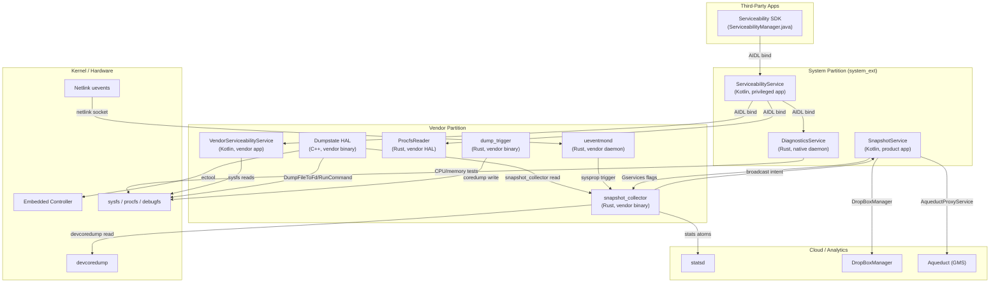
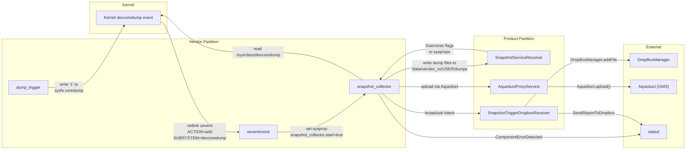
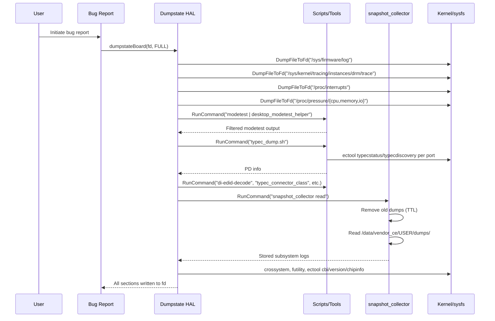
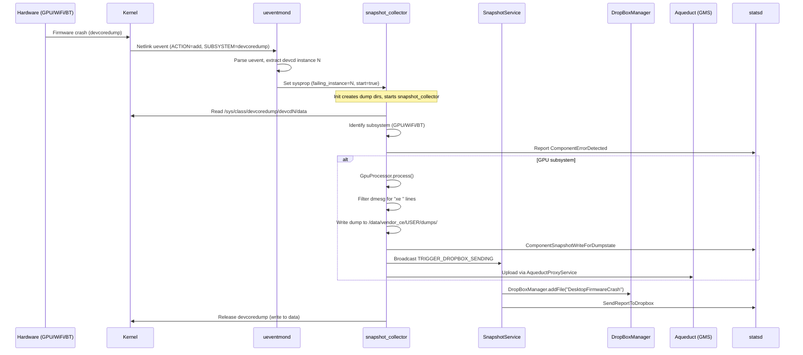
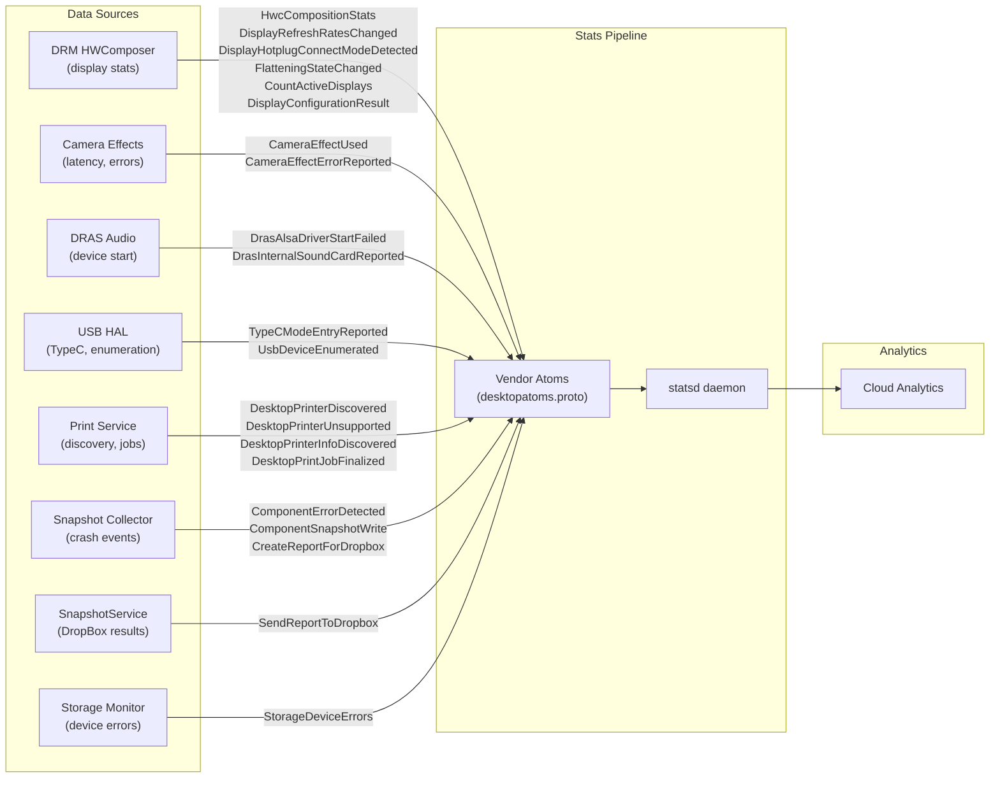
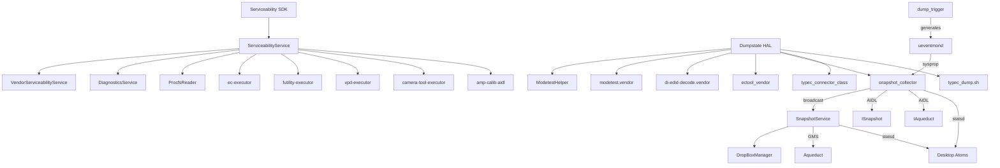

# Serviceability, Diagnostics, Dumpstate, Snapshot, and Stats Implementation

## 1. Architecture Overview

The Android Desktop Platform implements a comprehensive serviceability and diagnostics subsystem spanning multiple layers -- from hardware-level dump collection to cloud-based analytics. The architecture comprises five major subsystems:

1. **Serviceability Stack** -- A three-tier AIDL service architecture for hardware diagnostics, component inspection, and repair operations
2. **Dumpstate HAL** -- An AIDL HAL implementation that collects desktop-specific hardware state during bug reports
3. **Snapshot Subsystem** -- An event-driven crash data collection pipeline that monitors kernel uevents, processes devcoredumps, and sends crash reports via DropBox and Aqueduct
4. **Stats Atoms** -- Desktop-specific statsd vendor atoms for telemetry (display, audio, USB, printing, snapshot, firmware)
5. **Network Diagnostics** -- Tools for network connectivity testing and debugging



## 2. Key Components

| Component | Language | Location | Partition | Description |
|-----------|----------|----------|-----------|-------------|
| ServiceabilityService | Kotlin | `serviceability/ServiceabilityService/` | system_ext | Main serviceability entry point; delegates to vendor + diagnostics |
| VendorServiceabilityService | Kotlin | `serviceability/VendorServiceabilityService/` | vendor | Hardware info queries (battery, CPU, storage, thermal, wireless) |
| DiagnosticsService | Rust | `serviceability/DiagnosticsService/` | system_ext | CPU stress, prime search, FP accuracy, memory tests |
| Serviceability SDK | Java | `serviceability/serviceability-sdk/` | system_ext | Public API for third-party apps (ServiceabilityManager) |
| Serviceability AIDL | AIDL | `serviceability/aidl/` | N/A (generated) | Interface definitions for IServiceabilityService, IVendorServiceabilityService |
| Dumpstate HAL | C++ | `dumpstate/` | vendor | android.hardware.dumpstate HAL implementation |
| ModetestHelper | C++ | `dumpstate/utils/` | vendor | Filters EDID serial numbers and large blobs from modetest |
| typec_dump.sh | Shell | `dumpstate/scripts/` | vendor | Iterates USB-C ports dumping PD status and discovery data |
| SnapshotService | Kotlin | `snapshot/snapshotservice/` | product | Receives boot/checkin intents, manages Gservices flags, sends to DropBox |
| snapshot_collector | Rust | `snapshot/collector/` | vendor | Processes devcoredumps for GPU/WiFi/BT; reads stored dumps for dumpstate |
| dump_trigger | Rust | `snapshot/dump_trigger/` | vendor | Triggers WiFi firmware dumps by writing to sysfs coredump files |
| ueventmond | Rust | `snapshot/ueventmond/` | vendor | Monitors kernel netlink uevents for devcoredump add events |
| ProcfsReader | Rust | `procfs-reader/` | vendor | AIDL HAL for reading /proc/PID CPU usage data |
| Stats Atoms | Proto | `stats/desktopatoms.proto` | N/A (generated) | Desktop-specific statsd vendor atoms (23 atom types) |
| NetworkDiagnosticsTool | Kotlin | `network/NetworkDiagnosticsTool/` | N/A (library) | DNS, ICMP, HTTP/HTTPS connectivity test library |
| DesktopNetworkDebugTool | Kotlin | `network/DesktopNetworkDebugTool/` | system | ADB-based network debug UI app |

## 3. Serviceability Stack

The serviceability stack implements a three-tier architecture that separates concerns across Android's partition boundary:

### ServiceabilityService (system_ext partition)

- **Package**: `com.android.desktop.serviceability`
- **Type**: Privileged system_ext app (`android.uid.system` shared UID)
- **Binding**: Intent action `com.android.desktop.serviceability.ServiceabilityService`
- **Responsibilities**:
  - Serves as the unified entry point for all serviceability operations
  - Delegates hardware queries to `VendorServiceabilityService` across the vendor boundary
  - Delegates diagnostics tests to `DiagnosticsService` (native Rust daemon)
  - Delegates CPU usage queries to `ProcfsReader` (vendor HAL)
  - Manages long-running test lifecycle (`LongRunningTestRunner.kt`)
  - Tracks component manifest (`ComponentManifest.kt`) for hardware enumeration
  - EC command execution (`ecExecutorExtensions.kt`)

- **Key dependencies** (from `Android.bp`):
  - `camera-tool-executor-aidl`, `ec-executor-aidl`, `futility-executor-aidl`, `vpd-executor-aidl`
  - `procfs-reader-aidl`, `diag-service-aidl`
  - `vendor.google.desktop.serviceability-aidl`

### VendorServiceabilityService (vendor partition)

- **Package**: `vendor.google.desktop.serviceability`
- **Type**: Privileged vendor app (`android.uid.system` shared UID)
- **Binding**: Intent action `vendor.google.desktop.serviceability.VendorServiceabilityService`
- **Permissions**:
  - `BIND_SERVICEABILITY_SERVICE` (signature|privileged)
  - `BIND_SERVICEABILITY_SERVICE_SIGNATURE` (signature only)
- **Responsibilities**:
  - Direct hardware information queries (battery, CPU, thermal, storage, wireless)
  - Block device enumeration (`blockDevice.kt`)
  - sysfs reads for hardware state
  - Runs in the vendor partition with direct access to vendor-specific paths

### DiagnosticsService (system_ext partition, native daemon)

- **Binary**: `com.google.desktop.serviceability.diag.diag-service`
- **Init**: Lazy-started via `diag-service.rc` (disabled, oneshot)
- **User/Group**: system/system with unlimited memlock rlimit
- **Language**: Rust with Tokio async runtime
- **Responsibilities**:
  - CPU-bound diagnostic tests run via `task::spawn_blocking`
  - Active test tracking with `DashMap<String, ActiveTest>`
  - Cancellation support via `CancellationToken`
  - Three test modules: `prime_search`, `floating_point_accuracy`, `memory`

## 4. Serviceability SDK

The SDK (`serviceability-sdk/`) provides the public Java API for third-party integration:

- **Library**: `vendor.google.libraries.desktop.serviceability` (java_sdk_library)
- **Main class**: `ServiceabilityManager.java` (80K+ lines -- comprehensive API surface)
- **API packages**: `vendor.google.libraries.desktop.serviceability`
- **Visibility**: Public API (`api/current.txt`) and System API (`api/system-current.txt`)
- **Distribution**: Packaged as `desktop-serviceability-sdk` for SDK distribution
- **Annotation**: `@MinVersion` annotation for API level gating

The SDK wraps the AIDL interface with a user-friendly Java API, handles service binding, and provides feature flag integration via `vendor.google.desktop.serviceability-flags`.

## 5. Serviceability AIDL Interfaces

### IServiceabilityService (vendor.google.desktop.serviceability)

The primary interface exposed by ServiceabilityService with 27+ methods:

| Method | Description |
|--------|-------------|
| `pdNumPorts(deviceType)` | Returns USB-PD port count for device type |
| `getApFlashChipInfo()` | AP flash chip vendor/name |
| `getVpdEntries(region)` / `getVpdValue(region, key)` | Read VPD (Vital Product Data) entries |
| `updateVpdEntries(region, entries)` | Write/delete VPD entries |
| `getCpuUsageInfo(pids)` | Per-process CPU usage (delegates to ProcfsReader) |
| `setNormalChargingRange(lower, upper)` | Battery charging limits |
| `pdChipInfos()` | PD controller chip information |
| `batteryCutoff()` | Battery cutoff after shutdown |
| `fetchEcThermalInfos()` | EC thermal sensor readings |
| `runCpuStressTest(duration, cb)` | CPU stress test with callback |
| `runCpuCacheTest(duration, cb)` | CPU cache test with callback |
| `runPrimeSearchTest(duration, cb)` | Prime number search test |
| `runFloatingPointAccuracyTest(duration, cb)` | FP accuracy test |
| `runMemoryTest(testMask, cb)` | Memory test with bitmask |
| `stopLongRunningTest(testId)` | Cancel running test by ID |
| `getFansSpeed()` / `setFanSpeed(idx, rpm)` / `setFansSpeedAuto()` | Fan control |
| `setLedColor(name, color)` / `setLedColorAuto(name)` | LED control |
| `isFingerprintAlive()` | Fingerprint sensor health check |
| `getMipiCameraInfo()` | MIPI camera enumeration |
| `getEcComponentInfo()` | EC component listing |
| `getWriteProtect(type)` / `setWriteProtect(type, enabled)` | EC/FP write protection |
| `fetchBatteryCtLabel()` | Battery CT label |
| `hasSmartAmp()` / `runSmartAmpCalibration(temp, cb)` | Smart amplifier calibration |

### IVendorServiceabilityService (vendor.google.desktop.serviceability)

Vendor-side interface for hardware info queries:

| Method | Return Type |
|--------|-------------|
| `getBatteryInfo()` | `BatteryInfo` |
| `getCpuUsageInfo()` | `CpuUsageInfo` |
| `getThermalInfo()` | `List<ThermalInfo>` |
| `getStorageInfo()` | `List<StorageInfo>` |
| `getCpuName()` | `String` |
| `getApFlashChipInfo()` | `ApFlashChipInfo` |
| `getWirelessInfo()` | `WirelessInfo` |
| `getPhysicalCpusInfo()` | `List<PhysicalCpuInfo>` |
| `getProductName()` | `String` |
| `getSoundCardName()` / `checkAudioDevice(card)` | Audio device info |
| `readHardwareDescriptorMappingTable()` | `byte[]` |
| `getCardReaderInfo()` | `List<CardReaderInfo>` |
| `getBlockDevicesInfo()` | `List<BlockDeviceInfo>` |

### IDiagnosticsService (com.google.desktop.serviceability.diag)

Native diagnostics test interface:

| Method | Description |
|--------|-------------|
| `runPrimeSearchTest(testId, duration, maxNum, cb)` | Find primes up to maxNum |
| `runFloatingPointAccuracyTest(testId, duration, cb)` | FP accuracy verification |
| `runMemoryTest(testId, memoryKiB, testMask, cb)` | Memory stress test |
| `stopLongRunningTest(testId)` | Cancel test by ID |

### AIDL Data Types

The serviceability AIDL defines 16 parcelable data types:

- `ApFlashChipInfo`, `AudioCalibrationResult`, `AudioCalibrationStatus`
- `BatteryInfo`, `BlockDeviceInfo`, `CardReaderInfo`
- `CpuUsageInfo`, `EcComponentInfo`, `LogicalCpuInfo`
- `MipiCameraInfo`, `PdChipInfo`, `PhysicalCpuInfo`
- `ProcessCpuUsage`, `StorageInfo`, `ThermalInfo`
- `VpdEntry`, `VpdRegion`, `WirelessInfo`

## 6. Dumpstate HAL

### Overview

The dumpstate HAL implements `android.hardware.dumpstate@V1` AIDL interface, providing desktop-specific hardware state collection during Android bug reports.

- **Binary**: `android.hardware.dumpstate-service-desktop`
- **Location**: `/vendor/bin/hw/`
- **Init service**: `vendor.dumpstate-default`
- **User/Group**: nobody / system, ap_firmware, cros_ec, readtracefs, vendor_snapshot
- **VINTF**: `android.hardware.dumpstate / IDumpstateDevice / default`

### Supported Modes

| Mode | Supported | Description |
|------|-----------|-------------|
| `FULL` | Yes | Complete dump with all sections |
| `DEFAULT` | Yes | Same as FULL |
| `INTERACTIVE` | Yes | Same as FULL |
| `REMOTE` | No | Returns ERROR_UNSUPPORTED_MODE |
| `WEAR` | No | Returns ERROR_UNSUPPORTED_MODE |
| `CONNECTIVITY` | No | Returns ERROR_UNSUPPORTED_MODE |
| `WIFI` | No | Returns ERROR_UNSUPPORTED_MODE |
| `PROTO` | No | Returns ERROR_UNSUPPORTED_MODE |

### Dump Sections

The `dumpstateBoard()` method collects 18+ sections:

| Section | Source | Description |
|---------|--------|-------------|
| AP FIRMWARE LOG | `/sys/firmware/log` | Application processor firmware log |
| DRM TRACE | `/sys/kernel/tracing/instances/drm/trace` | DRM subsystem kernel trace |
| INTERRUPTS | `/proc/interrupts` | Interrupt statistics |
| PSI CPU/MEMORY/IO | `/proc/pressure/{cpu,memory,io}` | Pressure Stall Information |
| DRM STATE | `/sys/kernel/debug/dri/*/state` | DRM device state (userdebug only) |
| MODETEST | `modetest` / `modetest -M evdi` / `modetest -M udl` | Display mode test (filtered by ModetestHelper) |
| DI-EDID-DECODE | `/sys/class/drm/card?-*/edid` | EDID decode for all connected displays |
| EC-PDINFO | `typec_dump.sh` | USB Type-C PD status and discovery |
| TYPEC_CONNECTOR_CLASS | `typec_connector_class` | USB Type-C connector class info |
| LSUSB | `lsusb` | USB device listing (normal + verbose) |
| LSPCI | `lspci` | PCI device listing |
| SUBSYSTEM LOGS | `snapshot_collector read` | Collected crash dump data |
| MTD INFO | `/sys/class/mtd/mtd0/flags`, `/proc/mtd` | MTD partition info |
| SPI-NOR INFO | `/sys/class/mtd/mtd?/device/spi-nor/*` | SPI-NOR flash info (JEDEC, manufacturer, SFDP) |
| CROSSYSTEM | `crossystem` | Chrome OS system info |
| FUTILITY INFO | `futility flash --wp-status`, `futility gbb --flags` | Firmware write protect and GBB flags |
| CBI | `ectool cbi get {0..12}` | Chrome Board Info (version, OEM, SKU, DRAM, FW config) |
| EC INFO | `ectool version`, `ectool chipinfo` | Embedded Controller version and chip info |

### Required Binaries

The dumpstate HAL declares dependencies on:
- `desktop_modetest_helper` -- Filters EDID serial numbers and large GAMMA/DEGAMMA LUT blobs
- `modetest.vendor` -- DRM modetest utility
- `di-edid-decode.vendor` -- EDID decoder
- `ectool_vendor` -- EC command tool
- `snapshot_collector` -- Crash dump reader
- `typec_connector_class.vendor` -- USB-C connector class tool
- `typec-dump-sh` -- USB-C dump script

## 7. Dumpstate Scripts

### typec_dump.sh

Iterates over all USB Type-C ports collecting PD status:

```bash
#!/system/bin/sh
port=-1;
while true; do
    port=$((port+1));
    /vendor/bin/ectool typecstatus "${port}" 2>/dev/null || break;
    /vendor/bin/ectool typecdiscovery "${port}" sop 2>/dev/null || continue;
    /vendor/bin/ectool typecdiscovery "${port}" sop-prime 2>/dev/null || continue;
done
```

For each port, it collects:
- `typecstatus` -- PD negotiation state, power role, data role, voltage, current
- `typecdiscovery sop` -- SOP discovery identity (partner capabilities)
- `typecdiscovery sop-prime` -- SOP' discovery (cable capabilities)

### ModetestHelper

A C++ filter that processes `modetest` output to:
1. **EDIDFilter** -- Scrubs serial numbers from EDID blobs (replaces the 8-char serial with zeros)
2. **BlobFilter** -- Strips large blob values for `GAMMA_LUT` and `DEGAMMA_LUT` properties (replaces with `<stripped blob value>`)

This prevents privacy-sensitive data and unnecessarily large data from appearing in bug reports.

## 8. Snapshot Subsystem Architecture

The Snapshot subsystem provides an event-driven pipeline for collecting, processing, and uploading firmware crash data (devcoredumps).



### Feature Flags (aconfig)

The snapshot subsystem is gated by aconfig flags in package `com.google.android.desktop.snapshot.flags`:

| Flag | Description |
|------|-------------|
| `enable_snapshot_collector` | Controls whether snapshot_collector can run |
| `enable_snapshot_service` | Controls whether SnapshotService app starts |
| `enable_uevent_monitor` | Controls whether ueventmond daemon launches |
| `enable_gpu_snapshot` | Controls GPU dump collection |
| `enable_wifi_snapshot` | Controls WiFi dump collection |
| `enable_bluetooth_snapshot` | Controls Bluetooth dump collection |
| `enable_gpu_crash_uploading_to_aqueduct` | Controls GPU crash upload via Aqueduct |

## 9. Snapshot Collector

The `snapshot_collector` is a Rust binary that operates in two modes:

### Read Mode (`snapshot_collector read`)

Used by the dumpstate HAL during bug report generation:
1. Removes expired dumps (beyond TTL)
2. Reads all stored dumps from `/data/vendor_ce/<USER>/dumps/`
3. Outputs dump contents to stdout or a file

### Process Devcoredump Mode (`snapshot_collector process-devcoredump -d <N>`)

Triggered by ueventmond via system property:
1. Reads the devcoredump from `/sys/class/devcoredump/devcd<N>/data`
2. Identifies the failing subsystem (GPU, WiFi, or Bluetooth)
3. Reports `ComponentErrorDetected` stats atom
4. Dispatches to the appropriate processor:
   - **GpuProcessor** -- Combines `AqueductProcessorBase`, `FeedbackProcessorBase`, and `ErrorStatsProcessorBase`; filters GPU-related dmesg lines (`xe ` driver prefix)
   - **WifiProcessor** -- WiFi firmware dump processing
   - **BluetoothProcessor** -- Bluetooth firmware dump processing
5. Releases the devcoredump after processing

### Processor Architecture

```rust
pub trait Processor {
    fn process(&mut self) -> Result<()>;
}
```

Each subsystem processor implements the `Processor` trait with three processing bases:
- **FeedbackProcessorBase** -- Stores dumps for dumpstate (bug reports)
- **ErrorStatsProcessorBase** -- Stores dumps for per-user error stats
- **AqueductProcessorBase** -- Uploads crash data via the Aqueduct proxy

### Supported Components

```rust
pub enum Component {
    GPU,        // xe GPU driver crashes
    WIFI,       // iwlwifi firmware crashes
    BLUETOOTH,  // Bluetooth firmware crashes
}
```

### Init Configuration (`snapshot_collector.rc`)

```
on property:vendor.desktop.snapshot_collector.start=true
  chown vendor_snapshot /sys/class/devcoredump/devcd${...}/data
  mkdir /data/vendor_ce/${user_id}/dumps
  mkdir /data/vendor_ce/${user_id}/dumps/dropbox
  mkdir /data/vendor_ce/${user_id}/dumps/dropbox/tmp
  mkdir /data/vendor_ce/${user_id}/dumps/dropbox/.ratelimit_history
  start snapshot_collector
```

## 10. Dump Trigger

The `dump_trigger` is a Rust CLI that triggers or clears device firmware dumps:

### Subcommands

| Command | Description |
|---------|-------------|
| `wifi-dump` | Triggers WiFi firmware dump by writing `1` to sysfs coredump file |
| `wifi-clear` | Clears WiFi firmware debug buffer (currently no-op for iwlwifi) |

### Operation

1. Scans `/sys/class/ieee80211/` for WiFi devices (phyN)
2. Reads the `device/driver` symlink to identify the driver name
3. For `iwlwifi` driver: writes `1` to `device/coredump` to trigger firmware dump
4. The triggered dump generates a kernel devcoredump event, which ueventmond detects

### Init Configuration (`dump_trigger.rc`)

```
on property:vendor.desktop.snapshot_collector.start_wifi_dump=true
  start dump_trigger_wifi_dump

on property:vendor.desktop.snapshot_collector.clear_wifi_buffer=true
  start dump_trigger_wifi_clear
```

## 11. Ueventmond

The `ueventmond` (uevent monitor daemon) is a Rust daemon that listens for kernel uevents and triggers snapshot collection.

### Operation

1. **Start mode** (`ueventmond --start`): Checks the `enable_uevent_monitor` aconfig flag and sets a sysprop to start the long-running daemon
2. **Daemon mode**: Creates a netlink socket (`AF_NETLINK` / `NETLINK_KOBJECT_UEVENT`), binds to receive all kernel uevents, and loops processing messages

### Uevent Processing

Parses null-terminated key=value pairs from netlink messages:

```
ACTION=add
DEVPATH=/devices/virtual/devcoredump/devcd1
SUBSYSTEM=devcoredump
SEQNUM=4564
```

When `ACTION=add` and `SUBSYSTEM=devcoredump`:
1. Extracts instance number from DEVPATH (e.g., `devcd1` -> `1`)
2. Sets `vendor.desktop.snapshot_collector.failing_instance_number` sysprop
3. Sets `vendor.desktop.snapshot_collector.start=true` to trigger snapshot_collector

### Init Configuration (`ueventmond-service.rc`)

```
on boot
    start ueventmond_start          # Checks aconfig flag

on property:vendor.desktop.snapshot_collector.ueventmond.start=true
    start ueventmond                # Starts long-running daemon

service ueventmond /vendor/bin/ueventmond
    user vendor_snapshot
    group vendor_snapshot
    class late_start
    disabled
```

## 12. Snapshot Service

The SnapshotService is a product-partition Kotlin app that orchestrates the Java-side of the snapshot pipeline.

### Components

#### SnapshotServiceReceiver

A `BroadcastReceiver` that handles:

| Intent | Action |
|--------|--------|
| `BOOT_COMPLETED` | Sets user ID sysprop for snapshot_collector; clears WiFi buffer |
| `CHECKIN_COMPLETE` | Reads Gservices flags and updates sysprops for per-subsystem collection |
| `com.google.desktop.snapshotservice.wifi_dump` | Triggers WiFi dump via sysprop |

Gservices flags managed:
- `desktop:enable_wifi_snapshot`, `desktop:enable_bluetooth_snapshot`, `desktop:enable_gpu_snapshot`
- `desktop:enable_gpu_dropbox`, `desktop:gpu_crash_report_size_limit_in_kib`

Flag status is serialized to sysprops as `userId:flags;userId2:flags` (e.g., `10:w,b;11:g`).

#### SnapshotTriggerDropboxReceiver

Receives `TRIGGER_DROPBOX_SENDING` broadcasts from snapshot_collector (via the ISnapshot AIDL `sendBroadcast`) and:
1. Acquires a file lock on the dump directory (via JNI `libsnapshotflock_jni`)
2. Adds the dump file to `DropBoxManager` under tag `DesktopFirmwareCrash`
3. Deletes the source file after successful submission
4. Logs `SendReportToDropbox` stats atom

#### AqueductProxyService

A bound service that proxies crash data uploads to Google's Aqueduct pipeline:
1. Receives `upload(category, pfd, uuid)` calls via the `IAqueduct` AIDL interface
2. Uses `Aqueduct.getClient(context)` from GMS to upload ParcelFileDescriptor data
3. Protected by `LAUNCH_AQUEDUCT_PROXY_SERVICE` signature permission

### AIDL Interfaces

#### ISnapshot (`com.google.android.snapshot`)

VINTF-stable interface for snapshot system operations:

| Method | Description |
|--------|-------------|
| `sendBroadcast(intent, user, permission)` | Sends broadcast from vendor to system |
| `getLogStream(logType, args)` | Returns gzipped log stream (e.g., dmesg) |
| `getFile(path)` | Returns file as ParcelFileDescriptor |

Constants: `LOG_TYPE_DMESG = 1`

#### IAqueduct (`com.google.android.aqueduct`)

VINTF-stable interface for crash data upload:

| Method | Description |
|--------|-------------|
| `upload(category, pfd, uuid)` | Uploads file descriptor data to Aqueduct (oneway) |

## 13. Stats Atoms

The `desktopatoms.proto` defines 23 vendor atom types in the range 110000-110022:

### Snapshot-Related Atoms

| Atom ID | Name | Description |
|---------|------|-------------|
| 110014 | `ComponentErrorDetected` | Emitted when devcoredump uevent detected (component: GPU/WiFi/BT) |
| 110015 | `ComponentSnapshotWriteForDumpstate` | Written when saving snapshot for dumpstate; tracks file size and result |
| 110016 | `ComponentSnapshotReadForDumpstate` | Emitted when reading stored snapshots; tracks count and total size |
| 110017 | `CreateReportForDropbox` | Emitted after processing devcoredump for ErrorStats/DropBox |
| 110018 | `SendReportToDropbox` | Emitted when DropBoxManager receives the file (module: snapshot) |

### Display/Graphics Atoms

| Atom ID | Name | Description |
|---------|------|-------------|
| 110001 | `HwcCompositionStats` | HWC composition metrics (frames, layers, planes, pixops) per minute |
| 110012 | `DisplayRefreshRatesChanged` | Logged on refresh rate changes |
| 110013 | `DisplayHotplugConnectModeDetected` | Logged on display hotplug (resolution, refresh, DPI) |
| 110019 | `FlatteningStateChanged` | HWC flattening controller state changes |
| 110020 | `CountActiveDisplays` | Active display count per type, every minute |
| 110021 | `DisplayConfigurationResult` | Display config change success/failure |

### Audio Atoms

| Atom ID | Name | Description |
|---------|------|-------------|
| 110000 | `DrasAlsaDriverStartFailed` | Audio device start result (speaker, headphone, mic, HDMI, USB, BT) |
| 110004 | `DrasInternalSoundCardReported` | Internal soundcard detection status |

### USB/Type-C Atoms

| Atom ID | Name | Description |
|---------|------|-------------|
| 110005 | `TypeCModeEntryReported` | Type-C mode entry result (DP, USB4, TBT3) per port |
| 110006 | `UsbDeviceEnumerated` | USB device version and speed on enumeration |

### Camera Atoms

| Atom ID | Name | Description |
|---------|------|-------------|
| 110002 | `CameraEffectUsed` | Camera effect stats (frame drop, latency, active effects) |
| 110003 | `CameraEffectErrorReported` | Camera effect errors |

### Print Atoms

| Atom ID | Name | Description |
|---------|------|-------------|
| 110007 | `DesktopPrinterDiscovered` | Printer discovery (mDNS/USB, protocol) |
| 110008 | `DesktopPrinterUnsupported` | Unsupported printer reasons |
| 110009 | `DesktopPrinterInfoDiscovered` | Printer capabilities (colors, sizes, duplex, formats) |
| 110010 | `DesktopPrintJobFinalized` | Print job completion details |

### Storage/Firmware Atoms

| Atom ID | Name | Description |
|---------|------|-------------|
| 110011 | `StorageDeviceErrors` | Storage unrecovered and total errors |
| 110022 | `FwupdUpdates` | Firmware update status |

## 14. Stats Enums

### Snapshot Enums (`enums/snapshot/snapshot_enums.proto`)

```protobuf
enum Component {
  COMPONENT_DEFAULT = 0;
  COMPONENT_WIFI = 1;
  COMPONENT_BLUETOOTH = 2;
  COMPONENT_GPU = 3;
}
```

### Print Enums (`enums/print/print_enums.proto`)

Comprehensive printer-related enumerations:
- `DesktopPrinterDiscoveryScheme` -- MDNS, USB
- `DesktopPrinterProtocol` -- IPPS, IPP, APP_SOCKET, LPD, IPP_USB, LEGACY_USB
- `DesktopPrinterUnsupportedReason` -- NO_IPPV2, missing IPP operations, no usable format
- `DesktopPrinterDocumentFormat` -- PDF, PostScript, JPEG, PCL, PCLM, PWG Raster, etc.
- `DesktopPrinterMediaType`, `DesktopPrinterMediaSource`, `DesktopPrinterOutputBin`
- `DesktopPrinterPrintQuality`, `DesktopIppVersion`, `DesktopIppOperation`
- `DesktopPrintJobOrientation`, `DesktopPrintJobState`
- `DesktopPrinterPwgRasterDocumentType`, `DesktopPrinterPwgRasterDocumentSheetBack`
- `DesktopPrinterMultipleDocumentHandling`

## 15. Procfs Reader

A vendor HAL that provides privileged access to `/proc/PID` data through a stable AIDL interface.

### Architecture

- **Binary**: `vendor.google.desktop.procfs-reader`
- **Language**: Rust with Tokio async runtime (15 worker threads)
- **Init**: Lazy-started HAL (`disabled`, `oneshot`)
- **User/Group**: system/system,readproc
- **AIDL**: `vendor.google.desktop.IProcfsReader/default` (VINTF-stable)
- **Implementation**: `parse_proc.rs` (18K+ lines) handles /proc parsing

### AIDL Interface

```aidl
@VintfStability
interface IProcfsReader {
    List<ProcessCpuUsage> getCpuUsageInfo(in int[] pidRequest);
}
```

The `ProcessCpuUsage` parcelable contains per-process CPU usage data.

### Integration

ServiceabilityService calls ProcfsReader to fulfill `getCpuUsageInfo()` requests, bridging the system/vendor boundary for procfs access that requires `readproc` group membership.

## 16. Network Diagnostics

### NetworkDiagnosticsTool

A Kotlin library (`network-diagnostics`) providing a structured network connectivity test framework:

```kotlin
interface NetworkDiagnostics {
    fun run()
    fun stop()
    fun getResults(): Array<DiagnosticsTest.Result>
    fun getState(): State
}
```

**Test Types**:
- `DNS_RESOLUTION_TEST` -- DNS name resolution (`DnsResolutionTest.kt`)
- `ICMP_TEST` -- ICMP ping connectivity (`IcmpTest.kt`)
- `HTTP_PROBE_TEST` -- HTTP probe (`HttpProbeTest.kt`)
- `HTTPS_PROBE_TEST` -- HTTPS probe (`HttpsProbeTest.kt`)

**States**: `TEST_FINISHED`, `TEST_TIMEOUT`, `TEST_STOPPED`, `TEST_RUNNING`, `TEST_NOT_INITIATED`

### DesktopNetworkDebugTool

A privileged system app providing a UI for network debugging:

- **Package**: `DesktopNetworkDebugTool`
- **Certificate**: platform
- **Key components**:
  - `MainActivity.kt` -- Main UI with command input
  - `AdbDiag.kt` -- ADB-based diagnostics
  - `AdbCmdExecutor.kt` -- ADB command execution
  - `AdbAuth.kt` -- ADB authentication
  - `AdbMessage.kt` / `AdbShellProtocol.kt` -- ADB protocol implementation
  - `CmdHistory.kt` -- Command history management
  - `RawCmdExecutor.kt` -- Raw command execution

## 17. Data Flow -- Bug Report



## 18. Data Flow -- Dumpstate (Crash Snapshot Pipeline)



## 19. Data Flow -- Stats



## 20. Configuration

### System Properties (Snapshot)

| Property | Type | Description |
|----------|------|-------------|
| `vendor.desktop.snapshot_collector.start` | bool | Triggers snapshot_collector to process devcoredump |
| `vendor.desktop.snapshot_collector.failing_instance_number` | int | Devcoredump instance number to process |
| `vendor.desktop.snapshot_collector.user_id` | int | Target user ID for dump storage |
| `vendor.desktop.snapshot_collector.start_wifi_dump` | bool | Triggers WiFi firmware dump |
| `vendor.desktop.snapshot_collector.clear_wifi_buffer` | bool | Triggers WiFi buffer clear |
| `vendor.desktop.snapshot_collector.ueventmond.start` | bool | Starts ueventmond long-running daemon |
| `vendor.desktop.snapshot_collector.should_collect_wifi` | bool | WiFi collection enabled |
| `vendor.desktop.snapshot_collector.should_collect_bluetooth` | bool | BT collection enabled |
| `vendor.desktop.snapshot_collector.should_collect_gpu` | bool | GPU collection enabled |
| `vendor.desktop.snapshot_collector.enable_gpu_dropbox` | bool | GPU DropBox upload enabled |
| `vendor.desktop.snapshot_collector.gpu_crash_report_size_limit_in_kib` | int | GPU crash report size limit |
| `vendor.desktop.snapshot_collector.flag_status` | string | Serialized per-user flag status |
| `persist.vendor.verbose_logging_enabled` | bool | Dumpstate verbose logging |

### Gservices Flags

| Flag Key | Description |
|----------|-------------|
| `desktop:enable_wifi_snapshot` | Enable WiFi snapshot collection |
| `desktop:enable_bluetooth_snapshot` | Enable Bluetooth snapshot collection |
| `desktop:enable_gpu_snapshot` | Enable GPU snapshot collection |
| `desktop:enable_gpu_dropbox` | Enable GPU DropBox upload |
| `desktop:gpu_crash_report_size_limit_in_kib` | GPU crash report size limit |

### Dump Storage Paths

| Path | Description |
|------|-------------|
| `/data/vendor_ce/<USER>/dumps/` | Main dump storage directory |
| `/data/vendor_ce/<USER>/dumps/dropbox/` | Dumps for DropBox submission |
| `/data/vendor_ce/<USER>/dumps/dropbox/tmp/` | Temporary dump processing |
| `/data/vendor_ce/<USER>/dumps/dropbox/.ratelimit_history/` | Rate limiting state |

## 21. Build Integration

### Serviceability

| Module Name | Type | Partition |
|-------------|------|-----------|
| `com.android.desktop.serviceability` | `android_app` | system_ext |
| `vendor.google.desktop.serviceability` | `android_app` | vendor |
| `com.google.desktop.serviceability.diag.diag-service` | `rust_binary` | system_ext |
| `vendor.google.libraries.desktop.serviceability` | `java_sdk_library` | system_ext |
| `vendor.google.desktop.serviceability-aidl` | `aidl_interface` | N/A |
| `diag-service-aidl` | `aidl_interface` | N/A |
| `vendor.google.desktop.serviceability-sharelibs` | `java_library_static` | N/A |

### Dumpstate

| Module Name | Type | Partition |
|-------------|------|-----------|
| `android.hardware.dumpstate-service-desktop` | `cc_binary` | vendor |
| `desktop_modetest_helper` | `cc_binary` | vendor |
| `typec-dump-sh` | `sh_binary` | vendor |
| `desktop_modetest_helper_test` | `cc_test_host` | host |

### Snapshot

| Module Name | Type | Partition |
|-------------|------|-----------|
| `snapshotservice` | `android_app` | product |
| `snapshot_collector` | `rust_binary` | vendor |
| `dump_trigger` | `rust_binary` | vendor |
| `ueventmond` | `rust_binary` | vendor |
| `com.google.android.snapshot-aidl` | `aidl_interface` | N/A |
| `com.google.android.aqueduct-aidl` | `aidl_interface` | N/A |

### Procfs Reader

| Module Name | Type | Partition |
|-------------|------|-----------|
| `vendor.google.desktop.procfs-reader` | `rust_binary` | vendor |
| `libprocfs_reader` | `rust_library` | vendor |
| `procfs-reader-aidl` | `aidl_interface` | N/A |

### Network Diagnostics

| Module Name | Type | Partition |
|-------------|------|-----------|
| `network-diagnostics` | `java_library` | N/A |
| `DesktopNetworkDebugTool` | `android_app` | system |

## 22. Inter-Subsystem Dependencies



## 23. SEPolicy

### Dumpstate HAL SEPolicy

File: `dumpstate/sepolicy/hal_dumpstate_default.te`

Key policy grants:
- **Shell execution**: `vendor_toolbox_exec`, `vendor_shell_exec`
- **Firmware log**: `sysfs_firmware_log` read
- **sysfs**: General sysfs file/dir read
- **DRM tracing**: `debugfs_drm_tracing` read (all builds), `debugfs_dri` (userdebug/eng only)
- **PSI**: `proc_pressure_cpu`, `proc_pressure_mem`, `proc_pressure_io` read
- **GPU**: `gpu_device` rw, `sysfs_gpu` read for modetest
- **Display**: `di_edid_decode_exec` execute, `modetest_exec` and `desktop_modetest_helper_exec` execute
- **USB-C**: `typec_conn_class_helper_exec` execute, `sysfs_typec` read, `sysfs_thunderbolt` search
- **Firmware tools**: `firmware_tool_exec` domain transition, `firmware_tool_data_file` read, MTD/SPI-NOR access
- **MTD debug**: `debugfs_mtd` (userdebug/eng only)

File contexts:
```
/vendor/bin/hw/android\.hardware\.dumpstate-service-desktop   u:object_r:hal_dumpstate_default_exec:s0
```

Property contexts defined for `vendor_logger_prop`.

### Snapshot SEPolicy

Snapshot components run as `vendor_snapshot` user/group with:
- Devcoredump access via init-time chown
- Credential-encrypted user data directory access
- Netlink socket access (ueventmond)
- WiFi sysfs access (dump_trigger, group: wifi)

## 24. Key Files Reference

| File Path | Description |
|-----------|-------------|
| `vendor/google/desktop/serviceability/aidl/vendor/google/desktop/serviceability/IServiceabilityService.aidl` | Main serviceability AIDL interface (27+ methods) |
| `vendor/google/desktop/serviceability/aidl/vendor/google/desktop/serviceability/IVendorServiceabilityService.aidl` | Vendor-side hardware info AIDL interface |
| `vendor/google/desktop/serviceability/DiagnosticsService/aidl/com/google/desktop/serviceability/diag/IDiagnosticsService.aidl` | Native diagnostics test AIDL interface |
| `vendor/google/desktop/serviceability/ServiceabilityService/src/com/android/desktop/serviceability/ServiceabilityService.kt` | Main ServiceabilityService implementation (28K) |
| `vendor/google/desktop/serviceability/VendorServiceabilityService/src/vendor/google/desktop/serviceability/VendorServiceabilityService.kt` | Vendor service implementation (20K) |
| `vendor/google/desktop/serviceability/DiagnosticsService/src/main.rs` | DiagnosticsService Rust entry point |
| `vendor/google/desktop/serviceability/DiagnosticsService/src/diag/prime_search.rs` | Prime search diagnostic test |
| `vendor/google/desktop/serviceability/DiagnosticsService/src/diag/floating_point_accuracy.rs` | FP accuracy diagnostic test |
| `vendor/google/desktop/serviceability/DiagnosticsService/src/diag/memory.rs` | Memory diagnostic test |
| `vendor/google/desktop/serviceability/serviceability-sdk/src/vendor/google/libraries/desktop/serviceability/ServiceabilityManager.java` | Public SDK API (80K) |
| `vendor/google/desktop/serviceability/sharelibs/src/vendor/google/desktop/serviceability/permission/Permission.kt` | Permission constants and helpers |
| `vendor/google/desktop/dumpstate/Dumpstate.cpp` | Dumpstate HAL implementation |
| `vendor/google/desktop/dumpstate/Dumpstate.h` | Dumpstate HAL header |
| `vendor/google/desktop/dumpstate/service.cpp` | Dumpstate HAL service entry point |
| `vendor/google/desktop/dumpstate/Android.bp` | Dumpstate build configuration |
| `vendor/google/desktop/dumpstate/scripts/typec_dump.sh` | USB-C PD dump script |
| `vendor/google/desktop/dumpstate/utils/ModetestHelper.cpp` | Modetest EDID/blob filter main |
| `vendor/google/desktop/dumpstate/utils/ModetestHelperUtils.cpp` | EDID serial number and blob filter logic |
| `vendor/google/desktop/dumpstate/sepolicy/hal_dumpstate_default.te` | Dumpstate SEPolicy rules |
| `vendor/google/desktop/snapshot/ueventmond/main.rs` | Uevent monitor daemon |
| `vendor/google/desktop/snapshot/dump_trigger/dump_trigger.rs` | WiFi firmware dump trigger |
| `vendor/google/desktop/snapshot/collector/snapshot_collector.rs` | Snapshot collector main |
| `vendor/google/desktop/snapshot/collector/gpu_processor.rs` | GPU crash processor |
| `vendor/google/desktop/snapshot/collector/wifi_processor.rs` | WiFi crash processor |
| `vendor/google/desktop/snapshot/collector/bluetooth_processor.rs` | Bluetooth crash processor |
| `vendor/google/desktop/snapshot/collector/processor.rs` | Processor trait definition |
| `vendor/google/desktop/snapshot/collector/types.rs` | Component enum and stats conversions |
| `vendor/google/desktop/snapshot/collector/devcoredump.rs` | Devcoredump reading and parsing |
| `vendor/google/desktop/snapshot/collector/feedback_processor_base.rs` | Dumpstate feedback storage base |
| `vendor/google/desktop/snapshot/collector/errorstats_processor_base.rs` | Error stats storage base |
| `vendor/google/desktop/snapshot/collector/aqueduct_processor_base.rs` | Aqueduct upload base |
| `vendor/google/desktop/snapshot/snapshotservice/src/com/google/android/snapshotservice/SnapshotServiceReceiver.kt` | Boot/checkin intent receiver |
| `vendor/google/desktop/snapshot/snapshotservice/src/com/google/android/snapshotservice/SnapshotTriggerDropboxReceiver.kt` | DropBox submission handler |
| `vendor/google/desktop/snapshot/snapshotservice/src/com/google/android/snapshotservice/AqueductProxyService.kt` | Aqueduct upload proxy |
| `vendor/google/desktop/snapshot/aidl/com/google/android/snapshot/ISnapshot.aidl` | Snapshot system AIDL interface |
| `vendor/google/desktop/snapshot/aidl/com/google/android/aqueduct/IAqueduct.aidl` | Aqueduct upload AIDL interface |
| `vendor/google/desktop/snapshot/aconfig/snapshot.aconfig` | Snapshot feature flags |
| `vendor/google/desktop/stats/desktopatoms.proto` | Desktop vendor atoms definition |
| `vendor/google/desktop/stats/enums/snapshot/snapshot_enums.proto` | Snapshot component enum |
| `vendor/google/desktop/stats/enums/print/print_enums.proto` | Print service enums |
| `vendor/google/desktop/procfs-reader/src/main.rs` | ProcfsReader HAL entry point |
| `vendor/google/desktop/procfs-reader/src/parse_proc.rs` | /proc parsing implementation |
| `vendor/google/desktop/procfs-reader/aidl/vendor/google/desktop/IProcfsReader.aidl` | ProcfsReader AIDL interface |
| `vendor/google/desktop/network/NetworkDiagnosticsTool/src/com/android/desktop/network/network_diagnostics/NetworkDiagnostics.kt` | Network diagnostics interface |
| `vendor/google/desktop/network/DesktopNetworkDebugTool/src/main/kotlin/MainActivity.kt` | Network debug tool UI |
