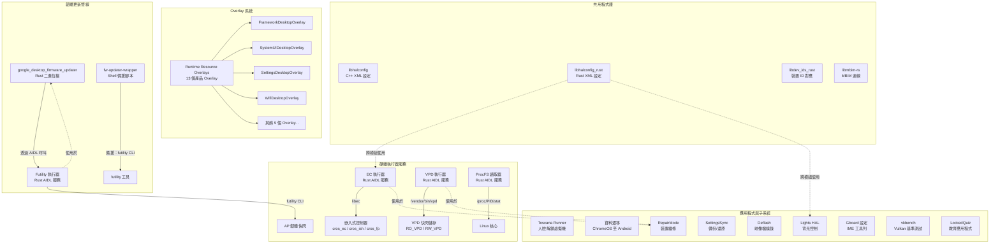

# Overlay、韌體更新及雜項子系統實作

本文件描述 Android 桌面平台的 Runtime Resource Overlays (RROs)、韌體更新基礎設施、硬體執行器服務及雜項子系統的實作。這些元件共同將標準 Android 適配至桌面/Chromebook 形式因素。

## 1. 架構總覽



## 2. 主要元件

| 元件 | 類型 | 語言 | 分割區 | 說明 |
|------|------|------|--------|------|
| Overlay 套件 (13) | RRO | XML | product | 桌面專用資源覆寫 |
| google_desktop_firmware_updater | 二進位檔 | Rust | system | OTA 韌體更新應用程式 |
| fw-updater-wrapper | Shell 腳本 | Bash | vendor | 備援韌體更新封裝器 |
| ec-executor | AIDL 服務 | Rust | vendor | 嵌入式控制器介面 |
| vpd-executor | AIDL 服務 | Rust | vendor | 重要產品資料介面 |
| futility-executor | AIDL 服務 | Rust | vendor | AP 韌體快閃介面 |
| procfs-reader | AIDL 服務 | Rust | vendor | 程序 CPU 使用率讀取器 |
| toscana_runner | 二進位檔 | Rust | system_ext | 人臉解鎖 Microdroid 虛擬機執行器 |
| 資料遷移 (3 個二進位檔) | 二進位檔 | C++ | system | ChromeOS 至 Android 資料遷移 |
| RepairMode | 應用程式 | Kotlin | system | 裝置維修模式管理 |
| SettingsSync | 應用程式 | Kotlin | system | 設定備份與還原 |
| deflash | 主機工具 | Python | host | 裝置映像檔燒錄公用程式 |
| Lights HAL | AIDL 服務 | C++ | vendor | 顯示器背光控制 |
| libhalconfig | 程式庫 | C++ | vendor | 從 XML 讀取 HAL 設定 |
| libhalconfig_rust | 程式庫 | Rust | vendor | 從 XML 讀取 Rust HAL 設定 |
| libdev_ids_rust | 程式庫 | Rust | vendor | 裝置 ID 對應/查詢 |
| vkbench | 二進位檔 | C++ | vendor | Vulkan GPU 基準測試 |
| LockedQuiz | 應用程式 | Kotlin | system | 教育鎖定測驗應用程式 |
| Gboard 設定 | 預建 | Config | system | Gboard IME 設定 |

## 3. Overlay 套件

Android 桌面平台使用 13 個 Runtime Resource Overlays (RROs) 來為桌面形式因素客製化標準 Android 體驗。所有 Overlay 都以 `runtime_resource_overlay` 模組建置，並設定 `product_specific: true`。

| # | Overlay 套件 | 目標套件 | 主要客製化 |
|---|-------------|---------|-----------|
| 1 | **CarrierConfigOverlayDesktop** | `com.android.carrierconfig` | ChromeOS 裝置 (corsola, brya) 的 SIM 插槽對應；eSIM 插槽 1，pSIM 插槽 0 |
| 2 | **DocumentsUIGoogleOverlay** | `com.android.documentsui` | 桌面檔案管理員：Backpack 作為快速檢視器，停用媒體根目錄/應用程式列/預覽圖示，啟用 Material3，LOAM 搜尋提供者 |
| 3 | **EuiccOverlay** | eSIM/eUICC | ChromeOS 硬體上嵌入式 SIM 設定的 SIM 插槽對應 JSON |
| 4 | **FrameworkDesktopOverlay** | `android` (framework) | 停用底座螢幕保護程式，設定 Google Sans 字型，零售展示套件，橫向攝影機相容性，profcollect 上傳器，桌面豁免套件 |
| 5 | **MediaProviderDesktopOverlay** | `com.android.providers.media` | 略過行動裝置導向的資料夾：Alarms、Audiobooks、Notifications、Podcasts、Ringtones |
| 6 | **NexusLauncherDesktopOverlay** | Nexus Launcher | 設定 `desktop_form_factor=true` |
| 7 | **ResolverActivityDesktopOverlay** | `android` (framework) | 自訂對話框樣式的解析器佈局，搭配 Material Design 色彩、樣式、按鈕（透過 `use_dialog_layout` 功能旗標控制） |
| 8 | **SettingsDesktopOverlay** | `com.android.settings` | 隱藏緊急設定，預設私密 WiFi，長寬比覆寫（全螢幕/分割畫面/16:9），在 SUW 中隱藏略過/無/滑動安全選項，顯示裝置類別 |
| 9 | **SettingsProviderStayOnWhilePluggedInOverlay** | `com.android.providers.settings` | `def_stay_on_while_plugged_in=true` - AC 供電時保持螢幕開啟 |
| 10 | **SetupWizardDesktopOverlay** | Setup Wizard | 清除初始設定中的退出動作（空字串覆寫） |
| 11 | **SystemUIDesktopOverlay** | `com.android.systemui` | 桌面螢幕尺寸測試，彈跳器使用者切換器，快速設定磚（internet、bt、cast、screenrecord、dnd、nearby share、battery、mic、camera、dark），Backpack 截圖編輯器，停用模糊桌布，停用 EBS |
| 12 | **WallpaperPickerDesktopOverlay** | Wallpaper Picker | `isDesktopUi=true` - 啟用桌面桌布選擇器模式 |
| 13 | **WifiDesktopOverlay** | Wi-Fi framework | 啟用 5GHz/6GHz 支援，softap SAE (WPA3)，MAC 位址隨機化，NL80211 法規變更事件，mainline supplicant |

此外，`flags/` 目錄包含 aconfig 旗標宣告 (`vendor_google_desktop_overlay_flags`)，用於 ResolverActivityDesktopOverlay 使用的 `resolver_activity_flags`，而 `tests/` 包含 SystemUI 截圖的測試 Overlay。

## 4. Framework 桌面 Overlay

**路徑：** `vendor/google/desktop/overlay_packages/FrameworkDesktopOverlay/`

Framework Overlay 以 Android 核心框架（`android` 套件）為目標，為桌面形式因素調整全系統行為。

### 主要設定覆寫

| 設定 | 值 | 用途 |
|------|---|------|
| `config_dreamsEnabledByDefault` | `false` | 預設停用螢幕保護程式/Dreams |
| `config_dreamsActivatedOnDockByDefault` | `false` | 放入底座時不啟動 Dreams（桌面裝置永遠處於「底座」狀態） |
| `config_dreamsActivatedOnSleepByDefault` | `true` | 休眠且充電時啟動 Dreams |
| `config_dreamsDefaultComponent` | Hub UI CuratedPhotoDreamService | 基於 Google Photos 的螢幕保護程式 |
| `config_supportedDreamComplications` | Time (1), Weather (3) | 僅支援時間和天氣附加元件 |
| `config_retailDemoPackage` | `com.google.android.retaildemo` | 零售展示應用程式套件名稱 |
| `config_defaultAssistantAccessComponent` | AiAi Notification Assistant | Google 通知智慧助理 |
| `config_profcollectReportUploaderEnabled` | `true` | 啟用效能分析上傳 |
| `config_desktopExemptPackages` | `attractloop` 應用程式 | 豁免桌面視窗模式的套件 |
| `config_isCameraCompatSimReqOrientationLandscapeTreatmentEnabled` | `true` | 針對強制直向應用程式的攝影機方向相容性 |
| `config_headlineFontFamily` | `google-sans` | 標題使用 Google Sans 字型 |
| `config_bodyFontFamily` | `google-sans-text` | 內文使用 Google Sans Text 字型 |

## 5. SystemUI 桌面 Overlay

**路徑：** `vendor/google/desktop/overlay_packages/SystemUIDesktopOverlay/`

SystemUI Overlay 為桌面體驗量身打造狀態列、快速設定及系統 UI 元件。

### 主要設定覆寫

| 設定 | 值 | 用途 |
|------|---|------|
| `config_testDesktopScreenSize` | `true` | 使用桌面螢幕尺寸進行測試 |
| `config_enableBouncerUserSwitcher` | `true` | 鎖定螢幕上的多使用者切換器 |
| `config_enableFullscreenUserSwitcher` | `true` | 全螢幕多使用者切換器 |
| `quick_settings_tiles_default` | internet, bt, cast, screenrecord, dnd, nearby share, battery, mic, camera, dark | 適合桌面的快速設定磚 |
| `config_growthAppPackageName` | `com.google.android.desktop.growth` | 成長/新手引導應用程式整合 |
| `config_growthBroadcastDelayMillis` | `10000` | 成長廣播前延遲 10 秒 |
| `wifitrackerlib_config_saveOpenNetworksAsShared` | `false` | 預設將 WiFi 網路設為私密 |
| `config_screenshotEditor` | Backpack client gateway | 截圖編輯器（Backpack 應用程式） |
| `config_supportBlurredWallpaper` | `false` | 停用桌布模糊效果 |
| `config_extra_battery_saver_confirmation` | `false` | 不顯示 EBS 確認（桌面不支援） |
| `config_show_extreme_battery_saver_reminder` | `false` | 桌面不顯示 EBS 提醒 |

## 6. 設定桌面 Overlay

**路徑：** `vendor/google/desktop/overlay_packages/SettingsDesktopOverlay/`

設定 Overlay 為桌面環境客製化設定應用程式。

### 主要設定覆寫

| 設定 | 值 | 用途 |
|------|---|------|
| `config_show_emergency_settings` | `false` | 隱藏安全與緊急設定（不適用於桌面） |
| `config_share_network_by_default` | `false` | 在 Android Local 上 WiFi 網路預設為私密 |
| `config_allow_edit_network_configuration_by_default` | `false` | 預設禁止其他使用者編輯共用網路 |
| `config_userAspectRatioOverrideValues` | UNSET(0), FULLSCREEN(6), SPLIT_SCREEN(1), 16:9(4) | 適合桌面的長寬比選項 |
| `config_hide_skip_security_options_in_suw` | `true` | 在 SUW 中強制安全設定 |
| `config_hide_none_security_option` | `true` | 移除「無」鎖定螢幕選項 |
| `config_hide_swipe_security_option` | `true` | 移除「滑動」鎖定螢幕選項 |
| `config_show_top_level_device_category` | `true` | 在頂層設定中顯示裝置類別 |

## 7. 其他 Overlay

### NexusLauncherDesktopOverlay
設定 `desktop_form_factor=true`，向 Nexus Launcher 發出訊號，使其以桌面模式運作，並進行適當的佈局和行為變更。

### WifiDesktopOverlay
為桌面硬體啟用進階 WiFi 功能：
- 用戶端和 softap 均支援 5GHz 頻段
- 支援 6GHz softap
- softap 安全性使用 WPA3-SAE
- 已連線 MAC 位址隨機化
- NL80211 法規變更事件支援
- Mainline supplicant 服務

### WallpaperPickerDesktopOverlay
設定 `isDesktopUi=true` 以啟用桌面專用桌布選擇器行為，包括尺寸和樣式調整。

### MediaProviderDesktopOverlay
在已掛載的儲存裝置上略過建立行動裝置導向的預設資料夾（`Alarms`、`Audiobooks`、`Notifications`、`Podcasts`、`Ringtones`），因為這些資料夾與桌面形式因素無關。

### DocumentsUIGoogleOverlay
全面客製化檔案管理員：
- 將 Backpack 設為信任的快速檢視器和截圖編輯器
- 將 LOAM 設定為本機搜尋/摘要提供者
- 啟用適合桌面的功能：Material3、取消按鈕、啟動器模式、下載意圖處理
- 停用行動裝置功能：媒體根目錄、應用程式列、預覽圖示、選取核取方塊、搜尋 Chip 移動、複製到/移動到選單

### SettingsProviderStayOnWhilePluggedInOverlay
設定 `def_stay_on_while_plugged_in=true`，使桌面裝置在連接電源時保持喚醒狀態，符合桌面機器的使用者期望。

### SetupWizardDesktopOverlay
清除 `exit_to_action_in_initial_setup` 的值，使設定精靈在初始設定完成後不會自動啟動特定應用程式。

### CarrierConfigOverlayDesktop
為具有行動數據連線的 ChromeOS 裝置提供 SIM 插槽對應設定，將 eSIM 對應至插槽 1，實體 SIM 對應至插槽 0，適用於 corsola 和 brya 等裝置。

### EuiccOverlay
透過 JSON 格式設定嵌入式 SIM (eSIM/eUICC) 插槽對應，以在桌面硬體上正確配置 eSIM。

### ResolverActivityDesktopOverlay
一個精密的 Overlay，以適合桌面的對話框佈局客製化應用程式選擇器/解析器對話框。此 Overlay 透過 `vendor.google.desktop.overlay.flags.use_dialog_layout` 進行**功能旗標**控制，並包含：
- 已填滿/外框按鈕、清單項目、狀態層和漣漪效果的自訂色彩資源
- 對話框背景和按鈕背景的自訂可繪製資源
- 解析器清單、清單項目和設定檔分頁按鈕的自訂佈局
- 適合桌面的尺寸、樣式和色彩值

## 8. 韌體更新系統

**路徑：** `vendor/google/desktop/firmware_update/`

韌體更新系統負責在 OTA 期間處理 AP（應用處理器）韌體更新。它採用雙層架構：現代的 Rust 服務客戶端搭配 Shell 腳本備援方案。

### updater_app（Rust 二進位檔）

**二進位檔名稱：** `google_desktop_firmware_updater`
**原始碼：** `firmware_update/updater_app/src/main.rs`

Rust 更新程式應用程式連接至 Futility Executor AIDL 服務以執行韌體更新：

```rust
// Key constants
const FUTILITYEXECUTOR_SERVICE: &str = "vendor.google.desktop.IFutilityExecutor/default";
const VENDOR_FW_PATH: &str = "/postinstall/firmware/ap-ec-fw.zip";
const SERVICE_TIMEOUT: Duration = Duration::from_secs(30);
```

**架構：**
- 使用 `clap` 進行 CLI 參數解析，包含 `Vendor` 和 `System` 子命令
- 透過 `tokio` 以 30 秒逾時連接至 Futility Executor 服務
- 透過 AIDL 介面呼叫 `updateFirmware(VENDOR_FW_PATH)`
- 以不同的錯誤碼退出：1（找不到服務）、2（逾時）、3（執行時期錯誤）、4（更新失敗）

**相依性：** `libbinder_rs`、`libtokio`、`libclap`、`futility-executor-aidl-V1-rust`

### updater-wrapper（Shell 備援方案）

**二進位檔名稱：** `fw-updater-wrapper`
**原始碼：** `firmware_update/updater-wrapper/updater-wrapper.sh`

Shell 封裝器在基於服務的更新程式失敗時作為備援方案：

1. 首先嘗試 `google_desktop_firmware_updater vendor`
2. 失敗時退回至直接呼叫 `futility` CLI
3. 從韌體壓縮檔中的 `identity.csv` 偵測裝置型號，或透過將 `crossystem ro_fwid` 與 manifest 檔案比對來偵測
4. 呼叫 `futility update -dvvvvv --mode=autoupdate --archive <path> --model <model> --wp=1 --check-fwid`
5. `--wp=1` 旗標強制僅更新 RW（由於 CSE 問題，x86 上無法更新 RO）

## 9. 硬體執行器

所有硬體執行器服務遵循一致的架構模式：以 vendor HAL 身份執行的 Rust AIDL 服務，使用與 binder 整合的 tokio 非同步執行時期，以延遲服務方式註冊。

### EC 執行器

**路徑：** `vendor/google/desktop/ec-executor/`
**服務名稱：** `vendor.google.desktop.IEcExecutor/default`
**二進位檔：** `vendor.google.desktop.ec-executor`

嵌入式控制器執行器提供對 ChromeOS EC 硬體的特權存取。它支援三種裝置類型：`CROS_EC`、`CROS_ISH`（整合感測器中樞）和 `CROS_FP`（指紋）。

**AIDL 介面（`IEcExecutor`）：**

| 方法 | 說明 |
|------|------|
| `getVersion(DeviceType)` | 取得 EC 韌體版本資訊（RO/RW 版本、目前映像類型） |
| `i2cPassthru(...)` | 對 EC 連接裝置的 I2C 透通交易 |
| `pdNumPorts(DeviceType)` | 取得 USB PD（電力傳輸）連接埠數量 |
| `pdChipFwName(DeviceType, port)` | 取得連接埠的 PD 晶片韌體名稱 |
| `pdChipInfo(DeviceType, port)` | 取得詳細的 PD 晶片資訊 |
| `setNormalChargingRange(lower, upper)` | 設定電池充電維持器限制 |
| `batteryCutoff()` | 切斷電池電源（用於運送/儲存） |
| `getThermalInfos()` | 取得溫度感測器讀數（開爾文偏移 273） |
| `getFansSpeed()` | 取得所有風扇的 RPM 轉速 |
| `setFanSpeed(fanIdx, speedRpm)` | 設定特定風扇轉速 |
| `setFansSpeedAuto()` | 將所有風扇恢復為自動控制 |
| `setLedColor(LedName, LedColor)` | 設定 LED 顏色（Battery/Power/Adapter/Left/Right LED；紅/綠/藍/黃/白/琥珀色） |
| `setLedColorAuto(LedName)` | 將 LED 恢復為自動控制 |
| `setWriteProtect(DeviceType, enabled)` | 啟用/停用 EC 韌體寫入保護 |
| `getWriteProtect(DeviceType)` | 查詢 EC 韌體寫入保護狀態 |

**Init 設定（`ec-executor.rc`）：**
```
service vendor.google.desktop.ec-executor /vendor/bin/hw/vendor.google.desktop.ec-executor
    class hal
    user system
    group root
    interface aidl vendor.google.desktop.IEcExecutor/default
    disabled
    oneshot
```

**關鍵實作細節：** `ec_lib.rs` 模組封裝了底層的 `libec` crate，透過 `/dev/cros_ec`、`/dev/cros_ish` 或 `/dev/cros_fp` 裝置節點與 EC 通訊。

### VPD 執行器

**路徑：** `vendor/google/desktop/vpd-executor/`
**服務名稱：** `vendor.google.desktop.vpd_executor.IVpdExecutor/default`
**二進位檔：** `vendor.google.desktop.vpd_executor.vpd-executor`

重要產品資料執行器提供對 VPD 快閃儲存的存取，其中包含裝置特定資訊（序號、區域碼、硬體設定）。

**AIDL 介面（`IVpdExecutor`）：**

| 方法 | 說明 |
|------|------|
| `getEntries(VpdRegion)` | 列出 RO_VPD 或 RW_VPD 的所有鍵值對項目 |
| `getValue(VpdRegion, key)` | 依鍵取得特定 VPD 項目；若鍵不存在則傳回空值 |
| `updateEntries(VpdRegion, entries)` | 設定（非空值）或刪除（空值）VPD 項目 |

**實作方式：** 封裝 `/vendor/bin/vpd` 命令列工具，在阻塞任務中啟動以避免阻塞非同步 binder 執行時期。解析 `"key"="value"` 格式的輸出。

### Futility 執行器

**路徑：** `vendor/google/desktop/futility-executor/`
**服務名稱：** `vendor.google.desktop.IFutilityExecutor/default`
**二進位檔：** `vendor.google.desktop.futility-executor`

Futility 執行器封裝 Google 的 `futility` 韌體公用程式，用於 AP 快閃操作。

**AIDL 介面（`IFutilityExecutor`）：**

| 方法 | 逾時 | 說明 |
|------|------|------|
| `getApFlashChipInfo()` | 5 秒 | 透過 `futility flash --flash-info` 取得 AP 快閃晶片廠商和名稱 |
| `updateFirmware(archivePath)` | 5 分鐘 | 透過 `futility update` 以除錯詳細模式、自動更新模式、寫入保護=1 執行 AP 韌體更新 |
| `getWriteProtect()` | 5 秒 | 透過 `futility flash --wp-status --ignore-hw` 查詢 AP 寫入保護狀態 |
| `setWriteProtect(enable)` | 5 秒 | 透過 `futility flash --wp-enable/--wp-disable` 啟用/停用 AP 寫入保護 |

**關鍵實作細節：** `updateFirmware` 方法將 stdout 和 stderr 合併，將輸出記錄至 `/data/vendor/vboot/futility_executor_firmware_update_logs.txt`，並使用 5 分鐘逾時。

### ProcFS 讀取器

**路徑：** `vendor/google/desktop/procfs-reader/`
**服務名稱：** `vendor.google.desktop.IProcfsReader/default`
**二進位檔：** `vendor.google.desktop.procfs-reader`

ProcFS 讀取器提供從 `/proc/[pid]/stat` 讀取程序 CPU 使用率統計資料的特權存取。

**AIDL 介面（`IProcfsReader`）：**

| 方法 | 說明 |
|------|------|
| `getCpuUsageInfo(int[] pidRequest)` | 取得所請求 PID 的 CPU 使用率（utime、stime）；已終止的程序將被省略 |

**實作方式（`parse_proc.rs`）：** 解析 `/proc/[pid]/stat` 檔案，從核心提供的 stat 格式中擷取 `utime`（欄位 14）和 `stime`（欄位 15）。此模組包含支援主機測試的可重用程式庫（`libprocfs_reader`）。

## 10. 人臉解鎖（Toscana Runner）

**路徑：** `vendor/google/desktop/face/toscana_runner/`
**二進位檔：** `toscana_runner`
**分割區：** `system_ext`

Toscana Runner 透過 Android 虛擬化框架 (AVF) 在受保護的 Microdroid 虛擬機中執行信任應用程式來實作人臉驗證。

### 架構

1. **功能閘道：** 啟動時檢查 `aconfig_desktop_face_flags_rust::enable_face_auth_service()`；若未啟用人臉驗證則退出
2. **虛擬機設定：**
   - 從 `/system_ext/etc/toscana/toscana_ta.apk` 載入 Toscana TA APK
   - 建立用於 APK 驗證的 idsig 檔案
   - 初始化 10MB 的執行個體分割區以儲存虛擬機狀態
   - 為虛擬機分配唯一的執行個體 ID
3. **虛擬機設定：**
   - 使用 Microdroid OS 的受保護虛擬機
   - 1024 MB 記憶體、4 個 CPU 核心
   - Payload 二進位檔：`libpayload.so`
   - 除錯等級：FULL（正式版將降低）
4. **服務註冊：**
   - 虛擬機 payload 準備就緒後（60 秒逾時），在 `android.hardware.biometrics.face.toscana.IMicrodroid/default` 註冊 binder 服務
   - 該服務公開 `openVsockConnection()`，連接至虛擬機中的 vsock 埠 9999
5. **生命週期：** 等待虛擬機結束，然後退出

**相依性：** `android.system.virtualizationservice-rust`、`libvmclient`、`android.hardware.biometrics.face.toscana-rust`

## 11. 資料遷移（ChromeOS 至 Android）

**路徑：** `vendor/google/desktop/data_migration/`

資料遷移子系統負責將使用者資料從 ChromeOS (ARC) 遷移至原生 Android (Android Local)。它由三個獨立的遷移服務和一個共用程式庫組成。

### 元件

| 二進位檔 | 用途 | AIDL 介面 |
|---------|------|-----------|
| `arc-app-data-migrator` | 將 ARC 應用程式資料目錄複製至 Android 資料路徑 | `IArcAppDataMigrator.copyAppDataDir(srcDir, dstDir, appUid)` |
| `arc-media-migrator` | 將媒體檔案從 ARC 遷移至 Android | `IArcMediaMigrator` |
| `chrome-data-migrator` | 遷移 Chrome 瀏覽器資料 | `IChromeDataMigrator` |

**共用程式庫：** `libarcmigrator` (C++) 提供中繼資料處理（`arc_metadata_utils.cpp`）和一般遷移操作（`arc_utils.cpp`）的通用公用程式。透過 `libselinux` 使用 SELinux 感知的檔案操作。

**資料路徑：**
- 來源 (ARC)：`[ARC /data root]/data/[package-name]` 或 `[ARC /data root]/user_de/0/[package-name]`
- 目的地 (AL)：`/data/user/[user-id]/[package-name]` 或 `/data/user_de/[user-id]/[package-name]`

三個二進位檔均以 `vendor: false`（system 分割區）建置，並連結 `com.android.desktop.data_migration-ndk` 以使用 AIDL。

## 12. 維修模式

**路徑：** `vendor/google/desktop/repairmode/RepairMode/`
**應用程式名稱：** `RepairMode-Desktop`

維修模式提供一種方式進入受限作業系統環境以進行裝置維修，同時保護使用者資料。其底層使用 Android 的 `DynamicSystemManager`。

### 架構

- **核心程式庫**（`RepairMode-Core`）：包含 `RepairModeManager`，使用特殊的 DynamicSystem 插槽管理進入/退出轉換
- **進入應用程式**（`RepairMode-EntryApp`）：包含 Activities、Fragments、ViewModels 和 Services 的 Android 程式庫
- **桌面應用程式**（`RepairMode-Desktop`）：具有平台憑證的最終可安裝應用程式

### 主要類別

| 類別 | 角色 |
|------|------|
| `RepairModeManager` | 核心邏輯：透過 DynamicSystemManager 進入/退出維修模式；處理無頭系統使用者模式 |
| `DesktopRepairModeManager` | 桌面專用維修模式行為 |
| `RepairModeEntryActivity` | 啟動維修模式的進入點 Activity |
| `RepairModeSplashScreenActivity` | 模式切換期間的啟動畫面 |
| `RepairModeService` | 管理維修模式生命週期的背景服務 |
| `BootCompletedReceiver` | 處理開機完成廣播以檢查維修模式狀態 |
| `RepairModeInstallReceiver` | 處理維修模式安裝事件 |
| `GscUtil` | Google Security Chip 公用程式 |
| `VpdUtil` | VPD 存取公用程式（連接至 VPD Executor） |

**相依性：** 與可維修性程式庫（`vendor.google.libraries.desktop.serviceability.impl`）、設定 UI 程式庫和製造後設定 proto 整合。在 `tests/integration/` 中有整合測試。

## 13. 設定同步

**路徑：** `vendor/google/desktop/settings_sync/SettingsSync/`
**應用程式名稱：** `SettingsSync`
**套件：** `com.android.settingssync`

設定同步使用 Android Backup API 搭配舊版鍵值備份，提供跨裝置的 ChromeOS 風格設定同步功能。

### 架構

| 元件 | 角色 |
|------|------|
| `SettingsSyncBackupAgent` | BackupAgent 實作；備份和還原安全設定 |
| `SettingsObserver` | 接收 `ON_SETTING_CHANGED` 和 `BOOT_COMPLETED` 事件的 BroadcastReceiver |
| `SettingsSyncRestoreWorker` | 用於延遲還原操作的 WorkManager worker |

### 目前同步的設定

- `Settings.Secure.ADAPTIVE_SLEEP`
- `Settings.Secure.ADAPTIVE_CONNECTIVITY_ENABLED`
- `Settings.Secure.SCREENSAVER_ENABLED`

**備份格式：** 設定以鍵值對形式儲存在狀態檔中，格式為 `"key:value\n"`。代理程式透過比較目前值與上次儲存的狀態來執行增量備份。還原時僅在值與目前裝置狀態不同時才套用備份值。

**權限：** `BACKUP`、`INTERACT_ACROSS_USERS_FULL`、`WRITE_SETTINGS`、`WRITE_SECURE_SETTINGS`、`RECEIVE_BOOT_COMPLETED`

## 14. 共用程式庫

### libhalconfig (C++)

**路徑：** `vendor/google/desktop/libs/libhalconfig/`
**模組：** `libhalconfig`（cc_library、soc_specific）

為桌面平台提供基於 XML 的 HAL 設定解析。從 `hal_config.xml` 檔案讀取設定，以決定對特定裝置啟用哪些 HAL 和功能。

- 使用 `libxml2` 進行 XML 解析
- 包含執行時期二進位檔 `halconfig_runtime` 以在執行時期查詢設定
- 從 `src/include/` 匯出標頭檔

### libhalconfig_rust (Rust)

**路徑：** `vendor/google/desktop/libs/libhalconfig_rust/`
**模組：** `libhalconfig_rust`（rust_library、soc_specific、host_supported）

libhalconfig 的 Rust 等效版本，具有額外功能：

- 使用 `libxml_rust` 進行 XML 解析
- 透過 aconfig 進行功能旗標控制（`com.google.android.desktop.libhalconfig_rust.flags`）
- 包含 CLI 工具 `dev_config` 以查詢設定
- 具有裝置測試（`libhalconfig_rust_test`）
- 團隊：`trendy_team_desktop_audio`

### libdev_ids_rust (Rust)

**路徑：** `vendor/google/desktop/libs/libdev_ids_rust/`
**模組：** `libdev_ids_rust`（rust_library、soc_specific、host_supported）

用於識別桌面硬體的裝置 ID 對應程式庫：

- 使用基於 protobuf 的硬體描述子對應表（`libhardware_descriptor_mapping_table_rust_proto`）
- 基於 CRC 的裝置識別（`libcrc`）
- 包含 CLI 工具 `dev_ids` 和主機測試
- 團隊：`trendy_team_desktop_kernel`

### libmbim-rs (Rust)

**路徑：** `vendor/google/desktop/libs/libmbim-rs/`
**團隊：** `trendy_team_desktop_connectivity`

MBIM（行動寬頻介面模型）程式庫，用於具有 WWAN 連線功能的桌面裝置上的行動數據機通訊。`Android.bp` 目前僅包含套件宣告，表示實作可能仍在進行中或位於其他模組中。

## 15. Deflash 公用程式

**路徑：** `vendor/google/desktop/deflash/`
**模組：** `deflash`（python_binary_host）

一個主機端命令列工具，用於將 Android 桌面映像檔燒錄至裝置。這是該平台的主要映像/燒錄工具。

### 架構

- **主腳本：** `deflash.py` - 使用 `asyncio` 的非同步 Python 工具
- **GPT 處理：** `gpt.py` - GUID Partition Table 解析和操作
- **公用程式：** `deflash_util/` - 輔助函式
- **快取：** `simplelru.py` - 映像檔的 LRU 快取（位於 `/var/tmp/.deflash/cache` 的 128 GiB 快取）

### 主要常數

| 常數 | 值 | 用途 |
|------|---|------|
| `ANDROID_IMAGE` | `android-desktop_image.bin` | 映像檔名稱 |
| `ADB_OUT_DIR` | `/data/adb_out` | 遠端輸出目錄 |
| `FROM_SLOT` | `a` | 來源插槽 |
| `TO_SLOT` | `b` | 目標插槽 |

### 相依性

| 工具 | 用途 |
|------|------|
| `adb_py` | ADB 通訊 |
| `avbtool` / `libavbtool` | AVB（Android Verified Boot）操作 |
| `create_snapshot` | 快照建立 |
| `lpunpack` | 邏輯分割區解包 |
| `mkbootimg` / `unpack_bootimg` | 開機映像建立/解壓縮 |

## 16. Hammerd（EC 韌體更新常駐程式）

**路徑：** `vendor/google/desktop/hammerd/`

hammerd 目錄目前僅包含一個 `OWNERS` 檔案，表示這是 EC 韌體更新常駐程式的預留位置。在 ChromeOS 上，hammerd 負責處理可分離鍵盤底座的韌體更新（以「Hammer」鍵盤命名）。桌面版的實際 EC 韌體更新功能由 EC Executor 和 Futility Executor 服務處理。

## 17. 開發者工具

**路徑：** `vendor/google/desktop/dev/`

### adb-dbc（透過 USB Debug Class 的 ADB）

**路徑：** `vendor/google/desktop/dev/adb-dbc/`

透過 USB Debug Class (DBC) 提供 ADB 連線功能，作為標準 USB ADB 的替代方案。包含：
- `51-android.rules` - 裝置權限的 udev 規則
- `adb-dbc.gz` - 壓縮的 ADB DBC 二進位檔

### cq（提交佇列/測試）

**路徑：** `vendor/google/desktop/dev/cq/`

測試和 CI 公用程式：
- `cq_android-desktop.sh` - Android 桌面提交佇列腳本
- `stick_image_helper.sh` - USB 隨身碟映像輔助工具

### kernel（核心建置工具）

**路徑：** `vendor/google/desktop/dev/kernel/`

核心開發和建置工具：
- `replace_prebuilts.py` - 將預建核心映像替換為本機建置版本的腳本；具有單元測試（`test_replace_prebuilts.py`、`replace_prebuilts_test` python_test_host）
- `build_fit_image_desktop/generate-its-script.sh` - ChromeOS 風格開機的 FIT（Flattened Image Tree）映像生成
- `build_mixed_kernels_desktop/main.py` - 混合核心建置工具（結合 GKI 與裝置特定模組）；具有單元測試

### measure（效能測量）

**路徑：** `vendor/google/desktop/dev/measure/`

用於電力與效能 (PnP) 的效能測量工具：
- `pnp/cold_app_launch/cold_app_launch.sh` - 冷啟動應用程式啟動時間測量
- `pnp/browsing/index.html` - 網頁瀏覽基準測試頁面
- `pnp/perfetto-configs/perfetto.sh` - 系統分析的 Perfetto 追蹤設定
- `best-known-methods.md` - 測量最佳實踐文件

## 18. 基準測試（vkbench - Vulkan 基準測試）

**路徑：** `vendor/google/desktop/benches/vkbench/`
**模組：** `vkbench`（cc_binary、vendor）

用於測量桌面硬體圖形效能的 Vulkan GPU 基準測試。源自 Chromium OS。

### 測試套件

| 測試 | 檔案 | 用途 |
|------|------|------|
| Clear | `clear.cc` | Vulkan 清除操作效能 |
| Copy | `copy.cc` | 緩衝區/映像複製操作 |
| Draw | `draw.cc` | 使用頂點/片段著色器的三角形渲染 |
| Submit | `submit.cc` | 命令緩衝區提交開銷 |

### 著色器資源

預編譯的 SPIR-V 著色器安裝至 `/vendor/etc/vkbench/shaders/`：
- `bufferStream.{vert,frag}.spv` - 緩衝區串流著色器
- `triangle.{vert,frag}.spv` - 三角形渲染著色器

**相依性：** `libvulkan`、`libpng`、`vulkan_headers`

## 19. 教育（LockedQuiz）

**路徑：** `vendor/google/desktop/edu/lockedquiz/`
**模組：** `LockedQuiz`（android_app、privileged、platform certificate）

使用 Jetpack Compose 建置的教育用鎖定測驗應用程式：

- 實作全螢幕測驗模式，防止學生存取其他應用程式
- 使用 `platform_apis: true` 和平台憑證以取得特權系統存取（鎖定任務模式）
- 以 `androidx.compose.material3`、`androidx.activity_activity-compose` 和 ConstraintLayout 建置

## 20. Gboard 整合

**路徑：** `vendor/google/desktop/gboard/`
**模組：** `gboard.rc`（prebuilt_usr_share）

為 Google 鍵盤 (Gboard) 輸入法提供設定檔：

- 將 `gboard.rc` 安裝至 `/usr/share/ime/google/gboard.rc`
- 內容：`show_pk_toolbar` - 在 Gboard 中啟用實體鍵盤工具列
- 這允許 Gboard 在偵測到實體鍵盤時顯示相關的桌面鍵盤快捷鍵和功能

## 21. Lights HAL

**路徑：** `vendor/google/desktop/lights/hal/`
**模組：** `android.hardware.lights-service.android-desktop`（cc_binary、vendor）
**服務：** `android.hardware.light.ILights/default`

Lights HAL 實作 `android.hardware.light` AIDL 介面（V2），用於控制桌面硬體上的顯示器背光。

### 架構

| 類別 | 角色 |
|------|------|
| `DesktopHwLight` | 硬體燈光的抽象基礎類別；保存 `HwLight` 中繼資料（id、ordinal、type） |
| `BackLight` | 顯示器背光的具體實作；透過 sysfs 路徑讀取/寫入亮度 |
| `DesktopLights` | `BnLights` 實作；管理 `DesktopHwLight` 執行個體集合 |

**主要功能：**
- 從 sysfs 自動探索背光裝置
- 從 sysfs 的 `max_brightness` 檔案讀取最大亮度
- 將 ARGB 亮度值縮放至硬體範圍
- 透過 aconfig 進行功能旗標控制（`vendor/google/desktop/lights/aconfig/flags.aconfig`）

**Init 設定：**
```
service vendor.lights.android-desktop /vendor/bin/hw/android.hardware.lights-service.android-desktop
    interface aidl android.hardware.light.ILights/default
    class hal
    user system
    group system
```

## 22. 設定

### Overlay 設定機制

所有 Overlay 使用 Android 的 Runtime Resource Overlay (RRO) 機制：

1. 每個 Overlay 是僅包含資源的 APK（無程式碼：`android:hasCode="false"`）
2. Overlay 透過 `AndroidManifest.xml` 中的 `android:targetPackage` 以特定套件為目標
3. 大多數 Overlay 使用 `android:isStatic="true"` 以保證套用
4. 優先權值（`android:priority`）解決 Overlay 之間的衝突
5. 具有功能旗標的 Overlay（ResolverActivityDesktopOverlay）使用資源目錄限定詞：`res/flag(package.flag_name)/`

### AIDL 服務設定

所有執行器服務遵循此模式：
- **VINTF manifest 片段**（`.xml`）宣告服務介面版本
- **Init `.rc` 檔案**定義服務啟動設定
- **SELinux 政策**授予必要權限（未顯示但必須）
- 服務使用**延遲註冊**（`register_lazy_service`）以按需啟動

### 建置模組類型

| 模組類型 | 使用者 |
|---------|--------|
| `runtime_resource_overlay` | 全部 13 個 Overlay 套件 |
| `rust_binary` | EC/VPD/Futility 執行器、ProcFS 讀取器、Toscana runner、韌體更新程式 |
| `cc_binary` | Lights HAL、vkbench、資料遷移工具 |
| `android_app` | RepairMode、SettingsSync、LockedQuiz |
| `python_binary_host` | deflash |
| `sh_binary` | fw-updater-wrapper |
| `prebuilt_usr_share` | gboard.rc |

## 23. 建置整合

### 產品 Overlay 納入

Overlay 透過 makefile 變數納入產品中（通常在裝置的產品 `.mk` 檔案中）：

```makefile
PRODUCT_PACKAGES += \
    FrameworkDesktopOverlay \
    SystemUIDesktopOverlay \
    SettingsDesktopOverlay \
    WifiDesktopOverlay \
    WallpaperPickerDesktopOverlay \
    ...
```

### Vendor 服務納入

執行器服務納入 vendor 分割區：

```makefile
PRODUCT_PACKAGES += \
    vendor.google.desktop.ec-executor \
    vendor.google.desktop.vpd_executor.vpd-executor \
    vendor.google.desktop.futility-executor \
    vendor.google.desktop.procfs-reader
```

### 分割區配置

| 分割區 | 元件 |
|--------|------|
| `product` | 全部 13 個 RRO Overlay 套件 |
| `vendor` | EC/VPD/Futility 執行器、ProcFS 讀取器、Lights HAL、vkbench、libhalconfig、libhalconfig_rust、libdev_ids_rust、fw-updater-wrapper |
| `system` | 韌體更新程式應用程式、資料遷移二進位檔、RepairMode、SettingsSync、LockedQuiz |
| `system_ext` | Toscana runner（人臉解鎖） |
| `host` | deflash、核心建置工具 |

## 24. 子系統間相依性

```
libhalconfig / libhalconfig_rust
    |
    +---> EC Executor（裝置特定 EC 設定）
    +---> Lights HAL（背光裝置探索）
    +---> Audio HAL（此處未涵蓋）
    +---> 其他 vendor HAL

libdev_ids_rust
    |
    +---> 跨所有子系統的裝置識別

Futility Executor
    |
    +---> Firmware Updater App（AIDL 客戶端）
    +---> Firmware Updater Wrapper（備援方案）
    +---> RepairMode（寫入保護管理）

EC Executor
    |
    +---> 電池管理服務
    +---> 溫度管理
    +---> LED 控制服務
    +---> RepairMode（EC 寫入保護）

VPD Executor
    |
    +---> RepairMode（VpdUtil：裝置識別）
    +---> 裝置佈建服務
    +---> 工廠/製造工具

ProcFS Reader
    |
    +---> 系統效能監控
    +---> Growth 應用程式（資源使用追蹤）
```

### 主要相依性鏈

1. **韌體更新流程：** OTA Engine -> `fw-updater-wrapper` -> `google_desktop_firmware_updater` -> Futility Executor AIDL -> `futility` CLI -> AP 快閃晶片
2. **維修模式流程：** 使用者 -> RepairMode App -> DynamicSystemManager + VPD Executor + EC Executor（寫入保護）+ GSC（Google Security Chip）
3. **人臉解鎖流程：** BiometricManager -> Toscana Runner -> AVF/Microdroid VM -> vsock -> Toscana TA（人臉偵測）
4. **資料遷移流程：** Setup Wizard -> arc-app-data-migrator / arc-media-migrator / chrome-data-migrator -> 搭配 SELinux 重新標籤的檔案複製

## 25. 主要檔案參考

| 檔案 | 絕對路徑 | 說明 |
|------|---------|------|
| Framework Overlay 設定 | `vendor/google/desktop/overlay_packages/FrameworkDesktopOverlay/res/values/config.xml` | Framework 資源覆寫 |
| SystemUI Overlay 設定 | `vendor/google/desktop/overlay_packages/SystemUIDesktopOverlay/res/values/config.xml` | SystemUI 資源覆寫 |
| Settings Overlay 設定 | `vendor/google/desktop/overlay_packages/SettingsDesktopOverlay/res/values/config.xml` | Settings 資源覆寫 |
| WiFi Overlay 設定 | `vendor/google/desktop/overlay_packages/WifiDesktopOverlay/res/values/config.xml` | WiFi 功能覆寫 |
| DocumentsUI Overlay 設定 | `vendor/google/desktop/overlay_packages/DocumentsUIGoogleOverlay/res/values/config.xml` | 檔案管理員客製化 |
| MediaProvider Overlay 設定 | `vendor/google/desktop/overlay_packages/MediaProviderDesktopOverlay/res/values/config.xml` | 略過行動裝置專用資料夾 |
| Firmware Updater main.rs | `vendor/google/desktop/firmware_update/updater_app/src/main.rs` | Rust 韌體更新程式應用程式 |
| Updater 封裝器腳本 | `vendor/google/desktop/firmware_update/updater-wrapper/updater-wrapper.sh` | Shell 備援韌體更新程式 |
| EC Executor main.rs | `vendor/google/desktop/ec-executor/src/main.rs` | EC AIDL 服務實作 |
| EC Executor AIDL | `vendor/google/desktop/ec-executor/aidl/vendor/google/desktop/IEcExecutor.aidl` | EC 服務介面定義 |
| EC 程式庫 (ec_lib.rs) | `vendor/google/desktop/ec-executor/src/ec_lib.rs` | EC 硬體抽象 |
| VPD Executor main.rs | `vendor/google/desktop/vpd-executor/src/main.rs` | VPD AIDL 服務實作 |
| VPD Executor AIDL | `vendor/google/desktop/vpd-executor/aidl/vendor/google/desktop/vpd_executor/IVpdExecutor.aidl` | VPD 服務介面定義 |
| Futility Executor main.rs | `vendor/google/desktop/futility-executor/src/main.rs` | AP 韌體快閃服務 |
| Futility Executor AIDL | `vendor/google/desktop/futility-executor/aidl/vendor/google/desktop/IFutilityExecutor.aidl` | Futility 服務介面 |
| ProcFS Reader main.rs | `vendor/google/desktop/procfs-reader/src/main.rs` | 程序 CPU 讀取器服務 |
| ProcFS parse_proc.rs | `vendor/google/desktop/procfs-reader/src/parse_proc.rs` | /proc/PID/stat 解析器 |
| Toscana Runner main.rs | `vendor/google/desktop/face/toscana_runner/src/main.rs` | 人臉解鎖虛擬機執行器 |
| Data Migration Android.bp | `vendor/google/desktop/data_migration/Android.bp` | 資料遷移建置規則 |
| RepairMode Manager | `vendor/google/desktop/repairmode/RepairMode/core/src/com/google/android/desktop/repairmode/RepairModeManager.kt` | 維修模式核心邏輯 |
| RepairMode Android.bp | `vendor/google/desktop/repairmode/RepairMode/Android.bp` | RepairMode 建置規則 |
| SettingsSync BackupAgent | `vendor/google/desktop/settings_sync/SettingsSync/src/com/android/settingssync/SettingsSyncBackupAgent.kt` | 設定備份/還原代理程式 |
| SettingsSync Manifest | `vendor/google/desktop/settings_sync/SettingsSync/AndroidManifest.xml` | SettingsSync 應用程式清單 |
| Deflash 腳本 | `vendor/google/desktop/deflash/deflash.py` | 主機端映像檔燒錄工具 |
| libhalconfig Android.bp | `vendor/google/desktop/libs/libhalconfig/Android.bp` | C++ HAL 設定程式庫建置 |
| libhalconfig_rust Android.bp | `vendor/google/desktop/libs/libhalconfig_rust/Android.bp` | Rust HAL 設定程式庫建置 |
| libdev_ids_rust Android.bp | `vendor/google/desktop/libs/libdev_ids_rust/Android.bp` | 裝置 ID 程式庫建置 |
| Lights HAL Android.bp | `vendor/google/desktop/lights/hal/src/Android.bp` | Lights HAL 建置規則 |
| Lights HAL main.cpp | `vendor/google/desktop/lights/hal/src/main.cpp` | Lights HAL 進入點 |
| Gboard 設定 | `vendor/google/desktop/gboard/gboard.rc` | Gboard 實體鍵盤工具列設定 |
| vkbench Android.bp | `vendor/google/desktop/benches/vkbench/Android.bp` | Vulkan 基準測試建置規則 |
| LockedQuiz Android.bp | `vendor/google/desktop/edu/lockedquiz/Android.bp` | 教育測驗應用程式建置 |
| Overlay 旗標 | `vendor/google/desktop/overlay_packages/flags/Android.bp` | Overlay 功能旗標宣告 |

以上所有路徑均相對於原始碼樹根目錄 `/mnt/nvme11/home/gaggery/ww04-fatcat-bkc/`。
