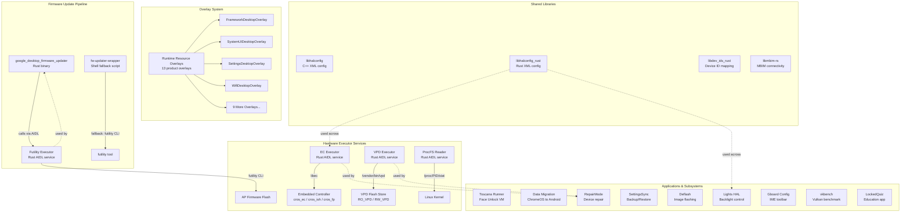

# Overlays, Firmware Update, and Miscellaneous Subsystems Implementation

This document describes the implementation of Runtime Resource Overlays (RROs), firmware update infrastructure, hardware executor services, and miscellaneous subsystems for the Android Desktop platform. These components collectively adapt standard Android to the desktop/Chromebook form factor.

## 1. Architecture Overview



## 2. Key Components

| Component | Type | Language | Partition | Description |
|-----------|------|----------|-----------|-------------|
| Overlay Packages (13) | RRO | XML | product | Desktop-specific resource overrides |
| google_desktop_firmware_updater | Binary | Rust | system | OTA firmware update application |
| fw-updater-wrapper | Shell script | Bash | vendor | Fallback firmware update wrapper |
| ec-executor | AIDL Service | Rust | vendor | Embedded Controller interface |
| vpd-executor | AIDL Service | Rust | vendor | Vital Product Data interface |
| futility-executor | AIDL Service | Rust | vendor | AP firmware flash interface |
| procfs-reader | AIDL Service | Rust | vendor | Process CPU usage reader |
| toscana_runner | Binary | Rust | system_ext | Face unlock Microdroid VM runner |
| Data Migration (3 binaries) | Binary | C++ | system | ChromeOS-to-Android data migration |
| RepairMode | App | Kotlin | system | Device repair mode management |
| SettingsSync | App | Kotlin | system | Settings backup and restore |
| deflash | Host tool | Python | host | Device image flashing utility |
| Lights HAL | AIDL Service | C++ | vendor | Display backlight control |
| libhalconfig | Library | C++ | vendor | HAL configuration from XML |
| libhalconfig_rust | Library | Rust | vendor | Rust HAL configuration from XML |
| libdev_ids_rust | Library | Rust | vendor | Device ID mapping/lookup |
| vkbench | Binary | C++ | vendor | Vulkan GPU benchmark |
| LockedQuiz | App | Kotlin | system | Education locked quiz app |
| Gboard config | Prebuilt | Config | system | Gboard IME configuration |

## 3. Overlay Packages

The Android Desktop platform uses 13 Runtime Resource Overlays (RROs) to customize the standard Android experience for the desktop form factor. All overlays are built as `runtime_resource_overlay` modules with `product_specific: true`.

| # | Overlay Package | Target Package | Key Customizations |
|---|----------------|----------------|-------------------|
| 1 | **CarrierConfigOverlayDesktop** | `com.android.carrierconfig` | SIM slot mapping for ChromeOS devices (corsola, brya); eSIM slot 1, pSIM slot 0 |
| 2 | **DocumentsUIGoogleOverlay** | `com.android.documentsui` | Desktop file manager: Backpack as quick viewer, disable media roots/apps row/preview icons, enable Material3, LOAM search provider |
| 3 | **EuiccOverlay** | eSIM/eUICC | SIM slot mapping JSON for embedded SIM configuration on ChromeOS hardware |
| 4 | **FrameworkDesktopOverlay** | `android` (framework) | Disable dreams on dock, set Google Sans fonts, retail demo package, camera compat for landscape, profcollect uploader, desktop-exempt packages |
| 5 | **MediaProviderDesktopOverlay** | `com.android.providers.media` | Skip mobile-oriented folders: Alarms, Audiobooks, Notifications, Podcasts, Ringtones |
| 6 | **NexusLauncherDesktopOverlay** | Nexus Launcher | Set `desktop_form_factor=true` |
| 7 | **ResolverActivityDesktopOverlay** | `android` (framework) | Custom dialog-style resolver layout with Material Design colors, styles, buttons (feature-flagged via `use_dialog_layout`) |
| 8 | **SettingsDesktopOverlay** | `com.android.settings` | Hide emergency settings, private WiFi by default, aspect ratio overrides (fullscreen/split/16:9), hide skip/none/swipe security options in SUW, show Device category |
| 9 | **SettingsProviderStayOnWhilePluggedInOverlay** | `com.android.providers.settings` | `def_stay_on_while_plugged_in=true` - keep screen on when AC powered |
| 10 | **SetupWizardDesktopOverlay** | Setup Wizard | Clear the exit-to-action in initial setup (empty string override) |
| 11 | **SystemUIDesktopOverlay** | `com.android.systemui` | Desktop screen size for tests, bouncer user switcher, QuickSettings tiles (internet, bt, cast, screenrecord, dnd, nearby share, battery, mic, camera, dark), Backpack screenshot editor, disable blurred wallpaper, disable EBS |
| 12 | **WallpaperPickerDesktopOverlay** | Wallpaper Picker | `isDesktopUi=true` - enable desktop wallpaper picker mode |
| 13 | **WifiDesktopOverlay** | Wi-Fi framework | Enable 5GHz/6GHz support, softap SAE (WPA3), MAC randomization, NL80211 reg change events, mainline supplicant |

Additionally, the `flags/` directory contains aconfig flag declarations (`vendor_google_desktop_overlay_flags`) for the `resolver_activity_flags` used by the ResolverActivityDesktopOverlay, and `tests/` contains test overlays for SystemUI screenshots.

## 4. Framework Desktop Overlay

**Path:** `vendor/google/desktop/overlay_packages/FrameworkDesktopOverlay/`

The Framework overlay targets the Android core framework (`android` package) and adjusts system-wide behavior for the desktop form factor.

### Key Configuration Overrides

| Setting | Value | Purpose |
|---------|-------|---------|
| `config_dreamsEnabledByDefault` | `false` | Disable screensaver/dreams by default |
| `config_dreamsActivatedOnDockByDefault` | `false` | No dreams when docked (desktops are always "docked") |
| `config_dreamsActivatedOnSleepByDefault` | `true` | Activate dreams when sleeping and charging |
| `config_dreamsDefaultComponent` | Hub UI CuratedPhotoDreamService | Google Photos-based screensaver |
| `config_supportedDreamComplications` | Time (1), Weather (3) | Only time and weather complications |
| `config_retailDemoPackage` | `com.google.android.retaildemo` | Retail demo app package name |
| `config_defaultAssistantAccessComponent` | AiAi Notification Assistant | Google notification intelligence |
| `config_profcollectReportUploaderEnabled` | `true` | Enable performance profiling uploads |
| `config_desktopExemptPackages` | `attractloop` app | Packages exempt from desktop windowing mode |
| `config_isCameraCompatSimReqOrientationLandscapeTreatmentEnabled` | `true` | Camera orientation compat for portrait-hardcoded apps |
| `config_headlineFontFamily` | `google-sans` | Google Sans for headlines |
| `config_bodyFontFamily` | `google-sans-text` | Google Sans Text for body |

## 5. SystemUI Desktop Overlay

**Path:** `vendor/google/desktop/overlay_packages/SystemUIDesktopOverlay/`

The SystemUI overlay tailors the status bar, quick settings, and system UI components for the desktop experience.

### Key Configuration Overrides

| Setting | Value | Purpose |
|---------|-------|---------|
| `config_testDesktopScreenSize` | `true` | Use desktop screen dimensions for testing |
| `config_enableBouncerUserSwitcher` | `true` | Multi-user switcher on lock screen |
| `config_enableFullscreenUserSwitcher` | `true` | Full-screen multi-user switcher |
| `quick_settings_tiles_default` | internet, bt, cast, screenrecord, dnd, nearby share, battery, mic, camera, dark | Desktop-appropriate QS tiles |
| `config_growthAppPackageName` | `com.google.android.desktop.growth` | Growth/onboarding app integration |
| `config_growthBroadcastDelayMillis` | `10000` | 10-second delay before growth broadcast |
| `wifitrackerlib_config_saveOpenNetworksAsShared` | `false` | Private WiFi networks by default |
| `config_screenshotEditor` | Backpack client gateway | Screenshot editor (Backpack app) |
| `config_supportBlurredWallpaper` | `false` | Disable wallpaper blur effects |
| `config_extra_battery_saver_confirmation` | `false` | No EBS confirmation (not supported on desktop) |
| `config_show_extreme_battery_saver_reminder` | `false` | No EBS reminders on desktop |

## 6. Settings Desktop Overlay

**Path:** `vendor/google/desktop/overlay_packages/SettingsDesktopOverlay/`

The Settings overlay customizes the Settings app for the desktop context.

### Key Configuration Overrides

| Setting | Value | Purpose |
|---------|-------|---------|
| `config_show_emergency_settings` | `false` | Hide Safety & emergency (not applicable on desktop) |
| `config_share_network_by_default` | `false` | WiFi networks are private by default on Android Local |
| `config_allow_edit_network_configuration_by_default` | `false` | Prevent other users from editing shared networks by default |
| `config_userAspectRatioOverrideValues` | UNSET(0), FULLSCREEN(6), SPLIT_SCREEN(1), 16:9(4) | Desktop-relevant aspect ratio options |
| `config_hide_skip_security_options_in_suw` | `true` | Force security setup during SUW |
| `config_hide_none_security_option` | `true` | Remove "None" lock screen option |
| `config_hide_swipe_security_option` | `true` | Remove "Swipe" lock screen option |
| `config_show_top_level_device_category` | `true` | Show Device category in top-level settings |

## 7. Other Overlays

### NexusLauncherDesktopOverlay
Sets `desktop_form_factor=true`, signaling to the Nexus Launcher that it should operate in desktop mode with appropriate layout and behavior changes.

### WifiDesktopOverlay
Enables advanced WiFi capabilities for desktop hardware:
- 5GHz band support for both client and softap
- 6GHz softap support
- WPA3-SAE for softap security
- Connected MAC address randomization
- NL80211 regulatory change event support
- Mainline supplicant service

### WallpaperPickerDesktopOverlay
Sets `isDesktopUi=true` to activate desktop-specific wallpaper picker behavior, including dimensions and style adjustments.

### MediaProviderDesktopOverlay
Skips creation of mobile-centric default folders (`Alarms`, `Audiobooks`, `Notifications`, `Podcasts`, `Ringtones`) on mounted storage devices, since these are irrelevant on a desktop form factor.

### DocumentsUIGoogleOverlay
Comprehensively customizes the file manager:
- Sets Backpack as the trusted quick viewer and screenshot editor
- Configures LOAM as the local search/summary provider
- Enables desktop-appropriate features: Material3, cancel button, launcher mode, download intent handling
- Disables mobile features: media roots, apps row, preview icons, selection checkmarks, search chip movement, copy-to/move-to menus

### SettingsProviderStayOnWhilePluggedInOverlay
Sets `def_stay_on_while_plugged_in=true` so desktop devices stay awake while connected to power, matching user expectations for a desktop machine.

### SetupWizardDesktopOverlay
Clears the `exit_to_action_in_initial_setup` value so the setup wizard does not auto-launch a specific app after initial setup completes.

### CarrierConfigOverlayDesktop
Provides SIM slot mapping configuration for ChromeOS devices with cellular connectivity, mapping eSIM to slot 1 and physical SIM to slot 0 for devices like corsola and brya.

### EuiccOverlay
Configures embedded SIM (eSIM/eUICC) slot mappings via JSON format for proper eSIM provisioning on desktop hardware.

### ResolverActivityDesktopOverlay
A sophisticated overlay that customizes the app chooser/resolver dialog with a desktop-appropriate dialog layout. This overlay is **feature-flagged** via `vendor.google.desktop.overlay.flags.use_dialog_layout` and includes:
- Custom color resources for filled/outline buttons, list items, state layers, and ripples
- Custom drawable resources for dialog backgrounds and button backgrounds
- Custom layouts for resolver lists, list items, and profile tab buttons
- Desktop-appropriate dimensions, styles, and color values

## 8. Firmware Update System

**Path:** `vendor/google/desktop/firmware_update/`

The firmware update system handles AP (Application Processor) firmware updates during OTA. It uses a two-tier approach: a modern Rust-based service client with a shell script fallback.

### updater_app (Rust Binary)

**Binary name:** `google_desktop_firmware_updater`
**Source:** `firmware_update/updater_app/src/main.rs`

The Rust updater application connects to the Futility Executor AIDL service to perform firmware updates:

```rust
// Key constants
const FUTILITYEXECUTOR_SERVICE: &str = "vendor.google.desktop.IFutilityExecutor/default";
const VENDOR_FW_PATH: &str = "/postinstall/firmware/ap-ec-fw.zip";
const SERVICE_TIMEOUT: Duration = Duration::from_secs(30);
```

**Architecture:**
- Uses `clap` for CLI argument parsing with `Vendor` and `System` subcommands
- Connects to the Futility Executor service with a 30-second timeout via `tokio`
- Calls `updateFirmware(VENDOR_FW_PATH)` through the AIDL interface
- Exits with distinct error codes: 1 (service not found), 2 (timeout), 3 (runtime error), 4 (update failed)

**Dependencies:** `libbinder_rs`, `libtokio`, `libclap`, `futility-executor-aidl-V1-rust`

### updater-wrapper (Shell Fallback)

**Binary name:** `fw-updater-wrapper`
**Source:** `firmware_update/updater-wrapper/updater-wrapper.sh`

The shell wrapper serves as a fallback when the service-based updater fails:

1. First attempts `google_desktop_firmware_updater vendor`
2. On failure, falls back to direct `futility` CLI invocation
3. Detects the device model from either `identity.csv` in the firmware archive or by matching `crossystem ro_fwid` against a manifest file
4. Invokes `futility update -dvvvvv --mode=autoupdate --archive <path> --model <model> --wp=1 --check-fwid`
5. The `--wp=1` flag forces RW-only update (RO cannot be updated on x86 due to CSE issues)

## 9. Hardware Executors

All hardware executor services follow a consistent architectural pattern: Rust AIDL services running as vendor HALs, using tokio async runtime with binder integration, registered as lazy services.

### EC Executor

**Path:** `vendor/google/desktop/ec-executor/`
**Service name:** `vendor.google.desktop.IEcExecutor/default`
**Binary:** `vendor.google.desktop.ec-executor`

The Embedded Controller executor provides privileged access to ChromeOS EC hardware. It supports three device types: `CROS_EC`, `CROS_ISH` (Integrated Sensor Hub), and `CROS_FP` (Fingerprint).

**AIDL Interface (`IEcExecutor`):**

| Method | Description |
|--------|-------------|
| `getVersion(DeviceType)` | Get EC firmware version info (RO/RW version, current image type) |
| `i2cPassthru(...)` | I2C passthrough transactions to EC-connected devices |
| `pdNumPorts(DeviceType)` | Get number of USB PD (Power Delivery) ports |
| `pdChipFwName(DeviceType, port)` | Get PD chip firmware name for a port |
| `pdChipInfo(DeviceType, port)` | Get detailed PD chip information |
| `setNormalChargingRange(lower, upper)` | Set battery charge sustainer limits |
| `batteryCutoff()` | Cut off battery power (for shipping/storage) |
| `getThermalInfos()` | Get thermal sensor readings (Kelvin offset of 273) |
| `getFansSpeed()` | Get fan RPM speeds for all fans |
| `setFanSpeed(fanIdx, speedRpm)` | Set specific fan speed |
| `setFansSpeedAuto()` | Return all fans to automatic control |
| `setLedColor(LedName, LedColor)` | Set LED color (Battery/Power/Adapter/Left/Right LEDs; Red/Green/Blue/Yellow/White/Amber) |
| `setLedColorAuto(LedName)` | Return LED to automatic control |
| `setWriteProtect(DeviceType, enabled)` | Enable/disable EC firmware write protect |
| `getWriteProtect(DeviceType)` | Query EC firmware write protect status |

**Init config (`ec-executor.rc`):**
```
service vendor.google.desktop.ec-executor /vendor/bin/hw/vendor.google.desktop.ec-executor
    class hal
    user system
    group root
    interface aidl vendor.google.desktop.IEcExecutor/default
    disabled
    oneshot
```

**Key implementation detail:** The `ec_lib.rs` module wraps the low-level `libec` crate which communicates with the EC via `/dev/cros_ec`, `/dev/cros_ish`, or `/dev/cros_fp` device nodes.

### VPD Executor

**Path:** `vendor/google/desktop/vpd-executor/`
**Service name:** `vendor.google.desktop.vpd_executor.IVpdExecutor/default`
**Binary:** `vendor.google.desktop.vpd_executor.vpd-executor`

The Vital Product Data executor provides access to the VPD flash store, which contains device-specific information (serial numbers, region codes, hardware configuration).

**AIDL Interface (`IVpdExecutor`):**

| Method | Description |
|--------|-------------|
| `getEntries(VpdRegion)` | List all key-value entries from RO_VPD or RW_VPD |
| `getValue(VpdRegion, key)` | Get a specific VPD entry by key; returns null value if key not found |
| `updateEntries(VpdRegion, entries)` | Set (non-null value) or delete (null value) VPD entries |

**Implementation:** Wraps the `/vendor/bin/vpd` command-line tool, spawning it in blocking tasks to avoid blocking the async binder runtime. Parses output in `"key"="value"` format.

### Futility Executor

**Path:** `vendor/google/desktop/futility-executor/`
**Service name:** `vendor.google.desktop.IFutilityExecutor/default`
**Binary:** `vendor.google.desktop.futility-executor`

The Futility executor wraps Google's `futility` firmware utility for AP flash operations.

**AIDL Interface (`IFutilityExecutor`):**

| Method | Timeout | Description |
|--------|---------|-------------|
| `getApFlashChipInfo()` | 5s | Get AP flash chip vendor and name via `futility flash --flash-info` |
| `updateFirmware(archivePath)` | 5 min | Perform AP firmware update via `futility update` with debug verbosity, autoupdate mode, write-protect=1 |
| `getWriteProtect()` | 5s | Query AP write protect status via `futility flash --wp-status --ignore-hw` |
| `setWriteProtect(enable)` | 5s | Enable/disable AP write protect via `futility flash --wp-enable/--wp-disable` |

**Key implementation detail:** The `updateFirmware` method pipes stdout and stderr together, logs the output to `/data/vendor/vboot/futility_executor_firmware_update_logs.txt`, and uses a 5-minute timeout.

### ProcFS Reader

**Path:** `vendor/google/desktop/procfs-reader/`
**Service name:** `vendor.google.desktop.IProcfsReader/default`
**Binary:** `vendor.google.desktop.procfs-reader`

The ProcFS reader provides privileged access to process CPU usage statistics from `/proc/[pid]/stat`.

**AIDL Interface (`IProcfsReader`):**

| Method | Description |
|--------|-------------|
| `getCpuUsageInfo(int[] pidRequest)` | Get CPU usage (utime, stime) for requested PIDs; terminated processes are omitted |

**Implementation (`parse_proc.rs`):** Parses `/proc/[pid]/stat` files, extracting `utime` (field 14) and `stime` (field 15) from the kernel-provided stat format. The module includes a reusable library (`libprocfs_reader`) with host test support.

## 10. Face Unlock (Toscana Runner)

**Path:** `vendor/google/desktop/face/toscana_runner/`
**Binary:** `toscana_runner`
**Partition:** `system_ext`

The Toscana Runner implements face authentication by running a Trusted Application inside a protected Microdroid virtual machine via Android Virtualization Framework (AVF).

### Architecture

1. **Feature Gate:** Checks `aconfig_desktop_face_flags_rust::enable_face_auth_service()` at startup; exits if face auth is not enabled
2. **VM Setup:**
   - Loads the Toscana TA APK from `/system_ext/etc/toscana/toscana_ta.apk`
   - Creates an idsig file for APK verification
   - Initializes a 10MB instance partition for VM state
   - Allocates a unique instance ID for the VM
3. **VM Configuration:**
   - Protected VM with Microdroid OS
   - 1024 MB memory, 4 CPU cores
   - Payload binary: `libpayload.so`
   - Debug level: FULL (to be reduced in production)
4. **Service Registration:**
   - Once the VM payload is ready (60-second timeout), registers the binder service at `android.hardware.biometrics.face.toscana.IMicrodroid/default`
   - The service exposes `openVsockConnection()` which connects to vsock port 9999 in the VM
5. **Lifecycle:** Waits for VM death, then exits

**Dependencies:** `android.system.virtualizationservice-rust`, `libvmclient`, `android.hardware.biometrics.face.toscana-rust`

## 11. Data Migration (ChromeOS to Android)

**Path:** `vendor/google/desktop/data_migration/`

The data migration subsystem handles migration of user data from ChromeOS (ARC) to native Android (Android Local). It consists of three separate migration services and a shared library.

### Components

| Binary | Purpose | AIDL Interface |
|--------|---------|---------------|
| `arc-app-data-migrator` | Copies ARC app data directories to Android data paths | `IArcAppDataMigrator.copyAppDataDir(srcDir, dstDir, appUid)` |
| `arc-media-migrator` | Migrates media files from ARC to Android | `IArcMediaMigrator` |
| `chrome-data-migrator` | Migrates Chrome browser data | `IChromeDataMigrator` |

**Shared Library:** `libarcmigrator` (C++) provides common utilities for metadata handling (`arc_metadata_utils.cpp`) and general migration operations (`arc_utils.cpp`). Uses SELinux-aware file operations via `libselinux`.

**Data paths:**
- Source (ARC): `[ARC /data root]/data/[package-name]` or `[ARC /data root]/user_de/0/[package-name]`
- Destination (AL): `/data/user/[user-id]/[package-name]` or `/data/user_de/[user-id]/[package-name]`

All three binaries are built with `vendor: false` (system partition) and link against `com.android.desktop.data_migration-ndk` for AIDL.

## 12. Repair Mode

**Path:** `vendor/google/desktop/repairmode/RepairMode/`
**App name:** `RepairMode-Desktop`

Repair Mode provides a way to enter a restricted OS environment for device servicing while protecting user data. It uses Android's `DynamicSystemManager` under the hood.

### Architecture

- **Core library** (`RepairMode-Core`): Contains `RepairModeManager` which manages enter/exit transitions using a special DynamicSystem slot
- **Entry app** (`RepairMode-EntryApp`): Android library with Activities, Fragments, ViewModels, and Services
- **Desktop app** (`RepairMode-Desktop`): Final installable app with platform certificate

### Key Classes

| Class | Role |
|-------|------|
| `RepairModeManager` | Core logic: enter/exit repair mode via DynamicSystemManager; handles headless system user mode |
| `DesktopRepairModeManager` | Desktop-specific repair mode behavior |
| `RepairModeEntryActivity` | Entry point activity for initiating repair mode |
| `RepairModeSplashScreenActivity` | Splash screen during mode transition |
| `RepairModeService` | Background service managing repair mode lifecycle |
| `BootCompletedReceiver` | Handles boot-completed broadcasts to check repair mode state |
| `RepairModeInstallReceiver` | Handles repair mode installation events |
| `GscUtil` | Google Security Chip utilities |
| `VpdUtil` | VPD access utilities (connects to VPD Executor) |

**Dependencies:** Integrates with the serviceability library (`vendor.google.libraries.desktop.serviceability.impl`), Settings UI libraries, and the post-manufacturing config proto. Has integration tests in `tests/integration/`.

## 13. Settings Sync

**Path:** `vendor/google/desktop/settings_sync/SettingsSync/`
**App name:** `SettingsSync`
**Package:** `com.android.settingssync`

Settings Sync provides ChromeOS-like settings synchronization across devices using the Android Backup API with legacy key/value backup.

### Architecture

| Component | Role |
|-----------|------|
| `SettingsSyncBackupAgent` | BackupAgent implementation; backs up and restores secure settings |
| `SettingsObserver` | BroadcastReceiver for `ON_SETTING_CHANGED` and `BOOT_COMPLETED` events |
| `SettingsSyncRestoreWorker` | WorkManager worker for deferred restore operations |

### Synced Settings (Currently)

- `Settings.Secure.ADAPTIVE_SLEEP`
- `Settings.Secure.ADAPTIVE_CONNECTIVITY_ENABLED`
- `Settings.Secure.SCREENSAVER_ENABLED`

**Backup Format:** Settings are stored as key-value pairs in the state file as `"key:value\n"` format. The agent performs incremental backups by comparing current values against the last saved state. Restore applies backed-up values only when they differ from the current device state.

**Permissions:** `BACKUP`, `INTERACT_ACROSS_USERS_FULL`, `WRITE_SETTINGS`, `WRITE_SECURE_SETTINGS`, `RECEIVE_BOOT_COMPLETED`

## 14. Shared Libraries

### libhalconfig (C++)

**Path:** `vendor/google/desktop/libs/libhalconfig/`
**Module:** `libhalconfig` (cc_library, soc_specific)

Provides XML-based HAL configuration parsing for the desktop platform. Reads configuration from `hal_config.xml` files to determine which HALs and features to enable for a given device.

- Uses `libxml2` for XML parsing
- Includes a runtime binary `halconfig_runtime` for querying config at runtime
- Exports headers from `src/include/`

### libhalconfig_rust (Rust)

**Path:** `vendor/google/desktop/libs/libhalconfig_rust/`
**Module:** `libhalconfig_rust` (rust_library, soc_specific, host_supported)

Rust equivalent of libhalconfig with additional features:

- Uses `libxml_rust` for XML parsing
- Feature-flagged via aconfig (`com.google.android.desktop.libhalconfig_rust.flags`)
- Includes a CLI tool `dev_config` for querying configuration
- Has device tests (`libhalconfig_rust_test`)
- Team: `trendy_team_desktop_audio`

### libdev_ids_rust (Rust)

**Path:** `vendor/google/desktop/libs/libdev_ids_rust/`
**Module:** `libdev_ids_rust` (rust_library, soc_specific, host_supported)

Device ID mapping library for identifying desktop hardware:

- Uses protobuf-based hardware descriptor mapping tables (`libhardware_descriptor_mapping_table_rust_proto`)
- CRC-based device identification (`libcrc`)
- Includes CLI tool `dev_ids` and host tests
- Team: `trendy_team_desktop_kernel`

### libmbim-rs (Rust)

**Path:** `vendor/google/desktop/libs/libmbim-rs/`
**Team:** `trendy_team_desktop_connectivity`

MBIM (Mobile Broadband Interface Model) library for cellular modem communication on desktop devices with WWAN connectivity. The `Android.bp` currently contains only the package declaration, suggesting the implementation may be in progress or in a separate module.

## 15. Deflash Utility

**Path:** `vendor/google/desktop/deflash/`
**Module:** `deflash` (python_binary_host)

A host-side command-line tool for flashing Android Desktop images to devices. This is the primary imaging/flashing tool for the platform.

### Architecture

- **Main script:** `deflash.py` - Async Python tool using `asyncio`
- **GPT handling:** `gpt.py` - GUID Partition Table parsing and manipulation
- **Utilities:** `deflash_util/` - Helper functions
- **Caching:** `simplelru.py` - LRU cache for image files (128 GiB cache at `/var/tmp/.deflash/cache`)

### Key Constants

| Constant | Value | Purpose |
|----------|-------|---------|
| `ANDROID_IMAGE` | `android-desktop_image.bin` | Image file name |
| `ADB_OUT_DIR` | `/data/adb_out` | Remote output directory |
| `FROM_SLOT` | `a` | Source slot |
| `TO_SLOT` | `b` | Target slot |

### Dependencies

| Tool | Purpose |
|------|---------|
| `adb_py` | ADB communication |
| `avbtool` / `libavbtool` | AVB (Android Verified Boot) operations |
| `create_snapshot` | Snapshot creation |
| `lpunpack` | Logical partition unpacking |
| `mkbootimg` / `unpack_bootimg` | Boot image creation/extraction |

## 16. Hammerd (EC Firmware Update Daemon)

**Path:** `vendor/google/desktop/hammerd/`

The hammerd directory exists but currently only contains an `OWNERS` file, suggesting this is a placeholder for the EC firmware update daemon. On ChromeOS, hammerd handles firmware updates for detachable keyboard bases (named after the "Hammer" keyboard). The actual EC firmware update functionality for desktop is handled by the EC Executor and Futility Executor services.

## 17. Developer Tools

**Path:** `vendor/google/desktop/dev/`

### adb-dbc (ADB over USB Debug Class)

**Path:** `vendor/google/desktop/dev/adb-dbc/`

Provides ADB connectivity over USB Debug Class (DBC), an alternative to standard USB ADB. Includes:
- `51-android.rules` - udev rules for device permissions
- `adb-dbc.gz` - Compressed ADB DBC binary

### cq (Commit Queue / Testing)

**Path:** `vendor/google/desktop/dev/cq/`

Testing and CI utilities:
- `cq_android-desktop.sh` - Android Desktop commit queue script
- `stick_image_helper.sh` - USB stick imaging helper

### kernel (Kernel Build Tools)

**Path:** `vendor/google/desktop/dev/kernel/`

Kernel development and build tools:
- `replace_prebuilts.py` - Script to replace prebuilt kernel images with locally built ones; has unit tests (`test_replace_prebuilts.py`, `replace_prebuilts_test` python_test_host)
- `build_fit_image_desktop/generate-its-script.sh` - FIT (Flattened Image Tree) image generation for ChromeOS-style boot
- `build_mixed_kernels_desktop/main.py` - Mixed kernel build tool (combining GKI with device-specific modules); has unit tests

### measure (Performance Measurement)

**Path:** `vendor/google/desktop/dev/measure/`

Performance measurement tools for power and performance (PnP):
- `pnp/cold_app_launch/cold_app_launch.sh` - Cold app launch time measurement
- `pnp/browsing/index.html` - Web browsing benchmark page
- `pnp/perfetto-configs/perfetto.sh` - Perfetto trace configuration for system profiling
- `best-known-methods.md` - Documentation of measurement best practices

## 18. Benchmarks (vkbench - Vulkan Benchmark)

**Path:** `vendor/google/desktop/benches/vkbench/`
**Module:** `vkbench` (cc_binary, vendor)

A Vulkan GPU benchmark for measuring graphics performance on desktop hardware. Originally from Chromium OS.

### Test Suite

| Test | File | Purpose |
|------|------|---------|
| Clear | `clear.cc` | Vulkan clear operations performance |
| Copy | `copy.cc` | Buffer/image copy operations |
| Draw | `draw.cc` | Triangle rendering with vertex/fragment shaders |
| Submit | `submit.cc` | Command buffer submission overhead |

### Shader Resources

Pre-compiled SPIR-V shaders installed to `/vendor/etc/vkbench/shaders/`:
- `bufferStream.{vert,frag}.spv` - Buffer streaming shaders
- `triangle.{vert,frag}.spv` - Triangle rendering shaders

**Dependencies:** `libvulkan`, `libpng`, `vulkan_headers`

## 19. Education (LockedQuiz)

**Path:** `vendor/google/desktop/edu/lockedquiz/`
**Module:** `LockedQuiz` (android_app, privileged, platform certificate)

A locked quiz application for education use cases, built with Jetpack Compose:

- Implements a full-screen quiz mode that prevents students from accessing other apps
- Uses `platform_apis: true` and platform certificate for privileged system access (lock task mode)
- Built with `androidx.compose.material3`, `androidx.activity_activity-compose`, and ConstraintLayout

## 20. Gboard Integration

**Path:** `vendor/google/desktop/gboard/`
**Module:** `gboard.rc` (prebuilt_usr_share)

Provides a configuration file for Google Keyboard (Gboard) input method:

- Installs `gboard.rc` to `/usr/share/ime/google/gboard.rc`
- Contents: `show_pk_toolbar` - enables the physical keyboard toolbar in Gboard
- This allows Gboard to show relevant desktop keyboard shortcuts and features when a physical keyboard is detected

## 21. Lights HAL

**Path:** `vendor/google/desktop/lights/hal/`
**Module:** `android.hardware.lights-service.android-desktop` (cc_binary, vendor)
**Service:** `android.hardware.light.ILights/default`

The Lights HAL implements the `android.hardware.light` AIDL interface (V2) for controlling display backlights on desktop hardware.

### Architecture

| Class | Role |
|-------|------|
| `DesktopHwLight` | Abstract base class for hardware lights; holds `HwLight` metadata (id, ordinal, type) |
| `BackLight` | Concrete implementation for display backlights; reads/writes brightness via sysfs paths |
| `DesktopLights` | `BnLights` implementation; manages collection of `DesktopHwLight` instances |

**Key features:**
- Auto-discovers backlight devices from sysfs
- Reads max brightness from the sysfs `max_brightness` file
- Scales ARGB brightness values to the hardware range
- Feature-flagged via aconfig (`vendor/google/desktop/lights/aconfig/flags.aconfig`)

**Init config:**
```
service vendor.lights.android-desktop /vendor/bin/hw/android.hardware.lights-service.android-desktop
    interface aidl android.hardware.light.ILights/default
    class hal
    user system
    group system
```

## 22. Configuration

### Overlay Configuration Mechanism

All overlays use Android's Runtime Resource Overlay (RRO) mechanism:

1. Each overlay is an APK containing only resources (no code: `android:hasCode="false"`)
2. Overlays target a specific package via `android:targetPackage` in `AndroidManifest.xml`
3. Most overlays use `android:isStatic="true"` for guaranteed application
4. Priority values (`android:priority`) resolve conflicts between overlays
5. Feature-flagged overlays (ResolverActivityDesktopOverlay) use resource directory qualifiers: `res/flag(package.flag_name)/`

### AIDL Service Configuration

All executor services follow this pattern:
- **VINTF manifest fragments** (`.xml`) declare the service interface version
- **Init `.rc` files** define the service startup configuration
- **SELinux policies** grant necessary permissions (not shown but required)
- Services use **lazy registration** (`register_lazy_service`) to start on-demand

### Build Module Types

| Module Type | Used By |
|-------------|---------|
| `runtime_resource_overlay` | All 13 overlay packages |
| `rust_binary` | EC/VPD/Futility executors, ProcFS reader, Toscana runner, firmware updater |
| `cc_binary` | Lights HAL, vkbench, data migration tools |
| `android_app` | RepairMode, SettingsSync, LockedQuiz |
| `python_binary_host` | deflash |
| `sh_binary` | fw-updater-wrapper |
| `prebuilt_usr_share` | gboard.rc |

## 23. Build Integration

### Product Overlay Inclusion

Overlays are included in the product via makefile variables (typically in the device's product `.mk` file):

```makefile
PRODUCT_PACKAGES += \
    FrameworkDesktopOverlay \
    SystemUIDesktopOverlay \
    SettingsDesktopOverlay \
    WifiDesktopOverlay \
    WallpaperPickerDesktopOverlay \
    ...
```

### Vendor Service Inclusion

Executor services are included in the vendor partition:

```makefile
PRODUCT_PACKAGES += \
    vendor.google.desktop.ec-executor \
    vendor.google.desktop.vpd_executor.vpd-executor \
    vendor.google.desktop.futility-executor \
    vendor.google.desktop.procfs-reader
```

### Partition Placement

| Partition | Components |
|-----------|------------|
| `product` | All 13 RRO overlay packages |
| `vendor` | EC/VPD/Futility executors, ProcFS reader, Lights HAL, vkbench, libhalconfig, libhalconfig_rust, libdev_ids_rust, fw-updater-wrapper |
| `system` | Firmware updater app, data migration binaries, RepairMode, SettingsSync, LockedQuiz |
| `system_ext` | Toscana runner (face unlock) |
| `host` | deflash, kernel build tools |

## 24. Inter-Subsystem Dependencies

```
libhalconfig / libhalconfig_rust
    |
    +---> EC Executor (device-specific EC configuration)
    +---> Lights HAL (backlight device discovery)
    +---> Audio HALs (not covered here)
    +---> Other vendor HALs

libdev_ids_rust
    |
    +---> Device identification across all subsystems

Futility Executor
    |
    +---> Firmware Updater App (AIDL client)
    +---> Firmware Updater Wrapper (fallback)
    +---> RepairMode (write protect management)

EC Executor
    |
    +---> Battery management services
    +---> Thermal management
    +---> LED control services
    +---> RepairMode (EC write protect)

VPD Executor
    |
    +---> RepairMode (VpdUtil: device identification)
    +---> Device provisioning services
    +---> Factory/manufacturing tools

ProcFS Reader
    |
    +---> System performance monitoring
    +---> Growth app (resource usage tracking)
```

### Key Dependency Chains

1. **Firmware Update Flow:** OTA Engine -> `fw-updater-wrapper` -> `google_desktop_firmware_updater` -> Futility Executor AIDL -> `futility` CLI -> AP flash chip
2. **Repair Mode Flow:** User -> RepairMode App -> DynamicSystemManager + VPD Executor + EC Executor (write protect) + GSC (Google Security Chip)
3. **Face Unlock Flow:** BiometricManager -> Toscana Runner -> AVF/Microdroid VM -> vsock -> Toscana TA (face detection)
4. **Data Migration Flow:** Setup Wizard -> arc-app-data-migrator / arc-media-migrator / chrome-data-migrator -> file copy with SELinux relabeling

## 25. Key Files Reference

| File | Absolute Path | Description |
|------|---------------|-------------|
| Framework Overlay config | `vendor/google/desktop/overlay_packages/FrameworkDesktopOverlay/res/values/config.xml` | Framework resource overrides |
| SystemUI Overlay config | `vendor/google/desktop/overlay_packages/SystemUIDesktopOverlay/res/values/config.xml` | SystemUI resource overrides |
| Settings Overlay config | `vendor/google/desktop/overlay_packages/SettingsDesktopOverlay/res/values/config.xml` | Settings resource overrides |
| WiFi Overlay config | `vendor/google/desktop/overlay_packages/WifiDesktopOverlay/res/values/config.xml` | WiFi capability overrides |
| DocumentsUI Overlay config | `vendor/google/desktop/overlay_packages/DocumentsUIGoogleOverlay/res/values/config.xml` | File manager customizations |
| MediaProvider Overlay config | `vendor/google/desktop/overlay_packages/MediaProviderDesktopOverlay/res/values/config.xml` | Skip mobile-only folders |
| Firmware Updater main.rs | `vendor/google/desktop/firmware_update/updater_app/src/main.rs` | Rust firmware updater application |
| Updater wrapper script | `vendor/google/desktop/firmware_update/updater-wrapper/updater-wrapper.sh` | Shell fallback firmware updater |
| EC Executor main.rs | `vendor/google/desktop/ec-executor/src/main.rs` | EC AIDL service implementation |
| EC Executor AIDL | `vendor/google/desktop/ec-executor/aidl/vendor/google/desktop/IEcExecutor.aidl` | EC service interface definition |
| EC library (ec_lib.rs) | `vendor/google/desktop/ec-executor/src/ec_lib.rs` | EC hardware abstraction |
| VPD Executor main.rs | `vendor/google/desktop/vpd-executor/src/main.rs` | VPD AIDL service implementation |
| VPD Executor AIDL | `vendor/google/desktop/vpd-executor/aidl/vendor/google/desktop/vpd_executor/IVpdExecutor.aidl` | VPD service interface definition |
| Futility Executor main.rs | `vendor/google/desktop/futility-executor/src/main.rs` | AP firmware flash service |
| Futility Executor AIDL | `vendor/google/desktop/futility-executor/aidl/vendor/google/desktop/IFutilityExecutor.aidl` | Futility service interface |
| ProcFS Reader main.rs | `vendor/google/desktop/procfs-reader/src/main.rs` | Process CPU reader service |
| ProcFS parse_proc.rs | `vendor/google/desktop/procfs-reader/src/parse_proc.rs` | /proc/PID/stat parser |
| Toscana Runner main.rs | `vendor/google/desktop/face/toscana_runner/src/main.rs` | Face unlock VM runner |
| Data Migration Android.bp | `vendor/google/desktop/data_migration/Android.bp` | Data migration build rules |
| RepairMode Manager | `vendor/google/desktop/repairmode/RepairMode/core/src/com/google/android/desktop/repairmode/RepairModeManager.kt` | Repair mode core logic |
| RepairMode Android.bp | `vendor/google/desktop/repairmode/RepairMode/Android.bp` | RepairMode build rules |
| SettingsSync BackupAgent | `vendor/google/desktop/settings_sync/SettingsSync/src/com/android/settingssync/SettingsSyncBackupAgent.kt` | Settings backup/restore agent |
| SettingsSync Manifest | `vendor/google/desktop/settings_sync/SettingsSync/AndroidManifest.xml` | SettingsSync app manifest |
| Deflash script | `vendor/google/desktop/deflash/deflash.py` | Host-side image flashing tool |
| libhalconfig Android.bp | `vendor/google/desktop/libs/libhalconfig/Android.bp` | C++ HAL config library build |
| libhalconfig_rust Android.bp | `vendor/google/desktop/libs/libhalconfig_rust/Android.bp` | Rust HAL config library build |
| libdev_ids_rust Android.bp | `vendor/google/desktop/libs/libdev_ids_rust/Android.bp` | Device ID library build |
| Lights HAL Android.bp | `vendor/google/desktop/lights/hal/src/Android.bp` | Lights HAL build rules |
| Lights HAL main.cpp | `vendor/google/desktop/lights/hal/src/main.cpp` | Lights HAL entry point |
| Gboard config | `vendor/google/desktop/gboard/gboard.rc` | Gboard physical keyboard toolbar config |
| vkbench Android.bp | `vendor/google/desktop/benches/vkbench/Android.bp` | Vulkan benchmark build rules |
| LockedQuiz Android.bp | `vendor/google/desktop/edu/lockedquiz/Android.bp` | Education quiz app build |
| Overlay flags | `vendor/google/desktop/overlay_packages/flags/Android.bp` | Overlay feature flag declarations |

All paths above are relative to the source tree root at `/mnt/nvme11/home/gaggery/ww04-fatcat-bkc/`.
