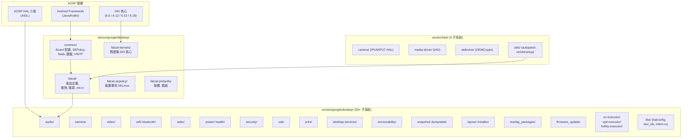
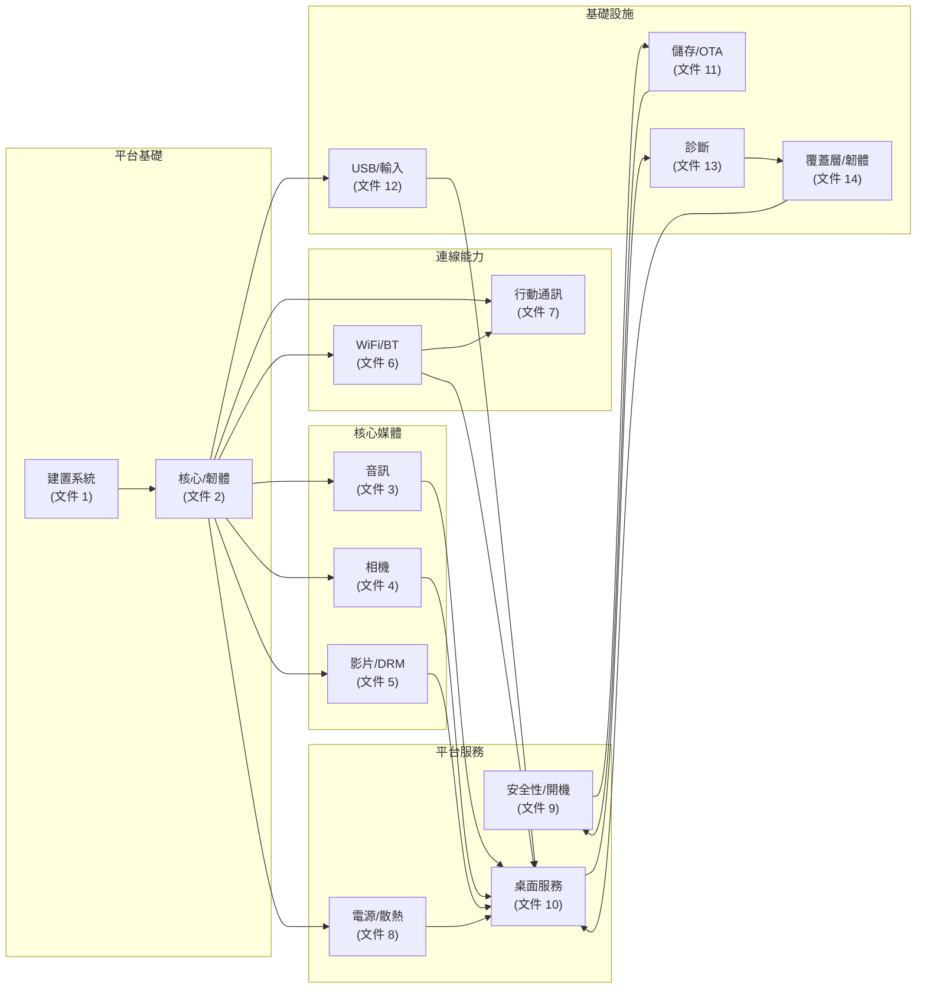
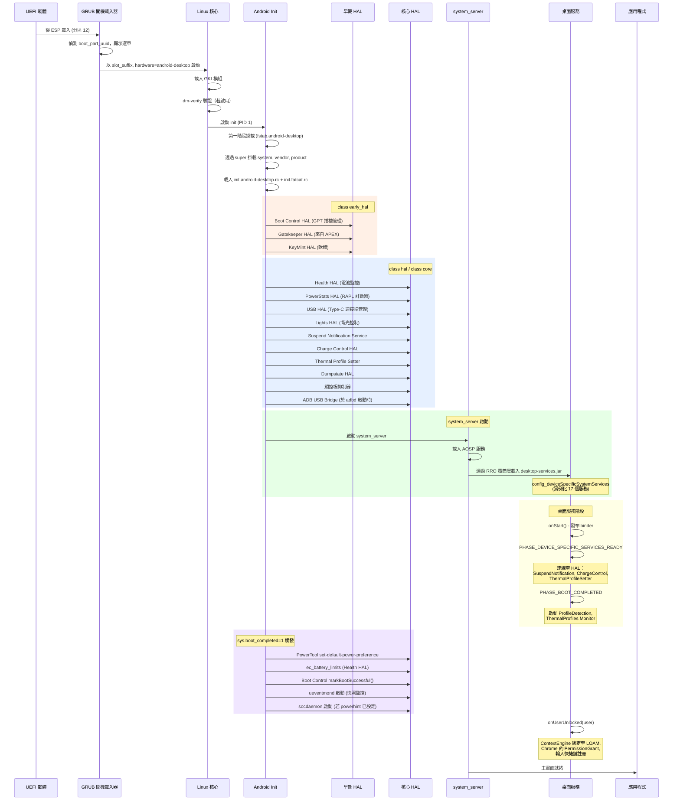
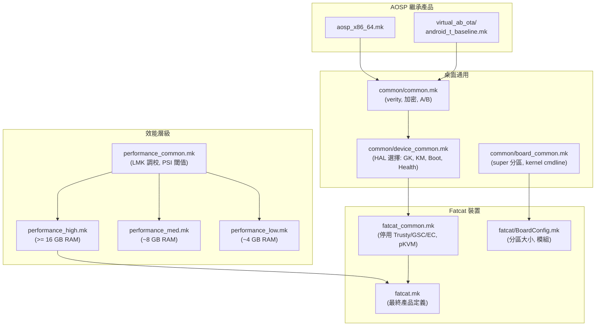
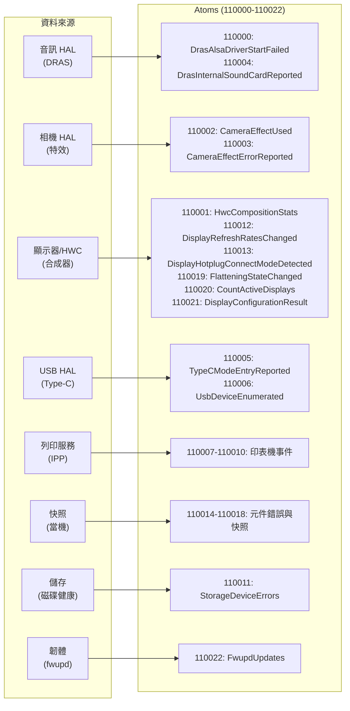

# 主整合文件：Android 桌面平台 (AluminiumOS)

## 1. 系統整體架構

Android 桌面平台 (AluminiumOS，Intel Panther Lake 的代號為「fatcat」) 在 AOSP 的基礎上擴展了桌面專用子系統，分布於三個原始碼樹中。本文件將 14 份子系統層級的實作文件整合為統一的檢視，呈現所有元件之間的互連方式。

### 1.1 三樹原始碼架構



### 1.2 完整系統堆疊

```mermaid
graph TB
    subgraph "應用程式"
        APPS["Android 應用程式"]
        CHROME["Chrome 瀏覽器"]
        SETTINGS["設定"]
        SYSTEMUI["SystemUI"]
    end

    subgraph "Android Framework"
        AM["AudioManager"]
        CM["CameraManager"]
        PM["PowerManager"]
        DSM["DeviceStateManager"]
        TM["TelephonyManager"]
        NET["ConnectivityManager"]
        PRINT_MGR["PrintManager"]
        INPUT["InputManager"]
        THERMAL["ThermalService"]
    end

    subgraph "桌面服務 (system_server)"
        DS_POWER["DesktopPowerService"]
        DS_THERMAL["ThermalProfilesService"]
        DS_RADIO["DesktopRadioService"]
        DS_NET["DesktopNetworkService"]
        DS_AUDIO["AudioDeviceObserver /<br/>AudioVolumeService"]
        DS_DIAG["DiagnosticsService"]
        DS_SNAP["SnapshotSystemService"]
        DS_DRM["DrmNetworkService"]
        DS_PERM["PermissionGrantService"]
        DS_MIGRATE["DataMigrationService"]
        DS_VIDEO_CHAT["VideoChatManager"]
    end

    subgraph "供應商 HAL (AIDL)"
        HAL_AUDIO["DRAS 音訊 HAL<br/>(Rust)"]
        HAL_CAMERA["相機 HAL<br/>(C++)"]
        HAL_CODEC["Codec2 HAL<br/>(Rust+C++)"]
        HAL_WIFI["WiFi HAL<br/>(C++)"]
        HAL_BT["BT HCI HAL<br/>(Rust)"]
        HAL_RADIO["DRILD 行動通訊 HAL<br/>(Rust)"]
        HAL_POWER["PowerStats HAL<br/>(Rust)"]
        HAL_THERMAL["Thermal HAL"]
        HAL_HEALTH["Health HAL<br/>(C++)"]
        HAL_USB["USB HAL<br/>(Rust)"]
        HAL_LIGHTS["燈光 HAL<br/>(C++)"]
        HAL_SENSOR["IIO 感測器 HAL<br/>(C++)"]
        HAL_BOOT["開機控制 HAL<br/>(C++)"]
        HAL_GK["Gatekeeper HAL<br/>(C++, APEX)"]
        HAL_KM["KeyMint HAL"]
        HAL_DUMPSTATE["Dumpstate HAL<br/>(C++)"]
        HAL_FASTBOOT["Fastboot HAL<br/>(Rust)"]
        HAL_CHARGE["充電控制 HAL<br/>(Rust)"]
        HAL_SUSPEND["SuspendNotification<br/>(C++)"]
        HAL_THERMAL_PROF["ThermalProfileSetter<br/>(Rust)"]
    end

    subgraph "Intel 供應商元件"
        INTEL_IPU["IPU7 相機函式庫<br/>(16 個預建置函式庫)"]
        INTEL_IHD["iHD 媒體驅動程式<br/>(VA-API)"]
        INTEL_WIDEVINE["Widevine OEMCrypto<br/>(v16/v17/v19)"]
    end

    subgraph "供應商工具程式"
        SOCDAEMON["socdaemon<br/>(C++)"]
        POWERTOOL["PowerTool<br/>(Rust)"]
        UEVENTMOND["ueventmond<br/>(Rust)"]
        SNAP_COLLECTOR["snapshot_collector<br/>(Rust)"]
        ADB_BRIDGE["ADB USB Bridge<br/>(Rust)"]
        TOUCHPAD_INH["觸控板抑制器<br/>(C++)"]
        EC_EXEC["EC Executor<br/>(Rust)"]
        VPD_EXEC["VPD Executor<br/>(Rust)"]
        FUT_EXEC["Futility Executor<br/>(Rust)"]
        FW_UPDATER["韌體更新器<br/>(Rust)"]
    end

    subgraph "Linux 核心 + 韌體"
        SOF["Intel SOF<br/>(Sound Open Firmware)"]
        IPU_DRV["IPU7 驅動程式"]
        XE_DRV["Intel Xe GPU 驅動程式"]
        IWLWIFI["iwlwifi 驅動程式"]
        BT_DRV["BT HCI 驅動程式"]
        WWAN["WWAN/MBIM 驅動程式"]
        EC_DRV["CrOS EC 驅動程式"]
        RAPL["Intel RAPL"]
        IIO["IIO 子系統"]
        TYPEC["USB Type-C"]
    end

    APPS --> AM & CM & PM & NET & PRINT_MGR
    AM --> DS_AUDIO --> HAL_AUDIO --> SOF
    CM --> HAL_CAMERA --> INTEL_IPU --> IPU_DRV
    PM --> DS_POWER --> HAL_POWER --> RAPL
    DS_POWER --> HAL_SUSPEND --> EC_DRV
    DS_POWER --> HAL_CHARGE --> EC_DRV
    DS_THERMAL --> HAL_THERMAL_PROF --> HAL_THERMAL
    DS_RADIO --> HAL_RADIO --> WWAN
    NET --> DS_NET --> HAL_WIFI --> IWLWIFI
    HAL_BT --> BT_DRV
    HAL_USB --> TYPEC
    HAL_SENSOR --> IIO
    HAL_HEALTH --> EC_DRV
    HAL_CODEC --> INTEL_IHD & INTEL_WIDEVINE
    SOCDAEMON --> HAL_POWER
    POWERTOOL --> RAPL
    UEVENTMOND --> SNAP_COLLECTOR
```



## 2. HAL 介面清單

平台上所有桌面專用的 HAL 介面，依子系統分類整理。

### 2.1 標準 Android HAL

| HAL 介面 | 版本 | 語言 | 封裝方式 | 文件 |
|---------|------|------|---------|------|
| `android.hardware.audio.core` | V2 | Rust (DRAS) | APEX `com.android.hardware.audio` | [文件 3](03-audio-subsystem.md) |
| `android.hardware.camera.provider` | V2 | C++ | 供應商二進位檔 | [文件 4](04-camera-subsystem.md) |
| `android.hardware.media.c2` | V1 | Rust+C++ | APEX `com.android.media.swcodec` | [文件 5](05-video-media-drm.md) |
| `android.hardware.wifi` | V2 | C++ | 供應商二進位檔 | [文件 6](06-wifi-bluetooth-connectivity.md) |
| `android.hardware.bluetooth` | V1 | Rust | APEX `com.android.bthal.desktop` | [文件 6](06-wifi-bluetooth-connectivity.md) |
| `android.hardware.radio` | V3 | Rust (DRILD) | APEX `com.android.hardware.radio` | [文件 7](07-radio-cellular.md) |
| `android.hardware.power.stats` | V2 | Rust | 供應商二進位檔 | [文件 8](08-power-thermal-sensors.md) |
| `android.hardware.thermal` | -- | 組態驅動 | 供應商二進位檔 | [文件 8](08-power-thermal-sensors.md) |
| `android.hardware.health` | V5 | C++ | 供應商二進位檔 | [文件 8](08-power-thermal-sensors.md) |
| `android.hardware.sensors` | V2.1 | C++ (IIO Sub-HAL) | 供應商函式庫 | [文件 8](08-power-thermal-sensors.md) |
| `android.hardware.gatekeeper` | V1 | C++ | APEX `com.android.hardware.gatekeeper.desktop` | [文件 9](09-security-boot-trusty.md) |
| `android.hardware.security.keymint` | -- | Rust/軟體 | System/Vendor | [文件 9](09-security-boot-trusty.md) |
| `android.hardware.security.weaver` | V2 | Rust | 供應商二進位檔（有條件） | [文件 9](09-security-boot-trusty.md) |
| `android.hardware.boot` | V1 | C++ | 供應商二進位檔 | [文件 9](09-security-boot-trusty.md) |
| `android.hardware.fastboot` | V1 | Rust | Recovery 二進位檔 | [文件 9](09-security-boot-trusty.md) |
| `android.hardware.usb` | V4 | Rust | 供應商二進位檔 | [文件 12](12-usb-peripherals-input-print.md) |
| `android.hardware.light` | V2 | C++ | 供應商二進位檔 | [文件 12](12-usb-peripherals-input-print.md) |
| `android.hardware.dumpstate` | V1 | C++ | 供應商二進位檔 | [文件 13](13-serviceability-diagnostics-dumpstate.md) |

### 2.2 桌面專用 AIDL 介面

| 介面 | 服務名稱 | 語言 | 使用者 | 文件 |
|------|---------|------|--------|------|
| `IDesktopPowerChargeControl` | `com.android.desktop.power/default` | Rust | DesktopPowerService | [文件 8](08-power-thermal-sensors.md) |
| `ISuspendNotificationService` | `com.android.desktop.power.ISuspendNotificationService/default` | C++ | DesktopPowerService | [文件 8](08-power-thermal-sensors.md) |
| `IThermalProfileSetter` | `vendor.google.thermal_profile/default` | Rust | ThermalProfilesService | [文件 8](08-power-thermal-sensors.md) |
| `IDrmNetworkService` | `IDrmNetworkService/default` | Kotlin | Widevine DRM | [文件 10](10-desktop-services.md) |
| `IDesktopSettingHealthService` | `IDesktopSettingHealthService/default` | Kotlin | Settings Intelligence | [文件 10](10-desktop-services.md) |
| `IVideoChatManager` | `com.android.desktop.video_chat/default` | Kotlin | 相機特效 | [文件 10](10-desktop-services.md) |
| `ISnapshot` | `com.google.android.snapshot.ISnapshot/default` | Kotlin | snapshot_collector | [文件 13](13-serviceability-diagnostics-dumpstate.md) |
| `IAqueduct` | `com.google.android.aqueduct.IAqueduct/default` | Kotlin | 當機上傳 | [文件 13](13-serviceability-diagnostics-dumpstate.md) |
| `IEcExecutor` | `vendor.google.desktop.IEcExecutor/default` | Rust | 維修服務 | [文件 14](14-overlays-firmware-update-misc.md) |
| `IVpdExecutor` | `vendor.google.desktop.vpd_executor/default` | Rust | RepairMode | [文件 14](14-overlays-firmware-update-misc.md) |
| `IFutilityExecutor` | `vendor.google.desktop.IFutilityExecutor/default` | Rust | 韌體更新 | [文件 14](14-overlays-firmware-update-misc.md) |
| `IProcfsReader` | `vendor.google.desktop.IProcfsReader/default` | Rust | 維修服務 | [文件 14](14-overlays-firmware-update-misc.md) |
| `IServiceabilityService` | bind intent | Kotlin | SDK | [文件 13](13-serviceability-diagnostics-dumpstate.md) |
| `IVendorServiceabilityService` | bind intent | Kotlin | ServiceabilityService | [文件 13](13-serviceability-diagnostics-dumpstate.md) |
| `ICameraToolExecutor` | `vendor.google.desktop/default` | -- | 相機診斷 | [文件 14](14-overlays-firmware-update-misc.md) |

## 3. 跨子系統依賴關係對應

### 3.1 完整系統依賴圖



### 3.2 詳細跨子系統依賴關係

| 提供方 | 消費方 | 介面/機制 | 說明 |
|--------|--------|----------|------|
| **核心 (文件 2)** | 音訊 (文件 3) | Intel SOF 韌體, ALSA 驅動程式 | SOF DSP 韌體從 vendor_dlkm 載入 |
| **核心 (文件 2)** | 相機 (文件 4) | IPU7 核心驅動程式, V4L2 | 相機管線透過 `/dev/video*`, `/dev/ipu*-psys` |
| **核心 (文件 2)** | 影片 (文件 5) | Intel Xe GPU 驅動程式, DRM | iHD 媒體驅動程式透過 DRM ioctls 存取 GPU |
| **核心 (文件 2)** | WiFi (文件 6) | iwlwifi/mt76 驅動程式 | WiFi 韌體從 vendor 分區載入 |
| **核心 (文件 2)** | 藍牙 (文件 6) | BT HCI 驅動程式 | BT 韌體於 init 時載入 |
| **核心 (文件 2)** | 行動通訊 (文件 7) | WWAN/MBIM 驅動程式 | 行動數據機透過 `/dev/wwan*` |
| **核心 (文件 2)** | 電源 (文件 8) | RAPL, cpufreq, thermal zones, CrOS EC | 電源管理的 sysfs 介面 |
| **核心 (文件 2)** | USB (文件 12) | USB Type-C, XHCI | Type-C 連接器類別, DbC 除錯 |
| **核心 (文件 2)** | 診斷 (文件 13) | devcoredump, netlink uevents | 透過 devcoredump 的當機傾印管線 |
| **音訊 (文件 3)** | 桌面服務 (文件 10) | `audioManager.setParameters()` | DRAS 音訊裝置觀察器整合 |
| **相機 (文件 4)** | 影片 (文件 5) | 媒體管線 | 相機預覽/錄影 → 編解碼器管線 |
| **相機 (文件 4)** | 桌面服務 (文件 10) | `IVideoChatManager` | 視訊通話特效（模糊、修飾、補光） |
| **影片 (文件 5)** | 桌面服務 (文件 10) | `IDrmNetworkService` | Widevine HDCP 金鑰配置 HTTP 代理 |
| **WiFi (文件 6)** | 桌面服務 (文件 10) | WiFi HAL → framework | PNO 停用、連線管理員狀態 |
| **行動通訊 (文件 7)** | 桌面服務 (文件 10) | `TelephonyManager` | 合蓋/飛航模式時關閉行動通訊電源 |
| **電源 (文件 8)** | 桌面服務 (文件 10) | `ISuspendNotificationService`, `IDesktopPowerChargeControl`, `IThermalProfileSetter` | 休眠處理、充電限制、散熱設定檔 |
| **電源 (文件 8)** | 桌面服務 (文件 10) | `IPower` / `IPowerExt` | socdaemon → PowerHAL, ProfileDetection → PowerHAL |
| **安全性 (文件 9)** | 儲存 (文件 11) | dm-verity, FBE, AVB | 驗證開機及檔案加密 |
| **安全性 (文件 9)** | 開機 (文件 11) | Boot Control HAL, GPT 屬性 | A/B 插槽管理 |
| **儲存 (文件 11)** | 安全性 (文件 9) | fstab, 分區配置 | 分區配置驅動安全性組態 |
| **USB (文件 12)** | 音訊 (文件 3) | USB 音訊類別 | USB 音訊裝置 → DRAS |
| **USB (文件 12)** | 列印 (文件 12) | IPP-over-USB | USB 印表機透過 ippusb_bridge |
| **診斷 (文件 13)** | 所有子系統 | Stats atoms, dumpstate | 當機收集、遙測、錯誤報告 |
| **覆蓋層 (文件 14)** | Framework | RRO 機制 | 全系統 UI/行為自訂 |
| **覆蓋層 (文件 14)** | 電源 (文件 8) | EC Executor → CrOS EC | 電池、散熱、風扇控制 |
| **覆蓋層 (文件 14)** | 安全性 (文件 9) | Futility Executor → AP 韌體 | OTA 期間的韌體更新 |
| **桌面服務 (文件 10)** | WiFi (文件 6) | WifiController | WiFi 睡眠/恢復管理 |
| **桌面服務 (文件 10)** | 電源 (文件 8) | 設定檔偵測、散熱設定檔 | 影片播放電源提示、散熱策略 |

## 4. 開機流程與初始化順序

### 4.1 完整開機流程



### 4.2 Init 腳本層級結構

```
init.android-desktop.rc          (device/google/desktop/common/)
    |-- import init.common.rc
    |-- import init.fatcat.rc    (device/google/desktop/fatcat/)
    |
    +-- Kernel module loading (insmod from vendor_dlkm, system_dlkm)
    +-- Filesystem permissions (sysfs, procfs, devtmpfs)
    +-- HAL service definitions (class hal, class core)
    +-- Property triggers (sys.boot_completed, vendor.thermal.link_ready)
```

## 5. 組態層級結構

### 5.1 建置時組態鏈



### 5.2 hal_config.xml 系統

`hal_config.xml` 檔案是每個 SKU 的 XML 組態，用於驅動多個子系統中的 HAL 行為：

| 消費方 | 組態鍵 | 用途 |
|--------|--------|------|
| 音訊 HAL (DRAS) | 編解碼器變體、音效卡、效果 | 選擇音訊編解碼器組態 |
| 相機 HAL | 感測器組態、IPU 變體 | 選擇相機管線 |
| 燈光 HAL | 背光裝置 | 選擇背光 sysfs 路徑 |
| EC Executor | EC 裝置類型 | 選擇 CrOS EC 變體 |
| libdev_ids | 硬體描述表 | 裝置識別 |

### 5.3 執行時組態檔案

| 組態檔案 | 位置 | 格式 | 子系統 |
|----------|------|------|--------|
| `thermal_info_config.json` | `/vendor/etc/` | JSON | Thermal HAL - 區域、PID、風扇 |
| `powerhint.json` / `powerhint_cpus_*.json` | `/vendor/etc/power/` | JSON | Power HAL - EPP、cpusets、提示 |
| `perf_policy.json` | `/vendor/etc/` | JSON | ProfileDetection - 影片播放偵測 |
| `thermal_profile_config.xml` | `/vendor/etc/` | XML | ThermalProfiles - 條件式設定檔 |
| `grub.cfg` | ESP `/EFI/BOOT/` | GRUB | 開機選單、kernel cmdline |
| `fstab.android-desktop` | vendor_ramdisk | fstab | 檔案系統掛載、AVB、加密 |
| `disk_layout.json` | 建置時 | JSON | GPT 分區配置定義 |

### 5.4 關鍵建置旗標 (Fatcat)

| 旗標 | 值 | 效果 |
|------|---|------|
| `DESKTOP_USE_TRUSTY_GK_KM` | `false` | 軟體 Gatekeeper + KeyMint |
| `DESKTOP_DISABLE_TRUSTY_VM` | `true` | 無 Trusty 安全 VM |
| `DESKTOP_DISABLE_GSC` | `true` | 無 Google Security Chip |
| `DESKTOP_DISABLE_EC` | `true` | 無 Chrome EC 工具 (ectool, timberslide) |
| `USE_VERITY_AND_ENCRYPTION` | `true` | dm-verity + 檔案型加密 |
| `SKIP_FW_STATUS` | `true` | 略過 crossystem 韌體狀態 |
| `PRODUCT_VIRTUAL_AB_COMPRESSION` | `true` | LZ4 壓縮的 Virtual A/B OTA |
| `PRODUCT_BUILD_PVMFW_IMAGE` | `true` | 建置 pKVM 韌體 |

## 6. 分區配置與模組分布

### 6.1 分區對應表

```
GPT 磁碟配置 (31 個分區)
================================================
 #9  ota_recovery_a    128 MiB  (磁碟上最先)
 #12 EFI-SYSTEM         64 MiB  (GRUB + kernel + ramdisk)
 #2  KERN-A              32 MiB
 #3  super             8192 MiB  (動態分區)
       +-- system_a          (AOSP + 桌面 framework)
       +-- vendor_a          (HAL、原生常駐程式)
       +-- product_a         (13 個 RRO 覆蓋層、應用程式)
       +-- system_ext_a      (維修服務、Trusty、臉部解鎖)
       +-- system_dlkm_a     (系統核心模組)
       +-- vendor_dlkm_a     (供應商核心模組、韌體)
 #13 boot_a              64 MiB
 #14 boot_b              64 MiB
 #15 vbmeta_a             4 MiB
 #16 vbmeta_b             4 MiB
 #17 metadata         16-64 MiB  (加密金鑰)
 #18 init_boot_a         32 MiB
 #19 init_boot_b         32 MiB
 #20 vendor_boot_a       32 MiB  (fstab, vendor ramdisk)
 #21 vendor_boot_b       32 MiB
 #22 pvmfw_a              4 MiB  (pKVM 韌體)
 #23 pvmfw_b              4 MiB
 #24 misc                 4 MiB  (開機控制、fastboot 設定)
 #27 recovery_a          32 MiB
 #28 recovery_b          32 MiB
 #29 desktop_security_persist  16 MiB
 #30 desktop_security_storage  32 MiB
 #31 frp_persist           2 MiB
 #1  userdata          4 GiB+   (擴展以填滿磁碟)
 #10 ota_recovery_b   128 MiB  (磁碟上最後)
```

### 6.2 各分區模組分布

| 分區 | 關鍵元件 | 語言 |
|------|---------|------|
| **system** | AOSP framework、韌體更新器、資料遷移、SettingsSync、RepairMode | Java/Kotlin, C++ |
| **system_ext** | 維修服務堆疊、DiagnosticsService、Trusty（fatcat 上已停用）、Toscana 臉部解鎖、SEPolicy | Kotlin, Rust |
| **vendor** | 所有 HAL、原生常駐程式 (socdaemon, powertool, ueventmond, snapshot_collector, ADB bridge, 觸控板抑制器)、EC/VPD/Futility executor、共享函式庫 | Rust, C++, Shell |
| **vendor_dlkm** | Intel SOF 韌體、WiFi/BT 韌體、GPU/媒體韌體、核心模組 | 二進位 blob |
| **system_dlkm** | GKI 核心模組 | 二進位 |
| **product** | 13 個 RRO 覆蓋層、IppPrintService、遊戲輸入、SnapshotService | XML, Kotlin/Java |

### 6.3 APEX 套件

| APEX | 內容 | 分區 |
|------|------|------|
| `com.android.hardware.audio` | DRAS 音訊 HAL | vendor |
| `com.android.hardware.gatekeeper.desktop` | 軟體 Gatekeeper | vendor |
| `com.android.bthal.desktop` | 藍牙 HCI HAL | vendor |
| `com.android.hardware.radio` | DRILD 行動通訊 HAL | vendor |

## 7. SEPolicy 架構

### 7.1 三層式 SEPolicy

```
第 1 層：AOSP 基礎策略
    |
第 2 層：桌面通用 (device/google/desktop/common/sepolicy/)
    |-- 供應商策略：30+ HAL 網域、工具程式網域
    |-- System ext 策略：Trusty, GSC, PinWeaver, KeyMint 網域
    |-- 檔案上下文：供應商二進位檔、區塊裝置、GPU/相機/媒體裝置
    |-- GenFS 上下文：背光、韌體、GPU、USB 的 sysfs 標籤
    |-- 屬性上下文：vendor.audio.*, vendor.mesa.*, vendor.device.*
    |
第 3 層：裝置專用 (device/google/desktop/fatcat-sepolicy/)
    |-- Fatcat 專用 genfs：GPU PCI 設定、鍵盤背光、工作負載提示、SoC 滑桿
    |-- Fatcat 專用網域：NPU 裝置、Widevine DRM、vold
```

### 7.2 各子系統關鍵 SEPolicy 網域

| 子系統 | SELinux 網域 |
|--------|-------------|
| 音訊 | `hal_audio_default` |
| 相機 | `hal_camera_default` |
| 影片/DRM | `mediacodec`, `hal_drm_widevine` |
| WiFi | `hal_wifi_default` |
| 藍牙 | `bluetooth` |
| 行動通訊 | `hal_radio_default` |
| 電源 | `hal_power_stats_default`, `hal_power_default`, `powertool`, `thermal_profile_setter`, `hal_desktop_charge_control_default` |
| 安全性 | `hal_gatekeeper_desktop`, `hal_weaver_desktop`, `hal_keymint_strongbox_desktop`, `gscd`, `pinweaver_storage` |
| USB | `hal_usb_impl`, `adb_usb_bridge` |
| 燈光 | `hal_light_default` |
| 診斷 | `hal_dumpstate_default`, `vendor_snapshot` |
| 輸入 | `touchpad_inhibitor` |
| GPU | `hal_graphics_allocator_default`, `hal_graphics_composer_default`, `gpu_counters` |
| 系統 | `init`, `kernel`, `domain`, `system_server`, `surfaceflinger`, `recovery` |
| 工具程式 | `ectool_vendor`, `fwupd`, `ehide`, `sshforwarder`, `modetest`, `get_variant` |

## 8. 遙測與診斷整合

### 8.1 Stats Atoms（23 個桌面專用供應商 Atoms）



### 8.2 當機傾印管線

```
硬體當機 (GPU/WiFi/BT)
  --> 核心 devcoredump
    --> ueventmond (netlink uevent 監控器)
      --> snapshot_collector (讀取 devcoredump，識別子系統)
        --> ComponentErrorDetected statsd atom
        --> 儲存至 /data/vendor_ce/<USER>/dumps/
        --> 廣播至 SnapshotService
          --> DropBoxManager ("DesktopFirmwareCrash")
          --> Aqueduct (雲端上傳)
        --> Dumpstate HAL 讀取已儲存的傾印用於錯誤報告
```

### 8.3 錯誤報告內容

Dumpstate HAL 在錯誤報告期間收集 18 個以上的區段：
- AP 韌體日誌、DRM 追蹤、中斷、PSI 指標
- 顯示器資訊（modetest、EDID 解碼 -- 含序號清除）
- USB-C PD 資訊（typec_dump.sh -- 每個連接埠的狀態與探索結果）
- 已儲存的當機傾印（透過 snapshot_collector 讀取）
- EC 資訊（版本、晶片資訊、CBI、散熱）
- 韌體資訊（crossystem、futility 寫入保護/GBB 旗標）

## 9. CrOS EC（嵌入式控制器）整合

Chrome OS 嵌入式控制器是桌面平台的中央整合點，連接 6 個以上的子系統：

```mermaid
graph TB
    EC["CrOS 嵌入式控制器"]

    subgraph "電源管理 (文件 8)"
        CHARGE["充電控制 HAL<br/>電池維持/速率限制"]
        SUSPEND["休眠通知<br/>/dev/suspend_notifier"]
        HEALTH["Health HAL<br/>電池 SoC 轉換"]
        BATTERY_LIMITS["ec_battery_limits<br/>顯示 SoC 閾值"]
    end

    subgraph "散熱管理 (文件 8)"
        THERMAL_SENSORS["散熱感測器<br/>TSR0-TSR3"]
        FAN["風扇控制<br/>TFN1 冷卻裝置"]
    end

    subgraph "診斷 (文件 13-14)"
        EC_EXECUTOR["EC Executor<br/>AIDL 服務"]
        DUMPSTATE_EC["Dumpstate HAL<br/>ectool cbi/version/chipinfo"]
        SERVICEABILITY["維修服務<br/>電池/散熱/風扇/LED"]
    end

    subgraph "安全性 (文件 9)"
        WRITE_PROTECT["寫入保護<br/>EC/FP 韌體保護"]
    end

    subgraph "輸入 (文件 12)"
        KBD["CrOS EC 鍵盤<br/>(cros_ec.idc)"]
        LID["上蓋開關<br/>(觸控板抑制器)"]
    end

    EC --> CHARGE & SUSPEND & HEALTH & BATTERY_LIMITS
    EC --> THERMAL_SENSORS & FAN
    EC --> EC_EXECUTOR & DUMPSTATE_EC & SERVICEABILITY
    EC --> WRITE_PROTECT
    EC --> KBD & LID
```



## 10. 桌面服務整合中心

桌面服務 (文件 10) 作為中央 Framework 層級的協調層，與幾乎所有其他子系統整合：

### 10.1 服務註冊（17 個服務，依載入順序排列）

| # | 服務 | 主要依賴項 |
|---|------|-----------|
| 1 | DesktopContextEngineService | LOAM 應用程式綁定 |
| 2 | DesktopDataMigrationService | 檔案系統存取 |
| 3 | DesktopDiagnosticsService | /proc, sysfs 指標 |
| 4 | DesktopDrmNetworkService | ConnectivityManager, HTTP |
| 5 | DesktopUserChangeBroadcastService | BetterBug 應用程式 |
| 6 | DesktopAudioDeviceObserverService | AudioManager, DRAS |
| 7 | DesktopAudioVolumeService | AudioManager, DRAS |
| 8 | DesktopPermissionGrantService | RoleManager |
| 9 | DesktopRadioService | TelephonyManager, DeviceStateManager |
| 10 | DesktopRepairModeService | DynamicSystemManager |
| 11 | DesktopNetworkService | ConnectivityManager, WifiManager |
| 12 | DesktopPowerService | SuspendNotification, ChargeControl, PowerHAL, DeviceStateManager |
| 13 | ThermalProfilesService | ThermalService, ThermalProfileSetter, DeviceStateManager |
| 14 | SettingsSyncService | ContentResolver |
| 15 | SnapshotSystemService | snapshot_collector, SnapshotService 應用程式 |
| 16 | DesktopVideoChatManager | 相機特效 HAL |
| 17 | DesktopUserInitializeService | InputManager |

### 10.2 裝置狀態管理

`DesktopDeviceStateProvider` 產生四種狀態，並串聯影響多個服務：

```
硬體事件 (上蓋、平板模式、外部顯示器)
  --> DesktopDeviceStateProvider
    --> DeviceStateManager
      --> DesktopPowerService (媒體暫停、靜音、喚醒鎖、打盹)
      --> DesktopRadioService (行動通訊電源關閉)
      --> ThermalProfilesService (散熱設定檔選擇)
      --> DesktopInputDeviceController (鍵盤/觸控板停用)
```

| 狀態 | 條件 | 動作 |
|------|------|------|
| CLOSED | 上蓋關閉、無外部顯示器 | 觸發睡眠、媒體暫停、音訊靜音、停用喚醒鎖、關閉行動通訊 |
| DOCKED | 上蓋關閉 + 有外部顯示器 | 不睡眠、繼續運行 |
| OPEN | 上蓋開啟、平板模式關閉 | 觸發喚醒、取消靜音、啟用喚醒鎖 |
| TABLET | 上蓋開啟、平板模式開啟 | 觸發喚醒、停用內部輸入裝置 |

## 11. VINTF 與相容性矩陣

### 11.1 Framework 相容性矩陣（選用 HAL）

Framework 相容性矩陣（`device/google/desktop/common/compatibility_matrix.xml`）宣告了 7 個選用的供應商 HAL 介面：

| HAL | 介面 | 穩定性 |
|-----|------|--------|
| `vendor.google.desktop` | `IProcfsReader` | VINTF |
| `vendor.google.desktop` | `IFutilityExecutor` | VINTF |
| `vendor.google.desktop` | `IEcExecutor` | VINTF |
| `vendor.google.desktop` | `ICameraToolExecutor` | VINTF |
| `vendor.google.desktop.vpd_executor` | `IVpdExecutor` | VINTF |
| `com.android.desktop.power` | `ISuspendNotificationService` | VINTF |
| `com.android.desktop.power` | `IDesktopPowerChargeControl` | VINTF |

### 11.2 裝置清單 (fatcat)

fatcat 的清單為空（`target-level="202604"`），完全依賴各個 HAL 套件的 VINTF 片段。

## 12. 程式語言分布

平台使用多種針對各子系統最佳化的程式語言：

| 語言 | 主要用途 | 關鍵元件 |
|------|---------|---------|
| **Rust** | HAL、系統常駐程式 | DRAS audio, USB HAL, DRILD radio, BT HCI, PowerStats, Charge Control, Thermal Profile Setter, Fastboot, Weaver, ADB Bridge, snapshot_collector, ueventmond, dump_trigger, EC/VPD/Futility executors, ProcFS reader, firmware updater, storage_metrics |
| **C++** | HAL、傳統元件 | Camera HAL, Health HAL, Boot Control, Dumpstate, Lights HAL, Suspend Notification, socdaemon, touchpad inhibitor, disk_info, vkbench, data migration, ModetestHelper, IIO Sensor HAL |
| **Kotlin** | Framework 服務、應用程式 | 全部 17 個桌面服務、ServiceabilityService、VendorServiceabilityService、SnapshotService、RepairMode、SettingsSync、IppPrintService、InputDebugTool、LockedQuiz |
| **Java** | SDK、函式庫 | Serviceability SDK, GameControlsInputProcessorLib |
| **Shell** | 建置/安裝腳本 | pack_image, build_esp_image, android-desktop-install, autopatch.sh, vendorsetup.sh, typec_dump.sh, fw-updater-wrapper |
| **Python** | 建置/主機工具 | regen_partition_script.py, fat32_add_file.py, deflash.py, replace_prebuilts.py |
| **XML** | 組態 | 13 個 RRO 覆蓋層、SEPolicy、VINTF 清單、散熱/電源組態 |
| **JSON** | 組態 | disk_layout, thermal_info_config, powerhint, perf_policy, keyboard-layout |

## 13. 執行時資源覆蓋層（13 個產品覆蓋層）

| 覆蓋層 | 目標 | 關鍵效果 |
|--------|------|---------|
| FrameworkDesktopOverlay | `android` | 停用 Dock 上的夢境、Google Sans 字型、相機相容性 |
| SystemUIDesktopOverlay | SystemUI | 桌面 QS 磚塊、彈跳器使用者切換器、停用模糊效果 |
| SettingsDesktopOverlay | Settings | 隱藏緊急功能、私有 WiFi、強制鎖定畫面安全性 |
| WifiDesktopOverlay | WiFi framework | 5/6 GHz、WPA3-SAE、MAC 隨機化 |
| DocumentsUIGoogleOverlay | Files | Backpack 檢視器、LOAM 搜尋、停用行動功能 |
| MediaProviderDesktopOverlay | MediaProvider | 略過行動資料夾（鬧鐘、鈴聲等） |
| NexusLauncherDesktopOverlay | Launcher | `desktop_form_factor=true` |
| WallpaperPickerDesktopOverlay | Wallpaper Picker | `isDesktopUi=true` |
| SettingsProviderStayOnWhilePluggedInOverlay | Settings Provider | 插電時保持螢幕常亮 |
| SetupWizardDesktopOverlay | Setup Wizard | 清除退出動作 |
| CarrierConfigOverlayDesktop | Carrier Config | ChromeOS 的 eSIM/pSIM 插槽對應 |
| EuiccOverlay | eUICC | eSIM 插槽組態 |
| ResolverActivityDesktopOverlay | Framework | 桌面風格的應用程式選擇對話框 |

## 14. 功能旗標 (aconfig)

| 套件 | 旗標 | 子系統 |
|------|------|--------|
| `com.android.desktop.services.flags` | `enable_charge_limit`, `enable_aqueduct_binder_service`, `disable_internal_input_devices_in_tablet_mode`, `enable_desktop_permission_grant_service`, `enable_desktop_radio_service`, `enable_desktop_repair_mode_service` | 桌面服務 |
| `com.google.android.desktop.snapshot.flags` | `enable_snapshot_collector`, `enable_snapshot_service`, `enable_uevent_monitor`, `enable_gpu_snapshot`, `enable_wifi_snapshot`, `enable_bluetooth_snapshot`, `enable_gpu_crash_uploading_to_aqueduct` | 快照/診斷 |
| `com.android.desktop.usb.flags` | `log_usb_metrics` | USB HAL |
| `com.android.desktop.usb.adb_over_usb` | `enable_adb_over_dbc`, `enable_adb_over_usb_pl27a1_dongle`, `enable_adb_over_dbc_c_to_c` | ADB Bridge |
| `com.android.desktop.printservice.flags` | `add_missing_desktop_telemetry`, `enable_legacy_print`, `update_ui_26q2`, `manually_add_printer`, `support_old_color_mode`, `enable_job_release_with_pin` | 列印服務 |
| `vendor.google.desktop.overlay.flags` | `use_dialog_layout` | Resolver 覆蓋層 |
| `com.google.android.desktop.libhalconfig_rust.flags` | HAL 組態旗標 | HAL 組態 |
| `com.google.android.gaming` | 遊戲控制旗標 | 遊戲輸入 |
| `com.google.android.desktop.repairmode.flags` | `restrictedEnvironment` | 維修模式 |

## 15. 測試基礎設施

| 子系統 | 測試類型 | 關鍵測試模組 |
|--------|---------|-------------|
| 音訊 (文件 3) | 單元測試、整合測試 | DRAS tests, parameter_parser tests |
| 相機 (文件 4) | CTS、供應商測試 | Camera CTS, camera tool |
| WiFi/BT (文件 6) | 單元測試、CTS | WiFi HAL tests, BT HCI tests |
| 行動通訊 (文件 7) | 單元測試 | DRILD unit tests |
| 電源 (文件 8) | 檢測測試 | DesktopPowerServiceTest, ChargingOptimizationTest, DeviceStateProviderTest |
| 安全性 (文件 9) | CTS | VTS, CTS security |
| 桌面服務 (文件 10) | 單元測試、檢測測試、效能基準 | Robolectric (diagnostics), AndroidJUnit (power, thermal, input, radio, data migration) |
| USB (文件 12) | 單元測試、主機測試 | desktop_usb_hal_test, adb-usb-bridge_test |
| 列印 (文件 12) | 單元測試、主機測試、Robolectric | libippusb_bridge_test, IppPrintServiceRobolectricTest |
| 診斷 (文件 13) | 單元測試、主機測試 | desktop_modetest_helper_test |
| 共享函式庫 (文件 14) | 單元測試 | libhalconfig_rust_test, libdev_ids tests |

## 16. 文件交叉參考索引

| 文件 | 標題 | 主要範圍 |
|------|------|---------|
| [文件 1](01-platform-architecture-build-system.md) | 平台架構與建置系統 | 三樹架構、產品層級結構、建置流程、VINTF |
| [文件 2](02-kernel-modules-firmware.md) | 核心、模組與韌體 | GKI 核心、模組分區、韌體 blob、ueventd |
| [文件 3](03-audio-subsystem.md) | 音訊子系統 | DRAS、SOF、ALSA/UCM、7 種編解碼器變體、Dolby、APEX |
| [文件 4](04-camera-subsystem.md) | 相機子系統 | IPU7 HAL、USB+MIPI 雙路徑、臉部偵測、16 個 Intel 函式庫 |
| [文件 5](05-video-media-drm.md) | 影片、媒體與 DRM/Widevine | cros-codecs-codec2、iHD 驅動程式、Widevine OEMCrypto v19 |
| [文件 6](06-wifi-bluetooth-connectivity.md) | WiFi、藍牙與連線能力 | WiFi HAL、SAR、BT HCI (Rust)、6 種晶片變體、ehide |
| [文件 7](07-radio-cellular.md) | 行動通訊與電話功能 | DRILD (Rust)、RadioFwd、MBIM、eSIM、APN、APEX |
| [文件 8](08-power-thermal-sensors.md) | 電源、散熱與感測器 | PowerStats (RAPL)、PowerTool、Thermal PID、IIO 感測器、Health HAL |
| [文件 9](09-security-boot-trusty.md) | 安全性、開機與 Trusty | Gatekeeper、Weaver、KeyMint、Boot Control (GPT)、Fastboot、SEPolicy |
| [文件 10](10-desktop-services.md) | 桌面服務 | 17 個 SystemService、socdaemon、裝置狀態、電源/散熱協調 |
| [文件 11](11-storage-layout-ota-provisioning.md) | 儲存、配置、OTA 與佈建 | GPT 配置、ESP/GRUB、安裝程式、Virtual A/B、fstab |
| [文件 12](12-usb-peripherals-input-print.md) | USB、周邊裝置、輸入與列印 | USB HAL (Rust)、ADB bridge、IPP 列印、鍵盤/觸控板、遊戲 |
| [文件 13](13-serviceability-diagnostics-dumpstate.md) | 維修服務、診斷與 Dumpstate | 三層式維修服務、dumpstate、快照管線、23 個 stats atoms |
| [文件 14](14-overlays-firmware-update-misc.md) | 覆蓋層、韌體更新與其他 | 13 個 RRO、韌體更新、EC/VPD/Futility executor、共享函式庫 |

## 17. 關鍵架構決策

| 決策 | 理由 | 影響 |
|------|------|------|
| 新 HAL 使用 Rust | 記憶體安全、AIDL Rust 支援 | DRAS、USB、BT、Radio、PowerStats、Charge Control、Fastboot、Weaver、snapshot 工具全部使用 Rust |
| 模組化 HAL 使用 APEX | 可獨立更新 | Audio、Gatekeeper、Bluetooth、Radio 封裝為 APEX |
| 桌面服務作為 SystemService | Framework 層級整合、裝置狀態協調 | 17 個服務整合在單一 JAR 中載入 system_server |
| GPT 型 A/B（非 ChromeOS 風格） | 直接 GPT 屬性操作 | Boot Control HAL 透過 GPT 屬性管理插槽優先順序/成功狀態 |
| Virtual A/B 搭配 LZ4 壓縮 | 節省磁碟空間、無縫更新 | 在 8 GiB super 分區內使用 COW 快照 |
| 三層式 SEPolicy | 通用/裝置/Trusty 策略的分離 | 清晰的策略繼承、有條件的 Trusty 覆蓋層 |
| hal_config.xml 每 SKU 組態 | 支援多種硬體變體 | 單一程式碼庫、每裝置 XML 組態 |
| CrOS EC 作為整合中心 | 利用 ChromeOS 硬體生態系統 | 電池、散熱、風扇、LED、休眠、鍵盤全部透過 EC |
| RRO 覆蓋層用於 UI 自訂 | 無需修改 framework 原始碼 | 13 個覆蓋層將 AOSP UI 調整為桌面形式因素 |
| 功能旗標 (aconfig) | 受控發布、每裝置啟用 | 跨子系統超過 30 個以上的旗標 |

## 18. 已知限制 (Fatcat)

| 限制 | 已停用元件 | 替代方案 |
|------|-----------|---------|
| 無 Trusty VM | `DESKTOP_DISABLE_TRUSTY_VM=true` | 軟體 Gatekeeper + KeyMint |
| 無 GSC/Ti50 | `DESKTOP_DISABLE_GSC=true` | 無硬體信任根 |
| 無 Chrome EC 工具 | `DESKTOP_DISABLE_EC=true` | EC Executor AIDL 服務 |
| 略過韌體狀態 | `SKIP_FW_STATUS=true` | UEFI 開機（非 ChromeOS ACPI） |
| 無 Headless System User Mode | `DESKTOP_DISABLE_HSUM=true` | 標準多使用者 |
| 無 vboot 支援 | `PRODUCT_SUPPORTS_VBOOT=`（空） | 僅 UEFI Secure Boot |
