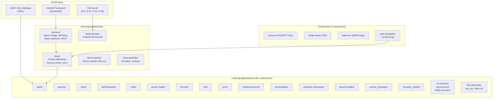
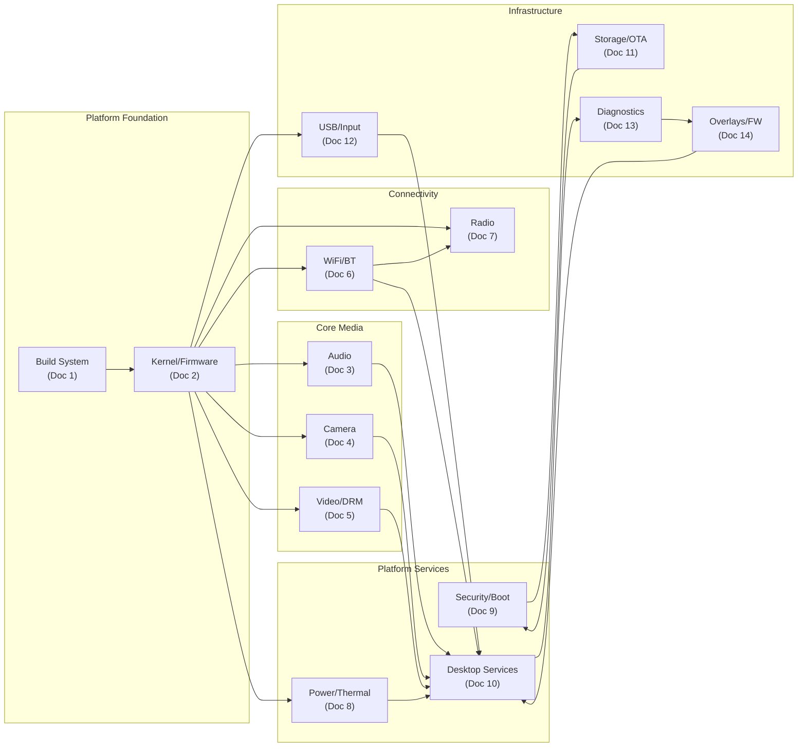
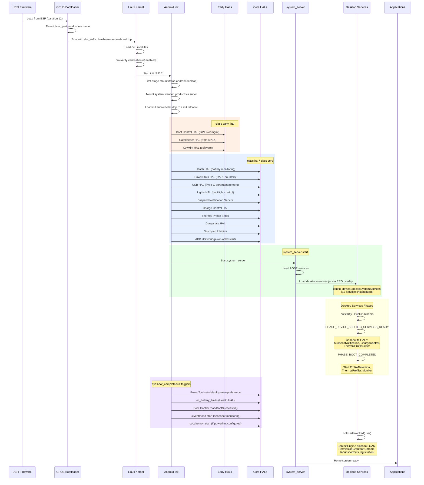
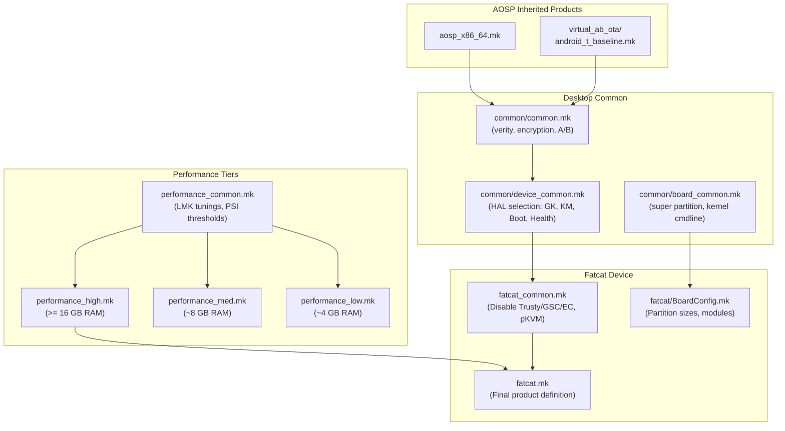
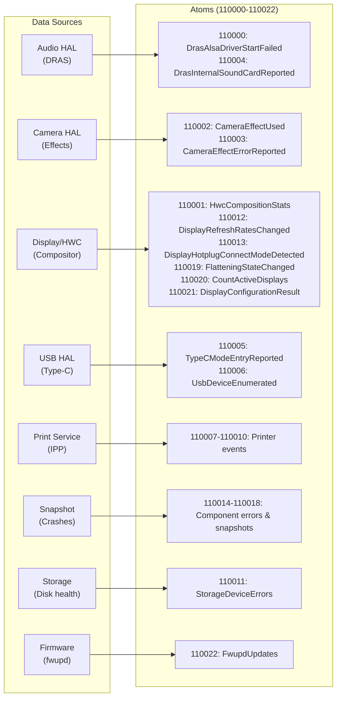

# Master Integration Document: Android Desktop Platform (AluminiumOS)

## 1. System-Wide Architecture

The Android Desktop Platform (AluminiumOS, codename "fatcat" for Intel Panther Lake) extends AOSP with desktop-specific subsystems organized across three source trees. This document synthesizes the 14 subsystem-level implementation documents into a unified view of how all components interconnect.

### 1.1 Three-Tree Source Architecture



### 1.2 Full System Stack

```mermaid
graph TB
    subgraph "Applications"
        APPS["Android Apps"]
        CHROME["Chrome Browser"]
        SETTINGS["Settings"]
        SYSTEMUI["SystemUI"]
    end

    subgraph "Android Framework"
        AM["AudioManager"]
        CM["CameraManager"]
        PM["PowerManager"]
        DSM["DeviceStateManager"]
        TM["TelephonyManager"]
        NET["ConnectivityManager"]
        PRINT_MGR["PrintManager"]
        INPUT["InputManager"]
        THERMAL["ThermalService"]
    end

    subgraph "Desktop Services (system_server)"
        DS_POWER["DesktopPowerService"]
        DS_THERMAL["ThermalProfilesService"]
        DS_RADIO["DesktopRadioService"]
        DS_NET["DesktopNetworkService"]
        DS_AUDIO["AudioDeviceObserver /<br/>AudioVolumeService"]
        DS_DIAG["DiagnosticsService"]
        DS_SNAP["SnapshotSystemService"]
        DS_DRM["DrmNetworkService"]
        DS_PERM["PermissionGrantService"]
        DS_MIGRATE["DataMigrationService"]
        DS_VIDEO_CHAT["VideoChatManager"]
    end

    subgraph "Vendor HALs (AIDL)"
        HAL_AUDIO["DRAS Audio HAL<br/>(Rust)"]
        HAL_CAMERA["Camera HAL<br/>(C++)"]
        HAL_CODEC["Codec2 HAL<br/>(Rust+C++)"]
        HAL_WIFI["WiFi HAL<br/>(C++)"]
        HAL_BT["BT HCI HAL<br/>(Rust)"]
        HAL_RADIO["DRILD Radio HAL<br/>(Rust)"]
        HAL_POWER["PowerStats HAL<br/>(Rust)"]
        HAL_THERMAL["Thermal HAL"]
        HAL_HEALTH["Health HAL<br/>(C++)"]
        HAL_USB["USB HAL<br/>(Rust)"]
        HAL_LIGHTS["Lights HAL<br/>(C++)"]
        HAL_SENSOR["IIO Sensor HAL<br/>(C++)"]
        HAL_BOOT["Boot Control HAL<br/>(C++)"]
        HAL_GK["Gatekeeper HAL<br/>(C++, APEX)"]
        HAL_KM["KeyMint HAL"]
        HAL_DUMPSTATE["Dumpstate HAL<br/>(C++)"]
        HAL_FASTBOOT["Fastboot HAL<br/>(Rust)"]
        HAL_CHARGE["ChargeControl HAL<br/>(Rust)"]
        HAL_SUSPEND["SuspendNotification<br/>(C++)"]
        HAL_THERMAL_PROF["ThermalProfileSetter<br/>(Rust)"]
    end

    subgraph "Intel Vendor Components"
        INTEL_IPU["IPU7 Camera Libs<br/>(16 prebuilt libs)"]
        INTEL_IHD["iHD Media Driver<br/>(VA-API)"]
        INTEL_WIDEVINE["Widevine OEMCrypto<br/>(v16/v17/v19)"]
    end

    subgraph "Vendor Utilities"
        SOCDAEMON["socdaemon<br/>(C++)"]
        POWERTOOL["PowerTool<br/>(Rust)"]
        UEVENTMOND["ueventmond<br/>(Rust)"]
        SNAP_COLLECTOR["snapshot_collector<br/>(Rust)"]
        ADB_BRIDGE["ADB USB Bridge<br/>(Rust)"]
        TOUCHPAD_INH["Touchpad Inhibitor<br/>(C++)"]
        EC_EXEC["EC Executor<br/>(Rust)"]
        VPD_EXEC["VPD Executor<br/>(Rust)"]
        FUT_EXEC["Futility Executor<br/>(Rust)"]
        FW_UPDATER["Firmware Updater<br/>(Rust)"]
    end

    subgraph "Linux Kernel + Firmware"
        SOF["Intel SOF<br/>(Sound Open Firmware)"]
        IPU_DRV["IPU7 Driver"]
        XE_DRV["Intel Xe GPU Driver"]
        IWLWIFI["iwlwifi Driver"]
        BT_DRV["BT HCI Driver"]
        WWAN["WWAN/MBIM Driver"]
        EC_DRV["CrOS EC Driver"]
        RAPL["Intel RAPL"]
        IIO["IIO Subsystem"]
        TYPEC["USB Type-C"]
    end

    APPS --> AM & CM & PM & NET & PRINT_MGR
    AM --> DS_AUDIO --> HAL_AUDIO --> SOF
    CM --> HAL_CAMERA --> INTEL_IPU --> IPU_DRV
    PM --> DS_POWER --> HAL_POWER --> RAPL
    DS_POWER --> HAL_SUSPEND --> EC_DRV
    DS_POWER --> HAL_CHARGE --> EC_DRV
    DS_THERMAL --> HAL_THERMAL_PROF --> HAL_THERMAL
    DS_RADIO --> HAL_RADIO --> WWAN
    NET --> DS_NET --> HAL_WIFI --> IWLWIFI
    HAL_BT --> BT_DRV
    HAL_USB --> TYPEC
    HAL_SENSOR --> IIO
    HAL_HEALTH --> EC_DRV
    HAL_CODEC --> INTEL_IHD & INTEL_WIDEVINE
    SOCDAEMON --> HAL_POWER
    POWERTOOL --> RAPL
    UEVENTMOND --> SNAP_COLLECTOR
```



## 2. HAL Interface Inventory

All desktop-specific HAL interfaces across the platform, organized by subsystem.

### 2.1 Standard Android HALs

| HAL Interface | Version | Language | Packaging | Document |
|--------------|---------|----------|-----------|----------|
| `android.hardware.audio.core` | V2 | Rust (DRAS) | APEX `com.android.hardware.audio` | [Doc 3](03-audio-subsystem.md) |
| `android.hardware.camera.provider` | V2 | C++ | Vendor binary | [Doc 4](04-camera-subsystem.md) |
| `android.hardware.media.c2` | V1 | Rust+C++ | APEX `com.android.media.swcodec` | [Doc 5](05-video-media-drm.md) |
| `android.hardware.wifi` | V2 | C++ | Vendor binary | [Doc 6](06-wifi-bluetooth-connectivity.md) |
| `android.hardware.bluetooth` | V1 | Rust | APEX `com.android.bthal.desktop` | [Doc 6](06-wifi-bluetooth-connectivity.md) |
| `android.hardware.radio` | V3 | Rust (DRILD) | APEX `com.android.hardware.radio` | [Doc 7](07-radio-cellular.md) |
| `android.hardware.power.stats` | V2 | Rust | Vendor binary | [Doc 8](08-power-thermal-sensors.md) |
| `android.hardware.thermal` | -- | Config-based | Vendor binary | [Doc 8](08-power-thermal-sensors.md) |
| `android.hardware.health` | V5 | C++ | Vendor binary | [Doc 8](08-power-thermal-sensors.md) |
| `android.hardware.sensors` | V2.1 | C++ (IIO Sub-HAL) | Vendor library | [Doc 8](08-power-thermal-sensors.md) |
| `android.hardware.gatekeeper` | V1 | C++ | APEX `com.android.hardware.gatekeeper.desktop` | [Doc 9](09-security-boot-trusty.md) |
| `android.hardware.security.keymint` | -- | Rust/Software | System/Vendor | [Doc 9](09-security-boot-trusty.md) |
| `android.hardware.security.weaver` | V2 | Rust | Vendor binary (conditional) | [Doc 9](09-security-boot-trusty.md) |
| `android.hardware.boot` | V1 | C++ | Vendor binary | [Doc 9](09-security-boot-trusty.md) |
| `android.hardware.fastboot` | V1 | Rust | Recovery binary | [Doc 9](09-security-boot-trusty.md) |
| `android.hardware.usb` | V4 | Rust | Vendor binary | [Doc 12](12-usb-peripherals-input-print.md) |
| `android.hardware.light` | V2 | C++ | Vendor binary | [Doc 12](12-usb-peripherals-input-print.md) |
| `android.hardware.dumpstate` | V1 | C++ | Vendor binary | [Doc 13](13-serviceability-diagnostics-dumpstate.md) |

### 2.2 Desktop-Specific AIDL Interfaces

| Interface | Service Name | Language | Used By | Document |
|-----------|-------------|----------|---------|----------|
| `IDesktopPowerChargeControl` | `com.android.desktop.power/default` | Rust | DesktopPowerService | [Doc 8](08-power-thermal-sensors.md) |
| `ISuspendNotificationService` | `com.android.desktop.power.ISuspendNotificationService/default` | C++ | DesktopPowerService | [Doc 8](08-power-thermal-sensors.md) |
| `IThermalProfileSetter` | `vendor.google.thermal_profile/default` | Rust | ThermalProfilesService | [Doc 8](08-power-thermal-sensors.md) |
| `IDrmNetworkService` | `IDrmNetworkService/default` | Kotlin | Widevine DRM | [Doc 10](10-desktop-services.md) |
| `IDesktopSettingHealthService` | `IDesktopSettingHealthService/default` | Kotlin | Settings Intelligence | [Doc 10](10-desktop-services.md) |
| `IVideoChatManager` | `com.android.desktop.video_chat/default` | Kotlin | Camera effects | [Doc 10](10-desktop-services.md) |
| `ISnapshot` | `com.google.android.snapshot.ISnapshot/default` | Kotlin | snapshot_collector | [Doc 13](13-serviceability-diagnostics-dumpstate.md) |
| `IAqueduct` | `com.google.android.aqueduct.IAqueduct/default` | Kotlin | Crash uploads | [Doc 13](13-serviceability-diagnostics-dumpstate.md) |
| `IEcExecutor` | `vendor.google.desktop.IEcExecutor/default` | Rust | Serviceability | [Doc 14](14-overlays-firmware-update-misc.md) |
| `IVpdExecutor` | `vendor.google.desktop.vpd_executor/default` | Rust | RepairMode | [Doc 14](14-overlays-firmware-update-misc.md) |
| `IFutilityExecutor` | `vendor.google.desktop.IFutilityExecutor/default` | Rust | Firmware Update | [Doc 14](14-overlays-firmware-update-misc.md) |
| `IProcfsReader` | `vendor.google.desktop.IProcfsReader/default` | Rust | Serviceability | [Doc 14](14-overlays-firmware-update-misc.md) |
| `IServiceabilityService` | bind intent | Kotlin | SDK | [Doc 13](13-serviceability-diagnostics-dumpstate.md) |
| `IVendorServiceabilityService` | bind intent | Kotlin | ServiceabilityService | [Doc 13](13-serviceability-diagnostics-dumpstate.md) |
| `ICameraToolExecutor` | `vendor.google.desktop/default` | -- | Camera diagnostics | [Doc 14](14-overlays-firmware-update-misc.md) |

## 3. Inter-Subsystem Dependency Map

### 3.1 Full System Dependency Graph



### 3.2 Detailed Cross-Subsystem Dependencies

| From (Provider) | To (Consumer) | Interface / Mechanism | Description |
|----------------|---------------|----------------------|-------------|
| **Kernel (Doc 2)** | Audio (Doc 3) | Intel SOF firmware, ALSA drivers | SOF DSP firmware loaded from vendor_dlkm |
| **Kernel (Doc 2)** | Camera (Doc 4) | IPU7 kernel driver, V4L2 | Camera pipeline via `/dev/video*`, `/dev/ipu*-psys` |
| **Kernel (Doc 2)** | Video (Doc 5) | Intel Xe GPU driver, DRM | iHD media driver accesses GPU via DRM ioctls |
| **Kernel (Doc 2)** | WiFi (Doc 6) | iwlwifi/mt76 drivers | WiFi firmware loaded from vendor partition |
| **Kernel (Doc 2)** | Bluetooth (Doc 6) | BT HCI driver | BT firmware loaded at init |
| **Kernel (Doc 2)** | Radio (Doc 7) | WWAN/MBIM driver | Cellular modem via `/dev/wwan*` |
| **Kernel (Doc 2)** | Power (Doc 8) | RAPL, cpufreq, thermal zones, CrOS EC | sysfs interfaces for power management |
| **Kernel (Doc 2)** | USB (Doc 12) | USB Type-C, XHCI | Type-C connector class, DbC debug |
| **Kernel (Doc 2)** | Diagnostics (Doc 13) | devcoredump, netlink uevents | Crash dump pipeline via devcoredump |
| **Audio (Doc 3)** | Desktop Services (Doc 10) | `audioManager.setParameters()` | DRAS audio device observer integration |
| **Camera (Doc 4)** | Video (Doc 5) | Media pipeline | Camera preview/recording → codec pipeline |
| **Camera (Doc 4)** | Desktop Services (Doc 10) | `IVideoChatManager` | Video chat effects (blur, retouch, relight) |
| **Video (Doc 5)** | Desktop Services (Doc 10) | `IDrmNetworkService` | Widevine HDCP key provisioning HTTP proxy |
| **WiFi (Doc 6)** | Desktop Services (Doc 10) | WiFi HAL → framework | PNO disable, connectivity manager state |
| **Radio (Doc 7)** | Desktop Services (Doc 10) | `TelephonyManager` | Radio power off on lid close / airplane mode |
| **Power (Doc 8)** | Desktop Services (Doc 10) | `ISuspendNotificationService`, `IDesktopPowerChargeControl`, `IThermalProfileSetter` | Suspend handling, charge limiting, thermal profiles |
| **Power (Doc 8)** | Desktop Services (Doc 10) | `IPower` / `IPowerExt` | socdaemon → PowerHAL, ProfileDetection → PowerHAL |
| **Security (Doc 9)** | Storage (Doc 11) | dm-verity, FBE, AVB | Verified boot and file encryption |
| **Security (Doc 9)** | Boot (Doc 11) | Boot Control HAL, GPT attributes | A/B slot management |
| **Storage (Doc 11)** | Security (Doc 9) | fstab, partition layout | Partition placement drives security config |
| **USB (Doc 12)** | Audio (Doc 3) | USB audio class | USB audio devices → DRAS |
| **USB (Doc 12)** | Print (Doc 12) | IPP-over-USB | USB printers via ippusb_bridge |
| **Diagnostics (Doc 13)** | All subsystems | Stats atoms, dumpstate | Crash collection, telemetry, bug reports |
| **Overlays (Doc 14)** | Framework | RRO mechanism | System-wide UI/behavior customization |
| **Overlays (Doc 14)** | Power (Doc 8) | EC Executor → CrOS EC | Battery, thermal, fan control |
| **Overlays (Doc 14)** | Security (Doc 9) | Futility Executor → AP firmware | Firmware updates during OTA |
| **Desktop Services (Doc 10)** | WiFi (Doc 6) | WifiController | WiFi sleep/resume management |
| **Desktop Services (Doc 10)** | Power (Doc 8) | Profile detection, thermal profiles | Video playback power hints, thermal policy |

## 4. Boot Sequence and Initialization Order

### 4.1 Complete Boot Flow



### 4.2 Init Script Hierarchy

```
init.android-desktop.rc          (device/google/desktop/common/)
    |-- import init.common.rc
    |-- import init.fatcat.rc    (device/google/desktop/fatcat/)
    |
    +-- Kernel module loading (insmod from vendor_dlkm, system_dlkm)
    +-- Filesystem permissions (sysfs, procfs, devtmpfs)
    +-- HAL service definitions (class hal, class core)
    +-- Property triggers (sys.boot_completed, vendor.thermal.link_ready)
```

## 5. Configuration Hierarchy

### 5.1 Build-Time Configuration Chain



### 5.2 hal_config.xml System

The `hal_config.xml` file is a per-SKU XML configuration that drives HAL behavior across multiple subsystems:

| Consumer | Config Keys | Purpose |
|----------|------------|---------|
| Audio HAL (DRAS) | Codec variant, sound card, effects | Selects audio codec configuration |
| Camera HAL | Sensor config, IPU variant | Selects camera pipeline |
| Lights HAL | Backlight device | Selects backlight sysfs path |
| EC Executor | EC device type | Selects CrOS EC variant |
| libdev_ids | Hardware descriptor table | Device identification |

### 5.3 Runtime Configuration Files

| Config File | Location | Format | Subsystem |
|------------|----------|--------|-----------|
| `thermal_info_config.json` | `/vendor/etc/` | JSON | Thermal HAL - zones, PID, fans |
| `powerhint.json` / `powerhint_cpus_*.json` | `/vendor/etc/power/` | JSON | Power HAL - EPP, cpusets, hints |
| `perf_policy.json` | `/vendor/etc/` | JSON | ProfileDetection - video playback detection |
| `thermal_profile_config.xml` | `/vendor/etc/` | XML | ThermalProfiles - condition-based profiles |
| `grub.cfg` | ESP `/EFI/BOOT/` | GRUB | Boot menu, kernel cmdline |
| `fstab.android-desktop` | vendor_ramdisk | fstab | Filesystem mounts, AVB, encryption |
| `disk_layout.json` | Build-time | JSON | GPT partition layout definition |

### 5.4 Key Build Flags (Fatcat)

| Flag | Value | Effect |
|------|-------|--------|
| `DESKTOP_USE_TRUSTY_GK_KM` | `false` | Software Gatekeeper + KeyMint |
| `DESKTOP_DISABLE_TRUSTY_VM` | `true` | No Trusty security VM |
| `DESKTOP_DISABLE_GSC` | `true` | No Google Security Chip |
| `DESKTOP_DISABLE_EC` | `true` | No Chrome EC tools (ectool, timberslide) |
| `USE_VERITY_AND_ENCRYPTION` | `true` | dm-verity + File-Based Encryption |
| `SKIP_FW_STATUS` | `true` | Skip crossystem firmware status |
| `PRODUCT_VIRTUAL_AB_COMPRESSION` | `true` | LZ4-compressed Virtual A/B OTA |
| `PRODUCT_BUILD_PVMFW_IMAGE` | `true` | Build pKVM firmware |

## 6. Partition Layout and Module Distribution

### 6.1 Partition Map

```
GPT Disk Layout (31 partitions)
================================================
 #9  ota_recovery_a    128 MiB  (FIRST on disk)
 #12 EFI-SYSTEM         64 MiB  (GRUB + kernel + ramdisk)
 #2  KERN-A              32 MiB
 #3  super             8192 MiB  (Dynamic partitions)
       +-- system_a          (AOSP + desktop framework)
       +-- vendor_a          (HALs, native daemons)
       +-- product_a         (13 RRO overlays, apps)
       +-- system_ext_a      (Serviceability, Trusty, face unlock)
       +-- system_dlkm_a     (System kernel modules)
       +-- vendor_dlkm_a     (Vendor kernel modules, firmware)
 #13 boot_a              64 MiB
 #14 boot_b              64 MiB
 #15 vbmeta_a             4 MiB
 #16 vbmeta_b             4 MiB
 #17 metadata         16-64 MiB  (Encryption keys)
 #18 init_boot_a         32 MiB
 #19 init_boot_b         32 MiB
 #20 vendor_boot_a       32 MiB  (fstab, vendor ramdisk)
 #21 vendor_boot_b       32 MiB
 #22 pvmfw_a              4 MiB  (pKVM firmware)
 #23 pvmfw_b              4 MiB
 #24 misc                 4 MiB  (Boot control, fastboot config)
 #27 recovery_a          32 MiB
 #28 recovery_b          32 MiB
 #29 desktop_security_persist  16 MiB
 #30 desktop_security_storage  32 MiB
 #31 frp_persist           2 MiB
 #1  userdata          4 GiB+   (Expands to fill disk)
 #10 ota_recovery_b   128 MiB  (LAST on disk)
```

### 6.2 Module Distribution by Partition

| Partition | Key Components | Languages |
|-----------|---------------|-----------|
| **system** | AOSP framework, firmware updater, data migration, SettingsSync, RepairMode | Java/Kotlin, C++ |
| **system_ext** | Serviceability stack, DiagnosticsService, Trusty (disabled on fatcat), Toscana face unlock, SEPolicy | Kotlin, Rust |
| **vendor** | All HALs, native daemons (socdaemon, powertool, ueventmond, snapshot_collector, ADB bridge, touchpad inhibitor), EC/VPD/Futility executors, shared libs | Rust, C++, Shell |
| **vendor_dlkm** | Intel SOF firmware, WiFi/BT firmware, GPU/media firmware, kernel modules | Binary blobs |
| **system_dlkm** | GKI kernel modules | Binary |
| **product** | 13 RRO overlays, IppPrintService, Gaming input, SnapshotService | XML, Kotlin/Java |

### 6.3 APEX Packages

| APEX | Contents | Partition |
|------|----------|-----------|
| `com.android.hardware.audio` | DRAS audio HAL | vendor |
| `com.android.hardware.gatekeeper.desktop` | Software Gatekeeper | vendor |
| `com.android.bthal.desktop` | Bluetooth HCI HAL | vendor |
| `com.android.hardware.radio` | DRILD Radio HAL | vendor |

## 7. SEPolicy Architecture

### 7.1 Three-Layer SEPolicy

```
Layer 1: AOSP Base Policy
    |
Layer 2: Desktop Common (device/google/desktop/common/sepolicy/)
    |-- Vendor policy: 30+ HAL domains, utility domains
    |-- System ext policy: Trusty, GSC, PinWeaver, KeyMint domains
    |-- File contexts: vendor binaries, block devices, GPU/camera/media devices
    |-- GenFS contexts: sysfs labels for backlight, firmware, GPU, USB
    |-- Property contexts: vendor.audio.*, vendor.mesa.*, vendor.device.*
    |
Layer 3: Device-Specific (device/google/desktop/fatcat-sepolicy/)
    |-- Fatcat-specific genfs: GPU PCI config, keyboard backlight, workload hint, SoC slider
    |-- Fatcat-specific domains: NPU device, Widevine DRM, vold
```

### 7.2 Key SEPolicy Domains by Subsystem

| Subsystem | SELinux Domains |
|-----------|----------------|
| Audio | `hal_audio_default` |
| Camera | `hal_camera_default` |
| Video/DRM | `mediacodec`, `hal_drm_widevine` |
| WiFi | `hal_wifi_default` |
| Bluetooth | `bluetooth` |
| Radio | `hal_radio_default` |
| Power | `hal_power_stats_default`, `hal_power_default`, `powertool`, `thermal_profile_setter`, `hal_desktop_charge_control_default` |
| Security | `hal_gatekeeper_desktop`, `hal_weaver_desktop`, `hal_keymint_strongbox_desktop`, `gscd`, `pinweaver_storage` |
| USB | `hal_usb_impl`, `adb_usb_bridge` |
| Lights | `hal_light_default` |
| Diagnostics | `hal_dumpstate_default`, `vendor_snapshot` |
| Input | `touchpad_inhibitor` |
| GPU | `hal_graphics_allocator_default`, `hal_graphics_composer_default`, `gpu_counters` |
| System | `init`, `kernel`, `domain`, `system_server`, `surfaceflinger`, `recovery` |
| Utilities | `ectool_vendor`, `fwupd`, `ehide`, `sshforwarder`, `modetest`, `get_variant` |

## 8. Telemetry and Diagnostics Integration

### 8.1 Stats Atoms (23 Desktop-Specific Vendor Atoms)



### 8.2 Crash Dump Pipeline

```
Hardware Crash (GPU/WiFi/BT)
  --> Kernel devcoredump
    --> ueventmond (netlink uevent monitor)
      --> snapshot_collector (reads devcoredump, identifies subsystem)
        --> ComponentErrorDetected statsd atom
        --> Store to /data/vendor_ce/<USER>/dumps/
        --> Broadcast to SnapshotService
          --> DropBoxManager ("DesktopFirmwareCrash")
          --> Aqueduct (cloud upload)
        --> Dumpstate HAL reads stored dumps for bug reports
```

### 8.3 Bug Report Content

The Dumpstate HAL collects 18+ sections during bug reports:
- AP firmware log, DRM trace, interrupts, PSI metrics
- Display info (modetest, EDID decode -- with serial number scrubbing)
- USB-C PD info (typec_dump.sh -- per-port status and discovery)
- Stored crash dumps (via snapshot_collector read)
- EC info (version, chip info, CBI, thermal)
- Firmware info (crossystem, futility write protect/GBB flags)

## 9. CrOS EC (Embedded Controller) Integration

The Chrome OS Embedded Controller is a central integration point for the desktop platform, connecting to 6+ subsystems:

```mermaid
graph TB
    EC["CrOS Embedded Controller"]

    subgraph "Power Management (Doc 8)"
        CHARGE["Charge Control HAL<br/>Battery sustain/rate limit"]
        SUSPEND["Suspend Notification<br/>/dev/suspend_notifier"]
        HEALTH["Health HAL<br/>Battery SoC translation"]
        BATTERY_LIMITS["ec_battery_limits<br/>Display SoC thresholds"]
    end

    subgraph "Thermal Management (Doc 8)"
        THERMAL_SENSORS["Thermal Sensors<br/>TSR0-TSR3"]
        FAN["Fan Control<br/>TFN1 cooling device"]
    end

    subgraph "Diagnostics (Doc 13-14)"
        EC_EXECUTOR["EC Executor<br/>AIDL service"]
        DUMPSTATE_EC["Dumpstate HAL<br/>ectool cbi/version/chipinfo"]
        SERVICEABILITY["Serviceability<br/>Battery/thermal/fan/LED"]
    end

    subgraph "Security (Doc 9)"
        WRITE_PROTECT["Write Protect<br/>EC/FP firmware protection"]
    end

    subgraph "Input (Doc 12)"
        KBD["CrOS EC Keyboard<br/>(cros_ec.idc)"]
        LID["Lid Switch<br/>(touchpad inhibitor)"]
    end

    EC --> CHARGE & SUSPEND & HEALTH & BATTERY_LIMITS
    EC --> THERMAL_SENSORS & FAN
    EC --> EC_EXECUTOR & DUMPSTATE_EC & SERVICEABILITY
    EC --> WRITE_PROTECT
    EC --> KBD & LID
```



## 10. Desktop Services Integration Hub

Desktop Services (Doc 10) acts as the central framework-level orchestration layer, integrating with nearly every other subsystem:

### 10.1 Service Registration (17 services in load order)

| # | Service | Primary Dependencies |
|---|---------|---------------------|
| 1 | DesktopContextEngineService | LOAM app binding |
| 2 | DesktopDataMigrationService | File system access |
| 3 | DesktopDiagnosticsService | /proc, sysfs metrics |
| 4 | DesktopDrmNetworkService | ConnectivityManager, HTTP |
| 5 | DesktopUserChangeBroadcastService | BetterBug apps |
| 6 | DesktopAudioDeviceObserverService | AudioManager, DRAS |
| 7 | DesktopAudioVolumeService | AudioManager, DRAS |
| 8 | DesktopPermissionGrantService | RoleManager |
| 9 | DesktopRadioService | TelephonyManager, DeviceStateManager |
| 10 | DesktopRepairModeService | DynamicSystemManager |
| 11 | DesktopNetworkService | ConnectivityManager, WifiManager |
| 12 | DesktopPowerService | SuspendNotification, ChargeControl, PowerHAL, DeviceStateManager |
| 13 | ThermalProfilesService | ThermalService, ThermalProfileSetter, DeviceStateManager |
| 14 | SettingsSyncService | ContentResolver |
| 15 | SnapshotSystemService | snapshot_collector, SnapshotService app |
| 16 | DesktopVideoChatManager | Camera effects HAL |
| 17 | DesktopUserInitializeService | InputManager |

### 10.2 Device State Management

The `DesktopDeviceStateProvider` produces four states that cascade across multiple services:

```
Hardware Events (lid, tablet mode, external display)
  --> DesktopDeviceStateProvider
    --> DeviceStateManager
      --> DesktopPowerService (media pause, mute, wakelock, doze)
      --> DesktopRadioService (radio power off)
      --> ThermalProfilesService (thermal profile selection)
      --> DesktopInputDeviceController (keyboard/touchpad disable)
```

| State | Conditions | Actions |
|-------|-----------|---------|
| CLOSED | Lid closed, no external display | Sleep trigger, media pause, audio mute, wakelock disable, radio off |
| DOCKED | Lid closed + external display | No sleep, keep running |
| OPEN | Lid open, tablet mode off | Wake trigger, unmute, enable wakelocks |
| TABLET | Lid open, tablet mode on | Wake trigger, disable internal input |

## 11. VINTF and Compatibility Matrix

### 11.1 Framework Compatibility Matrix (Optional HALs)

The framework compatibility matrix (`device/google/desktop/common/compatibility_matrix.xml`) declares 7 optional vendor HAL interfaces:

| HAL | Interface | Stability |
|-----|-----------|-----------|
| `vendor.google.desktop` | `IProcfsReader` | VINTF |
| `vendor.google.desktop` | `IFutilityExecutor` | VINTF |
| `vendor.google.desktop` | `IEcExecutor` | VINTF |
| `vendor.google.desktop` | `ICameraToolExecutor` | VINTF |
| `vendor.google.desktop.vpd_executor` | `IVpdExecutor` | VINTF |
| `com.android.desktop.power` | `ISuspendNotificationService` | VINTF |
| `com.android.desktop.power` | `IDesktopPowerChargeControl` | VINTF |

### 11.2 Device Manifest (fatcat)

The fatcat manifest is empty (`target-level="202604"`), relying entirely on VINTF fragments from individual HAL packages.

## 12. Language Distribution

The platform uses a mix of languages optimized for each subsystem:

| Language | Primary Use | Key Components |
|----------|------------|----------------|
| **Rust** | HALs, system daemons | DRAS audio, USB HAL, DRILD radio, BT HCI, PowerStats, Charge Control, Thermal Profile Setter, Fastboot, Weaver, ADB Bridge, snapshot_collector, ueventmond, dump_trigger, EC/VPD/Futility executors, ProcFS reader, firmware updater, storage_metrics |
| **C++** | HALs, legacy components | Camera HAL, Health HAL, Boot Control, Dumpstate, Lights HAL, Suspend Notification, socdaemon, touchpad inhibitor, disk_info, vkbench, data migration, ModetestHelper, IIO Sensor HAL |
| **Kotlin** | Framework services, apps | All 17 Desktop Services, ServiceabilityService, VendorServiceabilityService, SnapshotService, RepairMode, SettingsSync, IppPrintService, InputDebugTool, LockedQuiz |
| **Java** | SDKs, libraries | Serviceability SDK, GameControlsInputProcessorLib |
| **Shell** | Build/install scripts | pack_image, build_esp_image, android-desktop-install, autopatch.sh, vendorsetup.sh, typec_dump.sh, fw-updater-wrapper |
| **Python** | Build/host tools | regen_partition_script.py, fat32_add_file.py, deflash.py, replace_prebuilts.py |
| **XML** | Configuration | 13 RRO overlays, SEPolicy, VINTF manifests, thermal/power configs |
| **JSON** | Configuration | disk_layout, thermal_info_config, powerhint, perf_policy, keyboard-layout |

## 13. Runtime Resource Overlays (13 Product Overlays)

| Overlay | Target | Key Effect |
|---------|--------|------------|
| FrameworkDesktopOverlay | `android` | Disable dreams on dock, Google Sans fonts, camera compat |
| SystemUIDesktopOverlay | SystemUI | Desktop QS tiles, bouncer user switcher, disable blur |
| SettingsDesktopOverlay | Settings | Hide emergency, private WiFi, force lock screen security |
| WifiDesktopOverlay | WiFi framework | 5/6 GHz, WPA3-SAE, MAC randomization |
| DocumentsUIGoogleOverlay | Files | Backpack viewer, LOAM search, disable mobile features |
| MediaProviderDesktopOverlay | MediaProvider | Skip mobile folders (Alarms, Ringtones, etc.) |
| NexusLauncherDesktopOverlay | Launcher | `desktop_form_factor=true` |
| WallpaperPickerDesktopOverlay | Wallpaper Picker | `isDesktopUi=true` |
| SettingsProviderStayOnWhilePluggedInOverlay | Settings Provider | Keep screen on when plugged in |
| SetupWizardDesktopOverlay | Setup Wizard | Clear exit-to-action |
| CarrierConfigOverlayDesktop | Carrier Config | eSIM/pSIM slot mapping for ChromeOS |
| EuiccOverlay | eUICC | eSIM slot configuration |
| ResolverActivityDesktopOverlay | Framework | Desktop-style app chooser dialog |

## 14. Feature Flags (aconfig)

| Package | Flags | Subsystem |
|---------|-------|-----------|
| `com.android.desktop.services.flags` | `enable_charge_limit`, `enable_aqueduct_binder_service`, `disable_internal_input_devices_in_tablet_mode`, `enable_desktop_permission_grant_service`, `enable_desktop_radio_service`, `enable_desktop_repair_mode_service` | Desktop Services |
| `com.google.android.desktop.snapshot.flags` | `enable_snapshot_collector`, `enable_snapshot_service`, `enable_uevent_monitor`, `enable_gpu_snapshot`, `enable_wifi_snapshot`, `enable_bluetooth_snapshot`, `enable_gpu_crash_uploading_to_aqueduct` | Snapshot/Diagnostics |
| `com.android.desktop.usb.flags` | `log_usb_metrics` | USB HAL |
| `com.android.desktop.usb.adb_over_usb` | `enable_adb_over_dbc`, `enable_adb_over_usb_pl27a1_dongle`, `enable_adb_over_dbc_c_to_c` | ADB Bridge |
| `com.android.desktop.printservice.flags` | `add_missing_desktop_telemetry`, `enable_legacy_print`, `update_ui_26q2`, `manually_add_printer`, `support_old_color_mode`, `enable_job_release_with_pin` | Print Service |
| `vendor.google.desktop.overlay.flags` | `use_dialog_layout` | Resolver Overlay |
| `com.google.android.desktop.libhalconfig_rust.flags` | HAL config flags | HAL Configuration |
| `com.google.android.gaming` | Gaming control flags | Gaming Input |
| `com.google.android.desktop.repairmode.flags` | `restrictedEnvironment` | Repair Mode |

## 15. Testing Infrastructure

| Subsystem | Test Types | Key Test Modules |
|-----------|-----------|-----------------|
| Audio (Doc 3) | Unit, integration | DRAS tests, parameter_parser tests |
| Camera (Doc 4) | CTS, vendor | Camera CTS, camera tool |
| WiFi/BT (Doc 6) | Unit, CTS | WiFi HAL tests, BT HCI tests |
| Radio (Doc 7) | Unit | DRILD unit tests |
| Power (Doc 8) | Instrumentation | DesktopPowerServiceTest, ChargingOptimizationTest, DeviceStateProviderTest |
| Security (Doc 9) | CTS | VTS, CTS security |
| Desktop Services (Doc 10) | Unit, instrumentation, benchmark | Robolectric (diagnostics), AndroidJUnit (power, thermal, input, radio, data migration) |
| USB (Doc 12) | Unit, host | desktop_usb_hal_test, adb-usb-bridge_test |
| Print (Doc 12) | Unit, host, Robolectric | libippusb_bridge_test, IppPrintServiceRobolectricTest |
| Diagnostics (Doc 13) | Unit, host | desktop_modetest_helper_test |
| Shared Libs (Doc 14) | Unit | libhalconfig_rust_test, libdev_ids tests |

## 16. Document Cross-Reference Index

| Document | Title | Primary Scope |
|----------|-------|---------------|
| [Doc 1](01-platform-architecture-build-system.md) | Platform Architecture and Build System | Three-tree architecture, product hierarchy, build flow, VINTF |
| [Doc 2](02-kernel-modules-firmware.md) | Kernel, Modules, and Firmware | GKI kernels, module partitioning, firmware blobs, ueventd |
| [Doc 3](03-audio-subsystem.md) | Audio Subsystem | DRAS, SOF, ALSA/UCM, 7 codec variants, Dolby, APEX |
| [Doc 4](04-camera-subsystem.md) | Camera Subsystem | IPU7 HAL, USB+MIPI dual-path, face detection, 16 Intel libs |
| [Doc 5](05-video-media-drm.md) | Video, Media, and DRM/Widevine | cros-codecs-codec2, iHD driver, Widevine OEMCrypto v19 |
| [Doc 6](06-wifi-bluetooth-connectivity.md) | WiFi, Bluetooth, and Connectivity | WiFi HAL, SAR, BT HCI (Rust), 6 chip variants, ehide |
| [Doc 7](07-radio-cellular.md) | Radio/Cellular and Telephony | DRILD (Rust), RadioFwd, MBIM, eSIM, APN, APEX |
| [Doc 8](08-power-thermal-sensors.md) | Power, Thermal, and Sensors | PowerStats (RAPL), PowerTool, Thermal PID, IIO sensors, Health HAL |
| [Doc 9](09-security-boot-trusty.md) | Security, Boot, and Trusty | Gatekeeper, Weaver, KeyMint, Boot Control (GPT), Fastboot, SEPolicy |
| [Doc 10](10-desktop-services.md) | Desktop Services | 17 SystemServices, socdaemon, device state, power/thermal orchestration |
| [Doc 11](11-storage-layout-ota-provisioning.md) | Storage, Layout, OTA, and Provisioning | GPT layout, ESP/GRUB, installer, Virtual A/B, fstab |
| [Doc 12](12-usb-peripherals-input-print.md) | USB, Peripherals, Input, and Print | USB HAL (Rust), ADB bridge, IPP print, keyboard/touchpad, gaming |
| [Doc 13](13-serviceability-diagnostics-dumpstate.md) | Serviceability, Diagnostics, Dumpstate | 3-tier serviceability, dumpstate, snapshot pipeline, 23 stats atoms |
| [Doc 14](14-overlays-firmware-update-misc.md) | Overlays, Firmware Update, and Misc | 13 RROs, firmware update, EC/VPD/Futility executors, shared libs |

## 17. Key Architectural Decisions

| Decision | Rationale | Impact |
|----------|-----------|--------|
| Rust for new HALs | Memory safety, AIDL Rust support | DRAS, USB, BT, Radio, PowerStats, Charge Control, Fastboot, Weaver, snapshot tools all in Rust |
| APEX for modular HALs | Independent updateability | Audio, Gatekeeper, Bluetooth, Radio packaged as APEX |
| Desktop Services as SystemService | Framework-level integration, device state coordination | 17 services in single JAR loaded into system_server |
| GPT-based A/B (not ChromeOS-style) | Direct GPT attribute manipulation | Boot Control HAL manages slot priority/success via GPT attributes |
| Virtual A/B with LZ4 compression | Save disk space, seamless updates | COW snapshots within 8 GiB super partition |
| Three-layer SEPolicy | Separation of common/device/Trusty policies | Clean policy inheritance, conditional Trusty overlay |
| hal_config.xml per-SKU config | Support multiple hardware variants | Single codebase, per-device XML configuration |
| CrOS EC as integration hub | Leverage ChromeOS hardware ecosystem | Battery, thermal, fan, LED, suspend, keyboard all via EC |
| RRO overlays for UI customization | No framework source modification | 13 overlays adapt AOSP UI for desktop form factor |
| Feature flags (aconfig) | Controlled rollout, per-device enablement | 30+ flags across subsystems |

## 18. Known Limitations (Fatcat)

| Limitation | Disabled Component | Alternative |
|------------|-------------------|-------------|
| No Trusty VM | `DESKTOP_DISABLE_TRUSTY_VM=true` | Software Gatekeeper + KeyMint |
| No GSC/Ti50 | `DESKTOP_DISABLE_GSC=true` | No hardware root of trust |
| No Chrome EC tools | `DESKTOP_DISABLE_EC=true` | EC Executor AIDL service |
| Skip firmware status | `SKIP_FW_STATUS=true` | UEFI boot (not ChromeOS ACPI) |
| No Headless System User Mode | `DESKTOP_DISABLE_HSUM=true` | Standard multi-user |
| No vboot support | `PRODUCT_SUPPORTS_VBOOT=` (empty) | UEFI Secure Boot only |
